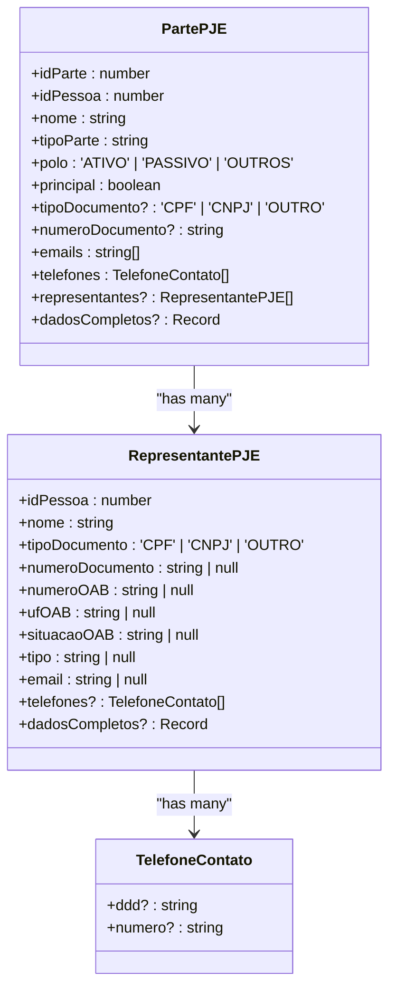
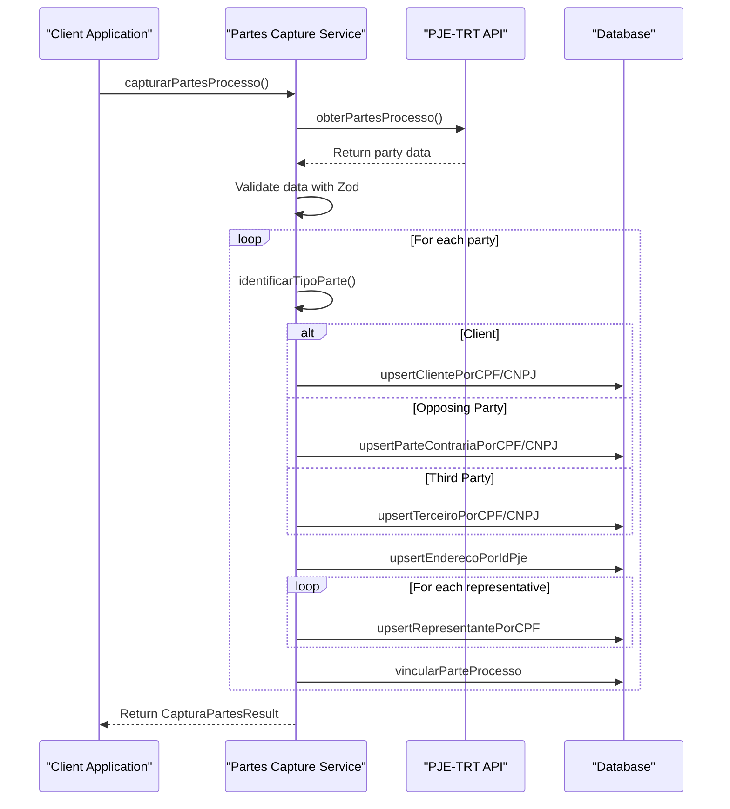
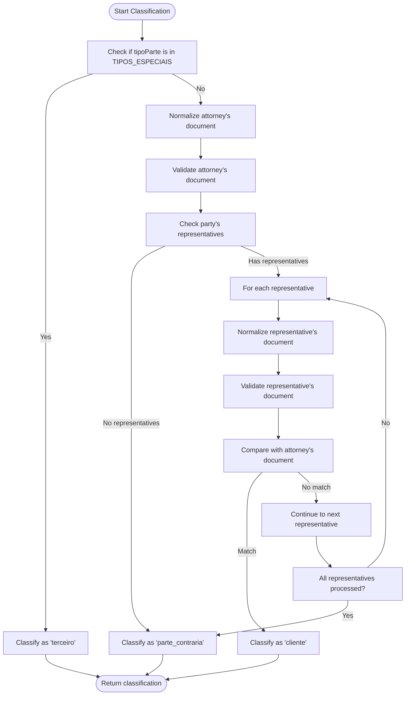
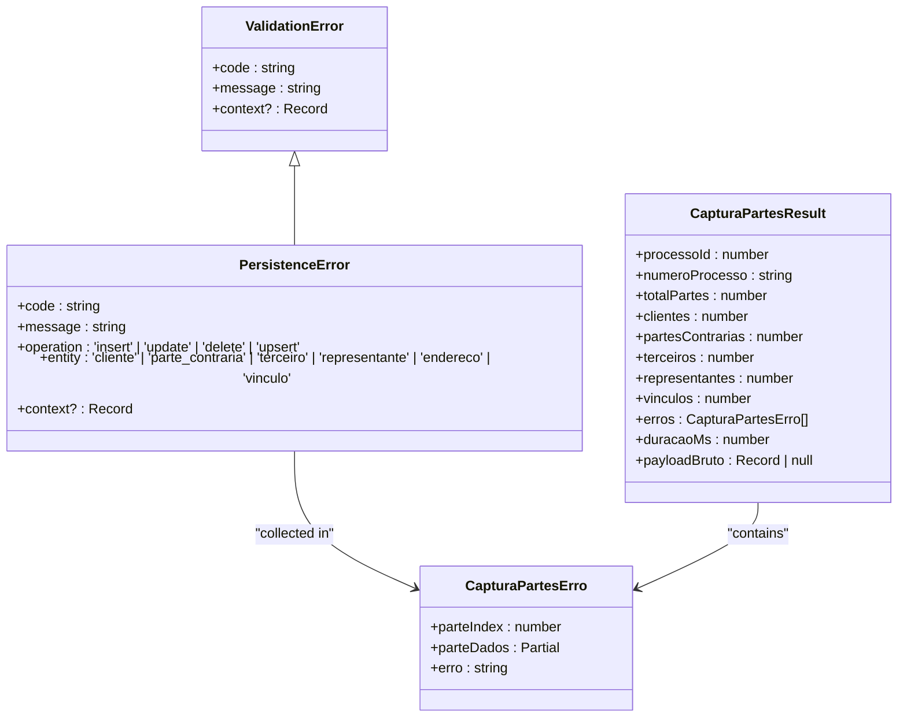
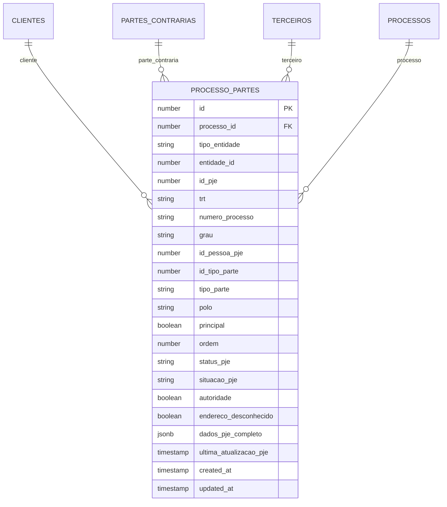

# Partes API Consistency

<cite>
**Referenced Files in This Document**   
- [obter-partes.ts](file://backend/api/pje-trt/partes/obter-partes.ts)
- [types.ts](file://backend/api/pje-trt/partes/types.ts)
- [partes-capture.service.ts](file://backend/captura/services/partes/partes-capture.service.ts)
- [identificacao-partes.service.ts](file://backend/captura/services/partes/identificacao-partes.service.ts)
- [schemas.ts](file://backend/captura/services/partes/schemas.ts)
- [config.ts](file://backend/captura/services/partes/config.ts)
- [processo-partes-persistence.service.ts](file://backend/processo-partes/services/persistence/processo-partes-persistence.service.ts)
- [errors.ts](file://backend/captura/services/partes/errors.ts)
- [index.ts](file://backend/api/pje-trt/partes/index.ts)
</cite>

## Table of Contents
1. [Introduction](#introduction)
2. [API Structure and Types](#api-structure-and-types)
3. [Partes Capture Service](#partes-capture-service)
4. [Part Classification Logic](#part-classification-logic)
5. [Data Validation and Error Handling](#data-validation-and-error-handling)
6. [Process-Part Relationship Management](#process-part-relationship-management)
7. [Configuration and Performance](#configuration-and-performance)
8. [Error Types and Handling](#error-types-and-handling)
9. [Conclusion](#conclusion)

## Introduction

The Partes API Consistency documentation provides a comprehensive overview of the implementation for capturing and managing party information from the PJE-TRT (Tribunal Regional do Trabalho) system. This system is responsible for identifying, classifying, and persisting parties involved in legal processes, ensuring data consistency across the application. The core functionality revolves around extracting party data from the PJE system, determining whether each party is a client, opposing party, or third party, and maintaining relationships between processes and entities. The implementation follows a modular architecture with clear separation of concerns between API interaction, business logic, data validation, and persistence layers.

**Section sources**
- [obter-partes.ts](file://backend/api/pje-trt/partes/obter-partes.ts#L1-L394)
- [partes-capture.service.ts](file://backend/captura/services/partes/partes-capture.service.ts#L1-L1334)

## API Structure and Types

The Partes API is structured around a well-defined type system that ensures consistency in data representation across the application. The API provides functions to retrieve party information from the PJE-TRT system and defines TypeScript interfaces that standardize the data format. The main entry point is the `obterPartesProcesso` function, which fetches all parties involved in a specific legal process. This function returns a standardized response format that includes both the processed party data and the raw payload from the PJE system for auditing purposes.

The type system defines two primary interfaces: `PartePJE` and `RepresentantePJE`. The `PartePJE` interface represents a party involved in a legal process and includes essential information such as identification details, contact information, and their role in the process. Key properties include `idParte` (unique identifier for the party in the process context), `idPessoa` (identifier for the person in the PJE system), `nome` (full name), `tipoParte` (role in the process such as AUTHOR, DEFENDANT, etc.), `polo` (litigation side: ACTIVE, PASSIVE, or OTHERS), and `principal` (flag indicating if the party is the principal in their litigation side). The interface also includes contact details like emails and telephone numbers, as well as an array of legal representatives.

The `RepresentantePJE` interface defines the structure for legal representatives (such as attorneys, public defenders, etc.) associated with a party. It includes identification information like `idPessoa`, `nome`, and document details (`tipoDocumento` and `numeroDocumento`), as well as professional information like OAB registration number (`numeroOAB`) and state (`ufOAB`). The interface also captures the representative's status and contact information. Both interfaces include a `dadosCompletos` property that stores the complete JSON response from the PJE API, which is crucial for debugging and audit purposes.

**Diagram sources **
- [types.ts](file://backend/api/pje-trt/partes/types.ts#L19-L176)

**Section sources**
- [types.ts](file://backend/api/pje-trt/partes/types.ts#L1-L176)
- [obter-partes.ts](file://backend/api/pje-trt/partes/obter-partes.ts#L60-L95)

## Partes Capture Service

The partes capture service orchestrates the complete workflow of retrieving party information from the PJE system and persisting it in the application's database. This service acts as the central component that coordinates API calls, business logic processing, data validation, and database operations. The service provides two main functions: `capturarPartesProcesso` for fetching and persisting party data in a single operation, and `persistirPartesProcesso` for persisting already retrieved party data without making additional API calls.

The capture process follows a well-defined sequence: first, it retrieves party data from the PJE API using the `obterPartesProcesso` function; then, for each party, it identifies the party type (client, opposing party, or third party) using the identification logic; next, it performs upsert operations to create or update the entity in the appropriate database table (clients, opposing parties, or third parties); it processes and saves the party's address information; it saves the legal representatives associated with the party; and finally, it creates a relationship between the process and the party in the `processo_partes` table. The service implements robust error handling, allowing partial success when some parties fail to process while others succeed.

The service is designed with performance and reliability in mind, incorporating features such as parallel processing of parties (with configurable concurrency limits), retry mechanisms for transient failures, and distributed locking to prevent race conditions. It also includes comprehensive logging at various levels (info, warning, debug) to facilitate monitoring and troubleshooting. The service returns a detailed result object that includes counters for successfully processed entities, a list of any errors encountered, and performance metrics.

**Diagram sources **
- [partes-capture.service.ts](file://backend/captura/services/partes/partes-capture.service.ts#L345-L564)

**Section sources**
- [partes-capture.service.ts](file://backend/captura/services/partes/partes-capture.service.ts#L1-L1334)
- [index.ts](file://backend/api/pje-trt/partes/index.ts#L1-L16)

## Part Classification Logic

The part classification logic is a critical component that determines whether a party in a legal process is a client, opposing party, or third party. This classification is essential for the application's functionality, as it determines how the party is treated in the system and what level of access and functionality is available. The classification follows a priority-based algorithm with three main criteria: special party types, representation by the office's attorney, and default classification as an opposing party.

The classification process begins by checking if the party's type is considered "special" according to a predefined list. Special party types include experts, public prosecutors, witnesses, and other auxiliary participants in the legal process. These parties are automatically classified as third parties regardless of other factors, as they have a distinct role that doesn't fit the client-opposing party dichotomy. The list of special types includes PERITO (expert), MINISTERIO_PUBLICO (public prosecutor), ASSISTENTE (assistant), TESTEMUNHA (witness), and others.

If the party is not a special type, the system then checks whether any of the party's legal representatives match the attorney associated with the credential used for the capture. This is done by comparing the CPF (individual taxpayer registry) or CNPJ (corporate taxpayer registry) of the representative with the document of the office's attorney. The comparison involves normalizing both documents by removing formatting characters (dots, hyphens, etc.) and validating that they have the correct length (11 digits for CPF, 14 for CNPJ). If a match is found, the party is classified as a client.

If neither of the above conditions is met, the party is classified as an opposing party by default. This classification logic ensures that parties represented by the office's attorneys are correctly identified as clients, while all others are treated as opposing parties unless they fall into a special category. The system includes validation to ensure that the attorney's document is valid before processing any parties, preventing errors due to incorrect credential information.

**Diagram sources **
- [identificacao-partes.service.ts](file://backend/captura/services/partes/identificacao-partes.service.ts#L130-L234)

**Section sources**
- [identificacao-partes.service.ts](file://backend/captura/services/partes/identificacao-partes.service.ts#L1-L449)
- [types.ts](file://backend/captura/services/partes/types.ts#L18-L35)

## Data Validation and Error Handling

The system implements a comprehensive data validation and error handling strategy to ensure data integrity and provide meaningful feedback when issues occur. Validation occurs at multiple levels, from the API response structure to individual field values, with different types of errors handled appropriately based on their severity and impact on the overall process.

At the API response level, the system uses Zod schemas to validate the structure and types of data received from the PJE system. The `PartePJESchema` and `RepresentantePJESchema` define the expected structure of party and representative data, including required fields, data types, and acceptable values for enumerated fields. These schemas are used to validate both individual party objects and arrays of parties, providing detailed error messages when validation fails. Notably, the system makes pragmatic decisions about validation strictness, such as not validating email formats because the PJE system accepts malformed emails, which would cause unnecessary failures.

Field-level validation is implemented for critical operations, particularly when processing attorney documents for party identification. The system validates that CPF and CNPJ numbers have the correct length (11 and 14 digits respectively) and are not sequences of identical digits (like "00000000000"), which are common invalid values. Document normalization functions remove formatting characters before comparison, ensuring consistent processing regardless of input format.

Error handling follows a tiered approach, with different error types for different failure modes. Validation errors are thrown when data doesn't meet structural requirements, while persistence errors are raised when database operations fail. The system distinguishes between fatal errors that should stop the entire process (like invalid attorney credentials) and recoverable errors that allow partial success (like failure to process a single party). When processing multiple parties, errors are collected in a list rather than stopping the entire operation, allowing the system to save successfully processed parties while recording information about failures for later analysis.

**Diagram sources **
- [errors.ts](file://backend/captura/services/partes/errors.ts#L9-L54)
- [schemas.ts](file://backend/captura/services/partes/schemas.ts#L1-L73)
- [types.ts](file://backend/captura/services/partes/types.ts#L57-L162)

**Section sources**
- [schemas.ts](file://backend/captura/services/partes/schemas.ts#L1-L73)
- [errors.ts](file://backend/captura/services/partes/errors.ts#L1-L54)
- [types.ts](file://backend/captura/services/partes/types.ts#L57-L162)

## Process-Part Relationship Management

The system manages the relationship between legal processes and parties through the `processo_partes` table, which serves as a junction table in a many-to-many relationship. This relationship is crucial for connecting processes with the various entities (clients, opposing parties, or third parties) involved in them, enabling efficient queries for both process participants and entity-related processes.

The relationship management is handled by the `processo-partes-persistence.service.ts` file, which provides functions for creating, updating, and deleting these relationships. The `criarProcessoParte` function creates a new relationship with comprehensive validation of all required fields, including `processo_id`, `tipo_entidade`, `entidade_id`, `grau`, `tipo_parte`, `polo`, `principal`, and `ordem`. The service enforces a unique constraint on the combination of `processo_id`, `tipo_entidade`, `entidade_id`, and `grau`, preventing duplicate relationships.

The service also provides query functions to retrieve data from both directions of the relationship. The `buscarPartesPorProcesso` function returns all parties of a specific process with their complete entity data, while the `buscarProcessosPorEntidade` function returns all processes associated with a specific entity. These functions support filtering and sorting, with results ordered by litigation side (`polo`) and order (`ordem`) for process participants, and by creation date for entity-related processes.

The relationship data includes both identification information and metadata from the PJE system. Identification fields include the process ID, entity type and ID, PJE identifiers, and tribunal information. Metadata fields capture the party's role in the process (`tipo_parte`), litigation side (`polo`), whether they are the principal party (`principal`), and their order in the relationship (`ordem`). The service also stores the complete raw JSON from the PJE system in the `dados_pje_completo` field for auditing and debugging purposes.

**Diagram sources **
- [processo-partes-persistence.service.ts](file://backend/processo-partes/services/persistence/processo-partes-persistence.service.ts#L134-L204)

**Section sources**
- [processo-partes-persistence.service.ts](file://backend/processo-partes/services/persistence/processo-partes-persistence.service.ts#L1-L701)

## Configuration and Performance

The partes capture system is highly configurable, with settings that can be adjusted through environment variables to optimize performance and behavior for different environments and use cases. The configuration is centralized in the `config.ts` file and covers various aspects including concurrency, retry mechanisms, performance monitoring, and feature flags.

Concurrency settings control the parallel processing of parties and representatives. The `MAX_CONCURRENT_PARTES` configuration determines how many parties are processed simultaneously, with a default value that can be overridden by the `CAPTURA_MAX_CONCURRENT_PARTES` environment variable. Similarly, `MAX_CONCURRENT_REPRESENTANTES` controls the concurrency for processing representatives of each party. These settings allow the system to balance resource utilization and performance, preventing overwhelming the database or external APIs with too many concurrent operations.

The retry mechanism is configurable with parameters that control the number of retry attempts (`RETRY_MAX_ATTEMPTS`), the base delay between retries (`RETRY_BASE_DELAY_MS`), and the maximum delay (`RETRY_MAX_DELAY_MS`). This exponential backoff strategy helps the system recover from transient failures such as network issues or temporary database unavailability. Feature flags like `ENABLE_PARALLEL_PROCESSING`, `ENABLE_DISTRIBUTED_LOCK`, and `ENABLE_RETRY` allow these capabilities to be toggled on or off as needed.

Performance monitoring is built into the system with a configurable threshold (`PERFORMANCE_THRESHOLD_MS`) that triggers warnings when processing time exceeds the specified limit. This helps identify performance issues and potential bottlenecks. The system also includes logging configuration with options to control the log level and whether to include complete payloads in logs, which is useful for debugging but can be disabled in production to reduce log volume.

```mermaid
flowchart TD
Config[Configuration] --> Concurrency["Concurrency Settings"]
Config --> Retry["Retry Settings"]
Config --> Locking["Locking Settings"]
Config --> Validation["Validation Settings"]
Config --> Logging["Logging Settings"]
Config --> Features["Feature Flags"]
Concurrency --> MAX_CONCURRENT_PARTES["MAX_CONCURRENT_PARTES"]
Concurrency --> MAX_CONCURRENT_REPS["MAX_CONCURRENT_REPRESENTANTES"]
Retry --> RETRY_MAX_ATTEMPTS["RETRY_MAX_ATTEMPTS"]
Retry --> RETRY_BASE_DELAY_MS["RETRY_BASE_DELAY_MS"]
Retry --> RETRY_MAX_DELAY_MS["RETRY_MAX_DELAY_MS"]
Locking --> LOCK_TTL_SECONDS["LOCK_TTL_SECONDS"]
Locking --> LOCK_ACQUIRE_TIMEOUT_MS["LOCK_ACQUIRE_TIMEOUT_MS"]
Validation --> STRICT_VALIDATION["STRICT_VALIDATION"]
Validation --> VALIDATE_REQUIRED_FIELDS["VALIDATE_REQUIRED_FIELDS"]
Logging --> LOG_LEVEL["LOG_LEVEL"]
Logging --> LOG_PAYLOADS["LOG_PAYLOADS"]
Features --> ENABLE_PARALLEL_PROCESSING["ENABLE_PARALLEL_PROCESSING"]
Features --> ENABLE_DISTRIBUTED_LOCK["ENABLE_DISTRIBUTED_LOCK"]
Features --> ENABLE_RETRY["ENABLE_RETRY"]
```

**Diagram sources **
- [config.ts](file://backend/captura/services/partes/config.ts#L6-L69)

**Section sources**
- [config.ts](file://backend/captura/services/partes/config.ts#L1-L100)

## Error Types and Handling

The system implements a comprehensive error handling strategy with custom error classes that provide detailed information about different types of failures. These error types are designed to facilitate debugging, monitoring, and appropriate error recovery strategies. The error hierarchy is structured to distinguish between different categories of errors, with specific error types for validation issues, persistence problems, and other operational failures.

The base error class is `CapturaPartesError`, which serves as the foundation for all custom errors in the partes capture system. This class includes properties for an error code, message, and optional context data, and provides a `toJSON` method for structured logging. It extends the native JavaScript `Error` class and captures the stack trace for debugging purposes.

Derived from this base class are more specific error types such as `ValidationError` and `PersistenceError`. The `ValidationError` is used when data fails to meet structural or format requirements, such as when API responses don't match expected schemas or when required fields are missing. The `PersistenceError` is thrown when database operations fail, and includes additional properties to identify the specific operation (insert, update, delete, upsert) and entity type involved.

The system also includes utility functions for error extraction and handling. The `extractErrorInfo` function converts various error types into a standardized format for consistent logging and reporting. Error handling is implemented at multiple levels, with lower-level operations throwing specific errors that are caught and potentially transformed by higher-level functions. This allows the system to provide meaningful error messages while maintaining the ability to recover from certain types of failures and continue processing other data.

**Section sources**
- [errors.ts](file://backend/captura/services/partes/errors.ts#L9-L54)
- [partes-capture.service.ts](file://backend/captura/services/partes/partes-capture.service.ts#L20-L21)

## Conclusion

The Partes API Consistency implementation demonstrates a robust and well-structured approach to capturing and managing party information from the PJE-TRT system. The system's architecture follows sound software engineering principles with clear separation of concerns, modular design, and comprehensive error handling. The type system ensures data consistency across the application, while the validation and error handling mechanisms maintain data integrity and provide meaningful feedback when issues occur.

Key strengths of the implementation include its flexibility through configurable settings, its resilience through retry mechanisms and partial failure handling, and its maintainability through well-documented code and clear separation of concerns. The system effectively addresses the complex requirements of legal process management, accurately classifying parties, maintaining relationships between processes and entities, and preserving audit trails through the storage of raw API responses.

The implementation could be further enhanced by adding more sophisticated conflict resolution strategies for concurrent updates, implementing more granular monitoring and alerting for performance issues, and expanding the validation rules to include business logic constraints beyond structural validation. However, the current implementation provides a solid foundation for reliable and consistent management of party information in legal processes.