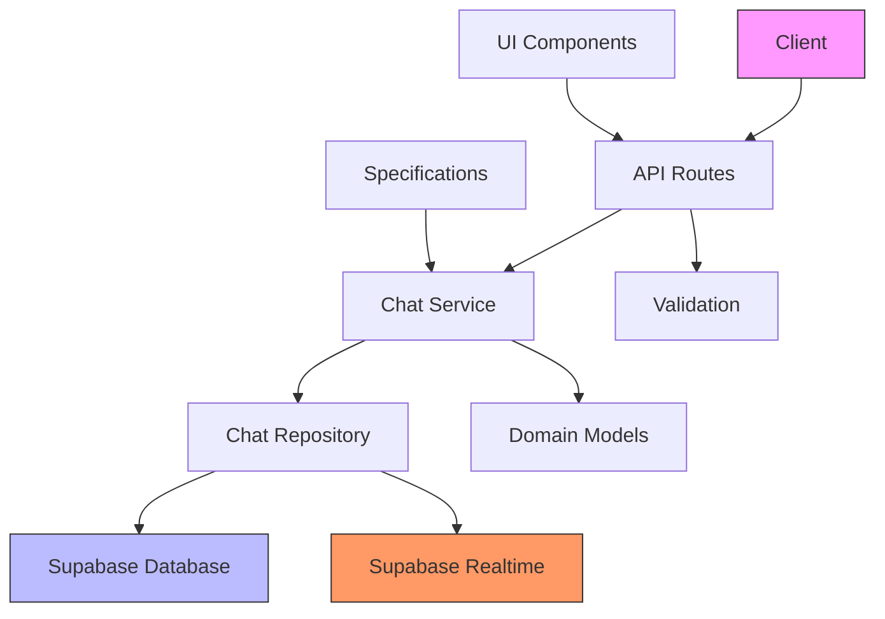
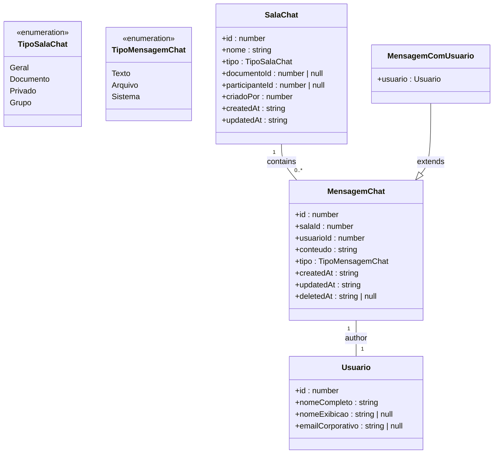
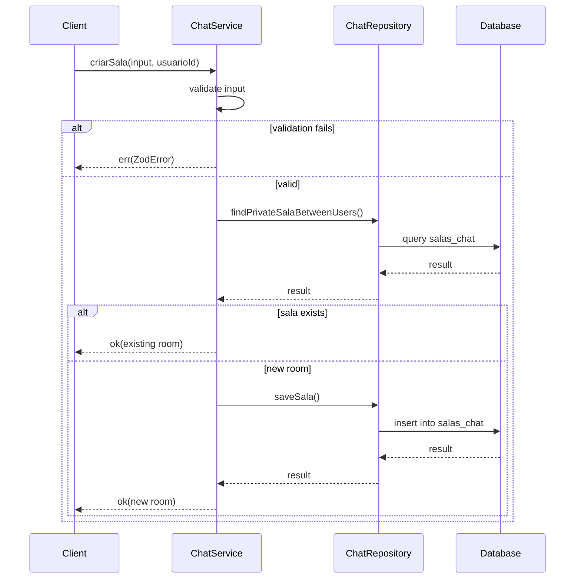
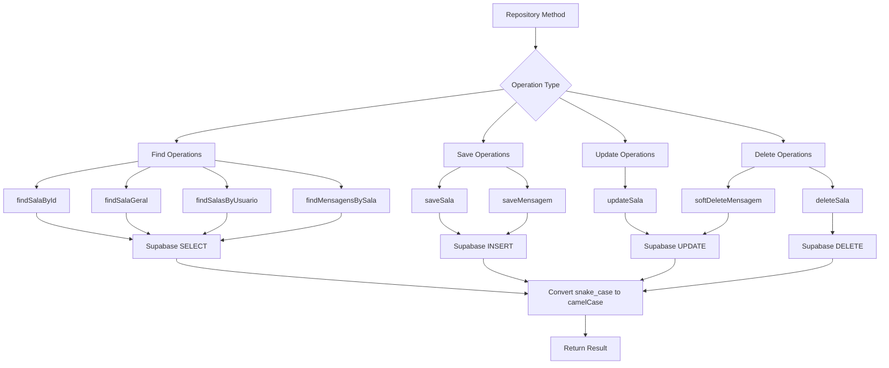
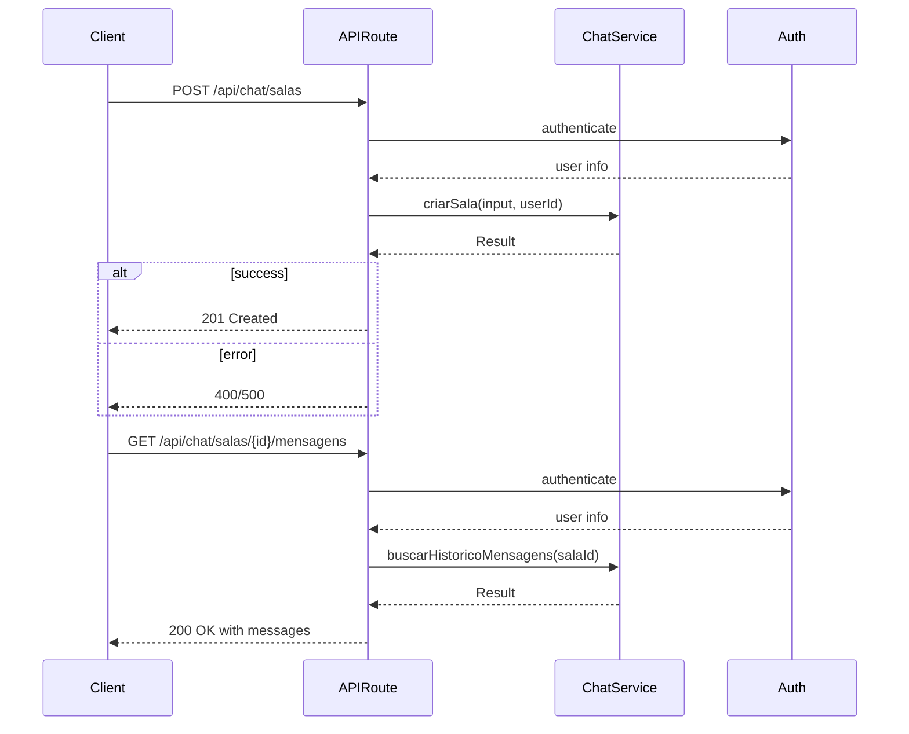
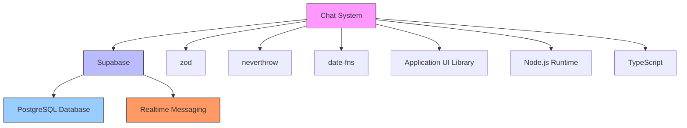

# Chat Domain-Driven Design

<cite>
**Referenced Files in This Document**   
- [domain.ts](file://src/core/chat/domain.ts)
- [service.ts](file://src/core/chat/service.ts)
- [repository.ts](file://src/core/chat/repository.ts)
- [chat-interface.tsx](file://src/components/chat/chat-interface.tsx)
- [chat-room.tsx](file://src/components/chat/chat-room.tsx)
- [room-list.tsx](file://src/components/chat/room-list.tsx)
- [create-room-dialog.tsx](file://src/components/chat/create-room-dialog.tsx)
- [route.ts](file://src/app/api/chat/salas/route.ts)
- [route.ts](file://src/app/api/chat/salas/[id]/route.ts)
- [route.ts](file://src/app/api/chat/salas/[id]/mensagens/route.ts)
- [spec.md](file://openspec/specs/chat-interno/spec.md)
</cite>

## Table of Contents
1. [Introduction](#introduction)
2. [Project Structure](#project-structure)
3. [Core Components](#core-components)
4. [Architecture Overview](#architecture-overview)
5. [Detailed Component Analysis](#detailed-component-analysis)
6. [Dependency Analysis](#dependency-analysis)
7. [Performance Considerations](#performance-considerations)
8. [Troubleshooting Guide](#troubleshooting-guide)
9. [Conclusion](#conclusion)

## Introduction
The Chat Domain-Driven Design documentation provides a comprehensive overview of the chat system architecture within the Sinesys application. This system enables real-time communication through various chat room types, including general, document-specific, and private conversations. The implementation follows domain-driven design principles with clear separation between domain models, services, and repositories. The chat functionality is deeply integrated with the Supabase realtime platform for instant message delivery and presence detection, while maintaining data consistency through PostgreSQL persistence. This documentation explores the complete chat domain implementation, from business requirements to technical execution.

## Project Structure
The chat functionality is organized across multiple directories following a domain-driven design approach. The core business logic resides in the `src/core/chat` directory, which contains domain models, service implementations, and repository patterns. UI components are located in `src/components/chat`, providing reusable chat interfaces, room lists, and dialogs. API routes in `src/app/api/chat/salas` handle HTTP requests for chat operations. The system also includes specification documents in `openspec/specs/chat-interno` that define requirements and scenarios. This structure maintains separation of concerns while enabling reuse across different parts of the application that require chat functionality.

```mermaid
graph TD
A[Chat Domain] --> B[Core Logic]
A --> C[UI Components]
A --> D[API Routes]
A --> E[Specifications]
B --> F[domain.ts]
B --> G[service.ts]
B --> H[repository.ts]
C --> I[chat-interface.tsx]
C --> J[chat-room.tsx]
C --> K[room-list.tsx]
C --> L[create-room-dialog.tsx]
D --> M[salas/route.ts]
D --> N[salas/[id]/route.ts]
D --> O[salas/[id]/mensagens/route.ts]
E --> P[spec.md]
```

**Diagram sources**
- [domain.ts](file://src/core/chat/domain.ts)
- [service.ts](file://src/core/chat/service.ts)
- [repository.ts](file://src/core/chat/repository.ts)
- [chat-interface.tsx](file://src/components/chat/chat-interface.tsx)
- [chat-room.tsx](file://src/components/chat/chat-room.tsx)
- [room-list.tsx](file://src/components/chat/room-list.tsx)
- [create-room-dialog.tsx](file://src/components/chat/create-room-dialog.tsx)
- [route.ts](file://src/app/api/chat/salas/route.ts)

**Section sources**
- [domain.ts](file://src/core/chat/domain.ts)
- [service.ts](file://src/core/chat/service.ts)
- [repository.ts](file://src/core/chat/repository.ts)
- [chat-interface.tsx](file://src/components/chat/chat-interface.tsx)
- [chat-room.tsx](file://src/components/chat/chat-room.tsx)
- [room-list.tsx](file://src/components/chat/room-list.tsx)
- [create-room-dialog.tsx](file://src/components/chat/create-room-dialog.tsx)
- [route.ts](file://src/app/api/chat/salas/route.ts)

## Core Components
The chat system consists of several core components that work together to provide real-time communication capabilities. The domain layer defines the fundamental entities and validation rules for chat rooms and messages. The service layer implements business logic for creating rooms, sending messages, and managing chat interactions. The repository layer handles data persistence and retrieval through Supabase integration. UI components provide reusable interfaces for chat functionality across the application. API routes expose endpoints for client interactions, while specification documents outline requirements and scenarios. Together, these components create a robust chat system that supports various conversation types and integrates seamlessly with other application features.

**Section sources**
- [domain.ts](file://src/core/chat/domain.ts)
- [service.ts](file://src/core/chat/service.ts)
- [repository.ts](file://src/core/chat/repository.ts)
- [chat-interface.tsx](file://src/components/chat/chat-interface.tsx)
- [chat-room.tsx](file://src/components/chat/chat-room.tsx)

## Architecture Overview
The chat system follows a clean architecture pattern with clear separation between layers. At the core are domain models that define chat entities and their relationships. Surrounding this are services that implement business rules and coordinate operations. The repository layer abstracts data access, providing a consistent interface to the underlying Supabase database. API routes expose functionality to clients, while UI components consume these services to create interactive chat experiences. The system leverages Supabase Realtime for instant message delivery and presence detection, ensuring users receive updates immediately. This architecture enables maintainability, testability, and scalability while supporting the various chat requirements defined in the specifications.



**Diagram sources**
- [domain.ts](file://src/core/chat/domain.ts)
- [service.ts](file://src/core/chat/service.ts)
- [repository.ts](file://src/core/chat/repository.ts)
- [route.ts](file://src/app/api/chat/salas/route.ts)
- [chat-interface.tsx](file://src/components/chat/chat-interface.tsx)

## Detailed Component Analysis

### Domain Model Analysis
The domain model defines the fundamental entities and rules for the chat system. It includes enums for chat room types and message types, interfaces for chat rooms and messages, and validation schemas to ensure data integrity. The model enforces business rules such as requiring a document ID for document-specific rooms and a participant ID for private conversations. It also defines parameter types for listing operations, enabling consistent filtering and pagination across the system.



**Diagram sources**
- [domain.ts](file://src/core/chat/domain.ts)

**Section sources**
- [domain.ts](file://src/core/chat/domain.ts)

### Service Layer Analysis
The service layer implements the business logic for chat operations, coordinating between the domain models and repository. It handles room creation with validation to prevent duplicate private conversations, message sending with proper authorization checks, and various retrieval operations. The service enforces business rules such as preventing the creation of general rooms through the API and restricting room name changes to group creators. It uses the neverthrow library for functional error handling, returning Result types that make error conditions explicit and easy to handle.



**Diagram sources**
- [service.ts](file://src/core/chat/service.ts)
- [repository.ts](file://src/core/chat/repository.ts)

**Section sources**
- [service.ts](file://src/core/chat/service.ts)

### Repository Layer Analysis
The repository layer provides an abstraction over data access operations, encapsulating the details of database interactions. It uses Supabase as the underlying persistence mechanism, handling CRUD operations for chat rooms and messages. The repository converts between snake_case database format and camelCase application format, ensuring consistency across the system. It implements pagination for listing operations and handles soft deletion of messages by updating a deleted_at timestamp and replacing content with a placeholder. The repository also includes specialized queries for finding specific room types, such as the general room or private conversations between users.



**Diagram sources**
- [repository.ts](file://src/core/chat/repository.ts)

**Section sources**
- [repository.ts](file://src/core/chat/repository.ts)

### UI Components Analysis
The UI components provide reusable interfaces for chat functionality across the application. The chat-interface component serves as a wrapper that integrates with Supabase Realtime Chat, handling message conversion and persistence. The chat-room component displays a complete chat interface with message history, typing indicators, and message input. The room-list component renders a list of available chat rooms with notification badges for unread messages. The create-room-dialog component provides a form for creating new chat rooms. These components follow React best practices with proper state management, error handling, and accessibility features.

```mermaid
componentDiagram
component "ChatInterface" as CI
component "ChatRoom" as CR
component "RoomList" as RL
component "CreateRoomDialog" as CRD
CI --> CR : uses
CI --> RL : uses
CI --> CRD : uses
CR --> "Supabase Realtime" : subscribes
CR --> "API Routes" : fetches messages
CR --> "NotificationProvider" : context
RL --> "NotificationBadge" : uses
RL --> "SidebarNotification" : uses
CRD --> "Dialog" : uses
CRD --> "Form Controls" : uses
CRD --> "Toast" : uses
CI .> "RealtimeChat" : integrates with
CR .> "ScrollArea" : uses
CR .> "Avatar" : uses
CR .> "Input" : uses
CR .> "Button" : uses
```

**Diagram sources**
- [chat-interface.tsx](file://src/components/chat/chat-interface.tsx)
- [chat-room.tsx](file://src/components/chat/chat-room.tsx)
- [room-list.tsx](file://src/components/chat/room-list.tsx)
- [create-room-dialog.tsx](file://src/components/chat/create-room-dialog.tsx)

**Section sources**
- [chat-interface.tsx](file://src/components/chat/chat-interface.tsx)
- [chat-room.tsx](file://src/components/chat/chat-room.tsx)
- [room-list.tsx](file://src/components/chat/room-list.tsx)
- [create-room-dialog.tsx](file://src/components/chat/create-room-dialog.tsx)

### API Routes Analysis
The API routes provide endpoints for client interactions with the chat system. The routes follow REST conventions with clear resource hierarchies. The main route handles room creation and listing, while the [id] route manages individual room operations such as retrieval and deletion. The mensagens subroute handles message operations for a specific room, including sending new messages and retrieving message history. These routes integrate with the service layer to enforce business rules and with authentication mechanisms to ensure proper authorization.



**Diagram sources**
- [route.ts](file://src/app/api/chat/salas/route.ts)
- [route.ts](file://src/app/api/chat/salas/[id]/route.ts)
- [route.ts](file://src/app/api/chat/salas/[id]/mensagens/route.ts)

**Section sources**
- [route.ts](file://src/app/api/chat/salas/route.ts)
- [route.ts](file://src/app/api/chat/salas/[id]/route.ts)
- [route.ts](file://src/app/api/chat/salas/[id]/mensagens/route.ts)

## Dependency Analysis
The chat system has well-defined dependencies that enable its functionality while maintaining separation of concerns. It depends on Supabase for database persistence and realtime messaging, using the Supabase client library to interact with these services. The system uses zod for data validation, neverthrow for functional error handling, and date-fns for date formatting. UI components depend on the application's component library for consistent styling and behavior. The service layer depends on the repository layer, which in turn depends on the Supabase client. This dependency structure ensures that business logic remains independent of implementation details while allowing for easy testing and maintenance.



**Diagram sources**
- [package.json](file://package.json)
- [service.ts](file://src/core/chat/service.ts)
- [repository.ts](file://src/core/chat/repository.ts)

**Section sources**
- [package.json](file://package.json)

## Performance Considerations
The chat system incorporates several performance optimizations to ensure responsive user experiences. Message retrieval uses pagination to limit the amount of data transferred, with initial loads fetching only the most recent messages. The system implements infinite scrolling for accessing older messages, loading additional batches as needed. Database queries are optimized with appropriate indexing, particularly on foreign keys and timestamp fields used for sorting. The realtime functionality reduces the need for polling, ensuring immediate message delivery with minimal network overhead. UI components use React's optimization techniques, such as memoization and lazy loading, to minimize re-renders and improve responsiveness.

## Troubleshooting Guide
When troubleshooting issues with the chat system, start by verifying the Supabase connection and authentication status, as these are common sources of problems. Check browser developer tools for network errors or console messages that may indicate issues with API calls or realtime connections. For missing messages, verify that the correct room ID is being used and that the user has appropriate permissions to access the room. If realtime updates are not working, ensure that the Supabase Realtime subscription is properly established and that firewall settings are not blocking WebSocket connections. For performance issues, review database query patterns and consider adding indexes on frequently queried fields. When creating new rooms, ensure that required fields are provided and that validation rules are satisfied.

**Section sources**
- [service.ts](file://src/core/chat/service.ts)
- [repository.ts](file://src/core/chat/repository.ts)
- [chat-interface.tsx](file://src/components/chat/chat-interface.tsx)
- [chat-room.tsx](file://src/components/chat/chat-room.tsx)

## Conclusion
The Chat Domain-Driven Design implementation in the Sinesys application provides a robust and scalable foundation for real-time communication. By following domain-driven design principles, the system maintains clear separation between business logic, data access, and presentation layers. The integration with Supabase enables reliable realtime messaging and presence detection, while the well-defined API routes and reusable UI components facilitate consistent implementation across different parts of the application. The system supports various chat room types and includes features such as typing indicators, message history, and notification badges to enhance the user experience. With its modular architecture and comprehensive error handling, the chat system is well-positioned to support future enhancements and evolving requirements.