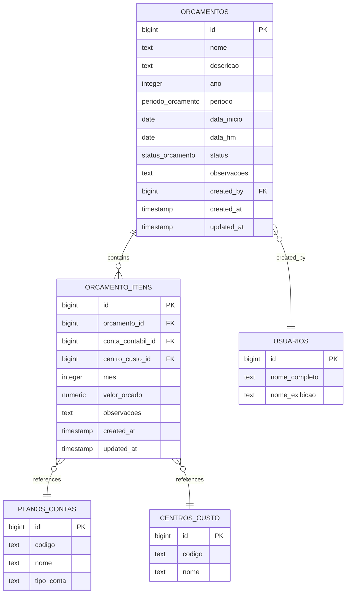
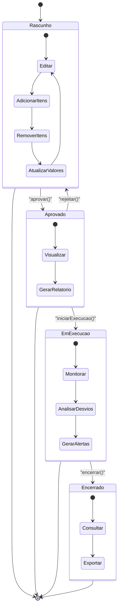
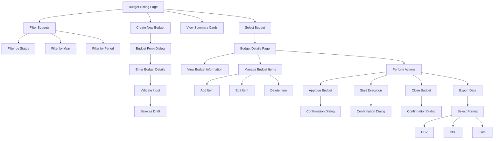

# Budgeting

<cite>
**Referenced Files in This Document**   
- [orcamentos.tsx](file://app/(dashboard)/financeiro/orcamentos/page.tsx)
- [orcamentos.sql](file://supabase/schemas/32_orcamento.sql)
- [orcamento-form-dialog.tsx](file://app/(dashboard)/financeiro/orcamentos/components/orcamento-form-dialog.tsx)
- [orcamento-item-dialog.tsx](file://app/(dashboard)/financeiro/orcamentos/components/orcamento-item-dialog.tsx)
- [gerenciar-orcamento.service.ts](file://backend/financeiro/orcamento/services/orcamento/gerenciar-orcamento.service.ts)
- [aprovar-orcamento.service.ts](file://backend/financeiro/orcamento/services/orcamento/aprovar-orcamento.service.ts)
- [executar-orcamento.service.ts](file://backend/financeiro/orcamento/services/orcamento/executar-orcamento.service.ts)
- [orcamento-persistence.service.ts](file://backend/financeiro/orcamento/services/persistence/orcamento-persistence.service.ts)
- [use-orcamentos.ts](file://app/_lib/hooks/use-orcamentos.ts)
- [financeiro.ts](file://types/domain/financeiro.ts)
</cite>

## Table of Contents
1. [Introduction](#introduction)
2. [Domain Model Structure](#domain-model-structure)
3. [Budget Lifecycle](#budget-lifecycle)
4. [Financial Planning Capabilities](#financial-planning-capabilities)
5. [Interfaces for Budget Management](#interfaces-for-budget-management)
6. [Relationship with Financial Obligations and Revenue](#relationship-with-financial-obligations-and-revenue)
7. [Validation Rules and Budget Variance Calculation](#validation-rules-and-budget-variance-calculation)
8. [Integration with Financial Reporting](#integration-with-financial-reporting)
9. [Handling Budget Revisions](#handling-budget-revisions)
10. [Conclusion](#conclusion)

## Introduction
The Budgeting sub-feature within the Financial Domain provides a comprehensive system for managing financial planning and control in a legal management environment. This documentation details the implementation of budget management, covering the domain model structure, budget lifecycle, and financial planning capabilities. The system enables users to create, approve, and execute budgets while maintaining integration with financial obligations, revenue projections, and expense tracking. The implementation includes robust validation rules, budget variance calculations, and reporting integration to support effective financial decision-making. This documentation is designed to be accessible to beginners while providing sufficient technical depth for experienced developers.

## Domain Model Structure
The budgeting system is built around two core entities: `orcamentos` (budgets) and `orcamento_itens` (budget items). The `orcamentos` table represents the main budget entity with attributes such as name, description, year, period, status, and date range. Each budget can be annual, semi-annual, quarterly, or monthly, defined by the `periodo_orcamento` enum. The `status_orcamento` enum tracks the budget lifecycle with states including 'rascunho' (draft), 'aprovado' (approved), 'em_execucao' (in execution), and 'encerrado' (closed).

Budget items are stored in the `orcamento_itens` table, which establishes a one-to-many relationship with budgets. Each item is associated with a specific account from the chart of accounts (`plano_contas`) and optionally with a cost center (`centros_custo`). Items can be defined for a specific month or represent the total amount for the entire budget period when the month field is null. This flexible structure allows for both detailed monthly planning and high-level period budgeting.

The domain model supports comprehensive financial planning by linking budget allocations to specific accounts and cost centers, enabling granular tracking and analysis. The system also maintains audit information including creation and modification timestamps, as well as user references for accountability.

**Diagram sources**
- [orcamentos.sql](file://supabase/schemas/32_orcamento.sql#L15-L216)

**Section sources**
- [orcamentos.sql](file://supabase/schemas/32_orcamento.sql#L15-L216)

## Budget Lifecycle
The budget lifecycle in the system follows a well-defined progression through four distinct states: draft, approved, in execution, and closed. When a budget is first created, it enters the 'rascunho' (draft) state, allowing users to modify its details and add budget items. During this phase, users can edit the budget name, description, date range, and add or modify budget items. The draft state provides maximum flexibility for financial planning and adjustments.

To advance to the 'aprovado' (approved) state, the budget must pass validation checks including having at least one budget item and a total budgeted amount greater than zero. The approval process is initiated through the `aprovarOrcamento` service, which validates these conditions and updates the budget status. Once approved, the budget cannot be modified in terms of its core attributes like name or date range, though additional metadata like observations can still be added.

The next stage is 'em_execucao' (in execution), which is initiated when the user starts executing the budget. This transition is managed by the `iniciarExecucao` service, which verifies that the budget is currently approved and that no other budget is already in execution for the same period. During execution, the system compares actual financial transactions against the budgeted amounts, enabling real-time variance analysis and financial monitoring.

Finally, the budget can be moved to the 'encerrado' (closed) state when the planning period ends or is otherwise concluded. The `encerrarOrcamento` service handles this transition, generating a final summary that includes total budgeted amounts, actual expenditures, and variance percentages. Closed budgets become read-only for historical reference and reporting purposes, preserving the financial planning record while preventing further modifications.

**Diagram sources**
- [gerenciar-orcamento.service.ts](file://backend/financeiro/orcamento/services/orcamento/gerenciar-orcamento.service.ts#L38-L184)
- [aprovar-orcamento.service.ts](file://backend/financeiro/orcamento/services/orcamento/aprovar-orcamento.service.ts#L23-L98)
- [executar-orcamento.service.ts](file://backend/financeiro/orcamento/services/orcamento/executar-orcamento.service.ts#L27-L80)

**Section sources**
- [gerenciar-orcamento.service.ts](file://backend/financeiro/orcamento/services/orcamento/gerenciar-orcamento.service.ts#L38-L184)
- [aprovar-orcamento.service.ts](file://backend/financeiro/orcamento/services/orcamento/aprovar-orcamento.service.ts#L23-L98)
- [executar-orcamento.service.ts](file://backend/financeiro/orcamento/services/orcamento/executar-orcamento.service.ts#L27-L80)

## Financial Planning Capabilities
The budgeting system provides comprehensive financial planning capabilities that support strategic decision-making and resource allocation. The system enables multi-level planning through its integration with the chart of accounts and cost centers, allowing organizations to create detailed budgets that align with their financial structure. Users can allocate funds to specific accounts such as revenue, expenses, assets, liabilities, and equity, while also distributing resources across different cost centers like departments, practice areas, or projects.

The planning interface supports both top-down and bottom-up approaches to budgeting. Users can start with high-level annual budgets and decompose them into quarterly or monthly allocations, or begin with detailed monthly projections that aggregate into annual totals. This flexibility accommodates different organizational planning methodologies and allows for scenario planning and what-if analysis. The system also supports comparative planning by enabling users to reference historical data and previous budgets when creating new financial plans.

A key planning capability is the ability to create budgets for different time periods, including monthly, quarterly, semi-annual, and annual cycles. This allows organizations to align their financial planning with operational cycles and reporting requirements. The system also supports rolling forecasts, where budgets can be updated periodically to reflect changing business conditions and improved estimates. This dynamic planning approach enhances financial agility and responsiveness to market changes.

The planning process is supported by real-time validation and feedback mechanisms. As users enter budget amounts, the system immediately validates the entries against business rules and provides instant feedback on potential issues. This interactive validation helps prevent errors and ensures data quality throughout the planning process. Additionally, the system provides summary views and key performance indicators during planning, giving users immediate insights into the financial implications of their decisions.

## Interfaces for Budget Management
The budget management interfaces provide a comprehensive set of tools for creating, editing, approving, and executing budgets. The primary interface is the budget listing page, which displays all budgets with key information including name, year, period, status, and total budgeted amount. Users can filter and sort budgets by various criteria such as status, year, or period, and can quickly access summary cards that show the count of budgets in each status category.

To create a new budget, users access the budget form dialog, which collects essential information including budget name, description, year, period, date range, and optional observations. The form includes client-side validation to ensure required fields are completed and dates are logical (end date after start date). Once submitted, the budget is saved in draft status, allowing users to add budget items before approval.

Budget items are managed through a dedicated item dialog that allows users to specify the account, cost center, budgeted amount, and any observations. The interface includes a hierarchical account selector that displays the chart of accounts with proper indentation, making it easy to navigate and select appropriate accounts. Amounts are formatted as currency with real-time formatting as users type, enhancing data entry accuracy.

The system provides multiple action interfaces depending on the budget status. Draft budgets can be edited, approved, or deleted. Approved budgets can be initiated for execution, while budgets in execution can be monitored and eventually closed. Each action is confirmed through modal dialogs to prevent accidental operations. The interface also includes export functionality that allows users to export budget data in various formats including CSV and PDF reports, facilitating sharing and external analysis.

**Diagram sources**
- [orcamentos.tsx](file://app/(dashboard)/financeiro/orcamentos/page.tsx#L1-L837)
- [orcamento-form-dialog.tsx](file://app/(dashboard)/financeiro/orcamentos/components/orcamento-form-dialog.tsx#L1-L385)
- [orcamento-item-dialog.tsx](file://app/(dashboard)/financeiro/orcamentos/components/orcamento-item-dialog.tsx#L1-L235)

**Section sources**
- [orcamentos.tsx](file://app/(dashboard)/financeiro/orcamentos/page.tsx#L1-L837)
- [orcamento-form-dialog.tsx](file://app/(dashboard)/financeiro/orcamentos/components/orcamento-form-dialog.tsx#L1-L385)
- [orcamento-item-dialog.tsx](file://app/(dashboard)/financeiro/orcamentos/components/orcamento-item-dialog.tsx#L1-L235)

## Relationship with Financial Obligations and Revenue
The budgeting system maintains critical relationships with financial obligations and revenue projections, creating an integrated financial management framework. Budget allocations serve as the planning baseline against which actual financial obligations (accounts payable) and revenue receipts (accounts receivable) are measured. This integration enables variance analysis, where actual expenditures and income are compared against budgeted amounts to identify deviations and inform financial decision-making.

When financial obligations are recorded in the system, they are automatically linked to the relevant budget items based on the account and cost center. This linkage allows the system to track commitment accounting, showing not only actual payments but also outstanding obligations against the budget. For example, when a vendor invoice is approved, the system can display how much of the budgeted amount for that account and cost center has been committed through outstanding invoices versus what remains available.

Revenue projections are similarly integrated with the budgeting system. The system can compare actual revenue collections against budgeted revenue targets, providing insights into sales performance and cash flow forecasting accuracy. This relationship is particularly valuable for law firms that operate on retainer agreements or contingency fees, as it allows them to monitor revenue realization against their financial plans.

The integration extends to financial reporting, where budget versus actual reports provide comprehensive views of financial performance. These reports can be generated at various levels of granularity, from high-level summaries to detailed account-by-account comparisons. The system also supports trend analysis by comparing current period performance against both budgeted amounts and historical data, enabling organizations to identify patterns and adjust their financial strategies accordingly.

## Validation Rules and Budget Variance Calculation
The budgeting system implements a comprehensive set of validation rules to ensure data integrity and financial accuracy. When creating or modifying budgets, the system validates that required fields are populated, date ranges are logical (end date after start date), and the budget year is reasonable (after 2020). For budget items, the system enforces that the account is valid, the budgeted amount is positive, and that there are no duplicate entries for the same account, cost center, and month combination.

During the approval process, additional validation rules are applied. The system verifies that the budget contains at least one item, that the total budgeted amount exceeds zero, and that the budget period has not already passed. These validations prevent the approval of incomplete or irrelevant budgets. When initiating execution, the system checks that no other budget is already in execution for the same period, preventing conflicts and ensuring clear financial accountability.

Budget variance calculation is a core feature of the system, providing insights into financial performance. The system calculates variance as the difference between actual expenditures/revenue and budgeted amounts, expressed both as an absolute value and as a percentage. For example, if a department budgeted $10,000 for office supplies but actually spent $12,000, the system would calculate a variance of -$2,000 or -20%. This calculation is performed automatically as financial transactions are recorded.

The system also calculates cumulative variance over time, showing how variances evolve throughout the budget period. This temporal analysis helps identify whether deviations are isolated incidents or part of a trend. Additionally, the system supports variance analysis by account and cost center, allowing managers to pinpoint specific areas of over- or under-spending. These calculations are used to generate alerts when variances exceed predefined thresholds, enabling proactive financial management.

## Integration with Financial Reporting
The budgeting system is tightly integrated with financial reporting capabilities, providing comprehensive insights into financial performance and planning effectiveness. The system generates various reports that compare budgeted amounts against actual financial results, enabling organizations to assess their financial health and operational efficiency. These reports are accessible through the budget analysis interface, which provides detailed views of budget versus actual performance.

The reporting integration includes several key components. First, the system generates standard budget versus actual reports that show planned versus realized amounts for each account and cost center. These reports can be filtered by time period, allowing for monthly, quarterly, or annual analysis. Second, the system produces variance reports that highlight significant deviations from the budget, helping managers identify areas requiring attention.

The integration also supports trend analysis by comparing current performance against both budgeted amounts and historical data. This multi-dimensional analysis provides context for financial results, showing whether performance improvements or declines are relative to plan or relative to past performance. The system can generate forecasts based on current trends and remaining budget, helping organizations anticipate future financial positions.

Reporting is available in multiple formats to support different use cases. Users can view reports directly in the application with interactive charts and tables, or export them to CSV, Excel, or PDF formats for sharing and archival. The export functionality preserves the formatting and calculations, ensuring consistency across different mediums. The system also supports scheduled reporting, where key budget performance metrics can be automatically generated and distributed to stakeholders on a regular basis.

## Handling Budget Revisions
The system provides structured processes for handling budget revisions while maintaining financial control and auditability. When circumstances change and the original budget needs adjustment, the system supports revision through a controlled workflow. Budget revisions can only be made to budgets in the draft state, ensuring that approved and executed budgets maintain their integrity as planning baselines.

The revision process begins by creating a new version of the budget, which inherits the structure and allocations from the original but allows for modifications. This approach preserves the historical record of the original budget while enabling updated planning. When making revisions, users can modify budget items, adjust amounts, or reallocate funds between accounts and cost centers. All changes are tracked with audit information, including who made the change and when.

For budgets that have already been approved, revisions require re-approval through the standard approval workflow. This ensures that significant changes to financial plans receive appropriate scrutiny and authorization. The system maintains a version history of budgets, allowing users to compare different versions and understand the evolution of the financial plan over time.

The system also supports partial revisions through the use of supplemental budgets. Instead of revising the entire budget, organizations can create additional budgets that modify specific portions of the original plan. This approach is useful for addressing specific changes, such as a new project or unexpected expense, without disrupting the overall financial plan. Supplemental budgets are linked to the original budget and consolidated in reporting, providing a complete view of the organization's financial position.

## Conclusion
The budgeting implementation in the Financial Domain provides a robust and comprehensive system for financial planning and control. The domain model, centered around budgets and budget items, supports detailed financial planning with integration to accounts and cost centers. The well-defined budget lifecycle ensures proper governance and control throughout the planning process, from creation through execution and closure.

The system's interfaces provide intuitive tools for managing budgets, with appropriate validation and confirmation mechanisms to prevent errors. Integration with financial obligations and revenue tracking enables comprehensive performance monitoring and variance analysis. The reporting capabilities transform budget data into actionable insights, supporting informed decision-making.

For developers, the implementation follows a clean architecture with separation of concerns between persistence, business logic, and presentation layers. The use of TypeScript interfaces ensures type safety across the application, while the service-oriented design promotes reusability and testability. The system's validation rules and error handling provide a robust foundation for reliable financial management.

Overall, the budgeting sub-feature delivers a powerful solution for financial planning in a legal management context, balancing ease of use with comprehensive functionality to support effective financial stewardship.