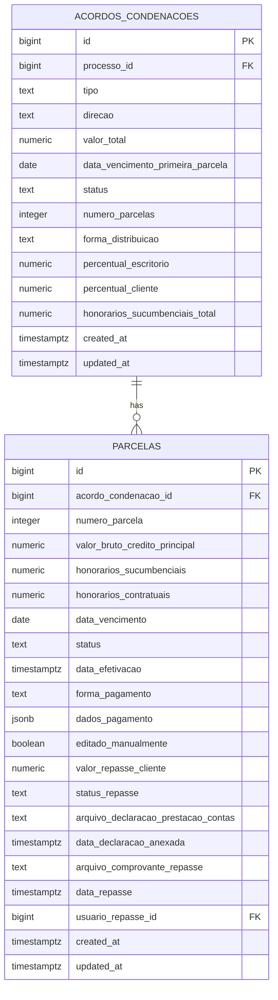
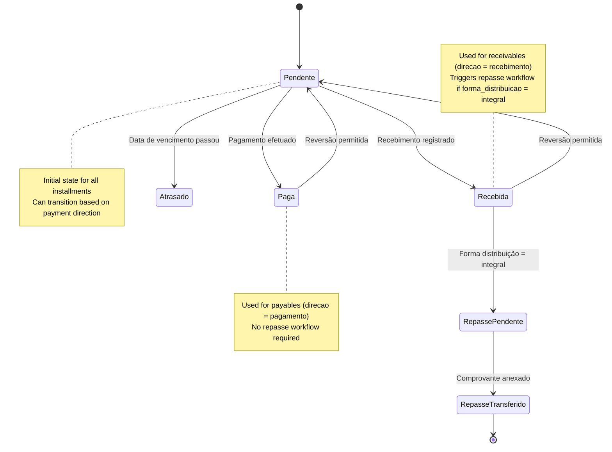
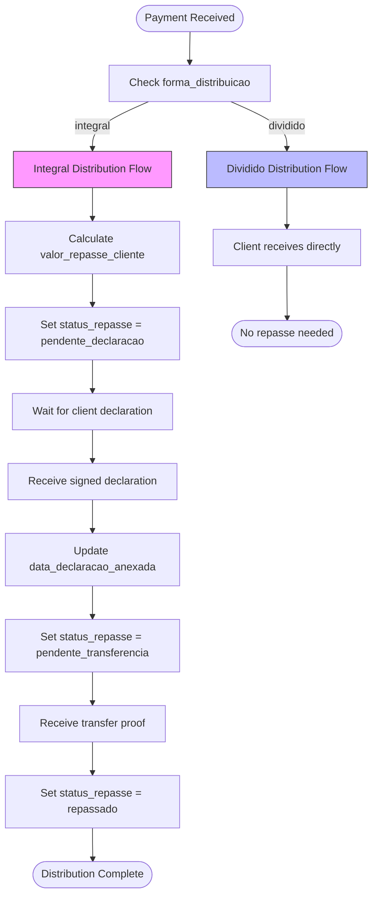
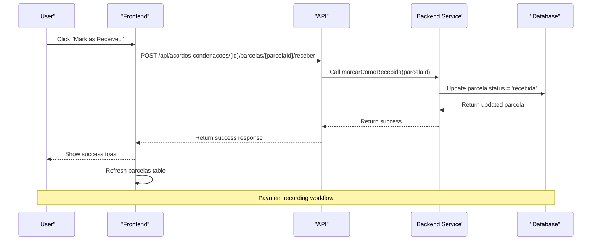
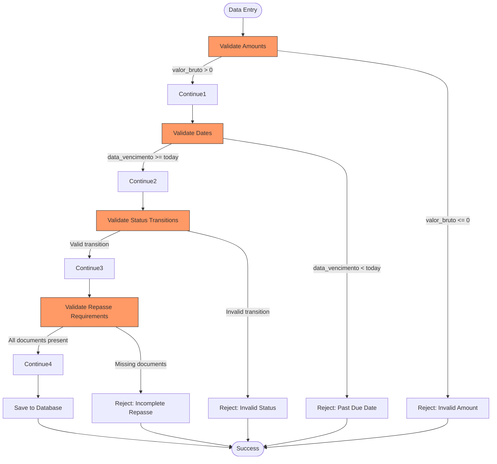
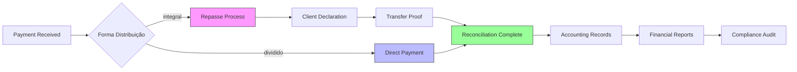
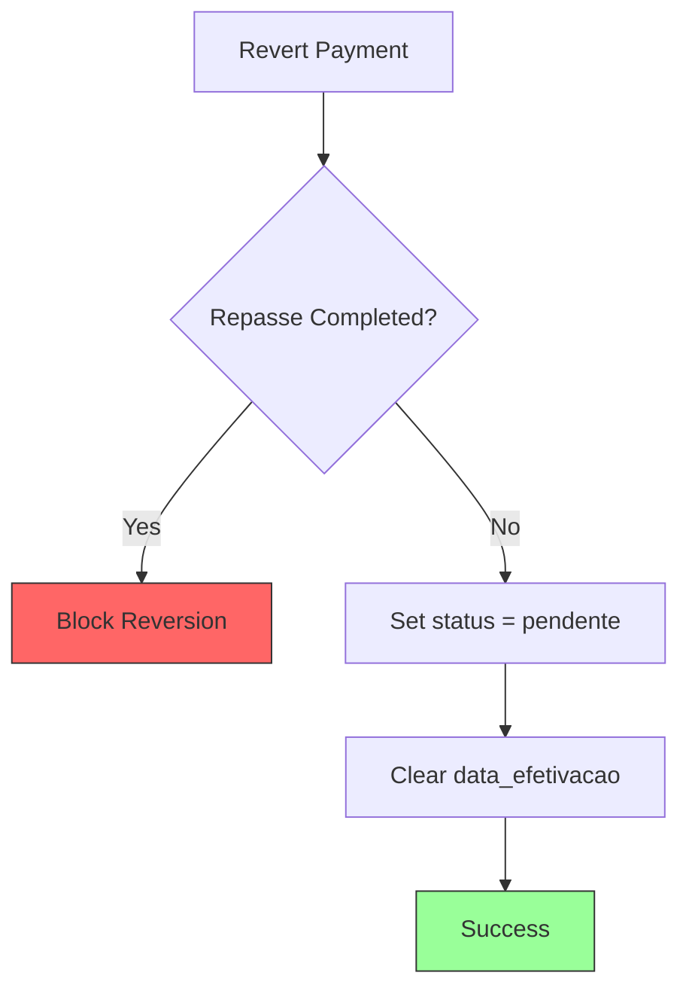

# Payment Tracking

<cite>
**Referenced Files in This Document**   
- [parcelas-table.tsx](file://app/(dashboard)/acordos-condenacoes/components/parcelas-table.tsx)
- [20250118120001_create_parcelas.sql](file://supabase/migrations/aplicadas/20250118120001_create_parcelas.sql)
- [20250118120000_create_acordos_condenacoes.sql](file://supabase/migrations/aplicadas/20250118120000_create_acordos_condenacoes.sql)
- [obrigacoes-content.tsx](file://app/(dashboard)/acordos-condenacoes/components/obrigacoes-content.tsx)
- [listar-obrigacoes.service.ts](file://backend/financeiro/obrigacoes/services/obrigacoes/listar-obrigacoes.service.ts)
- [route.ts](file://app/api/acordos-condenacoes/[id]/parcelas/[parcelaId]/receber/route.ts)
- [marcar-como-recebida.service.ts](file://backend/acordos-condenacoes/services/parcelas/marcar-como-recebida.service.ts)
- [recalcular-distribuicao.service.ts](file://backend/acordos-condenacoes/services/parcelas/recalcular-distribuicao.service.ts)
- [20_acordos_condenacoes.sql](file://supabase/schemas/20_acordos_condenacoes.sql)
</cite>

## Table of Contents
1. [Introduction](#introduction)
2. [Core Data Models](#core-data-models)
3. [Payment Status Management](#payment-status-management)
4. [Distribution Calculations](#distribution-calculations)
5. [Payment Recording Interfaces](#payment-recording-interfaces)
6. [Relationships with Financial Entities](#relationships-with-financial-entities)
7. [Validation Rules and Constraints](#validation-rules-and-constraints)
8. [Reconciliation Processes](#reconciliation-processes)
9. [Handling Special Cases](#handling-special-cases)
10. [API Endpoints](#api-endpoints)

## Introduction

The Payment Tracking sub-feature within the Financial Domain provides comprehensive management of payment obligations related to judgment agreements, settlements, and court costs. This system enables legal firms to track installment payments (parcelas), manage payment schedules, and handle distribution calculations between law firms and their clients. The implementation supports both receivables (when the firm receives payment) and payables (when the firm makes payments), with sophisticated handling of partial payments, late payments, and payment reversals.

The system is built around two core entities: `acordos_condenacoes` (agreements/judgments) and `parcelas` (installments). Each agreement can have multiple installments with individual tracking of payment status, distribution calculations, and repasse (client distribution) status. The implementation includes robust validation rules, automated calculations, and reconciliation processes to ensure financial accuracy.

**Section sources**
- [obrigacoes-content.tsx](file://app/(dashboard)/acordos-condenacoes/components/obrigacoes-content.tsx#L1-L288)

## Core Data Models

The payment tracking system is built on two primary database tables that define the structure for managing financial obligations and their installments.



**Diagram sources**
- [20250118120000_create_acordos_condenacoes.sql](file://supabase/migrations/aplicadas/20250118120000_create_acordos_condenacoes.sql#L4-L90)
- [20250118120001_create_parcelas.sql](file://supabase/migrations/aplicadas/20250118120001_create_parcelas.sql#L4-L118)

### Acordos Condenacoes (Agreements/Judgments)

The `acordos_condenacoes` table represents the main financial obligation, which can be an agreement, judgment, or court costs. Key attributes include:

- **tipo**: The type of obligation (acordo, condenacao, or custas_processuais)
- **direcao**: Direction of the financial flow (recebimento for receivables, pagamento for payables)
- **valor_total**: Total value of the agreement/judgment
- **numero_parcelas**: Number of installments
- **forma_distribuicao**: Distribution method (integral or dividido) for receivables
- **percentual_escritorio**: Percentage of contractual fees for the law firm
- **percentual_cliente**: Automatically calculated percentage for the client (100 - percentual_escritorio)

**Section sources**
- [20250118120000_create_acordos_condenacoes.sql](file://supabase/migrations/aplicadas/20250118120000_create_acordos_condenacoes.sql#L4-L90)

### Parcelas (Installments)

The `parcelas` table represents individual installments within an agreement/judgment. Each installment has detailed tracking capabilities:

- **valor_bruto_credito_principal**: Principal credit amount for the installment
- **honorarios_sucumbenciais**: Litigation fees for this installment
- **honorarios_contratuais**: Contractual fees calculated automatically based on percentual_escritorio
- **status**: Payment status (pendente, recebida, paga, atrasado)
- **forma_pagamento**: Payment method (transferencia_direta, deposito_judicial, deposito_recursal)
- **status_repasse**: Distribution status to client (nao_aplicavel, pendente_declaracao, pendente_transferencia, repassado)

The table includes comprehensive constraints to ensure data integrity, such as ensuring data_efetivacao is set only when status is 'recebida' or 'paga', and requiring documentation for repasse completion.

**Section sources**
- [20250118120001_create_parcelas.sql](file://supabase/migrations/aplicadas/20250118120001_create_parcelas.sql#L4-L118)

## Payment Status Management

The payment tracking system implements a sophisticated status management workflow that handles the lifecycle of each installment from creation to completion.



**Diagram sources**
- [marcar-como-recebida.service.ts](file://backend/acordos-condenacoes/services/parcelas/marcar-como-recebida.service.ts#L36-L290)
- [20250118120001_create_parcelas.sql](file://supabase/migrations/aplicadas/20250118120001_create_parcelas.sql#L18)

### Status Transitions

The system supports the following status transitions:

- **Pendente → Recebida**: When a receivable installment is marked as received
- **Pendente → Paga**: When a payable installment is marked as paid
- **Pendente → Atrasado**: Automatically when the due date passes without payment
- **Recebida/Paga → Pendente**: When a payment is reversed or canceled

The status transitions are managed through dedicated service functions that validate business rules before updating the database. For example, the `marcarComoRecebida` function ensures that a parcel cannot be marked as received if it has already been paid or if the repasse has already been completed.

**Section sources**
- [marcar-como-recebida.service.ts](file://backend/acordos-condenacoes/services/parcelas/marcar-como-recebida.service.ts#L36-L290)

### Late Payment Handling

The system automatically identifies late payments by comparing the current date with the installment's due date. Installments that are past due but not yet marked as paid/received are automatically assigned the 'atrasado' status. This status triggers alerts in the dashboard and affects financial reporting metrics such as compliance rates and overdue amounts.

The system also provides visibility into late payments through dedicated filters and reporting views, allowing financial managers to prioritize collection efforts and analyze payment patterns.

**Section sources**
- [20250118120001_create_parcelas.sql](file://supabase/migrations/aplicadas/20250118120001_create_parcelas.sql#L18)
- [listar-obrigacoes.service.ts](file://backend/financeiro/obrigacoes/services/obrigacoes/listar-obrigacoes.service.ts#L157-L177)

## Distribution Calculations

The payment tracking system implements sophisticated distribution calculations that handle the allocation of received funds between the law firm and its clients.



**Diagram sources**
- [20250118120001_create_parcelas.sql](file://supabase/migrations/aplicadas/20250118120001_create_parcelas.sql#L28-L36)
- [marcar-como-recebida.service.ts](file://backend/acordos-condenacoes/services/parcelas/marcar-como-recebida.service.ts#L36-L114)

### Integral Distribution

When `forma_distribuicao` is set to 'integral', the law firm receives the entire payment and is responsible for distributing the client's share. This process involves:

1. Automatic calculation of `valor_repasse_cliente` based on `percentual_cliente`
2. Setting `status_repasse` to 'pendente_declaracao' when the installment is marked as received
3. Requiring the client's signed declaration of account settlement before initiating the transfer
4. Requiring proof of transfer to complete the repasse process

This workflow ensures compliance with ethical and regulatory requirements for client fund management.

**Section sources**
- [20250118120001_create_parcelas.sql](file://supabase/migrations/aplicadas/20250118120001_create_parcelas.sql#L28-L36)

### Dividido Distribution

When `forma_distribuicao` is set to 'dividido', the client receives their share directly, and the law firm receives only its contractual fees. In this case, `status_repasse` remains 'nao_aplicavel' as no distribution by the firm is required.

This method simplifies the payment process and reduces the firm's administrative burden, but may not be suitable for all types of agreements or regulatory environments.

**Section sources**
- [20250118120000_create_acordos_condenacoes.sql](file://supabase/migrations/aplicadas/20250118120000_create_acordos_condenacoes.sql#L15-L17)

## Payment Recording Interfaces

The system provides user-friendly interfaces for recording payments and managing payment schedules.



**Diagram sources**
- [parcelas-table.tsx](file://app/(dashboard)/acordos-condenacoes/components/parcelas-table.tsx#L101-L145)
- [route.ts](file://app/api/acordos-condenacoes/[id]/parcelas/[parcelaId]/receber/route.ts#L60-L89)
- [marcar-como-recebida.service.ts](file://backend/acordos-condenacoes/services/parcelas/marcar-como-recebida.service.ts#L36-L114)

### User Interface Components

The `ParcelasTable` component provides a comprehensive interface for managing installments. Key features include:

- Visual status indicators using color-coded badges
- Action buttons for editing and marking payments
- Display of repasse status and amounts for receivables
- Visual indicator (*) for manually edited values
- Loading states during API calls

The component is designed to be intuitive for users while providing all necessary information for accurate payment tracking.

**Section sources**
- [parcelas-table.tsx](file://app/(dashboard)/acordos-condenacoes/components/parcelas-table.tsx#L1-L255)

### Partial Payment Handling

The system supports partial payments through the ability to edit individual installment values. When a user edits the `valor_bruto_credito_principal` or `honorarios_sucumbenciais` of a parcel, the `editado_manualmente` flag is set to true, indicating that the automatic distribution calculation should not be applied to this parcel.

The system also provides a recalculation service that redistributes the remaining balance across unedited installments, ensuring that the sum of all installments equals the total agreement value.

**Section sources**
- [20250118120001_create_parcelas.sql](file://supabase/migrations/aplicadas/20250118120001_create_parcelas.sql#L26)
- [recalcular-distribuicao.service.ts](file://backend/acordos-condenacoes/services/parcelas/recalcular-distribuicao.service.ts#L37-L290)

## Relationships with Financial Entities

The payment tracking system integrates with various financial entities to provide a comprehensive view of the firm's financial obligations.

```mermaid
classDiagram
class AcordoCondenacao {
+bigint id
+bigint processo_id
+text tipo
+text direcao
+numeric valor_total
+date data_vencimento_primeira_parcela
+text status
+integer numero_parcelas
+text forma_distribuicao
+numeric percentual_escritorio
+numeric percentual_cliente
+numeric honorarios_sucumbenciais_total
}
class Parcela {
+bigint id
+bigint acordo_condenacao_id
+integer numero_parcela
+numeric valor_bruto_credito_principal
+numeric honorarios_sucumbenciais
+numeric honorarios_contratuais
+date data_vencimento
+text status
+timestamptz data_efetivacao
+text forma_pagamento
+jsonb dados_pagamento
+boolean editado_manualmente
+numeric valor_repasse_cliente
+text status_repasse
+text arquivo_declaracao_prestacao_contas
+timestamptz data_declaracao_anexada
+text arquivo_comprovante_repasse
+timestamptz data_repasse
+bigint usuario_repasse_id
}
class Obrigacao {
+bigint id
+text tipo
+text status
+numeric valor
+date data_vencimento
+integer diasAteVencimento
+text statusSincronizacao
+bigint processoId
+bigint clienteId
}
AcordoCondenacao --> Parcela : "1 to many"
Obrigacao --> AcordoCondenacao : "aggregation"
Obrigacao --> Parcela : "aggregation"
note right of AcordoCondenacao
Parent entity for financial obligations
Can be an agreement, judgment, or court costs
end note
note left of Parcela
Individual installments with detailed tracking
Supports manual editing and recalculation
end note
note right of Obrigacao
Consolidated view of all financial obligations
Used for dashboard and reporting
end note
```

**Diagram sources**
- [20_acordos_condenacoes.sql](file://supabase/schemas/20_acordos_condenacoes.sql#L6-L128)
- [listar-obrigacoes.service.ts](file://backend/financeiro/obrigacoes/services/obrigacoes/listar-obrigacoes.service.ts#L1-L456)

### Integration with Accounting Records

The system generates accounting records for each payment event, ensuring that financial reporting is accurate and up-to-date. When a parcel is marked as received or paid, the system updates the corresponding accounting entries and recalculates financial metrics such as revenue, expenses, and receivables.

The integration also supports reconciliation with external accounting systems through the `statusSincronizacao` field, which tracks whether an obligation has been synchronized with external systems.

**Section sources**
- [listar-obrigacoes.service.ts](file://backend/financeiro/obrigacoes/services/obrigacoes/listar-obrigacoes.service.ts#L102-L107)

## Validation Rules and Constraints

The payment tracking system implements comprehensive validation rules to ensure data integrity and prevent financial errors.



**Diagram sources**
- [20250118120001_create_parcelas.sql](file://supabase/migrations/aplicadas/20250118120001_create_parcelas.sql#L9-L12)
- [route.ts](file://app/api/acordos-condenacoes/[id]/parcelas/[parcelaId]/route.ts#L79-L92)

### Database Constraints

The system implements several database-level constraints to enforce business rules:

- **Check constraints** ensure that values are within valid ranges (e.g., percentages between 0 and 100, non-negative amounts)
- **Unique constraints** prevent duplicate parcel numbers within the same agreement
- **Foreign key constraints** maintain referential integrity between agreements and parcels
- **Conditional constraints** enforce business rules such as requiring data_efetivacao when status is 'recebida' or 'paga'

These constraints provide a robust foundation for data integrity, preventing invalid states even if application-level validation is bypassed.

**Section sources**
- [20250118120001_create_parcelas.sql](file://supabase/migrations/aplicadas/20250118120001_create_parcelas.sql#L42-L54)

### Application-Level Validation

In addition to database constraints, the system implements application-level validation through API endpoints and service functions:

- **API validation** checks request payloads for required fields and valid values
- **Service validation** ensures business rules are followed (e.g., cannot mark a parcel as received if it's already paid)
- **User interface validation** provides immediate feedback to users during data entry

This multi-layered approach to validation ensures data quality while providing a good user experience.

**Section sources**
- [route.ts](file://app/api/acordos-condenacoes/[id]/parcelas/[parcelaId]/route.ts#L79-L92)
- [marcar-como-recebida.service.ts](file://backend/acordos-condenacoes/services/parcelas/marcar-como-recebida.service.ts#L53-L67)

## Reconciliation Processes

The system provides robust reconciliation processes to ensure financial accuracy and compliance.



**Diagram sources**
- [20250118120001_create_parcelas.sql](file://supabase/migrations/aplicadas/20250118120001_create_parcelas.sql#L28-L36)
- [marcar-como-recebida.service.ts](file://backend/acordos-condenacoes/services/parcelas/marcar-como-recebida.service.ts#L36-L114)

### Repasse Reconciliation

For agreements with 'integral' distribution, the system requires a formal reconciliation process:

1. The client must sign and return a declaration of account settlement
2. The firm must transfer the client's share and obtain proof of transfer
3. Both documents must be uploaded to the system
4. The system verifies the documents and completes the repasse process

This process creates an auditable trail of all client distributions, ensuring compliance with ethical and regulatory requirements.

**Section sources**
- [20250118120001_create_parcelas.sql](file://supabase/migrations/aplicadas/20250118120001_create_parcelas.sql#L31-L35)

### Financial Reporting

The system generates comprehensive financial reports that integrate payment tracking data with other financial metrics. These reports include:

- **Receivables aging**: Analysis of overdue payments by duration
- **Payment compliance**: Percentage of payments made on time
- **Revenue recognition**: Revenue recognized based on payment status
- **Client distributions**: Summary of amounts distributed to clients

These reports provide valuable insights for financial management and strategic decision-making.

**Section sources**
- [listar-obrigacoes.service.ts](file://backend/financeiro/obrigacoes/services/obrigacoes/listar-obrigacoes.service.ts#L82-L213)

## Handling Special Cases

The system includes functionality to handle various special cases that commonly occur in payment tracking.

### Payment Reversals

The system supports payment reversals through the `reverterStatusParcela` function, which allows users to return a parcel to 'pendente' status from 'recebida' or 'paga'. However, this is only allowed if no repasse has been completed, preventing financial discrepancies.



**Diagram sources**
- [marcar-como-recebida.service.ts](file://backend/acordos-condenacoes/services/parcelas/marcar-como-recebida.service.ts#L182-L234)

### Bulk Operations

The system supports bulk operations through the `atualizarStatusEmLote` function, which allows users to update the status of multiple parcels simultaneously. This is particularly useful for processing multiple payments received on the same day.

The function processes each parcel individually, counting successful updates and returning a summary of the operation. This ensures data integrity while providing efficiency for common workflows.

**Section sources**
- [marcar-como-recebida.service.ts](file://backend/acordos-condenacoes/services/parcelas/marcar-como-recebida.service.ts#L243-L289)

## API Endpoints

The payment tracking system exposes a comprehensive API for managing agreements, parcels, and payments.

```mermaid
classDiagram
class AcordosCondenacoesAPI {
+GET /api/acordos-condenacoes/{id}
+PUT /api/acordos-condenacoes/{id}
+DELETE /api/acordos-condenacoes/{id}
+GET /api/acordos-condenacoes
}
class ParcelasAPI {
+PUT /api/acordos-condenacoes/{id}/parcelas/{parcelaId}
+POST /api/acordos-condenacoes/{id}/parcelas/{parcelaId}/receber
+POST /api/acordos-condenacoes/{id}/recalcular
}
AcordosCondenacoesAPI --> ParcelasAPI : "contains"
note right of AcordosCondenacoesAPI
CRUD operations for agreements/judgments
Authentication required
end note
note left of ParcelasAPI
Operations for individual parcels
Includes payment recording
end note
```

**Diagram sources**
- [route.ts](file://app/api/acordos-condenacoes/[id]/route.ts#L102-L198)
- [route.ts](file://app/api/acordos-condenacoes/[id]/parcelas/[parcelaId]/route.ts#L64-L109)
- [route.ts](file://app/api/acordos-condenacoes/[id]/parcelas/[parcelaId]/receber/route.ts#L60-L89)

### Key Endpoints

- **GET /api/acordos-condenacoes/{id}**: Retrieves an agreement with its parcels
- **PUT /api/acordos-condenacoes/{id}/parcelas/{parcelaId}**: Updates parcel values
- **POST /api/acordos-condenacoes/{id}/parcelas/{parcelaId}/receber**: Marks a parcel as received or paid
- **POST /api/acordos-condenacoes/{id}/recalcular**: Recalculates distribution after manual edits

These endpoints follow REST conventions and include comprehensive error handling and authentication.

**Section sources**
- [route.ts](file://app/api/acordos-condenacoes/[id]/route.ts#L102-L198)
- [route.ts](file://app/api/acordos-condenacoes/[id]/parcelas/[parcelaId]/route.ts#L64-L109)
- [route.ts](file://app/api/acordos-condenacoes/[id]/parcelas/[parcelaId]/receber/route.ts#L60-L89)