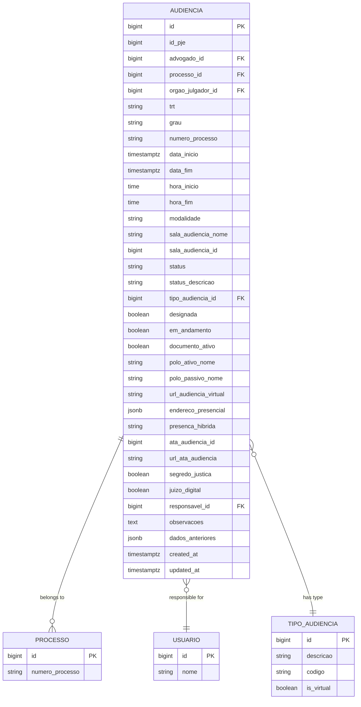
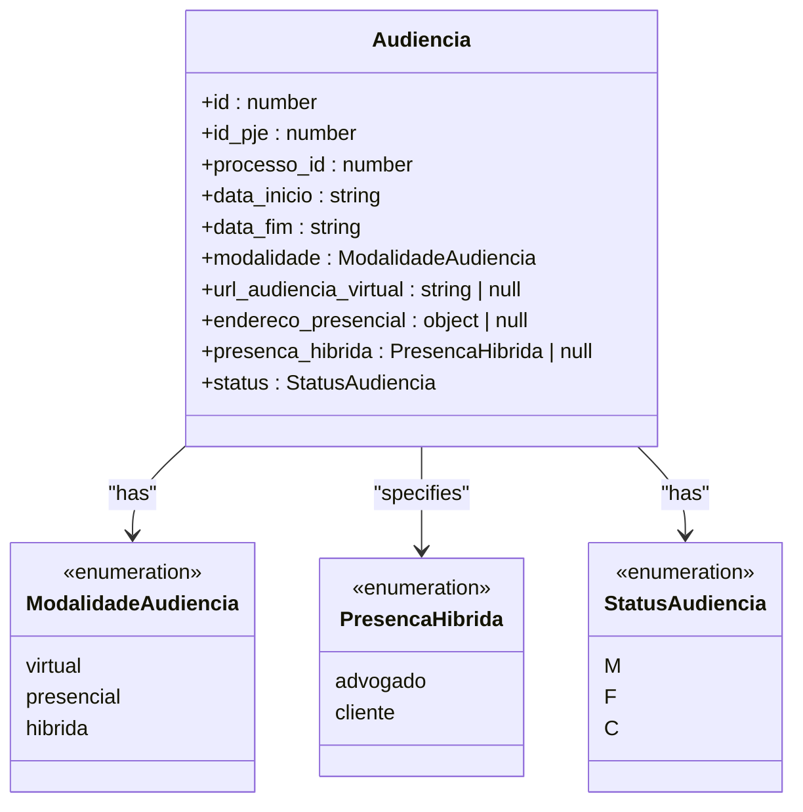
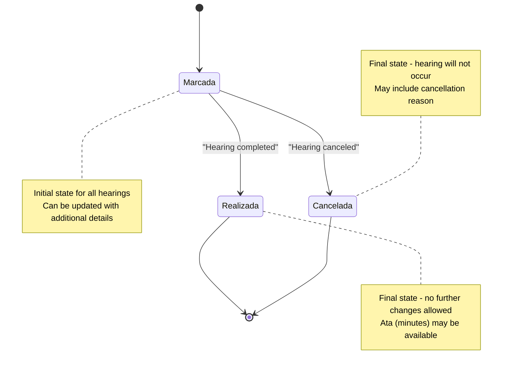
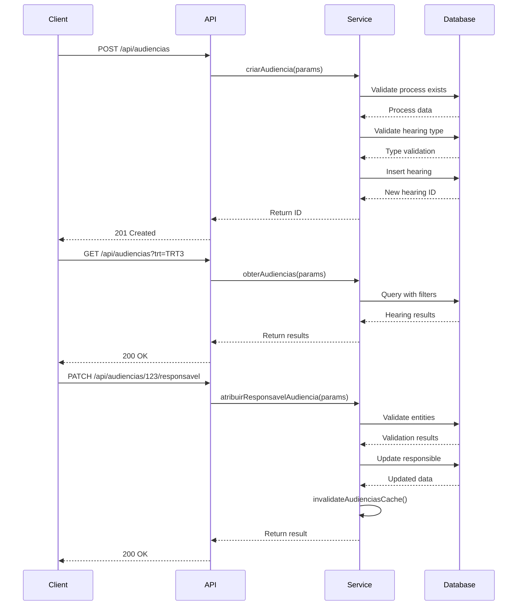

# Hearing Management

<cite>
**Referenced Files in This Document**   
- [audiencias.ts](file://types/domain/audiencias.ts)
- [audiencias.sql](file://supabase/schemas/07_audiencias.sql)
- [criar-audiencia.service.ts](file://backend/audiencias/services/criar-audiencia.service.ts)
- [listar-audiencias.service.ts](file://backend/audiencias/services/listar-audiencias.service.ts)
- [route.ts](file://app/api/audiencias/route.ts)
- [atribuir-responsavel.service.ts](file://backend/audiencias/services/atribuir-responsavel.service.ts)
- [atualizar-url-virtual.service.ts](file://backend/audiencias/services/atualizar-url-virtual.service.ts)
- [responsavel/route.ts](file://app/api/audiencias/[id]/responsavel/route.ts)
- [url-virtual/route.ts](file://app/api/audiencias/[id]/url-virtual/route.ts)
- [cliente/cpf/[cpf]/route.ts](file://app/api/audiencias/cliente/cpf/[cpf]/route.ts)
</cite>

## Table of Contents
1. [Introduction](#introduction)
2. [Hearing Domain Model](#hearing-domain-model)
3. [Core Attributes](#core-attributes)
4. [Business Rules and Constraints](#business-rules-and-constraints)
5. [Hearing Modalities](#hearing-modalities)
6. [Hearing Lifecycle](#hearing-lifecycle)
7. [Data Access Patterns](#data-access-patterns)
8. [Calendar Integration](#calendar-integration)
9. [Service Layer Implementation](#service-layer-implementation)
10. [API Endpoints](#api-endpoints)
11. [Client Association](#client-association)
12. [Conclusion](#conclusion)

## Introduction

The Hearing (Audiencia) entity in Sinesys represents a judicial hearing scheduled for a legal process. This documentation provides a comprehensive overview of the Audiencia domain model, including its attributes, business rules, validation constraints, and integration with other entities in the system. The model supports both automatically captured hearings from PJE (Processo Judicial Eletrônico) systems and manually created hearings, with comprehensive support for virtual, presential, and hybrid modalities.

The hearing management system is designed to provide a complete view of all scheduled hearings across multiple tribunals and time periods, with robust filtering, sorting, and calendar integration capabilities. The system maintains a clear separation between domain data and infrastructure concerns, with business logic encapsulated in service layers and data persistence handled through a well-structured database schema.

**Section sources**
- [audiencias.ts](file://types/domain/audiencias.ts)
- [audiencias.sql](file://supabase/schemas/07_audiencias.sql)

## Hearing Domain Model

The Audiencia domain model represents a comprehensive data structure for judicial hearings, capturing all relevant information about scheduled court appearances. The model is implemented as a TypeScript interface that defines the complete structure of a hearing entity, with corresponding database schema implementation in PostgreSQL.

The domain model follows a clean architecture approach, separating concerns between domain entities, infrastructure data, and presentation concerns. The core Audiencia interface contains all essential attributes needed to represent a hearing, including temporal information, location details, participant information, and status tracking.



**Diagram sources**
- [audiencias.ts](file://types/domain/audiencias.ts)
- [audiencias.sql](file://supabase/schemas/07_audiencias.sql)

**Section sources**
- [audiencias.ts](file://types/domain/audiencias.ts)
- [audiencias.sql](file://supabase/schemas/07_audiencias.sql)

## Core Attributes

The Audiencia entity contains a comprehensive set of attributes that capture all relevant information about a judicial hearing. These attributes are organized into logical groups based on their purpose and usage patterns.

### Temporal Attributes
The temporal attributes define when the hearing occurs and its duration:

- `data_inicio` and `data_fim`: ISO timestamp fields that define the start and end of the hearing, including both date and time components
- `hora_inicio` and `hora_fim`: Time-only fields extracted from the PJE system's pautaAudienciaHorario.horaInicial and horaFinal
- `created_at` and `updated_at`: Timestamps that track when the record was created and last modified

### Identification and Reference Attributes
These attributes provide unique identification and relationships to other entities:

- `id_pje`: The ID of the hearing in the PJE system (0 for manually created hearings)
- `processo_id`: Foreign key to the acervo table, linking the hearing to a specific legal process
- `advogado_id`: Reference to the lawyer who captured the hearing
- `orgao_julgador_id`: Reference to the judicial body conducting the hearing

### Descriptive Attributes
These attributes provide human-readable information about the hearing:

- `numero_processo`: The process number in CNJ format
- `trt`: Code of the Regional Labor Court (TRT) where the hearing is scheduled
- `grau`: The degree of the process (primeiro_grau or segundo_grau)
- `tipo_descricao`, `tipo_codigo`: Description and code of the hearing type
- `classe_judicial`: Judicial class of the process

### Location and Modality Attributes
These attributes define where and how the hearing will take place:

- `modalidade`: The hearing modality (virtual, presencial, or hibrida)
- `url_audiencia_virtual`: URL for virtual hearings (Zoom, Google Meet, etc.)
- `endereco_presencial`: JSON object containing the physical address for presential hearings
- `sala_audiencia_nome` and `sala_audiencia_id`: Name and ID of the hearing room
- `presenca_hibrida`: Indicates who will attend in person for hybrid hearings (advogado or cliente)

### Status and Tracking Attributes
These attributes track the state and progress of the hearing:

- `status`: Current status of the hearing (M=Marcada, F=Realizada, C=Cancelada)
- `status_descricao`: Human-readable description of the status
- `designada`, `em_andamento`, `documento_ativo`: Boolean flags indicating various states
- `responsavel_id`: User responsible for the hearing
- `observacoes`: Free-text observations about the hearing
- `dados_anteriores`: JSON object storing the previous state of the record before updates

**Section sources**
- [audiencias.ts](file://types/domain/audiencias.ts)
- [audiencias.sql](file://supabase/schemas/07_audiencias.sql)

## Business Rules and Constraints

The Audiencia domain model enforces several business rules and constraints to ensure data integrity and consistency across the system.

### Uniqueness Constraint
The system ensures that each hearing is uniquely identified by the combination of `(id_pje, trt, grau, numero_processo)`. This constraint prevents duplication of hearings from the PJE system while allowing multiple lawyers from the same firm to view the same hearing for a process. The comment on the table explicitly states: "A unicidade da audiência é garantida por (id_pje, trt, grau, numero_processo), permitindo que múltiplos advogados vejam a mesma audiência do mesmo processo sem duplicação".

### Automatic Modality Determination
The system automatically determines the hearing modality based on specific rules implemented in a PostgreSQL trigger function `populate_modalidade_audiencia()`. The rules are applied in the following order:

1. If the modality is already set to 'hibrida', it remains unchanged (hybrid modality is set manually)
2. If there is a virtual hearing URL or the hearing type description contains 'videoconfer', the modality is set to 'virtual'
3. If there is a presential address, the modality is set to 'presencial'
4. Otherwise, the modality remains unchanged (possibly null)

This trigger fires before insert or update operations on the `url_audiencia_virtual`, `endereco_presencial`, `tipo_audiencia_id`, or `modalidade` columns.

### Date Validation
The system enforces date validation rules to ensure logical consistency:
- The end date and time must be after the start date and time
- Both start and end dates must be valid ISO 8601 timestamps
- For manually created hearings, the dates must be provided and cannot be null

### Status Management
The system uses a standardized status system with three possible values:
- 'M' (Marcada/Designada): The hearing is scheduled
- 'F' (Finalizada/Realizada): The hearing has been completed
- 'C' (Cancelada): The hearing has been canceled

The status description is automatically populated based on the status code, with a mapping function available in the frontend code to convert codes to human-readable descriptions.

**Section sources**
- [audiencias.sql](file://supabase/schemas/07_audiencias.sql)
- [criar-audiencia.service.ts](file://backend/audiencias/services/criar-audiencia.service.ts)

## Hearing Modalities

The system supports three distinct hearing modalities, each with specific attributes and business rules.

### Virtual Hearings
Virtual hearings are conducted online through video conferencing platforms. The system identifies virtual hearings through several mechanisms:
- Presence of a URL in the `url_audiencia_virtual` field
- Hearing type description containing 'videoconfer'
- Manual setting of modality to 'virtual'

When a virtual hearing is detected, the system automatically sets the `modalidade` field to 'virtual' and populates the `url_audiencia_virtual` field with the conference link. The system validates that the URL is well-formed when updated through the API.

### Presential Hearings
Presential hearings occur at a physical location. The system identifies presential hearings by:
- Presence of a complete address in the `endereco_presencial` JSON field
- Manual setting of modality to 'presencial'

The address information is stored as a JSON object with fields for street, number, complement, neighborhood, city, state, country, and postal code. This structure allows for flexible address representation across different jurisdictions.

### Hybrid Hearings
Hybrid hearings combine both virtual and presential elements. Unlike the other modalities, hybrid hearings are not automatically detected but must be manually set. This allows for more nuanced control over the hearing configuration.

For hybrid hearings, the system tracks who will attend in person through the `presenca_hibrida` field, which can have two values:
- 'advogado': The lawyer will attend in person
- 'cliente': The client will attend in person

This information is important for case preparation and resource allocation.



**Diagram sources**
- [audiencias.ts](file://types/domain/audiencias.ts)

**Section sources**
- [audiencias.ts](file://types/domain/audiencias.ts)
- [audiencias.sql](file://supabase/schemas/07_audiencias.sql)

## Hearing Lifecycle

The hearing entity follows a well-defined lifecycle from creation through completion or cancellation, with specific business rules governing each stage.

### Creation Process
Hearings can be created through two primary mechanisms:

1. **Automatic Capture**: Hearings are automatically captured from the PJE system through integration services. These hearings have a non-zero `id_pje` value.

2. **Manual Creation**: Users can create hearings manually through the API. The `criarAudiencia` service handles this process with the following steps:
   - Validate that the associated process exists
   - Validate that the hearing type exists (if specified)
   - Validate that the hearing room exists (if specified)
   - Set default values (status = 'M', id_pje = 0 for manual hearings)
   - Insert the hearing record into the database

The manual creation process includes comprehensive validation to ensure data integrity, including checking for required fields and valid relationships.

### Status Transitions
The hearing status follows a specific transition pattern:
- Initial status for new hearings is 'M' (Marcada/Designada)
- Status can transition to 'F' (Finalizada/Realizada) when the hearing is completed
- Status can transition to 'C' (Cancelada) if the hearing is canceled
- Once a hearing is completed or canceled, it cannot return to the scheduled state

### Updates and Modifications
The system supports several types of updates to hearing records:

1. **Responsible Assignment**: The responsible user can be assigned, transferred, or removed through the `atribuirResponsavelAudiencia` service. This operation is logged in the `logs_alteracao` table.

2. **Virtual URL Updates**: The virtual hearing URL can be updated through the `atualizarUrlVirtualAudiencia` service, which validates the URL format before updating.

3. **Status Updates**: The hearing status can be updated when the hearing is completed or canceled.

4. **Observations**: Users can add or modify observations about the hearing.

Each update operation triggers appropriate business logic, including cache invalidation and audit logging.



**Diagram sources**
- [criar-audiencia.service.ts](file://backend/audiencias/services/criar-audiencia.service.ts)
- [atribuir-responsavel.service.ts](file://backend/audiencias/services/atribuir-responsavel.service.ts)
- [atualizar-url-virtual.service.ts](file://backend/audiencias/services/atualizar-url-virtual.service.ts)

**Section sources**
- [criar-audiencia.service.ts](file://backend/audiencias/services/criar-audiencia.service.ts)
- [atribuir-responsavel.service.ts](file://backend/audiencias/services/atribuir-responsavel.service.ts)
- [atualizar-url-virtual.service.ts](file://backend/audiencias/services/atualizar-url-virtual.service.ts)

## Data Access Patterns

The system implements several data access patterns to support different use cases and performance requirements.

### List and Filter Operations
The primary data access pattern is listing hearings with comprehensive filtering capabilities. The `listarAudiencias` service supports a wide range of filters:

- **Basic Filters**: TRT, process degree, responsible user
- **Text Search**: Full-text search across multiple fields (process number, party names)
- **Specific Field Filters**: Status, hearing type, modality
- **Date Range Filters**: Filters for start and end dates
- **Pagination**: Support for paginated results with configurable page size

The API endpoint `/api/audiencias` implements these filters through query parameters, allowing clients to construct complex queries.

### Performance Optimization
The database schema includes several indexes to optimize query performance:

- Indexes on foreign keys (`advogado_id`, `processo_id`, `orgao_julgador_id`)
- Indexes on frequently filtered fields (`trt`, `grau`, `status`, `data_inicio`, `data_fim`)
- Composite indexes for common query patterns (`advogado_id, trt, grau` and `processo_id, data_inicio`)

These indexes ensure that common queries, especially those used in calendar views, perform efficiently even with large datasets.

### Cache Management
The system implements cache invalidation strategies to maintain data consistency:

- After creating or updating a hearing, the hearing cache is invalidated
- After assigning a responsible user, the cache is invalidated
- The `invalidateAudienciasCache` function is called after successful operations to ensure clients receive up-to-date data

### Data Consistency
The system maintains data consistency through several mechanisms:

- Row-level security (RLS) is enabled on the `audiencias` table to ensure users can only access hearings they are authorized to view
- Foreign key constraints ensure referential integrity
- The `dados_anteriores` field stores the previous state of the record before updates, enabling audit capabilities

**Section sources**
- [listar-audiencias.service.ts](file://backend/audiencias/services/listar-audiencias.service.ts)
- [audiencias.sql](file://supabase/schemas/07_audiencias.sql)
- [atribuir-responsavel.service.ts](file://backend/audiencias/services/atribuir-responsavel.service.ts)

## Calendar Integration

The hearing management system provides comprehensive calendar integration across different time periods, supporting week, month, and year views.

### Calendar Views
The system supports multiple calendar views through dedicated routes in the application:

- **Week View**: Available at `/app/(dashboard)/audiencias/semana`
- **Month View**: Available at `/app/(dashboard)/audiencias/mes`
- **Year View**: Available at `/app/(dashboard)/audiencias/ano`

These views allow users to visualize hearings across different time scales, with appropriate filtering and navigation capabilities.

### Calendar Data Access
The calendar views retrieve data through the same API endpoints used by other components, ensuring consistency across the application. The API supports high limits (up to 1000 items per page) specifically for calendar visualizations that need to display large time ranges.

### Calendar-Specific Features
The calendar integration includes several features tailored to the calendar use case:

- **Color Coding**: Hearings may be color-coded based on status, modality, or other attributes
- **Time Slot Management**: The system tracks time slots to prevent scheduling conflicts
- **Quick Navigation**: Users can quickly navigate between weeks, months, and years
- **Event Details**: Clicking on a calendar event displays detailed information about the hearing

The system also supports filtering within calendar views, allowing users to focus on specific types of hearings (e.g., only virtual hearings, only hearings for a specific client, etc.).

**Section sources**
- [route.ts](file://app/api/audiencias/route.ts)
- [audiencias.sql](file://supabase/schemas/07_audiencias.sql)

## Service Layer Implementation

The hearing management system implements a clean service layer architecture with clear separation of concerns between different components.

### Service Organization
The services are organized into a logical hierarchy:

- **Core Services**: Handle business logic for hearing operations
- **Persistence Services**: Handle direct database operations
- **API Routes**: Handle HTTP requests and responses

This separation allows for better testability and maintainability of the codebase.

### Key Service Functions

#### Hearing Creation Service
The `criarAudiencia` service (in `criar-audiencia.service.ts`) handles the creation of new hearings:

1. Validates the existence of the associated process
2. Validates the hearing type (if specified)
3. Validates the hearing room (if specified)
4. Prepares the hearing data with appropriate defaults
5. Inserts the hearing into the database

The service returns the ID of the created hearing, allowing the client to reference the new record.

#### Hearing Listing Service
The `obterAudiencias` service (in `listar-audiencias.service.ts`) handles listing hearings with filters:

1. Receives filtering, pagination, and sorting parameters
2. Delegates to the persistence layer to execute the database query
3. Returns paginated results with metadata

This service acts as a facade for the persistence layer, providing a clean interface for the API routes.

#### Responsible Assignment Service
The `atribuirResponsavelAudiencia` service handles assigning, transferring, or removing responsibility for a hearing:

1. Validates that the hearing exists
2. Validates that the responsible user exists (if specified)
3. Validates that the executing user exists
4. Executes the assignment through an RPC function
5. Invalidates the hearing cache

This service includes comprehensive error handling and returns detailed error messages for different failure scenarios.

#### URL Update Service
The `atualizarUrlVirtualAudiencia` service handles updating the virtual hearing URL:

1. Validates the hearing ID
2. Validates the URL format (if provided)
3. Updates the database record
4. Invalidates the cache

The service validates that the URL is well-formed by attempting to create a URL object from the provided string.



**Diagram sources**
- [criar-audiencia.service.ts](file://backend/audiencias/services/criar-audiencia.service.ts)
- [listar-audiencias.service.ts](file://backend/audiencias/services/listar-audiencias.service.ts)
- [atribuir-responsavel.service.ts](file://backend/audiencias/services/atribuir-responsavel.service.ts)
- [atualizar-url-virtual.service.ts](file://backend/audiencias/services/atualizar-url-virtual.service.ts)

**Section sources**
- [criar-audiencia.service.ts](file://backend/audiencias/services/criar-audiencia.service.ts)
- [listar-audiencias.service.ts](file://backend/audiencias/services/listar-audiencias.service.ts)
- [atribuir-responsavel.service.ts](file://backend/audiencias/services/atribuir-responsavel.service.ts)
- [atualizar-url-virtual.service.ts](file://backend/audiencias/services/atualizar-url-virtual.service.ts)

## API Endpoints

The hearing management system exposes a comprehensive REST API with multiple endpoints for different operations.

### Main Collection Endpoint
`GET /api/audiencias` - Lists hearings with filtering, pagination, and sorting

**Parameters:**
- `pagina`: Page number (default: 1)
- `limite`: Items per page (default: 50, max: 1000)
- `trt`: Filter by TRT code
- `grau`: Filter by process degree
- `responsavel_id`: Filter by responsible user ID
- `busca`: Text search across multiple fields
- `numero_processo`: Filter by process number
- `status`: Filter by hearing status
- `modalidade`: Filter by hearing modality
- `data_inicio_inicio`/`data_inicio_fim`: Date range for start date
- `ordenar_por`: Field to sort by
- `ordem`: Sort direction (asc/desc)

**Response:**
```json
{
  "success": true,
  "data": {
    "audiencias": [...],
    "paginacao": {
      "pagina": 1,
      "limite": 50,
      "total": 120,
      "totalPaginas": 3
    }
  }
}
```

`POST /api/audiencias` - Creates a new hearing

**Request Body:**
```json
{
  "processo_id": 123,
  "advogado_id": 456,
  "data_inicio": "2025-03-15T14:00:00Z",
  "data_fim": "2025-03-15T15:00:00Z",
  "tipo_audiencia_id": 789,
  "sala_audiencia_id": 101,
  "url_audiencia_virtual": "https://meet.google.com/abc-defg-hij",
  "endereco_presencial": {
    "logradouro": "Rua Exemplo",
    "numero": "123",
    "cidade": "São Paulo",
    "estado": "SP"
  },
  "observacoes": "Hearing preparation required",
  "responsavel_id": 202
}
```

**Response:**
```json
{
  "success": true,
  "data": {
    "id": 303
  }
}
```

### Individual Resource Endpoints
`PATCH /api/audiencias/{id}/responsavel` - Assigns or changes the responsible user

**Request Body:**
```json
{
  "responsavelId": 15
}
```

`PATCH /api/audiencias/{id}/url-virtual` - Updates the virtual hearing URL

**Request Body:**
```json
{
  "urlAudienciaVirtual": "https://zoom.us/j/123456789"
}
```

`GET /api/audiencias/cliente/cpf/{cpf}` - Retrieves hearings for a client by CPF

This endpoint is optimized for consumption by the WhatsApp AI agent, returning sanitized data in a human-friendly format with dates and tribunal names formatted for easy reading.

**Section sources**
- [route.ts](file://app/api/audiencias/route.ts)
- [responsavel/route.ts](file://app/api/audiencias/[id]/responsavel/route.ts)
- [url-virtual/route.ts](file://app/api/audiencias/[id]/url-virtual/route.ts)
- [cliente/cpf/[cpf]/route.ts](file://app/api/audiencias/cliente/cpf/[cpf]/route.ts)

## Client Association

The hearing management system provides robust capabilities for associating hearings with clients and retrieving client-specific information.

### Direct Association
Hearings are associated with clients through the legal process. Each hearing is linked to a process in the `acervo` table, which in turn is associated with one or more clients. The system maintains the following relationships:

- A process can have multiple clients (in cases of collective actions)
- A client can be involved in multiple processes
- Each process can have multiple hearings

### Client-Specific Retrieval
The system provides a dedicated endpoint for retrieving hearings by client CPF: `GET /api/audiencias/cliente/cpf/{cpf}`. This endpoint is specifically designed for use by the WhatsApp AI agent and includes several optimizations:

- **Data Sanitization**: Removes internal IDs and system fields that are not relevant to clients
- **Human-Friendly Formatting**: Formats dates, tribunal names, and other information in a way that is easy for clients to understand
- **Resumé Information**: Provides summary statistics including total hearings, future hearings, completed hearings, and canceled hearings
- **Ordered Results**: Returns future hearings first (ordered by proximity to current date), followed by past hearings (ordered by recency)

The response includes comprehensive information about each hearing, including:
- Process number
- Hearing type and date/time
- Modality and location details
- Party information and client's role
- Tribunal and court information
- Confidentiality status
- Observations

This client-focused endpoint enables the WhatsApp AI agent to provide timely and relevant information to clients about their upcoming hearings, improving client communication and engagement.

**Section sources**
- [cliente/cpf/[cpf]/route.ts](file://app/api/audiencias/cliente/cpf/[cpf]/route.ts)
- [audiencias.ts](file://types/domain/audiencias.ts)

## Conclusion

The Hearing (Audiencia) entity in Sinesys provides a comprehensive and robust model for managing judicial hearings across multiple tribunals and time periods. The system successfully integrates data from the PJE system with manually created hearings, providing a unified view of all scheduled court appearances.

Key strengths of the implementation include:

1. **Comprehensive Data Model**: The Audiencia entity captures all relevant information about hearings, including temporal data, location details, participant information, and status tracking.

2. **Flexible Modality Support**: The system supports virtual, presential, and hybrid hearings with automatic modality detection and manual override capabilities.

3. **Robust Business Rules**: The implementation includes well-defined business rules for uniqueness, modality determination, and status management.

4. **Scalable Data Access**: The system provides efficient data access patterns with comprehensive filtering, pagination, and sorting capabilities, optimized for both user interfaces and API consumers.

5. **Calendar Integration**: The system supports week, month, and year views with appropriate performance optimizations for calendar visualizations.

6. **Client-Centric Features**: The dedicated client endpoint provides sanitized, human-friendly data optimized for consumption by the WhatsApp AI agent.

7. **Clean Architecture**: The separation of concerns between domain model, service layer, and API routes enables maintainability and testability.

The hearing management system effectively addresses the core requirements of tracking judicial hearings while providing flexibility for different use cases and integration points. The implementation demonstrates a thoughtful approach to data modeling, business rule enforcement, and API design that supports both internal users and external clients.