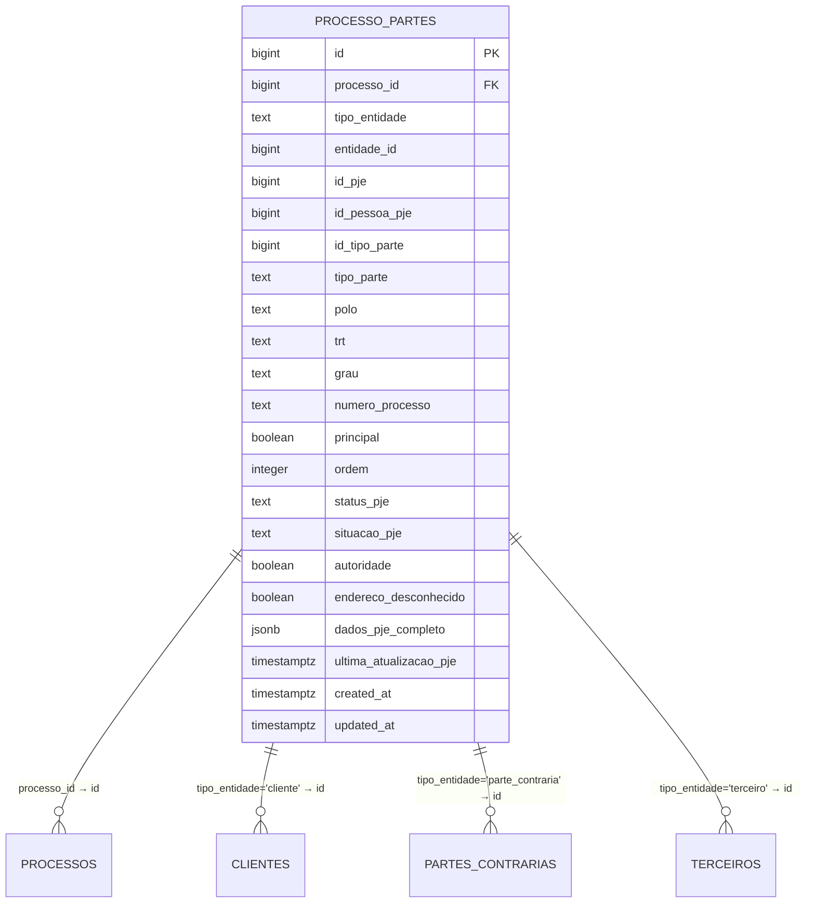
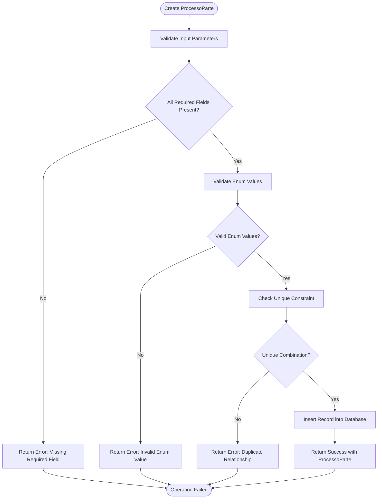
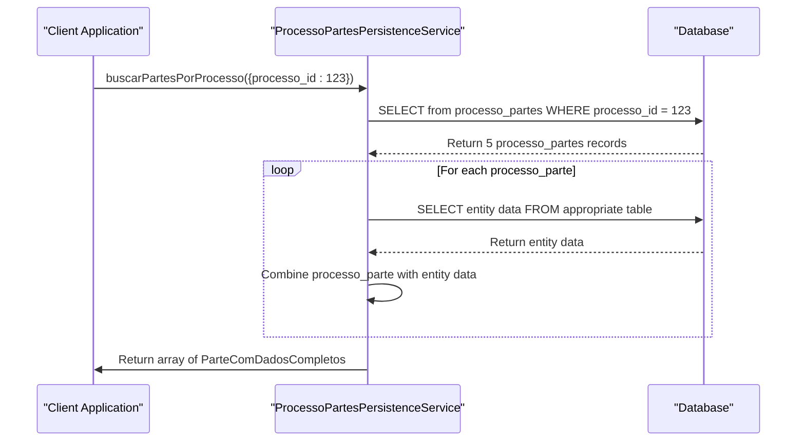

# Process Relationships

<cite>
**Referenced Files in This Document**   
- [processo-partes.ts](file://types/domain/processo-partes.ts)
- [processo-relacionado.ts](file://types/domain/processo-relacionado.ts)
- [processo-partes-persistence.service.ts](file://backend/processo-partes/services/persistence/processo-partes-persistence.service.ts)
- [17_processo_partes.sql](file://supabase/schemas/17_processo_partes.sql)
- [partes-capture.service.ts](file://backend/captura/services/partes/partes-capture.service.ts)
- [processo-partes.ts](file://types/contracts/processo-partes.ts)
- [processo-partes.ts](file://app/_lib/types/processo-partes.ts)
- [README.md](file://backend/processo-partes/README.md)
</cite>

## Table of Contents
1. [Introduction](#introduction)
2. [ProcessoPartes Entity](#processopartes-entity)
3. [ProcessoRelacionado Value Object](#processorelacionado-value-object)
4. [Business Rules and Constraints](#business-rules-and-constraints)
5. [Data Access Patterns](#data-access-patterns)
6. [Lifecycle Management](#lifecycle-management)
7. [Complex Legal Scenarios and Visualization](#complex-legal-scenarios-and-visualization)
8. [Conclusion](#conclusion)

## Introduction
The Sinesys system models legal process relationships through two primary constructs: the `ProcessoParte` entity and the `ProcessoRelacionado` value object. These components enable comprehensive tracking of party participation in legal processes and relationships between related processes. The `ProcessoParte` entity establishes the N:N relationship between processes and parties (clients, opposing parties, representatives), capturing detailed participation data including role, representation, and procedural status. The `ProcessoRelacionado` value object provides a lightweight representation of related processes for display purposes. This documentation details the data model, business rules, validation mechanisms, and access patterns that support complex legal scenarios and enable comprehensive process visualization.

**Section sources**
- [processo-partes.ts](file://types/domain/processo-partes.ts#L1-L137)
- [processo-relacionado.ts](file://types/domain/processo-relacionado.ts#L1-L21)

## ProcessoPartes Entity
The `ProcessoParte` entity represents the participation of an entity (client, opposing party, or third party) in a judicial process. It serves as the junction table in an N:N relationship between processes and parties, capturing detailed participation information. The entity includes essential fields such as `processo_id` (foreign key to the process), `tipo_entidade` (entity type: client, opposing party, or third party), `entidade_id` (ID of the specific entity), and `id_pje` (ID from the PJE system). Key participation attributes include `tipo_parte` (specific role like RECLAMANTE or RECLAMADO), `polo` (procedural pole: ATIVO, PASSIVO, NEUTRO, or TERCEIRO), and `grau` (first or second degree). The entity also tracks ordering with `ordem` and principal status with `principal`, ensuring consistent presentation. Additional fields like `dados_pje_completo` store complete PJE data as JSON for audit purposes, while `id_pessoa_pje` enables cross-referencing with the PJE person registry.

**Diagram sources**
- [17_processo_partes.sql](file://supabase/schemas/17_processo_partes.sql#L6-L69)

**Section sources**
- [processo-partes.ts](file://types/domain/processo-partes.ts#L68-L91)
- [17_processo_partes.sql](file://supabase/schemas/17_processo_partes.sql#L6-L69)

## ProcessoRelacionado Value Object
The `ProcessoRelacionado` value object provides a minimal representation of a related process for display purposes. It contains essential information needed for process listings and navigation, including `processo_id` (the process ID in the acervo table), `numero_processo` (the CNJ process number in standard format), `tipo_parte` (the type of participation), and `polo` (the procedural pole). This lightweight structure enables efficient retrieval and display of related processes without loading the full process details. The value object is designed for use in lists and summaries where complete process information is not required, optimizing performance and reducing data transfer. It supports the `EntidadeComProcessos` interface, allowing any entity to expose its related processes through a standardized property.

**Section sources**
- [processo-relacionado.ts](file://types/domain/processo-relacionado.ts#L4-L13)

## Business Rules and Constraints
The system enforces several critical business rules and constraints to maintain data integrity in process relationships. A unique constraint on `(processo_id, tipo_entidade, entidade_id, grau)` ensures that an entity appears only once per process and degree, while allowing the same entity to participate in different degrees of the same process. Check constraints validate critical fields: `tipo_entidade` must be 'cliente', 'parte_contraria', or 'terceiro'; `tipo_parte` must be one of the predefined valid types; `polo` must be 'ATIVO', 'PASSIVO', 'NEUTRO', or 'TERCEIRO'; and `grau` must be 'primeiro_grau' or 'segundo_grau'. The `ordem` field must be non-negative, and both `principal` and `ordem` are mandatory fields that cannot be null. The system validates these rules at both the database and service levels, with specific error messages for different validation failures. For example, attempting to create a duplicate relationship results in a "Vínculo duplicado" error, while invalid enum values trigger specific validation messages.

**Diagram sources**
- [17_processo_partes.sql](file://supabase/schemas/17_processo_partes.sql#L98-L107)
- [processo-partes-persistence.service.ts](file://backend/processo-partes/services/persistence/processo-partes-persistence.service.ts#L134-L270)

**Section sources**
- [17_processo_partes.sql](file://supabase/schemas/17_processo_partes.sql#L98-L107)
- [processo-partes-persistence.service.ts](file://backend/processo-partes/services/persistence/processo-partes-persistence.service.ts#L134-L270)

## Data Access Patterns
The system implements optimized data access patterns for retrieving process relationships through dedicated service methods. The `buscarPartesPorProcesso` method retrieves all parties of a specific process with complete entity data through polymorphic joins with clients, opposing parties, or third parties tables. This method returns `ParteComDadosCompletos` objects containing both participation details and entity information like name, CPF/CNPJ, and contact details. The `buscarProcessosPorEntidade` method retrieves all processes in which a specific entity participates, returning `ProcessoComParticipacao` objects with process details and participation information. Both methods include built-in ordering: parties are ordered by pole and then by order within the pole, while processes are ordered by creation date descending. The service also provides a `listarProcessoPartes` method with comprehensive filtering capabilities by entity type, process ID, TRT, degree, pole, and other criteria, supporting pagination for large result sets.

**Diagram sources**
- [processo-partes-persistence.service.ts](file://backend/processo-partes/services/persistence/processo-partes-persistence.service.ts#L422-L494)

**Section sources**
- [processo-partes-persistence.service.ts](file://backend/processo-partes/services/persistence/processo-partes-persistence.service.ts#L422-L494)
- [processo-partes.ts](file://types/domain/processo-partes.ts#L97-L115)

## Lifecycle Management
The lifecycle of process relationships is managed through a comprehensive set of CRUD operations with strict validation and error handling. The `criarProcessoParte` method creates new relationships with mandatory validation of all required fields, including the critical `principal` and `ordem` fields which cannot be null. The method uses upsert semantics with a unique constraint to prevent duplicates while allowing updates to existing relationships. The `atualizarProcessoParte` method updates existing relationships but prohibits changes to fields in the unique constraint (`processo_id`, `tipo_entidade`, `entidade_id`, `grau`) to maintain data integrity. The `desvincularParteProcesso` method removes relationships by deleting the corresponding record. All operations include detailed error handling with specific messages for different failure modes, including foreign key violations, unique constraint violations, and check constraint violations. The system logs all operations with full context for audit purposes, capturing the process ID, entity type, entity ID, degree, and any error messages.

**Section sources**
- [processo-partes-persistence.service.ts](file://backend/processo-partes/services/persistence/processo-partes-persistence.service.ts#L134-L701)

## Complex Legal Scenarios and Visualization
The process relationship model supports complex legal scenarios through its flexible design and comprehensive data capture. The ability for the same entity to participate in multiple degrees of the same process accommodates appeals and higher court proceedings. The detailed role tracking with `tipo_parte` values like RECLAMANTE, RECLAMADO, APELANTE, and APELADO enables accurate representation of evolving roles across proceedings. The system supports visualization of complex legal relationships through the `agruparPartesPorPolo` utility function, which organizes parties by procedural pole (ATIVO, PASSIVO, etc.) and within-pole order, with principal parties appearing first. This enables clear visual representation of the procedural structure in user interfaces. The complete PJE data stored in `dados_pje_completo` provides a historical record for audit and analysis, while the `ProcessoRelacionado` value object facilitates navigation between related processes. The capture service integrates with the PJE system to automatically populate these relationships, ensuring data accuracy and reducing manual entry.

**Section sources**
- [processo-partes.ts](file://app/_lib/types/processo-partes.ts#L207-L235)
- [partes-capture.service.ts](file://backend/captura/services/partes/partes-capture.service.ts#L345-L564)

## Conclusion
The process relationship model in Sinesys provides a robust foundation for managing complex legal scenarios through its well-designed `ProcessoParte` entity and supporting components. The model effectively captures the nuanced relationships between processes and parties, with comprehensive validation and business rules ensuring data integrity. The separation between the full-featured `ProcessoParte` entity and the lightweight `ProcessoRelacionado` value object enables efficient data access patterns for different use cases. The system's integration with the PJE capture service ensures accurate and automated population of relationship data, while the comprehensive API supports both creation and querying of relationships. This architecture enables rich visualization of legal proceedings and supports the complex requirements of legal practice management.