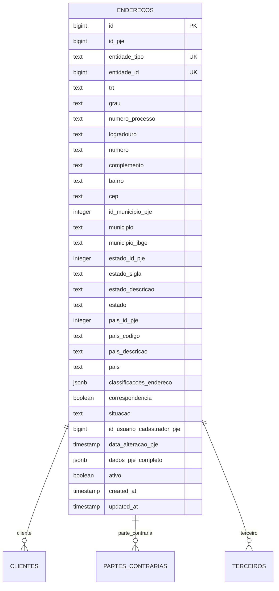
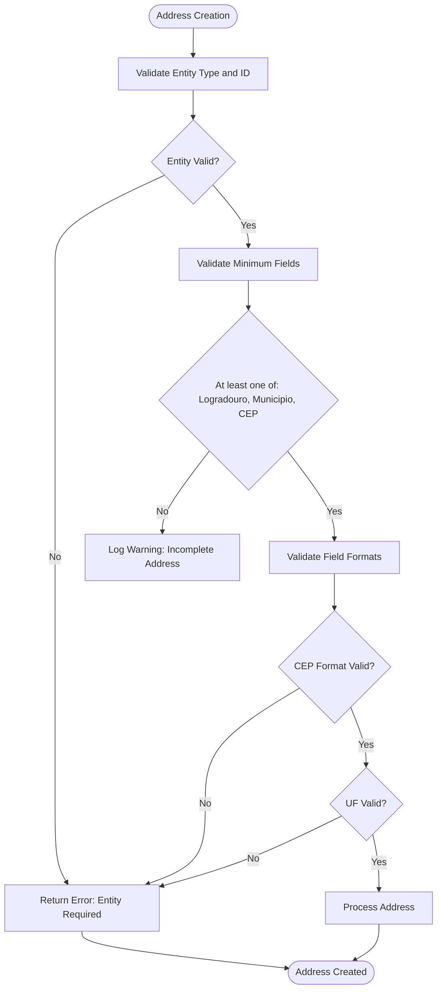
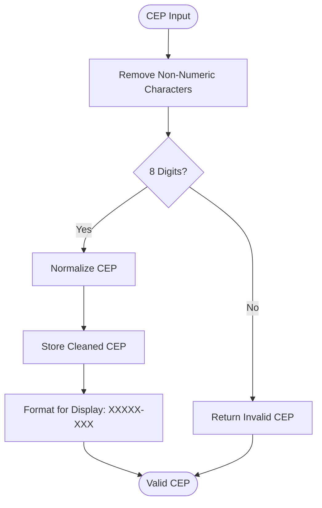
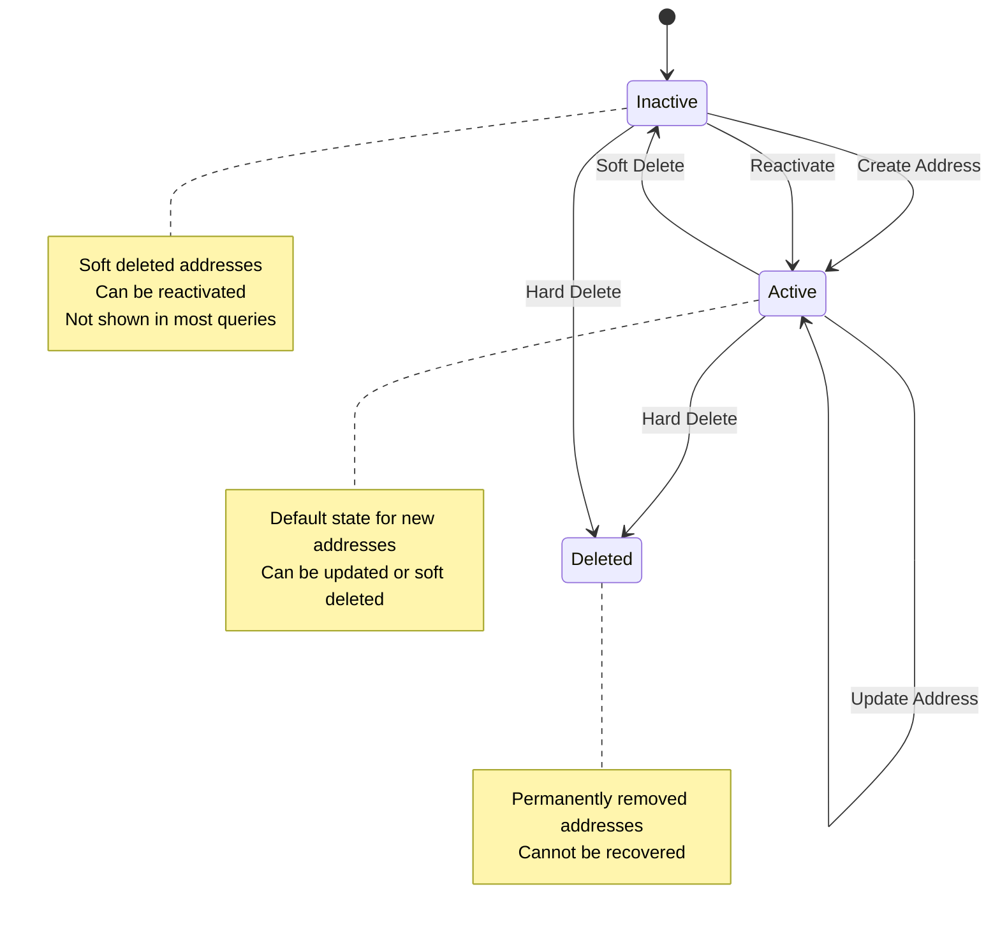
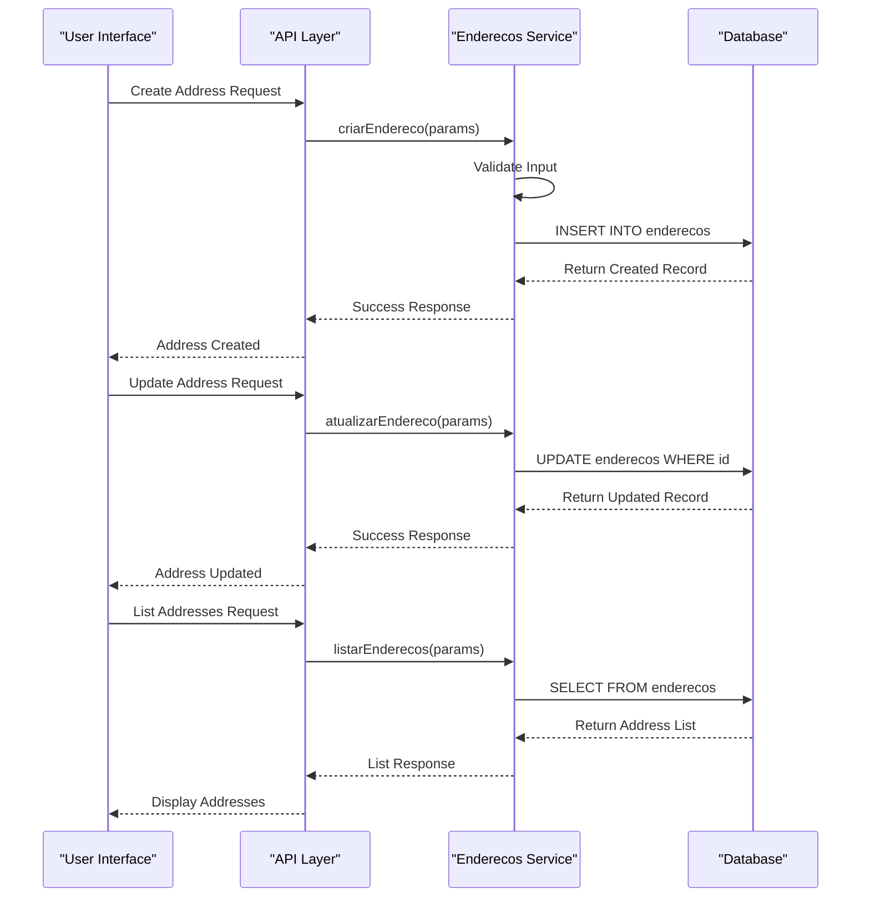
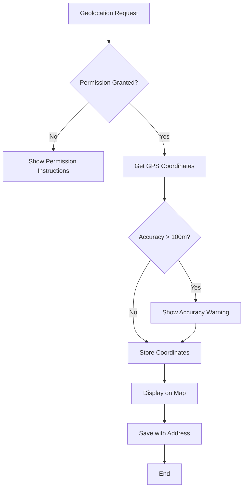
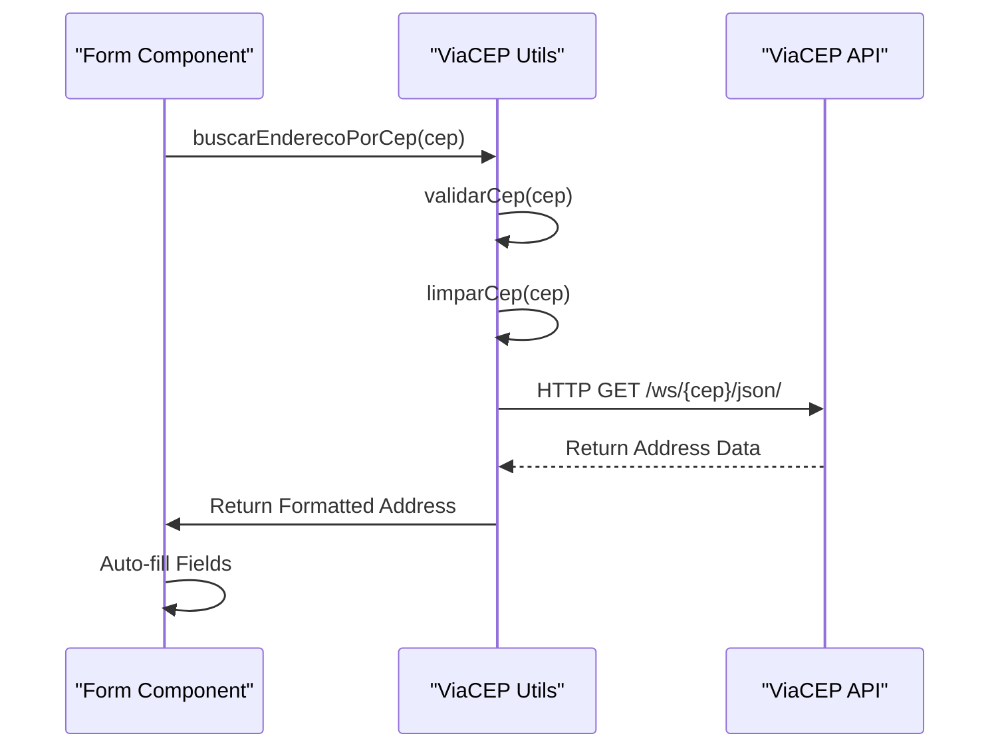

# Address Management

<cite>
**Referenced Files in This Document**   
- [enderecos-persistence.service.ts](file://backend/enderecos/services/enderecos-persistence.service.ts)
- [endereco-persistence.service.ts](file://backend/enderecos/services/persistence/endereco-persistence.service.ts)
- [enderecos-types.ts](file://backend/types/partes/enderecos-types.ts)
- [enderecos.ts](file://types/domain/enderecos.ts)
- [enderecos.sql](file://supabase/schemas/15_enderecos.sql)
- [sincronizar-entidades-enderecos.ts](file://scripts/sincronizacao/sincronizar-entidades-enderecos.ts)
- [viacep.ts](file://app/_lib/utils/viacep.ts)
- [enderecos-persistence.service.ts](file://backend/partes/services/enderecos-persistence.service.ts)
</cite>

## Table of Contents
1. [Introduction](#introduction)
2. [Data Model](#data-model)
3. [Address Associations](#address-associations)
4. [Validation Rules](#validation-rules)
5. [Lifecycle Management](#lifecycle-management)
6. [Persistence and Integration](#persistence-and-integration)
7. [Data Consistency and Geolocation](#data-consistency-and-geolocation)
8. [External Service Integration](#external-service-integration)

## Introduction
The Address Management system in Sinesys provides a comprehensive solution for managing physical and mailing addresses for all parties involved in legal processes. This system handles addresses for clients, opposing parties, representatives, and third parties through a unified data model. The Enderecos entity serves as the central component for storing and managing address information with robust validation, lifecycle management, and integration capabilities. The system ensures data consistency across different legal processes while providing seamless integration with external services like ViaCEP for address validation and geolocation services for precise location tracking.

**Section sources**
- [enderecos-persistence.service.ts](file://backend/enderecos/services/enderecos-persistence.service.ts#L1-L517)
- [enderecos.sql](file://supabase/schemas/15_enderecos.sql#L1-L94)

## Data Model
The Enderecos entity represents a physical address associated with various party types in the Sinesys system. The data model is designed to capture comprehensive address information while maintaining flexibility for different use cases and integration requirements.

**Diagram sources**
- [enderecos.sql](file://supabase/schemas/15_enderecos.sql#L6-L94)
- [enderecos.ts](file://types/domain/enderecos.ts#L30-L63)

**Section sources**
- [enderecos.ts](file://types/domain/enderecos.ts#L30-L63)
- [enderecos.sql](file://supabase/schemas/15_enderecos.sql#L6-L94)

## Address Associations
The Address Management system establishes relationships between addresses and different party types through a polymorphic association pattern. This design allows addresses to be linked to clients, opposing parties, representatives, and third parties while maintaining data integrity and efficient querying capabilities.

```mermaid
graph TD
A[Enderecos Entity] --> B[Clientes]
A --> C[Partes Contrárias]
A --> D[Terceiros]
A --> E[Representantes]
B --> F[Party Management Service]
C --> F
D --> F
E --> F
F --> G[Address Persistence Service]
G --> H[Database]
style A fill:#4CAF50,stroke:#388E3C
style B fill:#2196F3,stroke:#1976D2
style C fill:#2196F3,stroke:#1976D2
style D fill:#2196F3,stroke:#1976D2
style E fill:#2196F3,stroke:#1976D2
style F fill:#FF9800,stroke:#F57C00
style G fill:#9C27B0,stroke:#7B1FA2
style H fill:#607D8B,stroke:#455A64
```

**Diagram sources**
- [enderecos-persistence.service.ts](file://backend/enderecos/services/enderecos-persistence.service.ts#L135-L172)
- [enderecos-persistence.service.ts](file://backend/partes/services/enderecos-persistence.service.ts#L117-L158)

**Section sources**
- [enderecos-persistence.service.ts](file://backend/enderecos/services/enderecos-persistence.service.ts#L135-L172)
- [enderecos-persistence.service.ts](file://backend/partes/services/enderecos-persistence.service.ts#L117-L158)

## Validation Rules
The Address Management system implements comprehensive validation rules to ensure data quality and consistency. These rules cover mandatory field requirements, format validation, and business logic constraints.

### Mandatory Field Requirements
The system requires specific fields to be present for address creation and updates. The validation process checks for the presence of essential information while allowing flexibility for incomplete records with appropriate warnings.

**Diagram sources**
- [enderecos-persistence.service.ts](file://backend/enderecos/services/enderecos-persistence.service.ts#L139-L152)
- [enderecos-persistence.service.ts](file://backend/partes/services/enderecos-persistence.service.ts#L121-L137)

### ZIP Code Format Validation
The system implements strict validation for Brazilian ZIP code (CEP) formats, ensuring that all ZIP codes follow the standard 8-digit pattern without formatting characters.

**Diagram sources**
- [enderecos-persistence.service.ts](file://backend/enderecos/services/persistence/endereco-persistence.service.ts#L28-L31)
- [viacep.ts](file://app/_lib/utils/viacep.ts#L41-L46)

**Section sources**
- [enderecos-persistence.service.ts](file://backend/enderecos/services/persistence/endereco-persistence.service.ts#L28-L31)
- [enderecos-persistence.service.ts](file://backend/partes/services/enderecos-persistence.service.ts#L26-L32)
- [viacep.ts](file://app/_lib/utils/viacep.ts#L41-L46)

## Lifecycle Management
The Address Management system implements a comprehensive lifecycle management approach for address records, handling creation, updates, and deletion while maintaining data integrity across different legal processes.

**Diagram sources**
- [enderecos-persistence.service.ts](file://backend/enderecos/services/enderecos-persistence.service.ts#L453-L485)
- [enderecos-persistence.service.ts](file://backend/enderecos/services/enderecos-persistence.service.ts#L489-L515)

**Section sources**
- [enderecos-persistence.service.ts](file://backend/enderecos/services/enderecos-persistence.service.ts#L453-L515)

## Persistence and Integration
The Address Management system integrates with party management services through dedicated persistence services that handle CRUD operations and maintain data consistency across the application.

**Diagram sources**
- [enderecos-persistence.service.ts](file://backend/enderecos/services/enderecos-persistence.service.ts#L135-L172)
- [enderecos-persistence.service.ts](file://backend/enderecos/services/enderecos-persistence.service.ts#L184-L222)

**Section sources**
- [enderecos-persistence.service.ts](file://backend/enderecos/services/enderecos-persistence.service.ts#L135-L222)
- [sincronizar-entidades-enderecos.ts](file://scripts/sincronizacao/sincronizar-entidades-enderecos.ts#L413-L435)

## Data Consistency and Geolocation
The Address Management system ensures data consistency through various mechanisms and provides geolocation capabilities for precise address tracking.

### Data Consistency Mechanisms
The system implements several strategies to maintain data consistency across different components and services:

1. **Unique Index Constraints**: Prevents duplicate addresses by enforcing uniqueness on (id_pje, entidade_tipo, entidade_id) combinations
2. **Soft Delete Pattern**: Uses an 'ativo' boolean flag instead of physical deletion to maintain historical data
3. **Synchronization Scripts**: Regular synchronization processes ensure consistency between MongoDB capture logs and PostgreSQL database
4. **Type Safety**: Comprehensive TypeScript interfaces ensure consistent data structures across frontend and backend

### Geolocation Considerations
The system supports geolocation through browser-based GPS services, allowing for precise location capture during address verification processes. The geolocation data is stored alongside the address information for audit and verification purposes.

**Diagram sources**
- [capture/geolocation-step.tsx](file://components/assinatura-digital/capture/geolocation-step.tsx#L271-L304)
- [enderecos.sql](file://supabase/schemas/15_enderecos.sql#L49-L52)

**Section sources**
- [capture/geolocation-step.tsx](file://components/assinatura-digital/capture/geolocation-step.tsx#L271-L319)
- [enderecos.sql](file://supabase/schemas/15_enderecos.sql#L49-L52)

## External Service Integration
The Address Management system integrates with external services to enhance functionality and data quality, particularly through the ViaCEP service for address validation and auto-completion.

### ViaCEP Integration
The system integrates with ViaCEP, a free web service for Brazilian ZIP code (CEP) lookup, to provide auto-completion of address fields in forms. This integration improves data entry accuracy and user experience.

**Diagram sources**
- [viacep.ts](file://app/_lib/utils/viacep.ts#L75-L106)
- [dynamic-form-renderer.tsx](file://components/assinatura-digital/form/dynamic-form-renderer.tsx#L129-L150)

**Section sources**
- [viacep.ts](file://app/_lib/utils/viacep.ts#L75-L106)
- [ajuda/desenvolvimento/integracao-viacep/page.tsx](file://app/ajuda/desenvolvimento/integracao-viacep/page.tsx#L18-L288)
- [dynamic-form-renderer.tsx](file://components/assinatura-digital/form/dynamic-form-renderer.tsx#L129-L150)