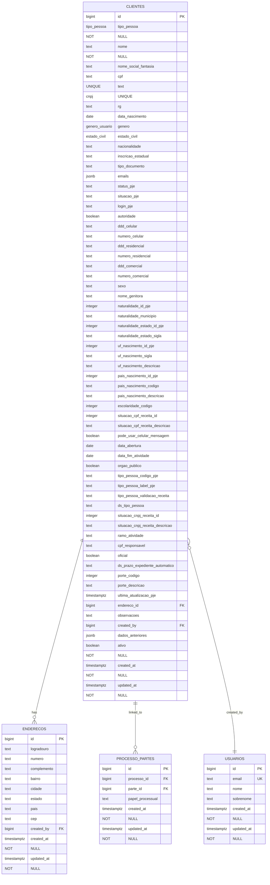
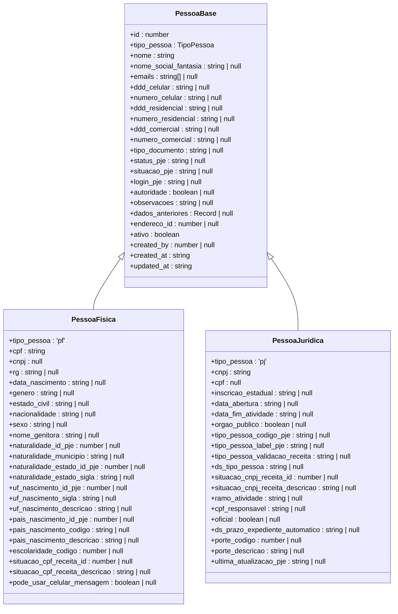
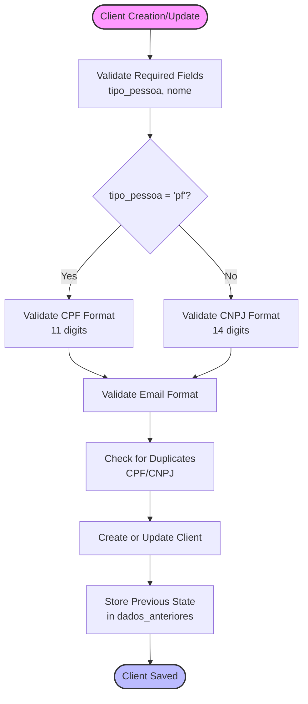
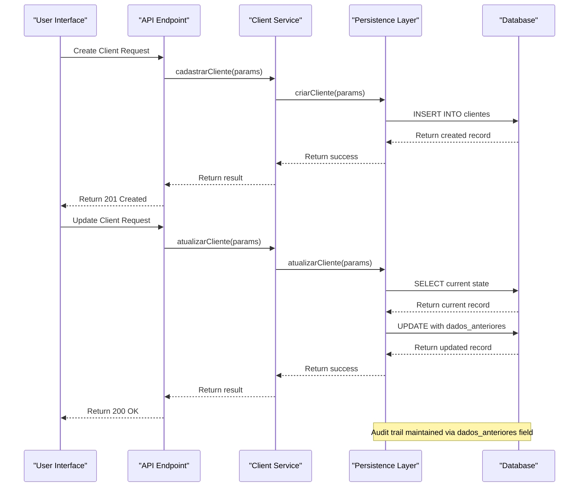
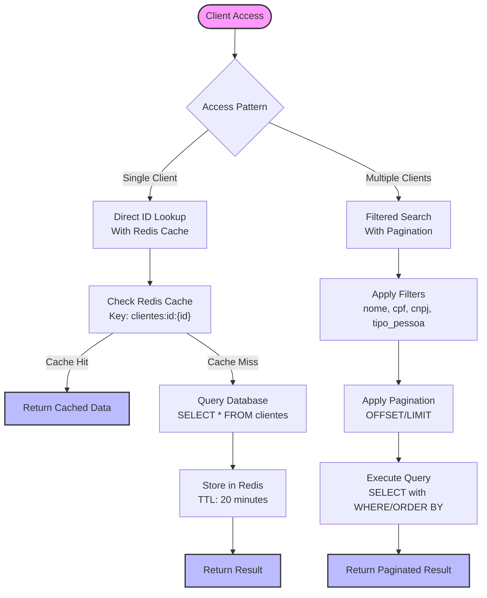
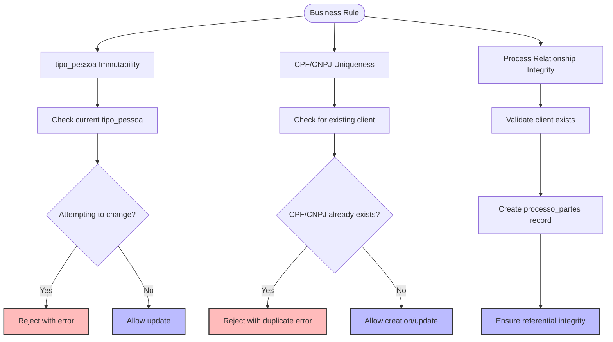
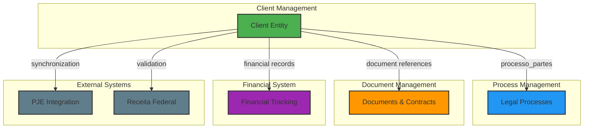
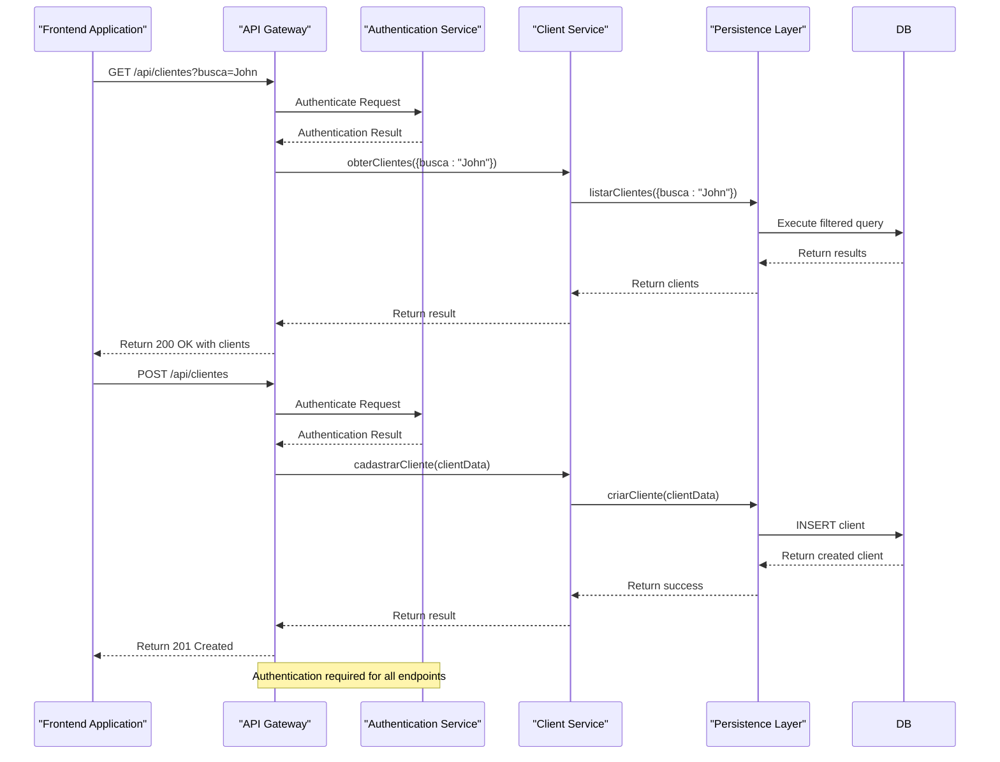

# Client Management

<cite>
**Referenced Files in This Document**   
- [09_clientes.sql](file://supabase/schemas/09_clientes.sql)
- [pessoa.ts](file://types/domain/pessoa.ts)
- [cliente-persistence.service.ts](file://backend/clientes/services/persistence/cliente-persistence.service.ts)
- [criar-cliente.service.ts](file://backend/clientes/services/clientes/criar-cliente.service.ts)
- [atualizar-cliente.service.ts](file://backend/clientes/services/clientes/atualizar-cliente.service.ts)
- [buscar-cliente.service.ts](file://backend/clientes/services/clientes/buscar-cliente.service.ts)
- [listar-clientes.service.ts](file://backend/clientes/services/clientes/listar-clientes.service.ts)
- [route.ts](file://app/api/clientes/route.ts)
</cite>

## Table of Contents
1. [Introduction](#introduction)
2. [Data Model Overview](#data-model-overview)
3. [Pessoa Base Entity](#pessoa-base-entity)
4. [Client Entity Structure](#client-entity-structure)
5. [Validation Rules](#validation-rules)
6. [Lifecycle Management](#lifecycle-management)
7. [Data Access Patterns](#data-access-patterns)
8. [Business Rules Enforcement](#business-rules-enforcement)
9. [Integration Points](#integration-points)
10. [API Endpoints](#api-endpoints)

## Introduction

The Client Management system in Sinesys provides a comprehensive solution for managing legal clients within the organization. This documentation details the data model, business rules, and implementation patterns for the Client entity, which represents legal clients in the system. The system is designed to handle both individual (Pessoa Física) and legal entity (Pessoa Jurídica) clients through a unified data model that extends from a common Pessoa base entity.

The Client Management system serves as a central component in the Sinesys platform, linking clients to legal processes, contracts, and other business entities. It provides robust validation, lifecycle management, and integration capabilities with other systems such as document management and financial tracking.

**Section sources**
- [09_clientes.sql](file://supabase/schemas/09_clientes.sql#L1-L139)
- [pessoa.ts](file://types/domain/pessoa.ts#L1-L96)

## Data Model Overview

The Client Management system is built around a relational data model that extends from a common Pessoa (Person) base entity to represent both individual and legal entity clients. The data model is implemented in PostgreSQL with Row Level Security (RLS) for access control and includes comprehensive validation rules, indexing for performance, and audit trails.

The core of the data model is the `clientes` table, which stores all client information with a discriminated union pattern that includes fields specific to either Pessoa Física (individual) or Pessoa Jurídica (legal entity). The table uses a `tipo_pessoa` field to distinguish between these two types, allowing for a single table to efficiently store both types of clients while maintaining data integrity.

**Diagram sources**
- [09_clientes.sql](file://supabase/schemas/09_clientes.sql#L8-L86)
- [15_enderecos.sql](file://supabase/schemas/15_enderecos.sql)
- [08_usuarios.sql](file://supabase/schemas/08_usuarios.sql)
- [17_processo_partes.sql](file://supabase/schemas/17_processo_partes.sql)

**Section sources**
- [09_clientes.sql](file://supabase/schemas/09_clientes.sql#L1-L139)

## Pessoa Base Entity

The Pessoa (Person) base entity serves as the foundation for the Client Management system, providing a common structure for both individual and legal entity clients. This entity is implemented as a TypeScript interface that defines the shared attributes and relationships between different types of persons in the system.

The Pessoa base entity follows the discriminated union pattern, where a `tipo_pessoa` field determines whether a record represents a Pessoa Física (individual) or Pessoa Jurídica (legal entity). This design allows for type-safe operations in the application code while maintaining a flexible data model that can accommodate the different requirements of individual and organizational clients.

The base entity includes fundamental attributes such as identification, contact information, and system metadata. These attributes are shared across both types of persons and provide a consistent interface for common operations like searching, displaying, and managing client records.

**Diagram sources**
- [pessoa.ts](file://types/domain/pessoa.ts#L8-L93)

**Section sources**
- [pessoa.ts](file://types/domain/pessoa.ts#L1-L96)

## Client Entity Structure

The Client entity in Sinesys extends the Pessoa base entity to provide specialized functionality for legal clients. The entity structure is implemented as a PostgreSQL table with comprehensive field definitions, constraints, and indexes to ensure data integrity and optimal performance.

The Client entity follows a discriminated union pattern, where the `tipo_pessoa` field determines whether a record represents an individual (PF) or legal entity (PJ). This design allows for a single table to efficiently store both types of clients while maintaining data integrity through appropriate constraints and validation rules.

For individual clients (Pessoa Física), the entity includes personal information such as CPF (individual taxpayer registry), RG (identity document), date of birth, gender, marital status, and nationality. It also includes detailed information from the PJE (Processo Judicial Eletrônico) system, such as gender, mother's name, birthplace, educational level, and tax status.

For legal entity clients (Pessoa Jurídica), the entity includes business information such as CNPJ (corporate taxpayer registry), state registration, date of incorporation, business activity sector, and company size. It also includes PJE-specific information such as the legal entity type, tax status, responsible person's CPF, and official status.

The entity includes a flexible contact information structure with multiple phone numbers (mobile, residential, commercial) and email addresses stored as a JSONB array. This allows for multiple contact points while maintaining a normalized data structure.

```mermaid
erDiagram
CLIENTES {
bigint id PK
tipo_pessoa tipo_pessoa NOT NULL
text nome NOT NULL
text nome_social_fantasia
text cpf UNIQUE
text cnpj UNIQUE
text rg
date data_nascimento
genero_usuario genero
estado_civil estado_civil
text nacionalidade
text inscricao_estadual
text tipo_documento
jsonb emails
text status_pje
text situacao_pje
text login_pje
boolean autoridade
text ddd_celular
text numero_celular
text ddd_residencial
text numero_residencial
text ddd_comercial
text numero_comercial
text sexo
text nome_genitora
integer naturalidade_id_pje
text naturalidade_municipio
integer naturalidade_estado_id_pje
text naturalidade_estado_sigla
integer uf_nascimento_id_pje
text uf_nascimento_sigla
text uf_nascimento_descricao
integer pais_nascimento_id_pje
text pais_nascimento_codigo
text pais_nascimento_descricao
integer escolaridade_codigo
integer situacao_cpf_receita_id
text situacao_cpf_receita_descricao
boolean pode_usar_celular_mensagem
date data_abertura
date data_fim_atividade
boolean orgao_publico
text tipo_pessoa_codigo_pje
text tipo_pessoa_label_pje
text tipo_pessoa_validacao_receita
text ds_tipo_pessoa
integer situacao_cnpj_receita_id
text situacao_cnpj_receita_descricao
text ramo_atividade
text cpf_responsavel
boolean oficial
text ds_prazo_expediente_automatico
integer porte_codigo
text porte_descricao
timestamptz ultima_atualizacao_pje
bigint endereco_id FK
text observacoes
bigint created_by FK
jsonb dados_anteriores
boolean ativo NOT NULL
timestamptz created_at NOT NULL
timestamptz updated_at NOT NULL
}
CLIENTES ||--o{ ENDERECOS : "has"
CLIENTES }o--|| USUARIOS : "created_by"
```

**Diagram sources**
- [09_clientes.sql](file://supabase/schemas/09_clientes.sql#L8-L86)

**Section sources**
- [09_clientes.sql](file://supabase/schemas/09_clientes.sql#L1-L139)

## Validation Rules

The Client Management system implements comprehensive validation rules to ensure data quality and integrity. These rules are enforced at multiple levels: database constraints, service layer validation, and API endpoint validation.

At the database level, the system uses PostgreSQL constraints to enforce data integrity. The `clientes` table has unique constraints on CPF and CNPJ fields to prevent duplicate clients. The `tipo_pessoa` field is constrained to valid values ('pf' or 'pj') through a foreign key relationship with the `tipo_pessoa` enum. Required fields such as `nome` and `tipo_pessoa` are marked as NOT NULL to ensure essential information is always present.

The service layer implements additional validation rules in the `cliente-persistence.service.ts` file. These include format validation for CPF and CNPJ numbers, email address validation, and business rule validation. For example, when creating a new client, the system validates that CPF is provided for individual clients and CNPJ is provided for legal entities. It also checks for duplicate clients based on CPF/CNPJ before allowing creation.

**Diagram sources**
- [cliente-persistence.service.ts](file://backend/clientes/services/persistence/cliente-persistence.service.ts#L43-L62)
- [criar-cliente.service.ts](file://backend/clientes/services/clientes/criar-cliente.service.ts#L18-L25)

**Section sources**
- [cliente-persistence.service.ts](file://backend/clientes/services/persistence/cliente-persistence.service.ts#L40-L800)
- [09_clientes.sql](file://supabase/schemas/09_clientes.sql#L15-L16)

## Lifecycle Management

The Client Management system implements a comprehensive lifecycle management process for client records, from creation to archival. This lifecycle is designed to ensure data integrity, maintain audit trails, and support business operations throughout the client relationship.

The creation process begins with the `cadastrarCliente` function in the `criar-cliente.service.ts` file, which validates input data, checks for duplicates, and creates a new client record in the database. During creation, the system normalizes CPF and CNPJ numbers by removing formatting characters and stores them in a consistent format. It also sets default values for optional fields and records the creating user in the `created_by` field.

When updating client information, the system follows a careful process to maintain data integrity and auditability. The `atualizarCliente` function in the `atualizar-cliente.service.ts` file first retrieves the current state of the client record and stores it in the `dados_anteriores` field before applying any changes. This creates a complete audit trail of all modifications to client information. The system also prevents changes to the `tipo_pessoa` field after creation, ensuring that a client cannot be converted from individual to legal entity or vice versa.

**Diagram sources**
- [criar-cliente.service.ts](file://backend/clientes/services/clientes/criar-cliente.service.ts#L26-L62)
- [atualizar-cliente.service.ts](file://backend/clientes/services/clientes/atualizar-cliente.service.ts#L20-L48)
- [cliente-persistence.service.ts](file://backend/clientes/services/persistence/cliente-persistence.service.ts#L173-L800)

**Section sources**
- [cliente-persistence.service.ts](file://backend/clientes/services/persistence/cliente-persistence.service.ts#L173-L800)
- [criar-cliente.service.ts](file://backend/clientes/services/clientes/criar-cliente.service.ts#L26-L62)
- [atualizar-cliente.service.ts](file://backend/clientes/services/clientes/atualizar-cliente.service.ts#L20-L48)

## Data Access Patterns

The Client Management system implements efficient data access patterns to support various use cases while maintaining performance and scalability. These patterns are designed to handle both individual client retrieval and bulk operations for listing and searching clients.

For individual client retrieval, the system uses direct ID-based lookups with Redis caching to minimize database load. The `buscarClientePorId` function in the `cliente-persistence.service.ts` file first checks Redis for a cached version of the client record before querying the database. This reduces response times for frequently accessed client records and decreases database load.

For bulk operations such as listing and searching clients, the system implements pagination and filtering to handle large datasets efficiently. The `listarClientes` function supports various filter parameters including name, CPF/CNPJ, and client type, with appropriate database indexes to ensure fast query performance. The system also supports including related data such as addresses and associated processes through optional parameters.

**Diagram sources**
- [cliente-persistence.service.ts](file://backend/clientes/services/persistence/cliente-persistence.service.ts#L528-L720)
- [listar-clientes.service.ts](file://backend/clientes/services/clientes/listar-clientes.service.ts#L32-L49)

**Section sources**
- [cliente-persistence.service.ts](file://backend/clientes/services/persistence/cliente-persistence.service.ts#L528-L720)
- [listar-clientes.service.ts](file://backend/clientes/services/clientes/listar-clientes.service.ts#L1-L49)

## Business Rules Enforcement

The Client Management system enforces several critical business rules to maintain data integrity and support legal compliance. These rules are implemented at multiple levels of the application architecture to ensure they cannot be bypassed.

One of the key business rules is the immutability of the `tipo_pessoa` field after client creation. Once a client is created as either an individual (PF) or legal entity (PJ), this classification cannot be changed. This rule is enforced in the `atualizarCliente` function, which explicitly checks for attempts to modify the `tipo_pessoa` field and rejects such requests with an appropriate error message.

Another important business rule is the prevention of duplicate clients based on CPF and CNPJ. The system uses unique constraints at the database level and validation at the service layer to ensure that no two clients can have the same CPF or CNPJ. When creating or updating a client, the system checks for existing records with the same identification number and prevents the operation if a duplicate is found.

The system also enforces data consistency rules for related entities. For example, when a client is linked to legal processes, this relationship is managed through the `processo_partes` table, which ensures referential integrity between clients and processes. The system validates that a client exists before allowing it to be associated with a process.

**Diagram sources**
- [cliente-persistence.service.ts](file://backend/clientes/services/persistence/cliente-persistence.service.ts#L358-L361)
- [09_clientes.sql](file://supabase/schemas/09_clientes.sql#L15-L16)
- [17_processo_partes.sql](file://supabase/schemas/17_processo_partes.sql)

**Section sources**
- [cliente-persistence.service.ts](file://backend/clientes/services/persistence/cliente-persistence.service.ts#L339-L523)
- [09_clientes.sql](file://supabase/schemas/09_clientes.sql#L15-L16)

## Integration Points

The Client Management system integrates with several other components of the Sinesys platform to provide a comprehensive legal practice management solution. These integrations enable seamless data flow between client management, document management, financial tracking, and other business processes.

The primary integration point is with the legal process management system through the `processo_partes` table. This table establishes the relationship between clients and legal processes, allowing clients to be associated with one or more cases. The integration ensures that client information is consistently available throughout the process lifecycle, from initial filing to case closure.

Another key integration is with the document management system. Client records are linked to relevant documents such as contracts, agreements, and legal filings. This integration allows users to easily access all documents related to a specific client from the client's profile page. The system also supports document generation from client data, enabling automated creation of legal documents with pre-filled client information.

**Diagram sources**
- [17_processo_partes.sql](file://supabase/schemas/17_processo_partes.sql)
- [documentos](file://backend/documentos/services/persistence/)
- [financeiro](file://backend/financeiro/services/)

**Section sources**
- [17_processo_partes.sql](file://supabase/schemas/17_processo_partes.sql)
- [cliente-persistence.service.ts](file://backend/clientes/services/persistence/cliente-persistence.service.ts)

## API Endpoints

The Client Management system exposes a RESTful API that provides programmatic access to client data and operations. These endpoints follow standard HTTP methods and status codes, making them easy to integrate with frontend applications and external systems.

The primary API endpoint for clients is `/api/clientes`, which supports both GET and POST methods. The GET method allows clients to be listed with various filtering and pagination options, while the POST method creates new client records. The endpoint requires authentication through bearer tokens, session cookies, or service API keys, ensuring that only authorized users can access client data.

Additional endpoints provide specialized functionality for client retrieval. The `/api/clientes/buscar/por-cpf/[cpf]` and `/api/clientes/buscar/por-cnpj/[cnpj]` endpoints allow clients to be retrieved by their identification numbers, while the `/api/clientes/buscar/por-nome/[nome]` endpoint supports name-based searches. These endpoints are optimized for performance with appropriate database indexes and caching mechanisms.

**Diagram sources**
- [route.ts](file://app/api/clientes/route.ts#L1-L267)
- [api-auth.ts](file://backend/auth/api-auth.ts)

**Section sources**
- [route.ts](file://app/api/clientes/route.ts#L1-L267)