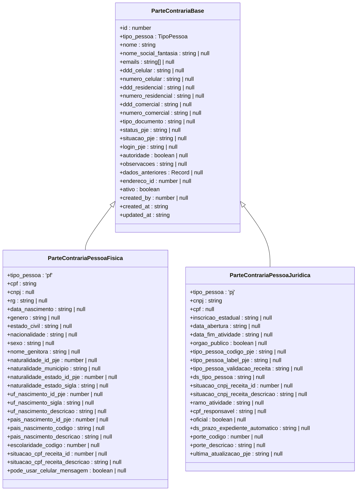
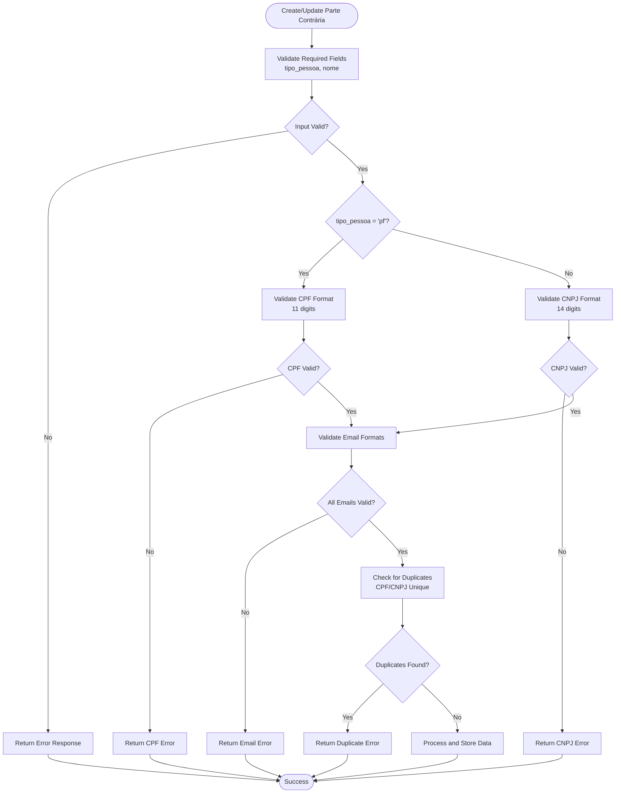
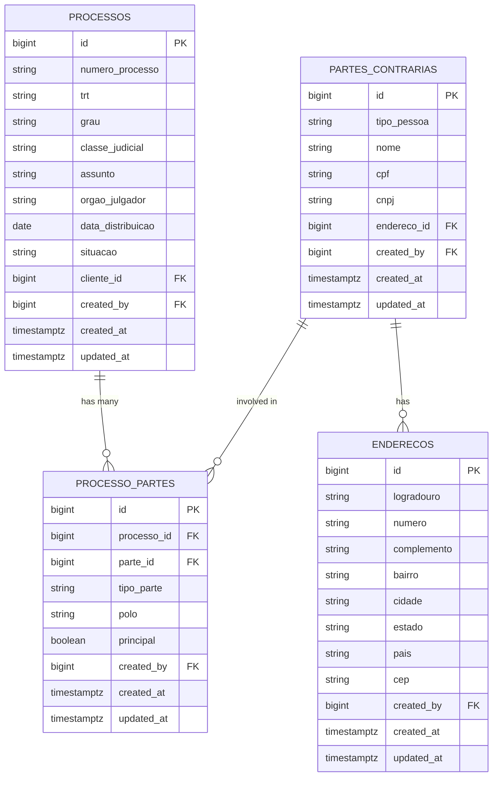
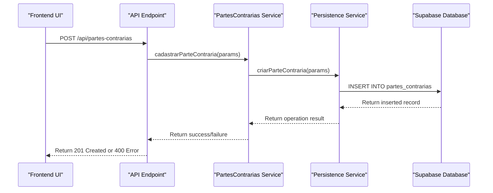
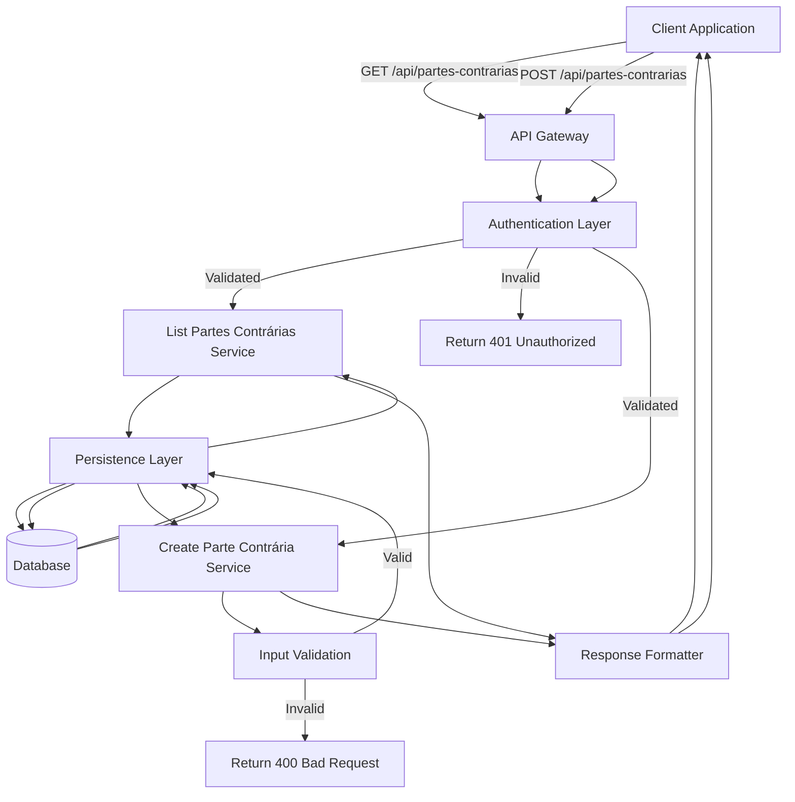

# Opposing Parties

<cite>
**Referenced Files in This Document**   
- [10_partes_contrarias.sql](file://supabase/schemas/10_partes_contrarias.sql)
- [parte-contraria-persistence.service.ts](file://backend/partes-contrarias/services/persistence/parte-contraria-persistence.service.ts)
- [criar-parte-contraria.service.ts](file://backend/partes-contrarias/services/partes-contrarias/criar-parte-contraria.service.ts)
- [atualizar-parte-contraria.service.ts](file://backend/partes-contrarias/services/partes-contrarias/atualizar-parte-contraria.service.ts)
- [partes-contrarias-types.ts](file://backend/types/partes/partes-contrarias-types.ts)
- [partes-contrarias.ts](file://types/domain/partes.ts)
- [route.ts](file://app/api/partes-contrarias/route.ts)
- [por-nome/[nome]/route.ts](file://app/api/partes-contrarias/buscar/por-nome/[nome]/route.ts)
- [partes-contrarias-tab.tsx](file://app/(dashboard)/partes/components/partes-contrarias-tab.tsx)
- [use-partes-contrarias.ts](file://app/_lib/hooks/use-partes-contrarias.ts)
</cite>

## Table of Contents
1. [Introduction](#introduction)
2. [Data Model Overview](#data-model-overview)
3. [Core Entity: PartesContrarias](#core-entity-partescontrarias)
4. [Pessoa Entity Integration](#pessoa-entity-integration)
5. [Validation and Verification Processes](#validation-and-verification-processes)
6. [Relationship with Legal Processes](#relationship-with-legal-processes)
7. [Data Persistence and Business Logic](#data-persistence-and-business-logic)
8. [API Endpoints and Data Access](#api-endpoints-and-data-access)
9. [Privacy and Security Considerations](#privacy-and-security-considerations)
10. [Integration with Case Management](#integration-with-case-management)

## Introduction

The Opposing Parties system in Sinesys manages information about parties involved in legal processes who are on the opposing side of a case. This documentation provides a comprehensive overview of the PartesContrarias entity, which represents these opposing parties with detailed attributes including personal identification, contact information, and legal representation details. The system leverages a unified Pessoa entity structure to maintain consistency across different party types while providing specialized fields for both physical and legal entities. This documentation covers the data model, validation processes, relationship with legal cases, and integration points within the Sinesys ecosystem.

**Section sources**
- [10_partes_contrarias.sql](file://supabase/schemas/10_partes_contrarias.sql#L1-L139)
- [partes-contrarias.ts](file://types/domain/partes.ts#L100-L190)

## Data Model Overview

The Opposing Parties data model is designed to capture comprehensive information about parties involved in legal proceedings. The system follows a normalized database structure with the primary `partes_contrarias` table serving as the central repository for all opposing party information. The data model supports both physical persons (Pessoa Física) and legal entities (Pessoa Jurídica) through a discriminated union pattern, where the `tipo_pessoa` field determines which set of attributes is applicable. The model includes extensive validation rules, particularly for identification numbers (CPF/CNPJ), and maintains audit trails through `created_at`, `updated_at`, and `dados_anteriores` fields that store previous versions of records.

```mermaid
erDiagram
PARTES_CONTRARIAS {
bigint id PK
string tipo_pessoa "pf|pj"
string nome
string nome_social_fantasia
string cpf UK
string cnpj UK
string rg
date data_nascimento
string genero
string estado_civil
string nacionalidade
string inscricao_estadual
string tipo_documento "CPF|CNPJ"
jsonb emails
string status_pje
string situacao_pje
string login_pje
boolean autoridade
string ddd_celular
string numero_celular
string ddd_residencial
string numero_residencial
string ddd_comercial
string numero_comercial
string sexo
string nome_genitora
integer naturalidade_id_pje
string naturalidade_municipio
integer naturalidade_estado_id_pje
string naturalidade_estado_sigla
integer uf_nascimento_id_pje
string uf_nascimento_sigla
string uf_nascimento_descricao
integer pais_nascimento_id_pje
string pais_nascimento_codigo
string pais_nascimento_descricao
integer escolaridade_codigo
integer situacao_cpf_receita_id
string situacao_cpf_receita_descricao
boolean pode_usar_celular_mensagem
date data_abertura
date data_fim_atividade
boolean orgao_publico
string tipo_pessoa_codigo_pje
string tipo_pessoa_label_pje
string tipo_pessoa_validacao_receita
string ds_tipo_pessoa
integer situacao_cnpj_receita_id
string situacao_cnpj_receita_descricao
string ramo_atividade
string cpf_responsavel
boolean oficial
string ds_prazo_expediente_automatico
integer porte_codigo
string porte_descricao
timestamptz ultima_atualizacao_pje
bigint endereco_id FK
text observacoes
bigint created_by FK
jsonb dados_anteriores
boolean ativo
timestamptz created_at
timestamptz updated_at
}
ENDERECOS {
bigint id PK
string logradouro
string numero
string complemento
string bairro
string cidade
string estado
string pais
string cep
bigint created_by FK
timestamptz created_at
timestamptz updated_at
}
PROCESSO_PARTES {
bigint id PK
bigint processo_id FK
bigint parte_id FK
string tipo_parte
string polo
boolean principal
bigint created_by FK
timestamptz created_at
timestamptz updated_at
}
PARTES_CONTRARIAS ||--o{ ENDERECOS : "has"
PARTES_CONTRARIAS ||--o{ PROCESSO_PARTES : "involved in"
```

**Diagram sources **
- [10_partes_contrarias.sql](file://supabase/schemas/10_partes_contrarias.sql#L8-L86)
- [15_enderecos.sql](file://supabase/schemas/15_enderecos.sql)
- [17_processo_partes.sql](file://supabase/schemas/17_processo_partes.sql)

**Section sources**
- [10_partes_contrarias.sql](file://supabase/schemas/10_partes_contrarias.sql#L1-L139)
- [partes-contrarias.ts](file://types/domain/partes.ts#L100-L190)

## Core Entity: PartesContrarias

The PartesContrarias entity serves as the primary representation of opposing parties in the Sinesys system. This entity is implemented as a single database table with comprehensive fields to capture both physical and legal entity information. The entity is distinguished by its type through the `tipo_pessoa` field, which can be either 'pf' (physical person) or 'pj' (legal entity). For physical persons, the entity captures personal identification details including CPF (Cadastro de Pessoas Físicas), RG (Registro Geral), date of birth, gender, and family information. For legal entities, it captures CNPJ (Cadastro Nacional da Pessoa Jurídica), incorporation date, business activity sector, and corporate structure details.

The entity includes specialized fields for integration with the PJE (Processo Judicial Eletrônico) system, such as PJE login credentials, status information, and detailed validation data from government registries (Receita Federal). The system maintains data integrity through unique constraints on CPF and CNPJ fields, ensuring no duplicate entries for the same identification number. Additionally, the entity supports soft deletion through the `ativo` boolean field, allowing records to be deactivated without permanent removal from the database.

**Section sources**
- [10_partes_contrarias.sql](file://supabase/schemas/10_partes_contrarias.sql#L11-L86)
- [partes-contrarias.ts](file://types/domain/partes.ts#L105-L190)

## Pessoa Entity Integration

The Opposing Parties system leverages a unified Pessoa (Person) entity pattern to maintain consistency across different party types in Sinesys. This design approach ensures that common attributes such as name, contact information, and address are standardized across clients, opposing parties, and third parties. The PartesContrarias entity extends this base Pessoa structure with additional fields specific to opposing parties in legal contexts.

The integration is implemented through a discriminated union pattern in TypeScript, where the `ParteContraria` type is defined as a union of `ParteContrariaPessoaFisica` and `ParteContrariaPessoaJuridica`. This allows the system to provide type-safe access to fields while maintaining a single interface for common operations. The shared structure includes contact information (emails, phone numbers), address reference, and audit metadata. This unified approach simplifies data management, reduces code duplication, and ensures consistent user experience across different party management interfaces.

**Diagram sources **
- [partes-contrarias.ts](file://types/domain/partes.ts#L105-L190)
- [partes-contrarias-types.ts](file://backend/types/partes/partes-contrarias-types.ts#L5-L60)

**Section sources**
- [partes-contrarias.ts](file://types/domain/partes.ts#L105-L190)
- [partes-contrarias-types.ts](file://backend/types/partes/partes-contrarias-types.ts#L5-L60)

## Validation and Verification Processes

The Opposing Parties system implements comprehensive validation and verification processes to ensure data accuracy and integrity. These processes occur at multiple levels: client-side validation in the user interface, server-side validation in API endpoints, and database-level constraints. The system performs format validation for identification numbers, ensuring CPF values contain exactly 11 digits and CNPJ values contain 14 digits. Email addresses are validated against standard email format patterns before being accepted into the system.

Name standardization is enforced through trimming and case normalization, ensuring consistent representation of party names across the system. The system also implements business rule validation, such as requiring CPF for physical persons and CNPJ for legal entities, and preventing changes to the party type after creation. Duplicate detection is handled through unique constraints on CPF and CNPJ fields, with appropriate error messages returned when attempts are made to create duplicate entries.

**Diagram sources **
- [parte-contraria-persistence.service.ts](file://backend/partes-contrarias/services/persistence/parte-contraria-persistence.service.ts#L186-L313)
- [criar-parte-contraria.service.ts](file://backend/partes-contrarias/services/partes-contrarias/criar-parte-contraria.service.ts#L19-L53)

**Section sources**
- [parte-contraria-persistence.service.ts](file://backend/partes-contrarias/services/persistence/parte-contraria-persistence.service.ts#L49-L313)
- [criar-parte-contraria.service.ts](file://backend/partes-contrarias/services/partes-contrarias/criar-parte-contraria.service.ts#L19-L53)

## Relationship with Legal Processes

Opposing parties are linked to specific legal processes through the processo_partes junction table, which establishes many-to-many relationships between processes and parties. This relationship model allows a single opposing party to be involved in multiple legal cases while also supporting complex cases with multiple opposing parties. The relationship includes metadata such as the party's role (tipo_parte), procedural side (polo), and whether they are the principal party in the case.

The system supports document generation and court filings by providing complete party information to document templates. When generating legal documents, the system retrieves the opposing party's details including full name, identification numbers, and address information to ensure accurate representation in official filings. The integration with the PJE system allows for automatic population of party information in electronic court submissions, reducing manual data entry and minimizing errors in legal documentation.

**Diagram sources **
- [17_processo_partes.sql](file://supabase/schemas/17_processo_partes.sql)
- [10_partes_contrarias.sql](file://supabase/schemas/10_partes_contrarias.sql)
- [04_acervo.sql](file://supabase/schemas/04_acervo.sql)

**Section sources**
- [17_processo_partes.sql](file://supabase/schemas/17_processo_partes.sql)
- [parte-contraria-persistence.service.ts](file://backend/partes-contrarias/services/persistence/parte-contraria-persistence.service.ts#L768-L798)

## Data Persistence and Business Logic

The Opposing Parties system implements a layered architecture for data persistence and business logic, separating concerns between API endpoints, service layers, and database operations. The core persistence logic is encapsulated in the `parte-contraria-persistence.service.ts` file, which provides CRUD operations for the partes_contrarias table. This service handles database interactions, data transformation, and transaction management while enforcing business rules and validation constraints.

Business logic is implemented in dedicated service files such as `criar-parte-contraria.service.ts` and `atualizar-parte-contraria.service.ts`, which orchestrate the workflow for creating and updating opposing party records. These services handle logging, error management, and integration with other system components. The architecture follows a clean separation of concerns, with the persistence layer focusing on data storage and retrieval, while the service layer manages business rules and workflow coordination.

**Diagram sources **
- [criar-parte-contraria.service.ts](file://backend/partes-contrarias/services/partes-contrarias/criar-parte-contraria.service.ts)
- [parte-contraria-persistence.service.ts](file://backend/partes-contrarias/services/persistence/parte-contraria-persistence.service.ts)
- [route.ts](file://app/api/partes-contrarias/route.ts)

**Section sources**
- [criar-parte-contraria.service.ts](file://backend/partes-contrarias/services/partes-contrarias/criar-parte-contraria.service.ts)
- [parte-contraria-persistence.service.ts](file://backend/partes-contrarias/services/persistence/parte-contraria-persistence.service.ts#L179-L324)
- [route.ts](file://app/api/partes-contrarias/route.ts#L199-L239)

## API Endpoints and Data Access

The Opposing Parties system provides a comprehensive set of API endpoints for data access and manipulation. The primary endpoint at `/api/partes-contrarias` supports both listing operations with filtering and pagination, and creation of new opposing party records. The endpoint implements authentication and authorization checks to ensure data security, supporting multiple authentication methods including bearer tokens, session authentication, and service API keys.

Additional specialized endpoints provide targeted search capabilities, such as `/api/partes-contrarias/buscar/por-nome/{nome}` which enables partial name matching for quick party lookup. These endpoints support various query parameters for filtering by party type, active status, and search terms, allowing clients to efficiently retrieve specific subsets of data. The API returns standardized response formats with success indicators and data payloads, making integration with frontend components straightforward and predictable.

**Diagram sources **
- [route.ts](file://app/api/partes-contrarias/route.ts)
- [por-nome/[nome]/route.ts](file://app/api/partes-contrarias/buscar/por-nome/[nome]/route.ts)

**Section sources**
- [route.ts](file://app/api/partes-contrarias/route.ts)
- [por-nome/[nome]/route.ts](file://app/api/partes-contrarias/buscar/por-nome/[nome]/route.ts)

## Privacy and Security Considerations

The Opposing Parties system implements robust privacy and security measures to protect sensitive personal and corporate information. Row Level Security (RLS) is enabled on the partes_contrarias table, with policies that restrict access based on user roles and authentication status. The service role has full access to the table, while authenticated users have read access to all records. This ensures that only authorized personnel can access opposing party information.

Sensitive fields such as identification numbers, contact information, and personal details are protected through database-level security policies and application-level access controls. The system maintains an audit trail of all changes through the `dados_anteriores` field, which stores the previous state of a record before updates, and the `created_by` field, which tracks the user responsible for creating or modifying records. These audit features support compliance with data protection regulations and enable accountability for data changes.

**Section sources**
- [10_partes_contrarias.sql](file://supabase/schemas/10_partes_contrarias.sql#L125-L139)
- [parte-contraria-persistence.service.ts](file://backend/partes-contrarias/services/persistence/parte-contraria-persistence.service.ts#L502-L519)

## Integration with Case Management

The Opposing Parties system is tightly integrated with the broader case management workflows in Sinesys. When a new legal process is created, users can link existing opposing parties or create new ones directly from the process management interface. This integration ensures that party information is consistently maintained across all related cases and reduces data entry errors.

The system supports document generation workflows by providing opposing party data to document templates used for court filings, correspondence, and internal memos. When generating documents, the system automatically populates party details such as full names, identification numbers, and addresses, ensuring accuracy and consistency in legal documentation. The integration with the PJE system allows for seamless submission of documents to electronic court systems, with party information automatically formatted according to court requirements.

**Section sources**
- [parte-contraria-persistence.service.ts](file://backend/partes-contrarias/services/persistence/parte-contraria-persistence.service.ts#L601-L658)
- [use-partes-contrarias.ts](file://app/_lib/hooks/use-partes-contrarias.ts)
- [partes-contrarias-tab.tsx](file://app/(dashboard)/partes/components/partes-contrarias-tab.tsx)