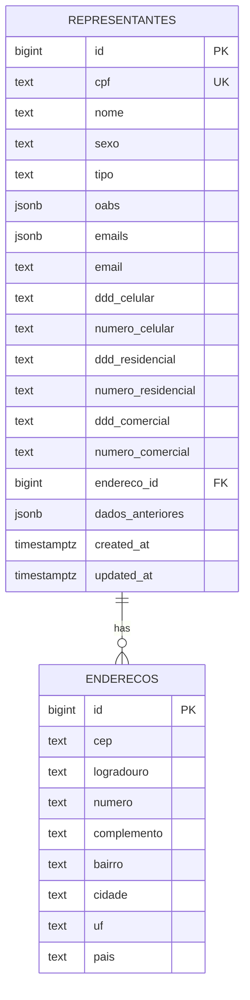
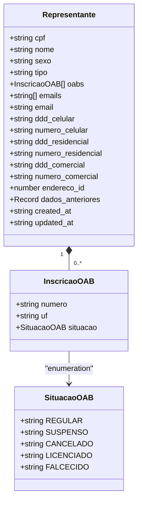
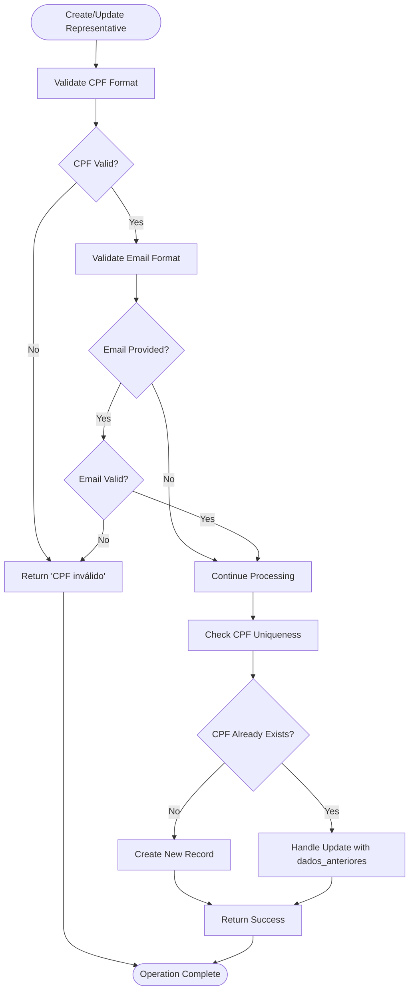
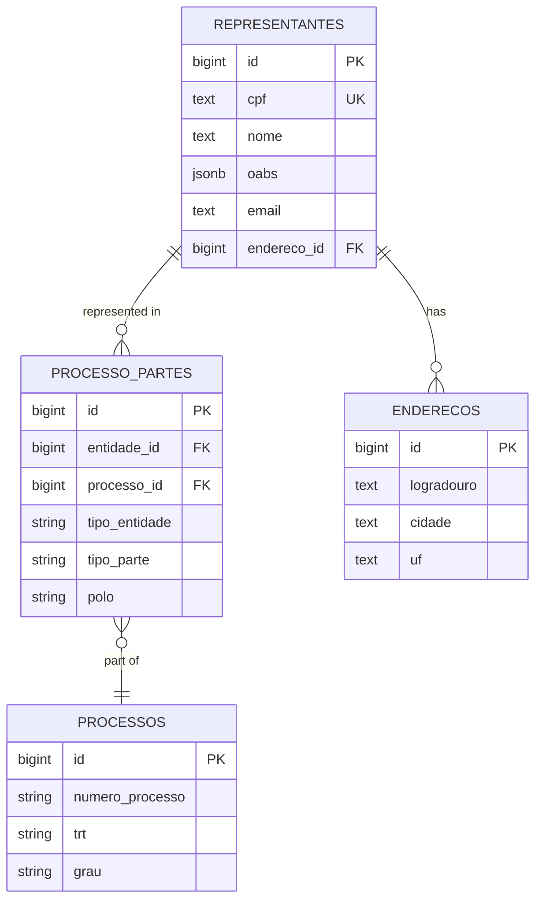
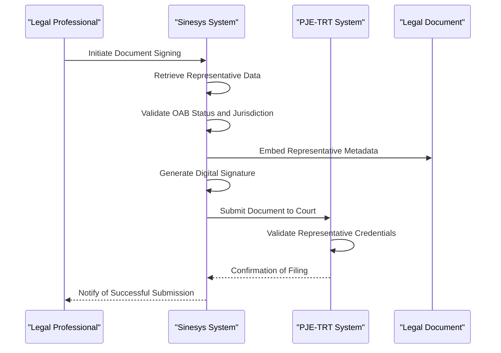
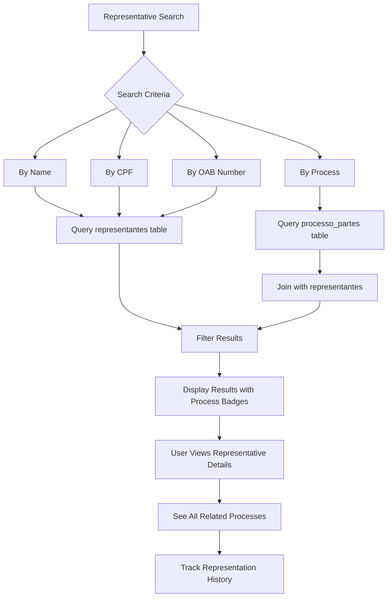
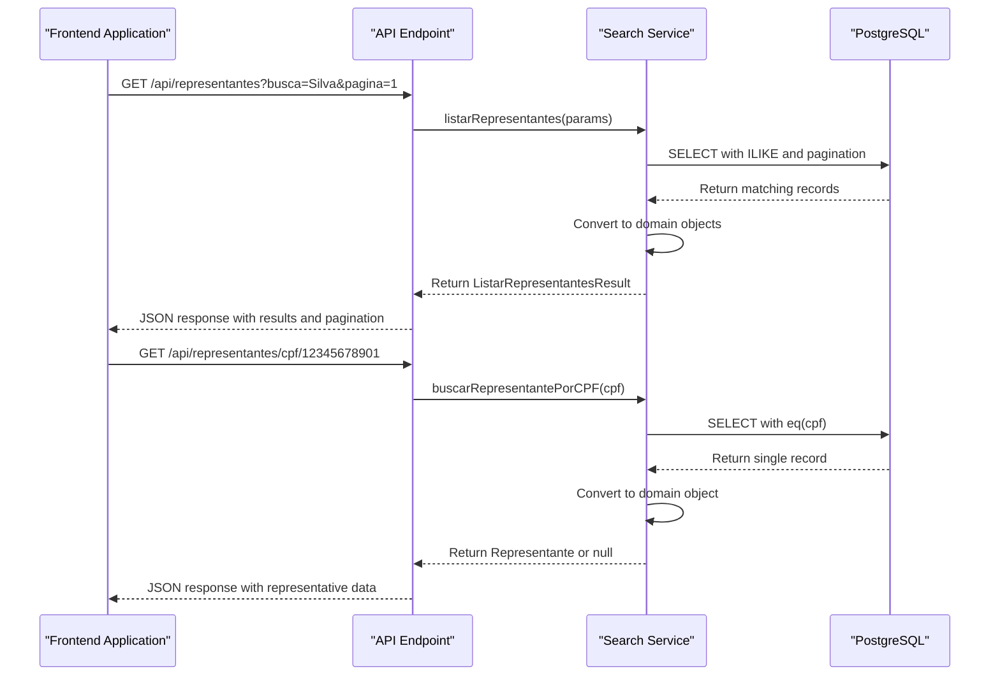
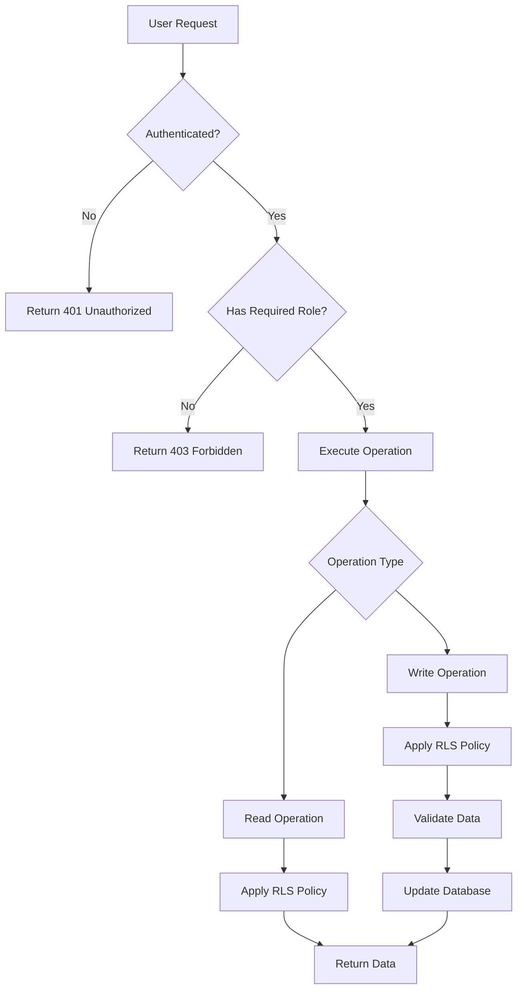

# Representatives

<cite>
**Referenced Files in This Document**   
- [18_representantes.sql](file://supabase/schemas/18_representantes.sql)
- [representantes-persistence.service.ts](file://backend/representantes/services/representantes-persistence.service.ts)
- [representantes.ts](file://types/domain/representantes.ts)
- [representantes-tab.tsx](file://app/(dashboard)/partes/components/representantes-tab.tsx)
- [buscar-representante-por-cpf.service.ts](file://backend/representantes/services/representantes/buscar-representante-por-cpf.service.ts)
- [buscar-representante-por-nome.service.ts](file://backend/representantes/services/representantes/buscar-representante-por-nome.service.ts)
</cite>

## Table of Contents
1. [Introduction](#introduction)
2. [Data Model](#data-model)
3. [OAB Number Management](#oab-number-management)
4. [Business Rules and Qualifications](#business-rules-and-qualifications)
5. [Relationships with Legal Entities](#relationships-with-legal-entities)
6. [Usage in Document Signing and Court Filings](#usage-in-document-signing-and-court-filings)
7. [Process Tracking](#process-tracking)
8. [Data Integrity and Validation](#data-integrity-and-validation)
9. [Search Services](#search-services)
10. [Integration with Authentication and Authorization](#integration-with-authentication-and-authorization)
11. [Conclusion](#conclusion)

## Introduction

The Representatives system in Sinesys manages legal representatives involved in legal cases, primarily focusing on attorneys who represent clients in judicial processes. This documentation provides a comprehensive overview of the Representantes entity, detailing its data structure, business rules, validation mechanisms, and integration points within the Sinesys ecosystem. The system is designed to track comprehensive information about legal representatives including their OAB (Ordem dos Advogados do Brasil) credentials, specialization, contact information, and relationships with clients and legal processes.

The Representatives system plays a critical role in the legal workflow, serving as the authoritative source of information for attorneys who sign documents, file court submissions, and represent parties in legal proceedings. The data model has been designed to support multiple OAB registrations across different jurisdictions, ensuring accurate representation of attorneys who practice in multiple states. The system integrates with various components including document management, process tracking, and authentication systems to provide a seamless experience for legal professionals.

**Section sources**
- [18_representantes.sql](file://supabase/schemas/18_representantes.sql)
- [representantes-persistence.service.ts](file://backend/representantes/services/representantes-persistence.service.ts)

## Data Model

The Representantes entity is implemented as a PostgreSQL table with a comprehensive schema designed to store all relevant information about legal representatives. The data model is centered around the attorney's CPF (Cadastro de Pessoas Físicas) as the unique identifier, reflecting the fact that representatives are always individuals (pessoas físicas) rather than legal entities.

The core attributes of the Representantes entity include:
- **CPF**: The unique identifier for the representative, stored as text with a unique constraint
- **Nome**: The full name of the legal representative
- **Sexo**: Gender information
- **Tipo**: The type of representative (e.g., ADVOGADO, PROCURADOR, DEFENSOR_PUBLICO)

Contact information is stored in multiple fields to capture various communication channels:
- **Emails**: A JSONB array containing multiple email addresses
- **Email**: A primary email address stored separately for quick access
- **Phone numbers**: Separate fields for cellular, residential, and commercial numbers, each with DDD (area code) and number components

The data model also includes a reference to address information through the `endereco_id` field, which is a foreign key to the enderecos table. This allows for complete address information to be associated with each representative while maintaining data normalization.

Metadata fields include `dados_anteriores` (stored as JSONB) which maintains historical data for audit purposes, capturing previous versions of the record when updates occur. Timestamps `created_at` and `updated_at` track the creation and modification times of each record.



**Diagram sources**
- [18_representantes.sql](file://supabase/schemas/18_representantes.sql)

**Section sources**
- [18_representantes.sql](file://supabase/schemas/18_representantes.sql)
- [representantes.ts](file://types/domain/representantes.ts)

## OAB Number Management

The system handles OAB (Ordem dos Advogados do Brasil) numbers through a sophisticated data structure that supports multiple registrations across different jurisdictions. Unlike a simple text field, the OAB information is stored as a JSONB array in the `oabs` column, allowing each representative to have multiple OAB registrations.

Each OAB registration is represented as a JSON object with three key properties:
- **numero**: The OAB number including the state abbreviation (e.g., "MG128404")
- **uf**: The Brazilian state where the OAB is registered (e.g., "MG", "SP")
- **situacao**: The current status of the OAB registration

The JSONB format provides flexibility for storing multiple OAB registrations while maintaining queryability through PostgreSQL's JSON operators. This design choice enables efficient searching and filtering based on OAB numbers and jurisdictions. The array structure allows for easy addition or removal of OAB registrations as representatives gain or lose credentials in different states.

The system validates OAB numbers using a specific pattern: two letters representing the state followed by 3-6 digits (e.g., "MG123456"). The validation includes checking against a list of valid Brazilian state codes to ensure the UF component is legitimate. This validation occurs both at the application level and through database constraints to maintain data integrity.



**Diagram sources**
- [18_representantes.sql](file://supabase/schemas/18_representantes.sql)
- [representantes.ts](file://types/domain/representantes.ts)

**Section sources**
- [18_representantes.sql](file://supabase/schemas/18_representantes.sql)
- [representantes-persistence.service.ts](file://backend/representantes/services/representantes-persistence.service.ts)
- [representantes.ts](file://types/domain/representantes.ts)

## Business Rules and Qualifications

The Representatives system enforces several business rules to ensure data accuracy and compliance with legal requirements. These rules govern the creation, updating, and validation of representative records, ensuring that only qualified legal professionals are represented in the system.

The primary business rule establishes that representatives are always individuals (pessoas físicas) rather than legal entities. This is reflected in the data model which only includes CPF (individual taxpayer registry) and excludes CNPJ (corporate taxpayer registry) fields. The system explicitly handles this through the `buscarRepresentantePorCNPJ` function which always returns null, maintaining interface consistency while acknowledging that representatives cannot be corporate entities.

Representative qualifications are verified through multiple validation mechanisms. The CPF field undergoes rigorous validation including checksum verification to ensure the number is mathematically valid and not a known invalid pattern (such as all identical digits). Email addresses are validated against a simplified RFC 5322 pattern to ensure they follow standard email format conventions.

The system also enforces data integrity through PostgreSQL constraints and application-level validation. Unique constraints prevent duplicate entries for the same CPF, while foreign key constraints ensure that address references are valid. The RLS (Row Level Security) policies control access to the data, allowing service roles full access while restricting authenticated users to read operations.



**Diagram sources**
- [representantes-persistence.service.ts](file://backend/representantes/services/representantes-persistence.service.ts)

**Section sources**
- [representantes-persistence.service.ts](file://backend/representantes/services/representantes-persistence.service.ts)
- [18_representantes.sql](file://supabase/schemas/18_representantes.sql)

## Relationships with Legal Entities

The Representatives system establishes relationships between legal representatives and other entities in the system through a well-defined association model. While the representantes table stores the core information about each representative, the relationships with specific cases and clients are managed through the processo_partes table, which serves as a junction table connecting representatives to legal processes.

This design follows a normalized approach where the representantes table contains unique representatives identified by CPF, while the processo_partes table manages the many-to-many relationship between representatives and processes. Each record in processo_partes includes the `entidade_id` (referencing the representative), `processo_id`, `tipo_parte` (indicating the role such as plaintiff or defendant), and `polo` (legal position).

The system also maintains a connection to address information through the `endereco_id` foreign key, allowing each representative to have a complete address profile. This relationship is implemented as a LEFT JOIN in queries, acknowledging that address information may be optional.

The data model supports the concept of "dados_anteriores" (previous data) which stores the historical state of a record when updates occur. This provides an audit trail of changes to representative information, which is crucial for legal compliance and accountability.



**Diagram sources**
- [18_representantes.sql](file://supabase/schemas/18_representantes.sql)
- [representantes-persistence.service.ts](file://backend/representantes/services/representantes-persistence.service.ts)

**Section sources**
- [18_representantes.sql](file://supabase/schemas/18_representantes.sql)
- [representantes-persistence.service.ts](file://backend/representantes/services/representantes-persistence.service.ts)

## Usage in Document Signing and Court Filings

The Representatives system plays a crucial role in document signing and court filing workflows within Sinesys. Representative information is used to identify and authenticate the legal professionals who sign documents and file submissions in court systems.

When documents are prepared for signing, the system retrieves the relevant representative's information, including their name, OAB credentials, and contact details. This information is embedded in the document metadata and used to generate proper legal signatures. The OAB number and jurisdiction are particularly important as they establish the representative's authority to act in a specific court jurisdiction.

During court filing processes, the system uses representative data to populate mandatory fields in electronic filing forms. The integration with the PJE-TRT (Processo Judicial Eletrônico do Tribunal Regional do Trabalho) system requires accurate representative information, including the PJE ID which is stored in the cadastros_pje table linked to the representative record.

The system also supports the display of representative information in document timelines and audit trails. When a document is signed or filed, the system records which representative performed the action, creating a verifiable chain of custody. This information is critical for legal compliance and dispute resolution.



**Diagram sources**
- [representantes-persistence.service.ts](file://backend/representantes/services/representantes-persistence.service.ts)
- [representantes-tab.tsx](file://app/(dashboard)/partes/components/representantes-tab.tsx)

**Section sources**
- [representantes-persistence.service.ts](file://backend/representantes/services/representantes-persistence.service.ts)
- [captura/services/partes/partes-capture.service.ts](file://backend/captura/services/partes/partes-capture.service.ts)

## Process Tracking

The Representatives system integrates with process tracking functionality to provide comprehensive visibility into the involvement of legal representatives across multiple cases. This integration allows users to track which representatives are associated with specific legal processes and monitor their activities throughout the lifecycle of a case.

The system achieves this through the processo_partes table, which maintains the relationship between representatives and processes. This junction table allows for efficient querying to determine all processes in which a particular representative is involved, as well as all representatives associated with a specific process.

The UI component `representantes-tab.tsx` implements a table that displays representatives along with their related processes. The `ProcessosRelacionadosCell` component renders a badge for each related process, providing quick visual identification of a representative's case load. Users can filter and search representatives based on their process involvement, enabling efficient case management.

The system also supports historical tracking of representation changes through the `dados_anteriores` field, which stores previous versions of representative records. This audit trail is valuable for understanding how representation has evolved over time in complex litigation.



**Diagram sources**
- [representantes-tab.tsx](file://app/(dashboard)/partes/components/representantes-tab.tsx)
- [representantes-persistence.service.ts](file://backend/representantes/services/representantes-persistence.service.ts)

**Section sources**
- [representantes-tab.tsx](file://app/(dashboard)/partes/components/representantes-tab.tsx)
- [representantes-persistence.service.ts](file://backend/representantes/services/representantes-persistence.service.ts)

## Data Integrity and Validation

The Representatives system implements a comprehensive data integrity and validation framework to ensure the accuracy and reliability of representative information. This framework operates at multiple levels, including database constraints, application-level validation, and business rule enforcement.

At the database level, the system uses PostgreSQL constraints to enforce data integrity:
- Unique constraints on CPF to prevent duplicate entries
- Foreign key constraints on endereco_id to ensure valid address references
- Row Level Security (RLS) policies to control data access
- GIN indexes on the oabs JSONB column for efficient querying

Application-level validation is implemented in the `representantes-persistence.service.ts` file, which contains dedicated validation functions for each data type:
- `validarCPF()`: Validates CPF numbers using the official algorithm with check digits
- `validarCNPJ()`: Validates CNPJ numbers (though not used for representatives)
- `validarOAB()`: Validates OAB numbers with state code verification
- `validarEmail()`: Validates email format using RFC 5322 pattern

The system also implements error mapping to provide meaningful error messages to users. Database error codes are translated into user-friendly messages, such as "Representante já cadastrado com este CPF" for unique constraint violations and "Endereço não encontrado" for foreign key violations.

Data validation occurs during all CRUD operations, with specific validation rules applied based on the operation type. For example, when creating a new representative, both CPF and name are required fields, while updates may validate only the fields being modified.

```mermaid
classDiagram
class RepresentantesPersistenceService {
+validarCPF(cpf : string) : boolean
+validarCNPJ(cnpj : string) : boolean
+validarOAB(numero_oab : string) : boolean
+validarEmail(email : string) : boolean
+criarRepresentante(params : CriarRepresentanteParams) : OperacaoRepresentanteResult
+atualizarRepresentante(params : AtualizarRepresentanteParams) : OperacaoRepresentanteResult
+buscarRepresentante(id : number) : Representante | null
+buscarRepresentantePorCPF(cpf : string) : Representante | null
+buscarRepresentantesPorNome(nome : string) : Representante[]
+buscarRepresentantesPorOAB(params : BuscarRepresentantesPorOABParams) : Representante[]
+listarRepresentantes(params : ListarRepresentantesParams) : ListarRepresentantesResult
+upsertRepresentantePorCPF(params : UpsertRepresentantePorCPFParams) : OperacaoRepresentanteResult & { criado : boolean }
+deletarRepresentante(id : number) : OperacaoRepresentanteResult
}
class ValidationRules {
+CPF : "11 digits with valid check digits"
+OAB : "UF + 3-6 digits with valid state code"
+Email : "user@domain.tld format"
+Phone : "DDD + number format"
}
RepresentantesPersistenceService --> ValidationRules : "implements"
```

**Diagram sources**
- [representantes-persistence.service.ts](file://backend/representantes/services/representantes-persistence.service.ts)

**Section sources**
- [representantes-persistence.service.ts](file://backend/representantes/services/representantes-persistence.service.ts)
- [18_representantes.sql](file://supabase/schemas/18_representantes.sql)

## Search Services

The Representatives system provides specialized search services that enable efficient discovery and retrieval of representative information. These services are implemented through a combination of database queries, application logic, and API endpoints that support various search criteria and filtering options.

The primary search functionality is exposed through several service functions:
- `buscarRepresentantePorCPF()`: Searches for a representative by their CPF number
- `buscarRepresentantePorNome()`: Searches for representatives by name using partial matching
- `buscarRepresentantesPorOAB()`: Searches for representatives by OAB number
- `listarRepresentantes()`: Provides paginated listing with comprehensive filtering

The search services are designed to handle both exact and partial matches. For name searches, the system uses ILIKE with wildcards to find partial matches, while CPF and OAB searches typically require exact matches. The `listarRepresentantes()` function supports complex filtering with parameters for pagination, sorting, and multiple filter criteria including name, CPF, OAB number, and free-text search.

The API layer exposes these search capabilities through REST endpoints that follow standard conventions. The `/api/representantes` endpoint handles listing with query parameters for filtering, while `/api/representantes/[id]` and `/api/representantes/cpf/[cpf]` provide direct access to specific representatives.



**Diagram sources**
- [buscar-representante-por-cpf.service.ts](file://backend/representantes/services/representantes/buscar-representante-por-cpf.service.ts)
- [buscar-representante-por-nome.service.ts](file://backend/representantes/services/representantes/buscar-representante-por-nome.service.ts)
- [representantes-persistence.service.ts](file://backend/representantes/services/representantes-persistence.service.ts)

**Section sources**
- [buscar-representante-por-cpf.service.ts](file://backend/representantes/services/representantes/buscar-representante-por-cpf.service.ts)
- [buscar-representante-por-nome.service.ts](file://backend/representantes/services/representantes/buscar-representante-por-nome.service.ts)
- [representantes-persistence.service.ts](file://backend/representantes/services/representantes-persistence.service.ts)

## Integration with Authentication and Authorization

The Representatives system integrates with the authentication and authorization infrastructure to ensure secure access to representative data. This integration is implemented through Row Level Security (RLS) policies in PostgreSQL and authentication checks in the API layer.

The database implements RLS policies that control access to the representantes table:
- Service roles have full access to all operations
- Authenticated users have read-only access
- Anonymous users are denied access

These policies are defined in the `18_representantes.sql` schema file and enforced at the database level, providing a security boundary that cannot be bypassed by application logic. The policies use the `authenticated` role to identify logged-in users and the `service_role` for backend services that require elevated privileges.

At the API level, authentication is enforced through middleware that validates user sessions before allowing access to representative data. The API routes include JSDoc annotations that specify the required authentication scheme, ensuring proper documentation in the Swagger UI. The authentication process verifies that the user has a valid session before proceeding with any data retrieval or modification operations.

The system also integrates with the broader authorization framework through the permissoes module, which could potentially extend access controls based on user roles and permissions. While the current implementation provides basic read/write separation, the architecture supports more granular permission models for future enhancement.



**Diagram sources**
- [18_representantes.sql](file://supabase/schemas/18_representantes.sql)
- [representantes-persistence.service.ts](file://backend/representantes/services/representantes-persistence.service.ts)

**Section sources**
- [18_representantes.sql](file://supabase/schemas/18_representantes.sql)
- [representantes-persistence.service.ts](file://backend/representantes/services/representantes-persistence.service.ts)
- [api/representantes/[id]/route.ts](file://app/api/representantes/[id]/route.ts)

## Conclusion

The Representatives system in Sinesys provides a comprehensive solution for managing legal representatives involved in judicial processes. The data model is thoughtfully designed to capture essential information about attorneys, including their OAB credentials, contact details, and relationships with legal cases. By using a normalized approach with the representantes table storing unique representatives and the processo_partes table managing their case associations, the system achieves both data integrity and flexibility.

Key strengths of the system include its robust validation framework, which ensures data accuracy through multiple layers of checks, and its efficient search capabilities that enable quick discovery of representative information. The integration with document signing, court filing, and process tracking workflows makes it a central component in the legal technology ecosystem.

The system's architecture supports future enhancements such as OAB validation API integration, conflict checking between opposing representatives, and more sophisticated historical tracking. The current implementation provides a solid foundation for managing representative data while maintaining compliance with legal requirements and data privacy standards.

**Section sources**
- [18_representantes.sql](file://supabase/schemas/18_representantes.sql)
- [representantes-persistence.service.ts](file://backend/representantes/services/representantes-persistence.service.ts)
- [representantes.ts](file://types/domain/representantes.ts)