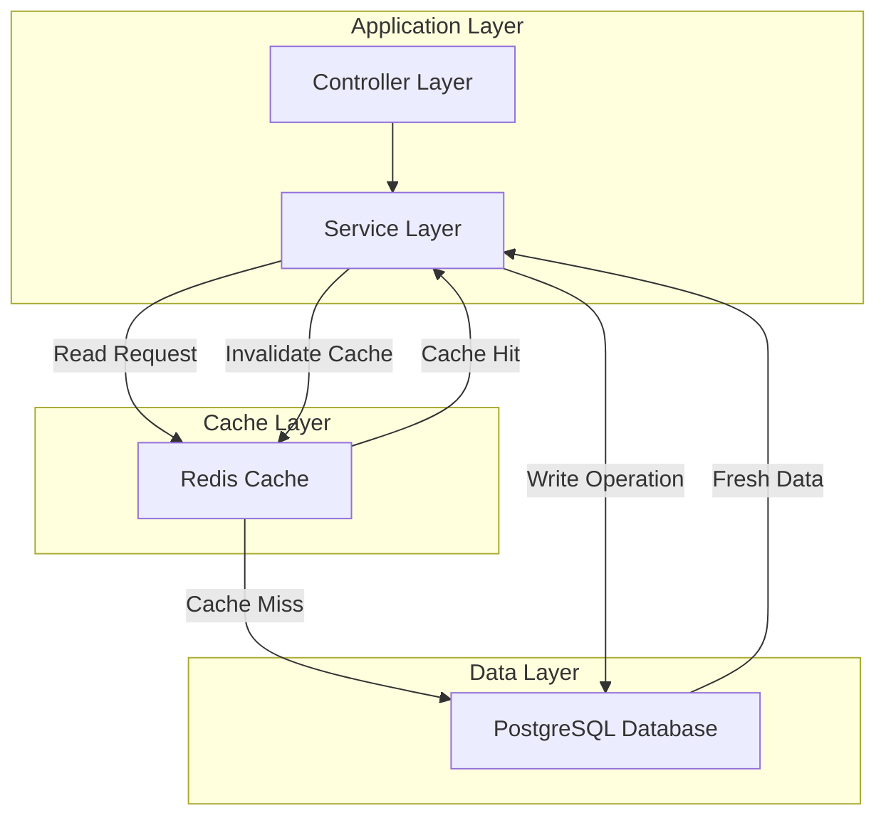
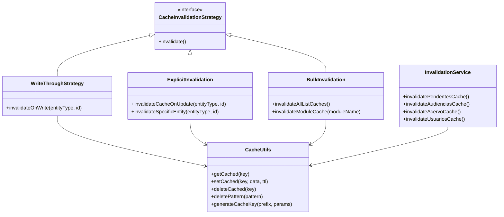
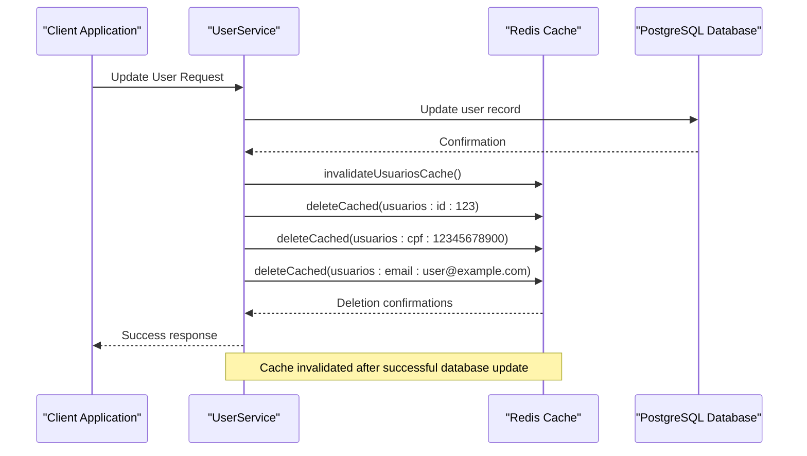
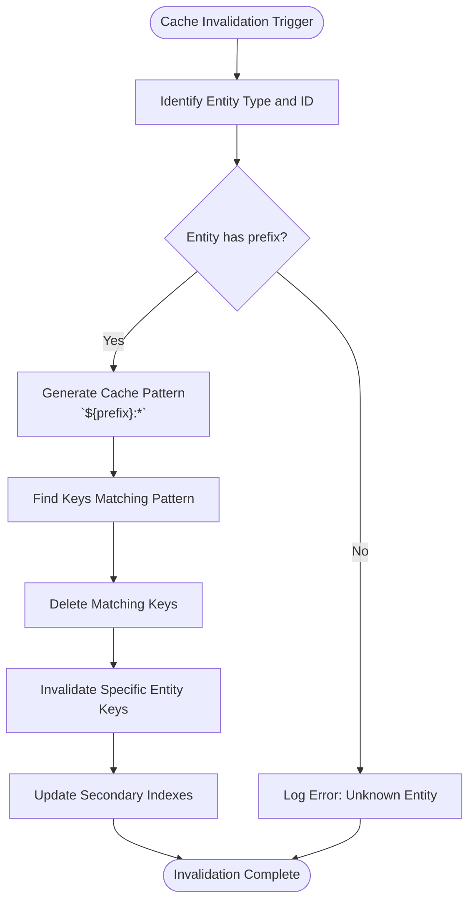

# Cache Invalidation Strategies

<cite>
**Referenced Files in This Document**   
- [invalidation.ts](file://backend/utils/redis/invalidation.ts)
- [cache-utils.ts](file://backend/utils/redis/cache-utils.ts)
- [cache-keys.ts](file://backend/utils/redis/cache-keys.ts)
- [client.ts](file://backend/utils/redis/client.ts)
- [usuario-persistence.service.ts](file://backend/usuarios/services/persistence/usuario-persistence.service.ts)
- [atribuir-responsavel.service.ts](file://backend/expedientes/services/atribuir-responsavel.service.ts)
- [acordos-condenacoes.service.ts](file://backend/acordos-condenacoes/services/acordos-condenacoes/acordos-condenacoes.service.ts)
- [criar-audiencia.service.ts](file://backend/audiencias/services/criar-audiencia.service.ts)
</cite>

## Table of Contents
1. [Introduction](#introduction)
2. [Cache Architecture Overview](#cache-architecture-overview)
3. [Core Invalidation Strategies](#core-invalidation-strategies)
4. [Implementation in Key Modules](#implementation-in-key-modules)
5. [Cache Tagging and Bulk Invalidation](#cache-tagging-and-bulk-invalidation)
6. [Time-based Expiration Policies](#time-based-expiration-policies)
7. [Common Issues and Solutions](#common-issues-and-solutions)
8. [Conclusion](#conclusion)

## Introduction

The Sinesys application implements a comprehensive Redis-based caching system to improve performance and reduce database load. This document details the cache invalidation strategies employed across the backend, focusing on the implementation in `backend/utils/redis/invalidation.ts` and related functions in `cache-utils.ts`. The system maintains cache consistency with the primary PostgreSQL database through various patterns including write-through, explicit invalidation, and targeted cache clearing. The strategies are applied across key modules such as acordos-condenacoes, audiencias, and usuarios to ensure data integrity while maximizing performance benefits.

**Section sources**
- [invalidation.ts](file://backend/utils/redis/invalidation.ts#L1-L118)
- [cache-utils.ts](file://backend/utils/redis/cache-utils.ts#L1-L212)

## Cache Architecture Overview

The Sinesys caching architecture is built on Redis as the primary caching layer, with a well-defined strategy for maintaining consistency between the cache and the primary database. The system uses a combination of explicit invalidation, pattern-based deletion, and time-to-live (TTL) policies to manage cached data. The architecture is designed around a write-through pattern where data modifications trigger immediate cache invalidation rather than direct cache updates, ensuring that subsequent reads will fetch fresh data from the database and repopulate the cache.

The cache implementation is organized into several key components:
- **Redis client management**: Handles connection pooling, error handling, and availability checks
- **Cache utilities**: Provides functions for key generation, data serialization, and basic CRUD operations
- **Invalidation strategies**: Implements module-specific and entity-specific cache clearing
- **Key generation**: Creates consistent, deterministic cache keys based on prefixes and parameters

**Diagram sources **
- [client.ts](file://backend/utils/redis/client.ts#L1-L68)
- [cache-utils.ts](file://backend/utils/redis/cache-utils.ts#L1-L212)

**Section sources**
- [client.ts](file://backend/utils/redis/client.ts#L1-L68)
- [cache-utils.ts](file://backend/utils/redis/cache-utils.ts#L1-L212)

## Core Invalidation Strategies

The Sinesys application implements three primary cache invalidation strategies: write-through, explicit invalidation, and bulk invalidation. The write-through strategy is implemented by invalidating cache entries immediately upon data modification in the database, ensuring that subsequent reads will retrieve fresh data. This approach prioritizes data consistency over cache hit rate, which is appropriate for a legal technology application where data accuracy is paramount.

Explicit invalidation is used for entity-specific updates, where specific cache entries are targeted for removal based on the entity type and identifier. This strategy is implemented in the `invalidateCacheOnUpdate` function, which handles different entity types through a switch statement, calling the appropriate module-specific invalidation function and removing ID-based cache entries. For example, when a user record is updated, the system invalidates not only the general usuarios cache but also specific caches keyed by CPF and email to ensure all variations are refreshed.

Bulk invalidation is employed for comprehensive cache clearing operations, such as when multiple related entities might be affected by a single operation. The `invalidateAllListCaches` function demonstrates this strategy by simultaneously clearing caches for multiple modules including pendentes, audiencias, acervo, usuarios, clientes, contratos, tiposExpedientes, and cargos. This approach is used when a change might have wide-ranging implications across the system, ensuring complete consistency at the cost of temporarily reduced cache performance.

**Diagram sources **
- [invalidation.ts](file://backend/utils/redis/invalidation.ts#L1-L118)
- [cache-utils.ts](file://backend/utils/redis/cache-utils.ts#L1-L212)

**Section sources**
- [invalidation.ts](file://backend/utils/redis/invalidation.ts#L1-L118)
- [cache-utils.ts](file://backend/utils/redis/cache-utils.ts#L1-L212)

## Implementation in Key Modules

The cache invalidation strategies are implemented across various modules in the Sinesys application, with specific patterns tailored to each domain. In the acordos-condenacoes module, cache invalidation is triggered when agreements or their associated payments are modified, ensuring that financial data remains consistent across the system. The audiencias module implements invalidation when new hearings are created, updated, or when responsible parties are assigned, maintaining accurate scheduling information. The usuarios module employs a comprehensive invalidation strategy that clears not only the general user list cache but also specific caches keyed by unique identifiers like CPF and email.

For the usuarios module, the implementation in `usuario-persistence.service.ts` demonstrates a sophisticated invalidation approach. When a user record is updated, the system invalidates multiple cache entries: the general usuarios cache, the specific user ID cache, and caches keyed by CPF and email if those fields were modified. This ensures that all possible access paths to the user data are refreshed, preventing stale data from being served regardless of how the data is requested. The implementation also includes individual user lookup caching with a 30-minute TTL, balancing performance and freshness.

In the expedientes module, the `atribuir-responsavel.service.ts` file shows how cache invalidation is integrated into business operations. When a responsible party is assigned to a pending matter, the service first performs necessary validations, then executes the database update, and finally invalidates the pendentes cache to ensure the updated assignment is reflected in subsequent queries. This pattern ensures that the cache state always reflects the current database state, maintaining data consistency across the application.

**Diagram sources **
- [usuario-persistence.service.ts](file://backend/usuarios/services/persistence/usuario-persistence.service.ts#L479-L488)
- [atribuir-responsavel.service.ts](file://backend/expedientes/services/atribuir-responsavel.service.ts#L142-L143)

**Section sources**
- [usuario-persistence.service.ts](file://backend/usuarios/services/persistence/usuario-persistence.service.ts#L1-L666)
- [atribuir-responsavel.service.ts](file://backend/expedientes/services/atribuir-responsavel.service.ts#L1-L156)
- [acordos-condenacoes.service.ts](file://backend/acordos-condenacoes/services/acordos-condenacoes/acordos-condenacoes.service.ts#L1-L200)
- [criar-audiencia.service.ts](file://backend/audiencias/services/criar-audiencia.service.ts#L1-L110)

## Cache Tagging and Bulk Invalidation

The Sinesys application implements a sophisticated cache tagging and bulk invalidation system through the use of consistent cache key prefixes and pattern-based deletion. The `CACHE_PREFIXES` object in `cache-utils.ts` defines standardized prefixes for different entity types, enabling systematic cache management across the application. These prefixes serve as implicit tags, allowing the system to identify and manipulate groups of related cache entries through pattern matching.

The bulk invalidation strategy is exemplified by functions like `invalidateAllListCaches`, which simultaneously clears caches for multiple modules using Promise.all to perform the operations in parallel. This approach ensures comprehensive cache clearing while minimizing the performance impact of multiple Redis operations. The pattern-based deletion using `deletePattern` allows for targeted removal of cache entries that match specific criteria, such as all entries for a particular module or all entries with a specific identifier.

For entity-specific invalidation, the system employs a hierarchical approach where updates to a specific entity trigger both broad module-level invalidation and targeted removal of specific cache entries. For example, when a user record is updated, the system invalidates the entire usuarios module cache while also specifically removing the cache entries for that user's ID, CPF, and email. This dual strategy ensures that both list views and individual record views are refreshed, maintaining consistency across different access patterns.

**Diagram sources **
- [invalidation.ts](file://backend/utils/redis/invalidation.ts#L48-L58)
- [cache-utils.ts](file://backend/utils/redis/cache-utils.ts#L8-L26)

**Section sources**
- [invalidation.ts](file://backend/utils/redis/invalidation.ts#L1-L118)
- [cache-utils.ts](file://backend/utils/redis/cache-utils.ts#L1-L212)

## Time-based Expiration Policies

The Sinesys application implements time-based expiration policies as a secondary mechanism to ensure cache freshness, complementing the explicit invalidation strategies. The default cache TTL (time-to-live) is configured through the `REDIS_CACHE_TTL` environment variable, with a default value of 600 seconds (10 minutes). This global TTL provides a safety net to prevent stale data from persisting indefinitely in the cache, even if explicit invalidation fails or is not triggered.

For specific data types with different volatility characteristics, the system implements specialized TTL policies. Document-related caches have differentiated expiration times based on their expected update frequency: individual documents have a 5-minute TTL, document listings have a 1-minute TTL (due to frequent changes), templates have a 10-minute TTL, and folders have a 5-minute TTL. This tiered approach balances performance and freshness, allocating shorter expiration times to data that changes more frequently.

The time-based expiration works in conjunction with the explicit invalidation strategies, creating a multi-layered approach to cache consistency. While explicit invalidation ensures immediate freshness when data is modified, time-based expiration provides a fallback mechanism to refresh data that may have become stale due to system errors, missed invalidation events, or other edge cases. This dual approach ensures robust cache management that maintains data integrity while optimizing performance.

**Section sources**
- [cache-utils.ts](file://backend/utils/redis/cache-utils.ts#L3-L4)
- [cache-utils.ts](file://backend/utils/redis/cache-utils.ts#L29-L34)

## Common Issues and Solutions

The Sinesys cache invalidation system addresses several common issues associated with distributed caching, particularly stale data and race conditions. Stale data is mitigated through the write-through pattern and explicit invalidation, ensuring that cache entries are removed immediately when underlying data changes. The system also employs time-based expiration as a secondary safeguard, preventing stale data from persisting indefinitely even if invalidation fails.

Race conditions are addressed through careful ordering of operations and the use of Redis's atomic operations. Database updates are completed before cache invalidation is triggered, ensuring that if a cache read occurs during the update process, it will either return the old data (before the update) or trigger a fresh read from the database (after cache invalidation), but never return partially updated or inconsistent data. The use of Redis's atomic delete operations ensures that cache clearing is performed reliably, even under high concurrency.

The system also handles Redis availability issues gracefully through the `isRedisAvailable` function, which checks the connection status before performing cache operations. If Redis is unavailable, the application continues to function using the database as the primary data source, with cache operations silently failing. This fail-safe design ensures that cache issues do not impact application availability, while still providing performance benefits when Redis is operational.

**Section sources**
- [client.ts](file://backend/utils/redis/client.ts#L65-L68)
- [cache-utils.ts](file://backend/utils/redis/cache-utils.ts#L63-L73)
- [cache-utils.ts](file://backend/utils/redis/cache-utils.ts#L95-L103)

## Conclusion

The Sinesys application employs a comprehensive and robust cache invalidation strategy that effectively maintains consistency between the Redis cache and the primary database. By combining write-through patterns, explicit invalidation, bulk clearing, and time-based expiration, the system ensures data integrity while maximizing performance benefits. The implementation is particularly effective in modules like acordos-condenacoes, audiencias, and usuarios, where timely and accurate data is critical for legal operations.

The use of standardized cache prefixes, pattern-based deletion, and hierarchical invalidation creates a maintainable and scalable caching architecture. The system's graceful handling of Redis availability issues and its multi-layered approach to preventing stale data demonstrate thoughtful design that prioritizes reliability and data consistency. These strategies collectively ensure that users always access accurate, up-to-date information while benefiting from the performance improvements of caching.