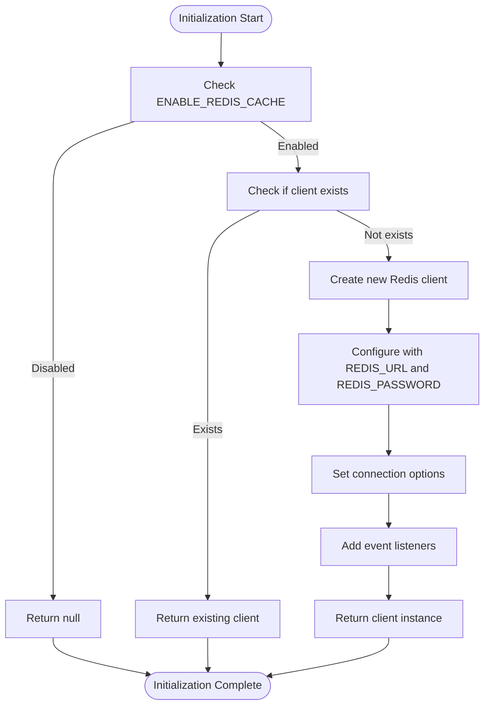
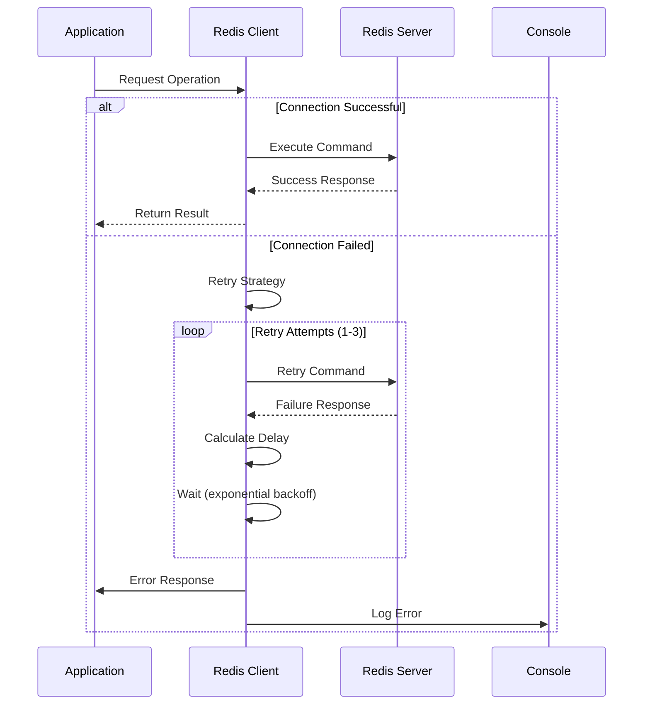
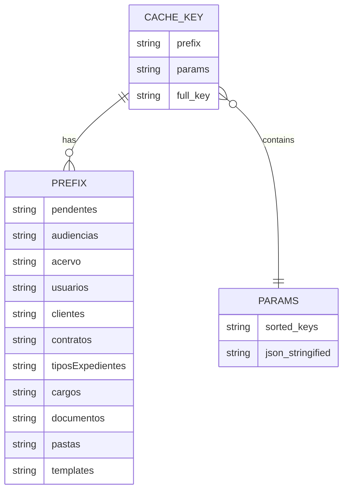
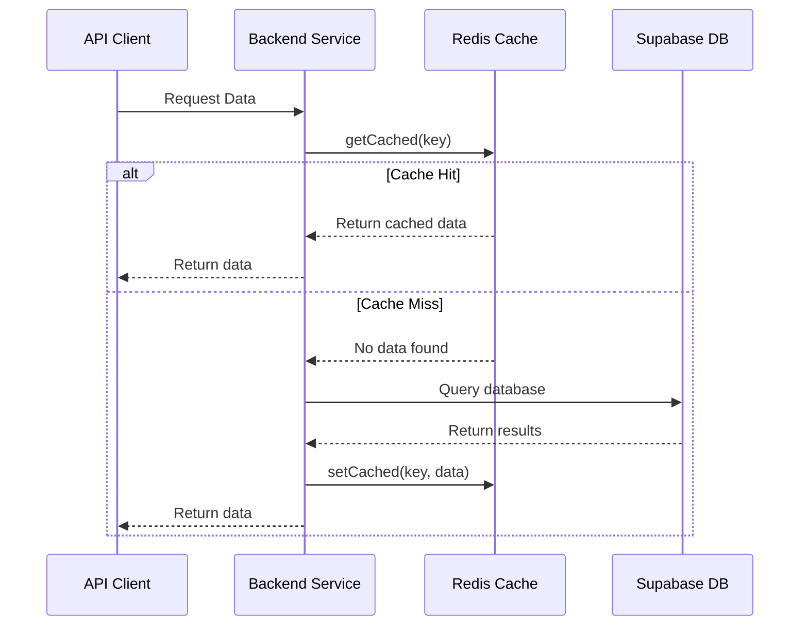

# Caching Configuration

<cite>
**Referenced Files in This Document**   
- [client.ts](file://backend/utils/redis/client.ts)
- [index.ts](file://backend/utils/redis/index.ts)
- [cache-utils.ts](file://backend/utils/redis/cache-utils.ts)
- [cache-keys.ts](file://backend/utils/redis/cache-keys.ts)
- [invalidation.ts](file://backend/utils/redis/invalidation.ts)
- [.env.example](file://.env.example)
- [route.ts](file://app/api/cache/stats/route.ts)
- [service-client.ts](file://backend/utils/supabase/service-client.ts)
</cite>

## Table of Contents
1. [Introduction](#introduction)
2. [Redis Client Implementation](#redis-client-implementation)
3. [Initialization Process](#initialization-process)
4. [Connection Parameters](#connection-parameters)
5. [Retry Mechanisms and Error Handling](#retry-mechanisms-and-error-handling)
6. [Connection Pooling and Timeout Configurations](#connection-pooling-and-timeout-configurations)
7. [Cache Key Structure and Generation](#cache-key-structure-and-generation)
8. [Cache Invalidation Strategies](#cache-invalidation-strategies)
9. [Integration with Supabase Backend](#integration-with-supabase-backend)
10. [Performance Considerations](#performance-considerations)
11. [Common Configuration Problems and Solutions](#common-configuration-problems-and-solutions)
12. [Monitoring and Statistics](#monitoring-and-statistics)

## Introduction
The Sinesys application implements a comprehensive Redis-based caching system to improve performance and reduce database load. This document provides a detailed analysis of the caching configuration, focusing on the Redis client implementation, initialization process, connection parameters, retry mechanisms, error handling strategies, and integration with the Supabase backend. The caching system is designed to handle various data types including pendentes, audiencias, acervo, usuarios, clientes, and financial data, with specific TTL (Time To Live) configurations for different entity types. The implementation follows best practices for connection management, error handling, and cache invalidation to ensure reliability and performance across different deployment environments.

## Redis Client Implementation

The Redis client implementation in Sinesys is built using the ioredis library and follows a singleton pattern to ensure a single connection instance throughout the application lifecycle. The implementation is located in `backend/utils/redis/client.ts` and provides a robust interface for Redis operations with comprehensive error handling and connection management.

The client is initialized with several key configuration options that control its behavior, including connection retry strategies, timeout settings, and event handling. The implementation uses environment variables to configure connection parameters, allowing for flexible deployment across different environments. The client supports connection pooling through ioredis's built-in connection management, which maintains a pool of connections to Redis for improved performance under high load.

The implementation includes several utility functions for managing the Redis connection, including `getRedisClient()` for obtaining the client instance, `closeRedisClient()` for gracefully closing the connection, and `isRedisAvailable()` for checking the connection status. These functions provide a clean interface for interacting with Redis throughout the application.

**Section sources**
- [client.ts](file://backend/utils/redis/client.ts#L1-L68)

## Initialization Process

The Redis client initialization process is designed to be both robust and configurable. The initialization occurs when the `getRedisClient()` function is first called, implementing lazy initialization to avoid unnecessary connection attempts when Redis caching is disabled.

The initialization process begins by checking the `ENABLE_REDIS_CACHE` environment variable to determine whether Redis caching should be enabled. If caching is disabled, the function returns null, allowing the application to continue without Redis dependency. When caching is enabled, the function checks if a client instance already exists, creating a new one only if necessary.

During initialization, the client is configured with the Redis URL from the `REDIS_URL` environment variable and the password from `REDIS_PASSWORD`. The implementation specifically notes that the password should not be included in the URL, as ioredis gives precedence to the password option over credentials embedded in the URL. This separation enhances security by allowing the password to be managed independently.

The initialization also sets up event listeners for key connection events including 'error', 'connect', 'ready', and 'close', providing visibility into the connection state and facilitating troubleshooting.



**Diagram sources**
- [client.ts](file://backend/utils/redis/client.ts#L15-L56)

**Section sources**
- [client.ts](file://backend/utils/redis/client.ts#L15-L56)
- [index.ts](file://backend/utils/redis/index.ts#L1-L4)

## Connection Parameters

The Redis connection parameters in Sinesys are configured through environment variables, providing flexibility across different deployment environments. The primary connection parameters include the Redis URL, password, cache TTL (Time To Live), and maximum memory allocation.

The `REDIS_URL` environment variable specifies the connection endpoint for the Redis server in the format `redis://host:port`. The `REDIS_PASSWORD` variable contains the authentication password for the Redis server, kept separate from the URL for security reasons. This separation ensures that the password takes precedence over any credentials that might be embedded in the URL.

Additional parameters include `REDIS_CACHE_TTL` which defines the default time-to-live for cached items in seconds (defaulting to 600 seconds or 10 minutes), and `REDIS_CACHE_MAX_MEMORY` which specifies the maximum memory allocation for Redis (defaulting to 256mb). These parameters can be adjusted based on the specific requirements of each deployment environment.

The implementation also includes `ENABLE_REDIS_LOG_STREAMING` which controls whether Redis command logging is enabled, useful for debugging and monitoring in development environments but typically disabled in production for performance reasons.

**Section sources**
- [.env.example](file://.env.example#L57-L64)
- [client.ts](file://backend/utils/redis/client.ts#L5-L13)

## Retry Mechanisms and Error Handling

The Sinesys Redis implementation includes comprehensive retry mechanisms and error handling strategies to ensure resilience in the face of network issues or Redis server unavailability. The retry strategy is configured with exponential backoff, providing a balance between aggressive retry attempts and avoiding overwhelming the Redis server.

The retry mechanism is configured with a maximum of three retry attempts per request, as specified by the `maxRetriesPerRequest: 3` option. The retry strategy function implements exponential backoff with a maximum delay of 2 seconds, calculated as `Math.min(times * 100, 2000)`. This means the delays between retry attempts are 100ms, 200ms, and 200ms for the first, second, and third attempts respectively.

When the retry limit is exceeded, the strategy returns null, signaling ioredis to stop retrying and propagate the error. This prevents infinite retry loops and allows the application to handle the failure appropriately.

Error handling is implemented through event listeners that capture various connection states:
- The 'error' event logs any Redis client errors with a console.error statement
- The 'connect' event indicates when a connection is established
- The 'ready' event confirms when the client is ready to accept commands
- The 'close' event notifies when the connection is closed

Additionally, the implementation includes try-catch blocks around the client creation process to handle any errors that occur during initialization, ensuring that the application can continue to operate even if Redis connection fails.



**Diagram sources**
- [client.ts](file://backend/utils/redis/client.ts#L26-L31)
- [client.ts](file://backend/utils/redis/client.ts#L34-L48)

**Section sources**
- [client.ts](file://backend/utils/redis/client.ts#L26-L31)
- [client.ts](file://backend/utils/redis/client.ts#L34-L48)

## Connection Pooling and Timeout Configurations

The Sinesys Redis implementation leverages ioredis's built-in connection pooling capabilities to manage multiple connections efficiently. While the implementation appears to use a single client instance (singleton pattern), ioredis internally manages a connection pool that can handle multiple concurrent operations.

The connection pooling strategy is configured through several key parameters:
- `maxRetriesPerRequest: 3` limits the number of retry attempts for each request
- The retry strategy implements exponential backoff to prevent overwhelming the server
- Connection timeouts are managed through ioredis's default timeout settings

The implementation does not explicitly configure the pool size, relying on ioredis's default behavior. This approach simplifies configuration while still providing adequate performance for most use cases. The connection pool automatically manages connection reuse, reducing the overhead of establishing new connections for each operation.

Timeout configurations are primarily handled through the retry mechanism and the inherent timeout settings of ioredis. The implementation does not set explicit timeout values, instead relying on ioredis's defaults which typically include:
- Connection timeout (default: 10 seconds)
- Command timeout (default: no timeout)
- Retry delay (configured through the retry strategy)

For high-traffic environments, these defaults may need to be adjusted based on network conditions and Redis server performance. The exponential backoff retry strategy helps mitigate timeout issues by progressively increasing the delay between retry attempts.

**Section sources**
- [client.ts](file://backend/utils/redis/client.ts#L24-L31)

## Cache Key Structure and Generation

The Sinesys caching system employs a structured approach to cache key generation, ensuring consistency and preventing key collisions across different data types. The key structure is defined in `backend/utils/redis/cache-keys.ts` and `backend/utils/redis/cache-utils.ts`, with a hierarchical naming convention that includes prefixes for different entity types.

The cache key structure follows the pattern: `{prefix}:{parameters}`, where the prefix identifies the entity type and the parameters provide specificity for the cached data. The implementation defines a comprehensive set of prefixes for different data types:



The key generation process involves several steps to ensure consistency:
1. Parameters are normalized by removing undefined values and sorting keys alphabetically
2. The normalized parameters are serialized to JSON in a deterministic manner
3. The final key is constructed by combining the prefix with the serialized parameters

This approach ensures that equivalent parameter objects always generate the same cache key, regardless of property order. The `generateCacheKey` function in `cache-utils.ts` handles this process, while specialized functions in `cache-keys.ts` provide type-safe key generation for specific entity types.

**Diagram sources**
- [cache-utils.ts](file://backend/utils/redis/cache-utils.ts#L8-L26)
- [cache-keys.ts](file://backend/utils/redis/cache-keys.ts#L8-L20)

**Section sources**
- [cache-utils.ts](file://backend/utils/redis/cache-utils.ts#L8-L26)
- [cache-keys.ts](file://backend/utils/redis/cache-keys.ts#L8-L20)

## Cache Invalidation Strategies

The Sinesys application implements a comprehensive cache invalidation strategy to ensure data consistency across the system. The invalidation mechanisms are designed to handle both specific and broad cache clearing scenarios, with specialized functions for different entity types.

The primary invalidation methods include:
- Specific key deletion using `deleteCached()`
- Pattern-based deletion using `deletePattern()`
- Bulk invalidation for entire entity types
- Context-specific invalidation for related data

The implementation provides both granular and broad invalidation options. For example, when a specific document is updated, the system invalidates both the individual document cache and any list caches that might contain it:

```mermaid
flowchart TD
UpdateDocumento([Document Updated]) --> InvalidateIndividual["InvalidateDocumentoCache"]
InvalidateIndividual --> DeleteIndividual["Delete document:{id}"]
InvalidateIndividual --> DeleteListings["DeletePattern document:list:*"]
UpdateUsuario([User Updated]) --> InvalidateAll["invalidateUsuariosCache"]
InvalidateAll --> DeleteAll["DeletePattern usuarios:*"]
InvalidateAll --> DeleteSpecific["DeletePattern usuarios:id:{id}"]
InvalidateAll --> DeleteByCPF["DeletePattern usuarios:cpf:*"]
InvalidateAll --> DeleteByEmail["DeletePattern usuarios:email:*"]
BatchUpdate([Multiple Entities Updated]) --> InvalidateAllLists["invalidateAllListCaches"]
InvalidateAllLists --> DeletePendentes["DeletePattern pendentes:*"]
InvalidateAllLists --> DeleteAudiencias["DeletePattern audiencias:*"]
InvalidateAllLists --> DeleteAcervo["DeletePattern acervo:*"]
InvalidateAllLists --> DeleteUsuarios["DeletePattern usuarios:*"]
InvalidateAllLists --> DeleteClientes["DeletePattern clientes:*"]
InvalidateAllLists --> DeleteContratos["DeletePattern contratos:*"]
InvalidateAllLists --> DeleteTiposExpedientes["DeletePattern tipos_expedientes:*"]
InvalidateAllLists --> DeleteCargos["DeletePattern cargos:*"]
```



The `invalidateCacheOnUpdate` function provides a centralized mechanism for handling cache invalidation based on entity type, automatically applying the appropriate invalidation strategy for each entity. This ensures consistent cache management across the application.

**Diagram sources**
- [invalidation.ts](file://backend/utils/redis/invalidation.ts#L65-L110)
- [cache-utils.ts](file://backend/utils/redis/cache-utils.ts#L111-L123)

**Section sources**
- [invalidation.ts](file://backend/utils/redis/invalidation.ts#L65-L110)
- [cache-utils.ts](file://backend/utils/redis/cache-utils.ts#L111-L123)

## Integration with Supabase Backend

The Redis caching system is tightly integrated with the Supabase backend to optimize data retrieval and reduce database load. The integration is implemented through higher-order functions and service layer patterns that wrap database queries with caching logic.

The primary integration mechanism is the `withCache` function, which provides a simple way to add caching to any asynchronous operation:



This pattern is used throughout the application, particularly in dashboard and metrics services where data is frequently accessed but changes relatively infrequently. For example, the dashboard metrics endpoint uses `withCache` to cache results for 5 minutes, significantly reducing database queries.

The integration also includes authentication-aware caching, where the cache keys can incorporate user-specific information when appropriate. The Supabase service client is used for administrative operations that bypass RLS (Row Level Security), while the caching layer sits above this to optimize performance.

**Diagram sources**
- [cache-utils.ts](file://backend/utils/redis/cache-utils.ts#L158-L164)
- [service-client.ts](file://backend/utils/supabase/service-client.ts#L45-L57)

**Section sources**
- [cache-utils.ts](file://backend/utils/redis/cache-utils.ts#L158-L164)
- [service-client.ts](file://backend/utils/supabase/service-client.ts#L45-L57)

## Performance Considerations

The Sinesys Redis caching configuration includes several performance optimizations tailored to different deployment environments. The system balances cache hit rates, memory usage, and data freshness through carefully configured TTL values and caching strategies.

For different data types, the system employs varying TTL values based on update frequency and importance:
- Document-specific data: 5 minutes (300 seconds)
- Document listings: 1 minute (60 seconds) due to frequent changes
- Templates: 10 minutes (600 seconds)
- Other entity lists: 10 minutes (600 seconds) by default

These differentiated TTL values ensure that frequently changing data is refreshed more often while stable data can remain cached longer, optimizing both performance and data freshness.

In high-traffic environments, the connection pooling and retry mechanisms help maintain performance during periods of high load or network instability. The exponential backoff retry strategy prevents cascading failures by gradually increasing retry delays.

Memory usage is controlled through the `REDIS_CACHE_MAX_MEMORY` configuration, with a default of 256mb. This limit should be adjusted based on the size of the dataset and available server resources. For production environments with large datasets, increasing this value can improve cache hit rates and overall performance.

The implementation also includes monitoring capabilities through the `getCacheStats()` function, which provides key performance metrics including memory usage, hit/miss ratios, and uptime. These metrics can be used to fine-tune the caching configuration for optimal performance.

**Section sources**
- [cache-utils.ts](file://backend/utils/redis/cache-utils.ts#L28-L34)
- [cache-utils.ts](file://backend/utils/redis/cache-utils.ts#L130-L151)

## Common Configuration Problems and Solutions

Several common configuration problems can occur with the Sinesys Redis caching system, along with their corresponding solutions:

**Problem 1: Redis Cache Not Working**
- **Symptoms**: Data not being cached, no Redis connection messages in logs
- **Causes**: 
  - `ENABLE_REDIS_CACHE` set to false
  - Incorrect Redis URL or password
  - Network connectivity issues
- **Solutions**:
  - Verify `ENABLE_REDIS_CACHE=true` in environment variables
  - Test Redis connection using redis-cli: `redis-cli -h host -p porta -a senha ping`
  - Check server logs for connection error messages

**Problem 2: Authentication Failures**
- **Symptoms**: Authentication errors despite correct credentials
- **Causes**:
  - Password included in Redis URL
  - Special characters in password not properly escaped
- **Solutions**:
  - Keep password separate from URL using REDIS_PASSWORD environment variable
  - Ensure password is URL-encoded if it contains special characters

**Problem 3: High Memory Usage**
- **Symptoms**: Redis memory usage approaching or exceeding configured limits
- **Causes**:
  - Too many cache entries with long TTL values
  - Inefficient key patterns leading to excessive data storage
- **Solutions**:
  - Adjust `REDIS_CACHE_MAX_MEMORY` to appropriate value
  - Implement more aggressive cache invalidation
  - Review cache key patterns and TTL values

**Problem 4: Connection Timeouts**
- **Symptoms**: Frequent connection timeouts, retry attempts
- **Causes**:
  - Network latency between application and Redis server
  - Redis server under heavy load
- **Solutions**:
  - Optimize retry strategy parameters
  - Scale Redis server resources
  - Consider using Redis clustering for high-availability setups

**Problem 5: Cache Inconsistency**
- **Symptoms**: Stale data being served from cache
- **Causes**:
  - Incomplete cache invalidation after data updates
  - TTL values too long for frequently changing data
- **Solutions**:
  - Review and enhance cache invalidation logic
  - Adjust TTL values based on data update frequency
  - Implement more granular cache invalidation

**Section sources**
- [.env.example](file://.env.example#L57-L64)
- [README.md](file://README.md#L1468-L1477)

## Monitoring and Statistics

The Sinesys application provides comprehensive monitoring and statistics for the Redis caching system through the `getCacheStats()` function and dedicated API endpoints. These monitoring capabilities enable administrators to track cache performance and identify potential issues.

The `/api/cache/stats` endpoint provides detailed Redis statistics including:
- Memory usage (`used_memory`)
- Cache hit/miss ratios (`keyspace_hits`, `keyspace_misses`)
- Server uptime (`uptime_in_seconds`)
- Connection statistics (`total_connections_received`)

```mermaid
flowchart TD
Client([Client]) --> |GET /api/cache/stats| API[API Endpoint]
API --> Auth[Authentication Check]
Auth --> |Authenticated| Stats[getCacheStats()]
Stats --> Redis[Redis INFO Command]
Redis --> Parse[Parse Relevant Stats]
Parse --> Filter[Filter Key Metrics]
Filter --> Response[JSON Response]
Response --> Client
Auth --> |Not Authenticated| Unauthorized[401 Unauthorized]
Unauthorized --> Client
Stats --> |Error| ErrorHandler[Error Handler]
ErrorHandler --> Error500[500 Internal Server Error]
Error500 --> Client
```

The statistics are derived from Redis's INFO command output, parsing specific metrics that are most relevant for monitoring cache performance. The implementation filters the comprehensive INFO output to include only the most important metrics, reducing response size and focusing on actionable data.

These monitoring capabilities can be integrated with external monitoring systems for alerting and performance tracking. The availability check through `isRedisAvailable()` provides a simple health check that can be used in uptime monitoring systems.

**Diagram sources**
- [route.ts](file://app/api/cache/stats/route.ts#L78-L88)
- [cache-utils.ts](file://backend/utils/redis/cache-utils.ts#L130-L151)

**Section sources**
- [route.ts](file://app/api/cache/stats/route.ts#L78-L88)
- [cache-utils.ts](file://backend/utils/redis/cache-utils.ts#L130-L151)