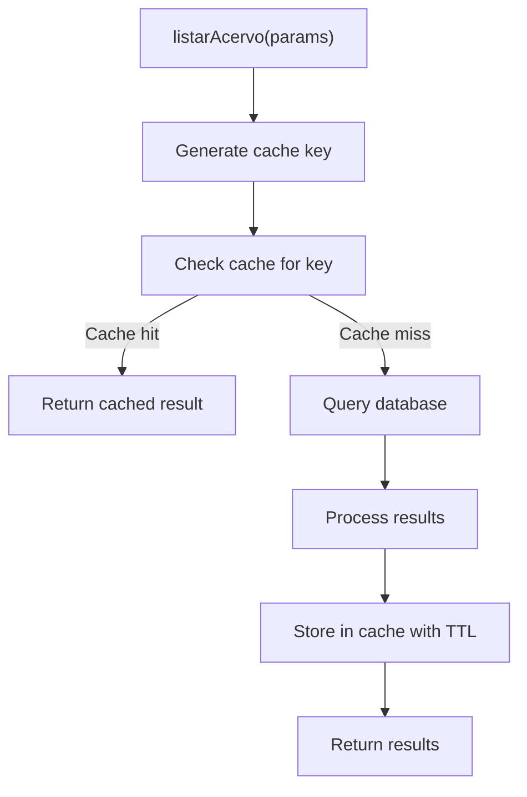

# Caching Usage Patterns

<cite>
**Referenced Files in This Document**   
- [cache-utils.ts](file://backend/utils/redis/cache-utils.ts)
- [cache-keys.ts](file://backend/utils/redis/cache-keys.ts)
- [client.ts](file://backend/utils/redis/client.ts)
- [authorization.ts](file://backend/auth/authorization.ts)
- [listar-acervo.service.ts](file://backend/acervo/services/persistence/listar-acervo.service.ts)
- [listar-audiencias.service.ts](file://backend/audiencias/services/persistence/listar-audiencias.service.ts)
- [usuario-persistence.service.ts](file://backend/usuarios/services/persistence/usuario-persistence.service.ts)
- [timeline-unificada.service.ts](file://backend/acervo/services/timeline/timeline-unificada.service.ts)
</cite>

## Table of Contents
1. [Introduction](#introduction)
2. [Cache Utility Functions](#cache-utility-functions)
3. [Cache Key Organization](#cache-key-organization)
4. [Caching Data Patterns](#caching-data-patterns)
5. [Service Implementation Examples](#service-implementation-examples)
6. [Cache Key Naming Conventions](#cache-key-naming-conventions)
7. [Data Serialization Methods](#data-serialization-methods)
8. [Performance Benefits](#performance-benefits)
9. [Common Issues and Solutions](#common-issues-and-solutions)
10. [Cache Monitoring](#cache-monitoring)

## Introduction
This document details the caching usage patterns in the Sinesys application, focusing on the Redis-based caching system. The caching strategy is designed to improve performance by reducing database load and minimizing response times for frequently accessed data. The system implements a comprehensive caching layer for various data types including user permissions, process timelines, tribunal configurations, and other frequently accessed entities such as acervo, audiencias, and usuarios. The caching mechanism follows consistent patterns across the application, with standardized utility functions, key organization, and invalidation strategies to ensure data consistency and optimal performance.

## Cache Utility Functions
The Sinesys application implements a robust set of utility functions in `backend/utils/redis/cache-utils.ts` to manage Redis caching operations. These functions provide a consistent interface for cache operations across the application, abstracting the underlying Redis client implementation and handling error conditions gracefully.

The utility functions include:
- `getCached<T>(key: string)`: Retrieves cached data for a given key, returning null if not found or Redis is unavailable
- `setCached<T>(key: string, data: T, ttl: number)`: Sets data in cache with optional TTL (Time To Live)
- `deleteCached(key: string)`: Deletes a specific cache key
- `deletePattern(pattern: string)`: Deletes cache keys matching a pattern
- `getCacheStats()`: Retrieves Redis cache statistics
- `withCache<T>(key: string, fn: () => Promise<T>, ttl: number)`: Higher-order function that wraps an async function with caching

The module also exports specific TTL (Time To Live) configurations for different data types, with a default cache TTL defined by the `REDIS_CACHE_TTL` environment variable (defaulting to 600 seconds). Document-specific caching helpers provide targeted invalidation functions for document, template, folder, and sharing caches, ensuring efficient cache management for frequently updated content.

**Section sources**
- [cache-utils.ts](file://backend/utils/redis/cache-utils.ts#L1-L212)

## Cache Key Organization
The cache key organization in Sinesys follows a systematic approach defined in `backend/utils/redis/cache-keys.ts`. The system uses a combination of predefined prefixes and parameter-based key generation to ensure consistent and predictable cache keys across the application.

The `CACHE_PREFIXES` object defines standard prefixes for different data domains:
- `pendentes`: For pending items
- `audiencias`: For hearings
- `acervo`: For case inventory
- `usuarios`: For users
- `clientes`: For clients
- `contratos`: For contracts
- Various other domain-specific prefixes

The key generation system uses the `generateCacheKey` function from `cache-utils.ts` to create deterministic cache keys by sorting object keys before serialization. This ensures that objects with the same properties in different orders generate identical cache keys. The `normalizeParams` function removes undefined values and sorts keys for consistency before generating cache keys.

Specific functions are provided for each data type to generate appropriate cache keys:
- `getPendentesListKey(params)`: Generates cache key for pending items list
- `getAudienciasListKey(params)`: Generates cache key for hearings list
- `getAcervoListKey(params)`: Generates cache key for case inventory list
- `getUsuariosListKey(params)`: Generates cache key for users list
- Various other type-specific key generation functions

This organization ensures that cache keys are predictable, consistent, and follow a logical structure that reflects the data hierarchy and access patterns.

**Section sources**
- [cache-keys.ts](file://backend/utils/redis/cache-keys.ts#L1-L116)
- [cache-utils.ts](file://backend/utils/redis/cache-utils.ts#L8-L26)

## Caching Data Patterns
Sinesys implements several common caching patterns for different types of data, each optimized for the specific access patterns and update frequency of the data.

### User Permissions Caching
User permissions are cached using an in-memory Map with a 5-minute TTL, as implemented in `backend/auth/authorization.ts`. The `checkPermission` function first checks the in-memory cache before querying the database, significantly reducing database load for permission checks. The cache key format is `${usuarioId}:${recurso}:${operacao}`, and the cache is automatically invalidated when permissions are updated through the `invalidarCacheUsuario` function. Super admin status is also cached, providing a performance optimization for users with elevated privileges.

### Process Timelines Caching
Process timelines are cached at the individual process level, with the timeline data stored in Redis. The `obterTimelineUnificada` function in `timeline-unificada.service.ts` aggregates timelines from multiple instances of a process (first degree, second degree, TST) and applies deduplication to remove redundant events. The caching system supports unified timelines that combine data from different sources while maintaining data integrity.

### Tribunal Configurations Caching
Tribunal configurations are cached using the standard Redis caching utilities with appropriate TTLs. The system caches tribunal-specific configurations to avoid repeated database queries when rendering tribunal-specific interfaces or processing tribunal-specific logic. The cache keys follow the standard pattern with the `tribunais` prefix, and invalidation occurs when tribunal configurations are updated.

These caching patterns ensure that frequently accessed data is readily available while maintaining data consistency through proper invalidation strategies.

**Section sources**
- [authorization.ts](file://backend/auth/authorization.ts#L1-L201)
- [timeline-unificada.service.ts](file://backend/acervo/services/timeline/timeline-unificada.service.ts#L1-L281)

## Service Implementation Examples
The Sinesys application demonstrates consistent caching patterns across various service implementations, particularly in the acervo, audiencias, and usuarios modules.

### Acervo Module Caching
The acervo module implements caching in the `listar-acervo.service.ts` file, where the `listarAcervo` function uses the caching pattern to store query results. The function first generates a cache key using `getAcervoListKey(params)` and checks for cached results. If a cache hit occurs, the cached result is returned immediately. On cache miss, the function queries the database, stores the result in cache with a 15-minute TTL, and returns the data. This pattern significantly reduces database load for frequently accessed case inventory queries.

**Diagram sources**
- [listar-acervo.service.ts](file://backend/acervo/services/persistence/listar-acervo.service.ts#L75-L222)

### Audiencias Module Caching
The audiencias module follows a similar pattern in `listar-audiencias.service.ts`, where the `listarAudiencias` function implements caching for hearing queries. The function uses `getAudienciasListKey(params)` to generate cache keys and follows the same cache-first approach. The implementation includes logging for cache hits and misses, which aids in monitoring cache effectiveness. The maximum limit for queries is set to 1000 records, which is appropriate for calendar views and other hearing visualizations.

### Usuarios Module Caching
The usuarios module in `usuario-persistence.service.ts` implements comprehensive caching with multiple access patterns. Individual user lookups by ID, CPF, or email use specific cache keys (`usuarios:id:${id}`, `usuarios:cpf:${cpf}`, `usuarios:email:${email}`) with a 30-minute TTL. List queries use parameter-based cache keys generated by `getUsuariosListKey(params)`. The implementation includes proper cache invalidation in the `atualizarUsuario` function, which invalidates relevant cache entries when a user is updated, ensuring data consistency.

These implementations demonstrate a consistent approach to caching across the application, with appropriate TTLs, key generation, and invalidation strategies tailored to each data type's access patterns.

**Section sources**
- [listar-acervo.service.ts](file://backend/acervo/services/persistence/listar-acervo.service.ts#L75-L222)
- [listar-audiencias.service.ts](file://backend/audiencias/services/persistence/listar-audiencias.service.ts#L77-L271)
- [usuario-persistence.service.ts](file://backend/usuarios/services/persistence/usuario-persistence.service.ts#L503-L666)

## Cache Key Naming Conventions
The Sinesys application follows a consistent and descriptive cache key naming convention that enhances readability and maintainability. The conventions are designed to be both human-readable and machine-parsable, facilitating debugging and monitoring.

The primary naming patterns include:

### Prefix-Based Organization
Cache keys use domain-specific prefixes defined in the `CACHE_PREFIXES` object:
- `acervo:id:123` - Case inventory item by ID
- `audiencias:456` - Hearing by ID
- `usuarios:email:user@example.com` - User by email
- `pendentes:group:trt=SP` - Pending items grouped by TRT

### Parameter Serialization
For queries with parameters, the system uses JSON serialization of sorted parameters:
- `acervo:{"trt":"SP","grau":"primeiro_grau"}`
- `audiencias:{"data_inicio_inicio":"2023-01-01","status":"confirmada"}`

This ensures that objects with the same properties in different orders generate identical cache keys.

### Hierarchical Structure
The naming convention follows a hierarchical structure that reflects the data access pattern:
- Collection-level: `prefix:params`
- Item-level: `prefix:id:value`
- Specialized: `prefix:operation:params`

### Specialized Key Patterns
The system also implements specialized patterns for specific use cases:
- `documentos:list:*` - Pattern for invalidating document lists
- `templates:123` - Template by ID
- `plano_contas:hierarquia` - Special key for account plan hierarchy

These conventions ensure that cache keys are predictable, consistent, and follow a logical structure that makes it easy to understand the purpose of each cache entry and facilitates efficient cache management and debugging.

**Section sources**
- [cache-utils.ts](file://backend/utils/redis/cache-utils.ts#L8-L26)
- [cache-keys.ts](file://backend/utils/redis/cache-keys.ts#L1-L116)

## Data Serialization Methods
The Sinesys caching system employs JSON serialization as the primary method for storing complex data structures in Redis. This approach provides a balance between readability, compatibility, and efficiency for the application's data types.

### JSON Serialization
The `setCached` function uses `JSON.stringify(data)` to serialize data before storing it in Redis, while `getCached` uses `JSON.parse(data)` to deserialize retrieved data. This standard approach ensures compatibility across different parts of the application and allows for easy inspection of cache contents during debugging.

### Deterministic Serialization
To ensure consistent cache keys for objects with the same properties but different key ordering, the system implements deterministic serialization through the `sortObjectKeys` function. This recursive function sorts object keys alphabetically before serialization, guaranteeing that equivalent objects generate identical JSON strings and thus identical cache keys.

### Parameter Normalization
Before generating cache keys, parameters are normalized by:
- Removing undefined values
- Sorting keys alphabetically
- Converting to a consistent format

This normalization process, implemented in the `normalizeParams` function, prevents cache fragmentation that could occur from equivalent parameter objects with different key ordering or extraneous undefined values.

### Type Safety
The caching utilities are implemented with TypeScript generics (`getCached<T>()`, `setCached<T>()`), providing type safety and ensuring that the correct data types are used when retrieving cached data. This reduces the risk of runtime errors due to type mismatches.

These serialization methods ensure data integrity, prevent cache fragmentation, and maintain type safety while providing a simple and effective mechanism for storing complex data structures in the Redis cache.

**Section sources**
- [cache-utils.ts](file://backend/utils/redis/cache-utils.ts#L36-L57)
- [cache-keys.ts](file://backend/utils/redis/cache-keys.ts#L10-L20)

## Performance Benefits
The caching implementation in Sinesys provides significant performance benefits across various aspects of the application.

### Reduced Database Load
By caching frequently accessed data, the system dramatically reduces the number of database queries. For example, user permission checks that would otherwise require database queries are served from an in-memory cache with O(1) lookup time. Similarly, list queries for acervo, audiencias, and usuarios are served from cache when available, reducing the load on the Supabase database.

### Improved Response Times
Cached responses are returned significantly faster than database queries. The Redis cache provides sub-millisecond response times for cache hits, compared to potentially hundreds of milliseconds for complex database queries with joins and filtering. This improvement is particularly noticeable for list queries with pagination and filtering parameters.

### Optimized Resource Utilization
The caching system optimizes resource utilization by:
- Reducing CPU usage on the database server
- Minimizing network bandwidth between application and database
- Decreasing memory pressure on the application server by avoiding repeated data processing

### Scalability
The Redis-based caching architecture enables better scalability by:
- Allowing the application to handle more concurrent users
- Reducing the load on the database, which is often the bottleneck in web applications
- Providing a distributed caching solution that can be scaled independently of the application servers

### Cost Efficiency
By reducing database load and improving response times, the caching system contributes to cost efficiency by:
- Allowing smaller database instances for the same workload
- Reducing the need for database read replicas
- Improving user experience, potentially increasing user retention and satisfaction

These performance benefits collectively enhance the user experience and allow the application to handle higher loads with better responsiveness.

**Section sources**
- [cache-utils.ts](file://backend/utils/redis/cache-utils.ts#L63-L89)
- [authorization.ts](file://backend/auth/authorization.ts#L56-L145)

## Common Issues and Solutions
The Sinesys caching system addresses several common caching issues with well-defined solutions.

### Cache Misses
Cache misses occur when requested data is not in the cache, requiring a database query. The system handles this gracefully by:
- Falling back to database queries when cache is unavailable or data is not found
- Automatically populating the cache with the retrieved data
- Logging cache misses for monitoring and optimization

The implementation in `getCached` returns null on cache miss, allowing the calling code to handle the fallback logic appropriately.

### Cache Invalidation
Proper cache invalidation is critical for maintaining data consistency. The system implements several strategies:
- Targeted invalidation: Specific cache entries are invalidated when related data is updated
- Pattern-based invalidation: Related cache entries are invalidated using key patterns
- Service-specific invalidation: Domain services handle invalidation as part of their business logic

For example, when a user is updated, the `atualizarUsuario` function invalidates the user's cache entry by ID, CPF, and email, as well as the general users list cache.

### Cache Stampede
To prevent cache stampede (thundering herd) problems where multiple requests simultaneously try to populate a cache after expiration, the system relies on Redis's atomic operations and the application's request handling patterns. While not explicitly implemented, the risk is mitigated by the relatively short TTLs and the fact that most queries are user-specific.

### Redis Availability
The system gracefully handles Redis unavailability by:
- Checking `isRedisAvailable()` before cache operations
- Returning null or skipping cache operations when Redis is unavailable
- Allowing the application to continue functioning, albeit with reduced performance

Error handling in cache operations prevents Redis failures from cascading to the rest of the application.

### Memory Management
The system manages cache memory through:
- Appropriate TTL settings based on data volatility
- Selective caching of frequently accessed data
- Avoiding caching of large datasets that could overwhelm Redis memory

These solutions ensure that the caching system enhances performance without introducing new reliability issues or data consistency problems.

**Section sources**
- [cache-utils.ts](file://backend/utils/redis/cache-utils.ts#L63-L124)
- [usuario-persistence.service.ts](file://backend/usuarios/services/persistence/usuario-persistence.service.ts#L480-L488)

## Cache Monitoring
The Sinesys application includes several mechanisms for monitoring cache performance and health.

### Cache Statistics
The `getCacheStats` function in `cache-utils.ts` retrieves key Redis statistics from the INFO command output, including:
- `used_memory`: Memory used by Redis
- `total_connections_received`: Total connections received
- `keyspace_hits`: Number of successful cache lookups
- `keyspace_misses`: Number of cache misses
- `uptime_in_seconds`: Redis server uptime

These metrics provide insight into cache efficiency and server health.

### Application Logging
The caching system includes detailed logging for monitoring purposes:
- Cache hits are logged with debug level: "Cache hit for listarAcervo: acervo:{"trt":"SP"}"
- Cache misses are logged with debug level: "Cache miss for listarAcervo: acervo:{"trt":"SP"}"
- Cache operation failures are logged with warning level

This logging enables developers and operations teams to monitor cache effectiveness and identify potential issues.

### Permission Cache Statistics
The authorization module includes a `getCacheStats` function that provides statistics on the in-memory permission cache:
- Total number of cache entries
- Number of active entries
- Number of expired entries

This helps monitor the effectiveness of permission caching and identify potential memory issues.

### Periodic Maintenance
The system implements periodic maintenance for the permission cache:
- A setInterval job runs every 10 minutes to clean expired entries
- The `limparCacheExpirado` function removes expired entries from the in-memory cache

This ensures that the in-memory cache does not grow indefinitely and maintains optimal performance.

These monitoring capabilities enable proactive management of the caching system and provide valuable insights for performance optimization.

**Section sources**
- [cache-utils.ts](file://backend/utils/redis/cache-utils.ts#L130-L151)
- [authorization.ts](file://backend/auth/authorization.ts#L177-L195)
- [listar-acervo.service.ts](file://backend/acervo/services/persistence/listar-acervo.service.ts#L80-L85)