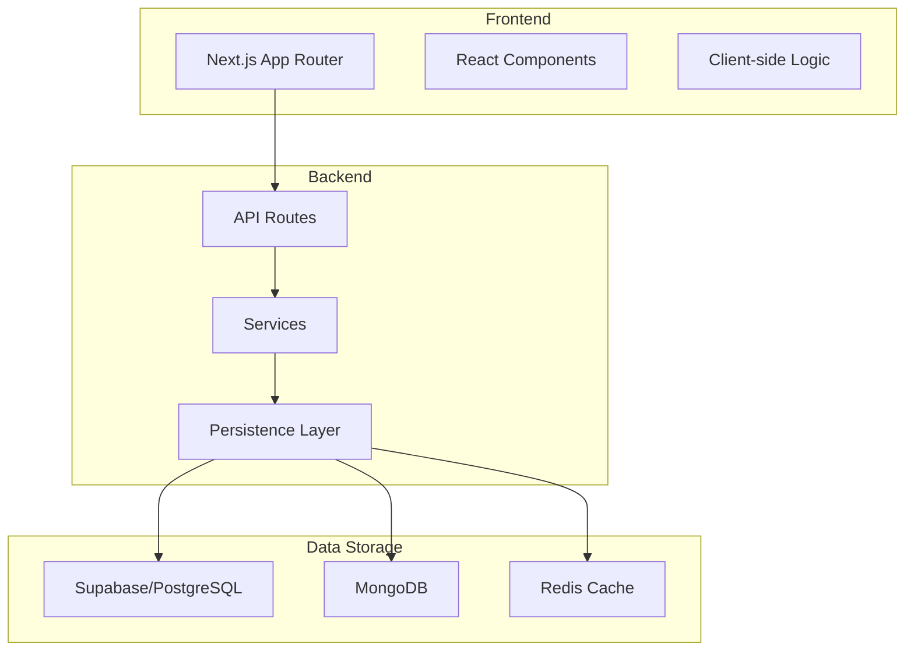
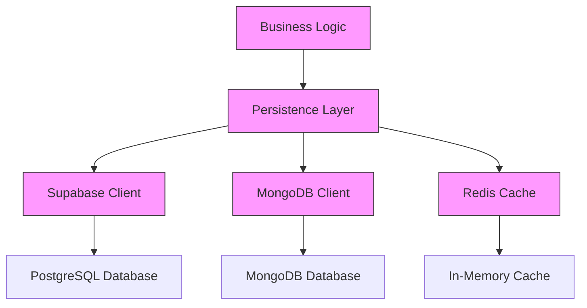
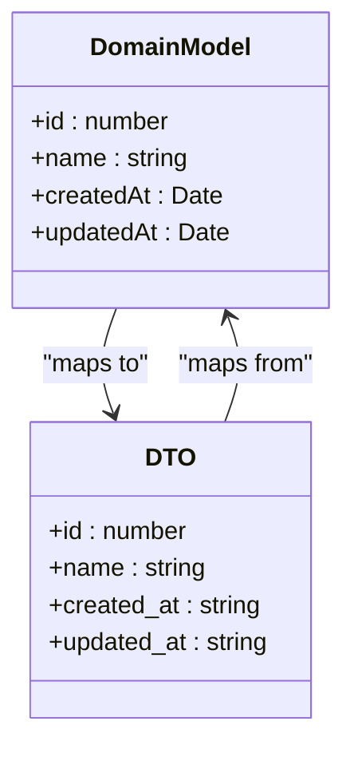
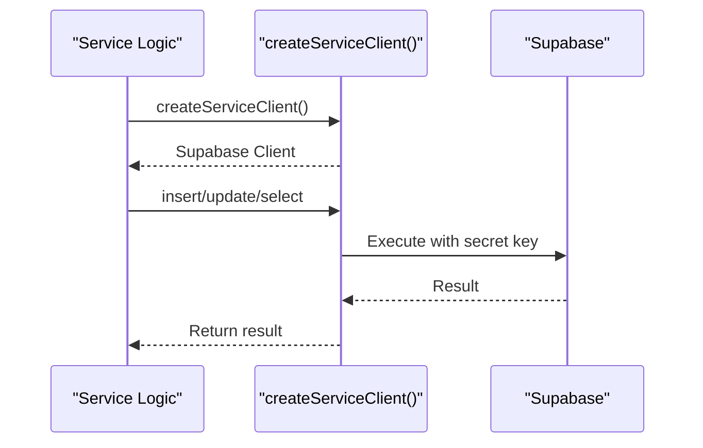
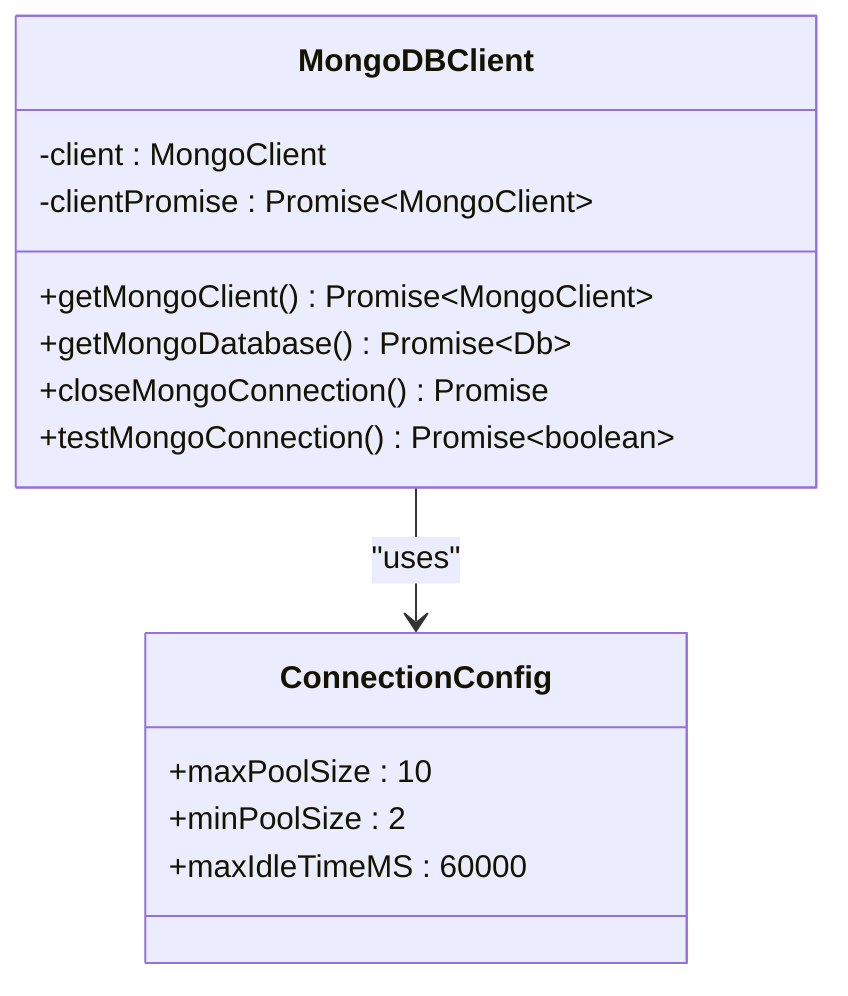
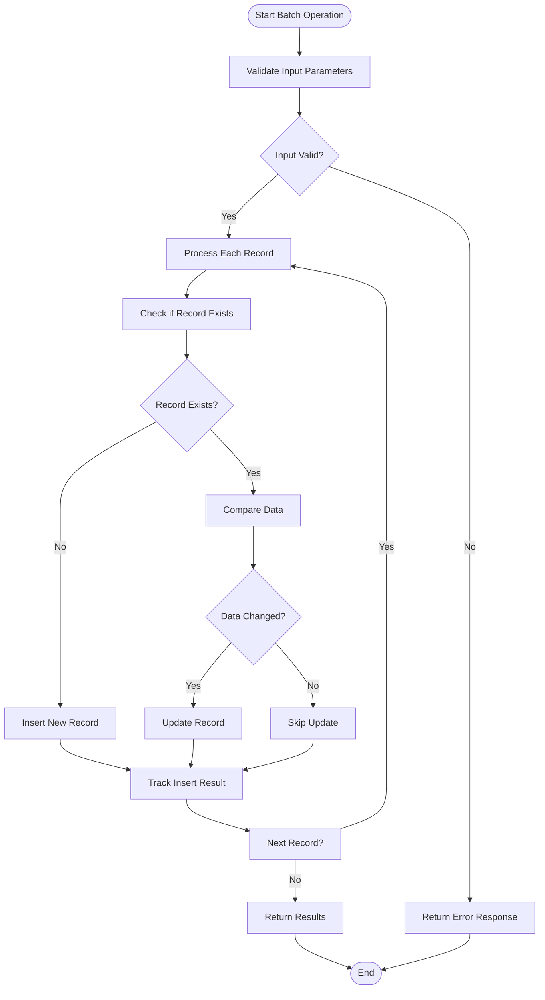
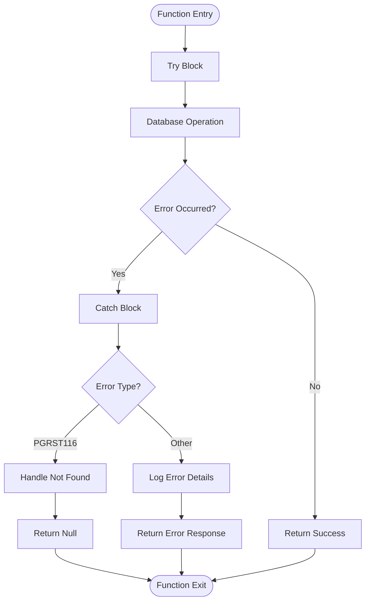
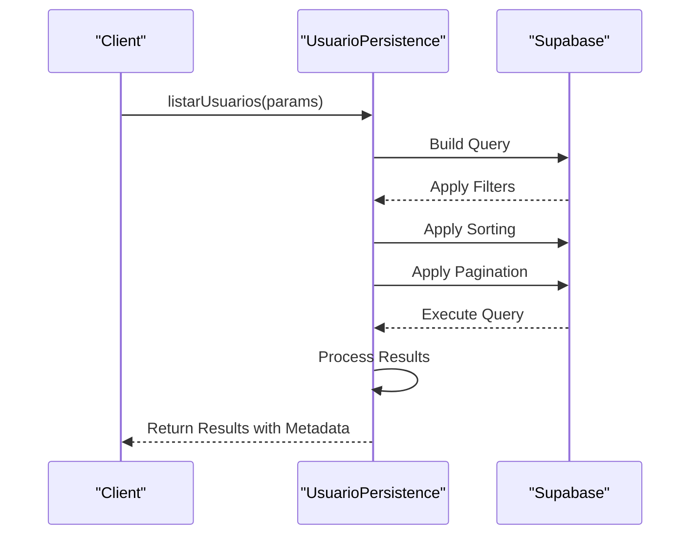
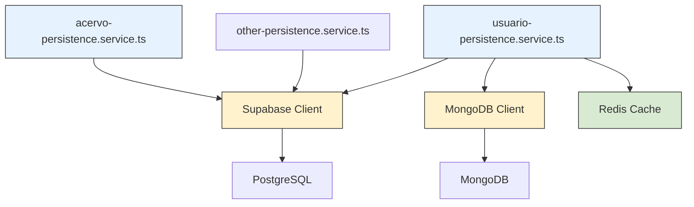
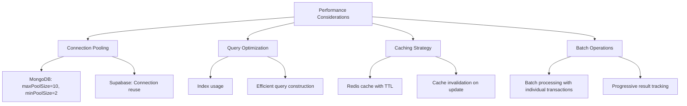

# Data Access Patterns

<cite>
**Referenced Files in This Document**   
- [acervo-persistence.service.ts](file://backend/captura/services/persistence/acervo-persistence.service.ts)
- [usuario-persistence.service.ts](file://backend/usuarios/services/persistence/usuario-persistence.service.ts)
- [server-client.ts](file://backend/utils/supabase/server-client.ts)
- [service-client.ts](file://backend/utils/supabase/service-client.ts)
- [client.ts](file://backend/utils/mongodb/client.ts)
- [collections.ts](file://backend/utils/mongodb/collections.ts)
- [index.ts](file://types/domain/index.ts)
- [index.ts](file://types/contracts/index.ts)
- [cache-utils.ts](file://backend/utils/redis/cache-utils.ts)
- [cache-keys.ts](file://backend/utils/redis/cache-keys.ts)
</cite>

## Table of Contents
1. [Introduction](#introduction)
2. [Project Structure](#project-structure)
3. [Core Components](#core-components)
4. [Architecture Overview](#architecture-overview)
5. [Detailed Component Analysis](#detailed-component-analysis)
6. [Dependency Analysis](#dependency-analysis)
7. [Performance Considerations](#performance-considerations)
8. [Troubleshooting Guide](#troubleshooting-guide)
9. [Conclusion](#conclusion)

## Introduction
This document provides comprehensive documentation for the Sinesys data access patterns and persistence layer implementation. It details how the repository pattern is implemented in backend services to abstract database interactions from business logic, covering both PostgreSQL (via Supabase) and MongoDB operations. The documentation explains the separation between domain models and data transfer objects, connection management, query construction, transaction handling, and error handling strategies.

## Project Structure
The Sinesys application follows a modular architecture with clear separation between frontend, backend, and shared components. The backend persistence layer is organized under the `backend` directory with services grouped by domain (acervo, usuarios, audiencias, etc.). Each service contains a `persistence` subdirectory housing data access logic. The application uses Supabase for PostgreSQL operations (relational data) and MongoDB for timeline data (document-based storage).



**Diagram sources**
- [acervo-persistence.service.ts](file://backend/captura/services/persistence/acervo-persistence.service.ts)
- [usuario-persistence.service.ts](file://backend/usuarios/services/persistence/usuario-persistence.service.ts)
- [client.ts](file://backend/utils/mongodb/client.ts)

**Section sources**
- [acervo-persistence.service.ts](file://backend/captura/services/persistence/acervo-persistence.service.ts)
- [usuario-persistence.service.ts](file://backend/usuarios/services/persistence/usuario-persistence.service.ts)

## Core Components
The core components of the data access layer include the repository pattern implementation in persistence services, the Supabase client for PostgreSQL operations, the MongoDB client for timeline data, and the Redis-based caching system. These components work together to provide a robust data access layer that abstracts database interactions from business logic while maintaining data consistency and enforcing business rules.

**Section sources**
- [acervo-persistence.service.ts](file://backend/captura/services/persistence/acervo-persistence.service.ts)
- [usuario-persistence.service.ts](file://backend/usuarios/services/persistence/usuario-persistence.service.ts)
- [service-client.ts](file://backend/utils/supabase/service-client.ts)
- [client.ts](file://backend/utils/mongodb/client.ts)

## Architecture Overview
The data access architecture in Sinesys follows a layered approach with clear separation of concerns. The persistence layer sits between business logic services and database clients, implementing the repository pattern to abstract data access operations. The system uses Supabase for relational data (PostgreSQL) and MongoDB for timeline data, with Redis providing caching capabilities to improve performance.



**Diagram sources**
- [acervo-persistence.service.ts](file://backend/captura/services/persistence/acervo-persistence.service.ts)
- [usuario-persistence.service.ts](file://backend/usuarios/services/persistence/usuario-persistence.service.ts)
- [service-client.ts](file://backend/utils/supabase/service-client.ts)
- [client.ts](file://backend/utils/mongodb/client.ts)

## Detailed Component Analysis

### Repository Pattern Implementation
The repository pattern is implemented in various persistence services throughout the backend, with `acervo-persistence.service.ts` and `usuario-persistence.service.ts` serving as primary examples. These services abstract database interactions from business logic, providing a clean interface for data access operations.

```mermaid
classDiagram
class AcervoPersistence {
+salvarAcervo(params) SalvarAcervoResult
+buscarProcessoNoAcervo(id, trt, grau, numero) {id} | null
}
class UsuarioPersistence {
+criarUsuario(params) OperacaoUsuarioResult
+atualizarUsuario(id, params) OperacaoUsuarioResult
+buscarUsuarioPorId(id) Usuario | null
+buscarUsuarioPorCpf(cpf) Usuario | null
+buscarUsuarioPorEmail(email) Usuario | null
+listarUsuarios(params) ListarUsuariosResult
}
class SupabaseClient {
+from(table) QueryBuilder
+insert(data) Promise
+update(data) Promise
+select() Promise
+eq(column, value) QueryBuilder
}
class MongoDBClient {
+getMongoClient() Promise~MongoClient~
+getMongoDatabase() Promise~Db~
+closeMongoConnection() Promise
+testMongoConnection() Promise~boolean~
}
AcervoPersistence --> SupabaseClient : "uses"
UsuarioPersistence --> SupabaseClient : "uses"
UsuarioPersistence --> MongoDBClient : "uses"
```

**Diagram sources**
- [acervo-persistence.service.ts](file://backend/captura/services/persistence/acervo-persistence.service.ts)
- [usuario-persistence.service.ts](file://backend/usuarios/services/persistence/usuario-persistence.service.ts)
- [service-client.ts](file://backend/utils/supabase/service-client.ts)
- [client.ts](file://backend/utils/mongodb/client.ts)

**Section sources**
- [acervo-persistence.service.ts](file://backend/captura/services/persistence/acervo-persistence.service.ts)
- [usuario-persistence.service.ts](file://backend/usuarios/services/persistence/usuario-persistence.service.ts)

### Domain Models and Data Transfer Objects
The system maintains a clear separation between domain models (business entities) and data transfer objects (DTOs) used for data persistence. Domain models are defined in `types/domain/` while DTOs are defined in `types/contracts/`. This separation allows for independent evolution of business logic and data storage schemas.



**Diagram sources**
- [index.ts](file://types/domain/index.ts)
- [index.ts](file://types/contracts/index.ts)

**Section sources**
- [index.ts](file://types/domain/index.ts)
- [index.ts](file://types/contracts/index.ts)

### Supabase Client for PostgreSQL Operations
The Supabase client is used for all PostgreSQL operations, with two distinct client types: a service client for administrative operations that bypass Row Level Security (RLS), and a server client for authenticated user operations. The service client uses a secret key for administrative access, while the server client uses publishable keys with cookie-based authentication.



**Diagram sources**
- [service-client.ts](file://backend/utils/supabase/service-client.ts)
- [server-client.ts](file://backend/utils/supabase/server-client.ts)

**Section sources**
- [service-client.ts](file://backend/utils/supabase/service-client.ts)
- [server-client.ts](file://backend/utils/supabase/server-client.ts)

### MongoDB Client for Timeline Data
The MongoDB client implements a singleton pattern to maintain a single connection pool across the application. It provides methods for obtaining a database connection, testing connectivity, and closing the connection gracefully. The client is configured with connection pooling parameters to optimize performance in serverless environments.



**Diagram sources**
- [client.ts](file://backend/utils/mongodb/client.ts)
- [collections.ts](file://backend/utils/mongodb/collections.ts)

**Section sources**
- [client.ts](file://backend/utils/mongodb/client.ts)
- [collections.ts](file://backend/utils/mongodb/collections.ts)

### Transaction Handling and Batch Operations
The data access layer implements transaction handling and batch operations through Supabase's query builder and PostgreSQL's transaction capabilities. The `salvarAcervo` function in `acervo-persistence.service.ts` demonstrates batch processing with individual transaction handling for each record, ensuring data consistency while providing detailed results for each operation.



**Diagram sources**
- [acervo-persistence.service.ts](file://backend/captura/services/persistence/acervo-persistence.service.ts)

**Section sources**
- [acervo-persistence.service.ts](file://backend/captura/services/persistence/acervo-persistence.service.ts)

### Error Handling Strategies
The data access layer implements comprehensive error handling strategies, including specific error codes for different scenarios (e.g., 'PGRST116' for record not found), detailed error logging, and graceful error recovery. The services use try-catch blocks to handle exceptions and provide meaningful error messages to calling functions.



**Diagram sources**
- [acervo-persistence.service.ts](file://backend/captura/services/persistence/acervo-persistence.service.ts)
- [usuario-persistence.service.ts](file://backend/usuarios/services/persistence/usuario-persistence.service.ts)

**Section sources**
- [acervo-persistence.service.ts](file://backend/captura/services/persistence/acervo-persistence.service.ts)
- [usuario-persistence.service.ts](file://backend/usuarios/services/persistence/usuario-persistence.service.ts)

### Complex Queries with Filtering, Sorting, and Pagination
The data access layer supports complex queries with filtering, sorting, and pagination capabilities. The `listarUsuarios` function in `usuario-persistence.service.ts` demonstrates these capabilities, allowing filtering by multiple criteria, sorting by creation date, and paginated results with total count.



**Diagram sources**
- [usuario-persistence.service.ts](file://backend/usuarios/services/persistence/usuario-persistence.service.ts)

**Section sources**
- [usuario-persistence.service.ts](file://backend/usuarios/services/persistence/usuario-persistence.service.ts)

## Dependency Analysis
The data access layer has well-defined dependencies between components, with clear separation between database clients, persistence services, and business logic. The Supabase and MongoDB clients are used by multiple persistence services, creating a shared dependency on these database access layers.



**Diagram sources**
- [acervo-persistence.service.ts](file://backend/captura/services/persistence/acervo-persistence.service.ts)
- [usuario-persistence.service.ts](file://backend/usuarios/services/persistence/usuario-persistence.service.ts)
- [service-client.ts](file://backend/utils/supabase/service-client.ts)
- [client.ts](file://backend/utils/mongodb/client.ts)
- [cache-utils.ts](file://backend/utils/redis/cache-utils.ts)

**Section sources**
- [acervo-persistence.service.ts](file://backend/captura/services/persistence/acervo-persistence.service.ts)
- [usuario-persistence.service.ts](file://backend/usuarios/services/persistence/usuario-persistence.service.ts)

## Performance Considerations
The data access layer incorporates several performance optimization strategies, including connection pooling, query optimization, and caching. The MongoDB client uses connection pooling with configurable parameters (maxPoolSize, minPoolSize, maxIdleTimeMS) to optimize database connections. The Redis-based caching system reduces database load by caching frequently accessed data with appropriate TTL values.



**Diagram sources**
- [client.ts](file://backend/utils/mongodb/client.ts)
- [cache-utils.ts](file://backend/utils/redis/cache-utils.ts)
- [cache-keys.ts](file://backend/utils/redis/cache-keys.ts)
- [acervo-persistence.service.ts](file://backend/captura/services/persistence/acervo-persistence.service.ts)

**Section sources**
- [client.ts](file://backend/utils/mongodb/client.ts)
- [cache-utils.ts](file://backend/utils/redis/cache-utils.ts)
- [acervo-persistence.service.ts](file://backend/captura/services/persistence/acervo-persistence.service.ts)

## Troubleshooting Guide
When troubleshooting data access issues in Sinesys, consider the following common scenarios and their solutions:

1. **Database Connection Issues**: Verify environment variables (NEXT_PUBLIC_SUPABASE_URL, SUPABASE_SECRET_KEY, MONGODB_URL, MONGODB_DATABASE) are correctly set. Use the `testMongoConnection()` function to verify MongoDB connectivity.

2. **Authentication/Authorization Errors**: Ensure the correct Supabase client is being used (service client for administrative operations, server client for user operations). Verify RLS (Row Level Security) policies are correctly configured.

3. **Caching Issues**: Check Redis connection and configuration. Use cache invalidation functions when data is updated to ensure consistency between cache and database.

4. **Query Performance Problems**: Verify appropriate indexes exist on frequently queried fields. Monitor query execution time and optimize as needed.

5. **Data Consistency Issues**: Ensure transaction handling is properly implemented, especially for batch operations. Verify that business rules are enforced at the persistence layer.

**Section sources**
- [service-client.ts](file://backend/utils/supabase/service-client.ts)
- [client.ts](file://backend/utils/mongodb/client.ts)
- [cache-utils.ts](file://backend/utils/redis/cache-utils.ts)
- [acervo-persistence.service.ts](file://backend/captura/services/persistence/acervo-persistence.service.ts)

## Conclusion
The Sinesys data access layer implements a robust and scalable architecture using the repository pattern to abstract database interactions from business logic. By leveraging Supabase for PostgreSQL operations and MongoDB for timeline data, the system can handle both relational and document-based data efficiently. The clear separation between domain models and DTOs, combined with comprehensive error handling and performance optimizations, ensures data consistency and system reliability. The implementation demonstrates best practices in data access patterns, providing a solid foundation for the application's data management needs.