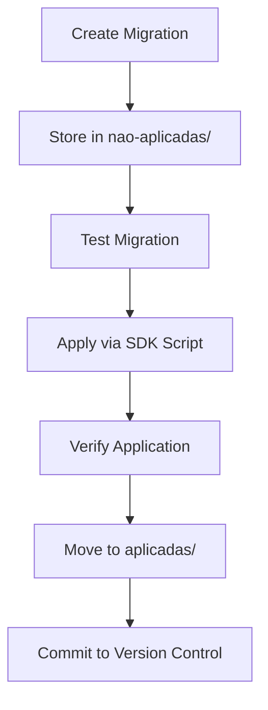
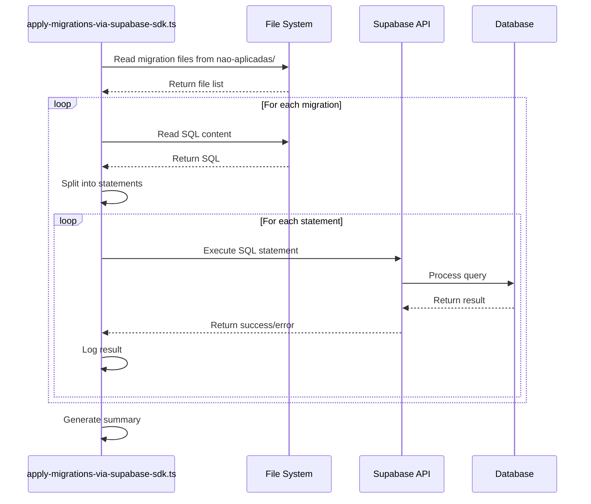
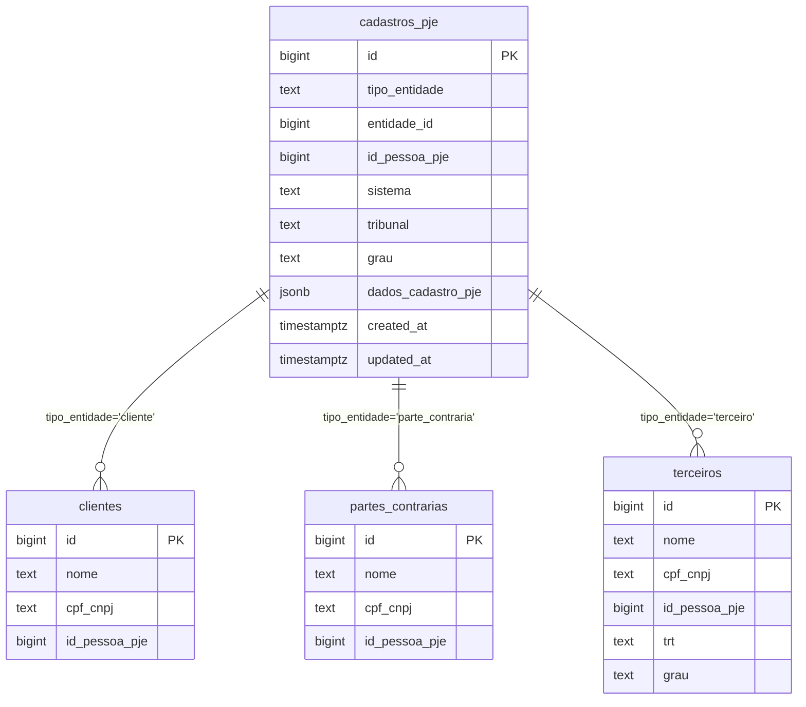

# Migration Strategy

<cite>
**Referenced Files in This Document**   
- [20250118115831_create_agendamentos.sql](file://supabase/migrations/aplicadas/20250118115831_create_agendamentos.sql)
- [20251128000001_create_cadastros_pje.sql](file://supabase/migrations/aplicadas/20251128000001_create_cadastros_pje.sql)
- [20251201120000_add_formsign_tables.sql](file://supabase/migrations/aplicadas/20251201120000_add_formsign_tables.sql)
- [apply-migrations-via-supabase-sdk.ts](file://scripts/database/apply-migrations-via-supabase-sdk.ts)
- [check-applied-migrations.ts](file://scripts/database/check-applied-migrations.ts)
- [19_cadastros_pje.sql](file://supabase/schemas/19_cadastros_pje.sql)
- [README.md](file://README.md)
</cite>

## Table of Contents
1. [Introduction](#introduction)
2. [Migration Workflow](#migration-workflow)
3. [Versioning System](#versioning-system)
4. [Migration Application Process](#migration-application-process)
5. [Migration Status Verification](#migration-status-verification)
6. [Rollback Strategy](#rollback-strategy)
7. [Testing in Isolated Environments](#testing-in-isolated-environments)
8. [Complex Migration Examples](#complex-migration-examples)
9. [Best Practices](#best-practices)
10. [Conclusion](#conclusion)

## Introduction
The Sinesys database migration strategy is designed to ensure reliable, traceable, and reversible schema changes using Supabase migrations. The system employs a structured approach to database evolution, with migrations organized in timestamp-based files that track schema changes over time. This documentation details the complete migration workflow, from creation to application and verification, including strategies for rollback and testing. The approach emphasizes backward compatibility, data integrity, and team collaboration through standardized practices.

**Section sources**
- [README.md](file://README.md)

## Migration Workflow
The Sinesys migration workflow follows a structured process that separates pending and applied migrations. Migrations are stored in the `supabase/migrations/` directory, which contains two subdirectories: `aplicadas` (applied) and `nao-aplicadas` (pending). This separation allows developers to clearly distinguish between migrations that have been executed in the database and those that are ready for application.

The workflow begins with the creation of a new migration file in the `nao-aplicadas` directory. Once the migration has been tested and approved, it is applied to the database using the `apply-migrations-via-supabase-sdk.ts` script. After successful application, the migration file is moved to the `aplicadas` directory, indicating that it has been executed. This workflow ensures that migrations are applied in a controlled and predictable manner, with a clear audit trail of changes.

The migration process is designed to be idempotent, meaning that applying the same migration multiple times will not result in errors or data corruption. This is achieved through the use of `IF NOT EXISTS` clauses in SQL statements and conflict resolution strategies such as `ON CONFLICT DO NOTHING`. The workflow also includes validation steps to ensure that migrations are applied correctly and that the database schema remains consistent across environments.

**Diagram sources **
- [apply-migrations-via-supabase-sdk.ts](file://scripts/database/apply-migrations-via-supabase-sdk.ts)
- [check-applied-migrations.ts](file://scripts/database/check-applied-migrations.ts)

**Section sources**
- [apply-migrations-via-supabase-sdk.ts](file://scripts/database/apply-migrations-via-supabase-sdk.ts)
- [check-applied-migrations.ts](file://scripts/database/check-applied-migrations.ts)

## Versioning System
The Sinesys migration system uses a timestamp-based versioning scheme to ensure unique and chronological ordering of migrations. Each migration filename follows the pattern `YYYYMMDDHHMMSS_description.sql`, where the timestamp provides a globally unique identifier and ensures that migrations are applied in the correct order. For example, `20250118115831_create_agendamentos.sql` indicates a migration created on January 18, 2025, at 11:58:31.

This versioning approach eliminates conflicts that can arise from sequential numbering systems, especially in team environments where multiple developers may create migrations simultaneously. The timestamp precision to the second level ensures that even if multiple migrations are created in quick succession, they will have unique identifiers. This system also provides immediate context about when a migration was created, which can be valuable for debugging and auditing purposes.

The versioning system is complemented by descriptive filenames that clearly indicate the purpose of each migration. This combination of timestamp and description makes it easy to understand the migration's intent and place in the overall schema evolution. The system also supports the use of the `MIGRATION_CHECKS` object in the `check-applied-migrations.ts` script, which maps migration files to specific database objects, allowing for automated verification of migration status.

**Section sources**
- [20250118115831_create_agendamentos.sql](file://supabase/migrations/aplicadas/20250118115831_create_agendamentos.sql)
- [check-applied-migrations.ts](file://scripts/database/check-applied-migrations.ts)

## Migration Application Process
The migration application process in Sinesys is automated through the `apply-migrations-via-supabase-sdk.ts` script, which applies pending migrations to the database using the Supabase SDK. This script reads migration files from the `nao-aplicadas` directory and executes them against the database using direct SQL queries via the Supabase REST API.

The script processes each migration file by splitting it into individual SQL statements, which are then executed sequentially. This approach allows for granular error handling, where the script can continue processing subsequent statements even if some fail due to non-critical issues like "already exists" errors. The script includes comprehensive logging that shows the progress of each migration, including success and error counts for individual statements.

Error handling is a critical aspect of the migration application process. The script distinguishes between critical errors that should halt the migration process and non-critical errors that can be safely ignored. For example, an error indicating that a resource already exists is treated as non-critical, as it likely means the migration has already been partially applied. In contrast, syntax errors or constraint violations are considered critical and will stop the migration process.

After all migrations have been processed, the script provides a summary of the results, including the number of migrations applied successfully and those that failed. It also provides guidance on next steps, such as moving applied migration files to the `aplicadas` directory and updating documentation.

**Diagram sources **
- [apply-migrations-via-supabase-sdk.ts](file://scripts/database/apply-migrations-via-supabase-sdk.ts)

**Section sources**
- [apply-migrations-via-supabase-sdk.ts](file://scripts/database/apply-migrations-via-supabase-sdk.ts)

## Migration Status Verification
Migration status verification in Sinesys is handled by the `check-applied-migrations.ts` script, which determines which migrations have been applied to the database. This script uses a proactive verification approach by checking for the existence of specific database objects that should have been created by each migration.

The verification process is based on the `MIGRATION_CHECKS` configuration object, which maps each migration file to one or more database objects that serve as indicators of its application. For example, a migration that creates a table will have a corresponding check for that table's existence, while a migration that adds a column will have a check for that column in its respective table.

The script performs two types of checks: table existence and column existence. For table checks, it attempts to query the table with a limit of one record, treating any error related to the table not existing as a failure. For column checks, it attempts to select the specific column, with similar error handling for non-existent columns. This approach allows the script to accurately determine whether a migration has been applied without making assumptions about the database state.

The verification process results in a comprehensive report that categorizes migrations as applied, not applied, or unknown (when no verification check is defined). This information is saved to a `migration-status.json` file for reference and can be used to guide the application of pending migrations. The script also handles migrations without defined checks by treating them as applied, ensuring that the verification process does not block legitimate migrations.

**Section sources**
- [check-applied-migrations.ts](file://scripts/database/check-applied-migrations.ts)

## Rollback Strategy
The Sinesys migration system incorporates a robust rollback strategy to handle errors and unintended changes. While the system does not include automated rollback scripts, it provides mechanisms for safe migration application and recovery from issues.

The primary rollback mechanism is prevention through careful migration design and testing. Migrations are designed to be idempotent and include error handling that allows for partial application without data corruption. The `apply-migrations-via-supabase-sdk.ts` script includes safeguards that stop the migration process when critical errors are encountered, preventing further changes to the database.

For migrations that need to be reversed, the recommended approach is to create a new migration that undoes the changes. This "forward-only" strategy is preferred over maintaining separate rollback scripts because it ensures that schema changes are always applied through the same controlled process. For example, if a column needs to be removed, a new migration would be created with a `DROP COLUMN` statement rather than relying on a rollback mechanism.

The system also includes data integrity checks and constraints that prevent accidental data loss. For example, foreign key constraints ensure that related data is not orphaned, and `ON DELETE` clauses specify the behavior when referenced records are removed. These database-level protections serve as a safety net during migration application.

In cases where data corruption occurs, the system relies on database backups and point-in-time recovery features provided by Supabase. Regular backups are maintained, and the timestamp-based migration system makes it possible to identify the state of the database at any point in time, facilitating recovery to a known good state.

**Section sources**
- [20250118115831_create_agendamentos.sql](file://supabase/migrations/aplicadas/20250118115831_create_agendamentos.sql)
- [apply-migrations-via-supabase-sdk.ts](file://scripts/database/apply-migrations-via-supabase-sdk.ts)

## Testing in Isolated Environments
Testing migrations in isolated environments is a critical part of the Sinesys development process. The system supports testing through multiple mechanisms that allow developers to validate migrations before they are applied to production databases.

The primary testing environment is the local development setup, where developers can apply migrations to a local Supabase instance. This allows for safe experimentation and validation of migration scripts without affecting shared resources. The `apply-migrations-via-supabase-sdk.ts` script can be configured to target different database URLs, making it easy to test migrations against various environments.

For more comprehensive testing, the system includes scripts that populate the database with test data, such as the `populate-database.ts` script. This script processes JSON files containing sample data and inserts them into the appropriate tables, creating a realistic dataset for testing. This approach ensures that migrations are tested against data that reflects real-world usage patterns.

The migration verification script (`check-applied-migrations.ts`) also serves as a testing tool by providing immediate feedback on whether migrations have been applied correctly. Developers can run this script before and after applying migrations to verify that the expected changes have occurred. The script's output is saved to a JSON file, which can be used for automated testing and continuous integration.

Additionally, the system includes end-to-end tests in the `e2e/` directory that validate the functionality of the application after migrations have been applied. These tests cover critical workflows and ensure that schema changes do not break existing functionality. The combination of unit tests, integration tests, and end-to-end tests provides a comprehensive testing framework for migrations.

**Section sources**
- [populate-database.ts](file://scripts/database/populate-database.ts)
- [check-applied-migrations.ts](file://scripts/database/check-applied-migrations.ts)

## Complex Migration Examples
The Sinesys migration system includes several complex migration examples that demonstrate advanced database schema changes. These migrations illustrate how the system handles significant structural changes while maintaining data integrity and backward compatibility.

### Cadastros PJE System Creation
The creation of the `cadastros_pje` system is one of the most complex migrations in the Sinesys codebase. This migration, implemented in `20251128000001_create_cadastros_pje.sql`, introduces a unified table for mapping entities to their IDs in judicial systems. The migration creates a table with a polymorphic reference to multiple entity types (clients, opposing parties, third parties, representatives) and includes comprehensive constraints, indexes, and row-level security policies.

The migration also includes a series of follow-up migrations that transfer data from existing tables to the new `cadastros_pje` table. For example, `20251128000002_migrate_clientes_to_cadastros_pje.sql` migrates client data, inferring tribunal information from related processes. These data migration scripts use complex SQL logic with `LEFT JOIN`s and `COALESCE` functions to handle cases where tribunal information is not directly available.

**Diagram sources **
- [19_cadastros_pje.sql](file://supabase/schemas/19_cadastros_pje.sql)
- [20251128000001_create_cadastros_pje.sql](file://supabase/migrations/aplicadas/20251128000001_create_cadastros_pje.sql)

### Formsign Tables Addition
The addition of formsign tables, implemented in `20251201120000_add_formsign_tables.sql`, demonstrates how the system integrates new functionality through migrations. This migration uses the `\i` directive to include SQL from the `supabase/schemas/25_formsign.sql` file, which contains the complete schema for the formsign system.

The formsign migration introduces tables for digital signatures, including segments, templates, forms, sessions, and signatures. This approach of using schema files for complex migrations allows for better organization and reusability of SQL code. The migration is designed to be atomic, ensuring that all formsign tables are created together or not at all, maintaining the integrity of the new system.

**Section sources**
- [20251128000001_create_cadastros_pje.sql](file://supabase/migrations/aplicadas/20251128000001_create_cadastros_pje.sql)
- [20251128000002_migrate_clientes_to_cadastros_pje.sql](file://supabase/migrations/aplicadas/20251128000002_migrate_clientes_to_cadastros_pje.sql)
- [20251128000003_migrate_partes_contrarias_to_cadastros_pje.sql](file://supabase/migrations/aplicadas/20251128000003_migrate_partes_contrarias_to_cadastros_pje.sql)
- [20251128000004_migrate_terceiros_to_cadastros_pje.sql](file://supabase/migrations/aplicadas/20251128000004_migrate_terceiros_to_cadastros_pje.sql)
- [20251201120000_add_formsign_tables.sql](file://supabase/migrations/aplicadas/20251201120000_add_formsign_tables.sql)
- [19_cadastros_pje.sql](file://supabase/schemas/19_cadastros_pje.sql)

## Best Practices
The Sinesys migration system follows several best practices to ensure reliable and maintainable database schema evolution. These practices are designed to promote collaboration, prevent errors, and maintain data integrity throughout the development lifecycle.

### Writing Reversible Migrations
Although the system uses a forward-only migration strategy, migrations are designed with reversibility in mind. This is achieved by avoiding destructive operations whenever possible and by creating new migrations to undo changes rather than modifying existing ones. For example, instead of dropping a column immediately, a migration might first mark it as deprecated and then create a separate migration to remove it after verifying that no code depends on it.

Migrations are also written to be idempotent, meaning they can be safely applied multiple times without causing errors or data corruption. This is accomplished through the use of `IF NOT EXISTS` clauses for object creation and `ON CONFLICT` clauses for data insertion. These patterns ensure that migrations can be reapplied if needed, such as when setting up a new development environment.

### Maintaining Backward Compatibility
Backward compatibility is a key consideration in the Sinesys migration strategy. When making schema changes that could affect existing code, the system follows a multi-step approach. First, new columns or tables are added without removing old ones. Then, the application code is updated to use the new schema. Finally, after verifying that the new schema is working correctly, a separate migration is created to remove the deprecated elements.

This approach allows for gradual migration of code and data, reducing the risk of breaking changes. It also supports rolling deployments, where different versions of the application can coexist during the transition period. The timestamp-based migration system makes it easy to track when backward-incompatible changes were introduced, facilitating debugging and support.

Other best practices include comprehensive commenting in migration files, using descriptive names for database objects, and including validation steps in the migration process. The system also emphasizes documentation, with README files and comments that explain the purpose and impact of each migration.

**Section sources**
- [20250118115831_create_agendamentos.sql](file://supabase/migrations/aplicadas/20250118115831_create_agendamentos.sql)
- [apply-migrations-via-supabase-sdk.ts](file://scripts/database/apply-migrations-via-supabase-sdk.ts)
- [check-applied-migrations.ts](file://scripts/database/check-applied-migrations.ts)

## Conclusion
The Sinesys database migration strategy provides a comprehensive framework for managing schema changes in a reliable and collaborative manner. By combining timestamp-based versioning, automated application scripts, and comprehensive verification tools, the system ensures that database evolution is controlled, traceable, and reversible.

The migration workflow is designed to be developer-friendly while maintaining strict controls over database changes. The separation of pending and applied migrations, combined with the use of descriptive filenames and comprehensive logging, makes it easy for team members to understand the state of the database and the history of changes.

The system's emphasis on testing, backward compatibility, and best practices ensures that migrations are applied safely and with minimal risk to data integrity. The inclusion of complex migration examples, such as the `cadastros_pje` system and formsign integration, demonstrates the system's capability to handle significant schema changes while maintaining application functionality.

Overall, the Sinesys migration strategy represents a mature approach to database schema management that balances automation with safety, enabling rapid development while protecting against errors and data loss.