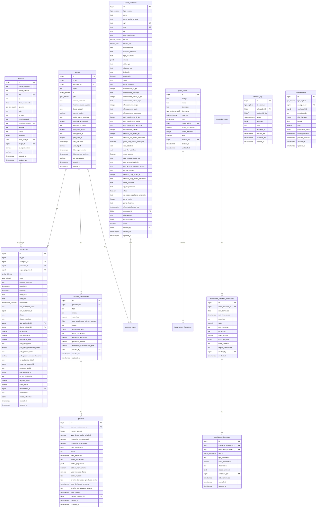

# Schema Design

<cite>
**Referenced Files in This Document**   
- [04_acervo.sql](file://supabase/schemas/04_acervo.sql)
- [07_audiencias.sql](file://supabase/schemas/07_audiencias.sql)
- [08_usuarios.sql](file://supabase/schemas/08_usuarios.sql)
- [10_partes_contrarias.sql](file://supabase/schemas/10_partes_contrarias.sql)
- [20_acordos_condenacoes.sql](file://supabase/schemas/20_acordos_condenacoes.sql)
- [21_capturas.sql](file://supabase/schemas/21_capturas.sql)
- [26_plano_contas.sql](file://supabase/schemas/26_plano_contas.sql)
- [31_conciliacao_bancaria.sql](file://supabase/schemas/31_conciliacao_bancaria.sql)
- [01_enums.sql](file://supabase/schemas/01_enums.sql)
- [33_financeiro_functions.sql](file://supabase/schemas/33_financeiro_functions.sql)
- [34_financeiro_views.sql](file://supabase/schemas/34_financeiro_views.sql)
- [acervo.ts](file://types/domain/acervo.ts)
- [audiencias.ts](file://types/domain/audiencias.ts)
- [financeiro.ts](file://types/domain/financeiro.ts)
- [partes.ts](file://types/domain/partes.ts)
- [processo-partes.ts](file://types/domain/processo-partes.ts)
</cite>

## Table of Contents
1. [Introduction](#introduction)
2. [Core Entity Relationships](#core-entity-relationships)
3. [Legal Process Domain (acervo)](#legal-process-domain-acervo)
4. [Hearings Domain (audiencias)](#hearings-domain-audiencias)
5. [Users Domain (usuarios)](#users-domain-usuarios)
6. [Opposing Parties Domain (partes_contrarias)](#opposing-parties-domain-partes_contrarias)
7. [Judgment Agreements Domain (acordos_condenacoes)](#judgment-agreements-domain-acordos_condenacoes)
8. [Data Capture Domain (capturas)](#data-capture-domain-capturas)
9. [Accounting Plan Domain (plano_contas)](#accounting-plan-domain-plano_contas)
10. [Bank Reconciliation Domain (conciliacao_bancaria)](#bank-reconciliation-domain-conciliacao_bancaria)
11. [Domain Model Alignment](#domain-model-alignment)
12. [Data Validation and Business Constraints](#data-validation-and-business-constraints)
13. [Row Level Security (RLS) Policies](#row-level-security-rls-policies)
14. [Query Optimization and Indexing](#query-optimization-and-indexing)
15. [Conclusion](#conclusion)

## Introduction

The Sinesys PostgreSQL schema design provides a comprehensive data model for managing legal processes, hearings, users, opposing parties, judgment agreements, data captures, accounting plans, and bank reconciliation. This documentation details the entity relationships, data types, constraints, indexes, and security policies that form the foundation of the system. The schema is designed to support a law firm's operations by integrating legal case management with financial systems, ensuring referential integrity and data consistency across domains.

The database schema is organized into multiple SQL files in the `supabase/schemas/` directory, each focusing on a specific domain. The design follows a normalized approach with proper foreign key relationships, while also incorporating denormalized fields for performance optimization. The system leverages PostgreSQL features such as enums, JSONB for flexible data storage, triggers for business logic, and Row Level Security (RLS) for data access control.

**Section sources**
- [04_acervo.sql](file://supabase/schemas/04_acervo.sql#L1-L77)
- [07_audiencias.sql](file://supabase/schemas/07_audiencias.sql#L1-L159)
- [08_usuarios.sql](file://supabase/schemas/08_usuarios.sql#L1-L94)

## Core Entity Relationships

The Sinesys data model centers around legal processes (acervo) as the primary entity, with various related entities that extend its functionality. The core relationship structure connects legal processes to hearings, users, opposing parties, judgment agreements, and financial data through a well-defined schema.

The `acervo` table serves as the central hub for legal processes, storing information about cases captured from the PJE (Processo Judicial Eletrônico) system. Each process in the acervo can have multiple associated hearings stored in the `audiencias` table, linked through the `processo_id` foreign key. This one-to-many relationship allows tracking of all scheduled hearings for a given legal process.

Users of the system are managed in the `usuarios` table, which stores employee and collaborator information. These users can be assigned as responsible parties for hearings through the `responsavel_id` field in the `audiencias` table, creating a direct relationship between staff members and specific court dates.

Opposing parties in legal processes are tracked in the `partes_contrarias` table, which maintains a global registry of all parties involved in cases. The relationship between processes and opposing parties is established through the `processo_partes` table (not directly shown in the provided files but referenced), which acts as a junction table to handle the many-to-many relationship between processes and parties.

Financial aspects of legal cases are managed through the `acordos_condenacoes` table, which stores information about settlements, judgments, and court costs associated with specific processes. This table links to the `acervo` table via the `processo_id` foreign key, enabling financial tracking of case outcomes.

The schema also includes specialized domains for data capture operations (`capturas`), accounting plans (`plano_contas`), and bank reconciliation (`conciliacao_bancaria`), which integrate with the core legal process data to provide a comprehensive case management solution.

**Diagram sources**
- [04_acervo.sql](file://supabase/schemas/04_acervo.sql#L4-L32)
- [07_audiencias.sql](file://supabase/schemas/07_audiencias.sql#L4-L46)
- [08_usuarios.sql](file://supabase/schemas/08_usuarios.sql#L6-L37)
- [10_partes_contrarias.sql](file://supabase/schemas/10_partes_contrarias.sql#L8-L86)
- [20_acordos_condenacoes.sql](file://supabase/schemas/20_acordos_condenacoes.sql#L6-L22)
- [21_capturas.sql](file://supabase/schemas/21_capturas.sql#L6-L18)
- [26_plano_contas.sql](file://supabase/schemas/26_plano_contas.sql#L15-L48)
- [31_conciliacao_bancaria.sql](file://supabase/schemas/31_conciliacao_bancaria.sql#L15-L45)

## Legal Process Domain (acervo)

The `acervo` table represents the core entity for legal processes in the Sinesys system, storing comprehensive information about cases captured from the PJE (Processo Judicial Eletrônico) system. This table serves as the foundation for tracking all legal proceedings, whether they are active cases in the general inventory or archived cases.

The table structure includes essential fields for identifying and categorizing legal processes. The primary key is an auto-generated `id`, while the `id_pje` field stores the unique identifier from the PJE system. The `advogado_id` is a foreign key referencing the `advogados` table, indicating which lawyer captured the process. This design allows multiple lawyers from the same firm to access the same process without duplication.

Key identifying information includes the `numero_processo` field, which stores the case number in the CNJ format (e.g., 0101450-28.2025.5.01.0431), and the `trt` field, which uses the `codigo_tribunal` enum to specify the TRT (Regional Labor Court) where the process is being handled. The `grau` field, using the `grau_tribunal` enum, indicates whether the process is in the first or second instance.

The table includes important metadata about the legal process, such as `classe_judicial` (judicial class), `segredo_justica` (indicating if the case is under judicial secrecy), and `codigo_status_processo` (the current status code of the process). Temporal information is captured through `data_autuacao` (filing date), `data_arquivamento` (archiving date), and `data_proxima_audiencia` (date of the next scheduled hearing).

To ensure data integrity, the table has a unique constraint on the combination of `id_pje`, `trt`, `grau`, and `numero_processo`, preventing duplicate entries for the same process across different instances. This constraint acknowledges that the same process may have different IDs in different judicial instances.

The schema includes multiple indexes to optimize query performance, particularly on fields commonly used in search operations such as `advogado_id`, `origem`, `trt`, `grau`, and `numero_processo`. A composite index on `advogado_id`, `trt`, and `grau` supports queries that filter by lawyer and court instance.

Row Level Security (RLS) is enabled on this table, with policies that allow the service role full access and authenticated users to read records. This security model ensures that only authorized users can access sensitive legal process information.

**Section sources**
- [04_acervo.sql](file://supabase/schemas/04_acervo.sql#L4-L77)
- [acervo.ts](file://types/domain/acervo.ts#L1-L81)

## Hearings Domain (audiencias)

The `audiencias` table manages scheduled hearings for legal processes, providing detailed information about court dates, participants, and logistical arrangements. This table is closely linked to the `acervo` table through the `processo_id` foreign key, establishing a one-to-many relationship where a single legal process can have multiple associated hearings.

Each hearing record contains comprehensive information about the scheduled court appearance. The `id_pje` field stores the unique identifier from the PJE system, while `advogado_id` references the lawyer who captured the hearing information. The `processo_id` field creates the essential link to the parent legal process in the `acervo` table.

The table captures both temporal and spatial information about hearings. Temporal data includes `data_inicio` and `data_fim` (start and end timestamps), as well as `hora_inicio` and `hora_fim` (start and end times extracted from the PJE schedule). Spatial information is stored in two formats: `url_audiencia_virtual` for virtual hearings (containing Zoom, Google Meet, or other video conferencing links) and `endereco_presencial` as a JSONB field for physical hearing locations.

A key feature of this table is the `modalidade` field, which uses the `modalidade_audiencia` enum to indicate whether the hearing is virtual, presential, or hybrid. This field is populated automatically by a trigger function (`populate_modalidade_audiencia`) that examines the presence of a virtual URL, the type of hearing description, or a physical address to determine the appropriate modality.

The table includes information about the parties involved, with `polo_ativo_nome` and `polo_passivo_nome` storing the names of the plaintiff and defendant, respectively. For hybrid hearings, the `presenca_hibrida` field specifies whether the lawyer or client will attend in person.

Administrative and operational data is also captured, including `status` (M=Marked, R=Realized, C=Cancelled), `tipo_audiencia_id` (foreign key to the type of hearing), and `responsavel_id` (the user responsible for the hearing). The `dados_anteriores` JSONB field stores the previous state of the record before updates, enabling audit trail functionality.

Indexes are strategically placed on fields commonly used in queries, including `advogado_id`, `processo_id`, `trt`, `grau`, `data_inicio`, and `responsavel_id`. Composite indexes like `idx_audiencias_processo_data` on `processo_id` and `data_inicio` optimize queries that retrieve hearings for a specific process ordered by date.

RLS is enabled with policies that grant full access to the service role and read access to authenticated users, ensuring appropriate data security while allowing necessary access for case management.

**Section sources**
- [07_audiencias.sql](file://supabase/schemas/07_audiencias.sql#L4-L159)
- [audiencias.ts](file://types/domain/audiencias.ts#L1-L77)

## Users Domain (usuarios)

The `usuarios` table manages the system's users, representing employees and collaborators within the law firm. This table serves as the central repository for user information, supporting both operational functions and security controls within the Sinesys application.

The table structure includes comprehensive personal and professional information. Basic identification data includes `nome_completo` (full name), `nome_exibicao` (display name), `cpf` (Brazilian individual taxpayer registry), and `rg` (identity document). Professional details are captured through `oab` (law license number) and `uf_oab` (state where the OAB was issued), which are particularly relevant for lawyer users.

Contact information is stored in multiple fields: `email_pessoal` and `email_corporativo` for email addresses, `telefone` for phone number, and `ramal` for extension. The `endereco` field uses JSONB to store a complete address structure, including street, number, complement, neighborhood, city, state, country, and postal code, providing flexibility for various address formats.

System control fields include `auth_user_id` (referencing the Supabase Auth user ID), `cargo_id` (job position/role), `is_super_admin` (indicating super administrator privileges), and `ativo` (active status). These fields enable fine-grained access control and user management within the application.

The table includes several constraints and indexes to ensure data integrity and optimize queries. Unique indexes on `cpf` and `email_corporativo` prevent duplicate entries for these critical identifiers. Indexes on `auth_user_id`, `cargo_id`, and `ativo` support efficient filtering and lookups. A GIN index on the `endereco` JSONB field enables efficient searching within the address data.

A trigger (`update_usuarios_updated_at`) automatically updates the `updated_at` timestamp whenever a record is modified, providing audit trail functionality. This is a common pattern across the schema for tracking record modifications.

RLS policies are implemented to control data access. The service role has full access to all user records, while authenticated users can read user data. Additionally, users can update their own profile information, but only if their `auth_user_id` matches the record being updated, ensuring privacy and data ownership.

**Section sources**
- [08_usuarios.sql](file://supabase/schemas/08_usuarios.sql#L6-L94)

## Opposing Parties Domain (partes_contrarias)

The `partes_contrarias` table maintains a global registry of opposing parties in legal processes, serving as a centralized repository for information about plaintiffs, defendants, and other parties involved in cases. This design enables deduplication and consistent data management across multiple legal processes.

The table structure is comprehensive, capturing both basic identification and detailed PJE-specific information. The `tipo_pessoa` field uses the `tipo_pessoa` enum to distinguish between physical ('pf') and legal ('pj') entities. Identification is handled through `cpf` (for individuals) and `cnpj` (for companies), both of which have unique constraints to prevent duplication.

For individuals, the table includes personal details such as `rg` (identity document), `data_nascimento` (date of birth), `genero` (gender), `estado_civil` (marital status), and `nacionalidade` (nationality). For companies, fields like `inscricao_estadual` (state registration), `data_abertura` (incorporation date), and `ramo_atividade` (business sector) provide relevant organizational information.

The schema captures extensive PJE-specific data, including `emails` (an array of email addresses in JSONB format), `status_pje` and `situacao_pje` (status and situation in the PJE system), and `login_pje` (PJE username). For individuals, additional PJE fields include `sexo` (gender as stored in PJE), `nome_genitora` (mother's name), and various birthplace details. For companies, PJE-specific fields include `tipo_pessoa_codigo_pje`, `situacao_cnpj_receita_descricao` (CNPJ status with the tax authority), and `porte_descricao` (company size classification).

The table includes a foreign key `endereco_id` referencing the `enderecos` table, allowing for centralized address management. The `created_by` field tracks which user created the record, supporting audit functionality.

Indexes are strategically placed on key fields to optimize query performance, including `tipo_pessoa`, `cpf`, `cnpj`, `nome`, and `ativo`. These indexes support common search patterns when looking up opposing parties by identification number, name, or status.

RLS is enabled with policies that grant full access to the service role and read access to authenticated users. This security model ensures that sensitive party information is protected while allowing authorized access for case preparation and management.

**Section sources**
- [10_partes_contrarias.sql](file://supabase/schemas/10_partes_contrarias.sql#L8-L139)
- [partes.ts](file://types/domain/partes.ts#L1-L309)

## Judgment Agreements Domain (acordos_condenacoes)

The `acordos_condenacoes` table manages settlements, judgments, and court costs associated with legal processes, providing a structured way to track financial outcomes of cases. This table is complemented by the `parcelas` table, which handles individual payment installments, creating a parent-child relationship for managing multi-part payments.

The main table structure includes fields to categorize and quantify financial agreements. The `tipo` field uses a check constraint to limit values to 'acordo' (settlement), 'condenacao' (judgment), or 'custas_processuais' (court costs), ensuring data consistency. The `direcao` field indicates whether the financial flow is 'recebimento' (receipt) or 'pagamento' (payment) from the law firm's perspective.

Financial details are captured through `valor_total` (total value), `data_vencimento_primeira_parcela` (due date of the first installment), and `numero_parcelas` (number of installments). The `status` field tracks the payment status with values like 'pendente' (pending), 'pago_parcial' (partially paid), 'pago_total' (fully paid), or 'atrasado' (overdue).

A sophisticated financial distribution system is implemented through `percentual_escritorio` (law firm's percentage) and the generated column `percentual_cliente` (client's percentage, calculated as 100 minus the firm's percentage). This allows for flexible revenue sharing arrangements. The `honorarios_sucumbenciais_total` field tracks total litigation fees, which are typically retained entirely by the law firm.

The `parcelas` table extends this functionality by managing individual payment installments. Each parcel has a `numero_parcela` (installment number), `valor_bruto_credito_principal` (principal amount), `honorarios_sucumbenciais` (litigation fees for this installment), and `data_vencimento` (due date). The `status` field tracks the installment's status, while `forma_pagamento` specifies the payment method.

The relationship between agreements and installments is enforced through a foreign key with `on delete cascade`, ensuring that when an agreement is deleted, all associated installments are automatically removed. A unique constraint on `acordo_condenacao_id` and `numero_parcela` prevents duplicate installments.

Indexes on both tables optimize common query patterns, particularly on `processo_id`, `tipo`, `status`, and `data_vencimento` fields. RLS policies enable appropriate access control, with full access for the service role and read access for authenticated users.

**Section sources**
- [20_acordos_condenacoes.sql](file://supabase/schemas/20_acordos_condenacoes.sql#L6-L128)
- [financeiro.ts](file://types/domain/financeiro.ts#L1-L210)

## Data Capture Domain (capturas)

The `capturas` schema manages the automated data capture operations from external systems, particularly the PJE (Processo Judicial Eletrônico). This domain consists of two main tables: `capturas_log` for tracking execution history and `agendamentos` for managing scheduled captures.

The `capturas_log` table serves as an audit trail for all capture operations, recording when captures were executed, their status, and results. Key fields include `tipo_captura` (using the `tipo_captura` enum to specify 'acervo_geral', 'arquivados', 'audiencias', 'pendentes', or 'partes'), `advogado_id` (linking to the responsible lawyer), and `status` (tracking 'pending', 'in_progress', 'completed', or 'failed' states).

Execution metadata is captured through `iniciado_em` (start time) and `concluido_em` (completion time), enabling performance monitoring. The `resultado` field stores the capture results in JSONB format, while `erro` contains any error messages if the capture failed. The `mongodb_id` field references the raw JSON document stored in MongoDB, facilitating data recovery and debugging.

The `agendamentos` table manages the scheduling of automated captures, allowing for regular, recurring data synchronization. The `tipo_captura` field specifies the capture type, while `advogado_id` identifies the responsible lawyer. The scheduling logic is handled through `periodicidade` ('diario' or 'a_cada_N_dias'), `dias_intervalo` (interval days), and `horario` (execution time).

Additional parameters for specific capture types are stored in the `parametros_extras` JSONB field, providing flexibility for different capture configurations. The `proxima_execucao` field stores the calculated next execution time, enabling the scheduler to determine when captures should run.

Both tables include appropriate indexes to optimize query performance. The `capturas_log` table has indexes on `tipo_captura`, `status`, `advogado_id`, and `iniciado_em`, supporting queries that filter by capture type, status, or time period. The `agendamentos` table is indexed on `tipo_captura`, `ativo`, and `proxima_execucao`, facilitating efficient scheduling operations.

RLS policies are implemented to control access, with full access for the service role and read access for authenticated users. This security model ensures that capture operations can be monitored and managed appropriately while protecting sensitive scheduling information.

**Section sources**
- [21_capturas.sql](file://supabase/schemas/21_capturas.sql#L6-L104)

## Accounting Plan Domain (plano_contas)

The `plano_contas` table implements a hierarchical accounting plan for the law firm's financial management system, following standard accounting principles with a tree-like structure of accounts. This design allows for both detailed transaction recording and aggregated financial reporting.

The table structure supports a multi-level account hierarchy through the `conta_pai_id` foreign key, which references another account in the same table. This self-referential relationship enables the creation of synthetic accounts (higher-level categories) that group analytical accounts (lower-level, transaction-capable accounts).

Each account is identified by a `codigo` (code) and `nome` (name), with an optional `descricao` (description) for additional details. The `tipo_conta` field uses the `tipo_conta_contabil` enum to classify accounts as 'ativo' (asset), 'passivo' (liability), 'receita' (revenue), 'despesa' (expense), or 'patrimonio_liquido' (equity). The `natureza` field, using the `natureza_conta` enum, specifies whether the account is 'devedora' (debit) or 'credora' (credit), determining how it increases with transactions.

The `nivel` field, using the `nivel_conta` enum, distinguishes between 'sintetica' (synthetic) and 'analitica' (analytical) accounts. A check constraint ensures that only analytical accounts can accept direct financial entries (`aceita_lancamento = true`), while synthetic accounts serve only for aggregation and reporting.

To prevent circular references in the hierarchy, a check constraint (`plano_contas_sem_auto_referencia_check`) ensures that an account cannot be its own parent. Additionally, a trigger function (`validar_hierarquia_plano_contas`) prevents cycles in the hierarchy by checking that a proposed parent is not a descendant of the current account.

Indexes are strategically placed to optimize common operations: `idx_plano_contas_codigo` for code-based searches, `idx_plano_contas_tipo_conta` for filtering by account type, `idx_plano_contas_conta_pai` for hierarchical navigation, and a partial index on `aceita_lancamento` for quickly finding accounts that can receive transactions.

RLS policies enable appropriate access control, with full access for the service role and various levels of access for authenticated users, including the ability to insert, update, and view accounts. This supports collaborative management of the accounting plan while maintaining data security.

**Section sources**
- [26_plano_contas.sql](file://supabase/schemas/26_plano_contas.sql#L15-L191)

## Bank Reconciliation Domain (conciliacao_bancaria)

The `conciliacao_bancaria` schema manages the bank reconciliation process, bridging imported bank statement data with the system's financial records. This domain consists of two main tables: `transacoes_bancarias_importadas` for imported statement data and `conciliacoes_bancarias` for reconciliation records.

The `transacoes_bancarias_importadas` table stores raw transaction data from bank statements (OFX/CSV files), preserving the original information for audit purposes. Key fields include `conta_bancaria_id` (linking to the bank account), `data_transacao` (transaction date), `descricao` (description), and `valor` (amount). The `tipo_transacao` field indicates whether the transaction is a 'credito' (credit) or 'debito' (debit).

To prevent duplicate imports, the table includes a `hash_transacao` field that is automatically generated by a trigger function (`gerar_hash_transacao`) based on the account, date, amount, and description. This hash enables detection of duplicate transactions across multiple imports.

The `dados_originais` JSONB field stores the complete original transaction data, allowing for detailed audit and troubleshooting. Additional metadata includes `arquivo_importacao` (imported file path) and `created_by` (user who performed the import).

The `conciliacoes_bancarias` table manages the reconciliation process, linking imported transactions to the system's financial entries. The `transacao_importada_id` is a foreign key to the imported transaction, while `lancamento_financeiro_id` references the corresponding financial entry in the system.

Reconciliation status is tracked through the `status` field, using the `status_conciliacao` enum with values like 'pendente' (pending), 'conciliado' (reconciled), 'divergente' (discrepant), or 'ignorado' (ignored). For automated reconciliation suggestions, the `score_similaridade` field stores a similarity score (0-100) based on matching criteria.

The table includes audit fields `conciliado_por` (user who performed reconciliation) and `data_conciliacao` (reconciliation date), providing a complete audit trail. A unique constraint on `transacao_importada_id` ensures that each imported transaction can have at most one reconciliation record.

RLS policies are implemented to control access, with full access for the service role and various levels of access for authenticated users, enabling secure collaboration on the reconciliation process.

**Section sources**
- [31_conciliacao_bancaria.sql](file://supabase/schemas/31_conciliacao_bancaria.sql#L15-L221)

## Domain Model Alignment

The Sinesys system demonstrates a well-structured alignment between the PostgreSQL database schema and the TypeScript domain models defined in the `types/domain/` directory. This alignment ensures type safety and consistency between the backend data storage and frontend application logic.

The domain models in the `types/domain/` directory closely mirror the database tables, with interfaces that correspond to each major entity. For example, the `Acervo` interface in `acervo.ts` maps directly to the `acervo` table, with properties that match the database columns. Similarly, the `Audiencia` interface in `audiencias.ts` corresponds to the `audiencias` table, and the `ParteContraria` type in `partes.ts` aligns with the `partes_contrarias` table.

One notable aspect of this alignment is the handling of temporal data. While the database stores timestamps in `timestamptz` format, the TypeScript models represent them as strings in ISO format, which is the standard JSON representation for dates. This conversion is handled by the application layer, ensuring seamless data transfer between the database and frontend.

The domain models also incorporate business logic and derived properties. For example, the `Acervo` interface includes a `ProcessoUnificado` type that represents a unified view of a process across multiple instances (first and second degree), aggregating data from the primary instance with summaries of others. This demonstrates how the domain models extend beyond simple data transfer objects to include business concepts.

Enums defined in the database schema (in `01_enums.sql`) are mirrored in the TypeScript models. For instance, the `tipo_pessoa` enum in the database corresponds to the `TipoPessoa` type in `partes.ts`, ensuring consistency in how entity types are represented across the system.

The financial domain models in `financeiro.ts` demonstrate a more complex alignment, with re-exports of backend types and utility functions for working with hierarchical data structures like the accounting plan. The `achatarHierarquia` function, for example, flattens a hierarchical account structure for display in UI components, showing how the domain models support both data representation and presentation logic.

This alignment between database schema and domain models enables type-safe database queries and API responses, reducing the risk of runtime errors and improving developer productivity. The consistent naming and structure across layers make the system easier to understand and maintain.

**Section sources**
- [acervo.ts](file://types/domain/acervo.ts#L1-L81)
- [audiencias.ts](file://types/domain/audiencias.ts#L1-L77)
- [financeiro.ts](file://types/domain/financeiro.ts#L1-L210)
- [partes.ts](file://types/domain/partes.ts#L1-L309)
- [processo-partes.ts](file://types/domain/processo-partes.ts#L1-L137)

## Data Validation and Business Constraints

The Sinesys schema implements comprehensive data validation and business constraints at the database level to ensure data integrity and enforce business rules. These constraints are applied through various mechanisms including check constraints, foreign key relationships, triggers, and custom functions.

Check constraints are used extensively to validate data at the column level. For example, the `acervo` table has a check constraint on the `origem` column to ensure it only contains 'acervo_geral' or 'arquivado'. Similarly, the `acordos_condenacoes` table validates the `tipo` column to accept only 'acordo', 'condenacao', or 'custas_processuais' values. Numeric fields often have constraints to ensure positive values, such as `valor_total > 0` in the `acordos_condenacoes` table.

Foreign key constraints enforce referential integrity throughout the schema. The `advogado_id` in the `acervo` table references the `advogados` table with `on delete cascade`, ensuring that when a lawyer is deleted, all their associated processes are also removed. This cascading behavior is also seen in the relationship between `acordos_condenacoes` and `parcelas`, where deleting an agreement automatically removes all related installments.

Triggers implement more complex business logic that cannot be expressed through simple constraints. The `audiencias` table uses a trigger (`trigger_set_modalidade_audiencia`) with the `populate_modalidade_audiencia` function to automatically determine the hearing modality (virtual, presential, or hybrid) based on the presence of a virtual URL, type of hearing description, or physical address. This ensures consistent classification of hearing types without requiring manual input.

The `plano_contas` table employs a sophisticated trigger (`trigger_validar_hierarquia_plano_contas`) with the `validar_hierarquia_plano_contas` function to prevent circular references in the account hierarchy. This recursive function checks that a proposed parent account is not a descendant of the current account, maintaining the integrity of the hierarchical structure.

The `conciliacoes_bancarias` table includes a check constraint (`conciliacoes_status_lancamento`) that ensures a reconciliation is only marked as 'conciliado' when both a financial entry is linked and a reconciliation date is recorded. This prevents incomplete or inconsistent reconciliation records.

The `financeiro_functions.sql` file contains additional business logic implemented as PostgreSQL functions. For example, the `validar_conta_aceita_lancamento` function ensures that only analytical accounts (those with `aceita_lancamento = true`) can receive direct financial entries, preventing erroneous postings to synthetic accounts.

These validation mechanisms work together to create a robust data model that enforces business rules at the database level, providing a strong foundation for the application's integrity and reliability.

**Section sources**
- [04_acervo.sql](file://supabase/schemas/04_acervo.sql#L4-L77)
- [07_audiencias.sql](file://supabase/schemas/07_audiencias.sql#L4-L159)
- [20_acordos_condenacoes.sql](file://supabase/schemas/20_acordos_condenacoes.sql#L6-L128)
- [26_plano_contas.sql](file://supabase/schemas/26_plano_contas.sql#L15-L191)
- [31_conciliacao_bancaria.sql](file://supabase/schemas/31_conciliacao_bancaria.sql#L15-L221)
- [33_financeiro_functions.sql](file://supabase/schemas/33_financeiro_functions.sql#L1-L479)

## Row Level Security (RLS) Policies

The Sinesys schema implements Row Level Security (RLS) policies across all major tables to control data access at the row level, ensuring that users can only access data they are authorized to see. This security model is fundamental to protecting sensitive legal and financial information.

RLS is enabled on all core tables using the `alter table ... enable row level security` command. Each table then has specific policies defined to govern access. The pattern across tables is consistent: the service role has full access to all data, while authenticated users have more limited access based on their permissions.

The service role policies grant complete access to the service role, which is used by backend services and administrative functions. For example, the `acervo` table has a policy named "Service role tem acesso total a acervo" that allows the service role to perform all operations (SELECT, INSERT, UPDATE, DELETE) on all records. This pattern is repeated across all tables with similarly named policies.

Authenticated user policies typically allow read access to all records, recognizing that in a law firm environment, most employees need visibility into case information. For example, the `acervo` table has a policy "Usuários autenticados podem ler acervo" that allows authenticated users to SELECT all records. This broad read access facilitates collaboration while still maintaining a security boundary between authenticated and unauthenticated users.

Some tables include more granular policies for specific operations. The `usuarios` table, for instance, has a policy "Usuários podem atualizar seu próprio perfil" that allows users to UPDATE only their own profile records, determined by matching the `auth_user_id` in the record with the ID of the authenticated user. This ensures privacy while allowing users to manage their own information.

The `partes_contrarias` table follows a similar pattern, with the service role having full access and authenticated users having read access. This approach balances security with usability, allowing team members to access necessary party information for case preparation while preventing unauthorized modifications.

These RLS policies work in conjunction with the application's authentication system to create a comprehensive security model. By implementing security at the database level, the system ensures that data protection is enforced regardless of the access method, providing a robust defense against unauthorized data access.

**Section sources**
- [04_acervo.sql](file://supabase/schemas/04_acervo.sql#L74-L77)
- [07_audiencias.sql](file://supabase/schemas/07_audiencias.sql#L156-L158)
- [08_usuarios.sql](file://supabase/schemas/08_usuarios.sql#L75-L93)
- [10_partes_contrarias.sql](file://supabase/schemas/10_partes_contrarias.sql#L125-L139)
- [20_acordos_condenacoes.sql](file://supabase/schemas/20_acordos_condenacoes.sql#L43-L55)
- [21_capturas.sql](file://supabase/schemas/21_capturas.sql#L37-L49)
- [26_plano_contas.sql](file://supabase/schemas/26_plano_contas.sql#L159-L191)
- [31_conciliacao_bancaria.sql](file://supabase/schemas/31_conciliacao_bancaria.sql#L171-L221)

## Query Optimization and Indexing

The Sinesys schema employs a comprehensive indexing strategy to optimize query performance across all major tables. These indexes are carefully designed to support the most common query patterns while balancing the overhead of index maintenance.

The indexing approach follows several key principles: indexing foreign keys to optimize JOIN operations, indexing columns frequently used in WHERE clauses, and creating composite indexes for multi-column queries. Each table has multiple indexes tailored to its specific usage patterns.

In the `acervo` table, indexes are created on `advogado_id`, `origem`, `trt`, `grau`, and `numero_processo` to support queries that filter by lawyer, origin, court, or process number. A composite index on `advogado_id`, `trt`, and `grau` optimizes queries that retrieve processes for a specific lawyer filtered by court and instance. The `idx_acervo_numero_processo_trt_grau` index on `numero_processo`, `trt`, and `grau` supports efficient lookups by process number across different courts.

The `audiencias` table has a rich set of indexes to support various query patterns. In addition to indexes on foreign keys like `advogado_id` and `processo_id`, there are indexes on `data_inicio` and `data_fim` for date-based queries, `status` for filtering by hearing status, and `responsavel_id` for finding hearings assigned to specific users. The composite index `idx_audiencias_processo_data` on `processo_id` and `data_inicio` optimizes queries that retrieve hearings for a specific process ordered by date.

Financial tables employ specialized indexing strategies. The `plano_contas` table has a partial index `idx_plano_contas_aceita_lancamento` that only includes accounts with `aceita_lancamento = true`, optimizing queries that need to find accounts capable of receiving transactions. The `transacoes_bancarias_importadas` table includes a GIN index on the `dados_originais` JSONB field, enabling efficient searching within the raw transaction data.

The schema also includes materialized views with their own indexing strategy. The `v_dre` materialized view, which aggregates financial data for reporting, has a unique index on `ano`, `mes`, `conta_contabil_id`, and `categoria` to ensure fast lookups and prevent duplicates. Additional indexes on `ano`, `mes`, and `tipo_conta` support common reporting queries.

These indexing strategies work together to ensure that the most critical queries perform efficiently, even as data volumes grow. The combination of B-tree indexes for exact matches and range queries, partial indexes for filtered subsets, and GIN indexes for JSONB data provides a robust foundation for the application's performance.

**Section sources**
- [04_acervo.sql](file://supabase/schemas/04_acervo.sql#L56-L66)
- [07_audiencias.sql](file://supabase/schemas/07_audiencias.sql#L84-L99)
- [26_plano_contas.sql](file://supabase/schemas/26_plano_contas.sql#L72-L86)
- [31_conciliacao_bancaria.sql](file://supabase/schemas/31_conciliacao_bancaria.sql#L69-L81)
- [34_financeiro_views.sql](file://supabase/schemas/34_financeiro_views.sql#L440-L447)

## Conclusion

The Sinesys PostgreSQL schema design presents a comprehensive and well-structured data model for managing legal processes and associated financial operations. The schema demonstrates thoughtful architectural decisions that balance normalization with performance optimization, security with usability, and flexibility with data integrity.

The core strength of the design lies in its clear entity relationships, with the `acervo` table serving as the central hub for legal processes and related entities like hearings, parties, and financial agreements connected through well-defined foreign key relationships. This structure enables comprehensive case management while maintaining data consistency.

The implementation of Row Level Security across all major tables provides a robust security foundation, ensuring that sensitive legal and financial information is protected according to user roles and permissions. The combination of service role access for backend operations and authenticated user access for frontend interactions creates a secure yet functional environment.

The schema's use of PostgreSQL advanced features—such as enums for data consistency, JSONB for flexible data storage, triggers for business logic, and materialized views for reporting—demonstrates a sophisticated understanding of database capabilities. These features work together to create a system that is both powerful and maintainable.

The alignment between the database schema and TypeScript domain models ensures type safety and consistency across the application stack, reducing the risk of runtime errors and improving developer productivity. This end-to-end type consistency is a hallmark of well-designed modern applications.

Overall, the Sinesys schema represents a mature and production-ready data architecture that effectively supports the complex requirements of legal case management and financial tracking. Its thoughtful design patterns and comprehensive feature set provide a solid foundation for the application's current functionality and future evolution.