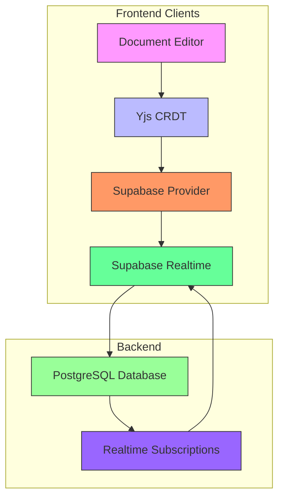
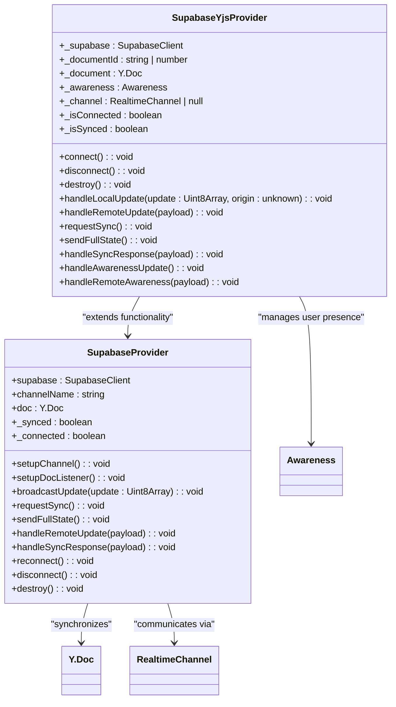
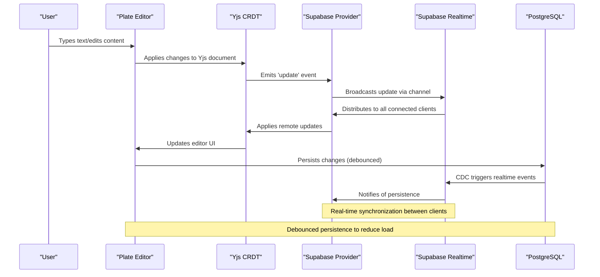
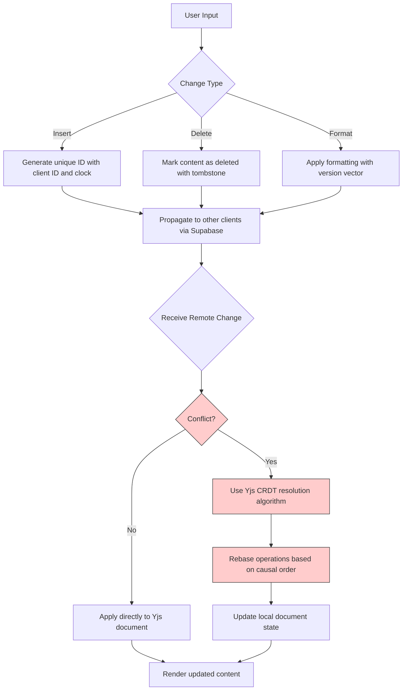
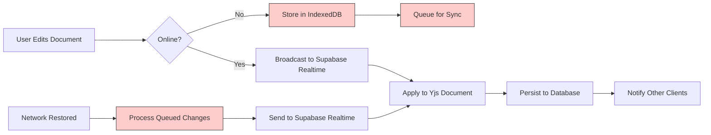
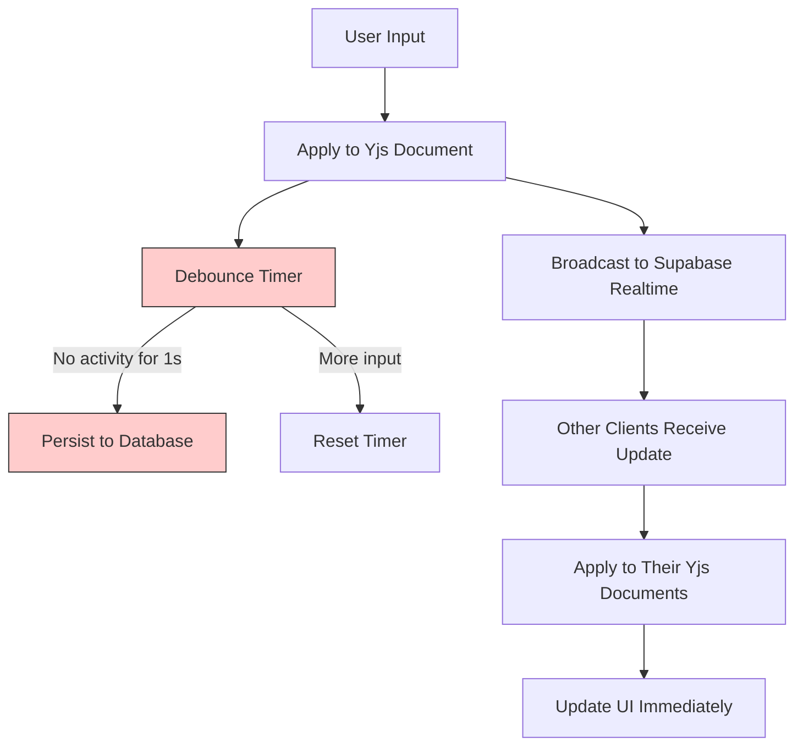
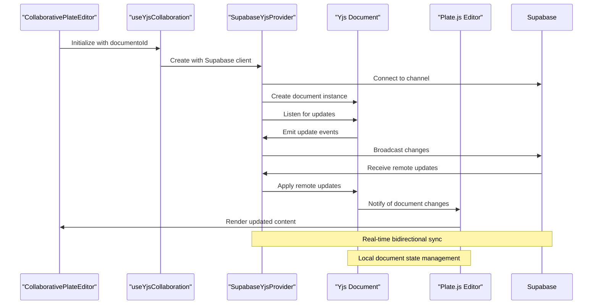

# Data Synchronization

<cite>
**Referenced Files in This Document**   
- [supabase-provider.ts](file://lib/yjs/supabase-provider.ts)
- [supabase-yjs-provider.ts](file://lib/yjs/supabase-yjs-provider.ts)
- [collaborative-plate-editor.tsx](file://components/plate/collaborative-plate-editor.tsx)
- [use-yjs-collaboration.ts](file://hooks/use-yjs-collaboration.ts)
- [client.ts](file://app/_lib/supabase.ts)
- [plate-editor.tsx](file://components/plate/plate-editor.tsx)
</cite>

## Table of Contents
1. [Introduction](#introduction)
2. [Architecture Overview](#architecture-overview)
3. [Core Components](#core-components)
4. [Transaction Flow](#transaction-flow)
5. [Conflict Detection and Resolution](#conflict-detection-and-resolution)
6. [Offline Change Management](#offline-change-management)
7. [Performance Optimization](#performance-optimization)
8. [Integration Example](#integration-example)
9. [Conclusion](#conclusion)

## Introduction

The Sinesys application implements a robust data synchronization system that enables real-time collaboration between multiple clients through Supabase realtime subscriptions. This documentation details the mechanisms by which document changes are synchronized between the frontend editor and backend, ensuring data consistency across all connected clients.

The synchronization system is built on Yjs, a CRDT (Conflict-Free Replicated Data Type) library that enables collaborative editing without merge conflicts. Yjs works in conjunction with Supabase Realtime to provide a seamless collaborative experience, allowing multiple users to edit the same document simultaneously while maintaining data integrity.

The system handles various scenarios including real-time collaboration, offline editing with queued changes, and conflict resolution strategies. It also implements performance optimizations such as debouncing updates and batch processing to ensure a responsive user experience even with high-frequency changes.

**Section sources**
- [supabase-provider.ts](file://lib/yjs/supabase-provider.ts#L1-L251)
- [supabase-yjs-provider.ts](file://lib/yjs/supabase-yjs-provider.ts#L1-L358)

## Architecture Overview

The data synchronization architecture in Sinesys follows a client-server model with real-time capabilities enabled by Supabase Realtime. The system consists of three main layers: the frontend editor, the synchronization layer, and the backend persistence layer.

**Diagram sources**
- [supabase-provider.ts](file://lib/yjs/supabase-provider.ts#L1-L251)
- [supabase-yjs-provider.ts](file://lib/yjs/supabase-yjs-provider.ts#L1-L358)

The architecture leverages Supabase's realtime capabilities to broadcast document changes between clients. When a user makes changes to a document, these changes are first applied to the local Yjs document, then broadcast to other connected clients through Supabase Realtime channels. The Yjs CRDT ensures that all clients eventually converge to the same state, regardless of the order in which changes are received.

The system also implements presence tracking, allowing users to see which colleagues are currently viewing or editing the same document. This is achieved through Supabase's presence functionality, which maintains a list of connected clients for each document channel.

**Section sources**
- [supabase-provider.ts](file://lib/yjs/supabase-provider.ts#L1-L251)
- [supabase-yjs-provider.ts](file://lib/yjs/supabase-yjs-provider.ts#L1-L358)

## Core Components

The data synchronization system in Sinesys consists of several core components that work together to provide a seamless collaborative editing experience. The primary components include the SupabaseProvider, SupabaseYjsProvider, and the collaborative editor integration.

The SupabaseProvider is a custom implementation that extends Yjs's Observable class to create a bidirectional communication channel between the Yjs document and Supabase Realtime. It handles the connection to Supabase channels, broadcasts local changes to other clients, and applies remote changes to the local document. The provider also manages connection state, synchronization status, and error handling.

**Diagram sources**
- [supabase-provider.ts](file://lib/yjs/supabase-provider.ts#L44-L251)
- [supabase-yjs-provider.ts](file://lib/yjs/supabase-yjs-provider.ts#L78-L357)

The SupabaseYjsProvider implements the UnifiedProvider interface expected by @platejs/yjs, allowing it to integrate seamlessly with the Plate.js editor. This provider adds additional functionality such as user awareness (for showing cursors and presence) and implements the specific event handling required by the Plate.js integration.

Both providers implement similar core functionality but serve different purposes in the architecture. The SupabaseProvider is a lower-level implementation that handles the basic synchronization mechanics, while the SupabaseYjsProvider is a higher-level wrapper that provides additional features specifically for the Plate.js editor integration.

**Section sources**
- [supabase-provider.ts](file://lib/yjs/supabase-provider.ts#L44-L251)
- [supabase-yjs-provider.ts](file://lib/yjs/supabase-yjs-provider.ts#L78-L357)

## Transaction Flow

The transaction flow from user input to database persistence in Sinesys follows a well-defined sequence of operations that ensures data consistency and integrity. When a user makes changes to a document in the editor, these changes are processed through multiple layers before being persisted to the database.

**Diagram sources**
- [supabase-provider.ts](file://lib/yjs/supabase-provider.ts#L124-L131)
- [collaborative-plate-editor.tsx](file://components/plate/collaborative-plate-editor.tsx#L72-L186)
- [use-yjs-collaboration.ts](file://hooks/use-yjs-collaboration.ts#L66-L200)

The flow begins when a user interacts with the document editor, making changes to the content. These changes are immediately applied to the local Yjs document, which serves as the source of truth for the client. The Yjs document then emits an 'update' event, which is captured by the SupabaseProvider.

The provider converts the Yjs update to a JSON-safe format (converting Uint8Array to a regular array) and broadcasts it to other clients through the Supabase Realtime channel. The channel is configured with `self: false` to prevent the originating client from receiving its own messages, avoiding infinite loops.

When other clients receive the update, their SupabaseProvider applies it to their local Yjs document using `Y.applyUpdate()`, with the provider instance as the origin parameter to prevent re-broadcasting. This ensures that changes are propagated to all connected clients while maintaining the integrity of the CRDT.

After a debounced period, the changes are persisted to the PostgreSQL database through standard API calls. The database persistence triggers Supabase's Change Data Capture (CDC) system, which can notify other parts of the application of the changes, creating a complete synchronization loop.

**Section sources**
- [supabase-provider.ts](file://lib/yjs/supabase-provider.ts#L124-L148)
- [collaborative-plate-editor.tsx](file://components/plate/collaborative-plate-editor.tsx#L72-L186)

## Conflict Detection and Resolution

Sinesys employs a sophisticated conflict detection and resolution strategy based on Yjs's CRDT implementation, which inherently handles concurrent edits without conflicts. The system leverages Yjs's operational transformation capabilities to ensure that all clients eventually converge to the same state, regardless of the order in which changes are received.

Yjs uses a sequence-based approach where each character or element in the document has a unique identifier that includes the client ID and a logical clock. When multiple clients edit the same document simultaneously, Yjs automatically resolves conflicts by determining the correct order of operations based on these identifiers. This approach ensures that inserts, deletes, and formatting changes are applied consistently across all clients.

**Diagram sources**
- [supabase-provider.ts](file://lib/yjs/supabase-provider.ts#L192-L200)
- [supabase-yjs-provider.ts](file://lib/yjs/supabase-yjs-provider.ts#L243-L249)

The conflict resolution process is transparent to the end user and happens automatically in the background. When a client receives a remote update, the SupabaseProvider applies it to the local Yjs document using `Y.applyUpdate()` with the provider as the origin parameter. This prevents the update from triggering another broadcast, avoiding infinite loops.

For more complex conflicts, such as simultaneous edits to the same paragraph, Yjs uses a combination of sequence numbers and client identifiers to determine the correct order of operations. The system maintains a version vector that tracks the state of each client, allowing it to detect and resolve causality conflicts.

The implementation also includes a sync negotiation protocol to handle cases where clients connect at different times or experience network interruptions. When a new client connects, it requests the current state from existing clients by sending a 'yjs-sync-request' message. Existing clients respond with a complete state snapshot, allowing the new client to quickly synchronize with the current document state.

**Section sources**
- [supabase-provider.ts](file://lib/yjs/supabase-provider.ts#L153-L169)
- [supabase-yjs-provider.ts](file://lib/yjs/supabase-yjs-provider.ts#L255-L271)

## Offline Change Management

The Sinesys application implements robust offline change management to ensure users can continue working even when disconnected from the network. The system queues local changes and synchronizes them with the backend when connectivity is restored, maintaining data integrity throughout the process.

**Diagram sources**
- [use-yjs-collaboration.ts](file://hooks/use-yjs-collaboration.ts#L98-L110)
- [supabase-provider.ts](file://lib/yjs/supabase-provider.ts#L225-L240)

The offline capability is implemented using Yjs's IndexeddbPersistence extension, which automatically persists the document state to the browser's IndexedDB. When the `useYjsCollaboration` hook is initialized with `enableLocalPersistence` set to true, it creates an IndexeddbPersistence instance that synchronizes the Yjs document with local storage.

During offline periods, all user changes are applied to the local Yjs document and automatically saved to IndexedDB. The SupabaseProvider detects the disconnection and stops attempting to broadcast updates. When network connectivity is restored, the provider automatically reconnects to the Supabase channel and resumes synchronization.

The reconnection process includes a sync negotiation phase where the client requests the current state from other connected clients. If no other clients are present, the client assumes it has the most up-to-date state and proceeds to broadcast its changes. This ensures that offline changes are not lost and are properly integrated with any changes made by other users during the offline period.

The system also handles the case where multiple clients have been offline simultaneously. When they reconnect, their changes are merged using Yjs's CRDT algorithms, ensuring that all edits are preserved and conflicts are resolved according to the established rules.

**Section sources**
- [use-yjs-collaboration.ts](file://hooks/use-yjs-collaboration.ts#L98-L110)
- [supabase-provider.ts](file://lib/yjs/supabase-provider.ts#L225-L240)

## Performance Optimization

Sinesys implements several performance optimization techniques to ensure a responsive user experience, particularly when handling high-frequency changes in collaborative editing scenarios. The primary optimizations include debouncing updates and efficient change batching.

The system uses debouncing to reduce the frequency of database persistence operations. Instead of saving every keystroke to the database, changes are accumulated and saved after a short delay (typically 1-2 seconds of inactivity). This significantly reduces database load while still providing near-real-time persistence.

**Diagram sources**
- [collaborative-plate-editor.tsx](file://components/plate/collaborative-plate-editor.tsx#L160-L165)
- [use-debounce.ts](file://app/_lib/hooks/use-debounce.ts#L1-L25)

The debouncing mechanism is implemented using a custom hook that delays the execution of the persistence function. When a change occurs, the hook starts a timer. If another change occurs before the timer expires, the timer is reset. Only when the timer completes without interruption does the persistence operation occur.

For real-time collaboration, changes are broadcast immediately through Supabase Realtime, ensuring that other users see updates with minimal latency. This separation of concerns—immediate broadcast for collaboration and debounced persistence for database writes—provides the best of both worlds: real-time collaboration without overwhelming the database.

The system also optimizes network usage by batching multiple small changes into single messages when possible. Yjs naturally compresses sequences of operations, and the SupabaseProvider transmits these compressed updates efficiently. Additionally, the provider is configured to avoid sending updates back to the originating client (`self: false`), reducing unnecessary network traffic.

These optimizations ensure that the editor remains responsive even with frequent typing, while maintaining data integrity and minimizing server load.

**Section sources**
- [collaborative-plate-editor.tsx](file://components/plate/collaborative-plate-editor.tsx#L160-L165)
- [use-debounce.ts](file://app/_lib/hooks/use-debounce.ts#L1-L25)

## Integration Example

The integration between the frontend editor and the synchronization layer is exemplified in the `CollaborativePlateEditor` component, which combines Plate.js, Yjs, and Supabase Realtime into a cohesive collaborative editing experience.

**Diagram sources**
- [collaborative-plate-editor.tsx](file://components/plate/collaborative-plate-editor.tsx#L72-L186)
- [supabase-yjs-provider.ts](file://lib/yjs/supabase-yjs-provider.ts#L78-L357)

The `CollaborativePlateEditor` component accepts a `documentoId` prop that identifies the document being edited. During initialization, it creates a Supabase client and uses it to instantiate a `SupabaseYjsProvider` with the document ID. The provider establishes a connection to a Supabase Realtime channel named `yjs-doc-{documentoId}`.

The component then configures the Plate.js editor with Yjs plugins, passing the Yjs document and provider as options. This integration allows Plate.js to use Yjs as its underlying data model, with all editing operations translated into Yjs updates.

When users make changes, the Plate.js editor applies them to the Yjs document, which triggers the provider to broadcast the changes to other clients. Remote changes are received through the Supabase channel, applied to the local Yjs document, and automatically reflected in the Plate.js editor interface.

The component also handles user presence information, displaying cursors and avatars for other connected users. This is achieved through the awareness functionality in Yjs, which tracks user information and shares it across clients via the Supabase channel.

**Section sources**
- [collaborative-plate-editor.tsx](file://components/plate/collaborative-plate-editor.tsx#L72-L186)
- [plate-editor.tsx](file://components/plate/plate-editor.tsx#L1-L600)

## Conclusion

The data synchronization system in Sinesys provides a robust foundation for real-time collaborative editing through the integration of Yjs, Supabase Realtime, and Plate.js. By leveraging CRDT technology, the system ensures that multiple users can edit the same document simultaneously without conflicts, with all changes eventually converging to a consistent state.

The architecture effectively separates concerns between real-time collaboration (handled by Yjs and Supabase Realtime) and persistent storage (handled by PostgreSQL), optimizing performance and reliability. Offline capabilities ensure uninterrupted workflow, with changes automatically synchronized when connectivity is restored.

Performance optimizations such as debouncing and efficient change batching provide a responsive user experience while minimizing server load. The modular design allows for easy maintenance and extension, with clear separation between the synchronization layer and the editor interface.

This implementation demonstrates a modern approach to collaborative editing that balances real-time responsiveness with data integrity, providing users with a seamless and reliable editing experience regardless of network conditions or concurrent editing scenarios.