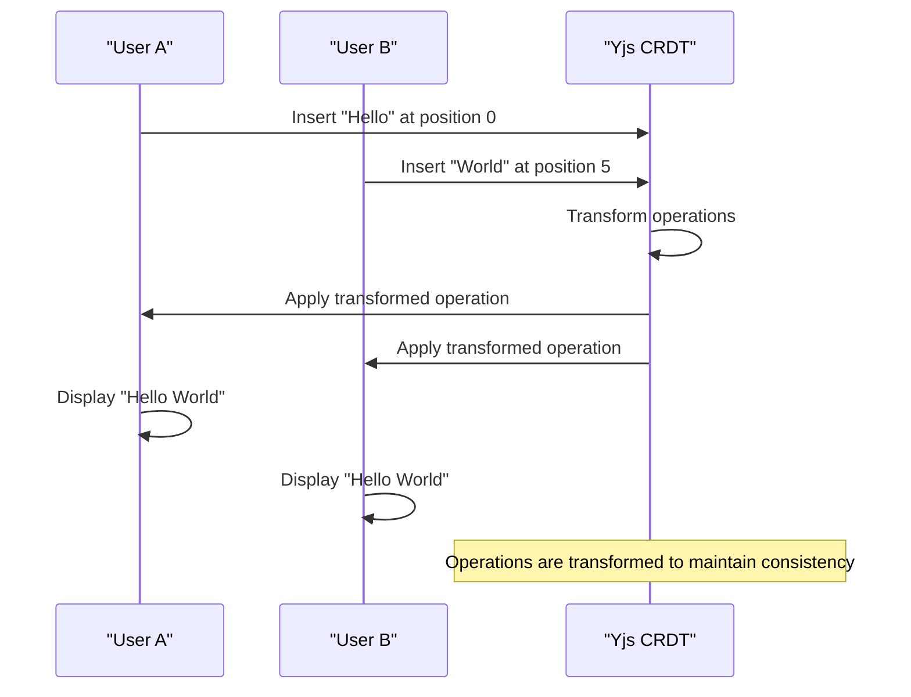
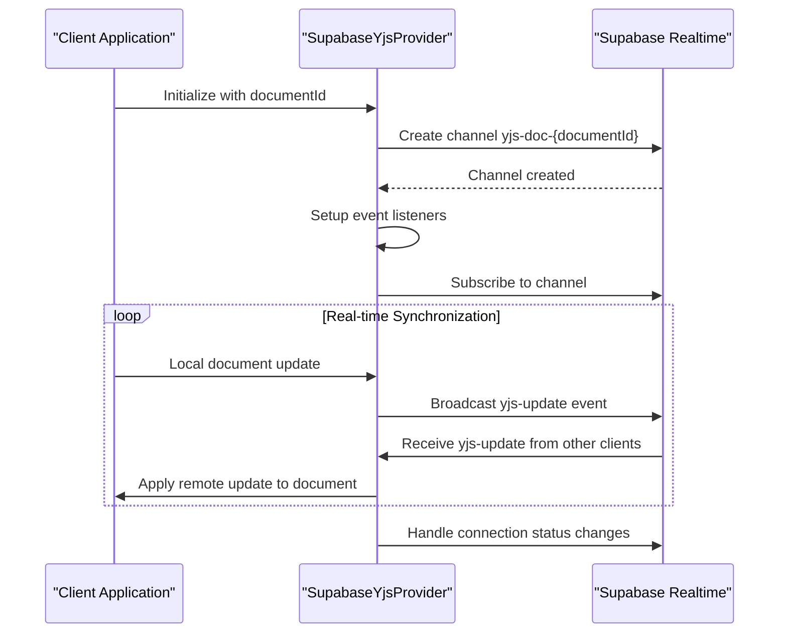
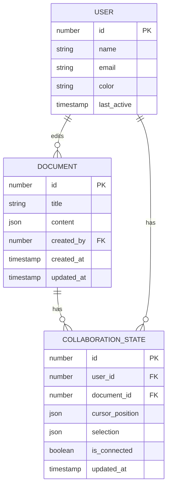
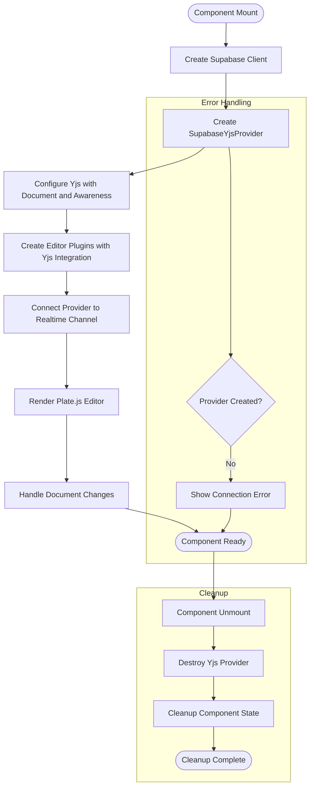
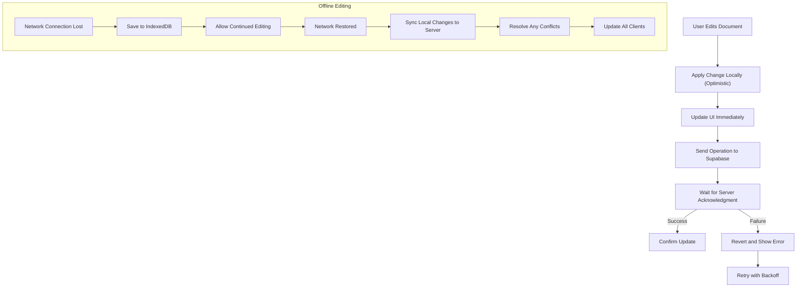
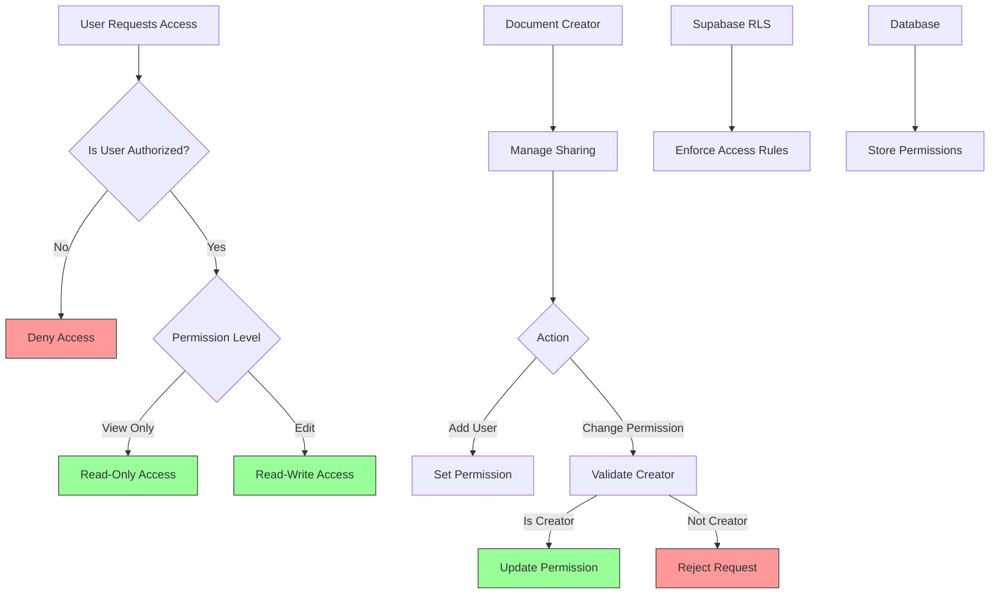

# Real-time Collaboration

<cite>
**Referenced Files in This Document**   
- [yjs-kit.tsx](file://components/plate/yjs-kit.tsx)
- [collaborative-plate-editor.tsx](file://components/plate/collaborative-plate-editor.tsx)
- [supabase-yjs-provider.ts](file://lib/yjs/supabase-yjs-provider.ts)
- [use-yjs-collaboration.ts](file://hooks/use-yjs-collaboration.ts)
- [use-realtime-collaboration.ts](file://hooks/use-realtime-collaboration.ts)
- [use-realtime-presence-room.ts](file://hooks/use-realtime-presence-room.ts)
- [use-realtime-cursors.ts](file://hooks/use-realtime-cursors.ts)
- [document-editor.tsx](file://components/documentos/document-editor.tsx)
- [supabase-provider.ts](file://lib/yjs/supabase-provider.ts)
- [client.ts](file://lib/client.ts)
- [atualizar-permissao.service.ts](file://backend/documentos/services/compartilhamento/atualizar-permissao.service.ts)
</cite>

## Table of Contents
1. [Introduction](#introduction)
2. [Architecture Overview](#architecture-overview)
3. [Operational Transformation with Yjs](#operational-transformation-with-yjs)
4. [Supabase Integration](#supabase-integration)
5. [Data Model for Collaboration](#data-model-for-collaboration)
6. [Collaborative Editor Implementation](#collaborative-editor-implementation)
7. [Performance Considerations](#performance-considerations)
8. [Security Model](#security-model)
9. [Conclusion](#conclusion)

## Introduction
The Sinesys real-time collaboration system enables multiple users to simultaneously edit legal documents through a robust implementation of Yjs for operational transformation and Supabase for persistent data synchronization. This documentation details the architecture, implementation, and security model of the collaborative editing system, focusing on how concurrent document editing is managed, user presence is tracked, and editing conflicts are resolved. The system provides a seamless experience for legal professionals working on documents together, with features for tracking cursor positions, managing user permissions, and ensuring data consistency across clients.

## Architecture Overview
The real-time collaboration system in Sinesys follows a client-server architecture with Yjs handling operational transformation on the client side and Supabase providing the real-time communication layer. The system is designed to enable multiple users to edit the same document simultaneously while maintaining data consistency and resolving conflicts automatically.

```mermaid
graph TD
subgraph "Client"
A[Plate.js Editor] --> B[Yjs Document]
B --> C[SupabaseYjsProvider]
C --> D[Supabase Realtime]
E[User Presence] --> C
F[Cursor Tracking] --> C
end
subgraph "Server"
D --> G[Supabase Database]
G --> H[Document Storage]
I[Access Control] --> G
end
D < --> J[Other Clients]
style A fill:#f9f,stroke:#333
style B fill:#bbf,stroke:#333
style C fill:#f96,stroke:#333
style D fill:#6f9,stroke:#333
```

**Diagram sources**
- [collaborative-plate-editor.tsx](file://components/plate/collaborative-plate-editor.tsx)
- [supabase-yjs-provider.ts](file://lib/yjs/supabase-yjs-provider.ts)
- [document-editor.tsx](file://components/documentos/document-editor.tsx)

**Section sources**
- [collaborative-plate-editor.tsx](file://components/plate/collaborative-plate-editor.tsx)
- [supabase-yjs-provider.ts](file://lib/yjs/supabase-yjs-provider.ts)

## Operational Transformation with Yjs
The Sinesys system implements operational transformation using Yjs, a CRDT-based framework that enables conflict-free real-time collaboration. The implementation is centered around the `yjs-kit.tsx` and `collaborative-plate-editor.tsx` components, which integrate Yjs with the Plate.js rich text editor.

The system uses Yjs to manage document state as a shared data type, allowing multiple clients to make changes simultaneously without conflicts. Each user's edits are transformed into operations that are broadcast to other clients, where they are applied in a way that maintains document consistency. The implementation handles various types of edits including text insertion, deletion, formatting changes, and structural modifications to the document.



**Diagram sources**
- [yjs-kit.tsx](file://components/plate/yjs-kit.tsx)
- [collaborative-plate-editor.tsx](file://components/plate/collaborative-plate-editor.tsx)

**Section sources**
- [yjs-kit.tsx](file://components/plate/yjs-kit.tsx)
- [collaborative-plate-editor.tsx](file://components/plate/collaborative-plate-editor.tsx)

## Supabase Integration
The integration with Supabase is implemented through the `supabase-yjs-provider.ts` file, which creates a custom provider that connects Yjs with Supabase Realtime. This provider handles the bidirectional synchronization of document updates between clients through Supabase's real-time channels.

The SupabaseYjsProvider class implements the UnifiedProvider interface expected by @platejs/yjs, enabling seamless integration with the Plate.js editor. It establishes a connection to a Supabase Realtime channel specific to each document, identified by the document ID. The provider manages the lifecycle of the connection, including setup, disconnection, and error handling.



**Diagram sources**
- [supabase-yjs-provider.ts](file://lib/yjs/supabase-yjs-provider.ts)
- [client.ts](file://lib/client.ts)

**Section sources**
- [supabase-yjs-provider.ts](file://lib/yjs/supabase-yjs-provider.ts)
- [client.ts](file://lib/client.ts)

## Data Model for Collaboration
The data model for tracking user presence, cursor positions, and editing conflicts is implemented through a combination of Yjs awareness features and Supabase Realtime presence tracking. The system maintains information about all users currently viewing or editing a document, their cursor positions, and selection states.

The collaboration data model includes:
- User presence information (user ID, name, color)
- Cursor position (path and offset in the document)
- Selection state (anchor and focus points)
- Last active timestamp
- Connection status



**Diagram sources**
- [use-realtime-collaboration.ts](file://hooks/use-realtime-collaboration.ts)
- [use-realtime-presence-room.ts](file://hooks/use-realtime-presence-room.ts)
- [use-realtime-cursors.ts](file://hooks/use-realtime-cursors.ts)

**Section sources**
- [use-realtime-collaboration.ts](file://hooks/use-realtime-collaboration.ts)
- [use-realtime-presence-room.ts](file://hooks/use-realtime-presence-room.ts)
- [use-realtime-cursors.ts](file://hooks/use-realtime-cursors.ts)

## Collaborative Editor Implementation
The collaborative editor is implemented in the `collaborative-plate-editor.tsx` component, which integrates the Plate.js rich text editor with Yjs for real-time collaboration. The component handles the initialization of the Yjs provider, connection to Supabase Realtime, and management of the collaborative editing session.

The implementation follows a structured approach:
1. Initialize the Supabase client for authentication and real-time communication
2. Create a Yjs document and awareness instance for the current document
3. Establish a connection to the Supabase Realtime channel for the document
4. Configure the Plate.js editor with Yjs plugins for collaborative editing
5. Handle connection status changes and synchronization events
6. Manage cleanup when the component is unmounted



**Diagram sources**
- [collaborative-plate-editor.tsx](file://components/plate/collaborative-plate-editor.tsx)
- [document-editor.tsx](file://components/documentos/document-editor.tsx)

**Section sources**
- [collaborative-plate-editor.tsx](file://components/plate/collaborative-plate-editor.tsx)
- [document-editor.tsx](file://components/documentos/document-editor.tsx)

## Performance Considerations
The Sinesys collaboration system addresses performance considerations for large documents, network latency, and offline editing scenarios through several mechanisms implemented in the codebase.

For large documents, the system uses Yjs's efficient CRDT implementation which only transmits operational changes rather than the entire document state. This minimizes bandwidth usage and ensures that updates are applied quickly regardless of document size. The implementation also includes debouncing for auto-save operations to prevent excessive network requests during rapid editing.

Network latency is handled through optimistic updates, where local changes are immediately reflected in the UI before being confirmed by the server. This provides a responsive editing experience even with high latency connections. The system also implements connection status indicators to inform users of their connection quality.



**Diagram sources**
- [use-yjs-collaboration.ts](file://hooks/use-yjs-collaboration.ts)
- [collaborative-plate-editor.tsx](file://components/plate/collaborative-plate-editor.tsx)

**Section sources**
- [use-yjs-collaboration.ts](file://hooks/use-yjs-collaboration.ts)
- [collaborative-plate-editor.tsx](file://components/plate/collaborative-plate-editor.tsx)

## Security Model
The security model for document sharing and access control in Sinesys is implemented through a combination of backend services and Supabase's Row Level Security (RLS) policies. The system ensures that only authorized users can access and edit documents based on their permissions.

The access control model is defined in the `atualizar-permissao.service.ts` file, which implements business logic for managing document sharing permissions. The key security principles are:
- Only the document creator can modify sharing permissions
- Users can be granted either "visualizar" (view) or "editar" (edit) permissions
- Permission changes are validated on the server side to prevent unauthorized access
- All document access is controlled through Supabase RLS policies



**Diagram sources**
- [atualizar-permissao.service.ts](file://backend/documentos/services/compartilhamento/atualizar-permissao.service.ts)
- [supabase-yjs-provider.ts](file://lib/yjs/supabase-yjs-provider.ts)

**Section sources**
- [atualizar-permissao.service.ts](file://backend/documentos/services/compartilhamento/atualizar-permissao.service.ts)
- [supabase-yjs-provider.ts](file://lib/yjs/supabase-yjs-provider.ts)

## Conclusion
The Sinesys real-time collaboration system provides a robust solution for multiple users to simultaneously edit legal documents using Yjs for operational transformation and Supabase for persistent data synchronization. The implementation effectively handles the complexities of concurrent editing through CRDT-based conflict resolution, ensuring data consistency across all clients. The integration with Supabase Realtime provides a reliable transport layer for document updates, while the awareness features enable rich collaboration experiences with user presence and cursor tracking. The system addresses performance considerations for large documents and network latency through efficient data synchronization and optimistic updates, while maintaining a strong security model for document access control. This comprehensive approach enables legal professionals to collaborate seamlessly on documents with confidence in data integrity and security.