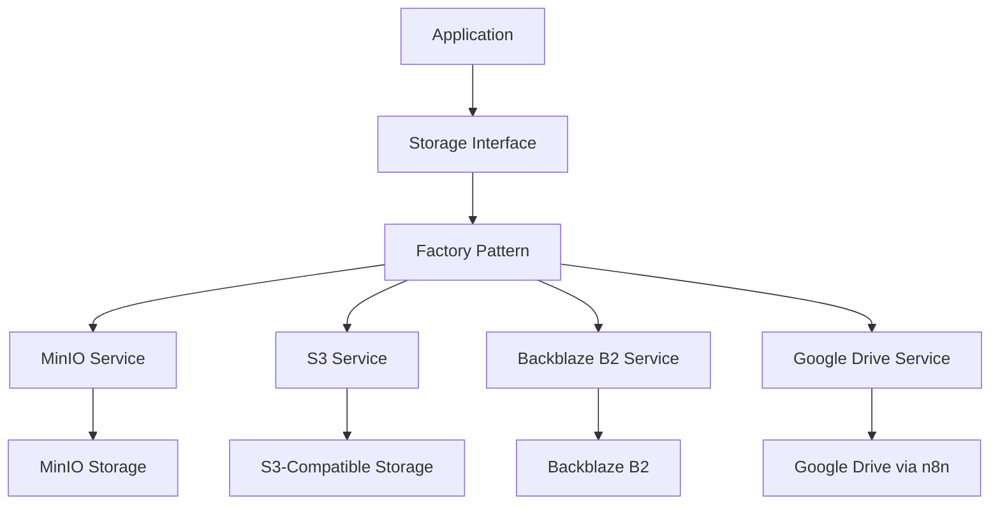
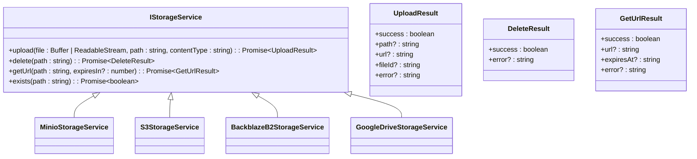
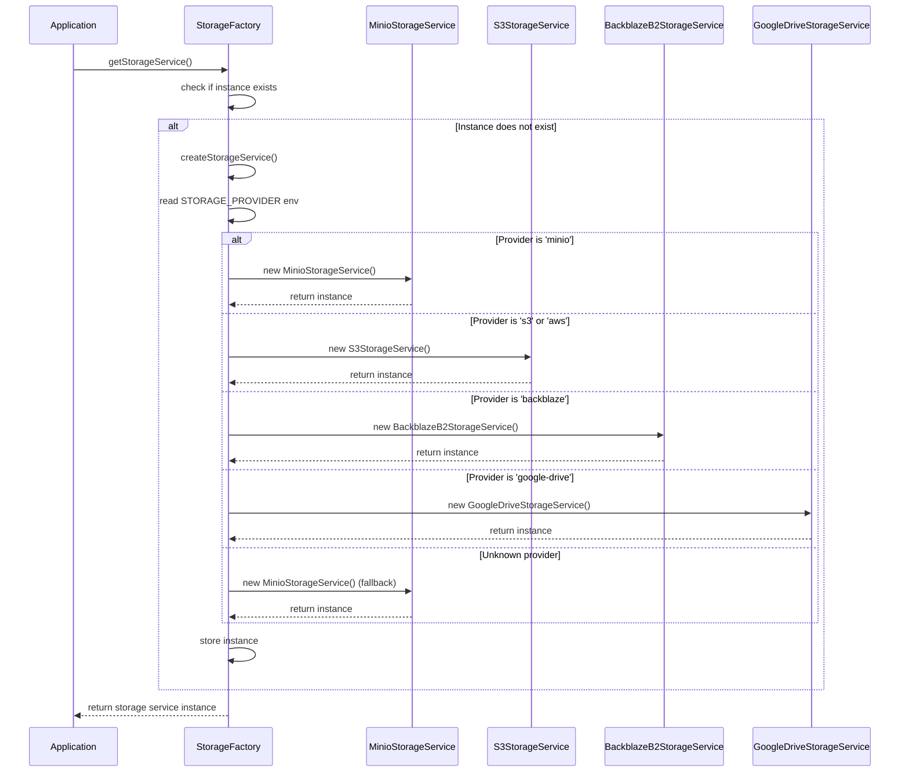
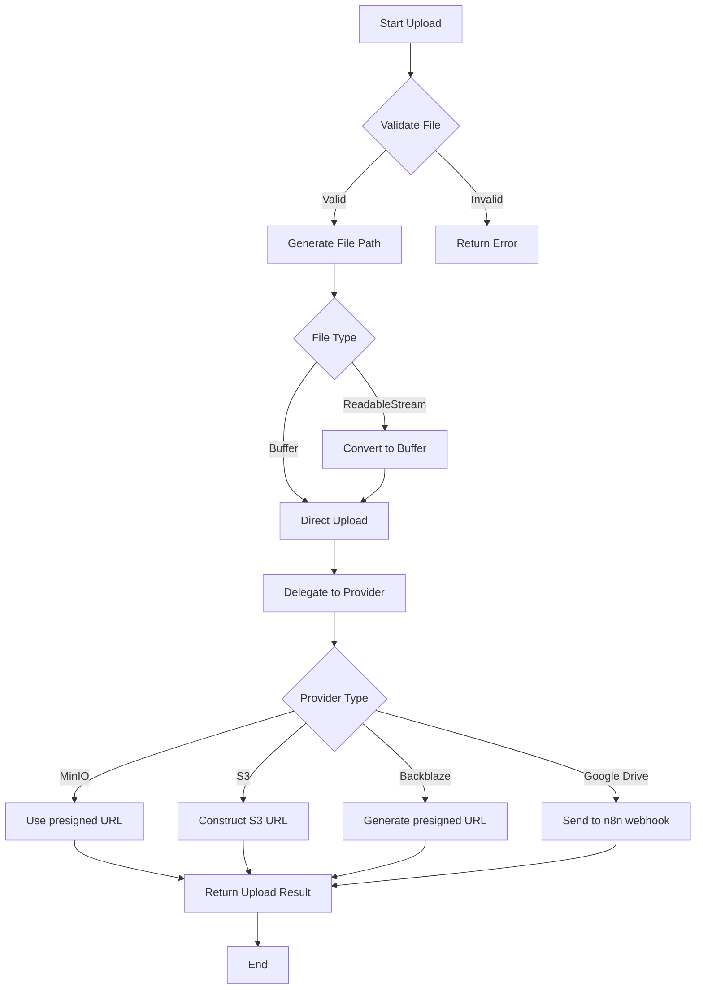

# Storage Integration

<cite>
**Referenced Files in This Document**   
- [storage-factory.ts](file://backend/acordos-condenacoes/services/storage/storage-factory.ts)
- [storage.interface.ts](file://backend/acordos-condenacoes/services/storage/storage.interface.ts)
- [minio-storage.service.ts](file://backend/acordos-condenacoes/services/storage/minio-storage.service.ts)
- [s3-storage.service.ts](file://backend/acordos-condenacoes/services/storage/s3-storage.service.ts)
- [backblaze-b2-storage.service.ts](file://backend/acordos-condenacoes/services/storage/backblaze-b2-storage.service.ts)
- [google-drive-storage.service.ts](file://backend/acordos-condenacoes/services/storage/google-drive-storage.service.ts)
- [.env.example](file://.env.example)
</cite>

## Table of Contents
1. [Introduction](#introduction)
2. [Storage Architecture Overview](#storage-architecture-overview)
3. [Storage Interface Abstraction](#storage-interface-abstraction)
4. [Storage Provider Implementations](#storage-provider-implementations)
5. [Factory Pattern Implementation](#factory-pattern-implementation)
6. [Configuration Requirements](#configuration-requirements)
7. [File Operations and Data Flow](#file-operations-and-data-flow)
8. [Error Handling and Retry Mechanisms](#error-handling-and-retry-mechanisms)
9. [Performance Considerations](#performance-considerations)
10. [Security and Data Encryption](#security-and-data-encryption)

## Introduction

The Sinesys storage integration system provides a unified interface for managing document storage across multiple cloud providers. This documentation details the architecture and implementation of the storage system that supports Backblaze B2, Google Drive, S3-compatible services, and MinIO. The system is designed to handle legal documents, particularly in the context of agreements and condemnations, with a focus on reliability, security, and performance. The core of the storage system is built around an abstraction layer that provides a consistent API regardless of the underlying storage provider, enabling seamless switching between different storage backends based on configuration.

**Section sources**
- [storage-factory.ts](file://backend/acordos-condenacoes/services/storage/storage-factory.ts#L1-L143)
- [storage.interface.ts](file://backend/acordos-condenacoes/services/storage/storage.interface.ts#L1-L91)

## Storage Architecture Overview

The storage integration system follows a modular architecture with a clear separation between the interface abstraction, provider implementations, and the factory pattern that orchestrates provider selection. At the core is the `IStorageService` interface that defines a consistent contract for all storage operations. Multiple provider-specific implementations adhere to this interface, allowing the application to interact with different storage systems through a uniform API. The factory pattern, implemented in `storage-factory.ts`, determines which provider to use based on environment variables, creating the appropriate service instance at runtime. This architecture enables the system to be flexible and configurable, supporting different storage requirements across deployment environments.

**Diagram sources **
- [storage.interface.ts](file://backend/acordos-condenacoes/services/storage/storage.interface.ts#L36-L71)
- [storage-factory.ts](file://backend/acordos-condenacoes/services/storage/storage-factory.ts#L18-L45)

**Section sources**
- [storage-factory.ts](file://backend/acordos-condenacoes/services/storage/storage-factory.ts#L1-L143)
- [storage.interface.ts](file://backend/acordos-condenacoes/services/storage/storage.interface.ts#L1-L91)

## Storage Interface Abstraction

The `IStorageService` interface defines a consistent API for all storage operations, abstracting the differences between various cloud storage providers. This interface includes methods for uploading files, deleting files, obtaining access URLs, and checking file existence. The `UploadResult`, `DeleteResult`, and `GetUrlResult` interfaces standardize the response format across all operations, ensuring predictable behavior regardless of the underlying provider. This abstraction allows the application code to interact with storage services without knowledge of the specific implementation details, promoting code reuse and simplifying maintenance. The interface is designed to handle both Buffer and ReadableStream inputs, providing flexibility in how files are processed before storage.

**Diagram sources **
- [storage.interface.ts](file://backend/acordos-condenacoes/services/storage/storage.interface.ts#L36-L71)

**Section sources**
- [storage.interface.ts](file://backend/acordos-condenacoes/services/storage/storage.interface.ts#L1-L91)

## Storage Provider Implementations

### MinIO Implementation

The `MinioStorageService` implements the `IStorageService` interface for MinIO, an S3-compatible object storage system. It uses environment variables to configure the connection parameters including endpoint, port, bucket name, and credentials. The implementation handles bucket creation if it doesn't exist and uses presigned URLs for secure file access. The service is designed to work in development and testing environments where a local MinIO instance might be used.

**Section sources**
- [minio-storage.service.ts](file://backend/acordos-condenacoes/services/storage/minio-storage.service.ts#L32-L195)

### S3 Implementation

The `S3StorageService` provides integration with AWS S3 and S3-compatible services. It supports configurable endpoints, allowing it to work with any S3-compatible storage provider. The implementation includes support for SSL configuration and region specification. While the code includes placeholders for the AWS SDK, it currently operates in mock mode, constructing URLs based on configuration without actual SDK integration.

**Section sources**
- [s3-storage.service.ts](file://backend/acordos-condenacoes/services/storage/s3-storage.service.ts#L26-L214)

### Backblaze B2 Implementation

The `BackblazeB2StorageService` implements storage functionality for Backblaze B2 using the AWS SDK v3 for S3-compatible API access. It requires specific environment variables including B2_ENDPOINT, B2_REGION, B2_BUCKET, B2_KEY_ID, and B2_APPLICATION_KEY. The implementation creates a singleton S3 client configured for Backblaze B2 and handles file uploads, deletions, and URL generation. For private buckets, it can generate presigned URLs with configurable expiration times.

**Section sources**
- [backblaze-b2-storage.service.ts](file://backend/acordos-condenacoes/services/storage/backblaze-b2-storage.service.ts#L16-L174)

### Google Drive Implementation

The `GoogleDriveStorageService` integrates with Google Drive through an n8n webhook, providing an indirect storage mechanism. Instead of direct API integration, it sends requests to a webhook endpoint that processes and stores files in Google Drive. This approach simplifies the implementation by offloading the complexity of Google Drive API authentication and operations to the webhook service. The service supports upload, delete, URL retrieval, and existence checking operations through POST requests with operation-specific payloads.

**Section sources**
- [google-drive-storage.service.ts](file://backend/acordos-condenacoes/services/storage/google-drive-storage.service.ts#L26-L195)

## Factory Pattern Implementation

The storage factory pattern, implemented in `storage-factory.ts`, provides a mechanism for creating the appropriate storage service instance based on configuration. The `createStorageService()` function reads the `STORAGE_PROVIDER` environment variable to determine which provider to use, with 'minio' as the default. The factory supports multiple provider options including 'minio', 's3', 'aws', 'backblaze', and 'google-drive'. It also includes fallback mechanisms for unknown or unimplemented providers, defaulting to MinIO when necessary. The factory also implements a singleton pattern through `getStorageService()`, ensuring that only one instance of the storage service is created and reused throughout the application lifecycle.

**Diagram sources **
- [storage-factory.ts](file://backend/acordos-condenacoes/services/storage/storage-factory.ts#L18-L45)

**Section sources**
- [storage-factory.ts](file://backend/acordos-condenacoes/services/storage/storage-factory.ts#L1-L143)

## Configuration Requirements

The storage system relies on environment variables for configuration, allowing different settings for various deployment environments. Each storage provider has specific configuration requirements:

For Backblaze B2, the following environment variables are required:
- `STORAGE_PROVIDER`: Must be set to 'backblaze'
- `B2_ENDPOINT`: The Backblaze B2 API endpoint URL
- `B2_REGION`: The region identifier for the Backblaze B2 account
- `B2_BUCKET`: The name of the bucket to use for storage
- `B2_KEY_ID`: The Backblaze B2 key identifier
- `B2_APPLICATION_KEY`: The Backblaze B2 application key

For Google Drive integration via n8n:
- `STORAGE_PROVIDER`: Must be set to 'google-drive'
- `GOOGLE_DRIVE_WEBHOOK_URL`: The webhook URL for the n8n workflow
- `GOOGLE_DRIVE_WEBHOOK_TOKEN`: Optional authorization token for the webhook

For S3-compatible services:
- `STORAGE_PROVIDER`: Set to 's3' or 'aws'
- `STORAGE_BUCKET`: The S3 bucket name
- `STORAGE_ACCESS_KEY`: AWS access key ID
- `STORAGE_SECRET_KEY`: AWS secret access key
- `STORAGE_REGION`: AWS region (e.g., 'us-east-1')
- `STORAGE_ENDPOINT`: Optional custom endpoint for S3-compatible services

The system defaults to MinIO when no provider is specified or when an unknown provider is configured.

**Section sources**
- [.env.example](file://.env.example#L34-L45)
- [storage-factory.ts](file://backend/acordos-condenacoes/services/storage/storage-factory.ts#L14-L15)
- [backblaze-b2-storage.service.ts](file://backend/acordos-condenacoes/services/storage/backblaze-b2-storage.service.ts#L22-L27)

## File Operations and Data Flow

The storage system handles file operations through a standardized process that is consistent across all providers. When uploading a file, the system first validates the file format and size using utility functions in the storage factory. The `generateFilePath()` function creates a unique path for the file based on the agreement ID, installment ID, file type, and timestamp, ensuring organized storage and preventing naming conflicts. The upload process converts ReadableStream inputs to Buffer format when necessary, then delegates to the provider-specific implementation. For download operations, the system generates access URLs that may be permanent (for public buckets) or temporary presigned URLs (for private buckets). The data flow is designed to handle large legal documents efficiently, with streaming support to minimize memory usage during transfer.

**Diagram sources **
- [storage-factory.ts](file://backend/acordos-condenacoes/services/storage/storage-factory.ts#L81-L90)
- [backblaze-b2-storage.service.ts](file://backend/acordos-condenacoes/services/storage/backblaze-b2-storage.service.ts#L78-L116)

**Section sources**
- [storage-factory.ts](file://backend/acordos-condenacoes/services/storage/storage-factory.ts#L73-L90)
- [backblaze-b2-storage.service.ts](file://backend/acordos-condenacoes/services/storage/backblaze-b2-storage.service.ts#L78-L116)

## Error Handling and Retry Mechanisms

The storage system implements comprehensive error handling to ensure reliability when interacting with external storage services. Each provider implementation includes try-catch blocks around API calls, with detailed error logging and standardized error responses. When a storage service is unavailable or returns an error, the system provides meaningful error messages that can be used for troubleshooting. The architecture supports fallback strategies, with the factory pattern defaulting to MinIO when other providers are not properly configured. While the current implementation does not include automated retry logic, the consistent error response format enables external systems to implement retry mechanisms based on the success flag and error messages returned by storage operations.

**Section sources**
- [backblaze-b2-storage.service.ts](file://backend/acordos-condenacoes/services/storage/backblaze-b2-storage.service.ts#L117-L121)
- [minio-storage.service.ts](file://backend/acordos-condenacoes/services/storage/minio-storage.service.ts#L119-L125)
- [s3-storage.service.ts](file://backend/acordos-condenacoes/services/storage/s3-storage.service.ts#L107-L113)

## Performance Considerations

The storage integration system is designed with performance considerations for handling large legal documents. The use of streaming interfaces (ReadableStream) allows for efficient memory usage when processing large files, as data can be transferred in chunks without loading the entire file into memory. The system minimizes the number of round trips to storage services by combining operations where possible. For example, the upload operation both stores the file and generates an access URL in a single flow. The singleton pattern for storage service instances reduces initialization overhead, and the connection configuration is reused across operations. When transferring large documents, the system benefits from the underlying provider's optimization for large file handling, particularly with S3-compatible services like Backblaze B2 that are designed for high-throughput object storage.

**Section sources**
- [backblaze-b2-storage.service.ts](file://backend/acordos-condenacoes/services/storage/backblaze-b2-storage.service.ts#L56-L67)
- [minio-storage.service.ts](file://backend/acordos-condenacoes/services/storage/minio-storage.service.ts#L60-L71)

## Security and Data Encryption

The storage system incorporates several security measures to protect sensitive legal documents. Authentication is handled through provider-specific credentials stored in environment variables, preventing hardcoded secrets in the source code. For private storage buckets, the system uses presigned URLs with configurable expiration times to provide temporary access to files without making the entire bucket public. The Google Drive implementation adds an additional layer of security by routing requests through a webhook service, which can implement additional authentication and validation. File paths are sanitized to prevent directory traversal attacks, and file formats are validated against an allowed list to prevent the upload of potentially malicious file types. The system follows the principle of least privilege, with storage credentials having only the necessary permissions for the required operations.

**Section sources**
- [backblaze-b2-storage.service.ts](file://backend/acordos-condenacoes/services/storage/backblaze-b2-storage.service.ts#L165-L193)
- [storage-factory.ts](file://backend/acordos-condenacoes/services/storage/storage-factory.ts#L99-L106)
- [google-drive-storage.service.ts](file://backend/acordos-condenacoes/services/storage/google-drive-storage.service.ts#L47-L49)