# Document Editor Components

<cite>
**Referenced Files in This Document**   
- [plate-editor.tsx](file://components/plate/plate-editor.tsx)
- [collaborative-plate-editor.tsx](file://components/plate/collaborative-plate-editor.tsx)
- [yjs-kit.tsx](file://components/plate/yjs-kit.tsx)
- [editor-kit.tsx](file://components/plate/editor-kit.tsx)
- [basic-blocks-kit.tsx](file://components/plate/basic-blocks-kit.tsx)
- [table-kit.tsx](file://components/plate/table-kit.tsx)
- [media-kit.tsx](file://components/plate/media-kit.tsx)
- [math-kit.tsx](file://components/plate/math-kit.tsx)
- [supabase-yjs-provider.ts](file://lib/yjs/supabase-yjs-provider.ts)
- [plate-types.ts](file://components/plate/plate-types.ts)
- [fixed-toolbar-kit.tsx](file://components/plate/fixed-toolbar-kit.tsx)
- [floating-toolbar-kit.tsx](file://components/plate/floating-toolbar-kit.tsx)
- [list-kit.tsx](file://components/plate/list-kit.tsx)
- [link-kit.tsx](file://components/plate/link-kit.tsx)
- [code-block-kit.tsx](file://components/plate/code-block-kit.tsx)
- [mention-kit.tsx](file://components/plate/mention-kit.tsx)
</cite>

## Table of Contents
1. [Introduction](#introduction)
2. [Core Architecture](#core-architecture)
3. [Editor Kits and Configuration](#editor-kits-and-configuration)
4. [Collaborative Editing Implementation](#collaborative-editing-implementation)
5. [Real-time Synchronization with Yjs](#real-time-synchronization-with-yjs)
6. [Document Collaboration Features](#document-collaboration-features)
7. [Performance Considerations](#performance-considerations)
8. [Supabase Integration](#supabase-integration)
9. [Usage Examples](#usage-examples)
10. [Conclusion](#conclusion)

## Introduction

The Sinesys Document Editor Components provide a comprehensive rich text editing solution built on the Plate framework. This documentation details the implementation of a collaborative editor with real-time synchronization capabilities, various editor kits for different content types, and integration with Supabase for document persistence. The system enables multiple users to edit documents simultaneously with presence indicators, cursor sharing, and conflict resolution through CRDT-based synchronization.

**Section sources**
- [plate-editor.tsx](file://components/plate/plate-editor.tsx)
- [collaborative-plate-editor.tsx](file://components/plate/collaborative-plate-editor.tsx)

## Core Architecture

The document editor architecture is built around the Plate framework, which provides a modular system for rich text editing. The core components include the plate-editor for basic editing functionality and the collaborative-plate-editor for real-time collaboration features. The architecture follows a plugin-based design where different editor kits can be composed to create customized editing experiences.

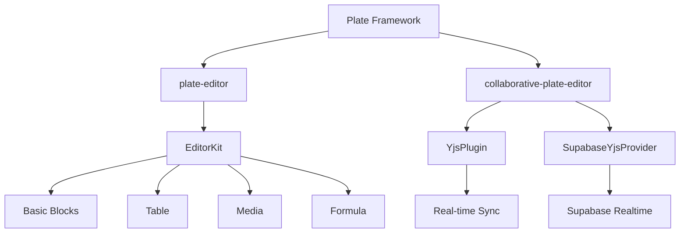

**Diagram sources**
- [plate-editor.tsx](file://components/plate/plate-editor.tsx)
- [collaborative-plate-editor.tsx](file://components/plate/collaborative-plate-editor.tsx)
- [editor-kit.tsx](file://components/plate/editor-kit.tsx)

**Section sources**
- [plate-editor.tsx](file://components/plate/plate-editor.tsx)
- [collaborative-plate-editor.tsx](file://components/plate/collaborative-plate-editor.tsx)
- [editor-kit.tsx](file://components/plate/editor-kit.tsx)

## Editor Kits and Configuration

The editor functionality is organized into modular kits that can be combined to create customized editing experiences. Each kit provides specific editing capabilities and can be configured independently.

### Basic Blocks Kit

The basic-blocks-kit provides fundamental text formatting elements including headings, paragraphs, blockquotes, and horizontal rules. It supports keyboard shortcuts for quick formatting and integrates with the Plate framework's node system.

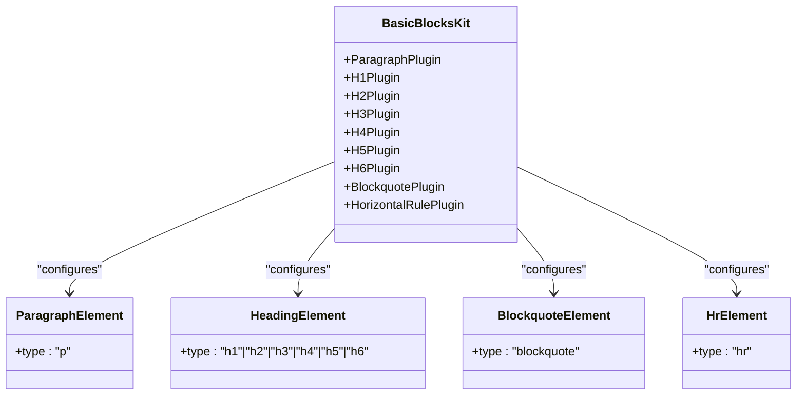

**Diagram sources**
- [basic-blocks-kit.tsx](file://components/plate/basic-blocks-kit.tsx)
- [plate-types.ts](file://components/plate/plate-types.ts)

### Table Kit

The table-kit implements table editing functionality with support for cells, headers, rows, and complete tables. It provides a structured way to create and edit tabular data within the document.

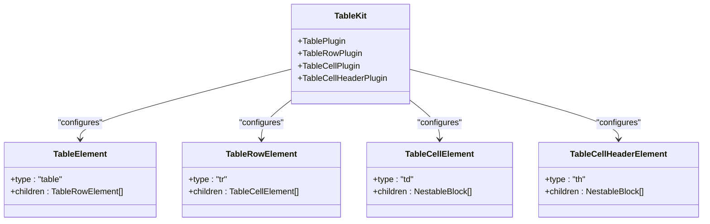

**Diagram sources**
- [table-kit.tsx](file://components/plate/table-kit.tsx)
- [plate-types.ts](file://components/plate/plate-types.ts)

### Media Kit

The media-kit enables embedding various media types including images, videos, audio files, and embedded content. It also supports captions and file uploads with preview functionality.

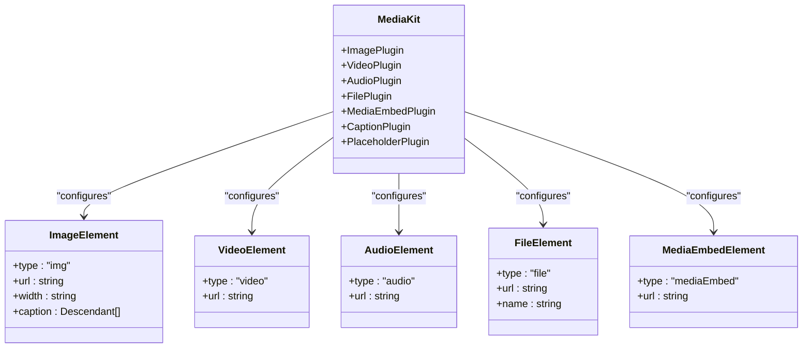

**Diagram sources**
- [media-kit.tsx](file://components/plate/media-kit.tsx)
- [plate-types.ts](file://components/plate/plate-types.ts)

### Formula Kit

The math-kit provides support for mathematical expressions and equations, both inline and block-level. It enables users to create complex mathematical content within the document.

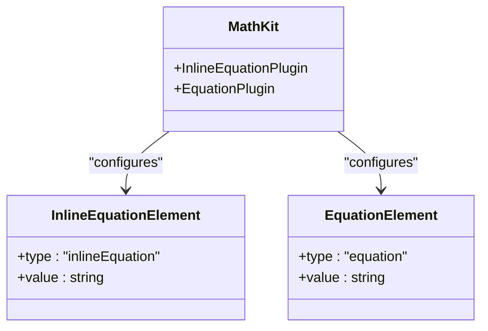

**Diagram sources**
- [math-kit.tsx](file://components/plate/math-kit.tsx)
- [plate-types.ts](file://components/plate/plate-types.ts)

**Section sources**
- [basic-blocks-kit.tsx](file://components/plate/basic-blocks-kit.tsx)
- [table-kit.tsx](file://components/plate/table-kit.tsx)
- [media-kit.tsx](file://components/plate/media-kit.tsx)
- [math-kit.tsx](file://components/plate/math-kit.tsx)

## Collaborative Editing Implementation

The collaborative editing functionality is implemented through the collaborative-plate-editor component, which extends the basic plate-editor with real-time synchronization capabilities. This component integrates Yjs for CRDT-based conflict resolution and Supabase Realtime for data transport.

### Editor Kit Composition

The editor-kit.tsx file defines the composition of all available editor plugins, organizing them into logical groups such as elements, marks, block styles, collaboration features, editing tools, and UI components. This modular approach allows for flexible configuration of the editor's feature set.

```mermaid
flowchart TD
A[EditorKit] --> B[CopilotKit]
A --> C[AIKit]
A --> D[BasicBlocksKit]
A --> E[CodeBlockKit]
A --> F[TableKit]
A --> G[ToggleKit]
A --> H[TocKit]
A --> I[MediaKit]
A --> J[CalloutKit]
A --> K[ColumnKit]
A --> L[MathKit]
A --> M[DateKit]
A --> N[LinkKit]
A --> O[MentionKit]
A --> P[BasicMarksKit]
A --> Q[FontKit]
A --> R[ListKit]
A --> S[AlignKit]
A --> T[LineHeightKit]
A --> U[DiscussionKit]
A --> V[CommentKit]
A --> W[SuggestionKit]
A --> X[SlashKit]
A --> Y[AutoformatKit]
A --> Z[CursorOverlayKit]
A --> AA[BlockMenuKit]
A --> AB[DndKit]
A --> AC[EmojiKit]
A --> AD[ExitBreakKit]
A --> AE[DocxKit]
A --> AF[MarkdownKit]
A --> AG[BlockPlaceholderKit]
A --> AH[FixedToolbarKit]
A --> AI[FloatingToolbarKit]
```

**Diagram sources**
- [editor-kit.tsx](file://components/plate/editor-kit.tsx)

### Toolbar Implementation

The editor includes both fixed and floating toolbars to provide easy access to formatting options. The fixed toolbar appears at the top of the editor, while the floating toolbar appears contextually when text is selected.

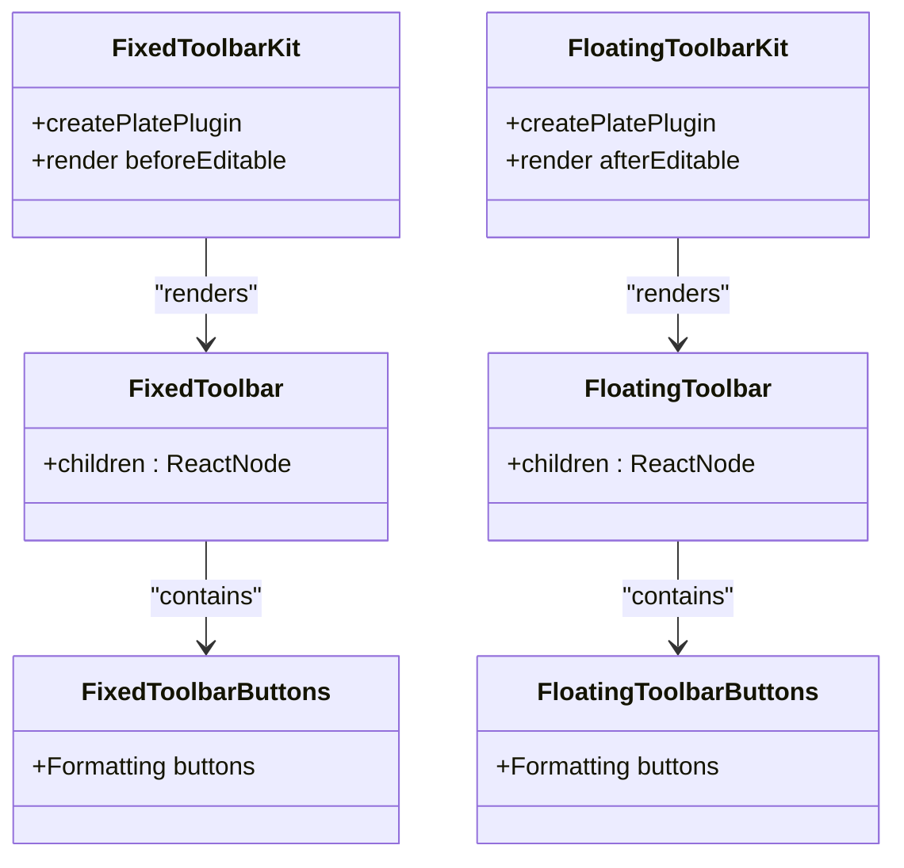

**Diagram sources**
- [fixed-toolbar-kit.tsx](file://components/plate/fixed-toolbar-kit.tsx)
- [floating-toolbar-kit.tsx](file://components/plate/floating-toolbar-kit.tsx)

**Section sources**
- [editor-kit.tsx](file://components/plate/editor-kit.tsx)
- [fixed-toolbar-kit.tsx](file://components/plate/fixed-toolbar-kit.tsx)
- [floating-toolbar-kit.tsx](file://components/plate/floating-toolbar-kit.tsx)

## Real-time Synchronization with Yjs

The real-time synchronization system is built on Yjs, a CRDT-based framework for conflict-free collaborative editing. The SupabaseYjsProvider implements the UnifiedProvider interface required by @platejs/yjs, enabling seamless integration between the Plate editor and Supabase Realtime.

### Yjs Provider Architecture

The SupabaseYjsProvider class handles the connection between the Yjs document and Supabase Realtime channels. It manages the bidirectional flow of updates between clients and ensures that all participants have a consistent view of the document.

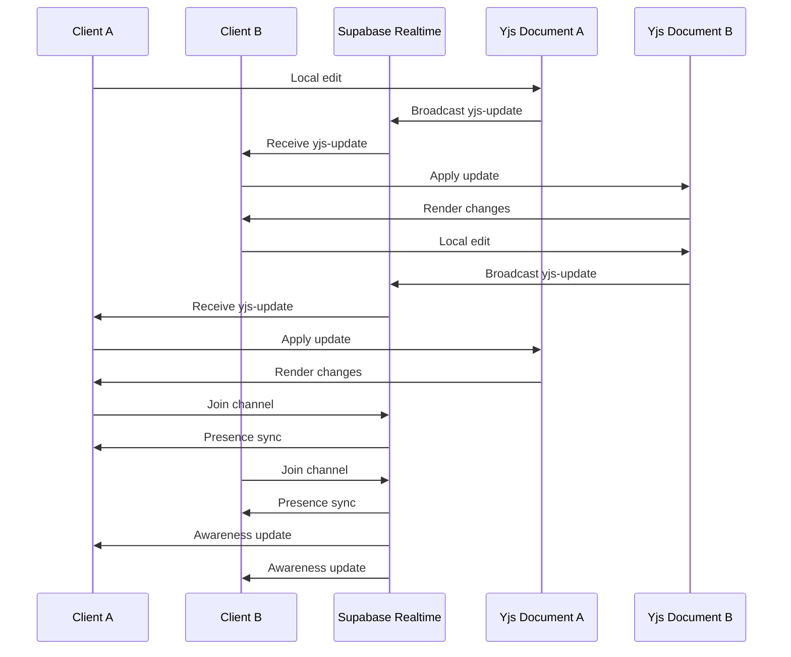

**Diagram sources**
- [supabase-yjs-provider.ts](file://lib/yjs/supabase-yjs-provider.ts)
- [collaborative-plate-editor.tsx](file://components/plate/collaborative-plate-editor.tsx)

### Synchronization Protocol

The synchronization protocol includes mechanisms for initial state synchronization, awareness sharing, and conflict resolution. When a new client joins, it requests the current document state from existing clients to ensure consistency.

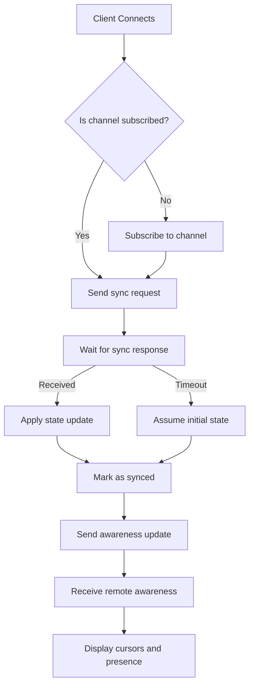

**Diagram sources**
- [supabase-yjs-provider.ts](file://lib/yjs/supabase-yjs-provider.ts)

**Section sources**
- [supabase-yjs-provider.ts](file://lib/yjs/supabase-yjs-provider.ts)
- [collaborative-plate-editor.tsx](file://components/plate/collaborative-plate-editor.tsx)

## Document Collaboration Features

The document editor includes several collaboration features that enhance the multi-user editing experience, including presence indicators, cursor sharing, and conflict resolution through CRDTs.

### User Presence and Cursors

The system implements real-time presence indicators and cursor sharing, allowing users to see where their collaborators are working within the document. Each user is assigned a unique color from a predefined palette based on their user ID.

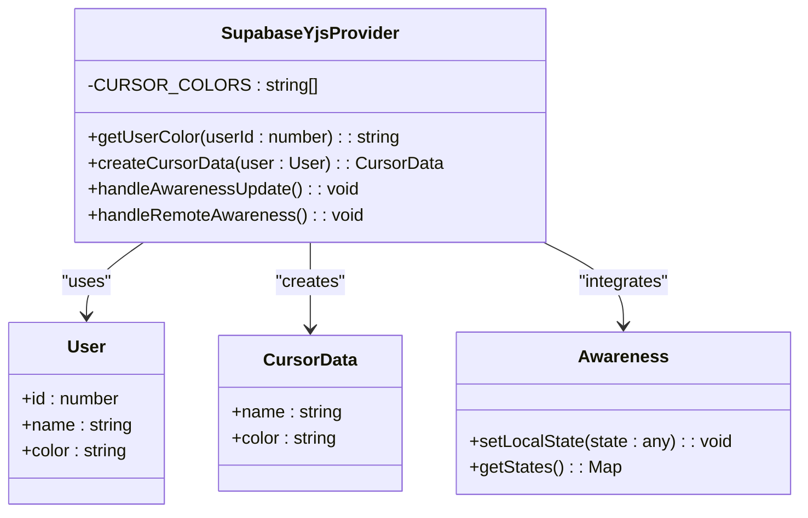

**Diagram sources**
- [yjs-kit.tsx](file://components/plate/yjs-kit.tsx)
- [supabase-yjs-provider.ts](file://lib/yjs/supabase-yjs-provider.ts)

### Conflict Resolution

The system uses Yjs's CRDT implementation to automatically resolve conflicts that may arise from concurrent edits. This ensures that all clients eventually converge to the same document state without data loss.

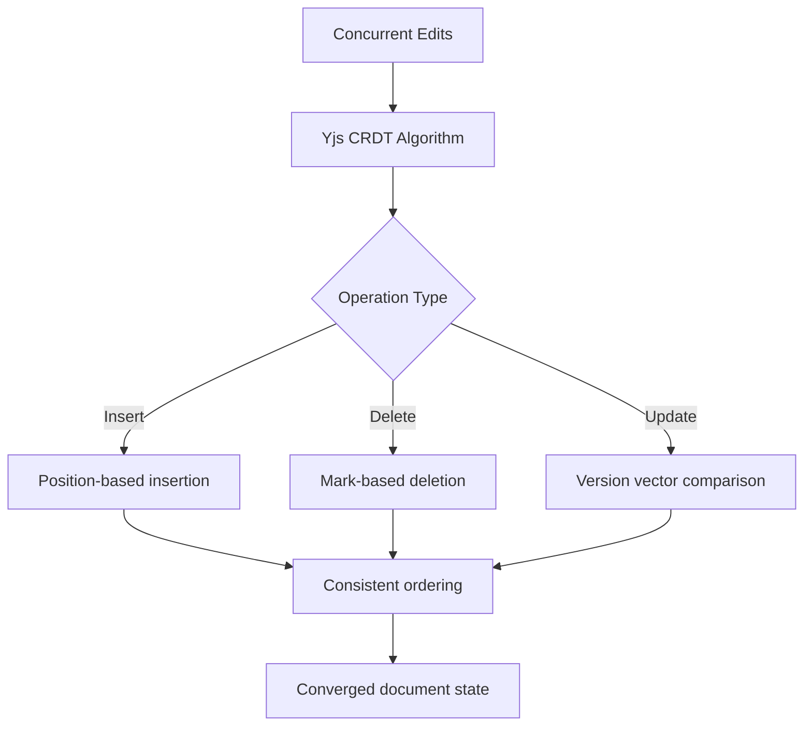

**Diagram sources**
- [supabase-yjs-provider.ts](file://lib/yjs/supabase-yjs-provider.ts)

**Section sources**
- [yjs-kit.tsx](file://components/plate/yjs-kit.tsx)
- [supabase-yjs-provider.ts](file://lib/yjs/supabase-yjs-provider.ts)

## Performance Considerations

The document editor implementation includes several performance optimizations to ensure smooth operation, especially with large documents and multiple collaborators.

### Lazy Loading of Plugins

The editor kit system allows for selective inclusion of functionality, enabling lazy loading of editor plugins based on the document's requirements. This reduces the initial bundle size and improves startup performance.

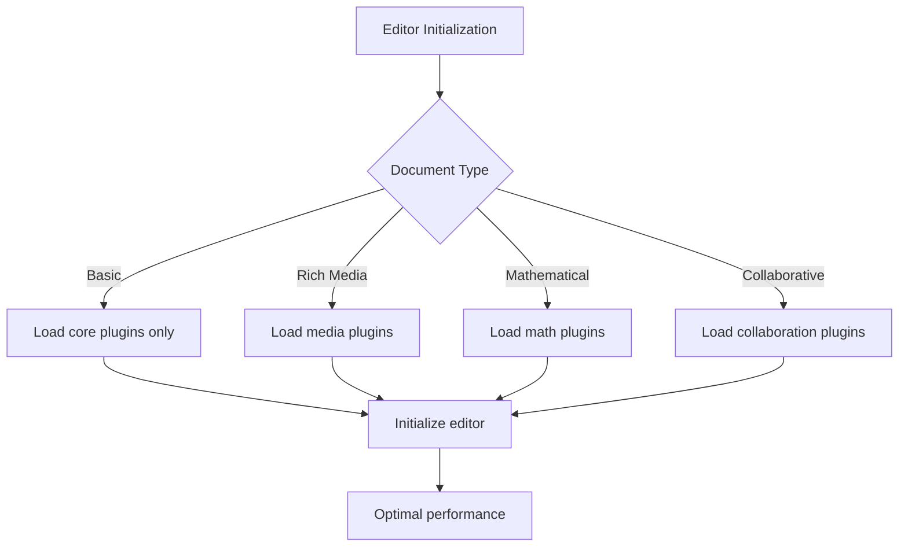

**Diagram sources**
- [editor-kit.tsx](file://components/plate/editor-kit.tsx)

### Memory Management

The implementation includes proper cleanup mechanisms to prevent memory leaks, particularly in the collaborative editor where event listeners and subscriptions need to be managed carefully.

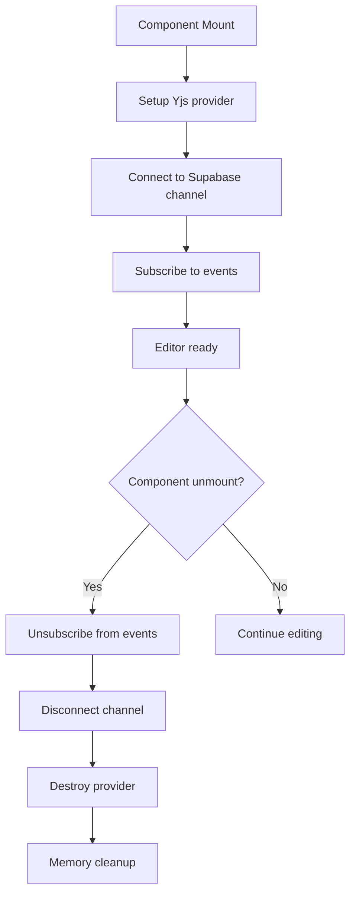

**Diagram sources**
- [collaborative-plate-editor.tsx](file://components/plate/collaborative-plate-editor.tsx)

**Section sources**
- [collaborative-plate-editor.tsx](file://components/plate/collaborative-plate-editor.tsx)
- [editor-kit.tsx](file://components/plate/editor-kit.tsx)

## Supabase Integration

The document editor integrates with Supabase for both real-time synchronization and document persistence. This integration enables seamless collaboration and reliable data storage.

### Real-time Channel Configuration

The SupabaseYjsProvider creates a dedicated realtime channel for each document, using the document ID to ensure unique channel names. The channel configuration includes broadcast and presence settings to optimize the collaboration experience.

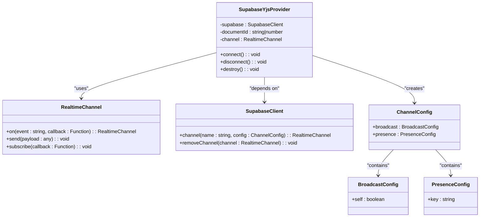

**Diagram sources**
- [supabase-yjs-provider.ts](file://lib/yjs/supabase-yjs-provider.ts)

### Document Persistence

While the real-time synchronization handles the collaborative editing aspect, the integration with Supabase also enables document persistence. The system can save document versions and maintain version history through Supabase's database capabilities.

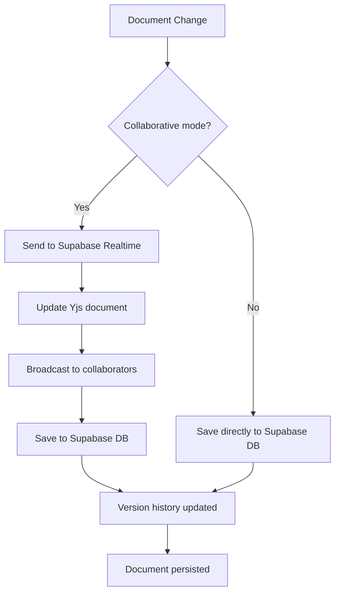

**Diagram sources**
- [supabase-yjs-provider.ts](file://lib/yjs/supabase-yjs-provider.ts)
- [collaborative-plate-editor.tsx](file://components/plate/collaborative-plate-editor.tsx)

**Section sources**
- [supabase-yjs-provider.ts](file://lib/yjs/supabase-yjs-provider.ts)
- [collaborative-plate-editor.tsx](file://components/plate/collaborative-plate-editor.tsx)

## Usage Examples

This section provides examples of how to configure and use the document editor components in various scenarios.

### Basic Editor Configuration

To create a simple document editor without collaboration features, use the PlateEditor component with a custom configuration:

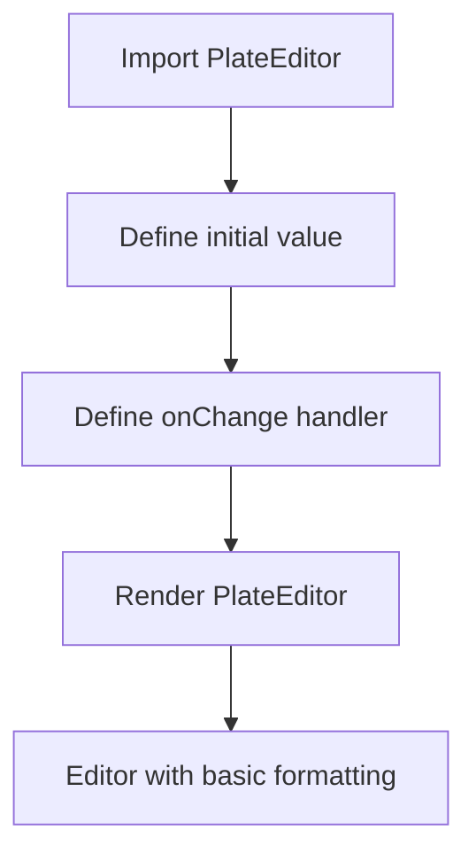

**Section sources**
- [plate-editor.tsx](file://components/plate/plate-editor.tsx)

### Collaborative Editor Configuration

To enable real-time collaboration, use the CollaborativePlateEditor component with user and document information:

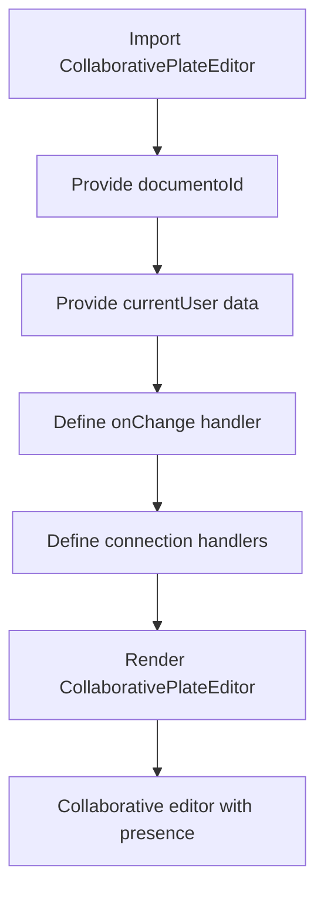

**Section sources**
- [collaborative-plate-editor.tsx](file://components/plate/collaborative-plate-editor.tsx)

### Custom Toolbar Configuration

To customize the editor's toolbar, modify the EditorKit composition in editor-kit.tsx:

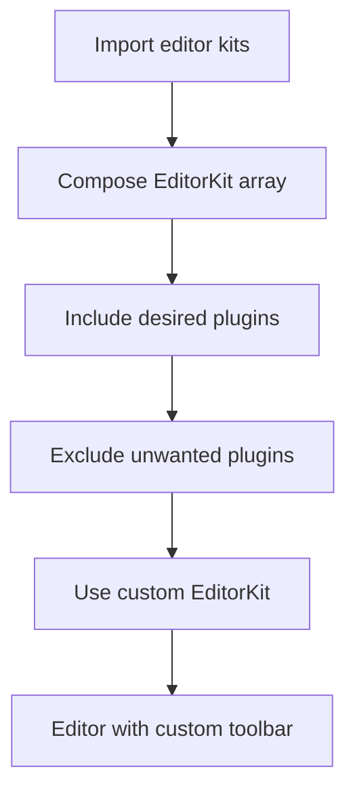

**Section sources**
- [editor-kit.tsx](file://components/plate/editor-kit.tsx)

## Conclusion

The Sinesys Document Editor Components provide a robust and flexible solution for rich text editing with real-time collaboration capabilities. Built on the Plate framework and enhanced with Yjs for CRDT-based synchronization, the system enables multiple users to edit documents simultaneously with automatic conflict resolution. The modular kit system allows for customized editor configurations, while the integration with Supabase provides reliable real-time communication and document persistence. The implementation includes performance optimizations for large documents and proper memory management to ensure a smooth user experience.