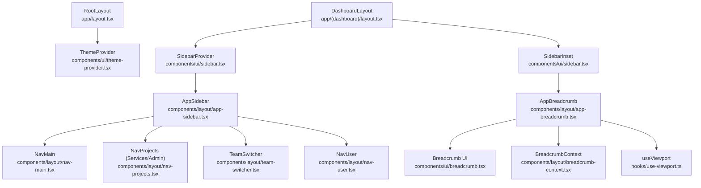
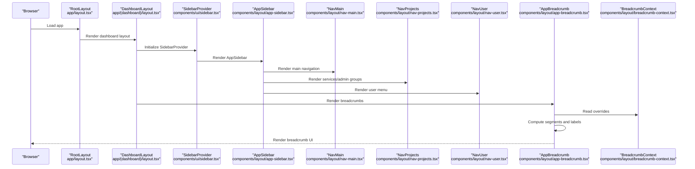
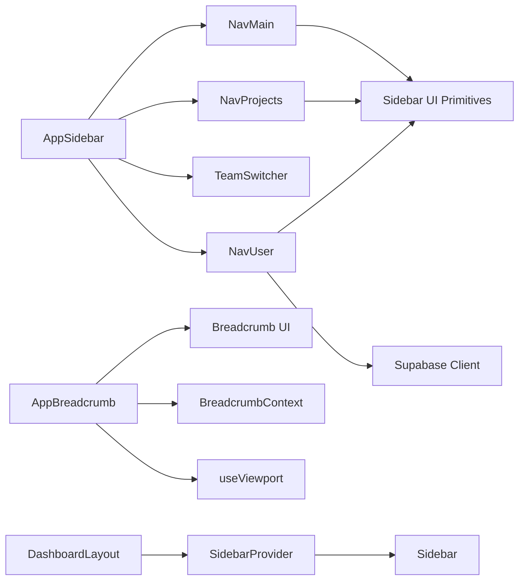

# Layout Components

<cite>
**Referenced Files in This Document**
- [app/layout.tsx](file://app/layout.tsx)
- [app/(dashboard)/layout.tsx](file://app/(dashboard)/layout.tsx)
- [components/layout/app-sidebar.tsx](file://components/layout/app-sidebar.tsx)
- [components/layout/nav-main.tsx](file://components/layout/nav-main.tsx)
- [components/layout/nav-projects.tsx](file://components/layout/nav-projects.tsx)
- [components/layout/nav-user.tsx](file://components/layout/nav-user.tsx)
- [components/layout/team-switcher.tsx](file://components/layout/team-switcher.tsx)
- [components/layout/app-breadcrumb.tsx](file://components/layout/app-breadcrumb.tsx)
- [components/layout/breadcrumb-context.tsx](file://components/layout/breadcrumb-context.tsx)
- [components/ui/sidebar.tsx](file://components/ui/sidebar.tsx)
- [components/ui/breadcrumb.tsx](file://components/ui/breadcrumb.tsx)
- [hooks/use-viewport.ts](file://hooks/use-viewport.ts)
- [components/layout/logout-button.tsx](file://components/layout/logout-button.tsx)
</cite>

## Table of Contents
1. [Introduction](#introduction)
2. [Project Structure](#project-structure)
3. [Core Components](#core-components)
4. [Architecture Overview](#architecture-overview)
5. [Detailed Component Analysis](#detailed-component-analysis)
6. [Dependency Analysis](#dependency-analysis)
7. [Performance Considerations](#performance-considerations)
8. [Accessibility Considerations](#accessibility-considerations)
9. [Integration Guide](#integration-guide)
10. [Troubleshooting Guide](#troubleshooting-guide)
11. [Conclusion](#conclusion)

## Introduction
This document describes the Sinesys Layout Components system, focusing on the application shell, navigation menus, user/team context controls, responsive behavior, breadcrumb system, and integration patterns. It explains how the sidebar, main navigation, project navigation, user menu, and breadcrumb components work together to provide a consistent, accessible, and performant layout across desktop and mobile devices.

## Project Structure
The layout system is centered around a dashboard layout wrapper that provides a shared sidebar and inset content area. The sidebar hosts the main navigation, project navigation, team switcher, and user menu. The breadcrumb system provides contextual navigation with override capabilities.

**Diagram sources**
- [app/layout.tsx](file://app/layout.tsx#L50-L71)
- [app/(dashboard)/layout.tsx](file://app/(dashboard)/layout.tsx#L5-L21)
- [components/layout/app-sidebar.tsx](file://components/layout/app-sidebar.tsx#L1-L258)
- [components/layout/nav-main.tsx](file://components/layout/nav-main.tsx#L1-L117)
- [components/layout/nav-projects.tsx](file://components/layout/nav-projects.tsx#L1-L172)
- [components/layout/team-switcher.tsx](file://components/layout/team-switcher.tsx#L1-L69)
- [components/layout/nav-user.tsx](file://components/layout/nav-user.tsx#L1-L162)
- [components/layout/app-breadcrumb.tsx](file://components/layout/app-breadcrumb.tsx#L1-L229)
- [components/layout/breadcrumb-context.tsx](file://components/layout/breadcrumb-context.tsx#L1-L58)
- [components/ui/sidebar.tsx](file://components/ui/sidebar.tsx#L1-L727)
- [components/ui/breadcrumb.tsx](file://components/ui/breadcrumb.tsx#L1-L110)
- [hooks/use-viewport.ts](file://hooks/use-viewport.ts#L1-L152)

**Section sources**
- [app/layout.tsx](file://app/layout.tsx#L50-L71)
- [app/(dashboard)/layout.tsx](file://app/(dashboard)/layout.tsx#L5-L21)

## Core Components
- AppSidebar: Hosts the team switcher, main navigation, project navigation, and user menu. Loads user profile data and integrates with Supabase for fallback.
- NavMain: Renders collapsible main navigation items with active state detection and mobile-close behavior.
- NavProjects: Renders collapsible project/service/admin groups with optional actions and dropdown menus.
- TeamSwitcher: Displays the active team branding and toggles between light/dark logos based on theme.
- NavUser: Provides user avatar, account actions, notifications, help, theme toggle, and logout.
- AppBreadcrumb: Generates breadcrumbs from the URL, supports overrides, and adapts to mobile/desktop.
- BreadcrumbContext: Provides a context for dynamic breadcrumb label overrides.
- SidebarProvider/Sidebar: Manages expanded/collapsed state, mobile off-canvas behavior, keyboard shortcut, and cookie persistence.

**Section sources**
- [components/layout/app-sidebar.tsx](file://components/layout/app-sidebar.tsx#L1-L258)
- [components/layout/nav-main.tsx](file://components/layout/nav-main.tsx#L1-L117)
- [components/layout/nav-projects.tsx](file://components/layout/nav-projects.tsx#L1-L172)
- [components/layout/team-switcher.tsx](file://components/layout/team-switcher.tsx#L1-L69)
- [components/layout/nav-user.tsx](file://components/layout/nav-user.tsx#L1-L162)
- [components/layout/app-breadcrumb.tsx](file://components/layout/app-breadcrumb.tsx#L1-L229)
- [components/layout/breadcrumb-context.tsx](file://components/layout/breadcrumb-context.tsx#L1-L58)
- [components/ui/sidebar.tsx](file://components/ui/sidebar.tsx#L1-L727)

## Architecture Overview
The layout architecture follows a provider-based pattern:
- RootLayout wraps the app with theme and toast providers.
- DashboardLayout wraps children with SidebarProvider and renders AppSidebar and SidebarInset.
- AppSidebar composes NavMain, NavProjects, TeamSwitcher, and NavUser.
- AppBreadcrumb sits inside SidebarInset and uses BreadcrumbContext for overrides and useViewport for responsive behavior.

**Diagram sources**
- [app/layout.tsx](file://app/layout.tsx#L50-L71)
- [app/(dashboard)/layout.tsx](file://app/(dashboard)/layout.tsx#L5-L21)
- [components/layout/app-sidebar.tsx](file://components/layout/app-sidebar.tsx#L1-L258)
- [components/layout/nav-main.tsx](file://components/layout/nav-main.tsx#L1-L117)
- [components/layout/nav-projects.tsx](file://components/layout/nav-projects.tsx#L1-L172)
- [components/layout/nav-user.tsx](file://components/layout/nav-user.tsx#L1-L162)
- [components/layout/app-breadcrumb.tsx](file://components/layout/app-breadcrumb.tsx#L1-L229)
- [components/layout/breadcrumb-context.tsx](file://components/layout/breadcrumb-context.tsx#L1-L58)

## Detailed Component Analysis

### AppSidebar
Responsibilities:
- Renders the team switcher header.
- Composes NavMain for primary navigation.
- Composes NavProjects for Services and Administration groups.
- Renders NavUser in the footer with user profile loading and fallback.
- Integrates with Supabase for user profile retrieval and fallback.

Responsive behavior:
- Uses SidebarProvider’s collapsible state and mobile handling.

User profile loading:
- Attempts to fetch user profile via a dedicated endpoint.
- Falls back to Supabase auth user data if the endpoint fails.

**Section sources**
- [components/layout/app-sidebar.tsx](file://components/layout/app-sidebar.tsx#L1-L258)
- [components/layout/nav-user.tsx](file://components/layout/nav-user.tsx#L1-L162)

### NavMain
Responsibilities:
- Renders top-level navigation items with icons and labels.
- Supports collapsible submenus with stable IDs derived from titles.
- Highlights active items based on current pathname.
- Closes mobile sidebar on navigation.

Accessibility:
- Uses tooltips for collapsed state and links for navigation.

**Section sources**
- [components/layout/nav-main.tsx](file://components/layout/nav-main.tsx#L1-L117)

### NavProjects
Responsibilities:
- Renders grouped navigation items under labels like “Services” and “Administration”.
- Supports collapsible submenus with stable IDs derived from names.
- Optionally shows action dropdowns per item.
- Highlights active items based on current pathname.
- Closes mobile sidebar on navigation.

Accessibility:
- Uses dropdown menus with appropriate alignment for mobile vs desktop.

**Section sources**
- [components/layout/nav-projects.tsx](file://components/layout/nav-projects.tsx#L1-L172)

### TeamSwitcher
Responsibilities:
- Displays the active team branding with either a logo image or icon.
- Switches between light/dark logos based on current theme.
- Provides a compact display when sidebar is collapsed.

**Section sources**
- [components/layout/team-switcher.tsx](file://components/layout/team-switcher.tsx#L1-L69)

### NavUser
Responsibilities:
- Displays user avatar and initials.
- Provides account, notifications, help, and theme toggle options.
- Handles logout via Supabase and redirects to login.
- Adapts dropdown placement for mobile vs desktop.

Accessibility:
- Uses dropdown menus with clear labels and keyboard-friendly triggers.

**Section sources**
- [components/layout/nav-user.tsx](file://components/layout/nav-user.tsx#L1-L162)
- [components/layout/logout-button.tsx](file://components/layout/logout-button.tsx#L1-L18)

### AppBreadcrumb
Responsibilities:
- Builds breadcrumbs from the current pathname.
- Supports custom labels via BreadcrumbContext overrides.
- Adapts to mobile/desktop:
  - Mobile: Shows only last two segments with an ellipsis dropdown for hidden ancestors.
  - Desktop: Shows the full breadcrumb trail.
- Truncates long labels for readability.

Responsive logic:
- Uses useViewport to detect mobile width threshold.

**Section sources**
- [components/layout/app-breadcrumb.tsx](file://components/layout/app-breadcrumb.tsx#L1-L229)
- [components/layout/breadcrumb-context.tsx](file://components/layout/breadcrumb-context.tsx#L1-L58)
- [hooks/use-viewport.ts](file://hooks/use-viewport.ts#L1-L152)

### BreadcrumbContext
Responsibilities:
- Exposes a provider to manage breadcrumb overrides keyed by path.
- Provides setters to add or clear overrides.
- Ensures uniqueness by replacing existing overrides for the same path.

Integration:
- Consumed by AppBreadcrumb to customize labels dynamically.

**Section sources**
- [components/layout/breadcrumb-context.tsx](file://components/layout/breadcrumb-context.tsx#L1-L58)

### SidebarProvider and Sidebar
Responsibilities:
- Manages expanded/collapsed state and mobile open/close.
- Persists state via cookies.
- Provides keyboard shortcut to toggle sidebar.
- Renders desktop sidebar with collapsible variants and rail.
- Renders mobile sidebar as a sheet.

Accessibility:
- Provides aria labels and roles for mobile sheet.
- Keyboard shortcut for quick toggle.

**Section sources**
- [components/ui/sidebar.tsx](file://components/ui/sidebar.tsx#L1-L727)

## Dependency Analysis
The layout components depend on:
- UI primitives from components/ui (sidebar, breadcrumb, dropdown-menu, avatar, tooltip).
- Next.js routing utilities (usePathname, useRouter).
- Theme provider for light/dark switching.
- Supabase client for user profile fallback.
- Responsive hook for viewport-aware behavior.

**Diagram sources**
- [components/layout/app-sidebar.tsx](file://components/layout/app-sidebar.tsx#L1-L258)
- [components/layout/nav-main.tsx](file://components/layout/nav-main.tsx#L1-L117)
- [components/layout/nav-projects.tsx](file://components/layout/nav-projects.tsx#L1-L172)
- [components/layout/team-switcher.tsx](file://components/layout/team-switcher.tsx#L1-L69)
- [components/layout/nav-user.tsx](file://components/layout/nav-user.tsx#L1-L162)
- [components/layout/app-breadcrumb.tsx](file://components/layout/app-breadcrumb.tsx#L1-L229)
- [components/layout/breadcrumb-context.tsx](file://components/layout/breadcrumb-context.tsx#L1-L58)
- [components/ui/sidebar.tsx](file://components/ui/sidebar.tsx#L1-L727)
- [components/ui/breadcrumb.tsx](file://components/ui/breadcrumb.tsx#L1-L110)
- [hooks/use-viewport.ts](file://hooks/use-viewport.ts#L1-L152)
- [app/(dashboard)/layout.tsx](file://app/(dashboard)/layout.tsx#L5-L21)

**Section sources**
- [components/ui/sidebar.tsx](file://components/ui/sidebar.tsx#L1-L727)
- [components/ui/breadcrumb.tsx](file://components/ui/breadcrumb.tsx#L1-L110)
- [hooks/use-viewport.ts](file://hooks/use-viewport.ts#L1-L152)

## Performance Considerations
- State persistence: SidebarProvider persists expanded/collapsed state in a cookie to avoid re-computation on mount.
- Minimal re-renders:
  - useViewport returns a memoized state and listens to resize/orientation events; consider using useViewportWidth if only width is needed to reduce updates.
  - NavMain and NavProjects compute active states based on pathname; ensure they are not rendered unnecessarily by scoping them to routes that need them.
- Lazy loading user data: AppSidebar loads user profile asynchronously and falls back to Supabase; consider caching or preloading in higher-order layouts if needed.
- Collapsible menus: Stable IDs for collapsible groups prevent unnecessary re-renders when toggling.
- Mobile rendering: Mobile sidebar uses a sheet; avoid heavy computations during open/close transitions.

[No sources needed since this section provides general guidance]

## Accessibility Considerations
- Keyboard navigation:
  - SidebarProvider exposes a keyboard shortcut to toggle the sidebar.
  - NavMain and NavProjects use collapsible triggers and menu buttons with proper focus styles.
- Screen reader support:
  - Mobile sidebar includes aria labels and screen-reader-only headers.
  - Breadcrumb UI uses aria roles for current page and separators.
  - Dropdown menus in NavUser and NavProjects provide accessible triggers and content.
- Focus management:
  - Menu buttons and triggers are focusable; ensure focus order is logical within the sidebar.
  - Tooltips are hidden when sidebar is not collapsed or on mobile.

**Section sources**
- [components/ui/sidebar.tsx](file://components/ui/sidebar.tsx#L96-L110)
- [components/ui/sidebar.tsx](file://components/ui/sidebar.tsx#L183-L206)
- [components/ui/breadcrumb.tsx](file://components/ui/breadcrumb.tsx#L1-L110)
- [components/layout/nav-main.tsx](file://components/layout/nav-main.tsx#L1-L117)
- [components/layout/nav-projects.tsx](file://components/layout/nav-projects.tsx#L1-L172)
- [components/layout/nav-user.tsx](file://components/layout/nav-user.tsx#L1-L162)

## Integration Guide
To integrate the layout components into a new page:
1. Wrap your page content with the dashboard layout:
   - Use the DashboardLayout component to provide SidebarProvider, AppSidebar, and SidebarInset.
2. Place AppBreadcrumb inside SidebarInset to render breadcrumbs consistently.
3. Add navigation items:
   - Use NavMain for primary navigation items and collapsible submenus.
   - Use NavProjects for grouped sections like Services and Administration.
4. Manage user context:
   - Use NavUser for user menu, theme toggle, and logout.
5. Customize breadcrumbs:
   - Wrap pages that need custom labels with BreadcrumbContext provider or use the useBreadcrumbOverride hook to set labels for specific paths.
6. Team context:
   - TeamSwitcher is included in AppSidebar; pass the active team configuration to it.

Example integration points:
- DashboardLayout composition: [app/(dashboard)/layout.tsx](file://app/(dashboard)/layout.tsx#L5-L21)
- AppSidebar composition: [components/layout/app-sidebar.tsx](file://components/layout/app-sidebar.tsx#L1-L258)
- NavMain usage: [components/layout/nav-main.tsx](file://components/layout/nav-main.tsx#L1-L117)
- NavProjects usage: [components/layout/nav-projects.tsx](file://components/layout/nav-projects.tsx#L1-L172)
- AppBreadcrumb usage: [components/layout/app-breadcrumb.tsx](file://components/layout/app-breadcrumb.tsx#L1-L229)
- BreadcrumbContext usage: [components/layout/breadcrumb-context.tsx](file://components/layout/breadcrumb-context.tsx#L1-L58)

**Section sources**
- [app/(dashboard)/layout.tsx](file://app/(dashboard)/layout.tsx#L5-L21)
- [components/layout/app-sidebar.tsx](file://components/layout/app-sidebar.tsx#L1-L258)
- [components/layout/nav-main.tsx](file://components/layout/nav-main.tsx#L1-L117)
- [components/layout/nav-projects.tsx](file://components/layout/nav-projects.tsx#L1-L172)
- [components/layout/app-breadcrumb.tsx](file://components/layout/app-breadcrumb.tsx#L1-L229)
- [components/layout/breadcrumb-context.tsx](file://components/layout/breadcrumb-context.tsx#L1-L58)

## Troubleshooting Guide
- Sidebar does not persist state:
  - Verify cookie support and that SidebarProvider is mounted at the root of the dashboard layout.
  - Check that the cookie name and max age are set correctly.
- Mobile sidebar not opening:
  - Ensure SidebarTrigger is present and that the mobile breakpoint is respected.
  - Confirm that the sheet is rendering and that openMobile state is toggled.
- Breadcrumb not updating:
  - Ensure BreadcrumbContext provider is mounted above AppBreadcrumb.
  - Verify that overrides are set for the correct paths and cleared when leaving the page.
- User menu not showing profile:
  - Confirm that the user profile endpoint returns success and data.
  - Check Supabase fallback logic and network connectivity.
- Keyboard shortcut not working:
  - Ensure the handler is attached and that the event target is focused.

**Section sources**
- [components/ui/sidebar.tsx](file://components/ui/sidebar.tsx#L28-L89)
- [components/ui/sidebar.tsx](file://components/ui/sidebar.tsx#L183-L206)
- [components/layout/app-breadcrumb.tsx](file://components/layout/app-breadcrumb.tsx#L1-L229)
- [components/layout/breadcrumb-context.tsx](file://components/layout/breadcrumb-context.tsx#L1-L58)
- [components/layout/app-sidebar.tsx](file://components/layout/app-sidebar.tsx#L1-L258)

## Conclusion
The Sinesys Layout Components system provides a robust, accessible, and responsive application shell. The sidebar, navigation menus, user/team context controls, and breadcrumb system work together to deliver consistent navigation patterns across desktop and mobile. By following the integration guide and leveraging the provided context and hooks, developers can maintain consistent navigation while adding new pages efficiently.