# Financial Overview

<cite>
**Referenced Files in This Document**   
- [widget-fluxo-caixa.tsx](file://app/(dashboard)/dashboard/components/widgets/widget-fluxo-caixa.tsx)
- [widget-contas-pagar-receber.tsx](file://app/(dashboard)/dashboard/components/widgets/widget-contas-pagar-receber.tsx)
- [widget-saldo-contas.tsx](file://app/(dashboard)/dashboard/components/widgets/widget-saldo-contas.tsx)
- [use-dashboard-financeiro.ts](file://app/_lib/hooks/use-dashboard-financeiro.ts)
- [dashboard-usuario.service.ts](file://backend/dashboard/services/dashboard/dashboard-usuario.service.ts)
- [financeiro_functions.sql](file://supabase/schemas/33_financeiro_functions.sql)
- [29_lancamentos_financeiros.sql](file://supabase/schemas/29_lancamentos_financeiros.sql)
- [acordos-condenacoes.service.ts](file://backend/acordos-condenacoes/services/acordos-condenacoes/acordos-condenacoes.service.ts)
</cite>

## Table of Contents
1. [Introduction](#introduction)
2. [Financial Widgets Overview](#financial-widgets-overview)
3. [Data Aggregation and API Integration](#data-aggregation-and-api-integration)
4. [Financial Data Transformation Process](#financial-data-transformation-process)
5. [Payment Status Tracking and Reconciliation](#payment-status-tracking-and-reconciliation)
6. [Cash Flow Visualization](#cash-flow-visualization)
7. [Integration with Acordos Condenações](#integration-with-acordos-condenacoes)
8. [Currency Formatting and Localization](#currency-formatting-and-localization)
9. [Performance Optimization](#performance-optimization)
10. [Common Issues and Troubleshooting](#common-issues-and-troubleshooting)

## Introduction
The Financial Overview feature in the Sinesys Dashboard UI provides a comprehensive view of financial metrics through multiple widgets that display key financial indicators. This system aggregates financial data from various sources across the platform, transforming raw financial records into summarized dashboard metrics that enable users to monitor their financial health at a glance. The feature focuses on three primary financial widgets: fluxo-caixa (cash flow), contas-pagar-receber (accounts payable/receivable), and saldo-contas (account balances), each providing specific insights into different aspects of financial operations.

**Section sources**
- [page.tsx](file://app/(dashboard)/financeiro/page.tsx#L1-L79)

## Financial Widgets Overview
The Financial Overview dashboard comprises several key widgets that present financial data in an accessible format. These widgets are designed to provide immediate insights into the financial status of the organization, with each widget focusing on a specific aspect of financial management.

### WidgetSaldoContas
The WidgetSaldoContas displays the total balance across all bank accounts, providing a quick overview of available funds. This widget shows the current balance in a prominent format with proper currency formatting for Brazilian Real (BRL). It includes a navigation link to the bank accounts management section for users who need to access detailed account information.

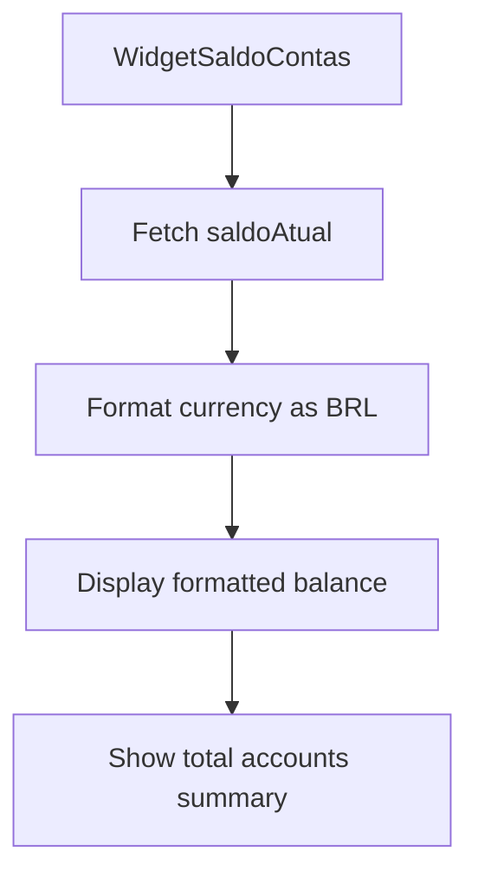

**Diagram sources**
- [widget-saldo-contas.tsx](file://app/(dashboard)/dashboard/components/widgets/widget-saldo-contas.tsx#L1-L62)

### WidgetContasPagarReceber
This widget presents a dual-panel view showing both accounts payable and accounts receivable. It displays the total value and count of pending transactions for both categories, using color-coded indicators (red for payable, green for receivable) to quickly convey financial obligations and expected income. The widget provides direct navigation links to the respective accounts management sections.

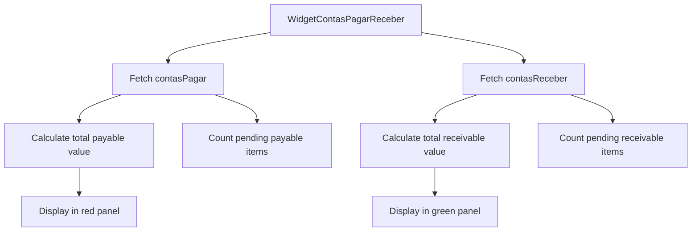

**Diagram sources**
- [widget-contas-pagar-receber.tsx](file://app/(dashboard)/dashboard/components/widgets/widget-contas-pagar-receber.tsx#L1-L81)

### WidgetFluxoCaixa
The WidgetFluxoCaixa visualizes cash flow over a six-month period using a bar chart that compares monthly revenues and expenses. This visualization helps users identify trends in cash flow and understand the relationship between income and expenditures over time. The chart uses green bars for revenues and red bars for expenses, with proper currency formatting on the Y-axis.

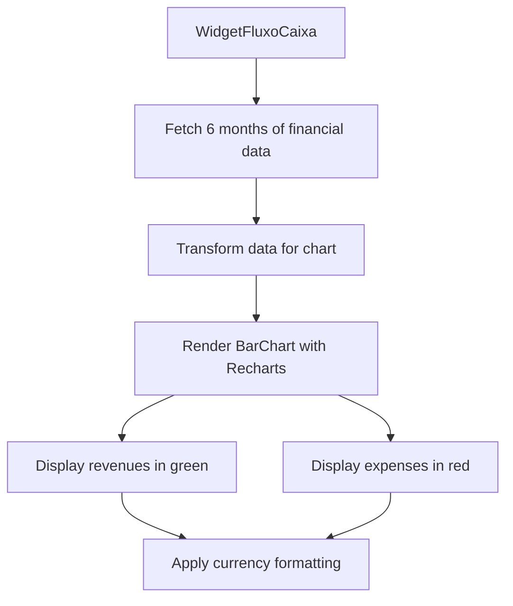

**Diagram sources**
- [widget-fluxo-caixa.tsx](file://app/(dashboard)/dashboard/components/widgets/widget-fluxo-caixa.tsx#L1-L68)

**Section sources**
- [widget-saldo-contas.tsx](file://app/(dashboard)/dashboard/components/widgets/widget-saldo-contas.tsx#L1-L62)
- [widget-contas-pagar-receber.tsx](file://app/(dashboard)/dashboard/components/widgets/widget-contas-pagar-receber.tsx#L1-L81)
- [widget-fluxo-caixa.tsx](file://app/(dashboard)/dashboard/components/widgets/widget-fluxo-caixa.tsx#L1-L68)

## Data Aggregation and API Integration
The financial widgets retrieve their data through a combination of frontend hooks and backend services that aggregate information from multiple data sources. The system uses a layered architecture to fetch, process, and deliver financial data to the dashboard components.

### Frontend Data Fetching
The financial widgets utilize custom React hooks to retrieve data from the backend API. These hooks handle loading states, error conditions, and data transformation before presenting the information to the UI components.

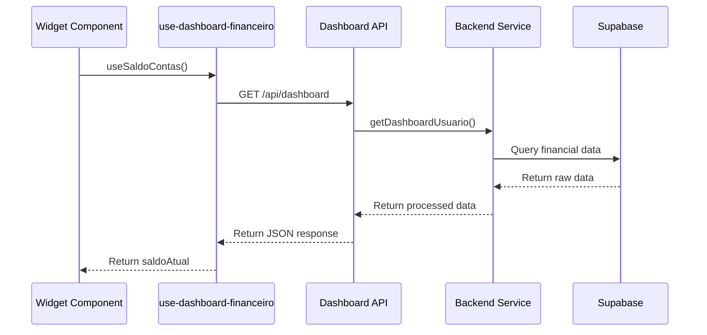

**Diagram sources**
- [use-dashboard-financeiro.ts](file://app/_lib/hooks/use-dashboard-financeiro.ts)
- [dashboard-usuario.service.ts](file://backend/dashboard/services/dashboard/dashboard-usuario.service.ts)

### Backend Data Aggregation
The backend services aggregate financial data from various tables in the database, applying business logic to calculate the metrics displayed in the dashboard. The system differentiates between regular users and superadmins, providing appropriate data access based on user permissions.

**Section sources**
- [dashboard-usuario.service.ts](file://backend/dashboard/services/dashboard/dashboard-usuario.service.ts)
- [dashboard-admin.service.ts](file://backend/dashboard/services/dashboard/dashboard-admin.service.ts)

## Financial Data Transformation Process
The system transforms raw financial records into summarized metrics through a multi-step process that involves data retrieval, calculation, and formatting. This transformation ensures that the dashboard displays accurate and meaningful financial information.

### Data Flow Architecture
The financial data flows through a well-defined pipeline from the database to the frontend UI, with each layer performing specific transformations.

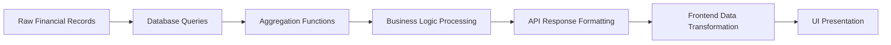

**Diagram sources**
- [financeiro_functions.sql](file://supabase/schemas/33_financeiro_functions.sql)
- [use-dashboard-financeiro.ts](file://app/_lib/hooks/use-dashboard-financeiro.ts)

### Data Transformation Steps
1. **Data Retrieval**: The system queries the database for raw financial records from relevant tables.
2. **Aggregation**: Financial data is aggregated by category, status, and time period.
3. **Calculation**: Business logic is applied to calculate metrics like totals, averages, and trends.
4. **Formatting**: Data is formatted for presentation, including currency formatting and date formatting.
5. **Caching**: Results are cached to improve performance for subsequent requests.

**Section sources**
- [financeiro_functions.sql](file://supabase/schemas/33_financeiro_functions.sql)
- [29_lancamentos_financeiros.sql](file://supabase/schemas/29_lancamentos_financeiros.sql)

## Payment Status Tracking and Reconciliation
The system tracks payment status across multiple states, distinguishing between pending, confirmed, and reconciled transactions. This tracking enables accurate financial reporting and helps users manage their cash flow effectively.

### Payment Status Lifecycle
Financial transactions progress through a defined lifecycle from creation to reconciliation, with each state having specific implications for financial reporting.

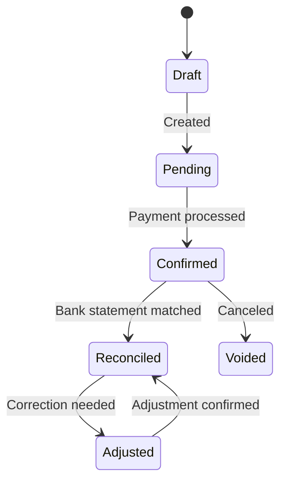

**Diagram sources**
- [29_lancamentos_financeiros.sql](file://supabase/schemas/29_lancamentos_financeiros.sql)

### Reconciliation States
The system supports multiple reconciliation states to accurately represent the status of financial transactions:
- **Pending**: Transaction recorded but not yet confirmed
- **Confirmed**: Payment processed but not yet matched to bank statement
- **Reconciled**: Transaction matched to bank statement
- **Voided**: Transaction canceled or reversed
- **Adjusted**: Transaction modified due to error or correction

**Section sources**
- [29_lancamentos_financeiros.sql](file://supabase/schemas/29_lancamentos_financeiros.sql)

## Cash Flow Visualization
The cash flow visualization component provides a graphical representation of financial inflows and outflows over time, helping users identify trends and patterns in their financial operations.

### Chart Implementation
The WidgetFluxoCaixa uses Recharts to render a bar chart that compares monthly revenues and expenses. The implementation includes several key features:

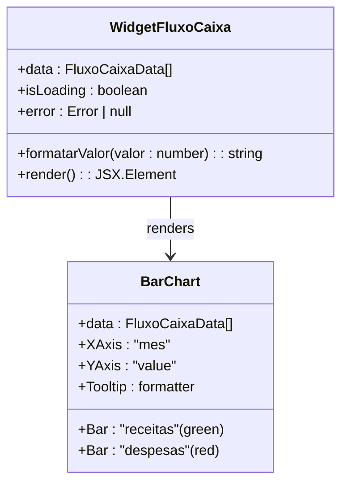

**Diagram sources**
- [widget-fluxo-caixa.tsx](file://app/(dashboard)/dashboard/components/widgets/widget-fluxo-caixa.tsx#L1-L68)

### Data Structure
The cash flow data follows a specific structure that includes monthly financial metrics:

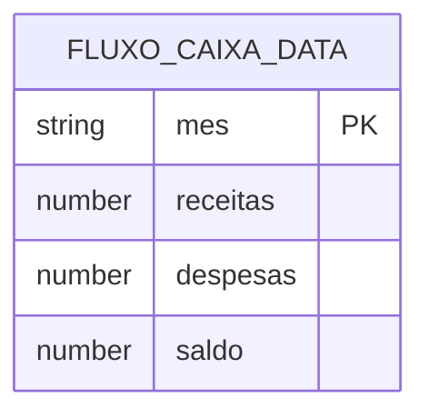

**Section sources**
- [widget-fluxo-caixa.tsx](file://app/(dashboard)/dashboard/components/widgets/widget-fluxo-caixa.tsx#L1-L68)

## Integration with Acordos Condenações
The Financial Overview feature integrates with the acordos-condenacoes module to include financial obligations from legal settlements in the overall financial picture. This integration ensures that all financial commitments, including those arising from legal agreements, are accounted for in the dashboard metrics.

### Data Integration Points
The system connects financial data from legal agreements to the general financial reporting through several integration points:

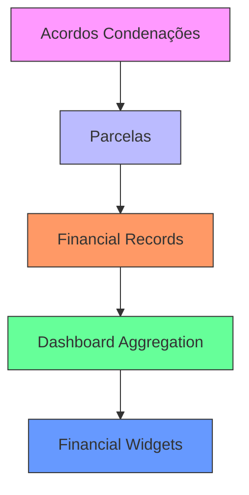

**Diagram sources**
- [acordos-condenacoes.service.ts](file://backend/acordos-condenacoes/services/acordos-condenacoes/acordos-condenacoes.service.ts)

### Financial Impact Calculation
When a legal agreement includes financial obligations, the system calculates the impact on the overall financial position by:
1. Creating financial records for each installment
2. Assigning appropriate account categories
3. Setting due dates for payment tracking
4. Including the obligations in cash flow projections

**Section sources**
- [acordos-condenacoes.service.ts](file://backend/acordos-condenacoes/services/acordos-condenacoes/acordos-condenacoes.service.ts)

## Currency Formatting and Localization
The system implements proper currency formatting for Brazilian Real (BRL) to ensure financial data is presented in a familiar and standardized format for users.

### Formatting Implementation
Currency formatting is implemented consistently across all financial widgets using the Intl.NumberFormat API:

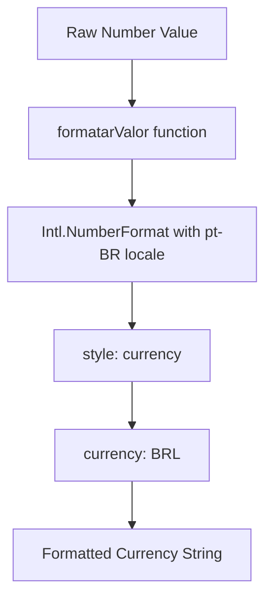

**Diagram sources**
- [widget-saldo-contas.tsx](file://app/(dashboard)/dashboard/components/widgets/widget-saldo-contas.tsx#L10-L11)
- [widget-contas-pagar-receber.tsx](file://app/(dashboard)/dashboard/components/widgets/widget-contas-pagar-receber.tsx#L10-L11)
- [widget-fluxo-caixa.tsx](file://app/(dashboard)/dashboard/components/widgets/widget-fluxo-caixa.tsx#L11-L12)

### Consistent Formatting Approach
All financial widgets use the same formatting function to ensure consistency in currency presentation:

```typescript
const formatarValor = (valor: number) =>
  new Intl.NumberFormat('pt-BR', { style: 'currency', currency: 'BRL' }).format(valor);
```

This approach guarantees that all financial values are displayed with the correct currency symbol (R$), decimal separator (comma), and thousand separator (period) according to Brazilian conventions.

**Section sources**
- [widget-saldo-contas.tsx](file://app/(dashboard)/dashboard/components/widgets/widget-saldo-contas.tsx#L10-L11)
- [widget-contas-pagar-receber.tsx](file://app/(dashboard)/dashboard/components/widgets/widget-contas-pagar-receber.tsx#L10-L11)
- [widget-fluxo-caixa.tsx](file://app/(dashboard)/dashboard/components/widgets/widget-fluxo-caixa.tsx#L11-L12)

## Performance Optimization
The system implements several performance optimizations to handle large financial datasets efficiently, ensuring responsive dashboard loading even with extensive financial records.

### Caching Strategy
The backend implements a comprehensive caching strategy to reduce database load and improve response times:

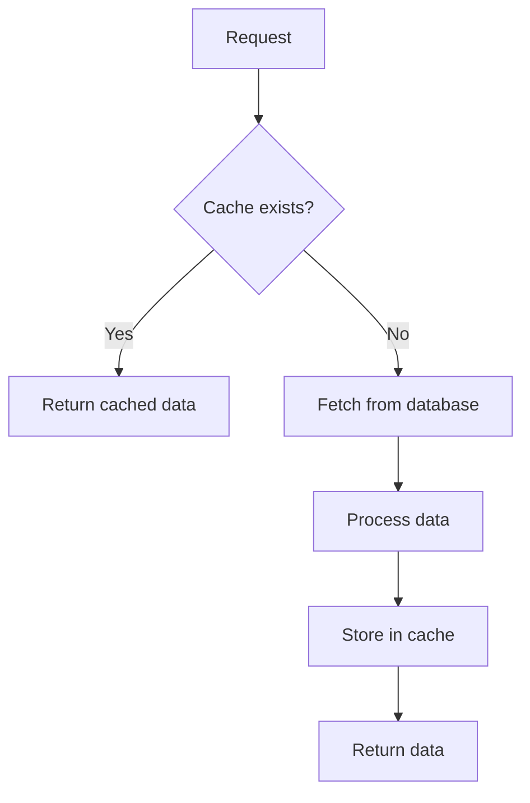

**Diagram sources**
- [dashboard-usuario.service.ts](file://backend/dashboard/services/dashboard/dashboard-usuario.service.ts)

### Data Fetching Optimization
The system optimizes data fetching through several techniques:
- **Batch queries**: Multiple financial metrics are retrieved in a single database query
- **Selective field retrieval**: Only necessary fields are fetched from the database
- **Pagination**: Large datasets are paginated to reduce payload size
- **Lazy loading**: Non-critical data is loaded after initial page render

**Section sources**
- [dashboard-usuario.service.ts](file://backend/dashboard/services/dashboard/dashboard-usuario.service.ts)

## Common Issues and Troubleshooting
This section addresses common issues that may arise when using the Financial Overview feature and provides guidance for troubleshooting and resolution.

### Data Discrepancies
When financial data appears incorrect or inconsistent, consider the following troubleshooting steps:
1. Verify that all financial records have been properly categorized
2. Check that reconciliation status is correctly set for all transactions
3. Ensure that date ranges are properly configured for the desired period
4. Confirm that currency formatting is consistently applied

### Performance Issues
If the dashboard loads slowly or becomes unresponsive:
1. Check network connectivity and API response times
2. Verify that caching is functioning properly
3. Monitor database query performance
4. Consider implementing additional indexing on frequently queried fields

### Integration Problems
When integrating with the acordos-condenacoes module:
1. Verify that financial records are being created for all agreement installments
2. Check that account categories are properly assigned
3. Ensure that due dates are correctly set and visible in the payment tracking system

**Section sources**
- [widget-fluxo-caixa.tsx](file://app/(dashboard)/dashboard/components/widgets/widget-fluxo-caixa.tsx)
- [widget-contas-pagar-receber.tsx](file://app/(dashboard)/dashboard/components/widgets/widget-contas-pagar-receber.tsx)
- [widget-saldo-contas.tsx](file://app/(dashboard)/dashboard/components/widgets/widget-saldo-contas.tsx)
- [dashboard-usuario.service.ts](file://backend/dashboard/services/dashboard/dashboard-usuario.service.ts)