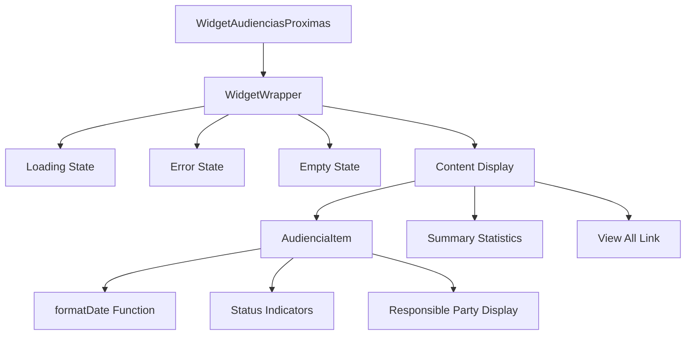
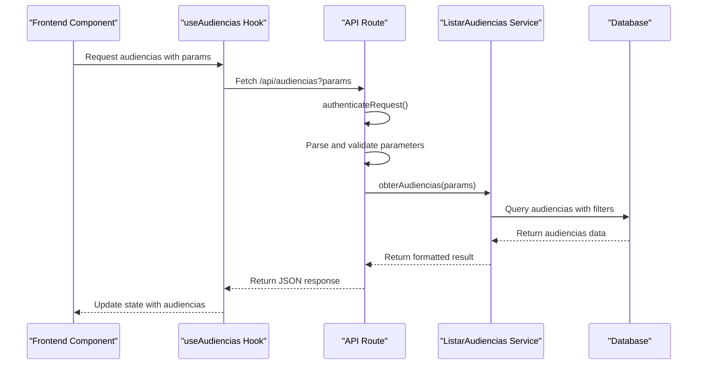
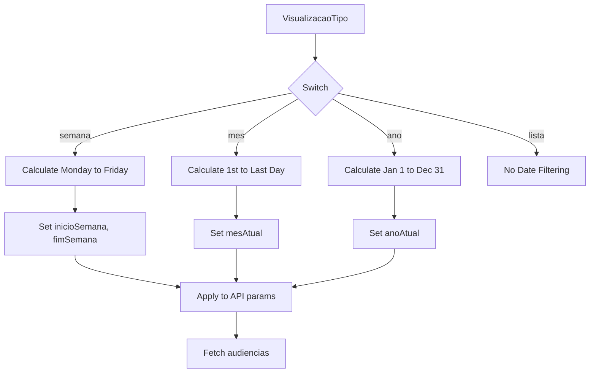
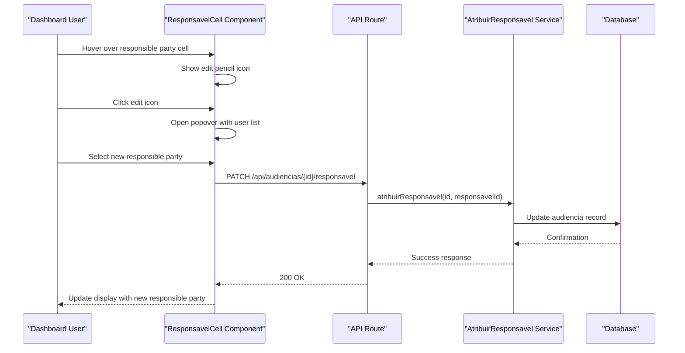
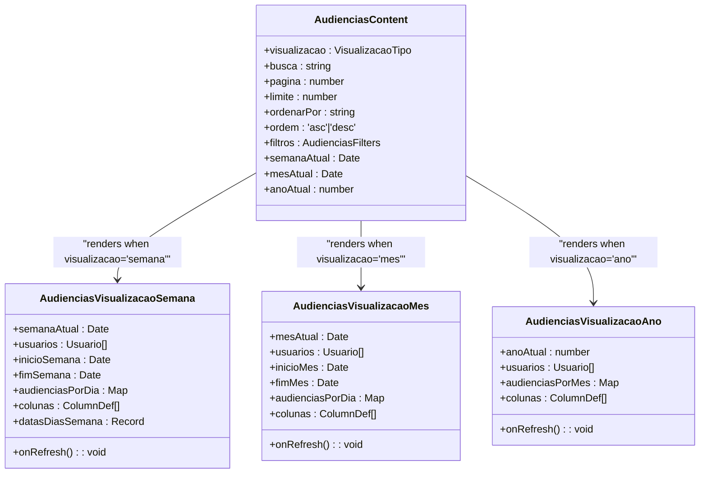

# Hearing Calendar

<cite>
**Referenced Files in This Document**   
- [widget-audiencias-proximas.tsx](file://app/(dashboard)/dashboard/components/widgets/widget-audiencias-proximas.tsx)
- [audiencias-content.tsx](file://app/(dashboard)/audiencias/components/audiencias-content.tsx)
- [use-audiencias.ts](file://app/_lib/hooks/use-audiencias.ts)
- [route.ts](file://app/api/audiencias/route.ts)
- [listar-audiencias.service.ts](file://backend/audiencias/services/listar-audiencias.service.ts)
- [audiencias-visualizacao-semana.tsx](file://app/(dashboard)/audiencias/components/audiencias-visualizacao-semana.tsx)
- [audiencias-visualizacao-mes.tsx](file://app/(dashboard)/audiencias/components/audiencias-visualizacao-mes.tsx)
- [audiencias-visualizacao-ano.tsx](file://app/(dashboard)/audiencias/components/audiencias-visualizacao-ano.tsx)
- [audiencia-detalhes-dialog.tsx](file://app/(dashboard)/audiencias/components/audiencia-detalhes-dialog.tsx)
- [audiencias-toolbar-filters.tsx](file://app/(dashboard)/audiencias/components/audiencias-toolbar-filters.tsx)
- [widget-wrapper.tsx](file://app/(dashboard)/dashboard/components/widgets/widget-wrapper.tsx)
- [types.ts](file://backend/types/dashboard/types.ts)
- [audiencias.ts](file://types/domain/audiencias.ts)
</cite>

## Table of Contents
1. [Introduction](#introduction)
2. [Widget Implementation](#widget-implementation)
3. [Data Fetching and Processing](#data-fetching-and-processing)
4. [Time-Based Filtering](#time-based-filtering)
5. [Responsible Party Assignment](#responsible-party-assignment)
6. [Calendar Views](#calendar-views)
7. [Relationship with Full Hearing Management](#relationship-with-full-hearing-management)
8. [Common Issues and Solutions](#common-issues-and-solutions)
9. [Conclusion](#conclusion)

## Introduction

The Hearing Calendar feature in the Sinesys Dashboard UI provides a comprehensive visualization of upcoming hearings through the widget-audiencias-proximas component. This widget displays a summary of the most immediate hearings, offering quick access to critical information such as date, time, location, and responsible parties. The implementation integrates seamlessly with the dashboard layout, providing users with an at-a-glance view of their upcoming judicial commitments.

The feature supports multiple time-based filtering options (year, month, week) and displays responsible party assignments, enabling users to efficiently manage their hearing schedules. The widget serves as a gateway to the full hearing management page, where users can access detailed information and perform comprehensive actions on hearing records.

**Section sources**
- [widget-audiencias-proximas.tsx](file://app/(dashboard)/dashboard/components/widgets/widget-audiencias-proximas.tsx#L1-L210)
- [audiencias-content.tsx](file://app/(dashboard)/audiencias/components/audiencias-content.tsx#L1-L834)

## Widget Implementation

The widget-audiencias-proximas component is implemented as a React client component that displays upcoming hearings in a compact, information-dense format. The widget uses the WidgetWrapper component to provide a consistent UI pattern across the dashboard, including a title, icon, loading states, and error handling.

The component accepts several props including the list of upcoming hearings, summary statistics, loading state, error messages, and callback functions. It displays up to four upcoming hearings, with a "View more" link that navigates to the full hearing management page when there are additional hearings beyond the initial four.



**Diagram sources **
- [widget-audiencias-proximas.tsx](file://app/(dashboard)/dashboard/components/widgets/widget-audiencias-proximas.tsx#L1-L210)
- [widget-wrapper.tsx](file://app/(dashboard)/dashboard/components/widgets/widget-wrapper.tsx#L1-L157)

**Section sources**
- [widget-audiencias-proximas.tsx](file://app/(dashboard)/dashboard/components/widgets/widget-audiencias-proximas.tsx#L1-L210)

## Data Fetching and Processing

The hearing data is fetched through a well-structured API endpoint at `/api/audiencias` that supports comprehensive filtering, pagination, and sorting capabilities. The frontend uses the `useAudiencias` custom hook to manage the data fetching process, which handles loading states, error conditions, and response parsing.

The data fetching process follows a structured flow:
1. Authentication is validated through the `authenticateRequest` function
2. Query parameters are parsed and validated
3. The `obterAudiencias` service function is called with the parsed parameters
4. The response is formatted and returned as JSON



**Diagram sources **
- [use-audiencias.ts](file://app/_lib/hooks/use-audiencias.ts#L1-L130)
- [route.ts](file://app/api/audiencias/route.ts#L1-L499)
- [listar-audiencias.service.ts](file://backend/audiencias/services/listar-audiencias.service.ts#L1-L26)

**Section sources**
- [use-audiencias.ts](file://app/_lib/hooks/use-audiencias.ts#L1-L130)
- [route.ts](file://app/api/audiencias/route.ts#L1-L499)

## Time-Based Filtering

The Hearing Calendar implements sophisticated time-based filtering for year, month, and week views. Each view applies specific date range filters to the API request, ensuring that only relevant hearings are displayed. The filtering is implemented through the `filtrosData` useMemo hook in the audiencias-content component, which calculates the appropriate date ranges based on the current view and selected period.

For the week view, the system calculates the Monday to Friday range of the current week. For the month view, it calculates the first to last day of the selected month. For the year view, it covers January 1st to December 31st of the selected year. Users can navigate between periods using the navigation controls, which update the date state and trigger a new data fetch.



**Diagram sources **
- [audiencias-content.tsx](file://app/(dashboard)/audiencias/components/audiencias-content.tsx#L555-L585)
- [audiencias-visualizacao-semana.tsx](file://app/(dashboard)/audiencias/components/audiencias-visualizacao-semana.tsx#L640-L658)
- [audiencias-visualizacao-mes.tsx](file://app/(dashboard)/audiencias/components/audiencias-visualizacao-mes.tsx)
- [audiencias-visualizacao-ano.tsx](file://app/(dashboard)/audiencias/components/audiencias-visualizacao-ano.tsx)

**Section sources**
- [audiencias-content.tsx](file://app/(dashboard)/audiencias/components/audiencias-content.tsx#L555-L585)

## Responsible Party Assignment

The Hearing Calendar feature includes robust responsible party assignment functionality, allowing users to assign team members to specific hearings. This is implemented through a dedicated column in the hearing tables and a popover interface that appears on hover. The assignment is stored in the `responsavel_id` field of the audiencia record and displayed prominently in the widget and detailed views.

When a user clicks the edit button on a responsible party cell, a popover displays a list of active users from which the responsible party can be selected. The selection is sent to the API endpoint `/api/audiencias/[id]/responsavel` via a PATCH request, which updates the responsible party assignment in the database. The interface provides immediate visual feedback, showing the current responsible party's name and allowing for quick changes.



**Diagram sources **
- [audiencias-content.tsx](file://app/(dashboard)/audiencias/components/audiencias-content.tsx#L255-L303)
- [route.ts](file://app/api/audiencias/[id]/responsavel/route.ts)
- [types.ts](file://backend/types/dashboard/types.ts)

**Section sources**
- [audiencias-content.tsx](file://app/(dashboard)/audiencias/components/audiencias-content.tsx#L255-L303)

## Calendar Views

The Hearing Calendar provides multiple calendar views to accommodate different user preferences and use cases. The week view displays hearings organized by day in a tabbed interface, with each tab representing a weekday (Monday through Friday). The month view shows all hearings in a grid format, while the year view provides a high-level overview of hearings across all months.

Each view is implemented as a separate component (AudienciasVisualizacaoSemana, AudienciasVisualizacaoMes, AudienciasVisualizacaoAno) that receives the filtered hearing data and renders it according to the specific view requirements. The components use React's useMemo hook to optimize performance by memoizing expensive calculations such as date range computations and data filtering.



**Diagram sources **
- [audiencias-visualizacao-semana.tsx](file://app/(dashboard)/audiencias/components/audiencias-visualizacao-semana.tsx#L629-L778)
- [audiencias-visualizacao-mes.tsx](file://app/(dashboard)/audiencias/components/audiencias-visualizacao-mes.tsx)
- [audiencias-visualizacao-ano.tsx](file://app/(dashboard)/audiencias/components/audiencias-visualizacao-ano.tsx)
- [audiencias-content.tsx](file://app/(dashboard)/audiencias/components/audiencias-content.tsx#L526-L834)

**Section sources**
- [audiencias-visualizacao-semana.tsx](file://app/(dashboard)/audiencias/components/audiencias-visualizacao-semana.tsx#L629-L778)

## Relationship with Full Hearing Management

The Hearing Calendar widget serves as a summary view that connects directly to the full hearing management system. The "View all" link in the widget header navigates users to the complete hearing management page at `/audiencias`, which provides comprehensive functionality for managing hearing records.

The full hearing management page shares the same data fetching and processing logic as the widget but presents the information in a more detailed format with additional filtering options, sorting capabilities, and bulk actions. Both the widget and the full page use the same underlying API endpoint and data structures, ensuring consistency across the application.

```mermaid
flowchart LR
A[Dashboard] --> B[widget-audiencias-proximas]
B --> C[Summary View]
C --> D[4 Upcoming Hearings]
C --> E[Quick Stats]
C --> F[Responsible Parties]
C --> G[View All Link]
G --> H[/audiencias Page]
H --> I[Complete Hearing Management]
I --> J[Advanced Filtering]
I --> K[Sorting Options]
I --> L[Bulk Actions]
I --> M[Detailed Views]
B --> N[Shared Data Layer]
H --> N
N --> O[useAudiencias Hook]
O --> P[/api/audiencias Endpoint]
```

**Diagram sources **
- [widget-audiencias-proximas.tsx](file://app/(dashboard)/dashboard/components/widgets/widget-audiencias-proximas.tsx#L156-L158)
- [audiencias-content.tsx](file://app/(dashboard)/audiencias/components/audiencias-content.tsx#L526-L834)

**Section sources**
- [widget-audiencias-proximas.tsx](file://app/(dashboard)/dashboard/components/widgets/widget-audiencias-proximas.tsx#L156-L158)

## Common Issues and Solutions

### Date Formatting Across Time Zones

The Hearing Calendar handles date formatting across time zones by normalizing dates to the local timezone before display. The `formatDate` function in the widget component extracts the date portion from ISO strings and creates a new Date object with the local timezone. This ensures consistent display regardless of the user's location.

```mermaid
flowchart TD
A[ISO Date String] --> B{Contains 'T'?}
B --> |Yes| C[Extract Date Portion]
B --> |No| D[Use Full String]
C --> E[Create Date with T00:00:00]
D --> E
E --> F[Set Today's Time to 00:00:00]
F --> G[Compare with Today/Tomorrow]
G --> H{Special Case?}
H --> |Today| I[Return "Today"]
H --> |Tomorrow| J[Return "Tomorrow"]
H --> |Other| K[Format as DD/MM]
```

**Diagram sources **
- [widget-audiencias-proximas.tsx](file://app/(dashboard)/dashboard/components/widgets/widget-audiencias-proximas.tsx#L20-L45)

### Handling Recurring Hearings

The system handles recurring hearings by treating each occurrence as a separate record in the database. This approach allows for individual management of each hearing instance, including different times, locations, or responsible parties. The API supports filtering for recurring patterns through date range queries, enabling users to view all instances of a recurring hearing within a specified period.

### Performance Optimization for Calendar Views

Performance is optimized through several strategies:
- Memoization of expensive calculations using React.useMemo
- Debounced search input to reduce API calls
- Conditional data fetching based on view initialization
- Server-side pagination to limit data transfer
- Selective rendering of only visible data

### Accessibility Considerations for Date Navigation

The calendar views implement several accessibility features:
- Keyboard navigation between date tabs in the week view
- ARIA labels for interactive elements
- Proper heading hierarchy for screen readers
- High contrast modes for better visibility
- Tooltip providers for additional context

**Section sources**
- [widget-audiencias-proximas.tsx](file://app/(dashboard)/dashboard/components/widgets/widget-audiencias-proximas.tsx#L20-L45)
- [audiencias-content.tsx](file://app/(dashboard)/audiencias/components/audiencias-content.tsx#L551-L553)
- [audiencias-visualizacao-semana.tsx](file://app/(dashboard)/audiencias/components/audiencias-visualizacao-semana.tsx#L741-L778)

## Conclusion

The Hearing Calendar feature in the Sinesys Dashboard UI provides a comprehensive solution for visualizing and managing upcoming hearings. Through the widget-audiencias-proximas component, users gain immediate access to critical hearing information directly from the dashboard. The implementation leverages a robust data fetching system with the useAudiencias hook and API routes that support extensive filtering and sorting options.

The feature's time-based filtering (year, month, week) allows users to view their hearing schedule at different levels of granularity, while the responsible party assignment system ensures accountability and proper delegation of judicial responsibilities. The seamless integration between the dashboard widget and the full hearing management page creates a cohesive user experience that balances quick overviews with detailed management capabilities.

By addressing common issues such as date formatting across time zones, handling recurring hearings, performance optimization, and accessibility considerations, the Hearing Calendar provides a reliable and user-friendly interface for legal professionals to manage their judicial commitments effectively.