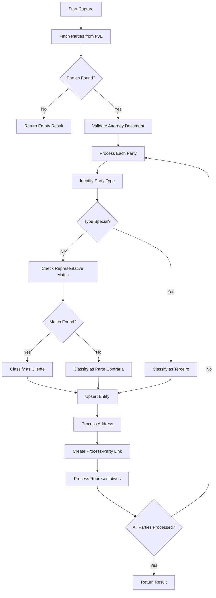
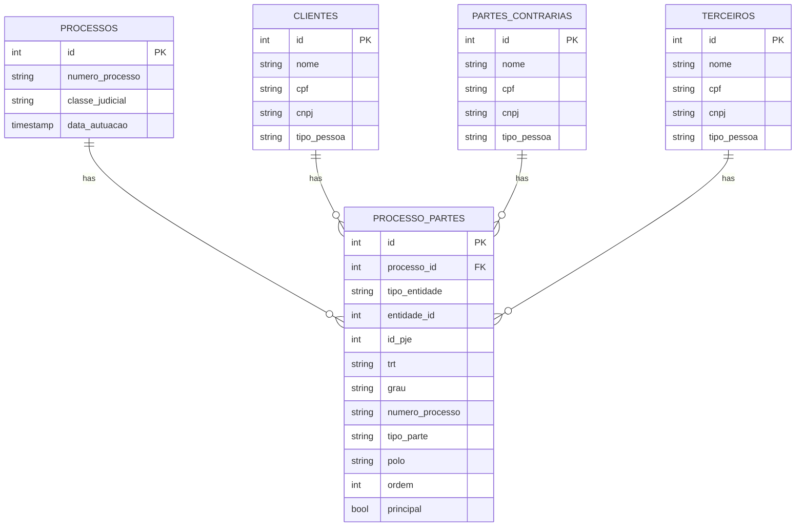
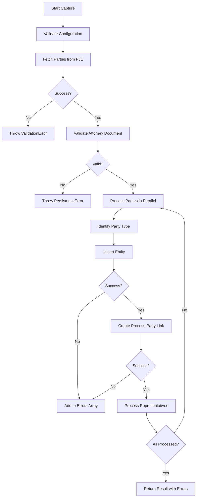

# Partes Deprecated Services

<cite>
**Referenced Files in This Document**   
- [identificacao-partes.service.ts](file://backend/captura/services/partes/identificacao-partes.service.ts)
- [partes-capture.service.ts](file://backend/captura/services/partes/partes-capture.service.ts)
- [processo-partes-persistence.service.ts](file://backend/processo-partes/services/persistence/processo-partes-persistence.service.ts)
- [terceiro-persistence.service.ts](file://backend/terceiros/services/persistence/terceiro-persistence.service.ts)
- [domain.ts](file://src/core/partes/domain.ts)
- [service.ts](file://src/core/partes/service.ts)
- [atualizar-cliente.service.ts](file://backend/clientes/services/clientes/atualizar-cliente.service.ts)
- [criar-cliente.service.ts](file://backend/clientes/services/clientes/criar-cliente.service.ts)
- [buscar-cliente.service.ts](file://backend/clientes/services/clientes/buscar-cliente.service.ts)
- [listar-clientes.service.ts](file://backend/clientes/services/clientes/listar-clientes.service.ts)
- [cliente-persistence.service.ts](file://backend/clientes/services/persistence/cliente-persistence.service.ts)
- [atualizar-parte-contraria.service.ts](file://backend/partes-contrarias/services/partes-contrarias/atualizar-parte-contraria.service.ts)
- [criar-parte-contraria.service.ts](file://backend/partes-contrarias/services/partes-contrarias/criar-parte-contraria.service.ts)
- [buscar-parte-contraria.service.ts](file://backend/partes-contrarias/services/partes-contrarias/buscar-parte-contraria.service.ts)
- [listar-partes-contrarias.service.ts](file://backend/partes-contrarias/services/partes-contrarias/listar-partes-contrarias.service.ts)
- [parte-contraria-persistence.service.ts](file://backend/partes-contrarias/services/persistence/parte-contraria-persistence.service.ts)
</cite>

## Table of Contents
1. [Introduction](#introduction)
2. [Deprecated Services Overview](#deprecated-services-overview)
3. [Migration to Core Partes System](#migration-to-core-partes-system)
4. [Architecture and Data Flow](#architecture-and-data-flow)
5. [Service Components Analysis](#service-components-analysis)
6. [Persistence Layer Changes](#persistence-layer-changes)
7. [Type System Evolution](#type-system-evolution)
8. [Configuration and Error Handling](#configuration-and-error-handling)
9. [Conclusion](#conclusion)

## Introduction

The Sinesys platform has undergone a significant architectural evolution in its partes (parties) management system. This document details the deprecated services that were previously used for managing clients, opposing parties, and third parties in legal processes, and outlines the migration to a unified core partes system. The deprecated services were organized in separate modules for clientes (clients), partes_contrarias (opposing parties), and terceiros (third parties), each with their own service and persistence layers. These have been consolidated into a single, unified system under `src/core/partes` to improve maintainability, reduce code duplication, and provide a consistent interface for party management across the application.

The migration represents a shift from a fragmented approach to a centralized domain model that treats all party types uniformly while maintaining their specific characteristics. This change was driven by the need to streamline the capture process for parties from the PJE (Processo Judicial Eletrônico) system, improve data consistency, and simplify the API surface for frontend consumers.

**Section sources**
- [identificacao-partes.service.ts](file://backend/captura/services/partes/identificacao-partes.service.ts#L1-L449)
- [partes-capture.service.ts](file://backend/captura/services/partes/partes-capture.service.ts#L1-L800)

## Deprecated Services Overview

The deprecated services were organized in a modular structure with separate directories for each party type: clientes, partes-contrarias, and terceiros. Each module contained service files for business logic operations (create, update, search, list) and persistence files for database operations. These services were marked with `@deprecated` comments indicating they have been migrated to the new core partes system.

The primary deprecated services include:
- Client management services: `atualizar-cliente.service.ts`, `buscar-cliente.service.ts`, `criar-cliente.service.ts`, and `listar-clientes.service.ts`
- Opposing party management services: `atualizar-parte-contraria.service.ts`, `buscar-parte-contraria.service.ts`, `criar-parte-contraria.service.ts`, and `listar-partes-contrarias.service.ts`
- Third party management services in the terceiros module
- Persistence services for each party type that handled database operations

These services followed a similar pattern across modules, leading to significant code duplication. Each service implemented CRUD operations for its specific party type, with similar validation logic, error handling, and database interaction patterns. The separation made it difficult to implement cross-cutting features and maintain consistency across party types.

A notable deprecated function is `buscarTerceirosPorProcesso` in the terceiros persistence service, which has been explicitly marked as obsolete. The comment indicates that third parties should now be queried through the `processo_partes` table, reflecting the new normalized data model where all party types are linked to processes through a common junction table.

**Section sources**
- [atualizar-cliente.service.ts](file://backend/clientes/services/clientes/atualizar-cliente.service.ts#L1)
- [criar-cliente.service.ts](file://backend/clientes/services/clientes/criar-cliente.service.ts#L1)
- [buscar-cliente.service.ts](file://backend/clientes/services/clientes/buscar-cliente.service.ts#L1)
- [listar-clientes.service.ts](file://backend/clientes/services/clientes/listar-clientes.service.ts#L1)
- [cliente-persistence.service.ts](file://backend/clientes/services/persistence/cliente-persistence.service.ts#L1)
- [atualizar-parte-contraria.service.ts](file://backend/partes-contrarias/services/partes-contrarias/atualizar-parte-contraria.service.ts#L1)
- [criar-parte-contraria.service.ts](file://backend/partes-contrarias/services/partes-contrarias/criar-parte-contraria.service.ts#L1)
- [buscar-parte-contraria.service.ts](file://backend/partes-contrarias/services/partes-contrarias/buscar-parte-contraria.service.ts#L1)
- [listar-partes-contrarias.service.ts](file://backend/partes-contrarias/services/partes-contrarias/listar-partes-contrarias.service.ts#L1)
- [parte-contraria-persistence.service.ts](file://backend/partes-contrarias/services/persistence/parte-contraria-persistence.service.ts#L1)
- [terceiro-persistence.service.ts](file://backend/terceiros/services/persistence/terceiro-persistence.service.ts#L590-L602)

## Migration to Core Partes System

The migration to the core partes system represents a fundamental architectural shift from multiple specialized services to a single unified domain model. The new system is implemented in `src/core/partes` and consists of domain, service, repository, and error handling components that provide a consistent interface for all party types.

The core of the new system is the `Parte` domain entity defined in `domain.ts`, which serves as a base type for all party types (clients, opposing parties, and third parties). This unified model eliminates the need for separate service implementations for each party type. The `PartesService` class in `service.ts` provides a single interface for creating, updating, searching, and listing parties, regardless of their type.

This migration has several key benefits:
- **Reduced code duplication**: Common operations are implemented once in the core service rather than replicated across multiple modules
- **Consistent behavior**: All party types follow the same business rules and validation logic
- **Simplified maintenance**: Changes to party management logic need to be made in one place rather than across multiple services
- **Improved extensibility**: New party types can be added with minimal changes to the core system

The migration also aligns with the data model changes reflected in the `processo_partes` table, which serves as a polymorphic association between processes and parties of any type. This table includes a `tipo_entidade` field that distinguishes between 'cliente', 'parte_contraria', and 'terceiro', allowing the same junction table to represent relationships with parties of any type.

**Section sources**
- [domain.ts](file://src/core/partes/domain.ts#L1-L100)
- [service.ts](file://src/core/partes/service.ts#L1-L200)
- [repository.ts](file://src/core/partes/repository.ts#L1-L150)

## Architecture and Data Flow

The architecture of the partes system revolves around the capture and persistence of party information from external sources (primarily the PJE system) into the application's database. The data flow begins with the `partes-capture.service.ts` which orchestrates the entire process of capturing parties for a legal process.

The capture process follows these steps:
1. Fetch party data from the PJE API using `obterPartesProcesso`
2. Identify the party type (client, opposing party, or third party) using the `identificarTipoParte` function
3. Persist the party data in the appropriate table (clientes, partes_contrarias, or terceiros)
4. Create a relationship between the party and the process in the `processo_partes` table
5. Process and save any representatives (advogados) associated with the party
6. Process and save any addresses associated with the party

The `identificarTipoParte` function in `identificacao-partes.service.ts` implements the business logic for determining a party's type. It uses a priority-based algorithm:
- First, it checks if the party type is in a predefined list of special types (perito, ministerio_publico, testemunha, etc.), in which case it's classified as a 'terceiro'
- Second, it checks if any of the party's representatives have a CPF/CNPJ matching the attorney who owns the credential used for capture, in which case it's classified as a 'cliente'
- Otherwise, it's classified as a 'parte_contraria'

This identification logic is crucial for the system's ability to automatically distinguish between the law firm's clients and opposing parties based on representation information from the PJE system.

**Diagram sources**
- [partes-capture.service.ts](file://backend/captura/services/partes/partes-capture.service.ts#L345-L572)
- [identificacao-partes.service.ts](file://backend/captura/services/partes/identificacao-partes.service.ts#L130-L234)

## Service Components Analysis

The service components in the deprecated system followed a consistent pattern across the clientes, partes-contrarias, and terceiros modules. Each module contained service files for CRUD operations and a persistence service file for database interactions. The services were relatively simple, primarily delegating to the persistence layer with minimal business logic.

For example, the client services (`atualizar-cliente.service.ts`, `buscar-cliente.service.ts`, etc.) implemented basic operations like updating client information, searching for clients by name, creating new clients, and listing clients with pagination. These services imported the corresponding persistence functions from `cliente-persistence.service.ts` and exposed them through a service interface.

The persistence services were more complex, implementing database operations with proper error handling and type conversion. The `cliente-persistence.service.ts` file, for instance, contained functions like `upsertClientePorCPF`, `upsertClientePorCNPJ`, `buscarClientePorCPF`, and `buscarClientePorCNPJ`. These functions used the Supabase client to interact with the database, converting between database rows and TypeScript objects using converter functions.

The new core partes system consolidates these patterns into a single service implementation. The `PartesService` in `src/core/partes/service.ts` provides a unified interface for all party operations, eliminating the need for separate service implementations. This service uses a repository pattern to abstract the data access layer, making it easier to maintain and test.

The capture service (`partes-capture.service.ts`) represents a higher-level service that orchestrates multiple operations across different domains. It coordinates the identification, persistence, and relationship creation for parties, handling errors gracefully and providing detailed results for monitoring and debugging. This service uses configuration values from `config.ts` to control concurrency, retry behavior, and performance thresholds.

**Section sources**
- [atualizar-cliente.service.ts](file://backend/clientes/services/clientes/atualizar-cliente.service.ts#L1-L50)
- [criar-cliente.service.ts](file://backend/clientes/services/clientes/criar-cliente.service.ts#L1-L50)
- [buscar-cliente.service.ts](file://backend/clientes/services/clientes/buscar-cliente.service.ts#L1-L50)
- [listar-clientes.service.ts](file://backend/clientes/services/clientes/listar-clientes.service.ts#L1-L50)
- [cliente-persistence.service.ts](file://backend/clientes/services/persistence/cliente-persistence.service.ts#L1-L100)
- [partes-capture.service.ts](file://backend/captura/services/partes/partes-capture.service.ts#L1-L100)

## Persistence Layer Changes

The persistence layer has undergone significant changes as part of the migration to the core partes system. The deprecated system had separate persistence services for each party type (`cliente-persistence.service.ts`, `parte-contraria-persistence.service.ts`, `terceiro-persistence.service.ts`), each implementing similar CRUD operations for their respective tables.

These persistence services followed a consistent pattern:
- Converter functions to transform database rows into TypeScript objects
- Error mapping functions to provide meaningful error messages
- CRUD operations (create, read, update, delete) with proper validation
- List operations with filtering, sorting, and pagination
- Upsert operations that handle both creation and updates

The new core partes system consolidates these persistence operations into a single repository implementation in `src/core/partes/repository.ts`. This repository provides a unified interface for accessing party data regardless of type, using the `tipo_entidade` field to distinguish between different party types in queries.

A key change in the persistence layer is the use of the `processo_partes` table as the central junction table for process-party relationships. This table replaces the need for separate relationship tables for each party type and enables polymorphic associations between processes and parties. The table includes fields like `tipo_entidade` (to distinguish party types), `entidade_id` (the foreign key to the specific party), `processo_id` (the foreign key to the process), and various metadata fields from the PJE system.

The `processo-partes-persistence.service.ts` file implements operations on this junction table, including creating, updating, and deleting process-party relationships, as well as querying for parties of a process or processes of a party. This service uses the Supabase client to interact with the database and includes comprehensive error handling for common database issues like foreign key violations and unique constraint violations.

**Diagram sources**
- [processo-partes-persistence.service.ts](file://backend/processo-partes/services/persistence/processo-partes-persistence.service.ts#L86-L397)
- [cliente-persistence.service.ts](file://backend/clientes/services/persistence/cliente-persistence.service.ts#L1-L100)
- [parte-contraria-persistence.service.ts](file://backend/partes-contrarias/services/persistence/parte-contraria-persistence.service.ts#L1-L100)
- [terceiro-persistence.service.ts](file://backend/terceiros/services/persistence/terceiro-persistence.service.ts#L1-L100)

## Type System Evolution

The type system for partes has evolved significantly with the migration to the core system. The deprecated services used separate type definitions for each party type, located in `backend/types/partes/` with files like `clientes-types.ts` and `partes-contrarias-types.ts`. These types were marked as deprecated with comments indicating they have been migrated to `src/core/partes/domain`.

The new type system is centered around the `Parte` domain entity defined in `src/core/partes/domain.ts`. This unified type serves as a base for all party types and includes common fields like `id`, `nome`, `tipo_pessoa`, `cpf`, `cnpj`, `emails`, and contact information. Specific party types extend this base type or are distinguished by a `tipo_entidade` field in the data model.

The capture service uses specific types defined in `backend/captura/services/partes/types.ts`:
- `TipoParteClassificacao`: A union type representing the three possible party classifications ('cliente', 'parte_contraria', 'terceiro')
- `CapturaPartesErro`: An interface for representing errors that occur during party capture
- `CapturaPartesResult`: An interface for the result of a party capture operation, including counters for successfully processed parties and a list of errors

These types are designed to support the capture workflow, providing a clear contract for the service's input and output. The `CapturaPartesResult` type includes detailed metrics like the number of clients, opposing parties, and third parties processed, as well as performance information like execution duration.

The persistence layer uses additional types for operation parameters and results:
- `CriarProcessoParteParams` and `AtualizarProcessoParteParams` for creating and updating process-party relationships
- `ListarProcessoPartesParams` and `ListarProcessoPartesResult` for paginated listing operations
- `BuscarPartesPorProcessoParams` and `ParteComDadosCompletos` for querying parties of a process

This type system ensures type safety throughout the partes management workflow, from capture to persistence to querying.

**Section sources**
- [types.ts](file://backend/captura/services/partes/types.ts#L1-L162)
- [domain.ts](file://src/core/partes/domain.ts#L1-L100)
- [clientes-types.ts](file://backend/types/partes/clientes-types.ts#L1)
- [partes-contrarias-types.ts](file://backend/types/partes/partes-contrarias-types.ts#L1)

## Configuration and Error Handling

The partes capture system includes comprehensive configuration and error handling mechanisms to ensure reliability and observability. The configuration is centralized in `backend/captura/services/partes/config.ts` as the `CAPTURA_CONFIG` object, which defines various parameters for the capture process.

Key configuration options include:
- **Concurrency settings**: `MAX_CONCURRENT_PARTES` and `MAX_CONCURRENT_REPRESENTANTES` control the level of parallelism during capture
- **Retry mechanism**: `RETRY_MAX_ATTEMPTS`, `RETRY_BASE_DELAY_MS`, and `RETRY_MAX_DELAY_MS` configure the retry behavior for transient failures
- **Performance monitoring**: `PERFORMANCE_THRESHOLD_MS` defines a threshold for logging performance warnings
- **Feature flags**: `ENABLE_PARALLEL_PROCESSING`, `ENABLE_DISTRIBUTED_LOCK`, and `ENABLE_RETRY` allow features to be toggled at runtime
- **Validation settings**: `STRICT_VALIDATION` and `VALIDATE_REQUIRED_FIELDS` control the strictness of data validation

The system implements robust error handling at multiple levels:
- **Validation errors**: Thrown for invalid input data, such as missing required fields or invalid document numbers
- **Persistence errors**: Thrown for database operation failures, with specific error codes mapped to meaningful messages
- **Capture errors**: Collected during the capture process and included in the result object, allowing partial success when some parties fail to process
- **Retry mechanism**: Implemented using the `withRetry` utility function, which applies exponential backoff for transient failures

The `capturarPartesProcesso` function in `partes-capture.service.ts` demonstrates this error handling approach. It processes parties in parallel with controlled concurrency, catches errors for individual parties, and continues processing remaining parties. Errors are collected in the result object rather than aborting the entire operation, allowing the system to make progress even when some data is problematic.

Logging is integrated throughout the capture process, with different log levels for different types of information:
- **Info logs**: For major milestones in the capture process
- **Warning logs**: For non-critical issues like parties without representatives
- **Debug logs**: For detailed information about individual operations, useful for troubleshooting
- **Error logs**: For failures that prevent processing of a party

This comprehensive error handling and logging strategy ensures the system is resilient to failures and provides sufficient information for monitoring and debugging.

**Diagram sources**
- [config.ts](file://backend/captura/services/partes/config.ts#L6-L69)
- [partes-capture.service.ts](file://backend/captura/services/partes/partes-capture.service.ts#L345-L572)
- [errors.ts](file://backend/captura/services/partes/errors.ts#L1-L50)

## Conclusion

The deprecated partes services in the Sinesys platform have been replaced by a unified core partes system that provides a more maintainable, consistent, and scalable approach to party management. The migration from separate services for clients, opposing parties, and third parties to a single domain model has eliminated code duplication and simplified the architecture.

The new system, implemented in `src/core/partes`, provides a unified interface for all party operations while maintaining the ability to distinguish between different party types through the `tipo_entidade` field. This approach aligns with the normalized data model using the `processo_partes` table as a polymorphic association between processes and parties of any type.

The capture process, orchestrated by `partes-capture.service.ts`, demonstrates a robust implementation with parallel processing, retry mechanisms, comprehensive error handling, and detailed logging. The system is designed to be resilient to failures, allowing partial success when some parties cannot be processed while still making progress on the rest.

The deprecation of the old services is clearly marked with `@deprecated` comments, and specific functions like `buscarTerceirosPorProcesso` have been explicitly marked as obsolete with guidance on the preferred approach. This clear communication helps developers understand the current architecture and avoid using outdated components.

The evolution of the partes system reflects a maturation of the platform's architecture, moving from a fragmented, duplication-prone design to a cohesive, domain-driven model that will be easier to maintain and extend in the future.

**Section sources**
- [identificacao-partes.service.ts](file://backend/captura/services/partes/identificacao-partes.service.ts#L1-L449)
- [partes-capture.service.ts](file://backend/captura/services/partes/partes-capture.service.ts#L1-L800)
- [processo-partes-persistence.service.ts](file://backend/processo-partes/services/persistence/processo-partes-persistence.service.ts#L1-L398)
- [terceiro-persistence.service.ts](file://backend/terceiros/services/persistence/terceiro-persistence.service.ts#L590-L602)
- [domain.ts](file://src/core/partes/domain.ts#L1-L100)
- [service.ts](file://src/core/partes/service.ts#L1-L200)