# Financial Core Services

<cite>
**Referenced Files in This Document**   
- [dashboard-financeiro.service.ts](file://backend/financeiro/dashboard/services/dashboard/dashboard-financeiro.service.ts)
- [calcular-dre.service.ts](file://backend/financeiro/dre/services/dre/calcular-dre.service.ts)
- [gerenciar-orcamento.service.ts](file://backend/financeiro/orcamento/services/orcamento/gerenciar-orcamento.service.ts)
- [aprovar-orcamento.service.ts](file://backend/financeiro/orcamento/services/orcamento/aprovar-orcamento.service.ts)
- [executar-orcamento.service.ts](file://backend/financeiro/orcamento/services/orcamento/executar-orcamento.service.ts)
- [relatorios-orcamento.service.ts](file://backend/financeiro/orcamento/services/orcamento/relatorios-orcamento.service.ts)
- [pagar-conta.service.ts](file://backend/financeiro/contas-pagar/services/contas-pagar/pagar-conta.service.ts)
- [receber-conta.service.ts](file://backend/financeiro/contas-receber/services/contas-receber/receber-conta.service.ts)
- [importar-extrato.service.ts](file://backend/financeiro/conciliacao-bancaria/services/conciliacao-bancaria/importar-extrato.service.ts)
- [matching-automatico.service.ts](file://backend/financeiro/conciliacao-bancaria/services/matching/matching-automatico.service.ts)
- [obrigacoes-integracao.service.ts](file://backend/financeiro/obrigacoes/services/integracao/obrigacoes-integracao.service.ts)
- [gerar-recorrentes.service.ts](file://backend/financeiro/contas-pagar/services/contas-pagar/gerar-recorrentes.service.ts)
- [gerar-recorrentes.service.ts](file://backend/financeiro/contas-receber/services/contas-receber/gerar-recorrentes.service.ts)
- [cancelar-conta.service.ts](file://backend/financeiro/contas-pagar/services/contas-pagar/cancelar-conta.service.ts)
</cite>

## Table of Contents
1. [Introduction](#introduction)
2. [Project Structure](#project-structure)
3. [Core Components](#core-components)
4. [Architecture Overview](#architecture-overview)
5. [Detailed Component Analysis](#detailed-component-analysis)
6. [Dependency Analysis](#dependency-analysis)
7. [Performance Considerations](#performance-considerations)
8. [Troubleshooting Guide](#troubleshooting-guide)
9. [Conclusion](#conclusion)

## Introduction
The Financial Core Services documentation provides a comprehensive overview of the financial management system within the Sinesys platform. This system encompasses various financial operations including budgeting, financial statements, accounts payable and receivable, bank reconciliation, and obligation management. The architecture follows a service-oriented design with clear separation between business logic and data persistence layers. The system is designed to handle complex financial workflows while maintaining data integrity and providing robust reporting capabilities.

## Project Structure
The financial services are organized in a modular structure under the backend/financeiro directory, with each major financial function having its own dedicated module. The architecture follows a clean separation of concerns with services, persistence layers, and types clearly separated.

```mermaid
graph TD
A[Financial Core Services] --> B[Dashboard]
A --> C[DRE]
A --> D[Budget]
A --> E[Accounts Payable]
A --> F[Accounts Receivable]
A --> G[Bank Reconciliation]
A --> H[Obligations]
A --> I[Plano de Contas]
B --> B1[dashboard-financeiro.service.ts]
C --> C1[calcular-dre.service.ts]
D --> D1[gerenciar-orcamento.service.ts]
D --> D2[aprovar-orcamento.service.ts]
D --> D3[executar-orcamento.service.ts]
D --> D4[relatorios-orcamento.service.ts]
E --> E1[pagar-conta.service.ts]
E --> E2[gerar-recorrentes.service.ts]
E --> E3[cancelar-conta.service.ts]
F --> F1[receber-conta.service.ts]
F --> F2[gerar-recorrentes.service.ts]
G --> G1[importar-extrato.service.ts]
G --> G2[matching-automatico.service.ts]
H --> H1[obrigacoes-integracao.service.ts]
```

**Diagram sources**
- [dashboard-financeiro.service.ts](file://backend/financeiro/dashboard/services/dashboard/dashboard-financeiro.service.ts)
- [calcular-dre.service.ts](file://backend/financeiro/dre/services/dre/calcular-dre.service.ts)
- [gerenciar-orcamento.service.ts](file://backend/financeiro/orcamento/services/orcamento/gerenciar-orcamento.service.ts)
- [pagar-conta.service.ts](file://backend/financeiro/contas-pagar/services/contas-pagar/pagar-conta.service.ts)
- [receber-conta.service.ts](file://backend/financeiro/contas-receber/services/contas-receber/receber-conta.service.ts)
- [importar-extrato.service.ts](file://backend/financeiro/conciliacao-bancaria/services/conciliacao-bancaria/importar-extrato.service.ts)
- [obrigacoes-integracao.service.ts](file://backend/financeiro/obrigacoes/services/integracao/obrigacoes-integracao.service.ts)

**Section sources**
- [dashboard-financeiro.service.ts](file://backend/financeiro/dashboard/services/dashboard/dashboard-financeiro.service.ts)
- [calcular-dre.service.ts](file://backend/financeiro/dre/services/dre/calcular-dre.service.ts)

## Core Components
The Financial Core Services consist of several key components that handle different aspects of financial management. The Dashboard service provides financial metrics and cash flow projections. The DRE (Demonstração de Resultado do Exercício) service calculates financial statements and performance metrics. The Budget service manages the creation, approval, and execution of budgets. Accounts Payable and Receivable services handle payment and collection workflows. Bank Reconciliation automates the matching of bank transactions with financial entries. The Obligations service integrates judicial agreements with financial records.

**Section sources**
- [dashboard-financeiro.service.ts](file://backend/financeiro/dashboard/services/dashboard/dashboard-financeiro.service.ts)
- [calcular-dre.service.ts](file://backend/financeiro/dre/services/dre/calcular-dre.service.ts)
- [gerenciar-orcamento.service.ts](file://backend/financeiro/orcamento/services/orcamento/gerenciar-orcamento.service.ts)

## Architecture Overview
The Financial Core Services follow a layered architecture with clear separation between presentation, business logic, and data access layers. The system uses a service-oriented approach where each financial domain has dedicated services that encapsulate business rules and workflows.

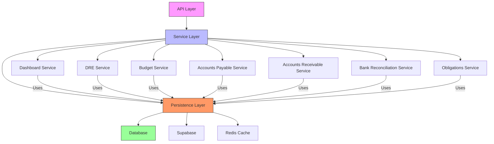

**Diagram sources**
- [dashboard-financeiro.service.ts](file://backend/financeiro/dashboard/services/dashboard/dashboard-financeiro.service.ts)
- [calcular-dre.service.ts](file://backend/financeiro/dre/services/dre/calcular-dre.service.ts)
- [gerenciar-orcamento.service.ts](file://backend/financeiro/orcamento/services/orcamento/gerenciar-orcamento.service.ts)
- [pagar-conta.service.ts](file://backend/financeiro/contas-pagar/services/contas-pagar/pagar-conta.service.ts)

## Detailed Component Analysis

### Financial Dashboard Analysis
The Financial Dashboard service provides a consolidated view of key financial metrics, cash flow projections, and financial alerts. It serves as the primary interface for financial performance monitoring.

#### For API/Service Components:
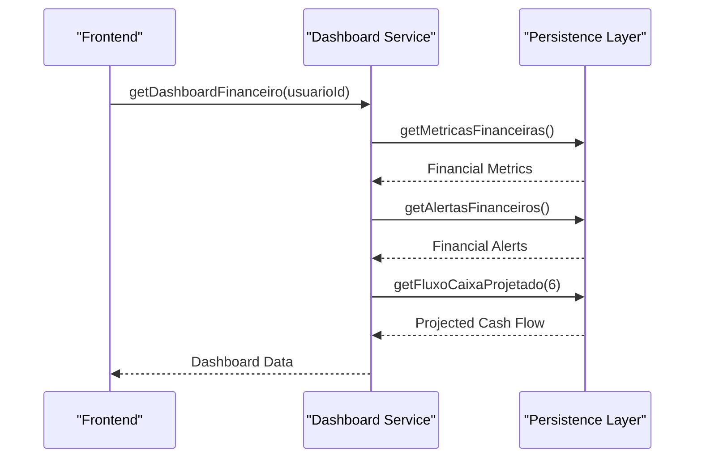

**Diagram sources**
- [dashboard-financeiro.service.ts](file://backend/financeiro/dashboard/services/dashboard/dashboard-financeiro.service.ts)

**Section sources**
- [dashboard-financeiro.service.ts](file://backend/financeiro/dashboard/services/dashboard/dashboard-financeiro.service.ts)

### DRE (Financial Statement) Analysis
The DRE service calculates the Demonstração de Resultado do Exercício (Income Statement) with comprehensive financial analysis including revenue, costs, expenses, and profitability metrics.

#### For Complex Logic Components:
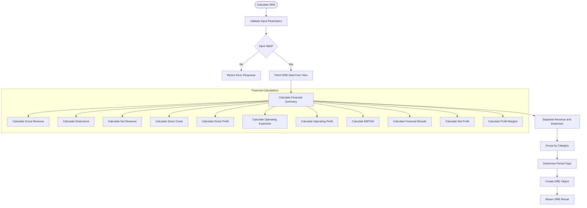

**Diagram sources**
- [calcular-dre.service.ts](file://backend/financeiro/dre/services/dre/calcular-dre.service.ts)

**Section sources**
- [calcular-dre.service.ts](file://backend/financeiro/dre/services/dre/calcular-dre.service.ts)

### Budget Management Analysis
The Budget service provides comprehensive functionality for creating, managing, approving, and executing budgets with detailed reporting capabilities.

#### For Object-Oriented Components:
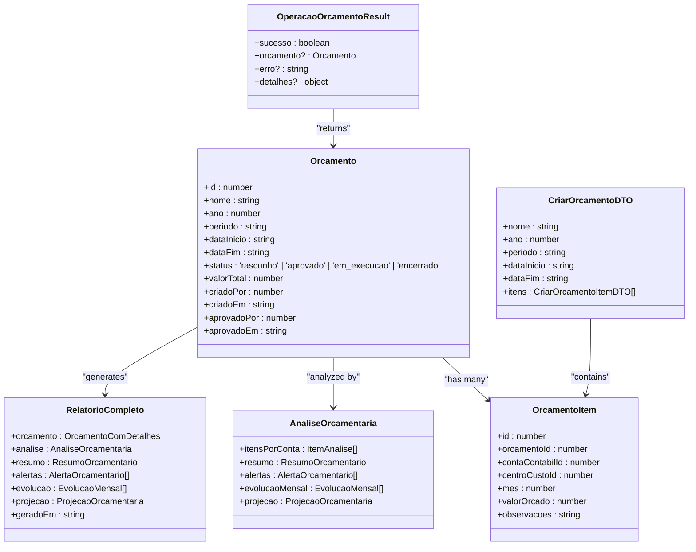

**Diagram sources**
- [gerenciar-orcamento.service.ts](file://backend/financeiro/orcamento/services/orcamento/gerenciar-orcamento.service.ts)
- [aprovar-orcamento.service.ts](file://backend/financeiro/orcamento/services/orcamento/aprovar-orcamento.service.ts)
- [executar-orcamento.service.ts](file://backend/financeiro/orcamento/services/orcamento/executar-orcamento.service.ts)
- [relatorios-orcamento.service.ts](file://backend/financeiro/orcamento/services/orcamento/relatorios-orcamento.service.ts)

**Section sources**
- [gerenciar-orcamento.service.ts](file://backend/financeiro/orcamento/services/orcamento/gerenciar-orcamento.service.ts)
- [aprovar-orcamento.service.ts](file://backend/financeiro/orcamento/services/orcamento/aprovar-orcamento.service.ts)
- [executar-orcamento.service.ts](file://backend/financeiro/orcamento/services/orcamento/executar-orcamento.service.ts)
- [relatorios-orcamento.service.ts](file://backend/financeiro/orcamento/services/orcamento/relatorios-orcamento.service.ts)

### Accounts Payable and Receivable Analysis
The Accounts Payable and Receivable services handle payment and collection workflows with support for partial payments, batch operations, and comprehensive validation.

#### For API/Service Components:
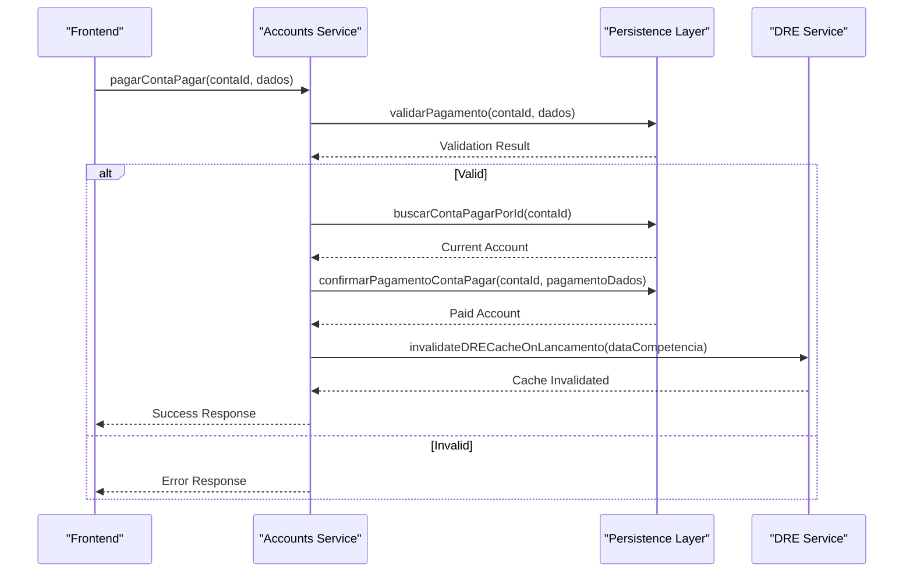

**Diagram sources**
- [pagar-conta.service.ts](file://backend/financeiro/contas-pagar/services/contas-pagar/pagar-conta.service.ts)
- [receber-conta.service.ts](file://backend/financeiro/contas-receber/services/contas-receber/receber-conta.service.ts)

**Section sources**
- [pagar-conta.service.ts](file://backend/financeiro/contas-pagar/services/contas-pagar/pagar-conta.service.ts)
- [receber-conta.service.ts](file://backend/financeiro/contas-receber/services/contas-receber/receber-conta.service.ts)

### Bank Reconciliation Analysis
The Bank Reconciliation service automates the process of matching bank transactions with financial entries using similarity algorithms and configurable matching rules.

#### For Complex Logic Components:
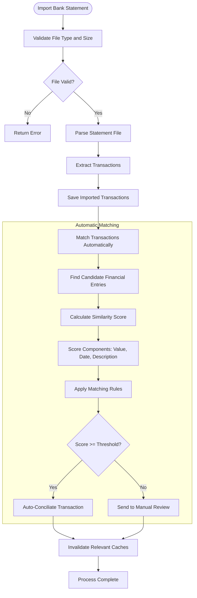

**Diagram sources**
- [importar-extrato.service.ts](file://backend/financeiro/conciliacao-bancaria/services/conciliacao-bancaria/importar-extrato.service.ts)
- [matching-automatico.service.ts](file://backend/financeiro/conciliacao-bancaria/services/matching/matching-automatico.service.ts)

**Section sources**
- [importar-extrato.service.ts](file://backend/financeiro/conciliacao-bancaria/services/conciliacao-bancaria/importar-extrato.service.ts)
- [matching-automatico.service.ts](file://backend/financeiro/conciliacao-bancaria/services/matching/matching-automatico.service.ts)

### Obligations Integration Analysis
The Obligations Integration service synchronizes judicial agreements and condemnations with the financial system, ensuring proper accounting treatment.

#### For API/Service Components:
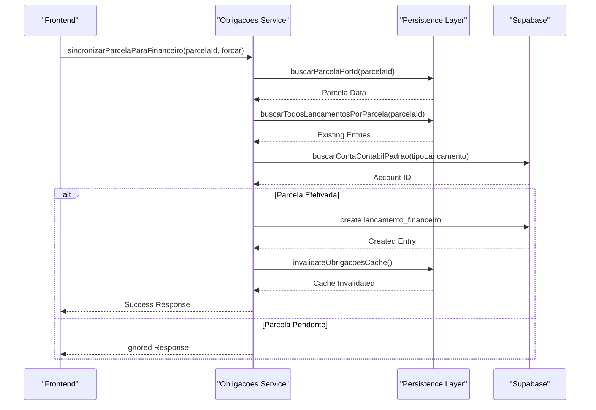

**Diagram sources**
- [obrigacoes-integracao.service.ts](file://backend/financeiro/obrigacoes/services/integracao/obrigacoes-integracao.service.ts)

**Section sources**
- [obrigacoes-integracao.service.ts](file://backend/financeiro/obrigacoes/services/integracao/obrigacoes-integracao.service.ts)

### Recurring Transactions Analysis
The Recurring Transactions service automatically generates periodic accounts payable and receivable based on templates, with support for various frequencies and dry-run previews.

#### For Complex Logic Components:
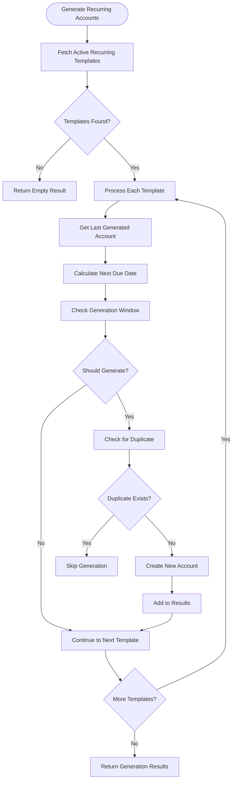

**Diagram sources**
- [gerar-recorrentes.service.ts](file://backend/financeiro/contas-pagar/services/contas-pagar/gerar-recorrentes.service.ts)
- [gerar-recorrentes.service.ts](file://backend/financeiro/contas-receber/services/contas-receber/gerar-recorrentes.service.ts)

**Section sources**
- [gerar-recorrentes.service.ts](file://backend/financeiro/contas-pagar/services/contas-pagar/gerar-recorrentes.service.ts)
- [gerar-recorrentes.service.ts](file://backend/financeiro/contas-receber/services/contas-receber/gerar-recorrentes.service.ts)

### Account Cancellation Analysis
The Account Cancellation service handles the cancellation of accounts payable with support for batch operations and recorrente template management.

#### For API/Service Components:
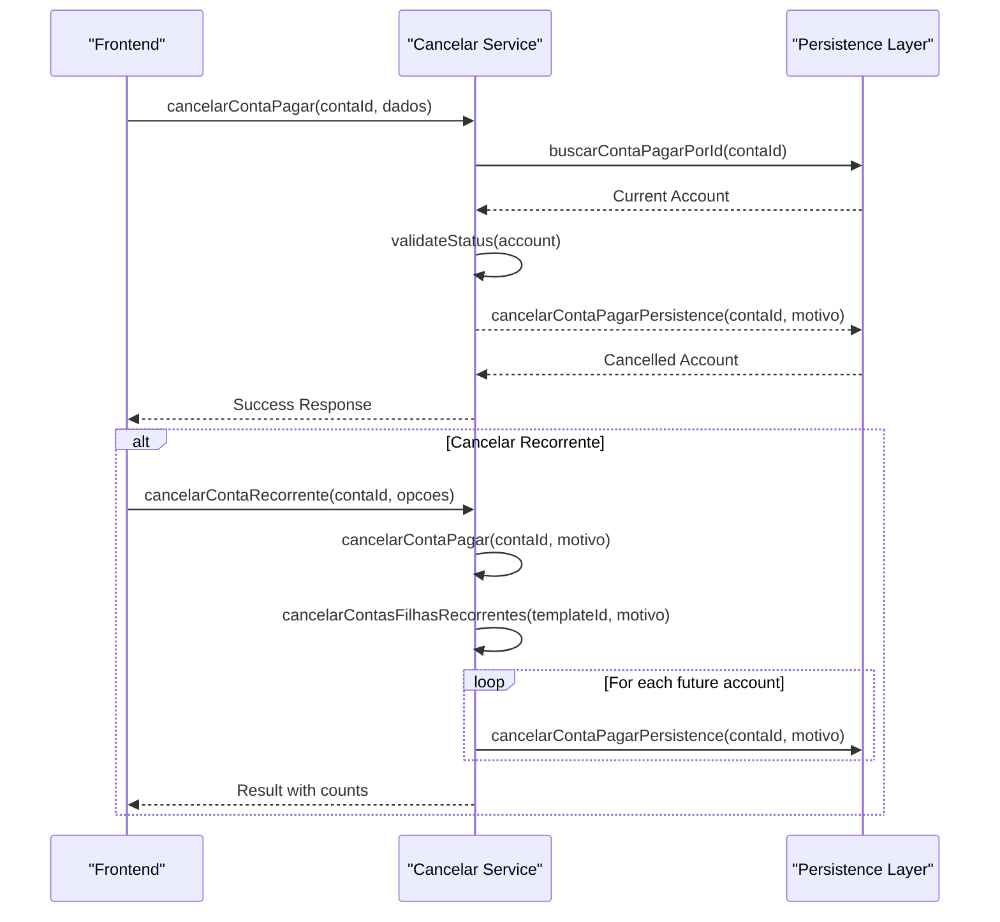

**Diagram sources**
- [cancelar-conta.service.ts](file://backend/financeiro/contas-pagar/services/contas-pagar/cancelar-conta.service.ts)

**Section sources**
- [cancelar-conta.service.ts](file://backend/financeiro/contas-pagar/services/contas-pagar/cancelar-conta.service.ts)

## Dependency Analysis
The Financial Core Services have a well-defined dependency structure with clear boundaries between modules. The services depend on persistence layers for data access, which in turn depend on the database and caching infrastructure.

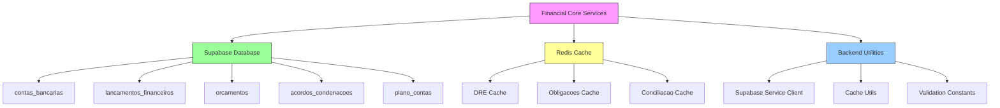

**Diagram sources**
- [supabase/service-client.ts](file://backend/utils/supabase/service-client.ts)
- [redis/cache-utils.ts](file://backend/utils/redis/cache-utils.ts)
- [types/financeiro/*.types.ts](file://backend/types/financeiro/)

**Section sources**
- [supabase/service-client.ts](file://backend/utils/supabase/service-client.ts)
- [redis/cache-utils.ts](file://backend/utils/redis/cache-utils.ts)

## Performance Considerations
The Financial Core Services are designed with performance in mind, utilizing caching strategies, batch operations, and optimized database queries. The DRE service implements cache invalidation when financial entries are modified to ensure data consistency. The Bank Reconciliation service uses similarity algorithms with configurable thresholds to balance automation and accuracy. The Recurring Transactions service includes dry-run capabilities to preview changes before execution. All services implement proper error handling and validation to prevent data corruption.

## Troubleshooting Guide
When troubleshooting issues with the Financial Core Services, consider the following common scenarios:

1. **DRE Calculation Issues**: Check if the DRE cache has been properly invalidated after financial entries are modified. Verify that the data sources are correctly configured and accessible.

2. **Budget Approval Problems**: Ensure that budgets in draft status have items and positive total values. Verify that the approval workflow is properly configured.

3. **Bank Reconciliation Failures**: Check file format and size limitations. Verify that the matching thresholds are appropriately configured for your use case.

4. **Obligations Synchronization Errors**: Ensure that the judicial agreements have properly configured financial mappings. Check for duplicate entries that might prevent synchronization.

5. **Recurring Transaction Generation Issues**: Verify that templates have valid recurrence frequencies and due dates. Check for duplicate prevention mechanisms.

6. **Performance Degradation**: Monitor cache hit rates and database query performance. Consider optimizing frequently accessed data points.

**Section sources**
- [calcular-dre.service.ts](file://backend/financeiro/dre/services/dre/calcular-dre.service.ts)
- [aprovar-orcamento.service.ts](file://backend/financeiro/orcamento/services/orcamento/aprovar-orcamento.service.ts)
- [importar-extrato.service.ts](file://backend/financeiro/conciliacao-bancaria/services/conciliacao-bancaria/importar-extrato.service.ts)
- [obrigacoes-integracao.service.ts](file://backend/financeiro/obrigacoes/services/integracao/obrigacoes-integracao.service.ts)

## Conclusion
The Financial Core Services provide a comprehensive and robust financial management system with well-structured components for dashboard reporting, financial statements, budgeting, accounts management, bank reconciliation, and obligation integration. The architecture follows best practices with clear separation of concerns, proper error handling, and performance optimization. The system is designed to handle complex financial workflows while maintaining data integrity and providing extensive reporting capabilities. Future enhancements could include more sophisticated forecasting models, enhanced integration with external financial systems, and improved user interfaces for financial analysis.