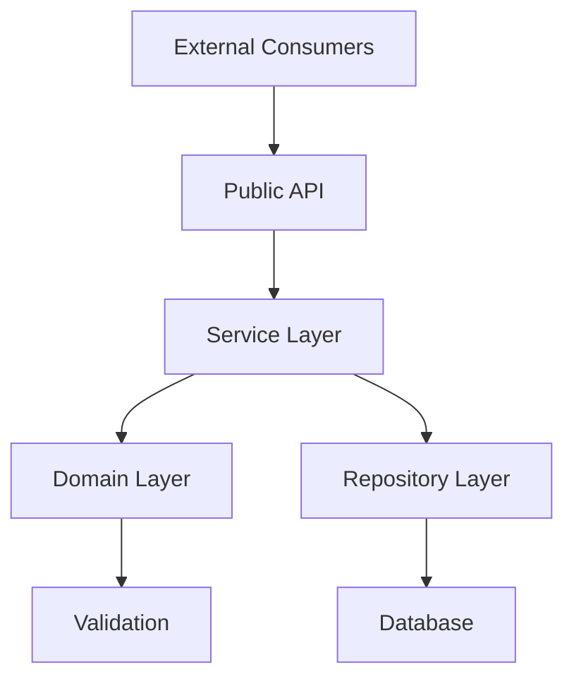
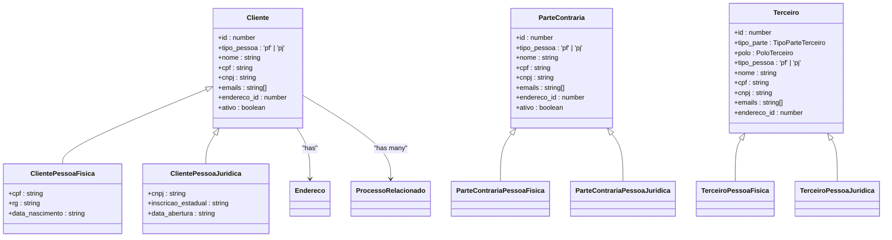
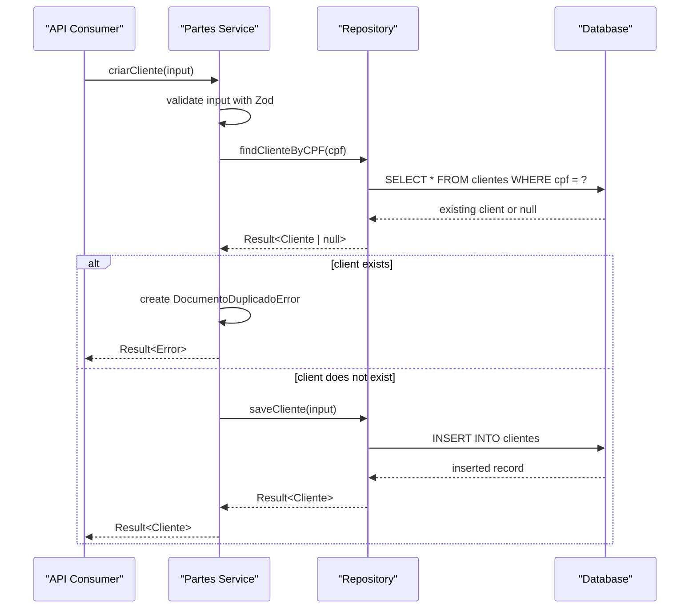
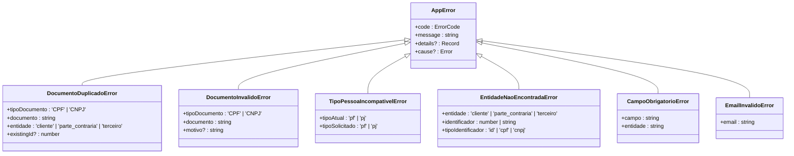

# Partes Core Module

<cite>
**Referenced Files in This Document**   
- [index.ts](file://src/core/partes/index.ts)
- [domain.ts](file://src/core/partes/domain.ts)
- [service.ts](file://src/core/partes/service.ts)
- [repository.ts](file://src/core/partes/repository.ts)
- [errors.ts](file://src/core/partes/errors.ts)
- [types.ts](file://src/core/common/types.ts)
</cite>

## Table of Contents
1. [Introduction](#introduction)
2. [Architecture Overview](#architecture-overview)
3. [Core Components](#core-components)
4. [Domain Layer](#domain-layer)
5. [Service Layer](#service-layer)
6. [Repository Layer](#repository-layer)
7. [Error Handling](#error-handling)
8. [Integration Points](#integration-points)
9. [Conclusion](#conclusion)

## Introduction
The Partes Core Module is a central component of the Sinesys application responsible for managing entities related to legal parties: Clients, Opposing Parties, and Third Parties. This module provides a unified, type-safe, and well-structured API for creating, reading, updating, and deleting party information with comprehensive validation, error handling, and database persistence. It follows a clean architecture pattern with distinct layers for domain modeling, business logic, and data access, ensuring maintainability and testability.

## Architecture Overview
The Partes Core Module implements a layered architecture that separates concerns and promotes code reusability. The module is structured into four main layers: Domain, Service, Repository, and Public API. This design ensures that business rules are encapsulated in the service layer, data structures and validation are defined in the domain layer, and database interactions are isolated in the repository layer. The public API (index.ts) exports a curated set of functions and types, providing a clean interface for consumers while hiding internal implementation details.



**Diagram sources**
- [index.ts](file://src/core/partes/index.ts)
- [service.ts](file://src/core/partes/service.ts)
- [domain.ts](file://src/core/partes/domain.ts)
- [repository.ts](file://src/core/partes/repository.ts)

## Core Components
The Partes Core Module consists of several key components that work together to provide a robust system for managing party data. The module is designed around three primary entity types: Client, Opposing Party, and Third Party, each with Person (PF) and Legal Entity (PJ) variants. The architecture leverages discriminated unions and Zod schemas for type safety and validation. The Result<T> pattern is used throughout to handle operations that may fail, providing a functional programming approach to error handling that avoids exceptions and makes error states explicit in the type system.

**Section sources**
- [index.ts](file://src/core/partes/index.ts)
- [domain.ts](file://src/core/partes/domain.ts)
- [service.ts](file://src/core/partes/service.ts)
- [repository.ts](file://src/core/partes/repository.ts)

## Domain Layer
The domain layer defines the core data structures, types, and validation rules for the Partes module. It uses discriminated unions to represent the different types of parties (Client, Opposing Party, Third Party) and their subtypes (Person and Legal Entity). The layer includes comprehensive validation functions for CPF and CNPJ numbers, as well as Zod schemas for input validation. The domain layer also defines interfaces for related data such as addresses and process relationships, enabling rich data retrieval with joins.



**Diagram sources**
- [domain.ts](file://src/core/partes/domain.ts)

## Service Layer
The service layer implements the business logic and use cases for the Partes module. It provides functions for creating, updating, listing, and searching parties with comprehensive validation and error handling. The service layer acts as an orchestrator, validating input with Zod schemas, checking for business rule violations (such as duplicate documents), and delegating persistence operations to the repository layer. All functions return a Result<T> type, making success and error states explicit and forcing consumers to handle both cases. The layer includes specialized functions for upsert operations and soft deletion, as well as parameterized listing with pagination and filtering.



**Diagram sources**
- [service.ts](file://src/core/partes/service.ts)
- [repository.ts](file://src/core/partes/repository.ts)

## Repository Layer
The repository layer handles all database interactions for the Partes module. It provides a set of functions for CRUD operations and queries, abstracting the underlying database technology (Supabase/PostgreSQL). The layer uses a functional approach with Result<T> return types to handle database errors consistently. Each entity type (Client, Opposing Party, Third Party) has its own set of repository functions for basic operations and listing with pagination. The repository also includes specialized functions for retrieving data with joins, such as clients with their addresses and related processes. All database operations are wrapped in try-catch blocks to handle connection errors and convert them to AppError instances.

```mermaid
flowchart TD
A[Repository Function] --> B{Operation Type}
B --> |Find| C[Execute SELECT query]
B --> |Save| D[Execute INSERT query]
B --> |Update| E[Execute UPDATE query]
B --> |Delete| F[Execute UPDATE with ativo=false]
C --> G{Query Result}
D --> H{Insert Result}
E --> I{Update Result}
F --> J{Delete Result}
G --> |Success| K[Convert to Domain Object]
H --> |Success| L[Convert to Domain Object]
I --> |Success| M[Convert to Domain Object]
J --> |Success| N[Return ok(undefined)]
G --> |Error| O[Handle Database Error]
H --> |Error| O
I --> |Error| O
J --> |Error| O
O --> P{Error Type}
P --> |Record Not Found| Q[Return ok(null)]
P --> |Unique Constraint| R[Return Conflict Error]
P --> |Other| S[Return Database Error]
K --> T[Return ok(result)]
L --> T
M --> T
N --> T
Q --> T
R --> U[Return err(error)]
S --> U
```

**Diagram sources**
- [repository.ts](file://src/core/partes/repository.ts)

## Error Handling
The Partes Core Module implements a comprehensive error handling system with custom error classes and a standardized error response format. The module defines specific error types for common scenarios such as duplicate documents, invalid documents, and entity not found. These custom errors are converted to AppError instances for consistent handling across the application. The error system includes type guards for safe error checking and a mapping from error codes to HTTP status codes. The service layer uses these errors to communicate business rule violations, while the repository layer converts database errors to appropriate application errors.



**Diagram sources**
- [errors.ts](file://src/core/partes/errors.ts)

## Integration Points
The Partes Core Module is integrated with various parts of the Sinesys application, particularly in the capture and API layers. The module is used by the TRT capture service to identify and store parties from legal processes, determining whether a party is a client, opposing party, or third party based on representative CPFs. The public API exports are consumed by backend services and frontend components, providing a consistent interface for party management. The module's Result<T> pattern and AppError system integrate with the application's error handling and logging infrastructure, ensuring consistent error reporting across the system.

**Section sources**
- [index.ts](file://src/core/partes/index.ts)
- [route.ts](file://src/app/api/captura/trt/partes/route.ts)

## Conclusion
The Partes Core Module provides a robust, type-safe, and well-structured foundation for managing party data in the Sinesys application. Its layered architecture separates concerns effectively, making the codebase maintainable and testable. The use of discriminated unions, Zod validation, and the Result<T> pattern ensures type safety and explicit error handling throughout the system. The module's comprehensive error handling system provides meaningful feedback for both developers and end users. By providing a unified API for Clients, Opposing Parties, and Third Parties, the module reduces code duplication and ensures consistent behavior across different party types. This design makes the Partes Core Module a critical component of the application's data management capabilities.