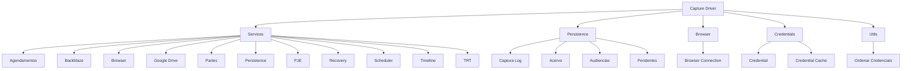
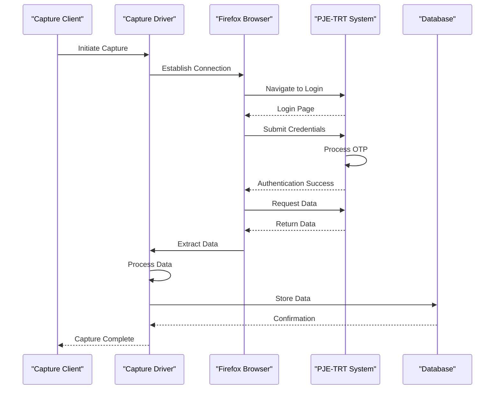
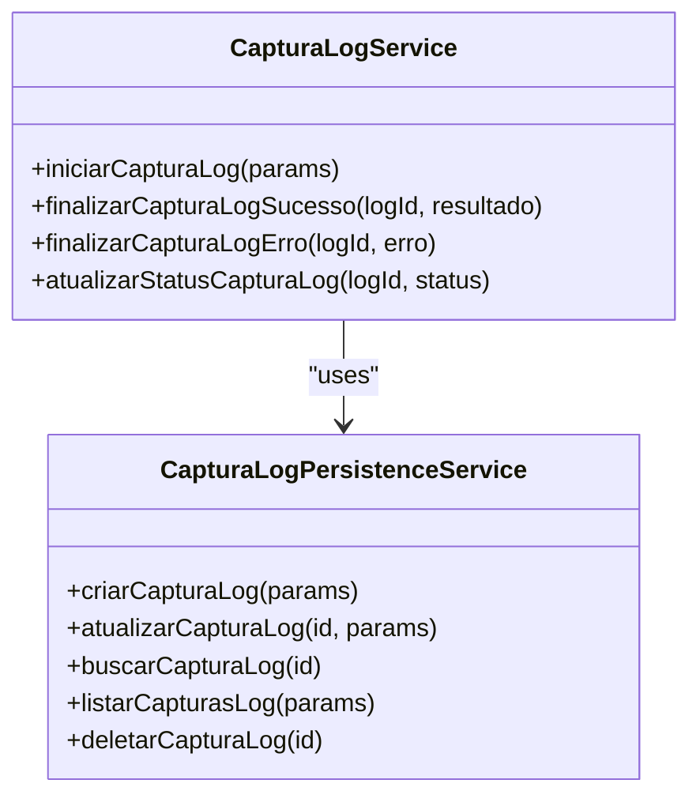
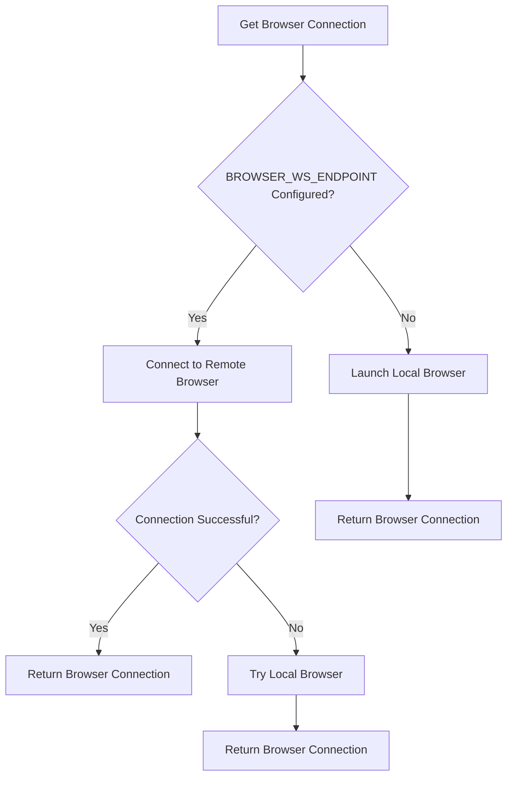
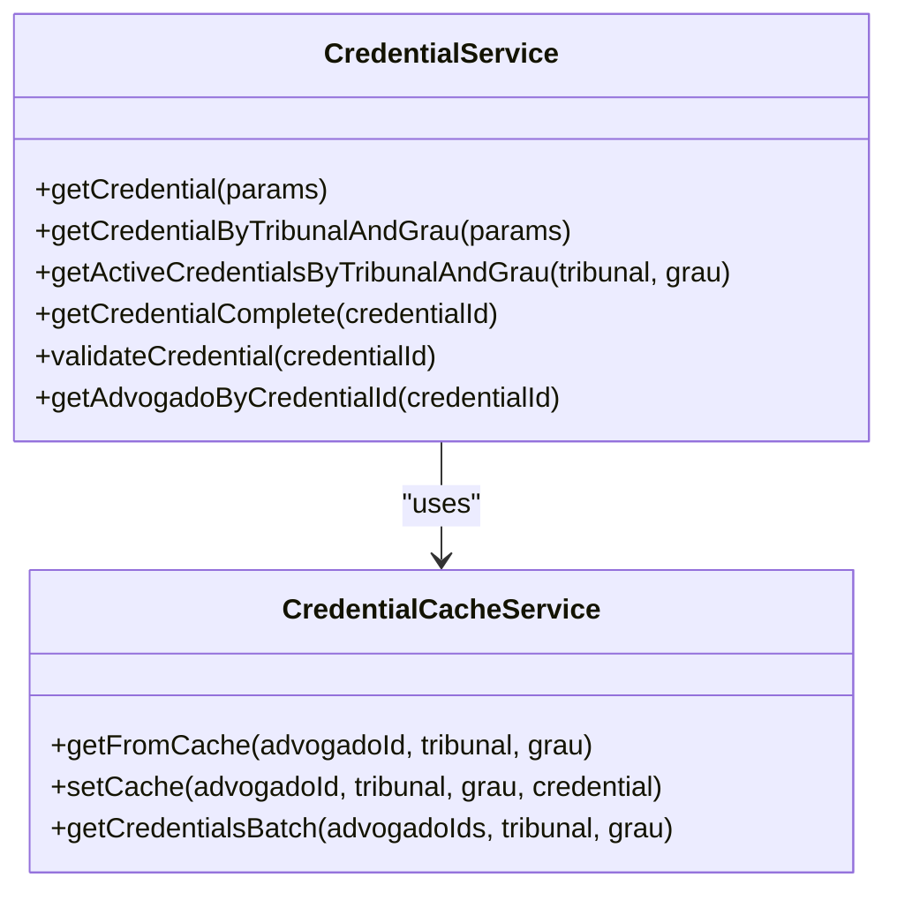
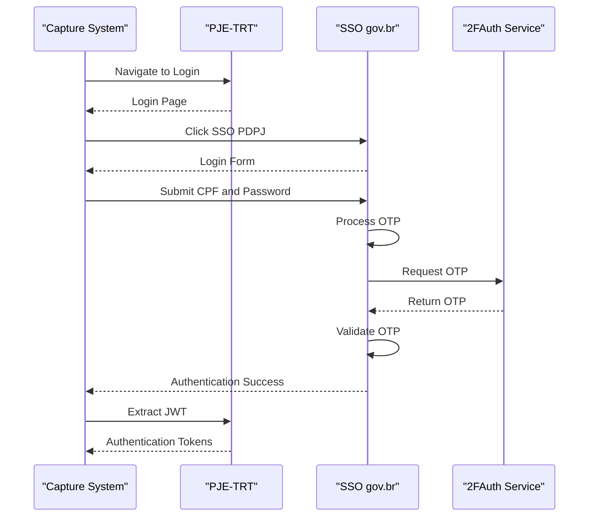
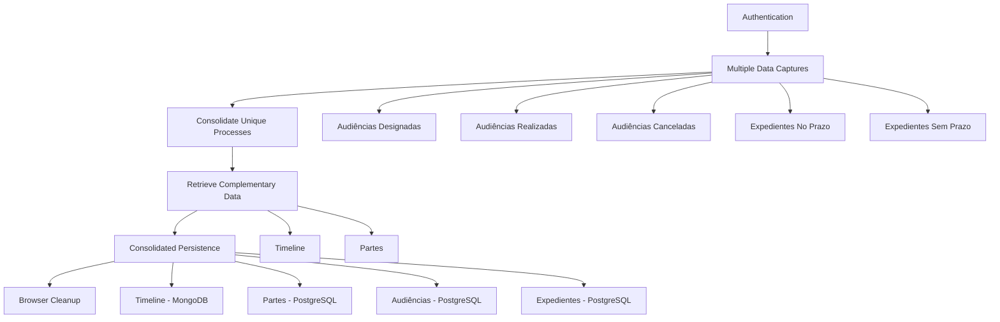
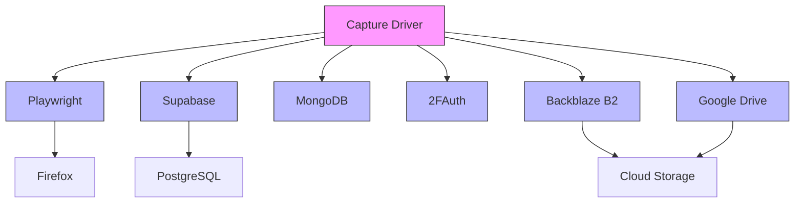

# Document Capture Driver Architecture

<cite>
**Referenced Files in This Document**   
- [captura-log.service.ts](file://backend/captura/services/captura-log.service.ts)
- [captura-log-persistence.service.ts](file://backend/captura/services/persistence/captura-log-persistence.service.ts)
- [trt-capture.service.ts](file://backend/captura/services/trt/trt-capture.service.ts)
- [partes-capture.service.ts](file://backend/captura/services/partes/partes-capture.service.ts)
- [timeline-capture.service.ts](file://backend/captura/services/timeline/timeline-capture.service.ts)
- [browser-connection.service.ts](file://backend/captura/services/browser/browser-connection.service.ts)
- [credential.service.ts](file://backend/captura/credentials/credential.service.ts)
- [acervo-geral.service.ts](file://backend/captura/services/trt/acervo-geral.service.ts)
- [captura-combinada.service.ts](file://backend/captura/services/trt/captura-combinada.service.ts)
- [trt-auth.service.ts](file://backend/captura/services/trt/trt-auth.service.ts)
</cite>

## Table of Contents
1. [Introduction](#introduction)
2. [Project Structure](#project-structure)
3. [Core Components](#core-components)
4. [Architecture Overview](#architecture-overview)
5. [Detailed Component Analysis](#detailed-component-analysis)
6. [Dependency Analysis](#dependency-analysis)
7. [Performance Considerations](#performance-considerations)
8. [Troubleshooting Guide](#troubleshooting-guide)
9. [Conclusion](#conclusion)

## Introduction
The Document Capture Driver Architecture is a comprehensive system designed to automate the extraction and processing of legal documents from the PJE-TRT (Processo Judicial Eletrônico - Tribunal Regional do Trabalho) platform. This architecture enables seamless integration with various court systems, capturing critical data such as case timelines, parties involved, hearings, and pending matters. The system is built on a modular design that supports multiple capture workflows, including general case inventory, combined captures, and specialized data retrieval for specific case types.

The architecture leverages browser automation through Playwright to interact with the PJE-TRT web interface, ensuring compatibility with the complex authentication mechanisms and dynamic content loading patterns of the judicial system. It incorporates robust error handling, retry mechanisms, and performance optimization strategies to ensure reliable operation in production environments. The system also implements sophisticated caching and credential management to enhance security and efficiency across multiple capture operations.

This documentation provides a detailed analysis of the capture driver's architecture, focusing on its core components, data flow, and integration points. The analysis reveals a well-structured system that balances complexity with maintainability, employing design patterns such as service-oriented architecture, dependency injection, and layered persistence to create a scalable solution for legal document capture.

## Project Structure
The capture driver is organized within the backend/captura directory, following a modular structure that separates concerns and promotes reusability. The architecture is divided into several key components: services for specific capture operations, persistence layers for data storage, browser management for automation, and credential handling for secure authentication.

The services directory contains specialized modules for different capture types, including agendamentos (scheduling), backblaze (cloud storage integration), browser (browser automation), google-drive (Google Drive integration), partes (party information capture), persistence (data persistence), pje (PJE-specific operations), recovery (error recovery), scheduler (capture scheduling), timeline (timeline capture), and trt (TRT-specific operations). Each service is designed to handle a specific aspect of the capture process, allowing for independent development and testing.

The persistence layer manages interactions with both relational (PostgreSQL via Supabase) and NoSQL (MongoDB) databases, providing a flexible storage solution for different data types. The browser directory contains services for managing Firefox browser connections, supporting both remote and local execution modes. The credentials directory handles secure credential management, including caching and retrieval of authentication information for different tribunals.

**Diagram sources**
- [backend/captura](file://backend/captura)

**Section sources**
- [backend/captura](file://backend/captura)

## Core Components
The Document Capture Driver Architecture consists of several core components that work together to enable automated document capture from the PJE-TRT platform. These components include the capture log service, browser connection manager, credential handler, TRT capture services, and specialized capture workflows for different data types.

The capture log service provides a comprehensive history of all capture operations, tracking their status, results, and any errors encountered during execution. This service is essential for monitoring system performance, debugging issues, and ensuring data integrity across multiple capture sessions. The browser connection manager handles the creation and maintenance of browser instances, supporting both remote (via WebSocket) and local execution modes to accommodate different deployment scenarios.

The credential handler manages authentication information for different tribunals, implementing caching mechanisms to improve performance and reduce database queries. This component ensures secure handling of sensitive authentication data while providing efficient access to credentials during capture operations. The TRT capture services implement the specific logic required to interact with different TRT systems, handling authentication, data extraction, and error recovery for each tribunal type.

Specialized capture workflows, such as the combined capture service, optimize the capture process by executing multiple data retrieval operations within a single authenticated session. This approach significantly reduces the overhead associated with repeated authentication and session establishment, improving overall system efficiency and reducing the load on the target PJE-TRT systems.

**Section sources**
- [captura-log.service.ts](file://backend/captura/services/captura-log.service.ts)
- [browser-connection.service.ts](file://backend/captura/services/browser/browser-connection.service.ts)
- [credential.service.ts](file://backend/captura/credentials/credential.service.ts)
- [trt-capture.service.ts](file://backend/captura/services/trt/trt-capture.service.ts)
- [captura-combinada.service.ts](file://backend/captura/services/trt/captura-combinada.service.ts)

## Architecture Overview
The Document Capture Driver Architecture follows a layered approach with clear separation of concerns between components. At its core, the system uses browser automation to interact with the PJE-TRT web interface, extracting data through a series of orchestrated steps that mimic human interaction patterns. This approach allows the system to work with the existing web interface without requiring direct API access or modifications to the target system.

The architecture is organized into several layers: the presentation layer (browser automation), the service layer (capture workflows), the persistence layer (data storage), and the security layer (authentication and credential management). These layers work together to provide a robust and scalable solution for automated document capture. The system employs a service-oriented architecture, with each capture type implemented as a separate service that can be independently developed, tested, and deployed.

Data flow within the system follows a consistent pattern: authentication, data extraction, processing, and persistence. The authentication phase establishes a secure session with the target PJE-TRT system using credentials stored in the database. The data extraction phase uses browser automation to navigate the web interface and retrieve the required information. The processing phase transforms the extracted data into a standardized format suitable for storage and analysis. Finally, the persistence phase stores the processed data in appropriate databases, with relational data going to PostgreSQL and document timelines stored in MongoDB.

**Diagram sources**
- [trt-auth.service.ts](file://backend/captura/services/trt/trt-auth.service.ts)
- [trt-capture.service.ts](file://backend/captura/services/trt/trt-capture.service.ts)
- [captura-log.service.ts](file://backend/captura/services/captura-log.service.ts)

## Detailed Component Analysis

### Capture Log Service
The Capture Log Service is responsible for maintaining a comprehensive history of all capture operations performed by the system. This service provides essential functionality for monitoring, debugging, and auditing capture activities, ensuring transparency and accountability in the document capture process.

The service implements a CRUD (Create, Read, Update, Delete) interface for managing capture log entries, with methods for initiating a capture, updating its status, recording success or failure, and retrieving historical data. Each capture log entry contains metadata about the capture operation, including its type, associated attorney, credentials used, status, and timestamps. The service also supports filtering and pagination for efficient retrieval of log entries.

The implementation uses Supabase as the persistence layer, leveraging its real-time capabilities and robust security features. The service follows a clean architecture pattern, separating the business logic from the data access layer. This separation allows for easy testing and maintenance, as well as potential replacement of the persistence layer without affecting the core functionality.

**Diagram sources**
- [captura-log.service.ts](file://backend/captura/services/captura-log.service.ts)
- [captura-log-persistence.service.ts](file://backend/captura/services/persistence/captura-log-persistence.service.ts)

**Section sources**
- [captura-log.service.ts](file://backend/captura/services/captura-log.service.ts)
- [captura-log-persistence.service.ts](file://backend/captura/services/persistence/captura-log-persistence.service.ts)

### Browser Connection Management
The Browser Connection Management component is responsible for establishing and maintaining connections to Firefox browser instances used for automation. This component supports two execution modes: remote connection via WebSocket to a Playwright Browser Server, and local execution by launching Firefox directly on the host machine.

The remote execution mode is designed for production environments, where browser instances run on dedicated servers with optimized configurations. This approach provides better resource isolation, improved performance, and enhanced security. The local execution mode serves as a fallback for development and testing, allowing developers to run capture operations without requiring access to a remote browser server.

The component implements health checking functionality to verify the availability of the browser service, ensuring that capture operations only proceed when a valid browser connection can be established. It also includes error handling and retry mechanisms to recover from transient network issues or browser crashes. The connection management follows the factory pattern, providing a consistent interface for obtaining browser connections regardless of the underlying execution mode.

**Diagram sources**
- [browser-connection.service.ts](file://backend/captura/services/browser/browser-connection.service.ts)

**Section sources**
- [browser-connection.service.ts](file://backend/captura/services/browser/browser-connection.service.ts)

### Credential Management
The Credential Management component handles the secure storage, retrieval, and caching of authentication credentials for different tribunals. This component plays a critical role in the security and efficiency of the capture system, ensuring that sensitive authentication data is protected while providing fast access during capture operations.

The service implements multiple methods for retrieving credentials, including by ID, by tribunal and degree, and for all active credentials associated with a specific tribunal. Each method includes appropriate error handling and validation to ensure data integrity. The component also provides functionality for validating credentials and retrieving associated attorney information, supporting comprehensive access control and audit capabilities.

A key feature of the credential management system is its caching mechanism, which reduces database queries and improves performance. The cache stores credentials by attorney ID, tribunal, and degree, allowing for rapid retrieval during capture operations. The service also includes batch retrieval functionality, enabling efficient processing of multiple credentials for system-wide capture operations.

**Diagram sources**
- [credential.service.ts](file://backend/captura/credentials/credential.service.ts)
- [credential-cache.service.ts](file://backend/captura/credentials/credential-cache.service.ts)

**Section sources**
- [credential.service.ts](file://backend/captura/credentials/credential.service.ts)

### TRT Authentication
The TRT Authentication component implements the complete workflow for authenticating with the PJE-TRT system, including SSO (Single Sign-On) with gov.br, OTP (One-Time Password) verification, and JWT (JSON Web Token) extraction. This component is critical for establishing secure sessions with the target judicial systems, enabling subsequent data extraction operations.

The authentication process follows a multi-step workflow: navigating to the login page, submitting credentials, processing OTP through the 2FAuth service, and extracting authentication tokens from cookies. The component includes sophisticated error handling and retry mechanisms to handle common issues such as network errors, OTP failures, and session timeouts. It also implements anti-detection measures to prevent the automation from being blocked by the target system.

A key aspect of the authentication implementation is its support for both current and next OTP codes, allowing for seamless recovery when the current code expires during the authentication process. The component also includes comprehensive logging and monitoring capabilities, providing detailed insights into the authentication workflow for debugging and optimization purposes.

**Diagram sources**
- [trt-auth.service.ts](file://backend/captura/services/trt/trt-auth.service.ts)

**Section sources**
- [trt-auth.service.ts](file://backend/captura/services/trt/trt-auth.service.ts)

### Combined Capture Workflow
The Combined Capture Workflow is an optimized service that executes multiple data retrieval operations within a single authenticated session. This approach significantly improves efficiency by reducing the overhead associated with repeated authentication and session establishment, while also minimizing the load on the target PJE-TRT systems.

The workflow follows a structured six-phase process: authentication, multiple data captures, consolidation of unique processes, retrieval of complementary data, consolidated persistence, and browser cleanup. During the authentication phase, a single session is established with the PJE-TRT system. In the data capture phase, the service retrieves information about scheduled hearings, completed hearings, canceled hearings, pending matters with deadlines, and pending matters without deadlines.

After collecting all the required data, the workflow consolidates unique processes and retrieves complementary information such as timelines and parties involved. The persistence phase stores the collected data in appropriate databases, with timelines going to MongoDB and other data stored in PostgreSQL. The final phase ensures proper cleanup of browser resources, maintaining system stability during prolonged operation.

**Diagram sources**
- [captura-combinada.service.ts](file://backend/captura/services/trt/captura-combinada.service.ts)

**Section sources**
- [captura-combinada.service.ts](file://backend/captura/services/trt/captura-combinada.service.ts)

## Dependency Analysis
The Document Capture Driver Architecture has several key dependencies that enable its functionality and integration with external systems. These dependencies can be categorized into browser automation, database access, authentication services, and cloud storage integration.

The primary dependency is Playwright, which provides the browser automation capabilities essential for interacting with the PJE-TRT web interface. Playwright enables the system to control Firefox browsers, navigate web pages, extract data, and handle dynamic content loading. The system also depends on Supabase for database access, leveraging its PostgreSQL backend and real-time capabilities for storing and retrieving capture data.

For authentication, the system relies on the 2FAuth service to handle OTP (One-Time Password) generation and validation. This external service integrates with the SSO (Single Sign-On) system of gov.br, enabling secure authentication with the PJE-TRT platform. The system also depends on MongoDB for storing document timelines, taking advantage of its flexible schema and high-performance document storage capabilities.

Cloud storage integration is provided through dependencies on Backblaze B2 and Google Drive, enabling the system to store and manage captured documents in external storage systems. These dependencies are implemented through a factory pattern, allowing for easy configuration and potential replacement with alternative storage providers.

**Diagram sources**
- [package.json](file://package.json)

**Section sources**
- [package.json](file://package.json)

## Performance Considerations
The Document Capture Driver Architecture incorporates several performance optimization strategies to ensure efficient operation and minimize the impact on both the system itself and the target PJE-TRT platforms. These optimizations address key performance challenges such as authentication overhead, data retrieval efficiency, and resource utilization.

One of the primary performance optimizations is the combined capture workflow, which executes multiple data retrieval operations within a single authenticated session. This approach eliminates the need for repeated authentication, which is one of the most time-consuming aspects of the capture process. By consolidating multiple capture operations, the system reduces the overall execution time and minimizes the load on the target systems.

The architecture also implements sophisticated caching mechanisms at multiple levels. The credential cache reduces database queries by storing frequently accessed authentication information in memory. The browser connection manager supports remote execution through a Playwright Browser Server, allowing for efficient reuse of browser instances across multiple capture operations. These caching strategies significantly improve response times and reduce resource consumption.

To handle the potentially large volume of data retrieved from the PJE-TRT systems, the architecture employs batch processing and parallel execution where appropriate. The system processes multiple processes and documents in parallel, subject to configurable concurrency limits to prevent overwhelming the target systems. This balanced approach to parallelism ensures optimal performance while maintaining system stability and compliance with usage policies.

## Troubleshooting Guide
When encountering issues with the Document Capture Driver, the first step is to examine the capture log entries, which provide detailed information about the status and outcome of each capture operation. These logs can help identify whether the issue is related to authentication, data retrieval, processing, or persistence.

Common authentication issues often stem from incorrect credentials, expired OTP configurations, or network connectivity problems with the 2FAuth service. Verify that the credential information in the database is correct and that the 2FAuth API URL, token, and account ID are properly configured in the environment variables. Network issues can sometimes be resolved by adjusting the timeout settings or implementing retry mechanisms.

Data retrieval issues may be caused by changes in the PJE-TRT web interface or temporary unavailability of the target system. The system includes built-in error handling and retry mechanisms, but persistent issues may require updates to the selectors or navigation logic used in the automation scripts. Monitoring the browser logs and network traffic can provide valuable insights into the root cause of these issues.

Performance problems can often be addressed by optimizing the concurrency settings, adjusting the delay between requests, or upgrading the hardware resources available to the system. The combined capture workflow and credential caching provide significant performance benefits, so ensure these features are properly configured and functioning as expected.

**Section sources**
- [captura-log.service.ts](file://backend/captura/services/captura-log.service.ts)
- [trt-auth.service.ts](file://backend/captura/services/trt/trt-auth.service.ts)
- [browser-connection.service.ts](file://backend/captura/services/browser/browser-connection.service.ts)

## Conclusion
The Document Capture Driver Architecture represents a sophisticated and well-designed solution for automated document capture from the PJE-TRT platform. Its modular structure, clear separation of concerns, and comprehensive feature set make it a robust and maintainable system capable of handling the complex requirements of legal document retrieval.

The architecture successfully balances the need for automation with the constraints of working with a third-party web interface, employing browser automation to interact with the PJE-TRT system while implementing sophisticated error handling, retry mechanisms, and performance optimizations. The use of both relational and NoSQL databases provides flexibility in data storage, accommodating different data types and access patterns.

Key strengths of the architecture include its support for multiple capture workflows, comprehensive logging and monitoring capabilities, and robust security features for handling sensitive authentication data. The system's modular design allows for easy extension and adaptation to new requirements, while its use of established patterns and technologies ensures maintainability and developer productivity.

Future enhancements could include additional optimization of the combined capture workflow, integration with more cloud storage providers, and enhanced error recovery mechanisms. The architecture provides a solid foundation for these improvements, demonstrating a thoughtful approach to solving the complex challenges of automated document capture in the legal domain.