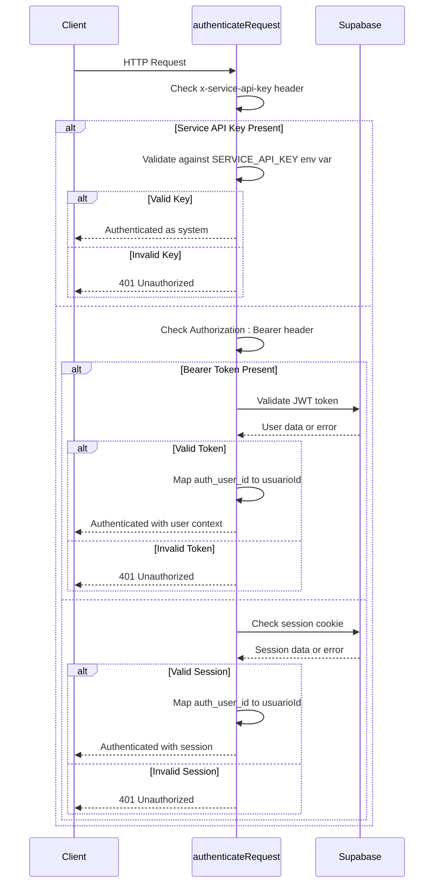
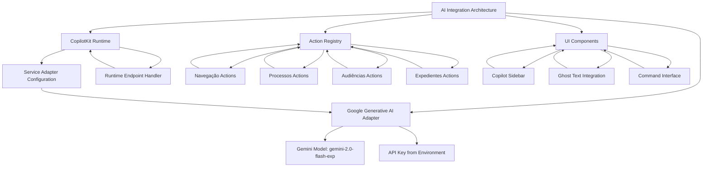
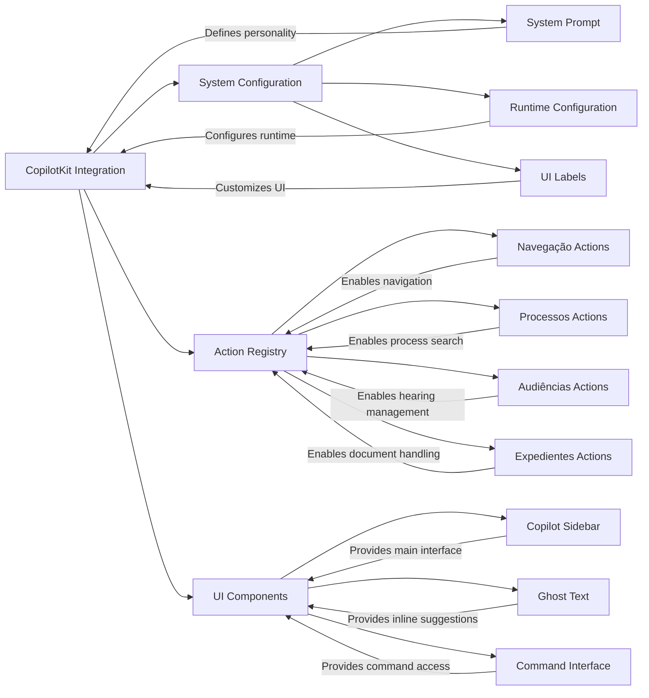

# AI Integration Secure API

<cite>
**Referenced Files in This Document**   
- [api-auth.ts](file://backend/auth/api-auth.ts)
- [authorization.ts](file://backend/auth/authorization.ts)
- [require-permission.ts](file://backend/auth/require-permission.ts)
- [route.ts](file://src/app/api/ai/copilot/route.ts)
- [route.ts](file://src/app/api/copilotkit/route.ts)
- [config.ts](file://src/lib/copilotkit/config.ts)
- [system-prompt.ts](file://src/lib/copilotkit/system-prompt.ts)
- [.env.example](file://.env.example)
- [.mcp.json](file://.mcp.json)
- [backend-agent-prompt.md](file://docs/agentes/backend-agent-prompt.md)
</cite>

## Table of Contents
1. [Introduction](#introduction)
2. [Authentication Mechanisms](#authentication-mechanisms)
3. [Authorization and Permission System](#authorization-and-permission-system)
4. [AI Integration Architecture](#ai-integration-architecture)
5. [Model Context Protocol (MCP) Server](#model-context-protocol-mcp-server)
6. [CopilotKit Integration](#copilotkit-integration)
7. [Security Considerations](#security-considerations)
8. [Configuration and Environment Variables](#configuration-and-environment-variables)
9. [API Endpoints](#api-endpoints)
10. [Conclusion](#conclusion)

## Introduction

The Sinesys platform provides a comprehensive AI integration secure API system that enables seamless interaction between artificial intelligence agents and the core application functionality. This documentation details the architecture, authentication mechanisms, authorization system, and integration patterns that make up the secure AI API framework.

The system supports multiple integration methods including REST API, Model Context Protocol (MCP), and direct AI copilot integration through CopilotKit. Each method is secured through a robust authentication and authorization framework that ensures only authorized users and systems can access protected resources.

The AI integration ecosystem is designed to support both external AI agents (like Claude Desktop) and internal AI assistants (like the "Pedrinho" legal assistant) while maintaining strict security controls and granular permission management.

**Section sources**
- [backend-agent-prompt.md](file://docs/agentes/backend-agent-prompt.md#L1-L456)

## Authentication Mechanisms

The Sinesys API implements a multi-layered authentication system that supports three distinct methods with a clear priority order:

1. **Service API Key**: Highest priority, used for system jobs and internal services
2. **Bearer Token (JWT)**: For external API consumers and frontend applications
3. **Session Cookie**: For traditional web frontend authentication

The authentication process is handled by the `authenticateRequest` function in `api-auth.ts`, which systematically checks each authentication method in order of priority. The Service API Key is checked first, providing a secure mechanism for backend services and scheduled jobs to access the API without user context.

For Bearer Token authentication, the system validates JWT tokens issued by Supabase Auth, extracting the user identity and verifying the token's validity. This method is ideal for external applications and mobile clients that need to act on behalf of a specific user.

Session-based authentication is maintained through Supabase's cookie-based session management, which is suitable for traditional web applications where users log in through the frontend interface.

All authentication methods ultimately provide a consistent `AuthResult` interface that includes the user's authentication status, user ID, and the source of authentication, enabling downstream components to make authorization decisions based on this information.



**Diagram sources**
- [api-auth.ts](file://backend/auth/api-auth.ts#L51-L137)

**Section sources**
- [api-auth.ts](file://backend/auth/api-auth.ts#L51-L137)

## Authorization and Permission System

The authorization system in Sinesys implements a granular permission model with 82 permissions across 13 resources, providing fine-grained control over access to system functionality. The system follows a three-tier architecture with distinct layers for authentication, permission checking, and permission enforcement.

The core permission checking is handled by the `checkPermission` function in `authorization.ts`, which implements an optimized permission lookup with in-memory caching. The cache has a TTL of 5 minutes, significantly improving performance for frequently accessed permissions while ensuring that permission changes propagate within a reasonable timeframe.

The system supports role-based access control with a super admin bypass - users with the `is_super_admin` flag set to true automatically receive all permissions, providing an administrative override mechanism. For regular users, permissions are stored in a dedicated `permissoes` table that maps user IDs to specific resource-operation combinations.

A key component of the authorization system is the `requirePermission` helper function, which combines authentication and authorization into a single call. This simplifies API route implementations by reducing boilerplate code and ensuring consistent permission enforcement across the application.

The system also provides utilities for invalidating permission caches when user roles or permissions change, ensuring that authorization decisions always reflect the current state of the system.

```mermaid
classDiagram
class AuthResult {
+authenticated : boolean
+userId? : string
+usuarioId? : number
+usuario? : {id : number}
+source? : 'session' | 'bearer' | 'service'
}
class PermissionCache {
-cache : Map~string, CacheEntry~
-CACHE_TTL : number
+checkPermission(usuarioId : number, recurso : string, operacao : string) : Promise~boolean~
+invalidarCacheUsuario(usuarioId : number) : void
+limparCacheExpirado() : void
}
class CacheEntry {
+result : boolean
+expiry : number
}
class requirePermission {
+requirePermission(request : NextRequest, recurso : Recurso, operacao : Operacao) : Promise~AuthorizedRequest | NextResponse~
+requireAuthentication(request : NextRequest) : Promise~AuthorizedRequest | NextResponse~
}
PermissionCache --> CacheEntry : contains
requirePermission --> PermissionCache : uses
requirePermission --> AuthResult : returns
```

**Diagram sources**
- [authorization.ts](file://backend/auth/authorization.ts#L56-L201)
- [require-permission.ts](file://backend/auth/require-permission.ts#L67-L110)

**Section sources**
- [authorization.ts](file://backend/auth/authorization.ts#L56-L201)
- [require-permission.ts](file://backend/auth/require-permission.ts#L67-L110)

## AI Integration Architecture

The AI integration architecture in Sinesys is built around multiple complementary technologies that enable different types of AI interactions with the system. The architecture supports both direct AI assistant integration and programmatic access through the Model Context Protocol.

At the core of the AI integration is the CopilotKit framework, which provides a comprehensive solution for embedding AI assistants directly into the application interface. The system uses Google's Gemini model (specifically 'gemini-2.0-flash-exp') as the primary AI service, configured through environment variables for secure key management.

The AI system is structured with clear separation of concerns:
- **Runtime Layer**: Manages the connection between the application and AI services
- **Adapter Layer**: Translates between the application's needs and the AI service's requirements
- **Action Layer**: Defines the specific capabilities that AI assistants can perform
- **Presentation Layer**: Handles the user interface for AI interactions

The system is designed to be extensible, allowing new AI capabilities to be added through the registration of new actions without modifying the core infrastructure. Each action is self-describing with clear parameters and documentation, enabling AI systems to understand and use them effectively.



**Diagram sources**
- [route.ts](file://src/app/api/copilotkit/route.ts#L1-L24)
- [config.ts](file://src/lib/copilotkit/config.ts#L7-L22)
- [system-prompt.ts](file://src/lib/copilotkit/system-prompt.ts#L7-L21)

**Section sources**
- [route.ts](file://src/app/api/copilotkit/route.ts#L1-L24)
- [config.ts](file://src/lib/copilotkit/config.ts#L7-L22)
- [system-prompt.ts](file://src/lib/copilotkit/system-prompt.ts#L7-L21)

## Model Context Protocol (MCP) Server

The Model Context Protocol (MCP) Server provides a standardized interface that allows AI agents to interact with the Sinesys platform using natural language commands. The MCP implementation exposes over 80 tools organized into 10 categories, covering the full range of system functionality from client management to legal process tracking.

The MCP server operates as a separate service (hosted in the sinesys-mcp-server repository) that communicates with the main Sinesys application through its API. This separation allows the MCP server to be deployed and scaled independently while maintaining secure access to the core system.

The MCP tools are categorized into logical groups that reflect the domain model of the legal practice management system:
- **Clients**: 4 tools for complete client lifecycle management
- **Contracts**: 3 tools for contract management and associations
- **Acervo**: 3 tools for listing and managing legal cases
- **Hearings (Audiências)**: 6 tools for comprehensive hearing management
- **Pending Matters (Pendentes de Manifestação)**: 4 tools for deadline tracking
- **Manual Documents (Expedientes Manuais)**: 8 tools for document CRUD operations
- **Data Capture (Captura)**: 7 tools for asynchronous data capture from PJE/TRT
- **Lawyers (Advogados)**: 7 tools for lawyer and credential management
- **Users**: 6 tools for user and permission management
- **Admin**: 3 tools for cache, health checks, and administration

Each tool is defined with a clear name, description, and parameter schema, enabling AI agents to understand and use them appropriately. The MCP server handles authentication through either Service API Key or Bearer Token, ensuring that all operations are performed with appropriate authorization.

**Section sources**
- [.mcp.json](file://.mcp.json#L1-L8)
- [.env.example](file://.env.example#L100-L112)
- [README.md](file://README.md#L1250-L1275)

## CopilotKit Integration

The CopilotKit integration provides an embedded AI assistant experience within the Sinesys application interface. The system implements a legal assistant named "Pedrinho" that specializes in labor law and assists lawyers at Zattar Advogados with case analysis and workflow automation.

The CopilotKit implementation follows a modular architecture with several key components:

1. **System Prompt**: Defines the personality and capabilities of the AI assistant, establishing that it is an experienced legal assistant specialized in labor law.

2. **Configuration**: Centralizes UI labels, runtime URLs, and default settings for the copilot interface, including the sidebar title, placeholder text, and initial greeting message.

3. **Action Hooks**: Implement specific capabilities that the AI assistant can perform, such as navigation, process management, hearing scheduling, and document handling.

4. **UI Components**: Provide the visual interface for the AI assistant, including the sidebar, ghost text suggestions, and command interface.

The integration is designed to be client-side rendered, with the `CopilotProviderWrapper` component combining the CopilotKit provider with global actions. This wrapper is necessary because the main layout component is a server component, requiring a client-side boundary for the interactive AI features.

The system supports both direct user interaction through the sidebar interface and contextual assistance through ghost text suggestions in text editors, providing multiple modes of AI assistance tailored to different user needs.



**Diagram sources**
- [config.ts](file://src/lib/copilotkit/config.ts#L7-L22)
- [system-prompt.ts](file://src/lib/copilotkit/system-prompt.ts#L7-L21)
- [navegacao.actions.ts](file://src/lib/copilotkit/actions/navegacao.actions.ts#L1-L142)
- [processos.actions.ts](file://src/lib/copilotkit/actions/processos.actions.ts#L1-L227)

**Section sources**
- [config.ts](file://src/lib/copilotkit/config.ts#L7-L22)
- [system-prompt.ts](file://src/lib/copilotkit/system-prompt.ts#L7-L21)
- [navegacao.actions.ts](file://src/lib/copilotkit/actions/navegacao.actions.ts#L1-L142)
- [processos.actions.ts](file://src/lib/copilotkit/actions/processos.actions.ts#L1-L227)

## Security Considerations

The AI integration secure API implements multiple layers of security to protect sensitive legal data and ensure that AI interactions are properly authenticated and authorized.

Authentication is enforced through multiple mechanisms:
- **Service API Keys**: Used for system-to-system communication and background jobs
- **JWT Bearer Tokens**: Used for user-specific API access from external applications
- **Session Cookies**: Used for traditional web application authentication

All API endpoints that handle sensitive data require authentication, with the exception of public health check endpoints that are designed for monitoring and alerting. Even these endpoints may require authentication in production environments to prevent information disclosure.

The permission system implements least privilege principles, where users and services only have access to the specific resources and operations they need. The system includes a super admin bypass for administrative users, but this is intended for exceptional circumstances and emergency access.

For AI-specific security, the system implements several protective measures:
- All AI operations are subject to the same permission checks as human-initiated operations
- AI assistants operate within clearly defined boundaries and cannot access functionality outside their registered actions
- The system logs all AI interactions for audit and monitoring purposes
- Environment variables containing API keys are never exposed to client-side code

The architecture also includes protection against common security threats:
- Timing-safe comparison for API key validation to prevent timing attacks
- Input validation and sanitization for all API parameters
- Rate limiting and retry logic for external service calls
- Secure handling of authentication tokens and session data

**Section sources**
- [api-auth.ts](file://backend/auth/api-auth.ts#L51-L137)
- [authorization.ts](file://backend/auth/authorization.ts#L56-L201)
- [.env.example](file://.env.example#L100-L112)

## Configuration and Environment Variables

The AI integration system relies on several environment variables for secure configuration and operation. These variables are defined in the `.env.example` file and must be properly set in each deployment environment.

Key configuration variables include:

- **MCP_SINESYS_API_URL**: The base URL for the Sinesys API, used by the MCP server to communicate with the main application
- **MCP_SINESYS_API_KEY**: The API key used for authentication between the MCP server and the Sinesys application
- **GOOGLE_GENERATIVE_AI_API_KEY**: The API key for accessing Google's Generative AI service (Gemini)
- **SERVICE_API_KEY**: The master API key used for service-to-service authentication and background jobs
- **NEXT_PUBLIC_SINESYS_API_URL**: The public URL for the Sinesys API, used by client-side components

The system follows security best practices by keeping sensitive credentials out of the codebase and requiring their configuration through environment variables. The `.env.example` file provides documentation for required variables without exposing actual credential values.

For local development, default values are provided that point to localhost endpoints, while production deployments require specific configuration for the target environment. The system includes validation to ensure that required variables are present before starting, preventing misconfigured deployments.

**Section sources**
- [.env.example](file://.env.example#L100-L112)

## API Endpoints

The AI integration system exposes several key API endpoints that facilitate different types of AI interactions:

### AI Copilot Endpoint
- **Path**: `/api/ai/copilot`
- **Method**: POST
- **Authentication**: Optional API key in request body or configured on server
- **Function**: Generates text using an AI language model for assistance
- **Parameters**: 
  - apiKey (optional): AI gateway API key
  - model (optional): Language model to use (default: gpt-4o-mini)
  - prompt: Input text for generation
  - system (optional): System prompt to guide AI behavior

### CopilotKit Runtime Endpoint
- **Path**: `/api/copilotkit`
- **Method**: POST
- **Authentication**: None (relies on actions having appropriate permissions)
- **Function**: Handles CopilotKit runtime requests and routes them to appropriate adapters
- **Configuration**: Uses Google Generative AI adapter with Gemini model

### Health Check Endpoint
- **Path**: `/api/meu-processo/health`
- **Method**: GET
- **Authentication**: Service API Key via x-service-api-key header
- **Function**: Verifies the status of the API and its dependencies
- **Response**: Comprehensive health check result with configuration status and service connectivity

### Metrics Endpoint
- **Path**: `/api/meu-processo/metrics`
- **Method**: GET, POST
- **Authentication**: Service API Key via x-service-api-key header
- **Function**: Provides statistics and metrics about API usage
- **Parameters**: 
  - history (boolean): Include request history
  - limit (number): Limit on history items
  - alerts (boolean): Check for active alerts

These endpoints form the foundation of the AI integration capabilities, enabling both direct AI interactions and monitoring of the integration system's health and performance.

**Section sources**
- [route.ts](file://src/app/api/ai/copilot/route.ts#L1-L90)
- [route.ts](file://src/app/api/copilotkit/route.ts#L1-L24)
- [route.ts](file://src/app/api/meu-processo/health/route.ts#L1-L106)
- [route.ts](file://src/app/api/meu-processo/metrics/route.ts#L1-L101)

## Conclusion

The AI Integration Secure API in Sinesys provides a comprehensive framework for connecting artificial intelligence systems with legal practice management functionality. The architecture balances powerful AI capabilities with robust security controls, ensuring that AI assistants can enhance productivity while maintaining the confidentiality and integrity of sensitive legal data.

Key strengths of the system include:
- Multiple integration methods (REST API, MCP, CopilotKit) for different use cases
- Granular permission system with 82 permissions across 13 resources
- In-memory caching for high-performance permission checks
- Support for both external AI agents and embedded AI assistants
- Comprehensive security measures including multiple authentication methods and environment variable protection

The system is designed to be extensible, allowing new AI capabilities to be added through the registration of new actions and tools without modifying the core infrastructure. This modular approach ensures that the AI integration can evolve with changing requirements and new technological capabilities.

By providing standardized interfaces for AI interaction, Sinesys enables lawyers and legal professionals to leverage artificial intelligence in their daily work while maintaining the security and compliance standards required in the legal industry.