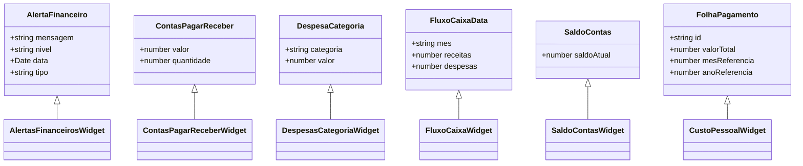
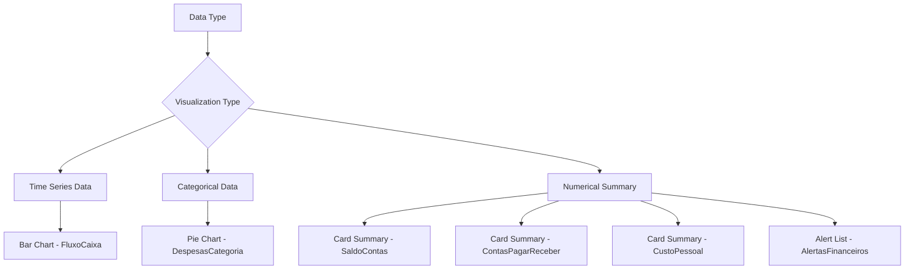
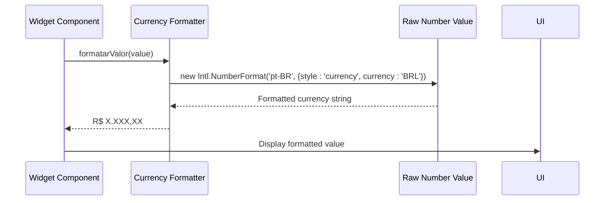
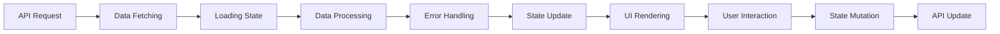
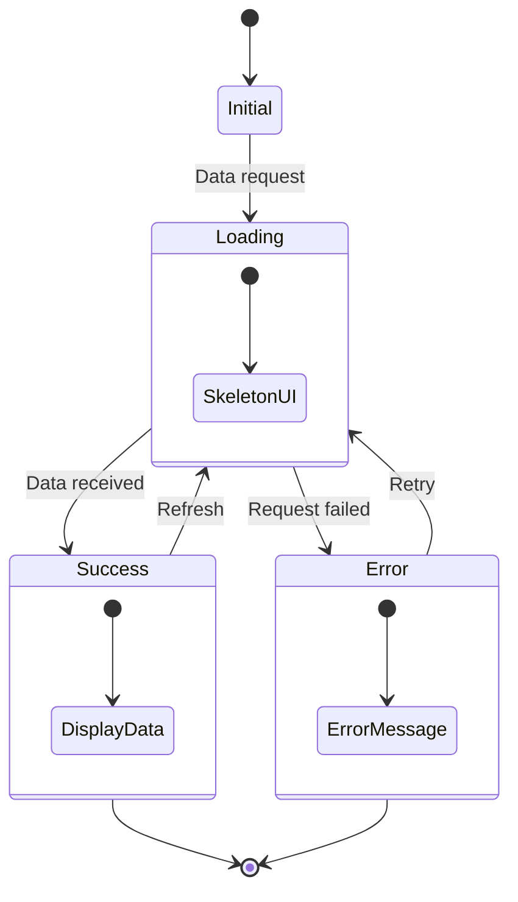
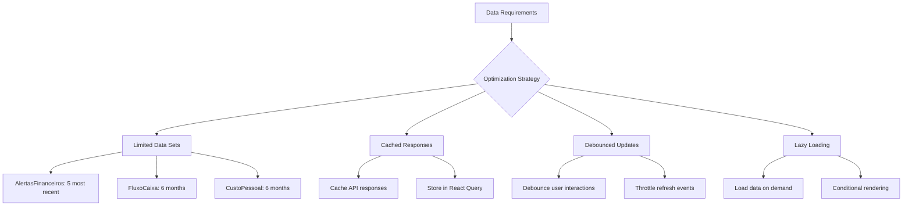
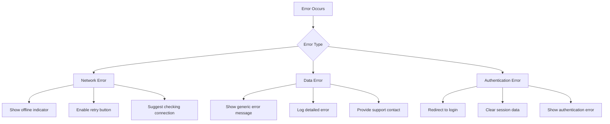

# Financial Widgets

<cite>
**Referenced Files in This Document**   
- [widget-alertas-financeiros.tsx](file://app/(dashboard)/dashboard/components/widgets/widget-alertas-financeiros.tsx)
- [widget-contas-pagar-receber.tsx](file://app/(dashboard)/dashboard/components/widgets/widget-contas-pagar-receber.tsx)
- [widget-custo-pessoal.tsx](file://app/(dashboard)/dashboard/components/widgets/widget-custo-pessoal.tsx)
- [widget-despesas-categoria.tsx](file://app/(dashboard)/dashboard/components/widgets/widget-despesas-categoria.tsx)
- [widget-fluxo-caixa.tsx](file://app/(dashboard)/dashboard/components/widgets/widget-fluxo-caixa.tsx)
- [widget-saldo-contas.tsx](file://app/(dashboard)/dashboard/components/widgets/widget-saldo-contas.tsx)
- [use-dashboard-financeiro.ts](file://app/_lib/hooks/use-dashboard-financeiro.ts)
- [use-folhas-pagamento.ts](file://app/_lib/hooks/use-folhas-pagamento.ts)
- [dashboard-types.ts](file://app/_lib/dashboard-types.ts)
- [financeiro.types.ts](file://backend/types/financeiro/salarios.types)
</cite>

## Table of Contents
1. [Introduction](#introduction)
2. [Widget Overview](#widget-overview)
3. [Data Requirements and Backend Integration](#data-requirements-and-backend-integration)
4. [Visualization Approaches](#visualization-approaches)
5. [Data Binding and Currency Formatting](#data-binding-and-currency-formatting)
6. [Real-Time Updates and Error Handling](#real-time-updates-and-error-handling)
7. [Performance Optimization](#performance-optimization)
8. [Common Issues and Troubleshooting](#common-issues-and-troubleshooting)

## Introduction
The financial widgets in Sinesys provide a comprehensive overview of key financial metrics for legal firms. These widgets are designed to deliver actionable insights through intuitive visualizations and real-time data updates. The system integrates with the financeiro module to present critical financial information in a user-friendly dashboard format, enabling users to monitor financial health, track payments, and identify potential issues quickly.

## Widget Overview

### AlertasFinanceiros Widget
The AlertasFinanceiros widget displays financial alerts and warnings to users. It shows alerts with different severity levels (danger, warning, info) using appropriate visual indicators. The widget displays up to five recent alerts and provides a link to view all alerts. Each alert includes an icon indicating its severity level and the alert message.

**Section sources**
- [widget-alertas-financeiros.tsx](file://app/(dashboard)/dashboard/components/widgets/widget-alertas-financeiros.tsx)

### ContasPagarReceber Widget
The ContasPagarReceber widget tracks accounts payable and receivable. It displays the total value and count of pending payments in two separate sections with distinct visual styling - red for accounts payable and green for accounts receivable. The widget includes quick access buttons to navigate to the respective payment management sections.

**Section sources**
- [widget-contas-pagar-receber.tsx](file://app/(dashboard)/dashboard/components/widgets/widget-contas-pagar-receber.tsx)

### CustoPessoal Widget
The CustoPessoal widget displays payroll costs and personnel expenses. It shows the current month's payroll value with comparison to the previous month, including percentage variation. The widget also displays a summary of the last six months of payroll data in a grid format, allowing users to identify trends in personnel costs.

**Section sources**
- [widget-custo-pessoal.tsx](file://app/(dashboard)/dashboard/components/widgets/widget-custo-pessoal.tsx)

### DespesasCategoria Widget
The DespesasCategoria widget visualizes expenses by category using a pie chart. It displays both a graphical representation and a textual breakdown of expenses, with each category shown in a list with its corresponding color and value. The widget supports up to five different categories with predefined colors.

**Section sources**
- [widget-despesas-categoria.tsx](file://app/(dashboard)/dashboard/components/widgets/widget-despesas-categoria.tsx)

### FluxoCaixa Widget
The FluxoCaixa widget provides cash flow visualization over a six-month period using a bar chart. It displays both revenues and expenses for each month, allowing users to identify seasonal patterns and cash flow trends. The chart uses green bars for revenues and red bars for expenses.

**Section sources**
- [widget-fluxo-caixa.tsx](file://app/(dashboard)/dashboard/components/widgets/widget-fluxo-caixa.tsx)

### SaldoContas Widget
The SaldoContas widget displays the total balance across all bank accounts. It shows the current balance in a large, prominent font and includes a link to the bank accounts management section. The widget provides a simple, at-a-glance view of the organization's total financial position.

**Section sources**
- [widget-saldo-contas.tsx](file://app/(dashboard)/dashboard/components/widgets/widget-saldo-contas.tsx)

## Data Requirements and Backend Integration

### Data Structure and API Endpoints
The financial widgets retrieve data through dedicated hooks that interface with the backend services. Each widget uses a specific hook to fetch its required data:

```mermaid
graph TD
A[Financial Widgets] --> B[Hook Layer]
B --> C[API Layer]
C --> D[Backend Services]
B --> B1[useAlertasFinanceiros]
B --> B2[useContasPagarReceber]
B --> B3[useDespesasPorCategoria]
B --> B4[useFluxoCaixa]
B --> B5[useSaldoContas]
B --> B6[useFolhasPagamento]
C --> C1[/api/dashboard/financeiro/alertas]
C --> C2[/api/dashboard/financeiro/contas]
C --> C3[/api/dashboard/financeiro/despesas-categoria]
C --> C4[/api/dashboard/financeiro/fluxo-caixa]
C --> C5[/api/dashboard/financeiro/saldo]
C --> C6[/api/rh/folhas-pagamento]
```

**Diagram sources**
- [use-dashboard-financeiro.ts](file://app/_lib/hooks/use-dashboard-financeiro.ts)
- [use-folhas-pagamento.ts](file://app/_lib/hooks/use-folhas-pagamento.ts)

### Data Models
The financial data follows specific type definitions that ensure consistency across the application:



**Diagram sources**
- [dashboard-types.ts](file://app/_lib/dashboard-types.ts)
- [financeiro.types.ts](file://backend/types/financeiro/salarios.types)

## Visualization Approaches

### Chart-Based Visualizations
The financial widgets employ different visualization techniques based on the nature of the data:



**Diagram sources**
- [widget-fluxo-caixa.tsx](file://app/(dashboard)/dashboard/components/widgets/widget-fluxo-caixa.tsx)
- [widget-despesas-categoria.tsx](file://app/(dashboard)/dashboard/components/widgets/widget-despesas-categoria.tsx)

### Color Coding Strategy
The widgets use a consistent color scheme to convey financial information:

- **Red (#ef4444)**: Expenses, liabilities, negative values
- **Green (#10b981)**: Revenues, assets, positive values
- **Blue (#3b82f6)**: Neutral information, informational alerts
- **Amber (#f59e0b)**: Warnings, cautionary alerts
- **Rose (#ef4444)**: Critical alerts, urgent issues

This color coding helps users quickly interpret the financial data without needing to read detailed text.

## Data Binding and Currency Formatting

### Currency Formatting Implementation
All financial values are formatted using the Intl.NumberFormat API to ensure proper currency display:



**Diagram sources**
- [widget-contas-pagar-receber.tsx](file://app/(dashboard)/dashboard/components/widgets/widget-contas-pagar-receber.tsx)
- [widget-despesas-categoria.tsx](file://app/(dashboard)/dashboard/components/widgets/widget-despesas-categoria.tsx)

### Data Binding Patterns
The widgets follow a consistent pattern for data binding and state management:



**Diagram sources**
- [use-dashboard-financeiro.ts](file://app/_lib/hooks/use-dashboard-financeiro.ts)

## Real-Time Updates and Error Handling

### Loading and Error States
Each widget implements consistent loading and error handling patterns:



**Diagram sources**
- [widget-alertas-financeiros.tsx](file://app/(dashboard)/dashboard/components/widgets/widget-alertas-financeiros.tsx)
- [widget-saldo-contas.tsx](file://app/(dashboard)/dashboard/components/widgets/widget-saldo-contas.tsx)

### Real-Time Update Mechanisms
The widgets support real-time updates through several mechanisms:

1. **Automatic Refresh**: Data is refreshed at regular intervals
2. **Manual Refresh**: Users can trigger updates manually
3. **Event-Driven Updates**: Changes in related modules trigger updates
4. **WebSocket Integration**: Real-time notifications for critical changes

## Performance Optimization

### Data Fetching Strategies
The financial widgets employ several optimization techniques:



**Diagram sources**
- [use-dashboard-financeiro.ts](file://app/_lib/hooks/use-dashboard-financeiro.ts)

### Rendering Optimization
The widgets implement several rendering optimizations:

- **Skeleton Screens**: Display loading states with skeleton UI
- **Conditional Rendering**: Only render components when data is available
- **Memoization**: Use React.memo to prevent unnecessary re-renders
- **Virtual Scrolling**: For lists with many items
- **Code Splitting**: Load components on demand

## Common Issues and Troubleshooting

### Data Consistency Issues
Common data consistency issues and their solutions:

| Issue | Cause | Solution |
|-------|-------|----------|
| Stale Data | Cached responses | Implement proper cache invalidation |
| Missing Data | API failures | Implement fallback values and error states |
| Inconsistent Formatting | Different formatting rules | Standardize formatting functions |
| Delayed Updates | Polling intervals | Adjust refresh intervals or implement WebSockets |

**Section sources**
- [use-dashboard-financeiro.ts](file://app/_lib/hooks/use-dashboard-financeiro.ts)

### Performance Issues
Common performance issues and their solutions:

| Issue | Cause | Solution |
|-------|-------|----------|
| Slow Loading | Large data sets | Implement pagination and data limiting |
| UI Freezing | Heavy computations | Move computations to web workers |
| Memory Leaks | Unreleased event listeners | Implement proper cleanup in useEffect |
| Excessive API Calls | Frequent refreshes | Implement debouncing and caching |

**Section sources**
- [widget-fluxo-caixa.tsx](file://app/(dashboard)/dashboard/components/widgets/widget-fluxo-caixa.tsx)

### Error States and Recovery
The widgets handle errors gracefully with appropriate user feedback:



**Diagram sources**
- [widget-alertas-financeiros.tsx](file://app/(dashboard)/dashboard/components/widgets/widget-alertas-financeiros.tsx)