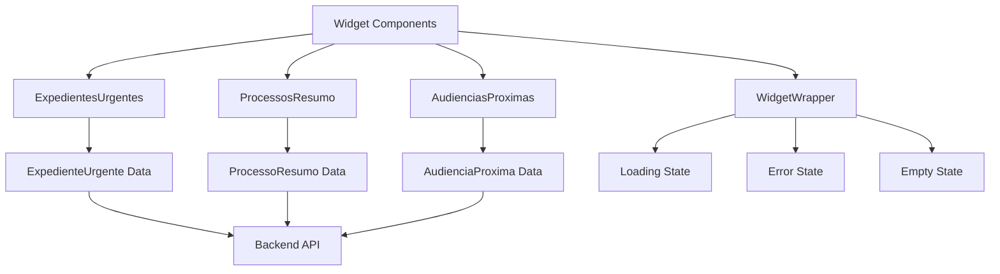
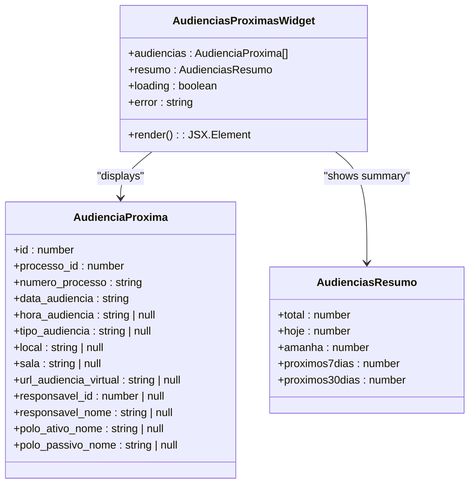
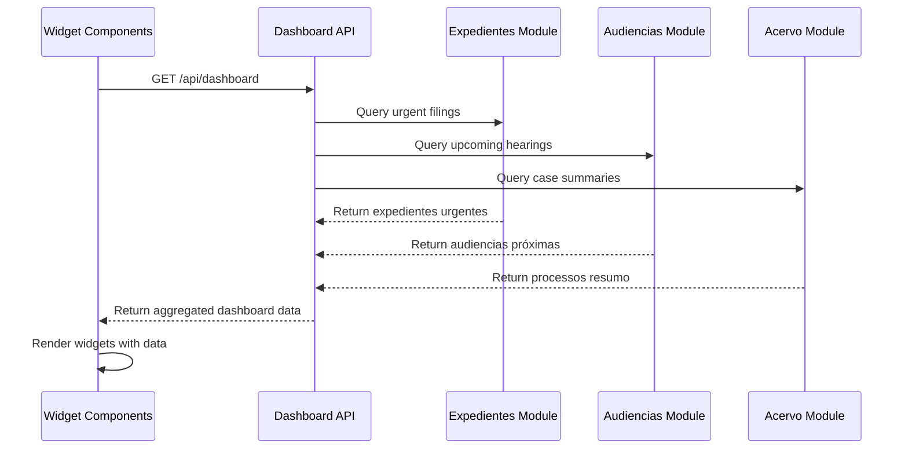
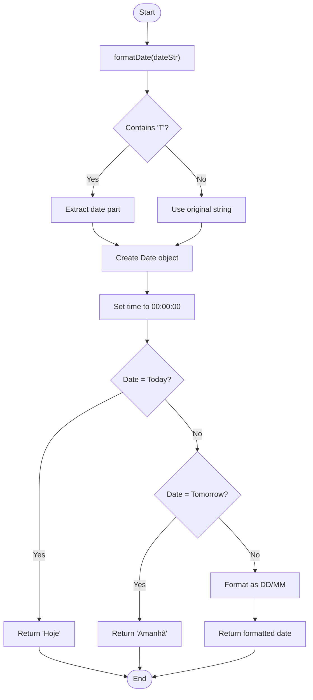
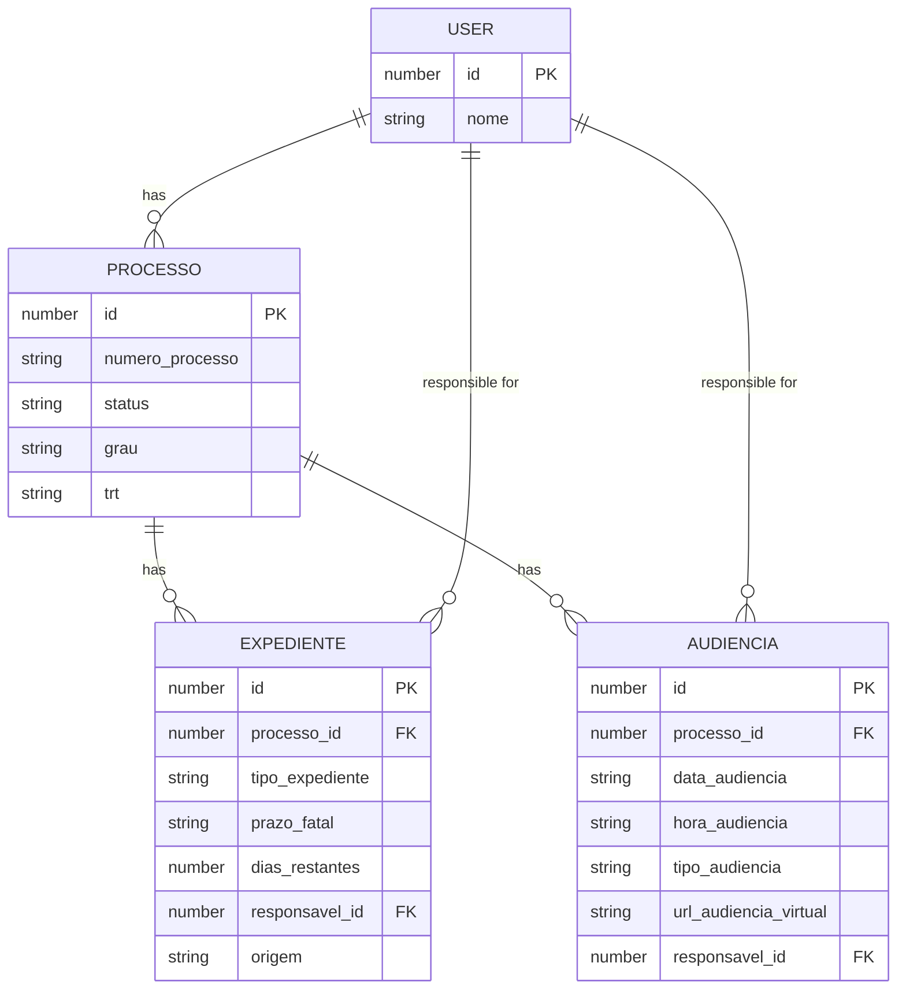

# Legal Process Widgets

<cite>
**Referenced Files in This Document**   
- [widget-expedientes-urgentes.tsx](file://app/(dashboard)/dashboard/components/widgets/widget-expedientes-urgentes.tsx)
- [widget-processos-resumo.tsx](file://app/(dashboard)/dashboard/components/widgets/widget-processos-resumo.tsx)
- [widget-audiencias-proximas.tsx](file://app/(dashboard)/dashboard/components/widgets/widget-audiencias-proximas.tsx)
- [widget-wrapper.tsx](file://app/(dashboard)/dashboard/components/widgets/widget-wrapper.tsx)
- [types.ts](file://backend/types/dashboard/types.ts)
- [dashboard-usuario.service.ts](file://backend/dashboard/services/dashboard/dashboard-usuario.service.ts)
- [dashboard-admin.service.ts](file://backend/dashboard/services/dashboard/dashboard-admin.service.ts)
- [listar-pendentes.service.ts](file://backend/expedientes/services/listar-pendentes.service.ts)
- [listar-audiencias.service.ts](file://backend/audiencias/services/listar-audiencias.service.ts)
</cite>

## Table of Contents
1. [Introduction](#introduction)
2. [Widget Architecture Overview](#widget-architecture-overview)
3. [ExpedientesUrgentes Widget](#expedientesurgentes-widget)
4. [ProcessosResumo Widget](#processosresumo-widget)
5. [AudienciasProximas Widget](#audienciasproximas-widget)
6. [Data Requirements and Backend Integration](#data-requirements-and-backend-integration)
7. [Filtering Logic and Date Handling](#filtering-logic-and-date-handling)
8. [Responsible Party Assignment](#responsible-party-assignment)
9. [User Prioritization Examples](#user-prioritization-examples)
10. [Performance Considerations](#performance-considerations)
11. [Error Handling and Data States](#error-handling-and-data-states)

## Introduction

The legal process widgets in Sinesys provide attorneys and legal teams with critical information about urgent filings, case summaries, and upcoming hearings. These widgets are designed to help users prioritize their legal tasks by presenting time-sensitive information in a clear, actionable format. The three primary widgets—ExpedientesUrgentes, ProcessosResumo, and AudienciasProximas—aggregate data from the acervo, expedientes, and audiencias modules to deliver real-time insights on case status, deadlines, and upcoming events.

These widgets are integral components of the Sinesys dashboard, offering a personalized view of each user's legal responsibilities. By visualizing urgent matters, case distributions, and hearing schedules, they enable legal professionals to manage their workload more effectively and ensure timely responses to critical legal deadlines.

**Section sources**
- [widget-expedientes-urgentes.tsx](file://app/(dashboard)/dashboard/components/widgets/widget-expedientes-urgentes.tsx)
- [widget-processos-resumo.tsx](file://app/(dashboard)/dashboard/components/widgets/widget-processos-resumo.tsx)
- [widget-audiencias-proximas.tsx](file://app/(dashboard)/dashboard/components/widgets/widget-audiencias-proximas.tsx)

## Widget Architecture Overview

The legal process widgets follow a consistent architectural pattern built on React components with client-side rendering. Each widget is implemented as a standalone component that receives data through props and renders it according to predefined visualization rules. The widgets share a common wrapper component that provides standardized styling, loading states, error handling, and interactive controls.



**Diagram sources**
- [widget-expedientes-urgentes.tsx](file://app/(dashboard)/dashboard/components/widgets/widget-expedientes-urgentes.tsx)
- [widget-processos-resumo.tsx](file://app/(dashboard)/dashboard/components/widgets/widget-processos-resumo.tsx)
- [widget-audiencias-proximas.tsx](file://app/(dashboard)/dashboard/components/widgets/widget-audiencias-proximas.tsx)
- [widget-wrapper.tsx](file://app/(dashboard)/dashboard/components/widgets/widget-wrapper.tsx)

**Section sources**
- [widget-expedientes-urgentes.tsx](file://app/(dashboard)/dashboard/components/widgets/widget-expedientes-urgentes.tsx)
- [widget-processos-resumo.tsx](file://app/(dashboard)/dashboard/components/widgets/widget-processos-resumo.tsx)
- [widget-audiencias-proximas.tsx](file://app/(dashboard)/dashboard/components/widgets/widget-audiencias-proximas.tsx)
- [widget-wrapper.tsx](file://app/(dashboard)/dashboard/components/widgets/widget-wrapper.tsx)

## ExpedientesUrgentes Widget

The ExpedientesUrgentes widget displays urgent filings that require immediate attention. It highlights expedientes based on their remaining days until the deadline, with visual indicators for urgency levels. The widget shows a summary of all urgent filings and lists the most critical ones at the top.

The widget categorizes filings into four urgency levels:
- **Overdue**: Filings that have passed their deadline (shown in red)
- **Today**: Filings due today (shown in orange)
- **Tomorrow**: Filings due tomorrow (shown in yellow)
- **Upcoming**: Filings due in more than one day (shown in green)

```mermaid
classDiagram
class ExpedientesUrgentesWidget {
+expedientes : ExpedienteUrgente[]
+resumo : ExpedientesResumo
+loading : boolean
+error : string
+render() : JSX.Element
}
class ExpedienteUrgente {
+id : number
+processo_id : number
+numero_processo : string
+tipo_expediente : string
+prazo_fatal : string
+status : string
+dias_restantes : number
+responsavel_id : number | null
+responsavel_nome : string | null
+origem : 'expedientes' | 'expedientes_manuais'
}
class ExpedientesResumo {
+total : number
+vencidos : number
+venceHoje : number
+venceAmanha : number
+proximos7dias : number
+porTipo : {tipo : string; count : number}[]
}
ExpedientesUrgentesWidget --> ExpedienteUrgente : "displays"
ExpedientesUrgentesWidget --> ExpedientesResumo : "shows summary"
```

**Diagram sources**
- [widget-expedientes-urgentes.tsx](file://app/(dashboard)/dashboard/components/widgets/widget-expedientes-urgentes.tsx)
- [types.ts](file://backend/types/dashboard/types.ts)

**Section sources**
- [widget-expedientes-urgentes.tsx](file://app/(dashboard)/dashboard/components/widgets/widget-expedientes-urgentes.tsx)
- [types.ts](file://backend/types/dashboard/types.ts)

## ProcessosResumo Widget

The ProcessosResumo widget provides a comprehensive summary of a user's cases, showing the distribution between active and archived cases. It includes visualizations of case distribution by tribunal (TRT) and by court level (grau), helping users understand their caseload composition.

The widget displays key metrics including the total number of cases, active cases, archived cases, and the percentage of active cases. It also shows the top tribunals handling the user's cases and the distribution between first and second degree cases.

```mermaid
classDiagram
class ProcessosResumoWidget {
+data : ProcessoResumo
+loading : boolean
+error : string
+render() : JSX.Element
}
class ProcessoResumo {
+total : number
+ativos : number
+arquivados : number
+porGrau : {grau : string; count : number}[]
+porTRT : {trt : string; count : number}[]
}
ProcessosResumoWidget --> ProcessoResumo : "displays"
```

**Diagram sources**
- [widget-processos-resumo.tsx](file://app/(dashboard)/dashboard/components/widgets/widget-processos-resumo.tsx)
- [types.ts](file://backend/types/dashboard/types.ts)

**Section sources**
- [widget-processos-resumo.tsx](file://app/(dashboard)/dashboard/components/widgets/widget-processos-resumo.tsx)
- [types.ts](file://backend/types/dashboard/types.ts)

## AudienciasProximas Widget

The AudienciasProximas widget displays upcoming hearings with detailed information about each hearing. It shows hearings scheduled for today, tomorrow, and the next 30 days, with special highlighting for today's hearings.

The widget provides information about the hearing date, time, type, location (physical or virtual), and responsible party. For virtual hearings, it includes a direct link to access the virtual hearing room. The widget also shows quick statistics for hearings today, in the next 7 days, and in the next 30 days.



**Diagram sources**
- [widget-audiencias-proximas.tsx](file://app/(dashboard)/dashboard/components/widgets/widget-audiencias-proximas.tsx)
- [types.ts](file://backend/types/dashboard/types.ts)

**Section sources**
- [widget-audiencias-proximas.tsx](file://app/(dashboard)/dashboard/components/widgets/widget-audiencias-proximas.tsx)
- [types.ts](file://backend/types/dashboard/types.ts)

## Data Requirements and Backend Integration

The legal process widgets retrieve their data from the Sinesys backend through API endpoints that aggregate information from multiple modules. The dashboard service combines data from the acervo, expedientes, and audiencias modules to provide a unified view for each user.



**Diagram sources**
- [dashboard-usuario.service.ts](file://backend/dashboard/services/dashboard/dashboard-usuario.service.ts)
- [types.ts](file://backend/types/dashboard/types.ts)

**Section sources**
- [dashboard-usuario.service.ts](file://backend/dashboard/services/dashboard/dashboard-usuario.service.ts)
- [types.ts](file://backend/types/dashboard/types.ts)

## Filtering Logic and Date Handling

The widgets implement sophisticated filtering and date handling logic to present relevant information to users. The ExpedientesUrgentes widget sorts filings by urgency, with overdue filings appearing first, followed by those due today, tomorrow, and then upcoming filings. The AudienciasProximas widget sorts hearings chronologically, with today's hearings highlighted.

Date formatting is handled consistently across widgets, with special labels for "Today" and "Tomorrow" to make time-sensitive information immediately apparent. The widgets also handle various date formats from the backend, ensuring consistent presentation regardless of the source system.



**Diagram sources**
- [widget-audiencias-proximas.tsx](file://app/(dashboard)/dashboard/components/widgets/widget-audiencias-proximas.tsx#L20-L45)

**Section sources**
- [widget-audiencias-proximas.tsx](file://app/(dashboard)/dashboard/components/widgets/widget-audiencias-proximas.tsx#L20-L45)
- [widget-expedientes-urgentes.tsx](file://app/(dashboard)/dashboard/components/widgets/widget-expedientes-urgentes.tsx#L21-L56)

## Responsible Party Assignment

The widgets display responsible party information when available, allowing users to quickly identify who is handling each case or filing. The responsible party data is retrieved from the backend and displayed in the widget interface.

For expedientes, the responsible party is shown in the ExpedientesUrgentes widget, while for hearings, the responsible party is displayed in the AudienciasProximas widget. This information helps team members coordinate their work and ensures accountability for time-sensitive matters.

The responsible party assignment is managed through the backend systems, with the expedientes and audiencias modules storing the responsible user ID and name. The dashboard service aggregates this information and includes it in the response to the frontend widgets.

**Section sources**
- [types.ts](file://backend/types/dashboard/types.ts)
- [widget-expedientes-urgentes.tsx](file://app/(dashboard)/dashboard/components/widgets/widget-expedientes-urgentes.tsx)
- [widget-audiencias-proximas.tsx](file://app/(dashboard)/dashboard/components/widgets/widget-audiencias-proximas.tsx)

## User Prioritization Examples

The legal process widgets help users prioritize their tasks by visually highlighting the most urgent matters. For example, an attorney can quickly identify which filings are overdue or due today, allowing them to address the most critical deadlines first.

When managing multiple cases, the ProcessosResumo widget helps users understand their caseload distribution, identifying areas where they may need to allocate more resources. The AudienciasProximas widget ensures that attorneys don't miss upcoming hearings, particularly virtual ones that require specific access links.

The widgets also support team collaboration by showing responsible parties, allowing team leaders to redistribute work if someone has an excessive workload. The visual indicators make it easy to scan the dashboard and identify areas that require immediate attention.

**Section sources**
- [widget-expedientes-urgentes.tsx](file://app/(dashboard)/dashboard/components/widgets/widget-expedientes-urgentes.tsx)
- [widget-processos-resumo.tsx](file://app/(dashboard)/dashboard/components/widgets/widget-processos-resumo.tsx)
- [widget-audiencias-proximas.tsx](file://app/(dashboard)/dashboard/components/widgets/widget-audiencias-proximas.tsx)

## Performance Considerations

The widgets are designed with performance in mind, implementing several optimizations to ensure fast loading and smooth user experience. Data is cached on the backend with appropriate TTL values, reducing the need for repeated database queries.

The ExpedientesUrgentes and AudienciasProximas widgets limit the number of items displayed in the main view to four, showing only the most urgent or upcoming items. This reduces rendering time and keeps the interface focused on the most critical information.

Loading states are implemented to provide feedback while data is being retrieved, and the widgets handle real-time updates efficiently by only refreshing when necessary. The backend services are optimized to aggregate data quickly from multiple sources, minimizing response times.



**Diagram sources**
- [types.ts](file://backend/types/dashboard/types.ts)
- [DASHBOARD_CACHE_TTL](file://backend/types/dashboard/types.ts#L210-L214)

**Section sources**
- [types.ts](file://backend/types/dashboard/types.ts)
- [widget-wrapper.tsx](file://app/(dashboard)/dashboard/components/widgets/widget-wrapper.tsx)

## Error Handling and Data States

The widgets implement comprehensive error handling to provide a robust user experience. The WidgetWrapper component handles three primary states: loading, error, and empty.

During data loading, skeleton screens are displayed to indicate that content is being retrieved. If an error occurs while fetching data, an error message is displayed with appropriate styling to draw attention to the issue. When no data is available, empty states with helpful messages are shown to guide the user.

The widgets also handle missing data gracefully, displaying placeholder values or omitting fields when specific information is not available. This ensures that the interface remains usable even when some data points are missing.

**Section sources**
- [widget-wrapper.tsx](file://app/(dashboard)/dashboard/components/widgets/widget-wrapper.tsx)
- [widget-expedientes-urgentes.tsx](file://app/(dashboard)/dashboard/components/widgets/widget-expedientes-urgentes.tsx)
- [widget-processos-resumo.tsx](file://app/(dashboard)/dashboard/components/widgets/widget-processos-resumo.tsx)
- [widget-audiencias-proximas.tsx](file://app/(dashboard)/dashboard/components/widgets/widget-audiencias-proximas.tsx)