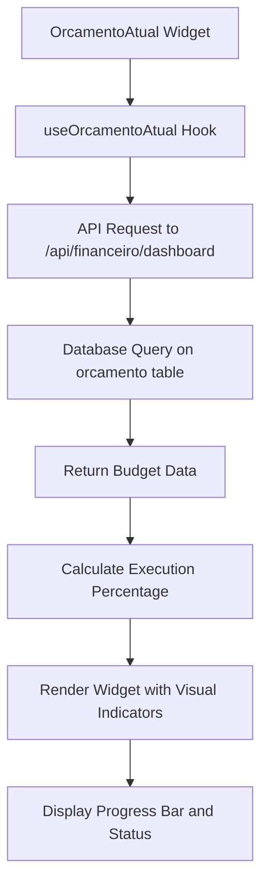
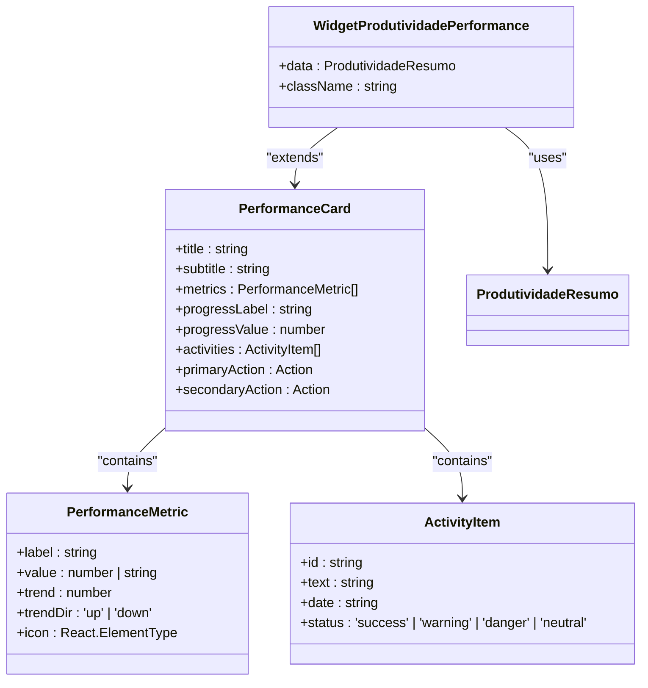
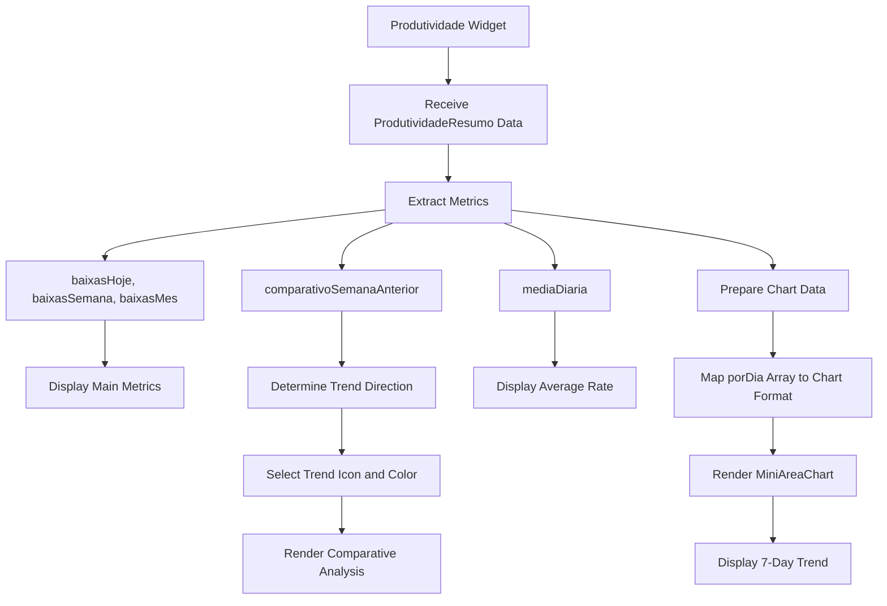
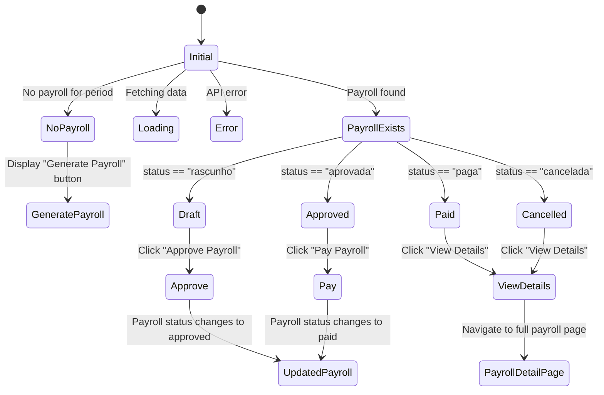
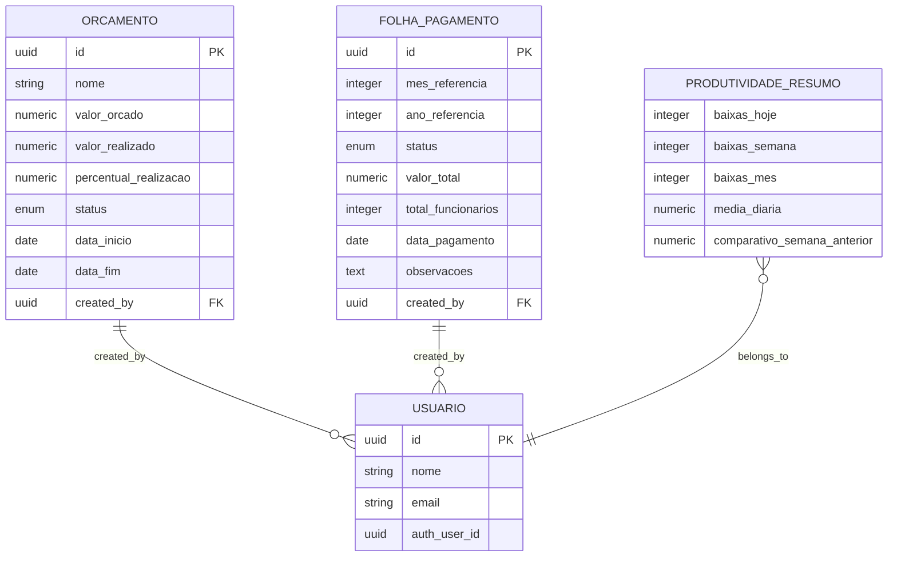
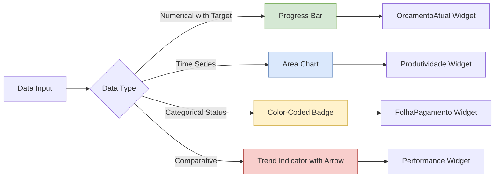
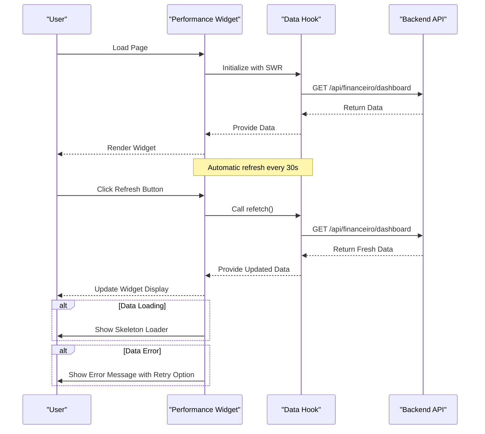

# Performance Widgets

<cite>
**Referenced Files in This Document**   
- [widget-orcamento-atual.tsx](file://app/(dashboard)/dashboard/components/widgets/widget-orcamento-atual.tsx)
- [widget-folha-pagamento.tsx](file://app/(dashboard)/dashboard/components/widgets/widget-folha-pagamento.tsx)
- [widget-performance.tsx](file://app/(dashboard)/dashboard/components/widgets/widget-performance.tsx)
- [widget-produtividade.tsx](file://app/(dashboard)/dashboard/components/widgets/widget-produtividade.tsx)
- [use-dashboard-financeiro.ts](file://app/_lib/hooks/use-dashboard-financeiro.ts)
- [use-folhas-pagamento.ts](file://app/_lib/hooks/use-folhas-pagamento.ts)
- [dashboard-content.tsx](file://app/(dashboard)/dashboard/components/dashboard-content.tsx)
- [dashboard-types.ts](file://app/_lib/dashboard-types.ts)
</cite>

## Table of Contents
1. [Introduction](#introduction)
2. [OrcamentoAtual Widget](#orcamentoatual-widget)
3. [Performance Widget](#performance-widget)
4. [Produtividade Widget](#produtividade-widget)
5. [FolhaPagamento Widget](#folhapagamento-widget)
6. [Data Requirements and Integration](#data-requirements-and-integration)
7. [Visualization Approaches](#visualization-approaches)
8. [Data Refresh and Performance Optimization](#data-refresh-and-performance-optimization)
9. [Conclusion](#conclusion)

## Introduction

The Sinesys platform features a comprehensive dashboard system with specialized performance widgets designed to provide users with critical insights into financial, team, and operational metrics. These widgets serve as key performance indicators (KPIs) for monitoring budget execution, team productivity, and payroll status. The system integrates data from multiple modules including financeiro (financial), orcamentos (budgets), and rh (human resources) to deliver real-time analytics and trend analysis.

The performance widgets are built using a client-side React architecture with data fetching handled through custom hooks that interface with backend APIs. Each widget is designed to present complex data in an intuitive visual format, using progress indicators, charts, and summary statistics to enable quick assessment of key metrics. The widgets are responsive and include loading states, error handling, and interactive elements for deeper exploration of the underlying data.

**Section sources**
- [dashboard-content.tsx](file://app/(dashboard)/dashboard/components/dashboard-content.tsx)

## OrcamentoAtual Widget

The OrcamentoAtual widget provides real-time monitoring of active budgets, displaying key metrics such as budgeted amount, actual spending, and percentage of budget execution. This widget serves as a critical tool for financial oversight, enabling users to track budget performance and identify potential overruns.

The widget displays the current budget name, execution percentage, and status, with visual indicators that change color based on performance. When the execution percentage exceeds 100%, the status indicator turns red (destructive), signaling budget overrun. Between 90-100%, it appears in secondary color, indicating the budget is nearing completion. Below 90%, it displays in the default color, indicating healthy budget execution.

Data for this widget is retrieved through the `useOrcamentoAtual` hook, which fetches budget information from the financeiro module. The widget includes a progress bar that visually represents the percentage of budget execution, with supporting text showing both the budgeted and actual amounts in Brazilian Real (BRL) currency format. Users can click the "Details" link to navigate to the full budget management interface for more comprehensive analysis.

**Diagram sources**
- [widget-orcamento-atual.tsx](file://app/(dashboard)/dashboard/components/widgets/widget-orcamento-atual.tsx)
- [use-dashboard-financeiro.ts](file://app/_lib/hooks/use-dashboard-financeiro.ts)

**Section sources**
- [widget-orcamento-atual.tsx](file://app/(dashboard)/dashboard/components/widgets/widget-orcamento-atual.tsx)
- [use-dashboard-financeiro.ts](file://app/_lib/hooks/use-dashboard-financeiro.ts)

## Performance Widget

The Performance widget offers a comprehensive view of team metrics through a flexible card-based interface that can be configured for various performance tracking scenarios. This widget is designed to display key performance indicators with trend analysis, progress tracking, and recent activity logs.

The widget structure includes a header with title and subtitle, followed by a grid of performance metrics, an optional progress bar, and a section for recent activities. Each metric can include a value, label, and trend indicator showing percentage change with directional arrows (up/down). The progress bar component provides visual feedback on goal completion, with dynamic coloring based on progress level: green for 80%+, amber for 60-79%, and red for below 60%.

A specialized variant, `WidgetProdutividadePerformance`, is implemented for productivity tracking, displaying metrics for daily, weekly, and monthly performance with comparative analysis against previous periods. This implementation demonstrates the widget's adaptability to different performance tracking needs while maintaining a consistent user interface pattern.

**Diagram sources**
- [widget-performance.tsx](file://app/(dashboard)/dashboard/components/widgets/widget-performance.tsx)

**Section sources**
- [widget-performance.tsx](file://app/(dashboard)/dashboard/components/widgets/widget-performance.tsx)

## Produtividade Widget

The Produtividade widget focuses on productivity analysis, providing detailed metrics on task completion rates and performance trends over time. This widget combines numerical data with visual charting to offer both immediate insights and historical context for productivity assessment.

The widget displays three primary metrics: daily, weekly, and monthly productivity counts, presented in a three-column layout for easy comparison. Below these metrics, a mini area chart visualizes productivity trends over the past seven days, helping users identify patterns and fluctuations in their workflow. The chart includes weekday labels on the x-axis and productivity values on the y-axis, with a gradient fill to enhance visual appeal.

A comparative analysis section shows the percentage change in weekly productivity compared to the previous week, with appropriate trend icons (up/down/neutral) and color coding (green/red/gray) to quickly convey performance direction. The widget also displays the average daily productivity rate, providing a benchmark for consistent performance evaluation.

**Diagram sources**
- [widget-produtividade.tsx](file://app/(dashboard)/dashboard/components/widgets/widget-produtividade.tsx)

**Section sources**
- [widget-produtividade.tsx](file://app/(dashboard)/dashboard/components/widgets/widget-produtividade.tsx)

## FolhaPagamento Widget

The FolhaPagamento widget provides a comprehensive overview of the current month's payroll status, serving as a central hub for payroll management and monitoring. This widget displays the current period, payroll status, total value, and employee count, along with appropriate action buttons based on the current status.

The widget dynamically adapts its interface based on the payroll status: "rascunho" (draft), "aprovada" (approved), "paga" (paid), or "cancelada" (cancelled). For draft payrolls, it displays an "Approve Payroll" button; for approved payrolls, a "Pay Payroll" button; and for paid or cancelled payrolls, a "View Details" button. When no payroll exists for the current period, it prompts the user to generate a new payroll.

Data for this widget is retrieved through the `useFolhaDoPeriodo` hook, which fetches payroll information for the current month and year. The widget includes an "Update" button that allows users to refresh the data manually. Status indicators use color-coded badges with predefined color schemes for each status, providing immediate visual feedback on the payroll's state.

**Diagram sources**
- [widget-folha-pagamento.tsx](file://app/(dashboard)/dashboard/components/widgets/widget-folha-pagamento.tsx)
- [use-folhas-pagamento.ts](file://app/_lib/hooks/use-folhas-pagamento.ts)

**Section sources**
- [widget-folha-pagamento.tsx](file://app/(dashboard)/dashboard/components/widgets/widget-folha-pagamento.tsx)
- [use-folhas-pagamento.ts](file://app/_lib/hooks/use-folhas-pagamento.ts)

## Data Requirements and Integration

The performance widgets in Sinesys integrate with multiple backend modules to retrieve the necessary data for display. Each widget has specific data requirements that are fulfilled through dedicated API endpoints and database queries.

The OrcamentoAtual widget relies on the financeiro module, specifically the orcamentos service, to retrieve current budget information. It requires data including budget name, budgeted amount, actual amount spent, execution percentage, and status. This data is accessed through the `/api/financeiro/dashboard` endpoint, which aggregates financial metrics from various sources within the financeiro module.

The FolhaPagamento widget integrates with the rh (recursos humanos) module, accessing payroll data through the `/api/rh/folhas-pagamento` endpoints. It requires information about the current month's payroll including status, total value, employee count, and payment date. The widget uses the `useFolhaDoPeriodo` hook to fetch data for a specific year and month, with the backend service querying the salarios and related tables in the database.

The Performance and Produtividade widgets source their data from the dashboard module, which acts as an aggregation layer for metrics from various parts of the system. The Produtividade widget specifically requires productivity data including daily, weekly, and monthly completion counts, comparative analysis with previous periods, and average daily rates. This data is structured in the `ProdutividadeResumo` type and is retrieved through the dashboard API.

**Diagram sources**
- [use-dashboard-financeiro.ts](file://app/_lib/hooks/use-dashboard-financeiro.ts)
- [use-folhas-pagamento.ts](file://app/_lib/hooks/use-folhas-pagamento.ts)
- [dashboard-types.ts](file://app/_lib/dashboard-types.ts)

**Section sources**
- [use-dashboard-financeiro.ts](file://app/_lib/hooks/use-dashboard-financeiro.ts)
- [use-folhas-pagamento.ts](file://app/_lib/hooks/use-folhas-pagamento.ts)
- [dashboard-types.ts](file://app/_lib/dashboard-types.ts)

## Visualization Approaches

The performance widgets employ various visualization techniques to present data in an intuitive and actionable format. These approaches combine visual indicators, charts, and structured layouts to facilitate quick comprehension of complex information.

Progress indicators are used extensively across the widgets, particularly in the OrcamentoAtual and Performance components. The progress bar in OrcamentoAtual provides a clear visual representation of budget execution percentage, with dynamic coloring that changes based on performance thresholds. This immediate visual feedback helps users quickly identify budgets that are on track or at risk of overrun.

Chart-based visualizations are implemented in the Produtividade widget, which uses a mini area chart to display productivity trends over time. The chart shows daily productivity values for the past seven days, allowing users to identify patterns and fluctuations in their workflow. The chart includes weekday abbreviations on the x-axis and uses a gradient fill to enhance visual appeal while maintaining clarity.

Status indicators use color-coded badges with semantic meanings: green for positive/complete status, amber for warning/nearing completion, and red for negative/over limit status. These consistent color schemes across widgets create a unified visual language that users can quickly learn and apply across different contexts.

**Diagram sources**
- [widget-orcamento-atual.tsx](file://app/(dashboard)/dashboard/components/widgets/widget-orcamento-atual.tsx)
- [widget-produtividade.tsx](file://app/(dashboard)/dashboard/components/widgets/widget-produtividade.tsx)
- [widget-folha-pagamento.tsx](file://app/(dashboard)/dashboard/components/widgets/widget-folha-pagamento.tsx)
- [widget-performance.tsx](file://app/(dashboard)/dashboard/components/widgets/widget-performance.tsx)

**Section sources**
- [widget-orcamento-atual.tsx](file://app/(dashboard)/dashboard/components/widgets/widget-orcamento-atual.tsx)
- [widget-produtividade.tsx](file://app/(dashboard)/dashboard/components/widgets/widget-produtividade.tsx)
- [widget-folha-pagamento.tsx](file://app/(dashboard)/dashboard/components/widgets/widget-folha-pagamento.tsx)
- [widget-performance.tsx](file://app/(dashboard)/dashboard/components/widgets/widget-performance.tsx)

## Data Refresh and Performance Optimization

The performance widgets implement several strategies for data refresh and performance optimization to ensure responsive user experiences while minimizing unnecessary network requests and computational overhead.

Data fetching is managed through React hooks that leverage the SWR (stale-while-revalidate) library for efficient data synchronization. The `useDashboardFinanceiro` hook, for example, implements automatic refreshing every 30 seconds (30000ms) to keep financial data up-to-date without requiring manual user intervention. This balance between freshness and performance prevents excessive API calls while ensuring data remains reasonably current.

For user-initiated refreshes, widgets include explicit refresh buttons that trigger the `refetch` function from their respective hooks. This allows users to manually update data when they need the most current information, such as after making changes in related modules. The FolhaPagamento widget, for instance, includes an "Update" button that calls the `refetch` function to refresh payroll data.

Error handling and loading states are implemented to provide feedback during data retrieval. Skeleton loaders display placeholder content while data is being fetched, maintaining layout stability and providing visual feedback that content is loading. Error states display user-friendly messages and include retry mechanisms, ensuring the interface remains functional even when data cannot be retrieved.

**Diagram sources**
- [use-dashboard-financeiro.ts](file://app/_lib/hooks/use-dashboard-financeiro.ts)
- [use-folhas-pagamento.ts](file://app/_lib/hooks/use-folhas-pagamento.ts)
- [widget-folha-pagamento.tsx](file://app/(dashboard)/dashboard/components/widgets/widget-folha-pagamento.tsx)

**Section sources**
- [use-dashboard-financeiro.ts](file://app/_lib/hooks/use-dashboard-financeiro.ts)
- [use-folhas-pagamento.ts](file://app/_lib/hooks/use-folhas-pagamento.ts)
- [widget-folha-pagamento.tsx](file://app/(dashboard)/dashboard/components/widgets/widget-folha-pagamento.tsx)

## Conclusion

The performance widgets in Sinesys provide a comprehensive suite of tools for monitoring and analyzing key business metrics across financial, team, and operational domains. By integrating data from the financeiro, orcamentos, and rh modules, these widgets offer actionable insights through intuitive visualizations and real-time data presentation.

The design of these widgets follows a consistent pattern of combining summary metrics with detailed visualizations and contextual information, enabling users to quickly assess performance and identify areas requiring attention. The implementation leverages React's component architecture and SWR for efficient data management, ensuring responsive user experiences with appropriate loading and error states.

Future enhancements could include customizable time periods for analysis, comparative views across different teams or departments, and predictive analytics based on historical trends. The modular design of the widgets allows for easy extension and adaptation to new performance tracking requirements, making them a flexible foundation for ongoing business intelligence capabilities.