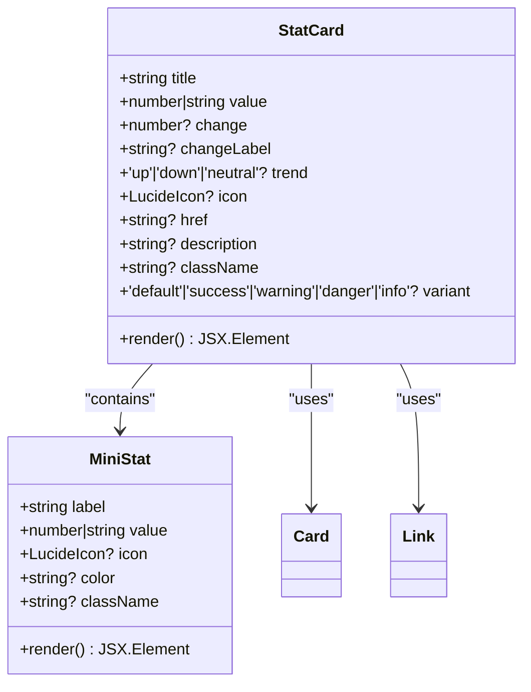
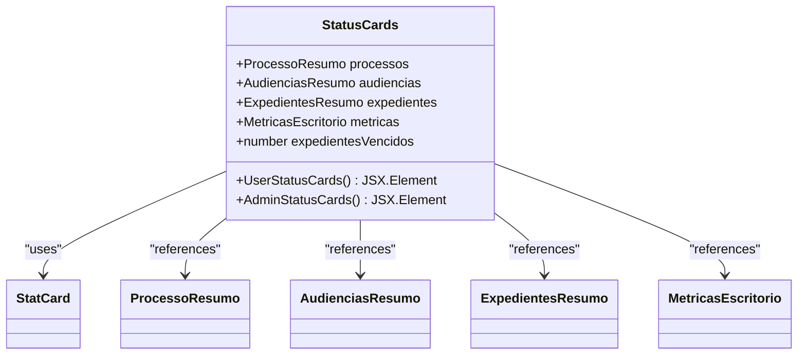
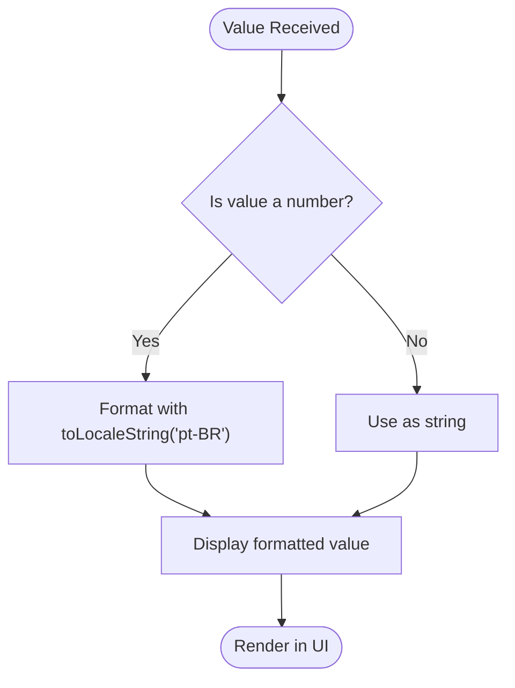
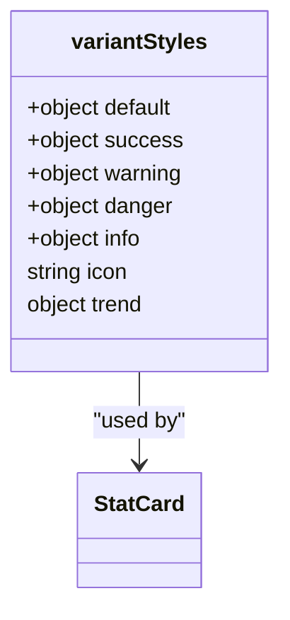
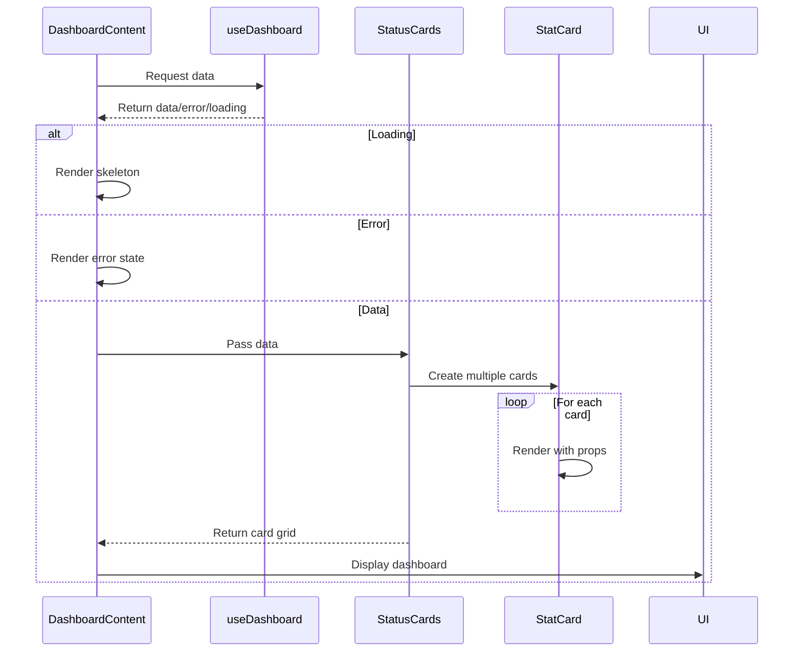

# Stat Cards

<cite>
**Referenced Files in This Document**   
- [stat-card.tsx](file://app/(dashboard)/dashboard/components/widgets/stat-card.tsx)
- [status-cards.tsx](file://app/(dashboard)/dashboard/components/widgets/status-cards.tsx)
- [dashboard-content.tsx](file://app/(dashboard)/dashboard/components/dashboard-content.tsx)
</cite>

## Table of Contents
1. [Introduction](#introduction)
2. [StatCard Component](#statcard-component)
3. [StatusCards Component](#statuscards-component)
4. [Data Formatting and Localization](#data-formatting-and-localization)
5. [Responsive Design](#responsive-design)
6. [Accessibility Features](#accessibility-features)
7. [Usage Examples](#usage-examples)
8. [Styling Customization](#styling-customization)
9. [Loading States and Error Handling](#loading-states-and-error-handling)
10. [Integration with Dashboard](#integration-with-dashboard)

## Introduction
The Stat Cards system in Sinesys provides a flexible and visually appealing way to display key performance indicators across the application. These components are designed to present important metrics in a clear, concise format with support for trend indicators, icons, and interactive elements. The system consists of two main components: StatCard for individual metrics and StatusCards for managing multiple stat cards in a grid layout.

**Section sources**
- [stat-card.tsx](file://app/(dashboard)/dashboard/components/widgets/stat-card.tsx#L1-L150)
- [status-cards.tsx](file://app/(dashboard)/dashboard/components/widgets/status-cards.tsx#L1-L117)

## StatCard Component
The StatCard component is a reusable widget that displays a single metric with supporting information. It accepts several props to customize its appearance and behavior:

- **title**: The label describing the metric
- **value**: The primary value to display (number or string)
- **change**: Percentage change value for trend display
- **changeLabel**: Additional context for the change value
- **trend**: Direction of trend ('up', 'down', or 'neutral')
- **icon**: Lucide icon to display alongside the metric
- **href**: Optional link for card navigation
- **description**: Secondary text providing additional context
- **variant**: Visual style variant ('default', 'success', 'warning', 'danger', 'info')

The component automatically formats numeric values using Brazilian Portuguese localization (toLocaleString('pt-BR')) and displays trend indicators with appropriate icons and color coding based on the variant. When an href is provided, the entire card becomes clickable via a Next.js Link component.

**Diagram sources**
- [stat-card.tsx](file://app/(dashboard)/dashboard/components/widgets/stat-card.tsx#L8-L150)

**Section sources**
- [stat-card.tsx](file://app/(dashboard)/dashboard/components/widgets/stat-card.tsx#L8-L150)

## StatusCards Component
The StatusCards component manages multiple StatCard instances in a responsive grid layout. It provides two variants:

1. **UserStatusCards**: Displays four cards for regular users with metrics for active cases, today's hearings, pending matters, and items due today
2. **AdminStatusCards**: Displays three cards for administrators with metrics for active cases, monthly hearings, and overdue matters

The component uses different grid layouts based on screen size:
- 1 column on small screens
- 2 columns on medium screens
- 4 columns for user cards on extra-large screens
- 3 columns for admin cards on large screens

Card variants and trends are dynamically determined based on data values (e.g., warning variant when hearings exist today, danger variant when overdue matters exist).

**Diagram sources**
- [status-cards.tsx](file://app/(dashboard)/dashboard/components/widgets/status-cards.tsx#L1-L117)

**Section sources**
- [status-cards.tsx](file://app/(dashboard)/dashboard/components/widgets/status-cards.tsx#L1-L117)

## Data Formatting and Localization
The StatCard component implements automatic data formatting for numeric values using the Brazilian Portuguese locale (pt-BR). This ensures proper formatting of large numbers with thousands separators according to regional conventions. The formatting is applied conditionally based on the value type:

**Diagram sources**
- [stat-card.tsx](file://app/(dashboard)/dashboard/components/widgets/stat-card.tsx#L88-L89)
- [stat-card.tsx](file://app/(dashboard)/dashboard/components/widgets/stat-card.tsx#L144-L145)

**Section sources**
- [stat-card.tsx](file://app/(dashboard)/dashboard/components/widgets/stat-card.tsx#L88-L89)
- [stat-card.tsx](file://app/(dashboard)/dashboard/components/widgets/stat-card.tsx#L144-L145)

## Responsive Design
The stat card components are designed with responsive layouts that adapt to different screen sizes. The StatusCards component uses CSS Grid with responsive breakpoints:

- Small screens (sm): 1 column
- Medium screens: 2 columns
- Large screens: 3 or 4 columns depending on the card type

The grid is implemented using Tailwind CSS classes with the following structure:
- User cards: grid-cols-1 sm:grid-cols-2 xl:grid-cols-4
- Admin cards: grid-cols-1 sm:grid-cols-3

Each StatCard also includes responsive typography with text sizes that scale appropriately across devices.

**Section sources**
- [status-cards.tsx](file://app/(dashboard)/dashboard/components/widgets/status-cards.tsx#L24-L82)

## Accessibility Features
The StatCard component includes several accessibility features:

1. **Semantic HTML**: Uses appropriate heading levels and semantic elements
2. **Color contrast**: Ensures sufficient contrast between text and background colors
3. **Focus management**: Interactive cards (with href) are keyboard navigable
4. **ARIA labels**: Implicitly provided through semantic structure
5. **Screen reader support**: Text hierarchy and descriptions are properly structured

The component also includes visual feedback on hover (shadow elevation) and cursor changes for interactive cards, enhancing usability for all users.

**Section sources**
- [stat-card.tsx](file://app/(dashboard)/dashboard/components/widgets/stat-card.tsx#L81-L82)

## Usage Examples
The stat card components are used to display various key performance indicators throughout the application:

### Case Counts
- Active cases with archived case count in description
- Today's hearings with upcoming hearings in the next 7 days
- Pending matters with overdue count
- Items due today with items due tomorrow

### Financial Summaries
- Account balances
- Accounts payable and receivable
- Cash flow projections
- Budget status

### Task Completion Rates
- Hearing attendance rates
- Document submission deadlines
- Case resolution timelines
- Client communication follow-ups

These examples demonstrate the flexibility of the StatCard component in presenting different types of metrics with appropriate visual indicators.

**Section sources**
- [status-cards.tsx](file://app/(dashboard)/dashboard/components/widgets/status-cards.tsx#L26-L64)
- [dashboard-content.tsx](file://app/(dashboard)/dashboard/components/dashboard-content.tsx#L98-L100)

## Styling Customization
The StatCard component supports extensive styling customization through several mechanisms:

1. **Variant system**: Five predefined color variants (default, success, warning, danger, info) with corresponding icon and trend color schemes
2. **CSS classes**: Custom className prop for additional styling
3. **Inline styles**: For the MiniStat component, direct color props
4. **Theme integration**: Uses Tailwind CSS with dark mode support

The variant system defines specific color combinations for different contexts:
- Success: Emerald/green tones
- Warning: Amber/yellow tones
- Danger: Red tones
- Info: Sky/blue tones
- Default: Primary color

**Diagram sources**
- [stat-card.tsx](file://app/(dashboard)/dashboard/components/widgets/stat-card.tsx#L21-L62)

**Section sources**
- [stat-card.tsx](file://app/(dashboard)/dashboard/components/widgets/stat-card.tsx#L21-L62)

## Loading States and Error Handling
The stat card system includes robust handling for loading states and errors:

1. **Loading states**: While data is being fetched, skeleton loaders display with animated placeholders
2. **Error states**: Comprehensive error handling with retry functionality
3. **Fallback content**: Graceful degradation when data is unavailable

The dashboard skeleton component displays placeholder cards with animated shimmer effects during loading. Error states include descriptive messages and retry buttons with refresh icons, providing clear feedback and recovery options.

**Section sources**
- [dashboard-content.tsx](file://app/(dashboard)/dashboard/components/dashboard-content.tsx#L25-L52)
- [dashboard-content.tsx](file://app/(dashboard)/dashboard/components/dashboard-content.tsx#L54-L68)

## Integration with Dashboard
The stat card components are integrated into the main dashboard through the DashboardContent component, which orchestrates the overall layout and data flow:

1. Data is fetched via the useDashboard hook
2. Loading and error states are handled
3. User role determines which StatusCards variant to display
4. Financial widgets are displayed above the sortable dashboard

The integration follows a clean separation of concerns, with the DashboardContent component managing state and layout while delegating specific visualizations to specialized components.

**Diagram sources**
- [dashboard-content.tsx](file://app/(dashboard)/dashboard/components/dashboard-content.tsx#L164-L190)
- [status-cards.tsx](file://app/(dashboard)/dashboard/components/widgets/status-cards.tsx#L22-L116)

**Section sources**
- [dashboard-content.tsx](file://app/(dashboard)/dashboard/components/dashboard-content.tsx#L164-L190)