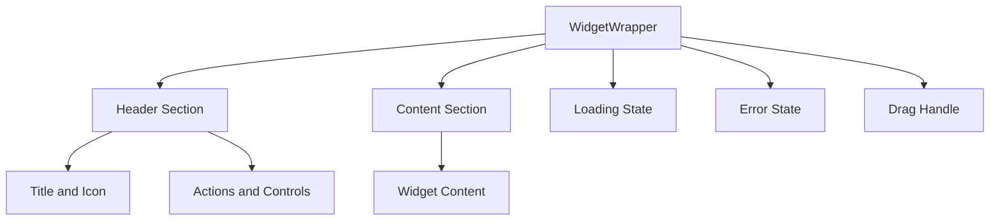
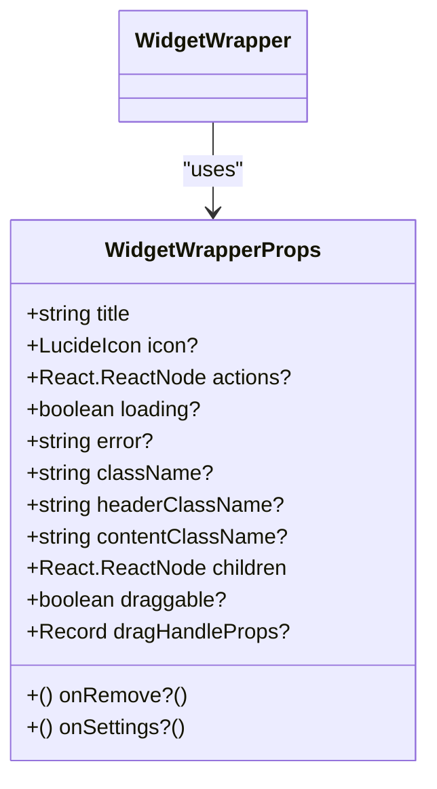
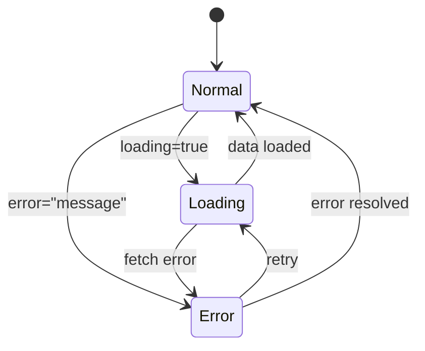
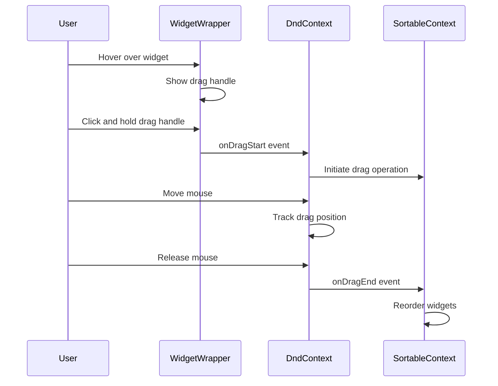
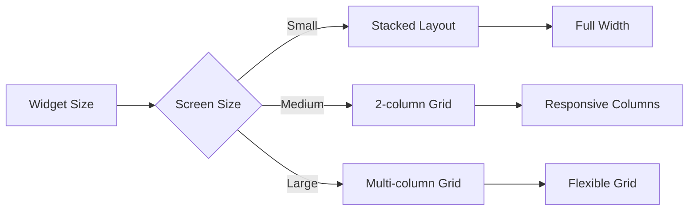
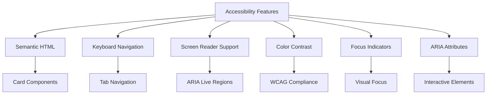
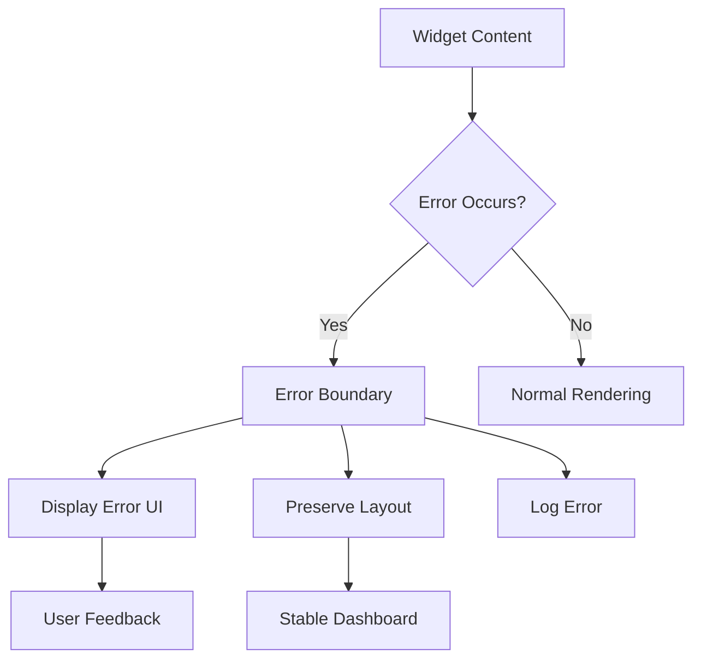
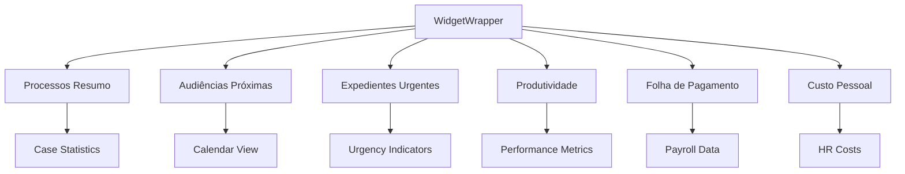

# Widget Wrapper

<cite>
**Referenced Files in This Document**   
- [widget-wrapper.tsx](file://app/(dashboard)/dashboard/components/widgets/widget-wrapper.tsx)
- [sortable-dashboard.tsx](file://app/(dashboard)/dashboard/components/sortable-dashboard.tsx)
- [widget-processos-resumo.tsx](file://app/(dashboard)/dashboard/components/widgets/widget-processos-resumo.tsx)
- [dashboard-content.tsx](file://app/(dashboard)/dashboard/components/dashboard-content.tsx)
- [enhanced-dashboard-grid.tsx](file://app/(dashboard)/dashboard/components/enhanced-dashboard-grid.tsx)
</cite>

## Table of Contents
1. [Introduction](#introduction)
2. [Core Functionality](#core-functionality)
3. [Props and Configuration](#props-and-configuration)
4. [Loading and Error States](#loading-and-error-states)
5. [Drag-and-Drop Integration](#drag-and-drop-integration)
6. [Responsive Layout Behavior](#responsive-layout-behavior)
7. [Accessibility Features](#accessibility-features)
8. [Error Boundary Implementation](#error-boundary-implementation)
9. [Usage Examples](#usage-examples)
10. [Conclusion](#conclusion)

## Introduction

The WidgetWrapper component in Sinesys serves as a standardized container for all dashboard widgets, providing consistent styling, padding, and border treatments across the application. This wrapper ensures a cohesive user experience by enforcing a uniform appearance while allowing individual widgets to maintain their unique functionality and content. The component is designed to be flexible and reusable, supporting various widget types across different dashboard views.

**Section sources**
- [widget-wrapper.tsx](file://app/(dashboard)/dashboard/components/widgets/widget-wrapper.tsx)

## Core Functionality

The WidgetWrapper component provides a consistent container for dashboard widgets with standardized styling, padding, and border treatments. It acts as a wrapper that ensures all widgets have a uniform appearance while allowing for content-specific customization through props. The component uses the Card component from the UI library as its base, applying consistent styling through className prop composition.

The wrapper establishes a clear visual hierarchy with a header section containing the widget title and actions, and a content section for the widget's main content. This separation ensures that all widgets maintain a predictable structure, making it easier for users to navigate and understand the dashboard layout. The component also handles responsive behavior, adapting to different screen sizes and layout requirements.

**Diagram sources**
- [widget-wrapper.tsx](file://app/(dashboard)/dashboard/components/widgets/widget-wrapper.tsx)

**Section sources**
- [widget-wrapper.tsx](file://app/(dashboard)/dashboard/components/widgets/widget-wrapper.tsx)

## Props and Configuration

The WidgetWrapper component accepts several props that allow for customization while maintaining consistency across widgets. These props include title, icon, actions, loading, error, className, headerClassName, contentClassName, children, onRemove, onSettings, draggable, and dragHandleProps.

The title prop displays the widget's name in the header, while the icon prop (of type LucideIcon) provides a visual identifier. The actions prop accepts React nodes to display custom action buttons in the header. The loading and error props handle different states, showing skeleton loaders or error messages respectively. The className props allow for additional styling at different levels of the component hierarchy.

**Diagram sources**
- [widget-wrapper.tsx](file://app/(dashboard)/dashboard/components/widgets/widget-wrapper.tsx)

**Section sources**
- [widget-wrapper.tsx](file://app/(dashboard)/dashboard/components/widgets/widget-wrapper.tsx)

## Loading and Error States

The WidgetWrapper component provides built-in handling for loading and error states, ensuring a consistent user experience during data fetching or when issues occur. When the loading prop is true, the component displays a skeleton loader with animated placeholders that mimic the final content layout. This includes a title placeholder, action button placeholder, and content placeholders of various sizes.

When an error occurs, the component displays an error state with a distinctive border color and a centered error message. The error state maintains the same header structure as the normal state, including the title and icon, but replaces the content with a centered error message using the destructive color theme. This approach provides visual feedback while maintaining the overall widget structure.

**Diagram sources**
- [widget-wrapper.tsx](file://app/(dashboard)/dashboard/components/widgets/widget-wrapper.tsx)

**Section sources**
- [widget-wrapper.tsx](file://app/(dashboard)/dashboard/components/widgets/widget-wrapper.tsx)

## Drag-and-Drop Integration

The WidgetWrapper component integrates with the drag-and-drop system through the draggable prop and dragHandleProps. When draggable is set to true, a grip icon appears in the header when hovering over the widget, indicating that it can be moved. The drag handle is implemented using the GripVertical icon from Lucide, which is hidden by default and only appears on hover with a smooth transition.

The dragHandleProps are passed to the drag handle div, allowing the parent component to attach the necessary event listeners from the dnd-kit library. This implementation enables the SortableContext and DndContext from dnd-kit to manage the drag-and-drop functionality at a higher level, while the WidgetWrapper provides the visual drag handle and styling.

**Diagram sources**
- [widget-wrapper.tsx](file://app/(dashboard)/dashboard/components/widgets/widget-wrapper.tsx)
- [sortable-dashboard.tsx](file://app/(dashboard)/dashboard/components/sortable-dashboard.tsx)

**Section sources**
- [widget-wrapper.tsx](file://app/(dashboard)/dashboard/components/widgets/widget-wrapper.tsx)
- [sortable-dashboard.tsx](file://app/(dashboard)/dashboard/components/sortable-dashboard.tsx)

## Responsive Layout Behavior

The WidgetWrapper component supports responsive layout behavior through integration with the dashboard's grid system. While the wrapper itself doesn't directly manage layout, it works in conjunction with parent components like SortableWidgetItem that apply responsive CSS classes based on the widget's size configuration. The component adapts to different screen sizes by leveraging CSS grid and flexbox properties inherited from the Card component.

The responsive behavior is implemented through a combination of Tailwind CSS classes and dynamic class names based on the widget's size setting (small, medium, large, or full). On smaller screens, widgets stack vertically, while on larger screens they arrange in a grid pattern according to their size configuration. The wrapper maintains consistent spacing and alignment across all screen sizes.

**Diagram sources**
- [sortable-dashboard.tsx](file://app/(dashboard)/dashboard/components/sortable-dashboard.tsx)
- [enhanced-dashboard-grid.tsx](file://app/(dashboard)/dashboard/components/enhanced-dashboard-grid.tsx)

**Section sources**
- [sortable-dashboard.tsx](file://app/(dashboard)/dashboard/components/sortable-dashboard.tsx)
- [enhanced-dashboard-grid.tsx](file://app/(dashboard)/dashboard/components/enhanced-dashboard-grid.tsx)

## Accessibility Features

The WidgetWrapper component incorporates several accessibility features to ensure an inclusive user experience. The component uses semantic HTML elements like CardHeader and CardTitle to provide proper document structure for screen readers. Interactive elements include appropriate ARIA attributes and keyboard navigation support.

The drag-and-drop functionality is accessible through keyboard controls, with visual indicators for focus states. The component ensures sufficient color contrast between text and background, and provides clear visual feedback for interactive elements. Error states include descriptive messages that are announced by screen readers, and loading states include appropriate ARIA live regions to notify users of content changes.

**Diagram sources**
- [widget-wrapper.tsx](file://app/(dashboard)/dashboard/components/widgets/widget-wrapper.tsx)
- [e2e/dashboard.spec.ts](file://e2e/dashboard.spec.ts)

**Section sources**
- [widget-wrapper.tsx](file://app/(dashboard)/dashboard/components/widgets/widget-wrapper.tsx)
- [e2e/dashboard.spec.ts](file://e2e/dashboard.spec.ts)

## Error Boundary Implementation

The WidgetWrapper component implements error boundaries at the widget level to prevent a single failing widget from affecting the entire dashboard. When an error occurs within a widget, the wrapper catches it and displays a user-friendly error message instead of crashing the entire interface. This isolation ensures that other widgets continue to function normally even if one component encounters an issue.

The error state is visually distinct with a border color that indicates the error severity, while maintaining the overall widget structure. This approach provides users with feedback about the problem while preserving the dashboard layout. The component works in conjunction with higher-level error boundaries in the application to provide comprehensive error handling.

**Diagram sources**
- [widget-wrapper.tsx](file://app/(dashboard)/dashboard/components/widgets/widget-wrapper.tsx)
- [node_modules/@copilotkit/react-core/src/components/error-boundary/error-boundary.tsx](file://node_modules/@copilotkit/react-core/src/components/error-boundary/error-boundary.tsx)

**Section sources**
- [widget-wrapper.tsx](file://app/(dashboard)/dashboard/components/widgets/widget-wrapper.tsx)

## Usage Examples

The WidgetWrapper component is used throughout the Sinesys dashboard to standardize the appearance of diverse widgets while allowing for content-specific customization. For example, the WidgetProcessosResumo component uses the wrapper to display case summary information with a Scale icon, a "Ver todos" action button, and custom content showing case statistics and distribution charts.

Other widgets like WidgetAudienciasProximas and WidgetExpedientesUrgentes use the same wrapper with different icons, titles, and content to maintain visual consistency across the dashboard. The wrapper's flexibility allows each widget to present unique information while adhering to the same design principles, creating a cohesive user experience.

**Diagram sources**
- [widget-wrapper.tsx](file://app/(dashboard)/dashboard/components/widgets/widget-wrapper.tsx)
- [widget-processos-resumo.tsx](file://app/(dashboard)/dashboard/components/widgets/widget-processos-resumo.tsx)
- [dashboard-content.tsx](file://app/(dashboard)/dashboard/components/dashboard-content.tsx)

**Section sources**
- [widget-wrapper.tsx](file://app/(dashboard)/dashboard/components/widgets/widget-wrapper.tsx)
- [widget-processos-resumo.tsx](file://app/(dashboard)/dashboard/components/widgets/widget-processos-resumo.tsx)
- [dashboard-content.tsx](file://app/(dashboard)/dashboard/components/dashboard-content.tsx)

## Conclusion

The WidgetWrapper component in Sinesys plays a crucial role in maintaining a consistent and professional appearance across all dashboard widgets. By providing standardized styling, padding, and border treatments, it ensures a cohesive user experience while allowing for necessary customization. The component's support for loading and error states, drag-and-drop functionality, responsive layout behavior, and accessibility features make it a robust foundation for the dashboard interface.

Through its thoughtful design and implementation, the WidgetWrapper enables developers to create diverse widgets that share a common visual language, improving both the user experience and development efficiency. Its integration with the drag-and-drop system allows users to personalize their dashboard layout, while its error handling ensures reliability and stability across the application.