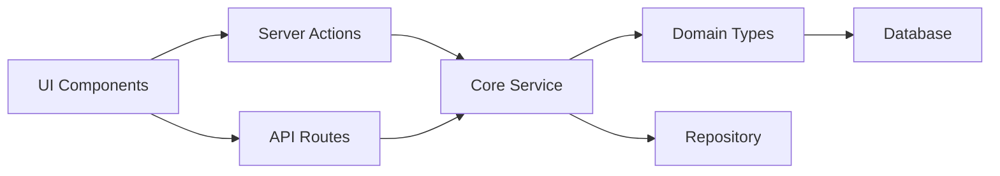
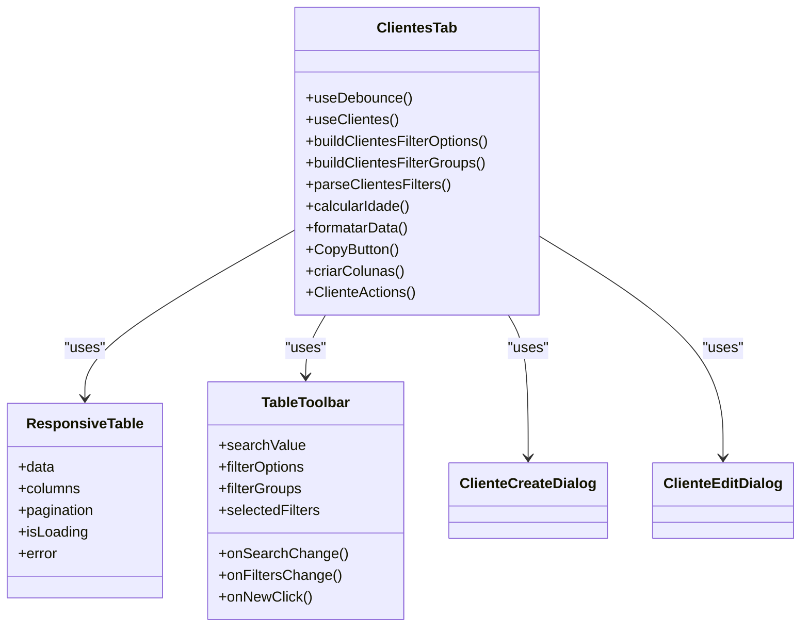
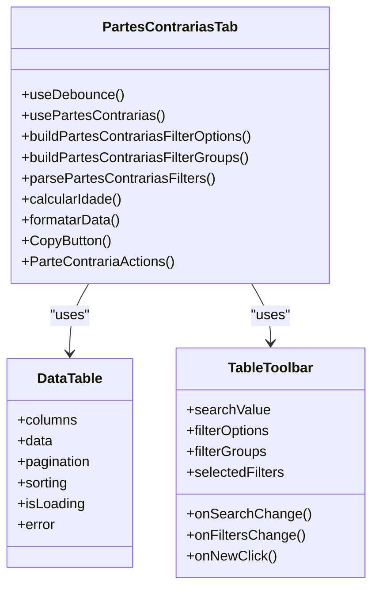
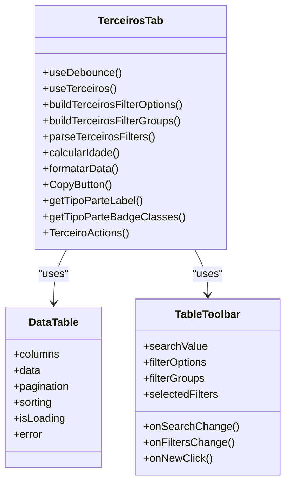
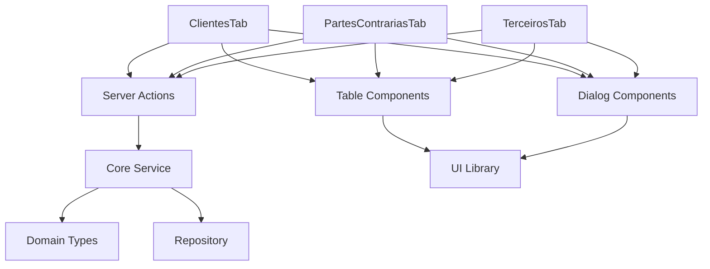

# Partes Frontend Organization

<cite>
**Referenced Files in This Document**   
- [partes.ts](file://src/app/actions/partes.ts)
- [page.tsx](file://src/app/(dashboard)/partes/page.tsx)
- [clientes/page.tsx](file://src/app/(dashboard)/partes/clientes/page.tsx)
- [partes-contrarias/page.tsx](file://src/app/(dashboard)/partes/partes-contrarias/page.tsx)
- [terceiros/page.tsx](file://src/app/(dashboard)/partes/terceiros/page.tsx)
- [clientes-tab.tsx](file://src/app/(dashboard)/partes/components/clientes-tab.tsx)
- [partes-contrarias-tab.tsx](file://src/app/(dashboard)/partes/components/partes-contrarias-tab.tsx)
- [terceiros-tab.tsx](file://src/app/(dashboard)/partes/components/terceiros-tab.tsx)
- [cliente-create-dialog.tsx](file://src/app/(dashboard)/partes/components/cliente-create-dialog.tsx)
- [cliente-edit-dialog.tsx](file://src/app/(dashboard)/partes/components/cliente-edit-dialog.tsx)
- [domain.ts](file://src/core/partes/domain.ts)
- [service.ts](file://src/core/partes/service.ts)
- [partes.ts](file://src/types/domain/partes.ts)
</cite>

## Table of Contents
1. [Introduction](#introduction)
2. [Project Structure](#project-structure)
3. [Core Components](#core-components)
4. [Architecture Overview](#architecture-overview)
5. [Detailed Component Analysis](#detailed-component-analysis)
6. [Dependency Analysis](#dependency-analysis)
7. [Performance Considerations](#performance-considerations)
8. [Troubleshooting Guide](#troubleshooting-guide)
9. [Conclusion](#conclusion)

## Introduction
The Partes Frontend Organization in the Sinesys application provides a comprehensive system for managing legal parties including clients, opposing parties, and third parties. This documentation details the frontend architecture, component organization, and data flow patterns used in the partes module. The system follows Domain-Driven Design principles with a clear separation between UI components, business logic, and data access layers.

## Project Structure
The partes frontend is organized within the Next.js App Router structure with a dedicated dashboard section for party management. The module follows a feature-based organization with separate directories for different party types and shared components.

```mermaid
graph TB
subgraph "app/(dashboard)/partes"
A[page.tsx] --> B[clientes/]
A --> C[partes-contrarias/]
A --> D[terceiros/]
A --> E[components/]
B --> F[page.tsx]
B --> G[[id]/page.tsx]
C --> H[page.tsx]
C --> I[[id]/page.tsx]
D --> J[page.tsx]
D --> K[[id]/page.tsx]
E --> L[cliente-create-dialog.tsx]
E --> M[cliente-edit-dialog.tsx]
E --> N[clientes-tab.tsx]
E --> O[partes-contrarias-tab.tsx]
E --> P[terceiros-tab.tsx]
end
```

**Diagram sources**
- [page.tsx](file://src/app/(dashboard)/partes/page.tsx)
- [clientes/page.tsx](file://src/app/(dashboard)/partes/clientes/page.tsx)
- [partes-contrarias/page.tsx](file://src/app/(dashboard)/partes/partes-contrarias/page.tsx)
- [terceiros/page.tsx](file://src/app/(dashboard)/partes/terceiros/page.tsx)

**Section sources**
- [page.tsx](file://src/app/(dashboard)/partes/page.tsx)
- [clientes/page.tsx](file://src/app/(dashboard)/partes/clientes/page.tsx)
- [partes-contrarias/page.tsx](file://src/app/(dashboard)/partes/partes-contrarias/page.tsx)
- [terceiros/page.tsx](file://src/app/(dashboard)/partes/terceiros/page.tsx)

## Core Components
The partes frontend consists of several core components that handle party management functionality. These include server actions for data manipulation, UI components for display and interaction, and domain types for data structure definition. The components follow a modular design with reusable elements across different party types.

**Section sources**
- [partes.ts](file://src/app/actions/partes.ts)
- [clientes-tab.tsx](file://src/app/(dashboard)/partes/components/clientes-tab.tsx)
- [partes-contrarias-tab.tsx](file://src/app/(dashboard)/partes/components/partes-contrarias-tab.tsx)
- [terceiros-tab.tsx](file://src/app/(dashboard)/partes/components/terceiros-tab.tsx)

## Architecture Overview
The partes frontend follows a layered architecture with clear separation between presentation, business logic, and data access layers. The system uses Next.js Server Components for initial data loading and Client Components for interactive features. Data flows from the core service layer through server actions to the UI components.



**Diagram sources**
- [partes.ts](file://src/app/actions/partes.ts)
- [service.ts](file://src/core/partes/service.ts)
- [domain.ts](file://src/core/partes/domain.ts)

## Detailed Component Analysis

### Client Management System
The client management system provides comprehensive functionality for creating, viewing, and editing client records. It includes specialized components for data entry and display, with support for both individual and corporate clients.

#### Client Table Component


**Diagram sources**
- [clientes-tab.tsx](file://src/app/(dashboard)/partes/components/clientes-tab.tsx)
- [cliente-create-dialog.tsx](file://src/app/(dashboard)/partes/components/cliente-create-dialog.tsx)
- [cliente-edit-dialog.tsx](file://src/app/(dashboard)/partes/components/cliente-edit-dialog.tsx)

**Section sources**
- [clientes-tab.tsx](file://src/app/(dashboard)/partes/components/clientes-tab.tsx)

### Opposing Parties Management
The opposing parties management system provides functionality for tracking parties opposite to the client in legal proceedings. The implementation shares structural similarities with the client management system but has specific business rules and display requirements.

#### Opposing Parties Table Component


**Diagram sources**
- [partes-contrarias-tab.tsx](file://src/app/(dashboard)/partes/components/partes-contrarias-tab.tsx)

**Section sources**
- [partes-contrarias-tab.tsx](file://src/app/(dashboard)/partes/components/partes-contrarias-tab.tsx)

### Third Parties Management
The third parties management system handles individuals or entities involved in legal proceedings who are not directly representing either side. This includes experts, witnesses, and other specialized roles with specific display requirements.

#### Third Parties Table Component


**Diagram sources**
- [terceiros-tab.tsx](file://src/app/(dashboard)/partes/components/terceiros-tab.tsx)

**Section sources**
- [terceiros-tab.tsx](file://src/app/(dashboard)/partes/components/terceiros-tab.tsx)

## Dependency Analysis
The partes frontend has well-defined dependencies between components and external systems. The architecture promotes loose coupling through the use of server actions as an abstraction layer between UI components and business logic.



**Diagram sources**
- [partes.ts](file://src/app/actions/partes.ts)
- [service.ts](file://src/core/partes/service.ts)
- [domain.ts](file://src/core/partes/domain.ts)

**Section sources**
- [partes.ts](file://src/app/actions/partes.ts)
- [service.ts](file://src/core/partes/service.ts)
- [domain.ts](file://src/core/partes/domain.ts)

## Performance Considerations
The partes frontend implements several performance optimizations including data fetching strategies, component memoization, and efficient rendering patterns. Server Components are used for initial data loading to reduce client-side processing, while Client Components are used for interactive features with proper state management.

## Troubleshooting Guide
Common issues in the partes frontend typically relate to data loading, form validation, and component rendering. The system uses structured error handling with clear error messages and fallback UI states. When troubleshooting, check the server action implementations, data fetching hooks, and component props to ensure proper data flow.

## Conclusion
The Partes Frontend Organization in Sinesys provides a robust and scalable system for managing legal parties. The architecture follows modern frontend patterns with clear separation of concerns, reusable components, and efficient data handling. The system is designed to be maintainable and extensible, with consistent patterns across different party types.