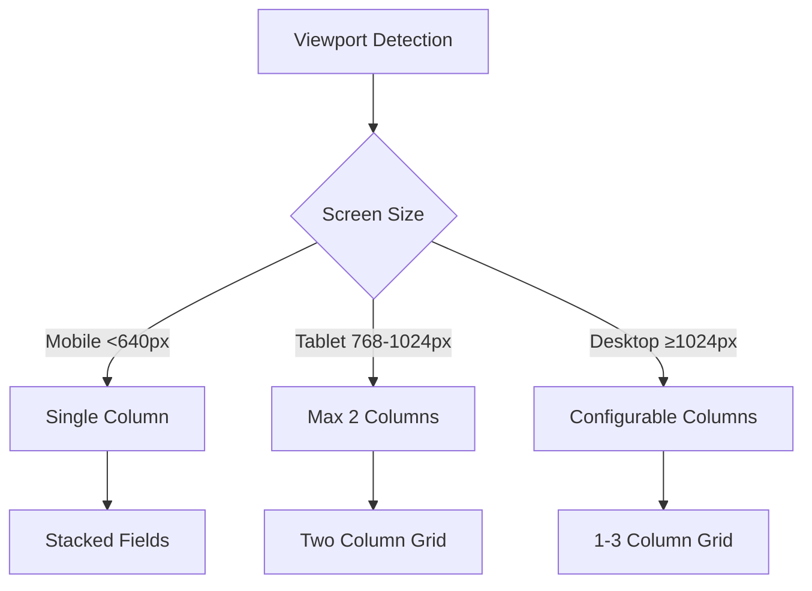
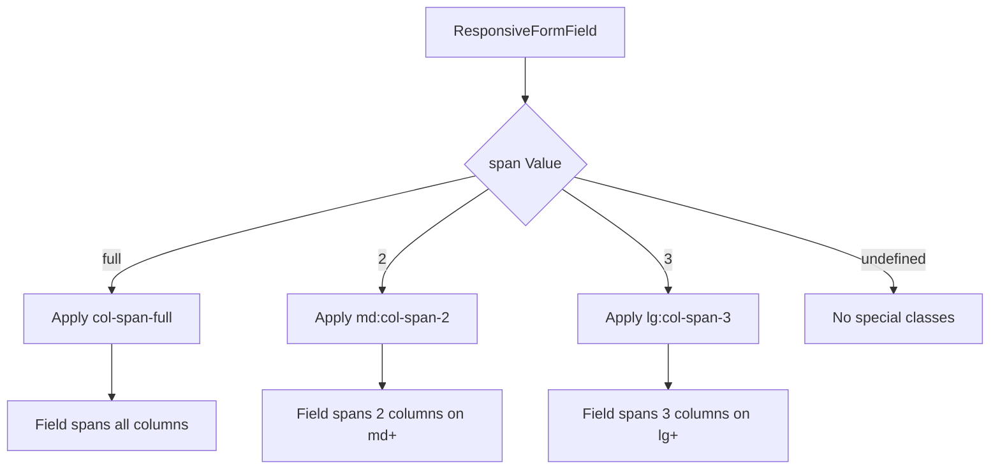
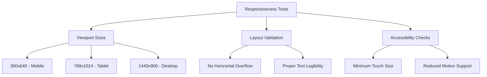

# Responsive Form Layout

<cite>
**Referenced Files in This Document**   
- [responsive-form-layout.tsx](file://src/components/ui/responsive-form-layout.tsx)
- [responsiveness.spec.ts](file://e2e/responsiveness.spec.ts)
- [captura-form-base.tsx](file://src/app/(dashboard)/captura/components/captura-form-base.tsx)
- [formulario-create-dialog.tsx](file://src/app/(dashboard)/assinatura-digital/formularios/components/formulario-create-dialog.tsx)
- [conta-pagar-form-dialog.tsx](file://src/app/(dashboard)/financeiro/contas-pagar/components/conta-pagar-form-dialog.tsx)
</cite>

## Table of Contents
1. [Introduction](#introduction)
2. [Core Components](#core-components)
3. [Responsive Behavior](#responsive-behavior)
4. [Layout Configuration](#layout-configuration)
5. [Form Field Management](#form-field-management)
6. [Action Buttons Handling](#action-buttons-handling)
7. [Implementation Examples](#implementation-examples)
8. [Testing and Validation](#testing-and-validation)

## Introduction
The Responsive Form Layout system in Sinesys provides a comprehensive solution for creating adaptive form interfaces that work seamlessly across different device sizes. This documentation details the implementation, configuration options, and usage patterns for the responsive form layout components that ensure optimal user experience on mobile, tablet, and desktop devices.

The system is built around a flexible grid-based approach that automatically adjusts form field arrangement based on screen size, while maintaining consistent spacing, proper touch targets, and logical grouping of related form elements.

## Core Components

The responsive form layout system consists of three main components that work together to create adaptive forms:

1. **ResponsiveFormLayout**: The container component that establishes the responsive grid system
2. **ResponsiveFormField**: Wrapper for individual form fields with column spanning capabilities
3. **ResponsiveFormActions**: Specialized container for form action buttons with responsive behavior

These components are implemented in the `responsive-form-layout.tsx` file and provide a cohesive API for building forms that adapt to different screen sizes.

**Section sources**
- [responsive-form-layout.tsx](file://src/components/ui/responsive-form-layout.tsx)

## Responsive Behavior

The responsive form layout system implements adaptive behavior based on viewport size with the following breakpoints:

- **Mobile** (< 640px): Single column layout with stacked fields
- **Tablet** (768px-1024px): Maximum of 2 columns
- **Desktop** (≥ 1024px): Configurable columns (1-3)

The layout automatically adjusts based on the current viewport, ensuring optimal use of available screen space while maintaining readability and usability.



**Diagram sources **
- [responsive-form-layout.tsx](file://src/components/ui/responsive-form-layout.tsx#L70-L75)

## Layout Configuration

The ResponsiveFormLayout component accepts several configuration props to customize the form appearance:

```mermaid
classDiagram
class ResponsiveFormLayout {
+columns : 1 | 2 | 3
+gap : number
+fullWidthButtonsOnMobile : boolean
+stackButtonsOnMobile : boolean
+className : string
}
ResponsiveFormLayout : columns - Number of columns for desktop layout (default : 2)
ResponsiveFormLayout : gap - Gap between form fields (default : 4)
ResponsiveFormLayout : fullWidthButtonsOnMobile - Make buttons full-width on mobile (default : true)
ResponsiveFormLayout : stackButtonsOnMobile - Stack buttons vertically on mobile (default : true)
```

**Diagram sources **
- [responsive-form-layout.tsx](file://src/components/ui/responsive-form-layout.tsx#L17-L41)

## Form Field Management

Individual form fields can be wrapped with the ResponsiveFormField component to control their layout behavior. This component provides column spanning capabilities through the `span` prop:

- `span="full"`: Spans all available columns
- `span=2`: Spans 2 columns on medium screens and above
- `span=3`: Spans 3 columns on large screens and above

The grid system uses Tailwind CSS classes to implement the responsive behavior, with automatic application of appropriate column classes based on the specified span value.



**Diagram sources **
- [responsive-form-layout.tsx](file://src/components/ui/responsive-form-layout.tsx#L156-L158)

## Action Buttons Handling

The ResponsiveFormActions component provides specialized handling for form action buttons with responsive behavior:

- On mobile: Buttons are stacked vertically and made full-width
- On desktop: Buttons are aligned horizontally with configurable justification
- Option to reverse button order on mobile for better UX

The component automatically applies appropriate classes based on screen size and the specified alignment and ordering preferences.

```mermaid
classDiagram
class ResponsiveFormActions {
+align : 'start' | 'center' | 'end' | 'between'
+reverseOnMobile : boolean
+className : string
}
ResponsiveFormActions : align - Desktop button alignment (default : 'end')
ResponsiveFormActions : reverseOnMobile - Reverse button order on mobile (default : false)
```

**Diagram sources **
- [responsive-form-layout.tsx](file://src/components/ui/responsive-form-layout.tsx#L179-L187)

## Implementation Examples

The responsive form layout components are used throughout the application in various contexts:

### Form Creation Dialog
In the assinatura-digital module, the formulario-create-dialog uses the responsive layout for creating new forms with multiple fields including name, slug, segment selection, and template assignment.

**Section sources**
- [formulario-create-dialog.tsx](file://src/app/(dashboard)/assinatura-digital/formularios/components/formulario-create-dialog.tsx)

### Financial Management
The financeiro module uses responsive forms in the conta-pagar-form-dialog for managing accounts payable, with fields for description, value, due date, payment method, and recurrence settings.

**Section sources**
- [conta-pagar-form-dialog.tsx](file://src/app/(dashboard)/financeiro/contas-pagar/components/conta-pagar-form-dialog.tsx)

### Data Capture
The captura module implements responsive forms in the captura-form-base component for selecting lawyers and credentials, demonstrating the use of combobox components within the responsive layout.

**Section sources**
- [captura-form-base.tsx](file://src/app/(dashboard)/captura/components/captura-form-base.tsx)

## Testing and Validation

The responsive form layout system is validated through comprehensive end-to-end testing that verifies proper behavior across different viewport sizes. The tests check for:

- Absence of horizontal overflow
- Legible text sizes
- Adequate touch target sizes
- Proper layout adaptation

The testing suite includes viewport configurations from 360x640 (mobile) to 1440x900 (desktop) to ensure compatibility across devices.



**Diagram sources **
- [responsiveness.spec.ts](file://e2e/responsiveness.spec.ts)