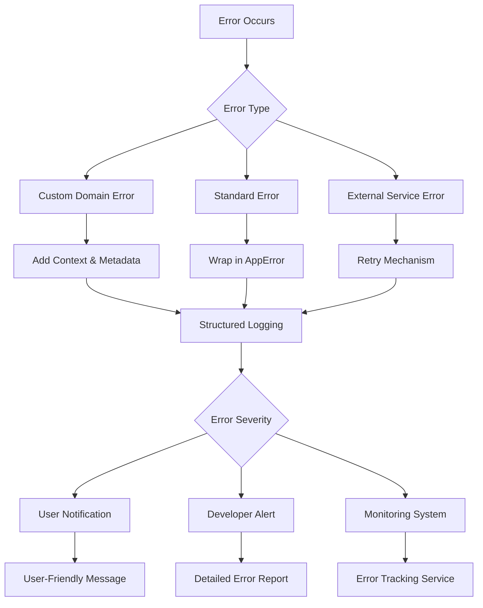
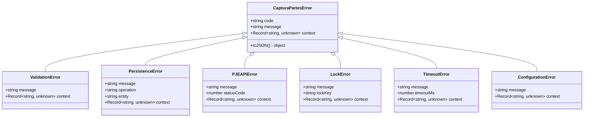
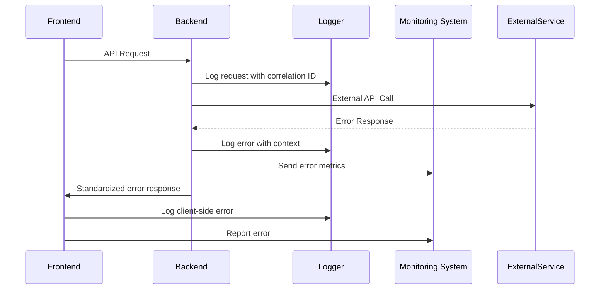
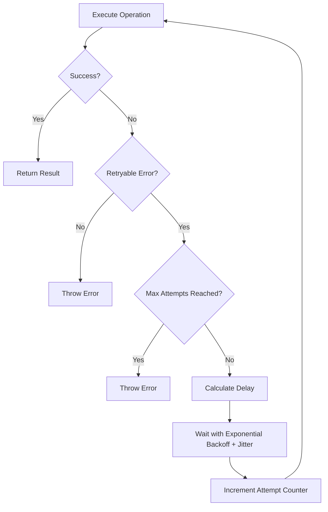
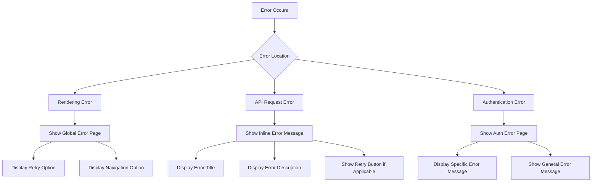
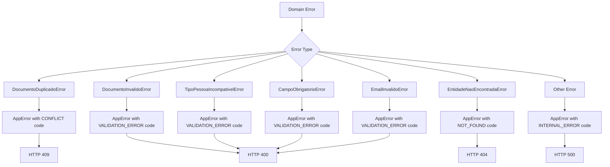

# Partes Error Handling

<cite>
**Referenced Files in This Document**   
- [error.tsx](file://src/app/error.tsx)
- [not-found.tsx](file://src/app/not-found.tsx)
- [errors.ts](file://backend/captura/services/partes/errors.ts)
- [README.md](file://backend/captura/services/partes/README.md)
- [index.ts](file://backend/utils/logger/index.ts)
- [logger.ts](file://backend/assinatura-digital/services/logger.ts)
- [meu-processo-metrics.ts](file://src/lib/services/meu-processo-metrics.ts)
- [retry.ts](file://backend/utils/retry/index.ts)
- [errors.ts](file://src/core/partes/errors.ts)
- [page.tsx](file://src/app/auth/error/page.tsx)
- [timeline-error.tsx](file://src/app/(dashboard)/processos/components/timeline-error.tsx)
</cite>

## Table of Contents
1. [Introduction](#introduction)
2. [Error Handling Architecture](#error-handling-architecture)
3. [Custom Error Classes](#custom-error-classes)
4. [Error Response Format](#error-response-format)
5. [Error Logging and Monitoring](#error-logging-and-monitoring)
6. [Retry Mechanisms](#retry-mechanisms)
7. [Frontend Error Handling](#frontend-error-handling)
8. [Database Error Handling](#database-error-handling)
9. [Error Conversion and HTTP Status Mapping](#error-conversion-and-http-status-mapping)
10. [Best Practices and Guidelines](#best-practices-and-guidelines)

## Introduction

The Sinesys application implements a comprehensive error handling system across both frontend and backend components. This documentation provides a detailed analysis of the error handling patterns, custom error classes, logging mechanisms, and recovery strategies used throughout the codebase. The system is designed to provide meaningful error messages to users while maintaining detailed diagnostic information for developers and ensuring system resilience through retry mechanisms and proper error classification.

**Section sources**
- [error.tsx](file://src/app/error.tsx)
- [not-found.tsx](file://src/app/not-found.tsx)

## Error Handling Architecture

The Sinesys error handling architecture follows a layered approach with distinct patterns for frontend and backend components. The system employs custom error classes, structured logging, retry mechanisms, and standardized error responses to ensure consistent error handling across the application.

The backend implements domain-specific error classes that extend a base error type, allowing for precise error classification and handling. These custom errors contain structured context information that facilitates debugging and monitoring. The frontend complements this with user-friendly error displays and recovery options, while maintaining the ability to capture and report detailed error information.

A key architectural feature is the separation of concerns between error representation for users and error data for developers. User-facing messages are clear and actionable, while the underlying error objects contain detailed technical information for diagnostic purposes.



**Diagram sources **
- [errors.ts](file://backend/captura/services/partes/errors.ts)
- [meu-processo-metrics.ts](file://src/lib/services/meu-processo-metrics.ts)
- [retry.ts](file://backend/utils/retry/index.ts)

**Section sources**
- [errors.ts](file://backend/captura/services/partes/errors.ts)
- [meu-processo-metrics.ts](file://src/lib/services/meu-processo-metrics.ts)

## Custom Error Classes

The Sinesys application defines several custom error classes to represent specific error conditions in a structured manner. These classes extend base error types and include additional properties that provide context about the error, enabling more precise error handling and logging.

The `CapturaPartesError` serves as the base class for all capture-related errors in the backend, with specific subclasses for different error types such as `PJEAPIError`, `LockError`, `TimeoutError`, and `ConfigurationError`. These custom errors include properties like error codes, status codes, timeout durations, and lock keys that provide detailed context about the error condition.

Similarly, the frontend defines domain-specific error classes in the partes module, including `DocumentoDuplicadoError`, `DocumentoInvalidoError`, `TipoPessoaIncompativelError`, and `EntidadeNaoEncontradaError`. These classes include properties relevant to their specific error conditions, such as document types, entity identifiers, and validation details.



**Diagram sources **
- [errors.ts](file://backend/captura/services/partes/errors.ts)
- [errors.ts](file://src/core/partes/errors.ts)

**Section sources**
- [errors.ts](file://backend/captura/services/partes/errors.ts)
- [errors.ts](file://src/core/partes/errors.ts)

## Error Response Format

The Sinesys application follows a standardized format for error responses across its API endpoints. All error responses include appropriate HTTP status codes and a consistent JSON structure that provides clear information about the error condition.

The standard error response format includes a success flag set to false, an error message, and optionally additional details about the error. This format is documented in the API specifications and implemented consistently across all endpoints. The HTTP status codes used follow standard conventions: 400 for validation errors, 401 for unauthorized access, 403 for forbidden operations, 404 for not found errors, 409 for conflicts, and 500 for internal server errors.

For domain-specific errors, the response includes additional context information that helps clients understand the nature of the error and potentially take corrective action. For example, when a duplicate document error occurs, the response includes details about the document type, the conflicting document value, and the entity involved.

```mermaid
flowchart TD
A[Error Occurs] --> B{Error Type}
B --> C[Validation Error]
B --> D[Authentication Error]
B --> E[Authorization Error]
B --> F[Not Found]
B --> G[Conflict]
B --> H[Internal Error]
C --> I[HTTP 400]
D --> J[HTTP 401]
E --> K[HTTP 403]
F --> L[HTTP 404]
G --> M[HTTP 409]
H --> N[HTTP 500]
I --> O[{"success": false, "error": "Validation failed", "details": {...}}]
J --> P[{"success": false, "error": "Unauthorized", "details": {...}}]
K --> Q[{"success": false, "error": "Forbidden", "details": {...}}]
L --> R[{"success": false, "error": "Not found", "details": {...}}]
M --> S[{"success": false, "error": "Conflict", "details": {...}}]
N --> T[{"success": false, "error": "Internal error", "details": {...}}]
```

**Diagram sources **
- [api-routes/spec.md](file://openspec/changes/archive/2025-11-23-add-representantes-backend/specs/api-routes/spec.md)
- [meu-processo-metrics.ts](file://src/lib/services/meu-processo-metrics.ts)

**Section sources**
- [api-routes/spec.md](file://openspec/changes/archive/2025-11-23-add-representantes-backend/specs/api-routes/spec.md)
- [meu-processo-metrics.ts](file://src/lib/services/meu-processo-metrics.ts)

## Error Logging and Monitoring

The Sinesys application implements comprehensive error logging and monitoring through multiple mechanisms. The system uses structured logging with correlation IDs to trace errors across distributed components and services.

The backend utilizes the Pino logger with a custom configuration that includes correlation IDs from AsyncLocalStorage. This allows errors to be traced across asynchronous operations and service boundaries. The logger formats output consistently and supports pretty printing in development environments for easier debugging.

Different components of the application have specialized logging implementations. The signature digital service has its own logger with metrics collection, while the capture service includes detailed logging of persistence operations and errors. The frontend also implements structured logging through the MeuProcessoLogger class, which formats log messages with timestamps, levels, and contextual data.



**Diagram sources **
- [index.ts](file://backend/utils/logger/index.ts)
- [logger.ts](file://backend/assinatura-digital/services/logger.ts)
- [meu-processo-metrics.ts](file://src/lib/services/meu-processo-metrics.ts)

**Section sources**
- [index.ts](file://backend/utils/logger/index.ts)
- [logger.ts](file://backend/assinatura-digital/services/logger.ts)
- [meu-processo-metrics.ts](file://src/lib/services/meu-processo-metrics.ts)

## Retry Mechanisms

The Sinesys application implements a robust retry mechanism for handling transient errors, particularly in external service calls and database operations. The retry system uses exponential backoff with jitter to prevent thundering herd problems and includes configurable parameters for maximum attempts, base delay, and maximum delay.

The retry logic is implemented in the `withRetry` function, which accepts a function to execute and retry options. The system determines whether an error is retryable based on its type and message content. By default, network errors, timeouts, connection issues, and HTTP 5xx server errors are considered retryable.

The retry mechanism includes logging at both warning and error levels to provide visibility into retry attempts and failures. This allows developers to monitor the frequency of transient errors and adjust retry parameters as needed. The system also supports custom retryable error detection functions and callbacks that execute before each retry attempt.



**Diagram sources **
- [retry.ts](file://backend/utils/retry/index.ts)

**Section sources**
- [retry.ts](file://backend/utils/retry/index.ts)

## Frontend Error Handling

The frontend of the Sinesys application implements user-friendly error handling with dedicated components for different error scenarios. The system uses Next.js error boundaries to catch and display errors that occur during rendering, providing users with clear messages and recovery options.

The main error page (`error.tsx`) displays a user-friendly message with an option to retry the operation or navigate to the dashboard. This component also logs the error details to the console for debugging purposes. Similarly, the authentication error page (`auth/error/page.tsx`) displays specific error messages passed as query parameters, allowing the authentication flow to communicate specific error conditions to the user.

For specific error scenarios, the application uses specialized error components like `timeline-error.tsx`, which interprets error messages and displays appropriate titles and descriptions based on the error type. This component can distinguish between timeout errors, configuration errors, and generic errors, providing tailored messages and determining whether the operation can be retried.



**Diagram sources **
- [error.tsx](file://src/app/error.tsx)
- [page.tsx](file://src/app/auth/error/page.tsx)
- [timeline-error.tsx](file://src/app/(dashboard)/processos/components/timeline-error.tsx)

**Section sources**
- [error.tsx](file://src/app/error.tsx)
- [page.tsx](file://src/app/auth/error/page.tsx)
- [timeline-error.tsx](file://src/app/(dashboard)/processos/components/timeline-error.tsx)

## Database Error Handling

The Sinesys application implements specific handling for database constraint violations, particularly for unique constraints on CPF, CNPJ, and PJE person IDs. When a persistence operation fails due to a unique constraint violation (PostgreSQL error code 23505), the system catches the error and returns a meaningful message that identifies the specific constraint that was violated.

The error handling distinguishes between different types of duplicate entries, providing specific messages for duplicate CPFs, CNPJs, and PJE person IDs. For client and opposing party entities, the system returns messages that indicate whether the duplicate is related to a client, opposing party, or PJE person ID, along with the relevant identifier values.

For other database errors, the system falls back to a generic error message while preserving the original error details for logging and debugging purposes. This approach balances user experience by providing clear, actionable messages while maintaining the detailed error information needed for troubleshooting.

**Section sources**
- [README.md](file://backend/captura/services/partes/README.md)

## Error Conversion and HTTP Status Mapping

The Sinesys application includes a comprehensive system for converting domain-specific errors to standardized HTTP responses. The `appErrorToHttpResponse` function converts AppError objects to HTTP responses with appropriate status codes and response bodies.

The system maps error codes to HTTP status codes according to standard conventions:
- VALIDATION_ERROR maps to 400 (Bad Request)
- UNAUTHORIZED maps to 401 (Unauthorized)
- FORBIDDEN maps to 403 (Forbidden)
- NOT_FOUND maps to 404 (Not Found)
- CONFLICT maps to 409 (Conflict)
- DATABASE_ERROR, INTERNAL_ERROR, and EXTERNAL_SERVICE_ERROR map to 500 (Internal Server Error)

The conversion system also includes helper functions like `toAppError` that convert domain-specific errors (such as DocumentoDuplicadoError or EntidadeNaoEncontradaError) to AppError objects with appropriate error codes and contextual details. This ensures that domain-specific error information is preserved while providing a standardized interface for error handling.



**Diagram sources **
- [errors.ts](file://src/core/partes/errors.ts)

**Section sources**
- [errors.ts](file://src/core/partes/errors.ts)

## Best Practices and Guidelines

The Sinesys application follows several best practices in its error handling implementation:

1. **Consistent Error Format**: All API responses follow a consistent format with a success flag and error details, making it easier for clients to handle errors uniformly.

2. **Structured Logging**: The system uses structured logging with correlation IDs to trace errors across service boundaries and asynchronous operations.

3. **Domain-Specific Errors**: Custom error classes provide detailed context about error conditions, enabling more precise error handling and debugging.

4. **User-Friendly Messages**: Error messages presented to users are clear and actionable, while detailed technical information is preserved for developers.

5. **Retry Mechanisms**: Transient errors are handled with exponential backoff and jitter to improve system resilience.

6. **Error Classification**: Errors are classified with codes that determine appropriate HTTP status codes and handling strategies.

7. **Comprehensive Monitoring**: The system includes metrics collection and logging to monitor error frequency and patterns.

8. **Graceful Degradation**: When errors occur, the system provides recovery options and alternative navigation paths.

These practices ensure that the application is robust, maintainable, and provides a good user experience even when errors occur.

**Section sources**
- [backend-agent-prompt.md](file://docs/agentes/backend-agent-prompt.md)
- [api-routes/spec.md](file://openspec/changes/archive/2025-11-23-add-representantes-backend/specs/api-routes/spec.md)