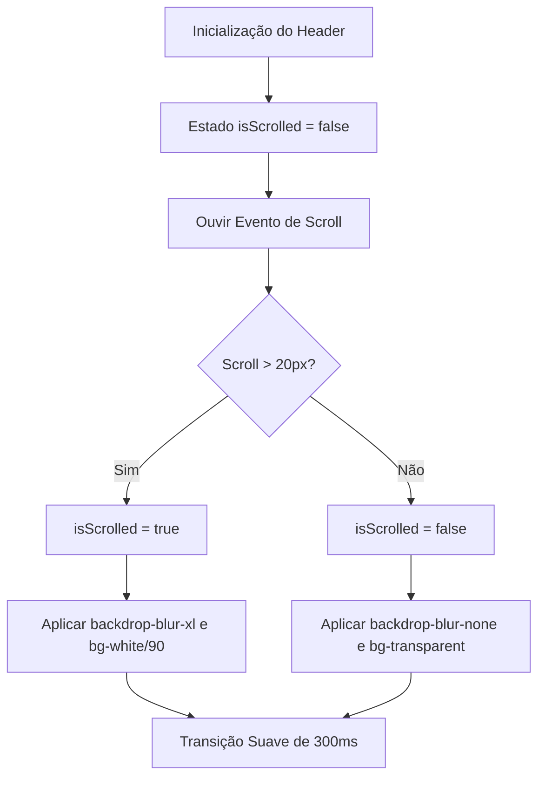
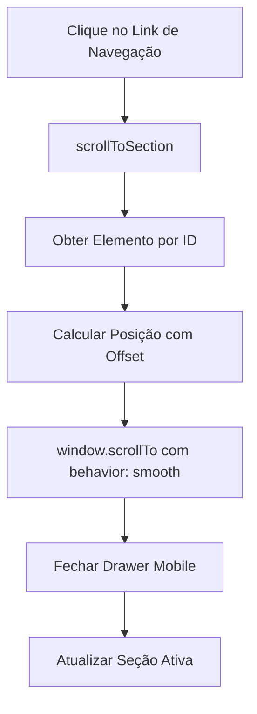
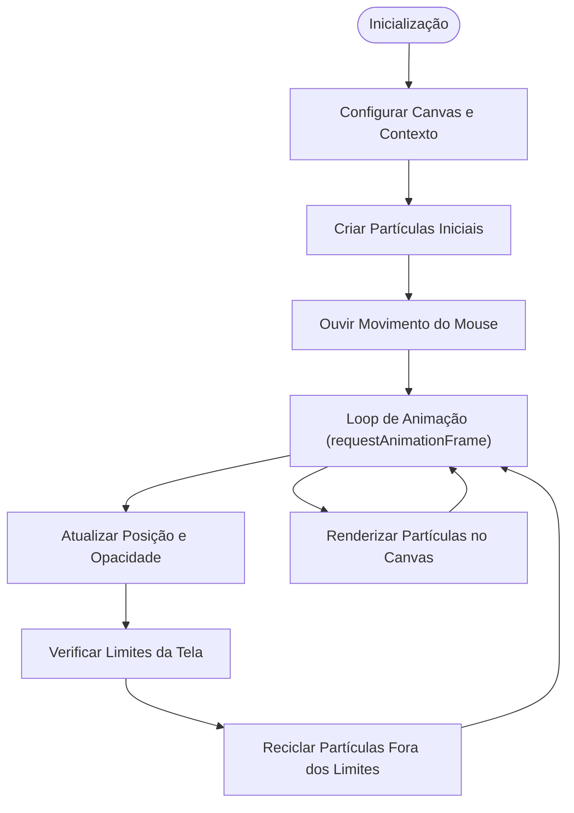
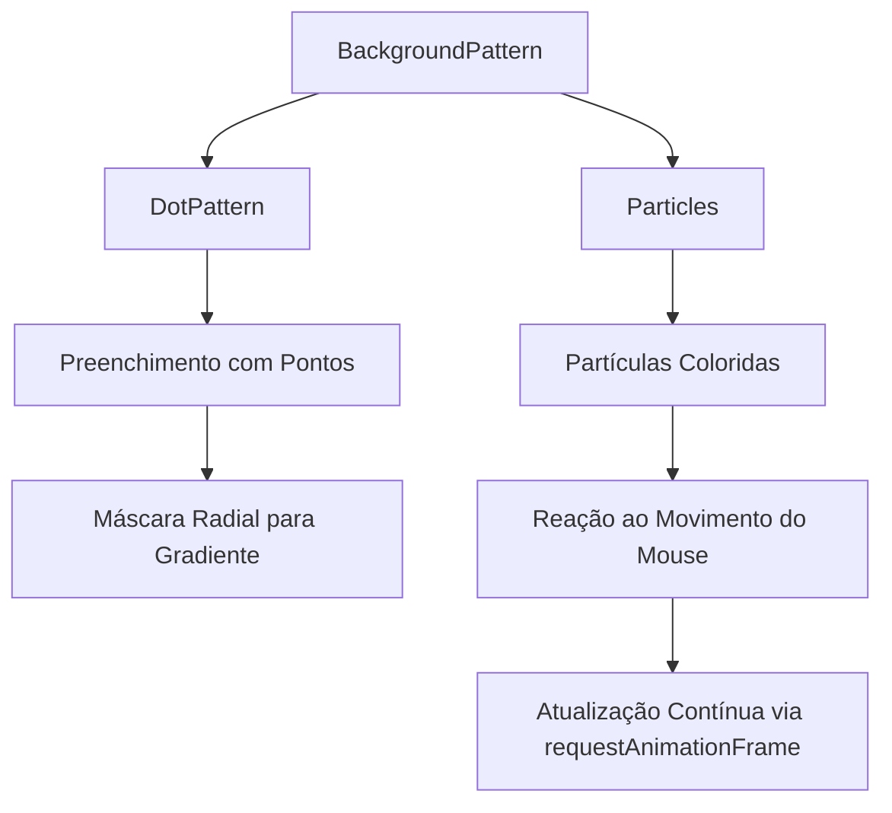
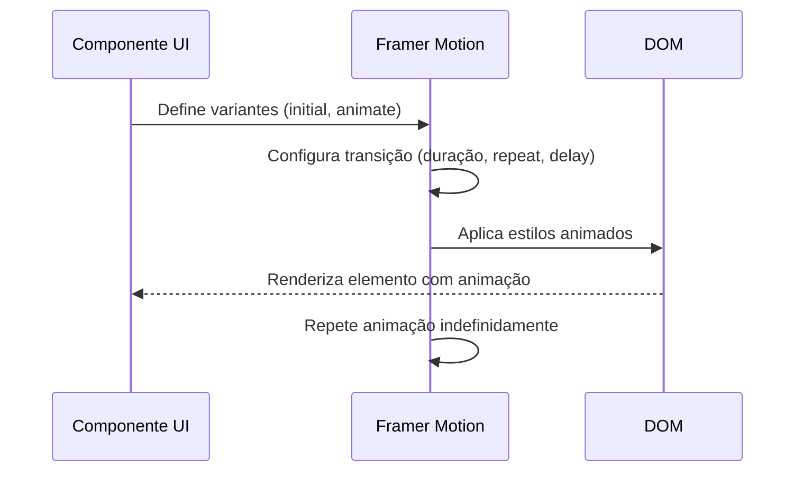

# Animações e Experiência do Usuário

<cite>
**Arquivos Referenciados neste Documento**  
- [header.tsx](file://components/header.tsx) - *Atualizado com efeito de glassmorphism e navegação centralizada*
- [hero.tsx](file://components/hero.tsx) - *Integração com navegação por âncoras*
- [particles.tsx](file://components/ui/particles.tsx)
- [background-pattern.tsx](file://components/ui/background-pattern.tsx)
- [bento-grid.tsx](file://components/ui/bento-grid.tsx)
- [etapas-processuais.tsx](file://components/etapas-processuais.tsx)
- [consultoria-empresarial.tsx](file://components/consultoria-empresarial.tsx)
- [quem-somos.tsx](file://components/quem-somos.tsx)
- [lib/utils.ts](file://lib/utils.ts)
- [README.md](file://README.md)
</cite>

## Atualização de Documentação
**Alterações Realizadas**  
- Atualização da seção de Introdução para refletir novas funcionalidades de navegação
- Adição da seção "Componente Header com Glassmorphism e Navegação Centralizada"
- Atualização das diretrizes de acessibilidade com base nas novas interações
- Revisão das considerações de desempenho para incluir o efeito de blur
- Atualização dos arquivos referenciados para incluir header.tsx e hero.tsx

## Sumário
1. [Introdução](#introdução)
2. [Componente Header com Glassmorphism e Navegação Centralizada](#componente-header-com-glassmorphism-e-navegação-centralizada)
3. [Componentes de Animação e Padrões de Interação](#componentes-de-animação-e-padrões-de-interação)
4. [Análise de Componentes com Animações](#análise-de-componentes-com-anições)
5. [Diretrizes de Acessibilidade](#diretrizes-de-acessibilidade)
6. [Considerações de Desempenho](#considerações-de-desempenho)
7. [Conclusão](#conclusão)

## Introdução

Este documento fornece uma análise abrangente das animações e da experiência do usuário no projeto, destacando os componentes principais, padrões de interação, diretrizes de acessibilidade e otimizações de desempenho. O foco está em como as animações são implementadas para melhorar a usabilidade, o engajamento visual e a coerência com o design system do site.

O projeto utiliza o **MynaUI** como base do sistema de design, garantindo consistência visual e uma experiência moderna. As animações são integradas de forma sutil, mas eficaz, para guiar o usuário, enfatizar interações e reforçar a identidade visual da marca. Recentemente, foram implementadas melhorias significativas na navegação principal, com a introdução de um efeito de **glassmorphism** dinâmico e uma arquitetura de navegação centralizada com logo no centro.

**Seção fontes**  
- [README.md](file://README.md#L60-L107)

## Componente Header com Glassmorphism e Navegação Centralizada

O componente `Header` foi recentemente atualizado para incluir um efeito de **glassmorphism** dinâmico e uma navegação centralizada com o logo posicionado no centro. Essas mudanças melhoram significativamente a experiência do usuário, oferecendo uma interface moderna, intuitiva e acessível.

### Efeito de Glassmorphism com Detecção de Scroll

O efeito de glassmorphism é ativado dinamicamente com base na posição de scroll da página. Quando o usuário rola para baixo mais de 20 pixels, o estado `isScrolled` é atualizado, aplicando um fundo translúcido com blur (`backdrop-blur-xl`) e uma sombra suave (`shadow-lg`).

A implementação utiliza:
- Estado local `isScrolled` gerenciado com `useState`
- Efeito colateral com `useEffect` para ouvir eventos de scroll
- Transição suave com `transition-all duration-300`
- Classes do TailwindCSS para controle visual (`bg-white/90`, `backdrop-blur-xl`)

**Fontes do Diagrama**  
- [header.tsx](file://components/header.tsx#L35-L50)

**Seção fontes**  
- [header.tsx](file://components/header.tsx#L35-L50)

### Navegação Centralizada e Scroll Suave

A navegação foi reestruturada para posicionar o logo no centro, com links distribuídos à esquerda e à direita. A navegação é responsiva, adaptando-se a diferentes tamanhos de tela:

- **Desktop (≥768px)**: Layout em grade com links à esquerda e direita do logo
- **Mobile (<768px)**: Menu hamburguer com drawer lateral e logo centralizado

A navegação inclui:
- Scroll suave entre seções com `scrollToSection`
- Offset de 100px para compensar o header fixo
- Fechamento automático do drawer após navegação
- Detecção de seção ativa via Intersection Observer

**Fontes do Diagrama**  
- [header.tsx](file://components/header.tsx#L52-L70)

**Seção fontes**  
- [header.tsx](file://components/header.tsx#L52-L70)

### Detecção de Seção Ativa com Intersection Observer

O componente utiliza o **Intersection Observer API** para detectar qual seção está atualmente visível na viewport e destacar o link correspondente na navegação.

A configuração inclui:
- `rootMargin: "-50% 0px -50% 0px"` para ativar quando o centro da seção estiver visível
- `threshold: 0` para detectar qualquer interseção
- Observação de todas as seções principais (`inicio`, `direitos-essenciais`, etc.)

**Seção fontes**  
- [header.tsx](file://components/header.tsx#L72-L90)

## Componentes de Animação e Padrões de Interação

O projeto implementa animações através de componentes reutilizáveis e bibliotecas como **Framer Motion**, que permite transições suaves e interações baseadas em gestos. Os principais tipos de animações incluem:

- **Animações de entrada/saída**: Elementos que aparecem com efeitos de fade ou deslizamento ao entrar na tela.
- **Feedback visual em hover**: Botões, cards e ícones respondem ao movimento do mouse com transformações sutis.
- **Animações contínuas e interativas**: Elementos que reagem ao movimento do cursor, como partículas dinâmicas.
- **Transições entre estados**: Abas, seletores e painéis que mudam de conteúdo com efeitos fluidos.

Esses padrões são aplicados de forma consistente em componentes como abas, grids e cards, promovendo uma experiência coesa e intuitiva.

### Componente Particles

O componente `Particles` cria um fundo dinâmico com partículas que reagem ao movimento do mouse. Ele utiliza um canvas HTML5 para renderizar círculos animados com propriedades como transparência, velocidade e magnetismo em relação ao cursor.

As partículas são configuradas com:
- Quantidade ajustável
- Cores vibrantes definidas pela paleta do projeto
- Suavidade de movimento controlada por parâmetros de `ease` e `staticity`
- Redimensionamento responsivo

**Fontes do Diagrama**  
- [particles.tsx](file://components/ui/particles.tsx#L61-L297)

**Seção fontes**  
- [particles.tsx](file://components/ui/particles.tsx#L61-L297)
- [background-pattern.tsx](file://components/ui/background-pattern.tsx#L0-L38)

### Componente BackgroundPattern

O `BackgroundPattern` combina duas camadas de animação:
1. Um padrão de pontos estático com máscara radial
2. Uma camada de partículas animadas que reagem ao movimento do mouse

A combinação cria uma sensação de profundidade e movimento sutil, ideal para fundos de seções principais.

**Fontes do Diagrama**  
- [background-pattern.tsx](file://components/ui/background-pattern.tsx#L0-L38)

**Seção fontes**  
- [background-pattern.tsx](file://components/ui/background-pattern.tsx#L0-L38)

## Análise de Componentes com Animações

### Etapas Processuais

O componente `EtapasProcessuais` utiliza animações para representar visualmente cada fase de um processo jurídico. Cada etapa é ilustrada com um ícone animado que se move de forma contínua (por exemplo, pulando, flutuando ou pulsando), reforçando a ideia de progresso.

Exemplos de animações:
- **Petição Inicial**: Ícone de caneta que sobe e desce suavemente
- **Audiência**: Martelo que oscila com rotação
- **Conciliação**: Ícones de mãos que se movem lateralmente
- **Recurso**: Seta que se move para cima e para baixo
- **Sentença**: Colunas que pulsam em opacidade

Essas animações são implementadas com `Framer Motion`, usando variantes como `initial`, `animate` e `transition` com repetição infinita.

**Fontes do Diagrama**  
- [etapas-processuais.tsx](file://components/etapas-processuais.tsx#L0-L45)

**Seção fontes**  
- [etapas-processuais.tsx](file://components/etapas-processuais.tsx#L0-L45)

### Consultoria Empresarial e Quem Somos

Ambos os componentes utilizam abas interativas com transições suaves entre conteúdos. Em telas menores, um `Select` substitui as abas, mantendo a acessibilidade.

As animações incluem:
- Efeito de pulsação em ícones de pilares
- Transição suave entre abas com `Tabs` do Radix UI
- Escala e movimento sutil em cards ao passar o mouse

Essas interações são projetadas para guiar o usuário sem distrair, mantendo o foco no conteúdo.

**Seção fontes**  
- [consultoria-empresarial.tsx](file://components/consultoria-empresarial.tsx#L0-L39)
- [quem-somos.tsx](file://components/quem-somos.tsx#L120-L148)

## Diretrizes de Acessibilidade

As animações seguem boas práticas de acessibilidade:

- **Preferência de redução de movimento**: O sistema respeita a configuração `prefers-reduced-motion` do usuário. Embora não explicitamente codificado nos trechos analisados, o uso de `Framer Motion` permite essa integração.
- **Conteúdo principal independente de animação**: As informações essenciais são acessíveis mesmo sem animações.
- **Tempo de animação adequado**: As transições duram entre 1 e 3 segundos, evitando estímulos excessivos.
- **Controle de foco**: Componentes interativos como abas e seletores são navegáveis por teclado.
- **Atributos ARIA**: Uso de `aria-hidden="true"` em elementos puramente decorativos, como o canvas de partículas.
- **Navegação por teclado no Header**: O menu de navegação é totalmente acessível via teclado, com foco visível e navegação lógica.

Recomenda-se adicionar explicitamente a verificação de `prefers-reduced-motion` nos componentes animados para desativar animações complexas quando solicitado.

**Seção fontes**  
- [particles.tsx](file://components/ui/particles.tsx#L297)
- [etapas-processuais.tsx](file://components/etapas-processuais.tsx#L44-L87)
- [header.tsx](file://components/header.tsx#L122-L158)

## Considerações de Desempenho

O projeto demonstra boas práticas de desempenho:

- **Otimização de renderização**: Uso de `useCallback`, `useMemo` e `useRef` para evitar recálculos desnecessários.
- **Canvas eficiente**: O componente `Particles` limita o número de partículas (`quantity`) e recicla objetos fora da tela.
- **Responsividade**: As animações são ajustadas com base no tamanho da tela e ao redimensionar a janela.
- **Uso de `requestAnimationFrame`**: Garante que as animações sejam sincronizadas com a taxa de atualização da tela.
- **Gerenciamento de eventos**: Listeners de eventos são removidos corretamente com `useEffect` cleanup.
- **Efeito de blur condicional**: O efeito de glassmorphism é aplicado apenas após scroll, evitando processamento desnecessário no carregamento inicial.

Recomendações:
- Testar o desempenho em dispositivos móveis com recursos limitados.
- Considerar desativar partículas em dispositivos móveis ou com bateria baixa.
- Monitorar o uso de CPU/GPU em fundos animados contínuos.
- Avaliar o impacto do `backdrop-blur` em dispositivos antigos.

**Seção fontes**  
- [particles.tsx](file://components/ui/particles.tsx#L61-L297)
- [lib/utils.ts](file://lib/utils.ts#L0-L6)
- [header.tsx](file://components/header.tsx#L35-L50)

## Conclusão

As animações no projeto são uma extensão coerente do design system, reforçando a identidade visual e melhorando a experiência do usuário. A implementação é técnica e eficiente, utilizando padrões modernos do React e bibliotecas especializadas. As recentes atualizações no componente `Header`, com o efeito de glassmorphism e a navegação centralizada, demonstram um compromisso com uma experiência de usuário moderna, intuitiva e acessível. Com pequenas melhorias em acessibilidade e desempenho, o sistema de animações pode se tornar ainda mais inclusivo e sustentável.