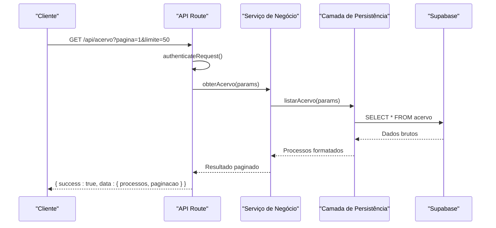
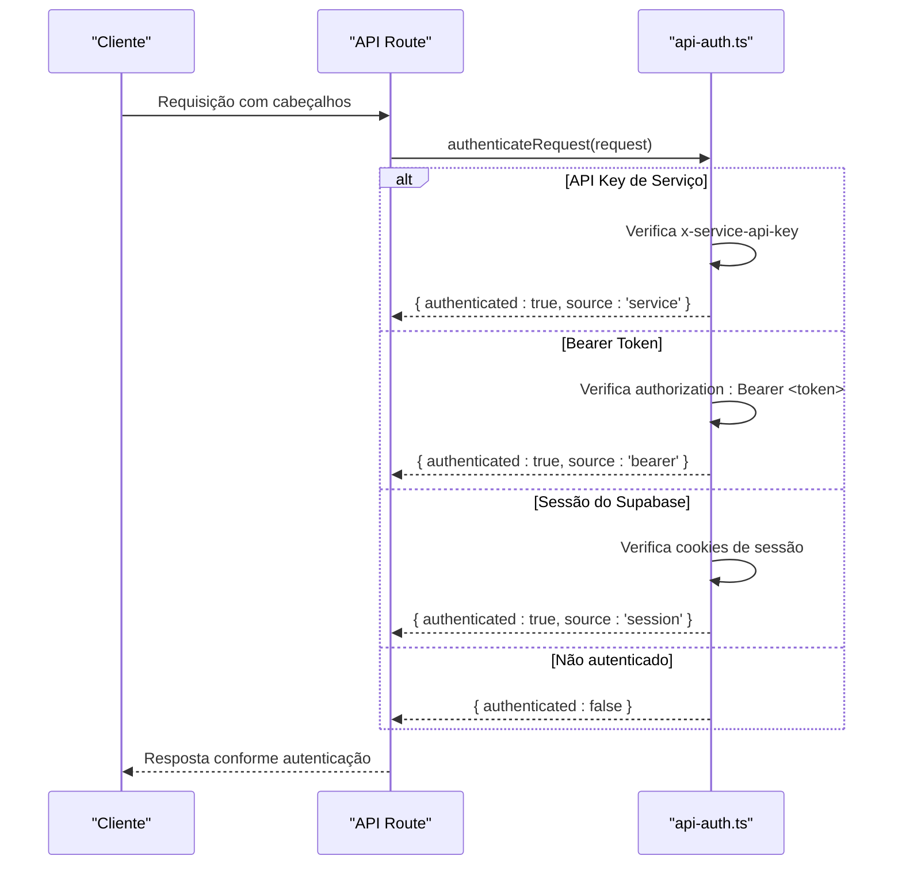
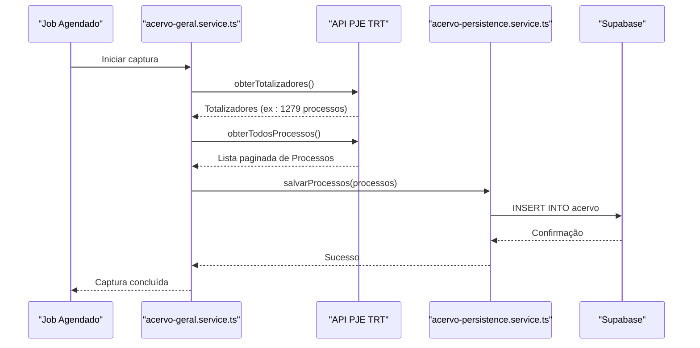

# Arquitetura Backend

<cite>
**Arquivos Referenciados neste Documento**  
- [app/api/acervo/route.ts](file://app/api/acervo/route.ts)
- [backend/acervo/services/listar-acervo.service.ts](file://backend/acervo/services/listar-acervo.service.ts)
- [backend/acervo/services/persistence/listar-acervo.service.ts](file://backend/acervo/services/persistence/listar-acervo.service.ts)
- [backend/types/acervo/types.ts](file://backend/types/acervo/types.ts)
- [backend/utils/auth/api-auth.ts](file://backend/utils/auth/api-auth.ts)
- [backend/utils/supabase/server.ts](file://backend/utils/supabase/server.ts)
- [backend/utils/supabase/service-client.ts](file://backend/utils/supabase/service-client.ts)
- [backend/captura/services/trt/acervo-geral.service.ts](file://backend/captura/services/trt/acervo-geral.service.ts)
- [backend/captura/services/persistence/acervo-persistence.service.ts](file://backend/captura/services/persistence/acervo-persistence.service.ts)
- [backend/api/pje-trt/fetch.ts](file://backend/api/pje-trt/fetch.ts)
- [backend/api/pje-trt/acervo-geral.ts](file://backend/api/pje-trt/acervo-geral.ts)
- [backend/types/pje-trt/types.ts](file://backend/types/pje-trt/types.ts)
</cite>

## Sumário
1. [Introdução](#introdução)
2. [Estrutura de Camadas](#estrutura-de-camadas)
3. [Tipagem com TypeScript](#tipagem-com-typescript)
4. [Autenticação Dual](#autenticação-dual)
5. [Interação com Supabase](#interação-com-supabase)
6. [Fluxo de Captura de Dados do PJE](#fluxo-de-captura-de-dados-do-pje)
7. [Logging, Tratamento de Erros e Monitoramento](#logging-tratamento-de-erros-e-monitoramento)
8. [Diretrizes para Novos Serviços e Rotas](#diretrizes-para-novos-serviços-e-rotas)
9. [Considerações de Segurança, Escalabilidade e Testes](#considerações-de-segurança-escalabilidade-e-testes)
10. [Conclusão](#conclusão)

## Introdução

O sistema sinesys é uma aplicação jurídica que integra dados de múltiplos tribunais trabalhistas (TRTs) por meio da API do PJE (Processo Judicial Eletrônico). A camada backend é projetada com uma arquitetura em camadas clara, separando responsabilidades entre API, serviços de negócio e persistência. Este documento detalha a arquitetura, padrões de desenvolvimento, segurança e fluxos críticos do sistema.

## Estrutura de Camadas

A arquitetura do backend segue um padrão de camadas bem definido: **API → Serviço → Persistência**. Cada camada tem responsabilidades específicas, garantindo baixo acoplamento e alta coesão.

### Exemplo: Rota de Listagem de Acervo

A rota `app/api/acervo/route.ts` exemplifica o fluxo de uma requisição desde a entrada até a persistência:

1. **Camada API**: Validação de entrada, autenticação e formatação de resposta.
2. **Camada de Serviço**: Lógica de negócio, como aplicação de filtros e paginação.
3. **Camada de Persistência**: Consulta ao banco de dados via Supabase.

**Fontes do Diagrama**  
- [app/api/acervo/route.ts](file://app/api/acervo/route.ts#L1-L436)
- [backend/acervo/services/listar-acervo.service.ts](file://backend/acervo/services/listar-acervo.service.ts#L1-L36)
- [backend/acervo/services/persistence/listar-acervo.service.ts](file://backend/acervo/services/persistence/listar-acervo.service.ts#L1-L376)

**Fontes da Seção**  
- [app/api/acervo/route.ts](file://app/api/acervo/route.ts#L1-L436)
- [backend/acervo/services/listar-acervo.service.ts](file://backend/acervo/services/listar-acervo.service.ts#L1-L36)
- [backend/acervo/services/persistence/listar-acervo.service.ts](file://backend/acervo/services/persistence/listar-acervo.service.ts#L1-L376)

## Tipagem com TypeScript

O sistema utiliza TypeScript para garantir tipagem robusta e segurança em tempo de compilação. As interfaces são definidas em `backend/types/` e organizadas por domínio.

### Estrutura de Tipos

- **`backend/types/acervo/types.ts`**: Define interfaces como `Acervo`, `ListarAcervoParams` e `ListarAcervoResult`.
- **`backend/types/pje-trt/types.ts`**: Define tipos compartilhados com a API do PJE, como `Processo`, `Audiencia` e `PagedResponse<T>`.

Essas interfaces são usadas em todas as camadas, garantindo consistência entre a entrada da API, lógica de negócio e persistência.

**Fontes da Seção**  
- [backend/types/acervo/types.ts](file://backend/types/acervo/types.ts#L1-L152)
- [backend/types/pje-trt/types.ts](file://backend/types/pje-trt/types.ts#L1-L262)

## Autenticação Dual

O sistema implementa autenticação dual utilizando **Supabase Auth** e **API Key de Serviço**, permitindo acesso seguro tanto para usuários quanto para jobs internos.

### Fluxo de Autenticação

A função `authenticateRequest` em `backend/utils/auth/api-auth.ts` verifica três fontes:

1. **API Key de Serviço**: Usada por jobs agendados (ex: captura de dados).
2. **Bearer Token (JWT)**: Usado por APIs externas.
3. **Sessão do Supabase**: Usado pela interface web.

**Fontes do Diagrama**  
- [backend/utils/auth/api-auth.ts](file://backend/utils/auth/api-auth.ts#L1-L136)

**Fontes da Seção**  
- [backend/utils/auth/api-auth.ts](file://backend/utils/auth/api-auth.ts#L1-L136)

## Interação com Supabase

O backend utiliza o Supabase como camada de persistência, com dois tipos de clientes:

- **Cliente de Serviço (`service-client.ts`)**: Usa a `service_role key` para operações administrativas, bypassando RLS (Row Level Security).
- **Cliente de Servidor (`server.ts`)**: Usa a `publishable key` para operações com RLS habilitado, baseado na sessão do usuário.

### Uso Apropriado

- **`createServiceClient()`**: Para jobs agendados, captura de dados, operações em lote.
- **`createClient()`**: Para requisições de usuário autenticado, respeitando políticas de segurança.

**Fontes da Seção**  
- [backend/utils/supabase/service-client.ts](file://backend/utils/supabase/service-client.ts#L1-L52)
- [backend/utils/supabase/server.ts](file://backend/utils/supabase/server.ts#L1-L31)

## Fluxo de Captura de Dados do PJE

A captura de dados do PJE é um fluxo crítico que envolve autenticação no PJE, extração de dados e persistência no Supabase.

### Exemplo: Captura de Acervo Geral

1. **Autenticação no PJE**: `trt-auth.service.ts` realiza login com credenciais armazenadas.
2. **Extração de Dados**: `acervo-geral.service.ts` chama `obterTodosProcessos()` via API do PJE.
3. **Persistência**: `acervo-persistence.service.ts` salva os dados no Supabase.

**Fontes do Diagrama**  
- [backend/captura/services/trt/acervo-geral.service.ts](file://backend/captura/services/trt/acervo-geral.service.ts)
- [backend/api/pje-trt/acervo-geral.ts](file://backend/api/pje-trt/acervo-geral.ts)
- [backend/captura/services/persistence/acervo-persistence.service.ts](file://backend/captura/services/persistence/acervo-persistence.service.ts)

**Fontes da Seção**  
- [backend/captura/services/trt/acervo-geral.service.ts](file://backend/captura/services/trt/acervo-geral.service.ts)
- [backend/api/pje-trt/acervo-geral.ts](file://backend/api/pje-trt/acervo-geral.ts)
- [backend/captura/services/persistence/acervo-persistence.service.ts](file://backend/captura/services/persistence/acervo-persistence.service.ts)

## Logging, Tratamento de Erros e Monitoramento

O sistema implementa logging detalhado e tratamento de erros consistente:

- **Logging**: Utiliza `console.error()` para erros críticos, com contexto completo.
- **Tratamento de Erros**: Bloco `try/catch` em todas as camadas, com mensagens padronizadas.
- **Monitoramento**: Jobs agendados registram logs em `dev_data/scripts/results/`.

As respostas de erro seguem o padrão `{ success: false, error: string }`, garantindo consistência na API.

**Fontes da Seção**  
- [app/api/acervo/route.ts](file://app/api/acervo/route.ts#L426-L433)
- [backend/acervo/services/persistence/listar-acervo.service.ts](file://backend/acervo/services/persistence/listar-acervo.service.ts#L170-L172)

## Diretrizes para Novos Serviços e Rotas

Para manter a consistência arquitetural:

1. **Criar Nova Rota**: Em `app/api/[feature]/route.ts`, validar entrada e autenticar.
2. **Implementar Serviço**: Em `backend/[feature]/services/`, aplicar lógica de negócio.
3. **Persistência**: Em `backend/[feature]/services/persistence/`, acessar o banco.
4. **Tipagem**: Definir interfaces em `backend/types/[feature]/types.ts`.

Sempre utilizar `authenticateRequest()` e seguir o padrão de resposta `{ success: boolean, data?: T, error?: string }`.

**Fontes da Seção**  
- [app/api/contratos/route.ts](file://app/api/contratos/route.ts#L1-L43)
- [openspec/project.md](file://openspec/project.md#L81-L111)

## Considerações de Segurança, Escalabilidade e Testes

### Segurança
- **RLS (Row Level Security)**: Habilitado no Supabase, com políticas granulares.
- **Autenticação Dual**: Garante acesso seguro para usuários e jobs.
- **Variáveis de Ambiente**: Chaves sensíveis armazenadas em `.env`.

### Escalabilidade
- **Jobs Agendados**: Captura de dados realizada em intervalos regulares.
- **Paginação**: Todas as listagens suportam paginação para grandes volumes.
- **Cache de Credenciais**: Reduz autenticações repetidas no PJE.

### Testes
- **Scripts de Teste**: Em `dev_data/scripts/`, testam integração com APIs externas.
- **Testes Manuais**: Executáveis com `tsx` para validação de fluxos.
- **Validação de Dados**: Comparação de contagens entre PJE e banco local.

**Fontes da Seção**  
- [supabase/schemas/](file://supabase/schemas/)
- [dev_data/scripts/](file://dev_data/scripts/)
- [backend/captura/credentials/credential-cache.service.ts](file://backend/captura/credentials/credential-cache.service.ts)

## Conclusão

A arquitetura backend do sinesys é robusta, modular e segura, seguindo padrões claros de camadas, tipagem e autenticação. A separação entre API, serviço e persistência facilita a manutenção e escalabilidade. A integração com o PJE é confiável, com tratamento de erros e logging adequados. O uso de TypeScript e Supabase garante segurança de dados e produtividade no desenvolvimento.