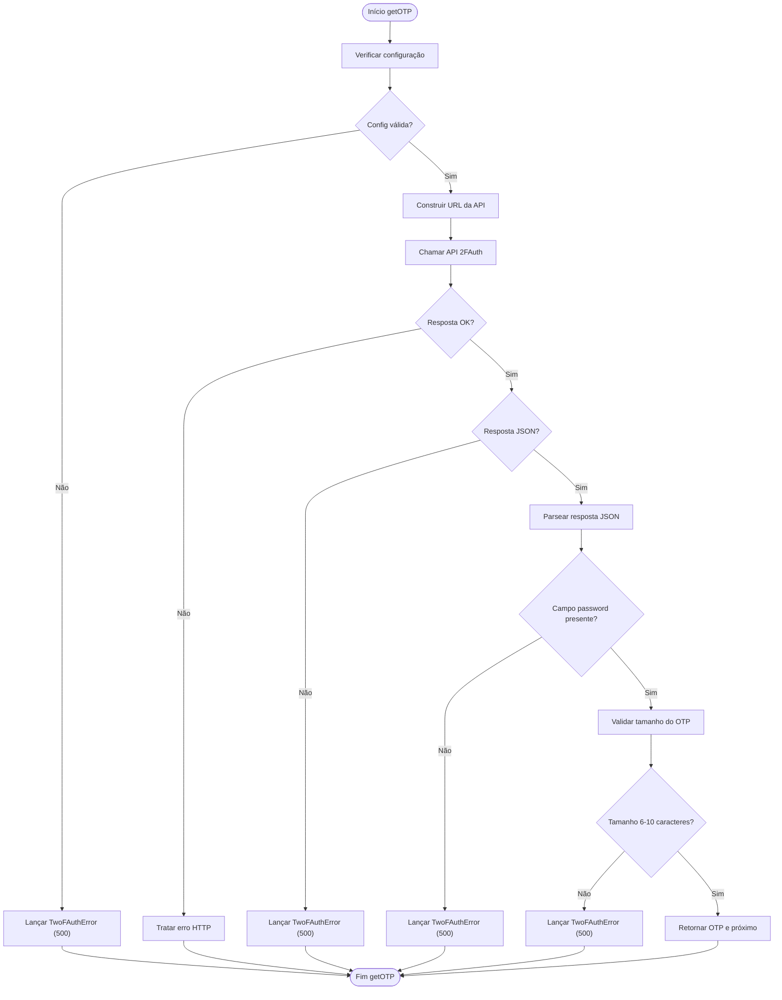
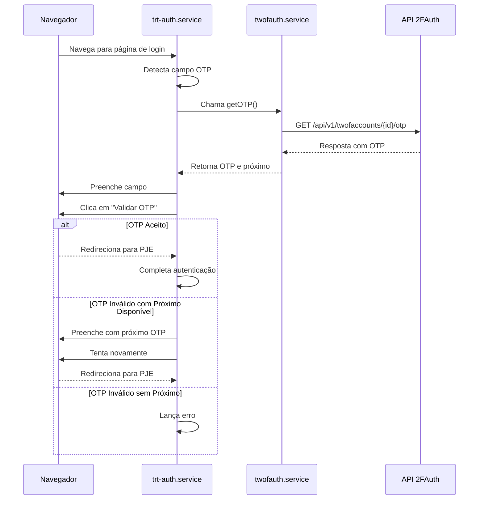

# Autenticação com 2FA

<cite>
**Arquivos Referenciados neste Documento**   
- [twofauth.service.ts](file://backend/utils/api/twofauth.service.ts)
- [trt-auth.service.ts](file://backend/captura/services/trt/trt-auth.service.ts)
</cite>

## Sumário
1. [Introdução](#introdução)
2. [Serviço 2FAuth](#serviço-2fauth)
3. [Variáveis de Ambiente](#variáveis-de-ambiente)
4. [Tratamento de Erros](#tratamento-de-erros)
5. [Integração com Login PJE/TRT](#integração-com-login-pjetrt)
6. [Estratégias de Fallback](#estratégias-de-fallback)
7. [Configuração e Troubleshooting](#configuração-e-troubleshooting)

## Introdução
Este documento detalha a integração com o serviço 2FAuth para autenticação multifator no sistema. A implementação permite a obtenção automática de códigos OTP (One-Time Password) via API REST durante o processo de login em sistemas jurídicos como o PJE/TRT. O serviço é projetado para ser reutilizável por diferentes tribunais (TRT, TJ, TRF) e garante segurança e confiabilidade no acesso aos sistemas.

## Serviço 2FAuth

O serviço `getOTP()` é responsável por obter códigos OTP do 2FAuth através de uma chamada à API REST. Ele está implementado no arquivo `backend/utils/api/twofauth.service.ts` e é utilizado por todos os sistemas jurídicos que exigem autenticação multifator.

A função `getOTP()` realiza uma requisição HTTP GET para o endpoint `/api/v1/twofaccounts/{id}/otp`, retornando tanto o código atual quanto o próximo (quando disponível). A resposta da API é validada quanto ao formato JSON, presença do campo `password` e tamanho do código (entre 6 e 10 caracteres).

**Section sources**
- [twofauth.service.ts](file://backend/utils/api/twofauth.service.ts#L77-L193)

## Variáveis de Ambiente

O serviço 2FAuth utiliza três variáveis de ambiente para sua configuração:

- **TWOFAUTH_API_URL**: URL base da API 2FAuth
- **TWOFAUTH_API_TOKEN**: Token de autenticação para acesso à API
- **TWOFAUTH_ACCOUNT_ID**: ID da conta 2FAuth para obtenção do OTP

Essas variáveis são usadas como fallback quando nenhuma configuração explícita é fornecida ao chamar a função `getOTP()`. A ausência de qualquer uma dessas variáveis resulta em um erro `TwoFAuthError` com código 500, indicando que o serviço não está configurado corretamente.

A normalização da URL da API é realizada automaticamente, garantindo que o endpoint correto seja construído independentemente do formato fornecido (com ou sem `/api/v1`).

**Section sources**
- [twofauth.service.ts](file://backend/utils/api/twofauth.service.ts#L79-L81)

## Tratamento de Erros

O tratamento de erros na integração 2FAuth é robusto e abrangente, utilizando a classe `TwoFAuthError` para encapsular todas as falhas. Os principais cenários de erro tratados incluem:

- **Configuração ausente**: Quando as variáveis de ambiente ou parâmetros de configuração estão faltando
- **Resposta não-JSON**: Quando a API retorna uma resposta em formato inválido
- **Ausência de campo password**: Quando a resposta de sucesso não contém o campo obrigatório `password`
- **Tamanho inválido de OTP**: Quando o código retornado tem menos de 6 ou mais de 10 caracteres
- **Erros HTTP**: Códigos de status 400, 401, 403 e outros são convertidos em `TwoFAuthError`
- **Erros de rede**: Exceções de conexão ou timeout são capturadas e re-lançadas como `TwoFAuthError`

A validação do tamanho do código OTP (6-10 caracteres) é especialmente importante, pois garante compatibilidade com os sistemas jurídicos que consomem esses códigos.



**Diagram sources**
- [twofauth.service.ts](file://backend/utils/api/twofauth.service.ts#L83-L165)

**Section sources**
- [twofauth.service.ts](file://backend/utils/api/twofauth.service.ts#L47-L55)

## Integração com Login PJE/TRT

A integração do serviço 2FAuth com o login no PJE/TRT ocorre no arquivo `backend/captura/services/trt/trt-auth.service.ts`. Durante o processo de autenticação, quando o campo OTP é detectado na página de login, o sistema automaticamente obtém o código através da função `getOTP()` e o preenche no campo `#otp`.

O fluxo de integração inclui:
1. Detecção do campo OTP na página de login
2. Chamada à função `getOTP()` para obter o código atual e próximo
3. Preenchimento automático do campo OTP com o código obtido
4. Submissão do formulário de autenticação
5. Verificação do resultado e tratamento de falhas

O serviço utiliza Playwright para automatizar o navegador, garantindo que o processo de login seja realizado de forma confiável e segura.



**Diagram sources**
- [trt-auth.service.ts](file://backend/captura/services/trt/trt-auth.service.ts#L87-L230)
- [twofauth.service.ts](file://backend/utils/api/twofauth.service.ts#L77-L193)

**Section sources**
- [trt-auth.service.ts](file://backend/captura/services/trt/trt-auth.service.ts#L136-L144)

## Estratégias de Fallback

O sistema implementa estratégias robustas de fallback para lidar com falhas na autenticação OTP. Quando o código OTP atual é rejeitado pelo sistema PJE/TRT, o sistema automaticamente tenta utilizar o próximo código OTP (nextPassword) se disponível.

Esta estratégia é particularmente útil em cenários onde:
- O código OTP expirou entre a obtenção e o preenchimento
- Há latência na rede que afeta o tempo de validade do código
- O sistema de destino tem um clock ligeiramente dessincronizado

A detecção de erro é realizada através da análise de mensagens de erro na página (como "inválido", "código incorreto") e do comportamento de redirecionamento. Se o próximo código também falhar, uma exceção é lançada indicando falha na autenticação.

**Section sources**
- [trt-auth.service.ts](file://backend/captura/services/trt/trt-auth.service.ts#L188-L208)

## Configuração e Troubleshooting

### Configuração Recomendada
Para configurar corretamente o serviço 2FAuth, siga estas etapas:

1. Defina as variáveis de ambiente no arquivo `.env`:
```
TWOFAUTH_API_URL=https://2fauth.exemplo.com
TWOFAUTH_API_TOKEN=seu_token_aqui
TWOFAUTH_ACCOUNT_ID=id_da_conta
```

2. Certifique-se de que a conta 2FAuth está configurada corretamente com os dados de autenticação do usuário.

3. Teste a integração em ambiente de desenvolvimento antes de usar em produção.

### Troubleshooting de Falhas Comuns

**Falha: "2FAuth não configurado"**
- Verifique se todas as variáveis de ambiente estão definidas
- Confirme que não há erros de digitação nos nomes das variáveis
- Valide se o arquivo `.env` está sendo carregado corretamente

**Falha: "Campo OTP não apareceu"**
- Verifique se a URL de login está correta
- Confirme se o sistema de destino está disponível
- Analise se houve alterações na interface do PJE/TRT

**Falha: "OTP inválido e próximo código não disponível"**
- Verifique a sincronização do relógio no sistema 2FAuth
- Confirme se a conta 2FAuth está configurada corretamente
- Teste a geração manual de códigos no 2FAuth

**Falha: "Resposta não-JSON"**
- Verifique a conectividade com a API 2FAuth
- Confirme se a URL da API está correta
- Valide se o token de autenticação é válido

**Section sources**
- [twofauth.service.ts](file://backend/utils/api/twofauth.service.ts#L83-L87)
- [trt-auth.service.ts](file://backend/captura/services/trt/trt-auth.service.ts#L306-L308)