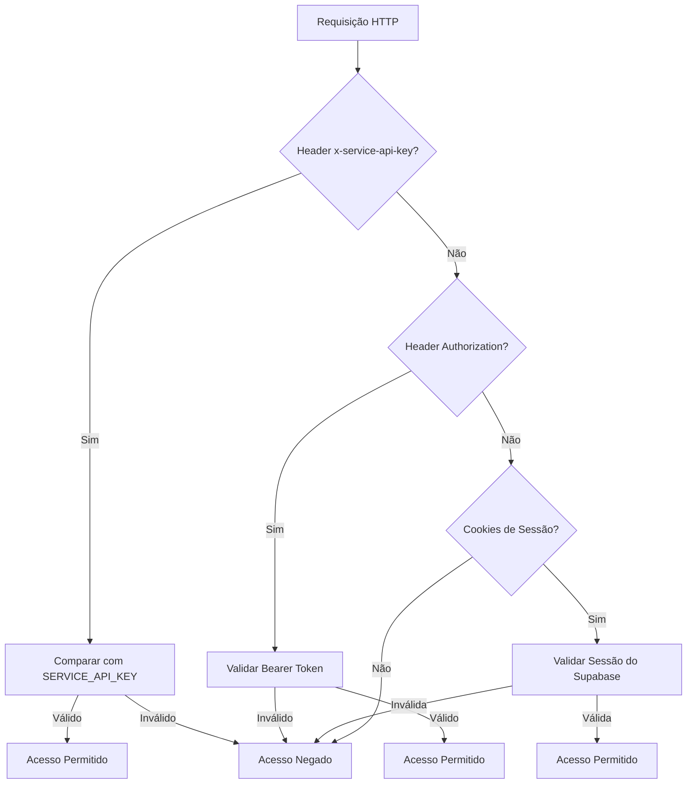
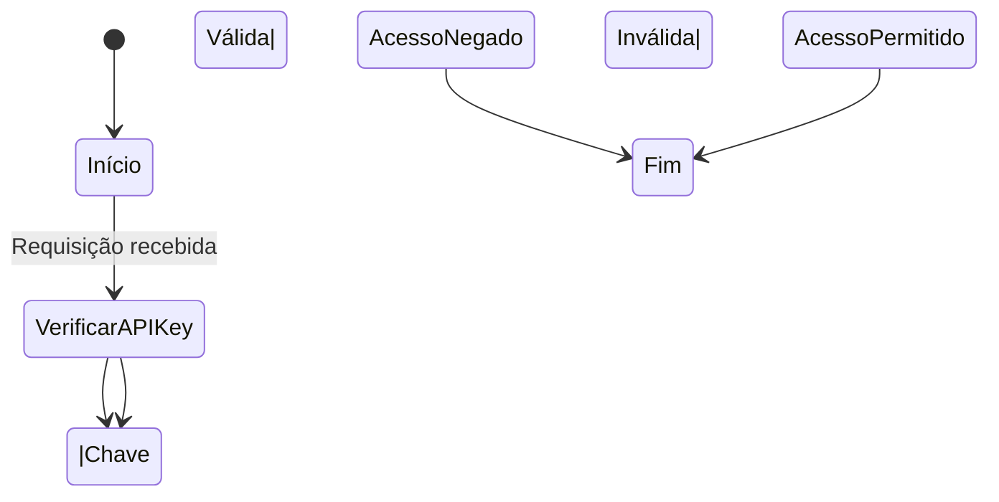

# Autenticação por API Key

<cite>
**Arquivos Referenciados neste Documento**   
- [api-auth.ts](file://backend/utils/auth/api-auth.ts)
- [swagger.config.ts](file://swagger.config.ts)
</cite>

## Sumário
1. [Introdução](#introdução)
2. [Implementação da Autenticação por API Key](#implementação-da-autenticação-por-api-key)
3. [Configuração no Swagger](#configuração-no-swagger)
4. [Uso e Exemplos de Requisições](#uso-e-exemplos-de-requisições)
5. [Estratégias de Segurança](#estratégias-de-segurança)
6. [Gerenciamento de Chaves de API](#gerenciamento-de-chaves-de-api)
7. [Tratamento de Erros](#tratamento-de-erros)

## Introdução
O sistema de autenticação por API Key no Sinesys é projetado para autenticar processos automatizados e jobs do sistema, garantindo acesso seguro e controlado às funcionalidades do backend. Este mecanismo utiliza uma chave de serviço enviada no header `x-service-api-key` da requisição HTTP, que é validada contra uma variável de ambiente (`SERVICE_API_KEY`). Este método tem prioridade sobre outros métodos de autenticação, como Bearer Token e sessão do Supabase, sendo ideal para operações automatizadas.

## Implementação da Autenticação por API Key

A função `authenticateRequest()` no arquivo `backend/utils/auth/api-auth.ts` é responsável por validar a autenticação da requisição. Ela verifica três métodos de autenticação em ordem de prioridade:

1. **API Key de Serviço**: Verifica a presença e validade da chave no header `x-service-api-key`.
2. **Token Bearer**: Valida um token JWT do Supabase no header `Authorization`.
3. **Sessão do Supabase**: Verifica cookies de sessão do Supabase.

A API Key de serviço tem a prioridade mais alta, sendo usada exclusivamente para jobs do sistema e processos automatizados. A comparação da chave é feita de forma segura, utilizando uma comparação timing-safe para evitar ataques de tempo.

**Seção fontes**
- [api-auth.ts](file://backend/utils/auth/api-auth.ts#L50-L133)

## Configuração no Swagger

No arquivo `swagger.config.ts`, o esquema de segurança `serviceApiKey` é definido como um `apiKey` no header `x-service-api-key`. Esta configuração permite que a documentação da API inclua a autenticação por API Key, facilitando o teste e a integração com ferramentas como Swagger UI.



**Fontes do Diagrama**
- [api-auth.ts](file://backend/utils/auth/api-auth.ts#L50-L133)
- [swagger.config.ts](file://swagger.config.ts#L39-L43)

**Seção fontes**
- [swagger.config.ts](file://swagger.config.ts#L25-L45)

## Uso e Exemplos de Requisições

Para utilizar a autenticação por API Key, inclua o header `x-service-api-key` na requisição HTTP com o valor da chave de serviço. Abaixo está um exemplo de requisição cURL:

```bash
curl -X GET https://api.sinesys.com.br/api/endpoint \
  -H "x-service-api-key: sua_chave_de_servico_aqui"
```

Este método é exclusivo para jobs do sistema e processos automatizados, garantindo que apenas scripts autorizados possam acessar os endpoints protegidos.

**Seção fontes**
- [api-auth.ts](file://backend/utils/auth/api-auth.ts#L54-L66)

## Estratégias de Segurança

A segurança da API Key é mantida através do armazenamento seguro da chave na variável de ambiente `SERVICE_API_KEY`. Nunca exponha a chave em código fonte ou logs. Utilize ferramentas de gerenciamento de segredos para armazenar e rotacionar chaves de forma segura.

**Seção fontes**
- [api-auth.ts](file://backend/utils/auth/api-auth.ts#L55-L56)

## Gerenciamento de Chaves de API

Para gerar e rotacionar chaves de API, siga estas orientações:

1. **Geração de Chaves**: Use um gerador de números aleatórios criptograficamente seguro para criar chaves longas e complexas.
2. **Rotação de Chaves**: Rotacione as chaves periodicamente ou em caso de suspeita de comprometimento.
3. **Revogação de Chaves**: Desative chaves antigas imediatamente após a rotação.

**Seção fontes**
- [api-auth.ts](file://backend/utils/auth/api-auth.ts#L57-L65)

## Tratamento de Erros

Quando uma tentativa de autenticação com API Key falha, a função `authenticateRequest()` retorna um objeto com `authenticated: false`. Erros são registrados no console para fins de depuração, mas não expõem detalhes sensíveis na resposta.



**Fontes do Diagrama**
- [api-auth.ts](file://backend/utils/auth/api-auth.ts#L67-L71)

**Seção fontes**
- [api-auth.ts](file://backend/utils/auth/api-auth.ts#L67-L71)