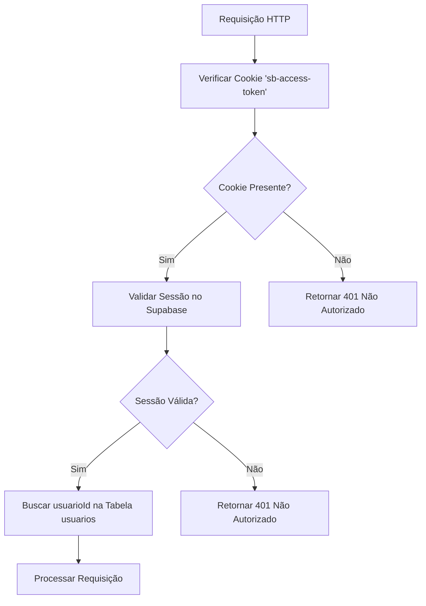
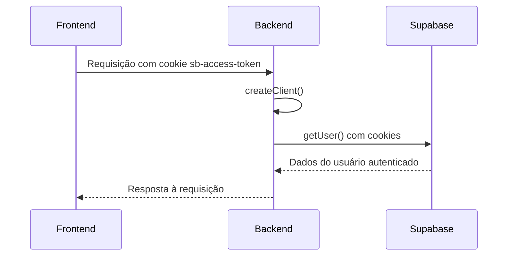
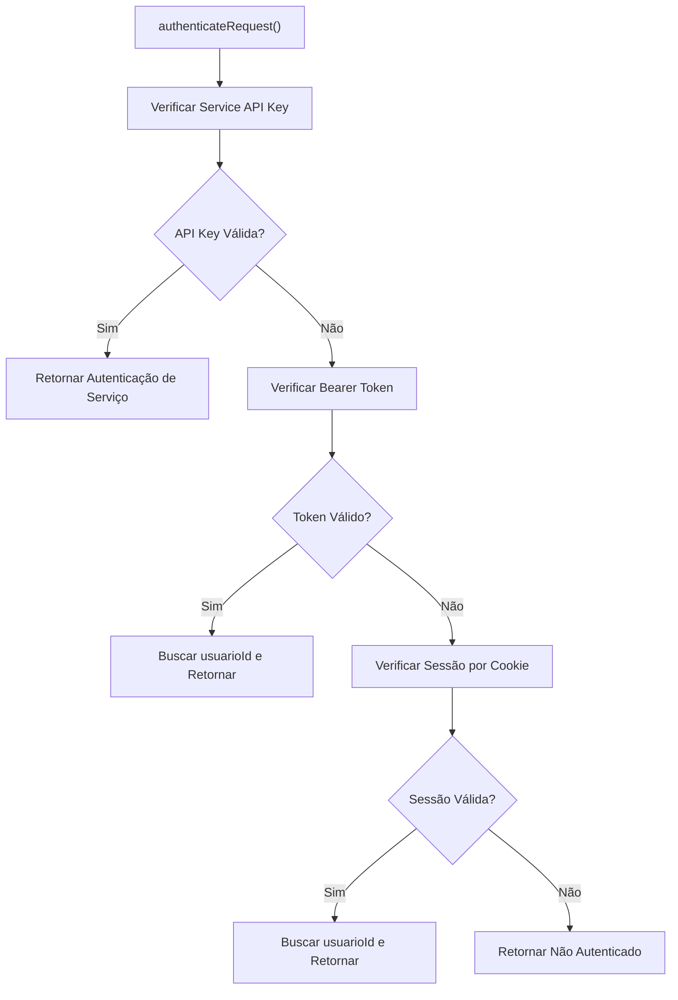

# Autenticação por Sessão

<cite>
**Arquivos Referenciados neste Documento**  
- [swagger.config.ts](file://swagger.config.ts)
- [backend/utils/supabase/server.ts](file://backend/utils/supabase/server.ts)
- [backend/utils/auth/api-auth.ts](file://backend/utils/auth/api-auth.ts)
- [supabase/schemas/08_usuarios.sql](file://supabase/schemas/08_usuarios.sql)
</cite>

## Sumário
1. [Introdução](#introdução)
2. [Fluxo de Autenticação por Sessão](#fluxo-de-autenticação-por-sessão)
3. [Configuração do Swagger](#configuração-do-swagger)
4. [Criação do Cliente Supabase](#criação-do-cliente-supabase)
5. [Validação da Requisição de Autenticação](#validação-da-requisição-de-autenticação)
6. [Busca do ID do Usuário](#busca-do-id-do-usuário)
7. [Exemplos de Requisições HTTP](#exemplos-de-requisições-http)
8. [Códigos de Erro Comuns](#códigos-de-erro-comuns)
9. [Gerenciamento de Sessões Expiradas](#gerenciamento-de-sessões-expiradas)
10. [Uso de RLS no Supabase](#uso-de-rls-no-supabase)

## Introdução
O sistema de autenticação por sessão no Sinesys utiliza o Supabase Auth para gerenciar a identidade dos usuários. Este documento detalha como o middleware de autenticação valida a sessão através do cookie 'sb-access-token', conforme configurado em swagger.config.ts. A implementação da função createClient() em backend/utils/supabase/server.ts obtém a sessão do usuário a partir dos cookies, enquanto authenticateRequest() em backend/utils/auth/api-auth.ts verifica a sessão e busca o usuarioId correspondente na tabela usuarios. O fluxo completo desde o login no frontend até a validação no backend é explicado, destacando o uso de RLS (Row Level Security) no Supabase.

## Fluxo de Autenticação por Sessão
O fluxo de autenticação por sessão no Sinesys começa com o login do usuário no frontend, onde o Supabase Auth cria uma sessão armazenada no cookie 'sb-access-token'. Quando uma requisição é feita ao backend, o middleware de autenticação verifica a validade dessa sessão. O processo envolve a criação de um cliente Supabase que acessa os cookies da requisição, a validação da sessão e a busca do ID do usuário na tabela usuarios. Este fluxo garante que apenas usuários autenticados possam acessar os recursos protegidos da API.

## Configuração do Swagger
A configuração do Swagger define o esquema de autenticação por sessão usando o cookie 'sb-access-token'. No arquivo swagger.config.ts, o esquema de segurança sessionAuth é configurado para usar o cookie com o nome 'sb-access-token'. Isso permite que a documentação da API mostre claramente como os clientes devem enviar o cookie de sessão nas requisições.



**Diagram sources**
- [swagger.config.ts](file://swagger.config.ts#L33-L38)

**Section sources**
- [swagger.config.ts](file://swagger.config.ts#L33-L38)

## Criação do Cliente Supabase
A função createClient() em backend/utils/supabase/server.ts é responsável por criar um cliente Supabase que pode acessar a sessão do usuário a partir dos cookies. A função utiliza o objeto cookies do Next.js para obter todos os cookies da requisição e os fornece ao cliente Supabase. Isso permite que o cliente valide a sessão do usuário e obtenha suas informações de autenticação.



**Diagram sources**
- [backend/utils/supabase/server.ts](file://backend/utils/supabase/server.ts#L3-L28)

**Section sources**
- [backend/utils/supabase/server.ts](file://backend/utils/supabase/server.ts#L3-L28)

## Validação da Requisição de Autenticação
A função authenticateRequest() em backend/utils/auth/api-auth.ts é o coração do sistema de autenticação. Ela verifica a autenticação da requisição em três etapas: primeiro, verifica a Service API Key para jobs do sistema; segundo, verifica o Bearer Token (JWT do Supabase); e terceiro, verifica a sessão do Supabase nos cookies. A função retorna um objeto AuthResult indicando se a autenticação foi bem-sucedida e fornecendo o userId e usuarioId do usuário.



**Diagram sources**
- [backend/utils/auth/api-auth.ts](file://backend/utils/auth/api-auth.ts#L49-L133)

**Section sources**
- [backend/utils/auth/api-auth.ts](file://backend/utils/auth/api-auth.ts#L49-L133)

## Busca do ID do Usuário
Após a validação da sessão, o sistema busca o ID do usuário na tabela usuarios usando o UUID do Supabase Auth. A função buscarUsuarioIdPorAuthUserId() realiza uma consulta à tabela usuarios, filtrando pelo campo auth_user_id. Esta função é crucial para mapear a identidade do Supabase Auth para o ID do usuário no sistema, permitindo o acesso controlado aos dados.

**Section sources**
- [backend/utils/auth/api-auth.ts](file://backend/utils/auth/api-auth.ts#L19-L38)

## Exemplos de Requisições HTTP
Para acessar recursos protegidos, o cliente deve incluir o cookie de sessão 'sb-access-token' nas requisições HTTP. Um exemplo de requisição GET para um endpoint protegido seria:

```
GET /api/usuarios/1 HTTP/1.1
Host: api.sinesys.com.br
Cookie: sb-access-token=eyJhbGciOiJIUzI1NiIsInR5cCI6IkpXVCJ9...
```

O cookie 'sb-access-token' contém o JWT que identifica a sessão do usuário no Supabase.

## Códigos de Erro Comuns
O sistema retorna o código de status HTTP 401 (Não Autorizado) quando a autenticação falha. Isso pode ocorrer por vários motivos, como ausência do cookie de sessão, sessão expirada ou token inválido. O cliente deve tratar esse erro redirecionando o usuário para a página de login.

## Gerenciamento de Sessões Expiradas
Quando uma sessão expira, o Supabase Auth invalida o cookie 'sb-access-token'. O backend detecta isso ao tentar validar a sessão e retorna um erro 401. O frontend deve escutar por esses erros e redirecionar o usuário para a página de login, onde ele pode se autenticar novamente.

## Uso de RLS no Supabase
O Supabase utiliza RLS (Row Level Security) para controlar o acesso aos dados na tabela usuarios. As políticas de RLS garantem que apenas usuários autenticados possam acessar seus próprios dados. O cliente Supabase criado pela função createClient() respeita essas políticas, enquanto o cliente criado por createServiceClient() pode contorná-las para operações administrativas.

**Section sources**
- [supabase/schemas/08_usuarios.sql](file://supabase/schemas/08_usuarios.sql#L71-L74)