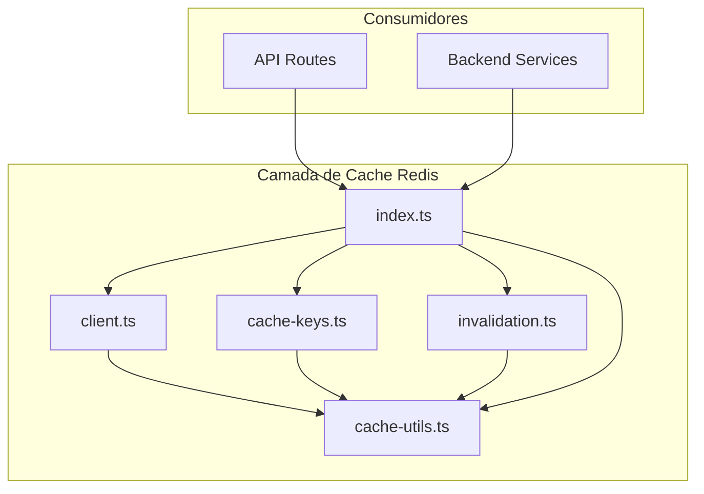
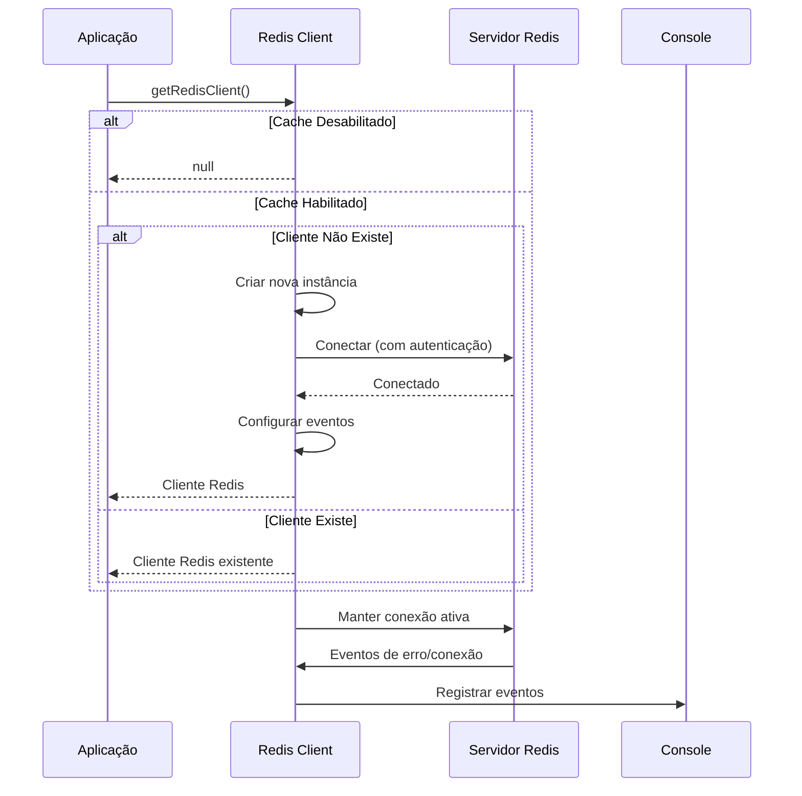
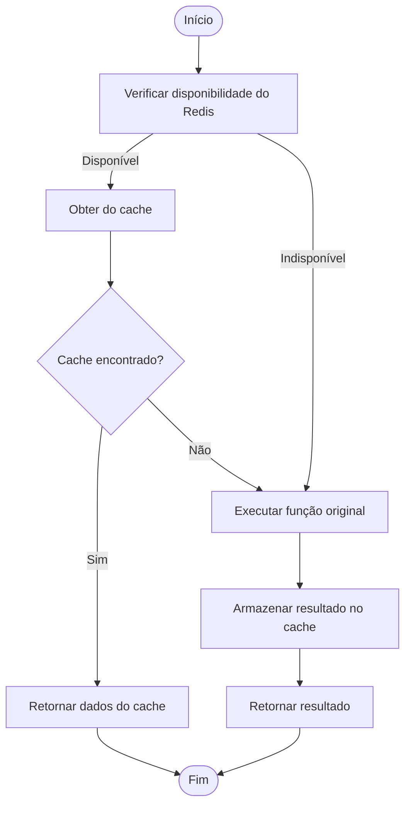
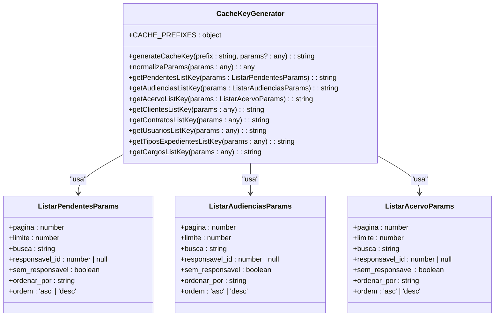
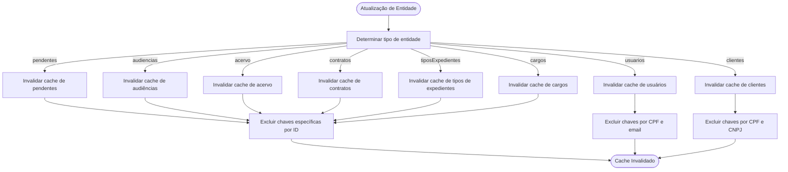
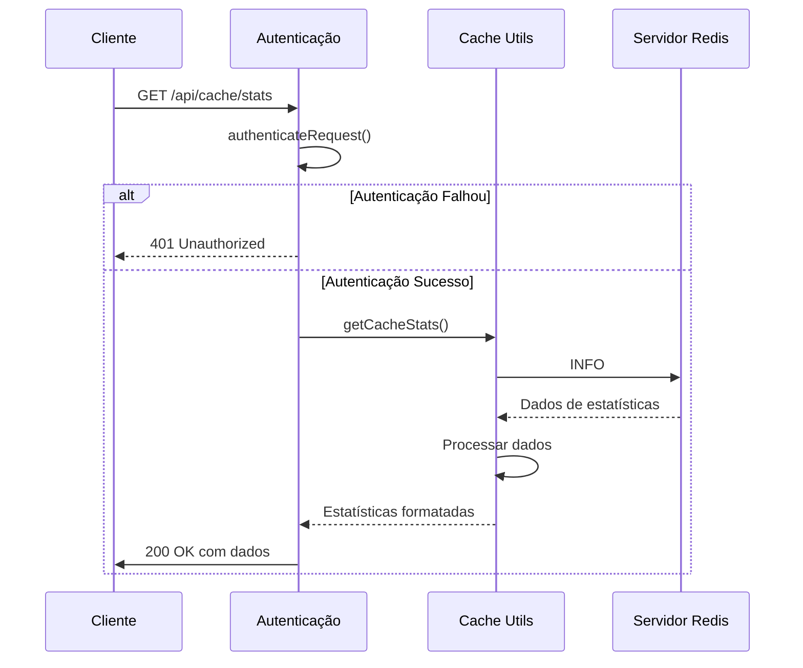
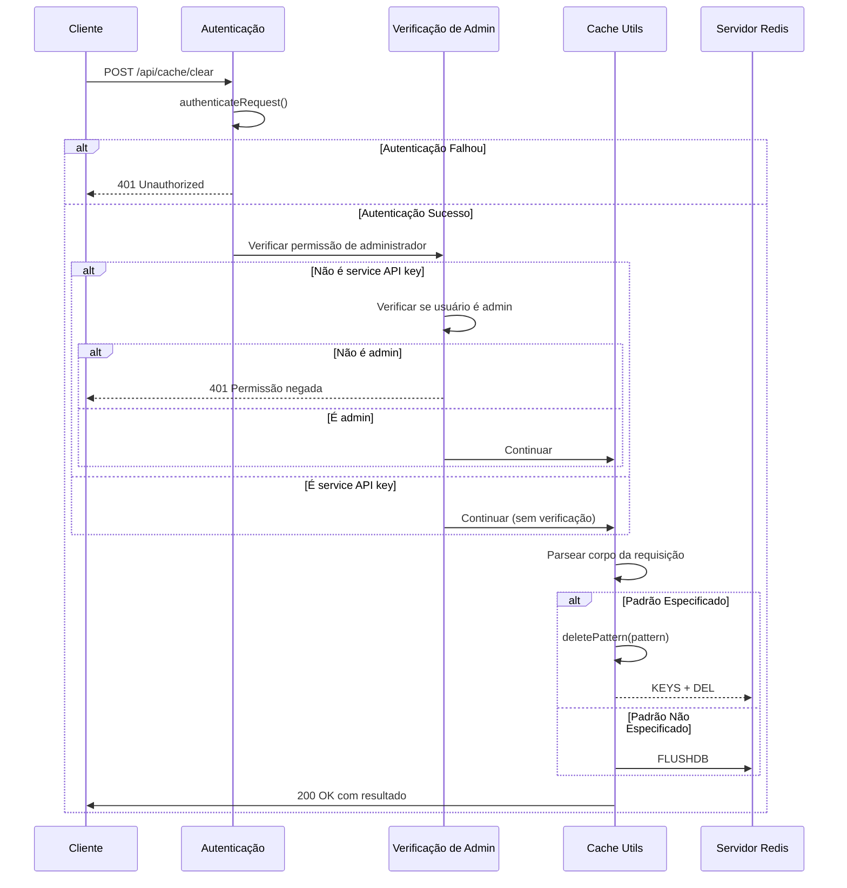

# Camada de Cache Redis

<cite>
**Arquivos Referenciados neste Documento**  
- [client.ts](file://lib/redis/client.ts)
- [cache-utils.ts](file://lib/redis/cache-utils.ts)
- [cache-keys.ts](file://lib/redis/cache-keys.ts)
- [invalidation.ts](file://lib/redis/invalidation.ts)
- [index.ts](file://lib/redis/index.ts)
- [route.ts](file://app/api/cache/stats/route.ts)
- [route.ts](file://app/api/cache/clear/route.ts)
- [listar-acervo.service.ts](file://backend/acervo/services/persistence/listar-acervo.service.ts)
- [listar-audiencias.service.ts](file://backend/audiencias/services/persistence/listar-audiencias.service.ts)
- [classe-judicial-persistence.service.ts](file://backend/captura/services/persistence/classe-judicial-persistence.service.ts)
- [cargo-persistence.service.ts](file://backend/cargos/services/persistence/cargo-persistence.service.ts)
</cite>

## Sumário
1. [Introdução](#introdução)
2. [Estrutura do Cache](#estrutura-do-cache)
3. [Configuração do Cliente Redis](#configuração-do-cliente-redis)
4. [Utilitários de Cache](#utilitários-de-cache)
5. [Geração de Chaves de Cache](#geração-de-chaves-de-cache)
6. [Invalidação de Cache](#invalidação-de-cache)
7. [Endpoints de API para Cache](#endpoints-de-api-para-cache)
8. [Uso do Cache em Serviços](#uso-do-cache-em-serviços)
9. [Considerações de Desempenho](#considerações-de-desempenho)
10. [Guia de Solução de Problemas](#guia-de-solução-de-problemas)

## Introdução

A camada de cache Redis é uma componente fundamental do sistema Sinesys, projetada para melhorar o desempenho e a escalabilidade da aplicação através do armazenamento temporário de dados frequentemente acessados. Esta camada reduz a carga sobre o banco de dados principal e diminui a latência das requisições ao armazenar resultados de consultas e dados auxiliares em memória. O Redis é utilizado como sistema de cache distribuído, permitindo acesso rápido a dados com tempos de vida (TTL) configuráveis.

O sistema de cache é implementado no diretório `lib/redis` e expõe uma interface modular através de vários arquivos que gerenciam diferentes aspectos da funcionalidade de cache. A integração com o Redis é feita através da biblioteca ioredis, que fornece uma interface robusta e resiliente para operações de cache.

## Estrutura do Cache

A estrutura do cache Redis é organizada em um conjunto de módulos especializados que trabalham em conjunto para fornecer funcionalidades completas de armazenamento em cache. O diretório `lib/redis` contém os seguintes arquivos principais:

- **client.ts**: Gerencia a conexão com o servidor Redis, incluindo configuração, reconexão automática e tratamento de erros.
- **cache-utils.ts**: Fornece funções utilitárias para operações de cache, como obtenção, armazenamento, exclusão e geração de estatísticas.
- **cache-keys.ts**: Define funções para gerar chaves de cache consistentes e normalizadas com base em prefixos e parâmetros.
- **invalidation.ts**: Contém funções especializadas para invalidação de cache, permitindo a limpeza seletiva ou total de entradas de cache.
- **index.ts**: Exporta todas as funcionalidades do módulo de cache para uso em outras partes da aplicação.

A arquitetura modular permite que diferentes partes da aplicação utilizem o cache de forma consistente, enquanto mantém a lógica de gerenciamento de cache centralizada e reutilizável.



**Fontes do Diagrama**
- [client.ts](file://lib/redis/client.ts)
- [cache-utils.ts](file://lib/redis/cache-utils.ts)
- [cache-keys.ts](file://lib/redis/cache-keys.ts)
- [invalidation.ts](file://lib/redis/invalidation.ts)
- [index.ts](file://lib/redis/index.ts)

## Configuração do Cliente Redis

O cliente Redis é configurado no arquivo `client.ts` e gerencia todas as conexões com o servidor Redis. A configuração é controlada por variáveis de ambiente que permitem ajustar o comportamento do cache conforme o ambiente de execução.

As principais configurações incluem:

- **ENABLE_REDIS_CACHE**: Variável booleana que habilita ou desabilita o cache Redis. Quando definida como `false`, todas as operações de cache são ignoradas, permitindo testes sem dependência do Redis.
- **REDIS_URL**: URL de conexão com o servidor Redis, que inclui o protocolo, host, porta e banco de dados.
- **REDIS_PASSWORD**: Senha para autenticação no servidor Redis.
- **REDIS_CACHE_TTL**: Tempo de vida padrão (em segundos) para entradas de cache, com valor padrão de 600 segundos (10 minutos).
- **REDIS_CACHE_MAX_MEMORY**: Limite máximo de memória para o Redis, com valor padrão de 256mb.

O cliente implementa estratégias de resiliência, incluindo tentativas de reconexão com backoff exponencial (até 3 tentativas com intervalos crescentes até 2 segundos) e tratamento robusto de erros. Os eventos de conexão, prontidão e fechamento são registrados para monitoramento.



**Fontes do Diagrama**
- [client.ts](file://lib/redis/client.ts#L1-L64)

## Utilitários de Cache

O arquivo `cache-utils.ts` fornece um conjunto abrangente de funções utilitárias para operações de cache, servindo como a interface principal para interação com o Redis. Estas funções abstraem a complexidade das operações de cache e fornecem uma API consistente para outras partes da aplicação.

As principais funções incluem:

- **getCached<T>(key: string)**: Recupera dados armazenados em cache para uma chave específica. Retorna `null` se a chave não existir ou se o Redis não estiver disponível.
- **setCached<T>(key: string, data: T, ttl: number)**: Armazena dados em cache com um tempo de vida opcional. Os dados são serializados em JSON antes do armazenamento.
- **deleteCached(key: string)**: Remove uma entrada específica do cache.
- **deletePattern(pattern: string)**: Remove todas as entradas que correspondem a um padrão de chave, utilizando o comando KEYS do Redis.
- **getCacheStats()**: Obtém estatísticas do Redis, incluindo memória usada, hits, misses e tempo de atividade.
- **withCache<T>(key: string, fn: () => Promise<T>, ttl: number)**: Função de ordem superior que envolve uma função assíncrona com lógica de cache, verificando primeiro o cache antes de executar a função.

A função `withCache` é particularmente útil para implementar padrões de cache transparente, onde a lógica de verificação e armazenamento em cache é abstraída da lógica de negócios principal.



**Fontes do Diagrama**
- [cache-utils.ts](file://lib/redis/cache-utils.ts#L1-L152)

## Geração de Chaves de Cache

A geração de chaves de cache é gerenciada pelo arquivo `cache-keys.ts`, que define prefixos consistentes e funções para criar chaves de cache baseadas em parâmetros. Este sistema garante que chaves equivalentes sejam geradas consistentemente em diferentes partes da aplicação.

Os prefixos de cache são definidos como uma constante `CACHE_PREFIXES` que mapeia entidades do sistema para seus prefixos correspondentes:

```typescript
const CACHE_PREFIXES = {
  pendentes: 'pendentes',
  audiencias: 'audiencias',
  acervo: 'acervo',
  usuarios: 'usuarios',
  clientes: 'clientes',
  contratos: 'contratos',
  tiposExpedientes: 'tipos_expedientes',
  cargos: 'cargos',
  classeJudicial: 'classe_judicial',
  tipoAudiencia: 'tipo_audiencia',
  salaAudiencia: 'sala_audiencia',
  orgaoJulgador: 'orgao_julgador',
} as const;
```

Para garantir consistência, os parâmetros são normalizados antes da geração da chave, removendo valores `undefined` e ordenando as chaves do objeto. A função `generateCacheKey` combina o prefixo com os parâmetros serializados em JSON para criar a chave final.

O sistema inclui funções específicas para gerar chaves para diferentes entidades, como `getPendentesListKey`, `getAudienciasListKey`, `getAcervoListKey`, entre outras, todas seguindo o mesmo padrão de normalização e serialização.



**Fontes do Diagrama**
- [cache-keys.ts](file://lib/redis/cache-keys.ts#L1-L98)

## Invalidação de Cache

O arquivo `invalidation.ts` implementa estratégias de invalidação de cache para garantir que os dados armazenados em cache permaneçam consistentes com os dados no banco de dados. A invalidação é crucial para manter a integridade dos dados quando entidades são atualizadas, criadas ou excluídas.

O sistema fornece funções especializadas para invalidar caches de diferentes entidades:

- **invalidatePendentesCache()**: Invalida todo o cache relacionado a pendentes.
- **invalidateAudienciasCache()**: Invalida todo o cache relacionado a audiências.
- **invalidateAcervoCache()**: Invalida todo o cache relacionado ao acervo.
- **invalidateUsuariosCache()**: Invalida todo o cache relacionado a usuários.
- **invalidateClientesCache()**: Invalida todo o cache relacionado a clientes.
- **invalidateContratosCache()**: Invalida todo o cache relacionado a contratos.
- **invalidateAllListCaches()**: Invalida todos os caches de listagem em paralelo.

A função `invalidateCacheOnUpdate` é particularmente importante, pois invalida o cache apropriado com base no tipo de entidade e ID atualizados. Para entidades como usuários e clientes, ela também invalida chaves específicas baseadas em CPF e CNPJ.



**Fontes do Diagrama**
- [invalidation.ts](file://lib/redis/invalidation.ts#L1-L106)

## Endpoints de API para Cache

A aplicação expõe dois endpoints de API para gerenciamento do cache Redis, localizados em `app/api/cache/`. Esses endpoints permitem operações administrativas de monitoramento e limpeza do cache.

### Endpoint de Estatísticas

O endpoint `GET /api/cache/stats` retorna estatísticas detalhadas sobre o estado atual do cache Redis. Este endpoint requer autenticação e está disponível para todos os tipos de autenticação suportados (bearer, session e service API key).

As estatísticas retornadas incluem:
- Disponibilidade do Redis
- Memória usada
- Número de hits no cache
- Número de misses no cache
- Tempo de atividade em segundos
- Total de conexões recebidas



**Fontes do Diagrama**
- [route.ts](file://app/api/cache/stats/route.ts#L1-L98)

### Endpoint de Limpeza

O endpoint `POST /api/cache/clear` permite a limpeza manual do cache Redis. Este endpoint requer permissões de administrador, exceto quando acessado via service API key.

O endpoint aceita um parâmetro opcional `pattern` no corpo da requisição:
- Se um padrão for especificado, apenas as chaves que correspondem ao padrão são removidas.
- Se nenhum padrão for especificado, todo o cache é limpo usando o comando `FLUSHDB`.

A verificação de permissão de administrador é realizada consultando o campo `admin` na tabela `usuarios` do banco de dados.



**Fontes do Diagrama**
- [route.ts](file://app/api/cache/clear/route.ts#L1-L146)

## Uso do Cache em Serviços

O sistema de cache é amplamente utilizado em serviços de persistência do backend para otimizar o desempenho de consultas frequentes. Os serviços implementam padrões consistentes de cache, verificando primeiro o cache antes de executar consultas no banco de dados.

### Serviço de Acervo

O serviço `listarAcervo` utiliza o cache para armazenar resultados de consultas ao acervo jurídico. A chave de cache é gerada com base nos parâmetros da consulta usando `getAcervoListKey`. O tempo de vida do cache é de 900 segundos (15 minutos).

```typescript
const cacheKey = getAcervoListKey(params);
const cached = await getCached<ListarAcervoResult>(cacheKey);
if (cached !== null) {
  return cached;
}
// ... consulta ao banco de dados ...
await setCached(cacheKey, result, ACERVO_TTL);
```

**Fontes da Seção**
- [listar-acervo.service.ts](file://backend/acervo/services/persistence/listar-acervo.service.ts#L1-L434)

### Serviço de Audiências

O serviço `listarAudiencias` implementa um padrão similar, utilizando `getAudienciasListKey` para gerar chaves de cache baseadas nos parâmetros da consulta. O tempo de vida padrão é determinado pela configuração global do Redis.

```typescript
const cacheKey = getAudienciasListKey(params);
const cachedResult = await getCached<ListarAudienciasResult>(cacheKey);
if (cachedResult) {
  return cachedResult;
}
// ... consulta ao banco de dados ...
await setCached(cacheKey, result);
```

**Fontes da Seção**
- [listar-audiencias.service.ts](file://backend/audiencias/services/persistence/listar-audiencias.service.ts#L1-L212)

### Serviços de Dados Auxiliares

Serviços que gerenciam dados auxiliares, como classes judiciais e cargos, utilizam o cache com tempos de vida mais longos (3600 segundos ou 1 hora), pois esses dados são relativamente estáveis.

O serviço de classes judiciais utiliza a função `withCache` para implementar cache transparente:

```typescript
return withCache(key, async () => {
  // consulta ao banco de dados
}, 3600);
```

O serviço de cargos invalida todo o cache de cargos quando um cargo é criado, atualizado ou excluído:

```typescript
await deletePattern(`${CACHE_PREFIXES.cargos}:*`);
```

**Fontes da Seção**
- [classe-judicial-persistence.service.ts](file://backend/captura/services/persistence/classe-judicial-persistence.service.ts#L1-L178)
- [cargo-persistence.service.ts](file://backend/cargos/services/persistence/cargo-persistence.service.ts#L1-L276)

## Considerações de Desempenho

O sistema de cache Redis foi projetado com várias considerações de desempenho para otimizar a eficiência e a escalabilidade:

### Tempos de Vida (TTL)

Os tempos de vida são configurados diferentemente com base na natureza dos dados:

- **Listagens dinâmicas** (pendentes, audiências, acervo): 10 minutos (600s)
- **Dados auxiliares** (usuários, clientes, contratos, tipos de expedientes, cargos): 15-30 minutos
- **Dados estáveis** (classes judiciais, tipos de audiência, salas de audiência, órgãos julgadores): 1 hora (3600s)

Essa diferenciação permite equilibrar a atualização de dados com o desempenho, garantindo que dados mais voláteis sejam atualizados com mais frequência enquanto dados estáveis permanecem em cache por períodos mais longos.

### Estratégias de Invalidação

O sistema implementa estratégias de invalidação seletiva para minimizar o impacto nas operações de cache:

- Invalidação por entidade: Quando uma entidade é atualizada, apenas o cache relacionado a essa entidade é invalidado.
- Invalidação por ID: Além do cache geral, chaves específicas por ID são invalidadas para garantir consistência.
- Invalidação em paralelo: A função `invalidateAllListCaches` utiliza `Promise.all` para invalidar múltiplos caches simultaneamente, reduzindo o tempo total de invalidação.

### Resiliência

O sistema é projetado para ser resiliente a falhas no Redis:

- Quando o Redis não está disponível, as operações de cache falham silenciosamente, permitindo que a aplicação continue funcionando com acesso direto ao banco de dados.
- O cliente Redis implementa reconexão automática com backoff exponencial.
- As funções de cache incluem tratamento robusto de erros com logs apropriados.

## Guia de Solução de Problemas

### Problema: Cache não está sendo usado

**Solução**: Verifique se a variável de ambiente `ENABLE_REDIS_CACHE` está definida como `true` e se o servidor Redis está acessível através da `REDIS_URL`. Confirme também que o Redis está em execução localmente ou em um container Docker.

### Problema: Dados desatualizados no cache

**Solução**: Utilize o endpoint `/api/cache/clear` para limpar manualmente o cache ou aguarde a expiração do TTL. Verifique também se as estratégias de invalidação estão sendo acionadas corretamente quando os dados são atualizados.

### Problema: Erro de conexão com Redis

**Solução**: Confirme as credenciais e a disponibilidade do servidor Redis. Verifique se a `REDIS_URL` e a `REDIS_PASSWORD` estão corretas. O sistema possui fallback automático que permite a aplicação funcionar sem cache em caso de falha de conexão.

### Problema: Memória do Redis esgotada

**Solução**: Ajuste a variável de ambiente `REDIS_CACHE_MAX_MEMORY` ou configure políticas de eviction no Redis para gerenciar automaticamente a memória quando atingir o limite.

### Monitoramento

Utilize o endpoint `/api/cache/stats` para monitorar o estado do cache, incluindo uso de memória, número de chaves, tempo de atividade, hits e misses. Este endpoint requer autenticação e fornece insights valiosos sobre o desempenho do cache.