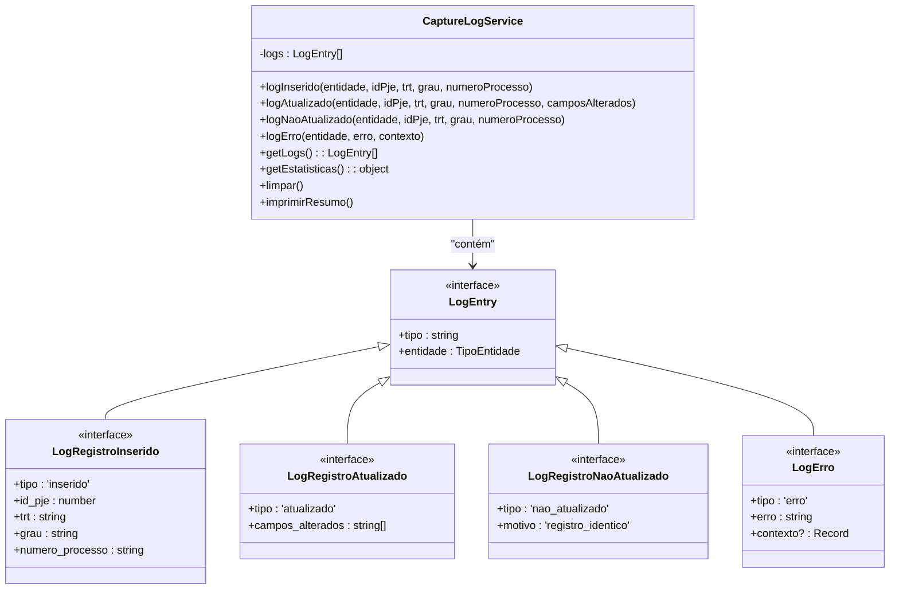
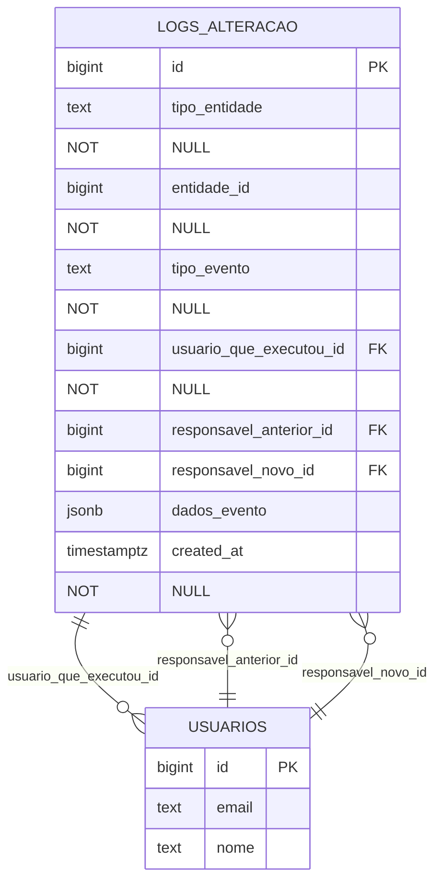

# Estratégia de Logging

<cite>
**Arquivos Referenciados neste Documento**  
- [capture-log.service.ts](file://backend/captura/services/persistence/capture-log.service.ts)
- [20251117015304_create_logs_alteracao.sql](file://supabase/migrations/20251117015304_create_logs_alteracao.sql)
- [README.md](file://README.md)
- [persistence/README.md](file://backend/captura/services/persistence/README.md)
</cite>

## Sumário
1. [Introdução](#introdução)
2. [Serviço de Logging no Backend](#serviço-de-logging-no-backend)
3. [Estrutura da Tabela de Logs no Banco de Dados](#estrutura-da-tabela-de-logs-no-banco-de-dados)
4. [Benefícios da Estratégia de Logging](#benefícios-da-estratégia-de-logging)
5. [Exemplos de Consultas para Análise de Logs](#exemplos-de-consultas-para-análise-de-logs)
6. [Boas Práticas para Uso do Sistema de Logging](#boas-práticas-para-uso-do-sistema-de-logging)

## Introdução

O sistema Sinesys implementa uma estratégia robusta de logging para garantir auditoria, rastreabilidade e eficiência no debugging de operações críticas. Esta documentação detalha a implementação do serviço de log em `backend/captura/services/persistence/capture-log.service.ts`, a estrutura da tabela de logs definida em `supabase/migrations/20251117015304_create_logs_alteracao.sql`, e as boas práticas para utilização do sistema em novos módulos. O sistema permite rastrear mudanças em registros, atribuições de responsáveis e eventos importantes com precisão.

**Seção fontes**  
- [README.md](file://README.md#L1-L37)
- [persistence/README.md](file://backend/captura/services/persistence/README.md#L1-L95)

## Serviço de Logging no Backend

O serviço `CaptureLogService` é responsável por registrar eventos estruturados durante operações de persistência no sistema. Ele é implementado como uma instância singleton (`captureLogService`) para uso global em todo o backend.

O serviço suporta quatro tipos principais de logs:
- **Inserção**: Registro de novos registros no sistema
- **Atualização**: Registro de mudanças em registros existentes
- **Não atualizado**: Registro de tentativas de atualização sem alterações
- **Erro**: Registro de falhas durante operações de persistência

Cada log contém metadados como entidade envolvida, identificadores do processo, TRT, grau e campos alterados. O serviço também fornece métodos para obter estatísticas, limpar logs e imprimir um resumo formatado no console.



**Fontes do diagrama**  
- [capture-log.service.ts](file://backend/captura/services/persistence/capture-log.service.ts#L1-L188)

**Seção fontes**  
- [capture-log.service.ts](file://backend/captura/services/persistence/capture-log.service.ts#L1-L188)
- [persistence/README.md](file://backend/captura/services/persistence/README.md#L32-L39)

## Estrutura da Tabela de Logs no Banco de Dados

A tabela `logs_alteracao` no banco de dados Supabase é projetada para rastrear alterações em qualquer entidade do sistema. Ela é definida na migration `20251117015304_create_logs_alteracao.sql` e possui uma estrutura flexível e escalável.

### Esquema da Tabela

| Campo | Tipo | Obrigatório | Descrição |
|-------|------|-------------|-----------|
| `id` | bigint | Sim | Identificador único do log |
| `tipo_entidade` | text | Sim | Tipo da entidade alterada (acervo, audiencias, etc.) |
| `entidade_id` | bigint | Sim | ID do registro da entidade alterada |
| `tipo_evento` | text | Sim | Tipo do evento/alteração |
| `usuario_que_executou_id` | bigint | Sim | ID do usuário que executou a ação |
| `responsavel_anterior_id` | bigint | Não | ID do responsável anterior |
| `responsavel_novo_id` | bigint | Não | ID do novo responsável |
| `dados_evento` | jsonb | Não | Dados adicionais específicos do evento |
| `created_at` | timestamptz | Sim | Data e hora da criação do log |

### Restrições e Índices

A tabela inclui restrições para garantir integridade dos dados:
- `tipo_entidade` limitado a valores específicos via `CHECK`
- Chaves estrangeiras para `usuarios(id)` com políticas de exclusão definidas
- RLS (Row Level Security) habilitado para controle de acesso

Índices criados para otimizar consultas:
- `idx_logs_alteracao_tipo_entidade_id`: Busca por entidade e ID
- `idx_logs_alteracao_tipo_evento`: Filtro por tipo de evento
- `idx_logs_alteracao_usuario_executou`: Auditoria por usuário executor
- `idx_logs_alteracao_created_at`: Ordenação por data (descendente)
- `idx_logs_alteracao_dados_evento`: Busca em campos JSONB



**Fontes do diagrama**  
- [20251117015304_create_logs_alteracao.sql](file://supabase/migrations/20251117015304_create_logs_alteracao.sql#L1-L54)

**Seção fontes**  
- [20251117015304_create_logs_alteracao.sql](file://supabase/migrations/20251117015304_create_logs_alteracao.sql#L1-L54)

## Benefícios da Estratégia de Logging

A implementação da estratégia de logging no Sinesys traz diversos benefícios estratégicos para o sistema:

### Auditoria
O sistema mantém um histórico completo de todas as alterações realizadas em registros importantes, permitindo auditorias detalhadas. A combinação do serviço de logging em memória com a tabela persistente `logs_alteracao` garante que todas as ações sejam registradas com contexto completo.

### Rastreabilidade
Cada log contém informações suficientes para rastrear completamente a origem e o contexto de uma alteração. Os campos como `usuario_que_executou_id`, `responsavel_anterior_id` e `responsavel_novo_id` permitem identificar com precisão quem fez o que e quando.

### Debugging
Os logs estruturados facilitam significativamente o processo de debugging. O serviço `CaptureLogService` fornece um resumo formatado no console com estatísticas detalhadas, incluindo contagem de inserções, atualizações, registros não alterados e erros.

### Performance
A estratégia evita atualizações desnecessárias no banco de dados ao comparar registros antes da persistência. Isso reduz o tráfego no banco e evita atualizações do campo `updated_at` quando não há mudanças reais nos dados.

**Seção fontes**  
- [persistence/README.md](file://backend/captura/services/persistence/README.md#L88-L95)
- [README.md](file://README.md#L1-L37)

## Exemplos de Consultas para Análise de Logs

Abaixo estão exemplos de consultas SQL úteis para análise dos logs de alteração:

### Consultar todas as atribuições de responsável para um processo específico
```sql
SELECT 
    la.*,
    u1.nome as nome_executor,
    u2.nome as nome_responsavel_anterior,
    u3.nome as nome_novo_responsavel
FROM logs_alteracao la
LEFT JOIN usuarios u1 ON la.usuario_que_executou_id = u1.id
LEFT JOIN usuarios u2 ON la.responsavel_anterior_id = u2.id
LEFT JOIN usuarios u3 ON la.responsavel_novo_id = u3.id
WHERE la.tipo_entidade = 'acervo'
    AND la.entidade_id = 123
    AND la.tipo_evento = 'atribuicao_responsavel'
ORDER BY la.created_at DESC;
```

### Obter estatísticas de atividade por usuário
```sql
SELECT 
    u.nome,
    u.email,
    COUNT(*) as total_alteracoes,
    COUNT(*) FILTER (WHERE la.tipo_evento = 'atribuicao_responsavel') as atribuicoes,
    COUNT(*) FILTER (WHERE la.tipo_evento = 'mudanca_status') as mudancas_status,
    MAX(la.created_at) as ultima_atividade
FROM usuarios u
LEFT JOIN logs_alteracao la ON u.id = la.usuario_que_executou_id
GROUP BY u.id, u.nome, u.email
ORDER BY total_alteracoes DESC;
```

### Encontrar todas as alterações em um período específico
```sql
SELECT *
FROM logs_alteracao
WHERE created_at >= '2025-11-17 00:00:00'
    AND created_at < '2025-11-18 00:00:00'
ORDER BY created_at DESC;
```

### Buscar alterações com dados específicos no JSON
```sql
SELECT *
FROM logs_alteracao
WHERE tipo_evento = 'mudanca_status'
    AND dados_evento @> '{"status_anterior": "ativo", "status_novo": "inativo"}'
ORDER BY created_at DESC;
```

**Seção fontes**  
- [20251117015304_create_logs_alteracao.sql](file://supabase/migrations/20251117015304_create_logs_alteracao.sql#L1-L54)

## Boas Práticas para Uso do Sistema de Logging

Ao implementar novos módulos no sistema Sinesys, siga estas boas práticas para garantir uma integração eficaz com o sistema de logging:

1. **Utilize o serviço singleton**: Sempre use a instância global `captureLogService` em vez de criar novas instâncias.

2. **Registre todos os eventos relevantes**: Para operações de persistência, registre inserções, atualizações e tentativas sem alterações.

3. **Forneça contexto nos erros**: Ao registrar erros, inclua informações adicionais no parâmetro `contexto` para facilitar o debugging.

4. **Limpe os logs após processamento**: Após processar os logs (ex: imprimir resumo), chame `captureLogService.limpar()` para evitar acúmulo.

5. **Utilize os tipos de entidade corretamente**: Use os valores definidos em `TipoEntidade` ('acervo', 'audiencias', 'pendentes_manifestacao').

6. **Mantenha os logs estruturados**: Evite mensagens de log não estruturadas; prefira os métodos específicos do serviço.

7. **Monitore as estatísticas**: Utilize `getEstatisticas()` para monitorar o desempenho das operações de persistência.

8. **Considere o desempenho**: Em operações em lote, considere o impacto do logging no desempenho e ajuste conforme necessário.

**Seção fontes**  
- [capture-log.service.ts](file://backend/captura/services/persistence/capture-log.service.ts#L1-L188)
- [persistence/README.md](file://backend/captura/services/persistence/README.md#L1-L95)