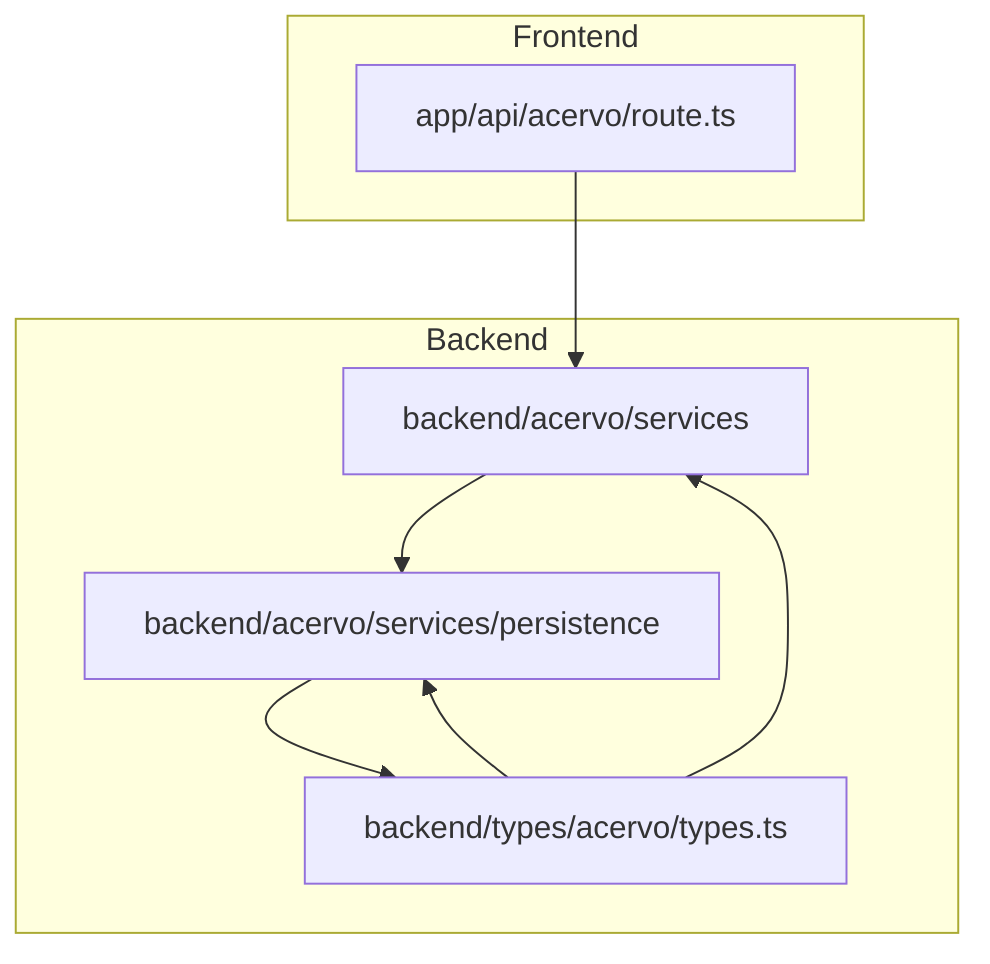
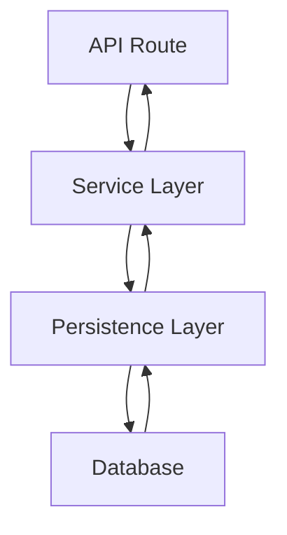
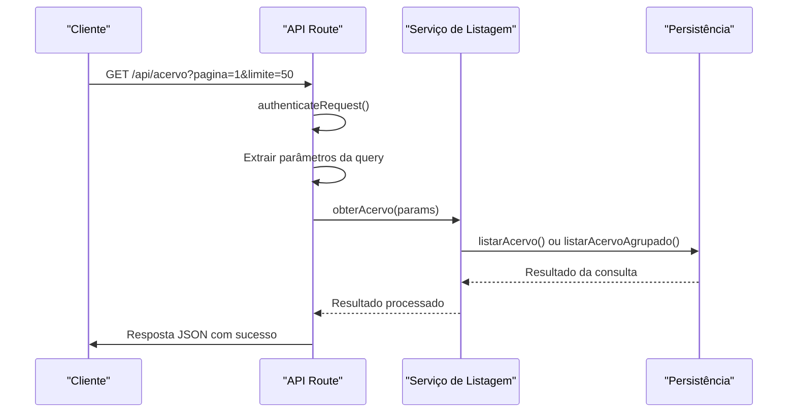
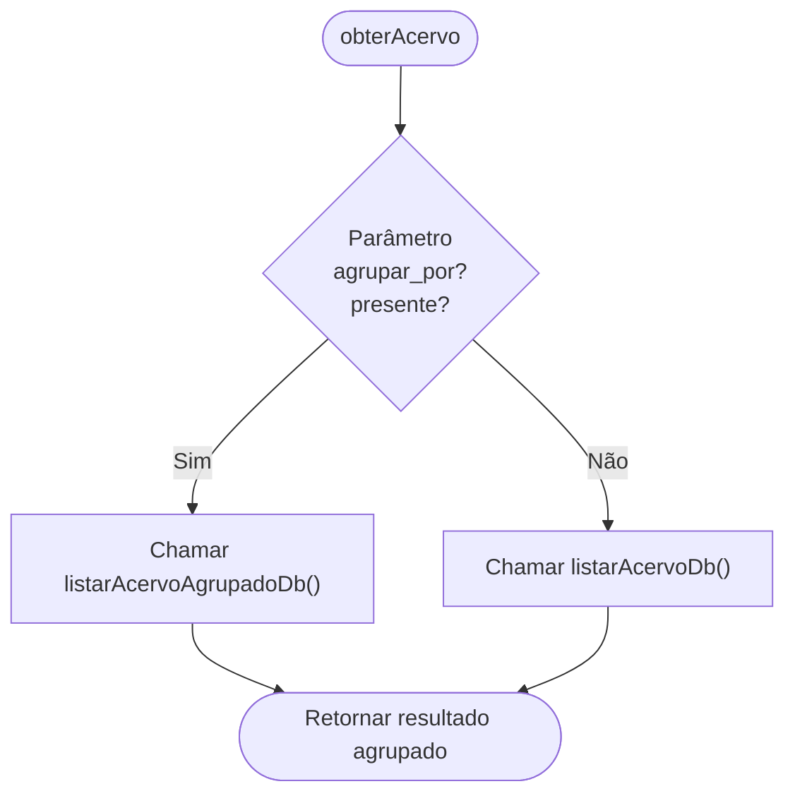
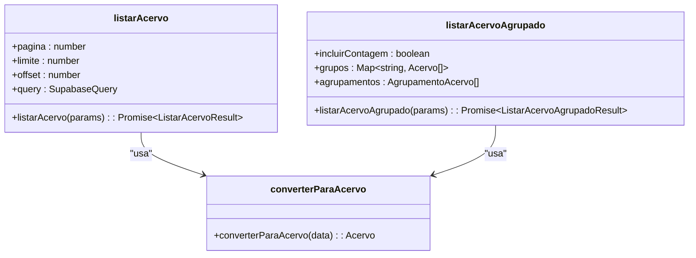
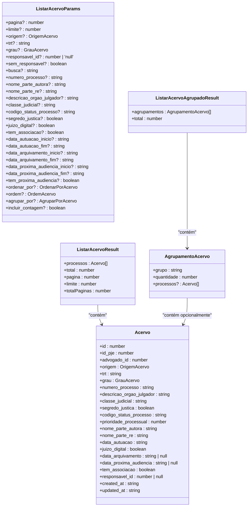
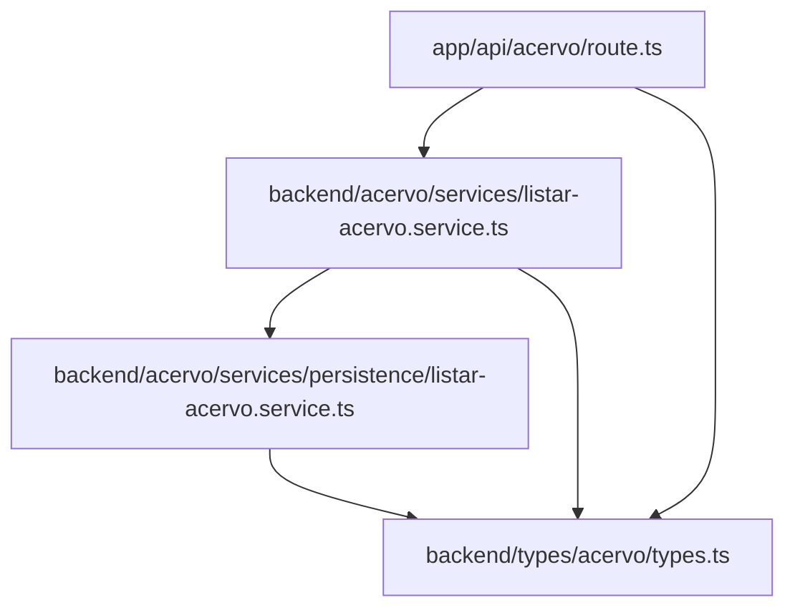

# Exemplos de Implementação

<cite>
**Arquivos Referenciados neste Documento**  
- [app/api/acervo/route.ts](file://app/api/acervo/route.ts)
- [backend/acervo/services/listar-acervo.service.ts](file://backend/acervo/services/listar-acervo.service.ts)
- [backend/acervo/services/persistence/listar-acervo.service.ts](file://backend/acervo/services/persistence/listar-acervo.service.ts)
- [backend/types/acervo/types.ts](file://backend/types/acervo/types.ts)
</cite>

## Sumário
1. [Introdução](#introdução)
2. [Estrutura do Projeto](#estrutura-do-projeto)
3. [Componentes Principais](#componentes-principais)
4. [Visão Geral da Arquitetura](#visão-geral-da-arquitetura)
5. [Análise Detalhada dos Componentes](#análise-detalhada-dos-componentes)
6. [Análise de Dependências](#análise-de-dependências)
7. [Considerações de Desempenho](#considerações-de-desempenho)
8. [Guia de Solução de Problemas](#guia-de-solução-de-problemas)
9. [Conclusão](#conclusão)
10. [Checklist de Consistência Arquitetural](#checklist-de-consistência-arquitetural)

## Introdução
Este documento apresenta uma análise detalhada da implementação do padrão de camadas no módulo de acervo do sistema Sinesys. O foco está no fluxo completo de processamento de uma requisição API, desde a definição da rota até a execução da consulta no banco de dados, destacando o uso de TypeScript para tipagem forte e o tratamento de erros entre camadas. A arquitetura em camadas garante separação de responsabilidades, facilitando a manutenção e escalabilidade do sistema.

## Estrutura do Projeto
A estrutura do projeto segue uma organização clara por funcionalidades, com separação entre camadas de frontend e backend. O módulo de acervo está organizado em diretórios específicos que refletem as diferentes camadas da arquitetura.

**Fontes do Diagrama**
- [app/api/acervo/route.ts](file://app/api/acervo/route.ts)
- [backend/acervo/services/listar-acervo.service.ts](file://backend/acervo/services/listar-acervo.service.ts)
- [backend/acervo/services/persistence/listar-acervo.service.ts](file://backend/acervo/services/persistence/listar-acervo.service.ts)
- [backend/types/acervo/types.ts](file://backend/types/acervo/types.ts)

**Fontes da Seção**
- [app/api/acervo/route.ts](file://app/api/acervo/route.ts)
- [backend/acervo/services](file://backend/acervo/services)
- [backend/acervo/services/persistence](file://backend/acervo/services/persistence)
- [backend/types/acervo](file://backend/types/acervo)

## Componentes Principais
Os componentes principais do módulo de acervo são organizados em camadas bem definidas, cada uma com responsabilidades específicas. A camada de API define os endpoints, a camada de serviços contém a lógica de negócio, a camada de persistência gerencia as operações de banco de dados e a camada de tipos define as interfaces utilizadas em todo o sistema.

**Fontes da Seção**
- [app/api/acervo/route.ts](file://app/api/acervo/route.ts#L4-L7)
- [backend/acervo/services/listar-acervo.service.ts](file://backend/acervo/services/listar-acervo.service.ts#L4-L7)
- [backend/acervo/services/persistence/listar-acervo.service.ts](file://backend/acervo/services/persistence/listar-acervo.service.ts#L4-L7)
- [backend/types/acervo/types.ts](file://backend/types/acervo/types.ts#L3-L75)

## Visão Geral da Arquitetura
A arquitetura do módulo de acervo segue um padrão de camadas clássico, com fluxo de dados unidirecional da API até a persistência. Cada camada tem interfaces bem definidas e depende apenas das camadas inferiores, garantindo baixo acoplamento e alta coesão.

**Fontes do Diagrama**
- [app/api/acervo/route.ts](file://app/api/acervo/route.ts)
- [backend/acervo/services/listar-acervo.service.ts](file://backend/acervo/services/listar-acervo.service.ts)
- [backend/acervo/services/persistence/listar-acervo.service.ts](file://backend/acervo/services/persistence/listar-acervo.service.ts)

## Análise Detalhada dos Componentes

### Análise do Componente de Rota API
O componente de rota API é responsável por receber requisições HTTP, extrair parâmetros de query, validar autenticação e orquestrar a chamada aos serviços. Ele atua como a interface entre o frontend e a lógica de negócio.

**Fontes do Diagrama**
- [app/api/acervo/route.ts](file://app/api/acervo/route.ts#L312-L435)
- [backend/acervo/services/listar-acervo.service.ts](file://backend/acervo/services/listar-acervo.service.ts#L24-L34)

**Fontes da Seção**
- [app/api/acervo/route.ts](file://app/api/acervo/route.ts#L1-L436)

### Análise do Componente de Serviço
O componente de serviço contém a lógica de negócio principal, decidindo entre listagem simples ou agrupada com base nos parâmetros recebidos. Ele atua como um orquestrador entre a camada de API e a camada de persistência.

**Fontes do Diagrama**
- [backend/acervo/services/listar-acervo.service.ts](file://backend/acervo/services/listar-acervo.service.ts#L24-L34)

**Fontes da Seção**
- [backend/acervo/services/listar-acervo.service.ts](file://backend/acervo/services/listar-acervo.service.ts#L1-L36)

### Análise do Componente de Persistência
O componente de persistência é responsável por executar as consultas no banco de dados, aplicando filtros, paginação, ordenação e agrupamento conforme necessário. Ele contém as implementações concretas das operações de banco de dados.

**Fontes do Diagrama**
- [backend/acervo/services/persistence/listar-acervo.service.ts](file://backend/acervo/services/persistence/listar-acervo.service.ts#L49-L373)

**Fontes da Seção**
- [backend/acervo/services/persistence/listar-acervo.service.ts](file://backend/acervo/services/persistence/listar-acervo.service.ts#L1-L398)

### Análise do Componente de Tipos
O componente de tipos define as interfaces utilizadas em todo o sistema, garantindo tipagem forte com TypeScript. As interfaces definem a estrutura dos dados que fluem entre as camadas.

**Fontes do Diagrama**
- [backend/types/acervo/types.ts](file://backend/types/acervo/types.ts#L49-L152)

**Fontes da Seção**
- [backend/types/acervo/types.ts](file://backend/types/acervo/types.ts#L1-L152)

## Análise de Dependências
A análise de dependências revela a estrutura modular do sistema, com camadas bem definidas e baixo acoplamento entre componentes. Cada camada depende apenas das camadas inferiores, seguindo o princípio de dependência unidirecional.

**Fontes do Diagrama**
- [app/api/acervo/route.ts](file://app/api/acervo/route.ts#L6)
- [backend/acervo/services/listar-acervo.service.ts](file://backend/acervo/services/listar-acervo.service.ts#L5-L7)
- [backend/acervo/services/persistence/listar-acervo.service.ts](file://backend/acervo/services/persistence/listar-acervo.service.ts#L5-L7)
- [backend/types/acervo/types.ts](file://backend/types/acervo/types.ts)

**Fontes da Seção**
- [app/api/acervo/route.ts](file://app/api/acervo/route.ts)
- [backend/acervo/services/listar-acervo.service.ts](file://backend/acervo/services/listar-acervo.service.ts)
- [backend/acervo/services/persistence/listar-acervo.service.ts](file://backend/acervo/services/persistence/listar-acervo.service.ts)
- [backend/types/acervo/types.ts](file://backend/types/acervo/types.ts)

## Considerações de Desempenho
O sistema implementa várias otimizações de desempenho, como paginação com limite máximo de 100 itens por requisição, uso de índices no banco de dados para filtros comuns e agrupamento em memória apenas quando necessário. A consulta de contagem exata é utilizada apenas na listagem padrão, enquanto o agrupamento busca todos os dados primeiro e realiza o agrupamento na aplicação.

## Guia de Solução de Problemas
O tratamento de erros é implementado em todas as camadas, com propagação clara de exceções desde a camada de persistência até a API. Erros de validação são tratados na camada de API, enquanto erros de banco de dados são capturados e convertidos em mensagens de erro apropriadas.

**Fontes da Seção**
- [app/api/acervo/route.ts](file://app/api/acervo/route.ts#L426-L433)
- [backend/acervo/services/persistence/listar-acervo.service.ts](file://backend/acervo/services/persistence/listar-acervo.service.ts#L170-L172)
- [backend/acervo/services/persistence/listar-acervo.service.ts](file://backend/acervo/services/persistence/listar-acervo.service.ts#L300-L302)

## Conclusão
A implementação do padrão de camadas no módulo de acervo do Sinesys demonstra uma arquitetura bem projetada, com separação clara de responsabilidades, tipagem forte com TypeScript e tratamento adequado de erros. O fluxo de processamento é eficiente e escalável, permitindo fácil manutenção e extensão futura.

## Checklist de Consistência Arquitetural
Para garantir a consistência arquitetural ao criar novos endpoints, siga este checklist:

1. **Definição de Rota**
   - [ ] Criar arquivo de rota no diretório `app/api/[recurso]/route.ts`
   - [ ] Implementar autenticação usando `authenticateRequest`
   - [ ] Extrair e validar parâmetros da query string
   - [ ] Documentar o endpoint com Swagger

2. **Tipagem**
   - [ ] Definir interfaces no diretório `backend/types/[recurso]/types.ts`
   - [ ] Utilizar tipos específicos para parâmetros, resultados e entidades
   - [ ] Garantir consistência entre as interfaces e o schema do banco de dados

3. **Camada de Serviço**
   - [ ] Criar serviço no diretório `backend/[recurso]/services`
   - [ ] Implementar lógica de negócio separada da persistência
   - [ ] Validar parâmetros de entrada
   - [ ] Orquestrar chamadas entre camadas

4. **Camada de Persistência**
   - [ ] Criar serviço de persistência no diretório `backend/[recurso]/services/persistence`
   - [ ] Implementar consultas ao banco de dados
   - [ ] Aplicar filtros, paginação e ordenação
   - [ ] Tratar erros de banco de dados

5. **Tratamento de Erros**
   - [ ] Capturar e propagar erros adequadamente entre camadas
   - [ ] Retornar códigos de status HTTP apropriados
   - [ ] Logar erros para depuração
   - [ ] Evitar vazamento de informações sensíveis nas mensagens de erro

6. **Testes**
   - [ ] Implementar testes unitários para a camada de serviço
   - [ ] Implementar testes de integração para a camada de persistência
   - [ ] Testar cenários de erro e validação
   - [ ] Verificar cobertura de código

7. **Documentação**
   - [ ] Documentar o endpoint com exemplos de requisição e resposta
   - [ ] Atualizar a documentação da API
   - [ ] Documentar fluxos de negócio complexos
   - [ ] Manter o README atualizado