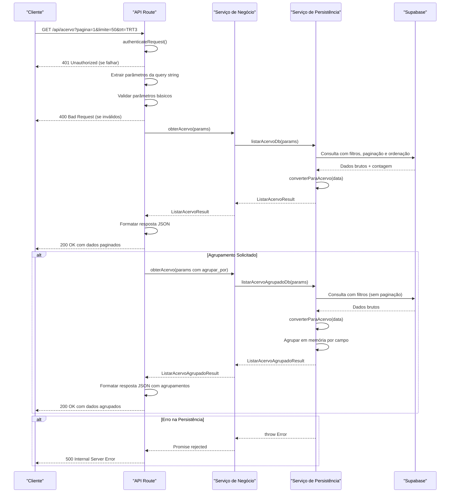

# Fluxo de Dados

<cite>
**Arquivos Referenciados neste Documento**   
- [app/api/acervo/route.ts](file://app/api/acervo/route.ts)
- [backend/acervo/services/listar-acervo.service.ts](file://backend/acervo/services/listar-acervo.service.ts)
- [backend/acervo/services/persistence/listar-acervo.service.ts](file://backend/acervo/services/persistence/listar-acervo.service.ts)
- [backend/types/acervo/types.ts](file://backend/types/acervo/types.ts)
</cite>

## Sumário
1. [Introdução](#introdução)
2. [Fluxo de Dados entre Camadas](#fluxo-de-dados-entre-camadas)
3. [Diagrama de Sequência](#diagrama-de-sequência)
4. [Exemplos Práticos de Implementação](#exemplos-práticos-de-implementação)
5. [Conclusão](#conclusão)

## Introdução

Este documento detalha o fluxo de dados entre as camadas da arquitetura backend do sistema Sinesys, com foco no processo de listagem do acervo jurídico. O fluxo descrito começa com uma requisição HTTP à API e termina com a resposta formatada retornada ao cliente, passando por várias camadas de processamento que incluem validação de parâmetros, aplicação de lógica de negócio e execução de consultas de persistência.

O sistema segue um padrão arquitetural bem definido que separa claramente as responsabilidades entre as camadas, garantindo manutenibilidade, testabilidade e escalabilidade. O fluxo específico analisado envolve a rota de API para listagem de acervo, que permite filtros avançados, paginação, ordenação e agrupamento de processos jurídicos.

## Fluxo de Dados entre Camadas

O fluxo de dados no sistema Sinesys segue uma arquitetura em camadas bem definida, onde cada camada tem responsabilidades específicas e comunica-se com as camadas adjacentes de forma estruturada. O caminho completo desde a requisição HTTP até a resposta final envolve três camadas principais: a camada de API, a camada de serviço de negócio e a camada de persistência.

### Camada de API: Recepção da Requisição

A camada de API, representada pelo arquivo `app/api/acervo/route.ts`, é o ponto de entrada para todas as requisições relacionadas ao acervo. Esta camada tem como responsabilidade principal receber a requisição HTTP, realizar a autenticação do cliente, extrair e validar os parâmetros da requisição, e encaminhar o processamento para a camada de serviço de negócio.

O processo começa com a função `GET` que recebe um objeto `NextRequest` contendo todos os dados da requisição HTTP. O primeiro passo é a autenticação do cliente através da função `authenticateRequest`, que verifica se o cliente está autorizado a acessar o recurso. Em caso de falha na autenticação, é retornada imediatamente uma resposta HTTP 401 (Não autorizado).

Após a autenticação bem-sucedida, a camada de API extrai todos os parâmetros da string de consulta (query string) da URL. Esses parâmetros incluem opções de paginação (página, limite), filtros (origem, TRT, grau, responsável), critérios de busca textual, filtros específicos por campo, filtros de data, ordenação e opções de agrupamento. Os parâmetros são convertidos para os tipos apropriados (por exemplo, strings para booleanos) e organizados em um objeto do tipo `ListarAcervoParams`.

Antes de encaminhar os parâmetros para a camada de negócio, são realizadas validações básicas, como verificar se o número da página é maior ou igual a 1 e se o limite está entre 1 e 100 itens. Em caso de parâmetros inválidos, é retornada uma resposta HTTP 400 (Requisição inválida).

**Section sources**
- [app/api/acervo/route.ts](file://app/api/acervo/route.ts#L312-L436)

### Camada de Serviço de Negócio: Aplicação da Lógica de Domínio

A camada de serviço de negócio, implementada no arquivo `backend/acervo/services/listar-acervo.service.ts`, é responsável por aplicar a lógica de domínio do sistema. Esta camada recebe os parâmetros validados da camada de API e decide como processá-los com base nos requisitos de negócio.

A função principal desta camada é `obterAcervo`, que recebe o objeto `ListarAcervoParams` e retorna uma promessa que resolve para um resultado de listagem. A lógica de decisão principal nesta camada é determinar se a requisição solicita um agrupamento de resultados. Isso é verificado através do parâmetro `agrupar_por` presente nos parâmetros da requisição.

Se o parâmetro `agrupar_por` está presente, a camada de negócio decide que o resultado deve ser agrupado por um campo específico (como TRT, grau, responsável, etc.) e invoca a função `listarAcervoAgrupadoDb` da camada de persistência. Caso contrário, utiliza a função `listarAcervoDb` para obter uma lista paginada de processos.

Esta camada atua como um orquestrador, tomando decisões de negócio com base nos parâmetros recebidos, mas delegando a execução das operações de dados para a camada de persistência. Isso permite que a lógica de negócio seja claramente separada da lógica de acesso a dados, facilitando testes e manutenção.

**Section sources**
- [backend/acervo/services/listar-acervo.service.ts](file://backend/acervo/services/listar-acervo.service.ts#L24-L34)

### Camada de Persistência: Execução de Consultas no Supabase

A camada de persistência, localizada em `backend/acervo/services/persistence/listar-acervo.service.ts`, é responsável por todas as operações de acesso a dados. Esta camada interage diretamente com o banco de dados Supabase para executar consultas, aplicar filtros, paginação e ordenação.

Esta camada contém duas funções principais: `listarAcervo` para listagem padrão e `listarAcervoAgrupado` para listagem com agrupamento. Ambas as funções utilizam o cliente de serviço do Supabase para construir e executar consultas.

Para a listagem padrão, a função `listarAcervo` constrói uma consulta que inclui todos os filtros especificados nos parâmetros (origem, TRT, grau, responsável, busca textual, filtros específicos por campo e filtros de data). A consulta é então ordenada conforme especificado e aplicada paginação usando os parâmetros de página e limite. A contagem exata de registros é obtida para permitir a paginação correta.

Para a listagem com agrupamento, a abordagem é diferente. Como o Supabase não suporta nativamente agrupamento com contagem e listagem de itens agrupados em uma única consulta, a função `listarAcervoAgrupado` primeiro busca todos os registros que correspondem aos filtros (sem paginação) e então realiza o agrupamento em memória. Os registros são agrupados por um campo específico (determinado pelo parâmetro `agrupar_por`) e, opcionalmente, a lista completa de processos por grupo é incluída na resposta, dependendo do parâmetro `incluir_contagem`.

Após a execução da consulta, os dados brutos do banco são transformados em objetos do tipo `Acervo` através da função `converterParaAcervo`, garantindo que a estrutura dos dados seja consistente com a definição de tipo esperada.

**Section sources**
- [backend/acervo/services/persistence/listar-acervo.service.ts](file://backend/acervo/services/persistence/listar-acervo.service.ts#L49-L184)
- [backend/acervo/services/persistence/listar-acervo.service.ts](file://backend/acervo/services/persistence/listar-acervo.service.ts#L190-L373)

### Caminho de Retorno: Tratamento de Erros e Formatação da Resposta

O caminho de retorno dos dados segue o caminho inverso ao da requisição, com cada camada adicionando sua camada de tratamento antes de passar os dados para a camada superior.

Na camada de persistência, qualquer erro durante a execução da consulta é capturado e transformado em um erro de aplicação com uma mensagem descritiva. Isso garante que erros de banco de dados sejam tratados de forma consistente e segura, sem expor detalhes internos do banco ao cliente.

Na camada de serviço de negócio, não há tratamento adicional de erros, pois a função simplesmente repassa a promessa retornada pela camada de persistência. Isso é intencional, pois a camada de negócio foca na lógica de domínio e delega o tratamento de erros de infraestrutura para as camadas apropriadas.

Na camada de API, ocorre o tratamento final de erros e a formatação da resposta. Qualquer erro não tratado nas camadas inferiores é capturado pelo bloco `try-catch` envolvendo todo o processamento. O erro é registrado no console para fins de depuração e uma resposta HTTP 500 (Erro interno do servidor) é retornada com uma mensagem de erro genérica para evitar a exposição de detalhes sensíveis.

A formatação da resposta depende do tipo de resultado retornado pela camada de negócio. Se o resultado contém a propriedade `agrupamentos`, indica que se trata de uma resposta com agrupamento e é formatada como um objeto com a propriedade `agrupamentos` e `total`. Caso contrário, é formatada como uma resposta padrão com a lista de processos e informações de paginação.

**Section sources**
- [app/api/acervo/route.ts](file://app/api/acervo/route.ts#L404-L425)
- [app/api/acervo/route.ts](file://app/api/acervo/route.ts#L426-L433)

## Diagrama de Sequência

O diagrama de sequência abaixo ilustra as chamadas entre as camadas do sistema Sinesys durante o processo de listagem do acervo, destacando os objetos transferidos e as transformações realizadas em cada etapa.



**Diagram sources**
- [app/api/acervo/route.ts](file://app/api/acervo/route.ts)
- [backend/acervo/services/listar-acervo.service.ts](file://backend/acervo/services/listar-acervo.service.ts)
- [backend/acervo/services/persistence/listar-acervo.service.ts](file://backend/acervo/services/persistence/listar-acervo.service.ts)

## Exemplos Práticos de Implementação

O padrão de fluxo de dados descrito neste documento é consistente e pode ser seguido para implementar novas rotas no sistema Sinesys. Abaixo estão exemplos práticos de como este padrão pode ser aplicado a novas funcionalidades.

### Exemplo 1: Nova Rota para Listagem de Audiências

Para criar uma nova rota de API para listagem de audiências, seguiria-se o mesmo padrão estabelecido:

1. Criar o arquivo de rota em `app/api/audiencias/route.ts` com a função `GET`
2. Implementar a autenticação usando `authenticateRequest`
3. Definir os parâmetros específicos para audiências em `backend/types/audiencias/types.ts`
4. Criar o serviço de negócio em `backend/audiencias/services/listar-audiencias.service.ts`
5. Implementar o serviço de persistência em `backend/audiencias/services/persistence/listar-audiencias.service.ts`

A estrutura da função de rota seria quase idêntica, diferindo apenas nos parâmetros específicos e no serviço chamado:

```typescript
export async function GET(request: NextRequest) {
  try {
    const authResult = await authenticateRequest(request);
    if (!authResult.authenticated) {
      return NextResponse.json({ error: 'Unauthorized' }, { status: 401 });
    }

    const { searchParams } = new URL(request.url);
    // Extrair e validar parâmetros específicos de audiências
    const params = extrairParametrosAudiencias(searchParams);

    // Chamar serviço de negócio
    const resultado = await obterAudiencias(params);

    // Formatar e retornar resposta
    return NextResponse.json({ success: true, data: resultado });
  } catch (error) {
    console.error('Erro ao listar audiências:', error);
    return NextResponse.json({ error: 'Erro interno do servidor' }, { status: 500 });
  }
}
```

### Exemplo 2: Rota com Validação de Negócio Adicional

Para rotas que exigem validação de negócio mais complexa, a camada de serviço pode incluir lógica adicional. Por exemplo, uma rota para atribuir responsável a um processo poderia verificar se o usuário tem permissão para atribuir responsáveis em determinados TRTs:

```typescript
export async function atribuirResponsavel(
  processoId: number, 
  responsavelId: number, 
  usuarioId: number
): Promise<ResultadoAtribuicao> {
  // Verificar se o usuário tem permissão para o TRT do processo
  const processo = await buscarAcervoPorId(processoId);
  if (!processo) {
    throw new Error('Processo não encontrado');
  }

  const usuario = await buscarUsuarioPorId(usuarioId);
  if (!usuario) {
    throw new Error('Usuário não encontrado');
  }

  // Verificar permissão baseada no TRT
  if (!usuario.trtsPermitidos.includes(processo.trt)) {
    throw new Error('Usuário não tem permissão para atribuir responsável neste TRT');
  }

  // Delegar para serviço de persistência
  return await atribuirResponsavelDb(processoId, responsavelId);
}
```

Este exemplo demonstra como a camada de serviço de negócio pode aplicar regras de domínio complexas antes de delegar para a camada de persistência, mantendo a separação de responsabilidades.

**Section sources**
- [app/api/acervo/route.ts](file://app/api/acervo/route.ts)
- [backend/acervo/services/listar-acervo.service.ts](file://backend/acervo/services/listar-acervo.service.ts)
- [backend/acervo/services/persistence/listar-acervo.service.ts](file://backend/acervo/services/persistence/listar-acervo.service.ts)

## Conclusão

O fluxo de dados entre as camadas da arquitetura backend do Sinesys demonstra um padrão bem definido e consistente que separa claramente as responsabilidades entre as camadas de API, serviço de negócio e persistência. Este padrão permite uma arquitetura limpa, modular e fácil de manter, onde cada camada tem um propósito específico e comunica-se com as camadas adjacentes de forma estruturada.

A camada de API atua como gateway, lidando com a comunicação HTTP, autenticação e validação de parâmetros. A camada de serviço de negócio aplica a lógica de domínio, tomando decisões com base nos requisitos de negócio. A camada de persistência gerencia todas as operações de dados, interagindo diretamente com o banco de dados e transformando os dados brutos em objetos de domínio.

Este padrão não apenas facilita a compreensão e manutenção do código, mas também permite a implementação consistente de novas funcionalidades seguindo o mesmo modelo. A documentação detalhada deste fluxo serve como um guia para desenvolvedores que precisam entender ou estender a funcionalidade do sistema, garantindo que novas implementações sigam as melhores práticas estabelecidas.