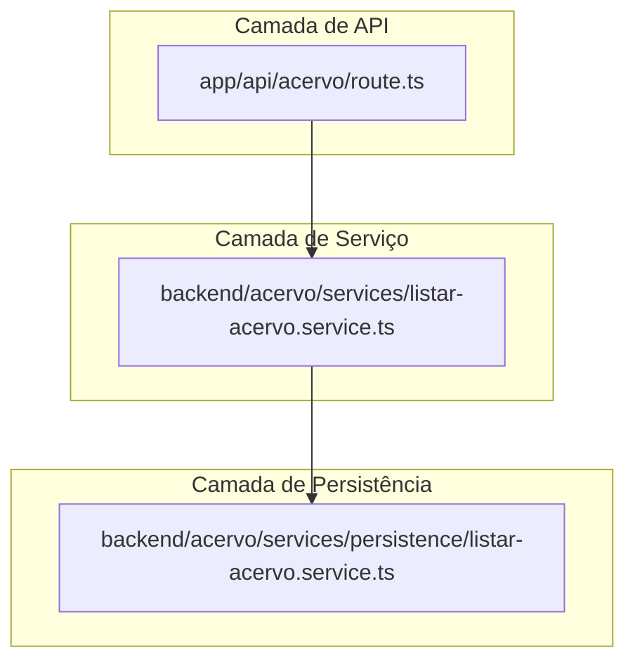
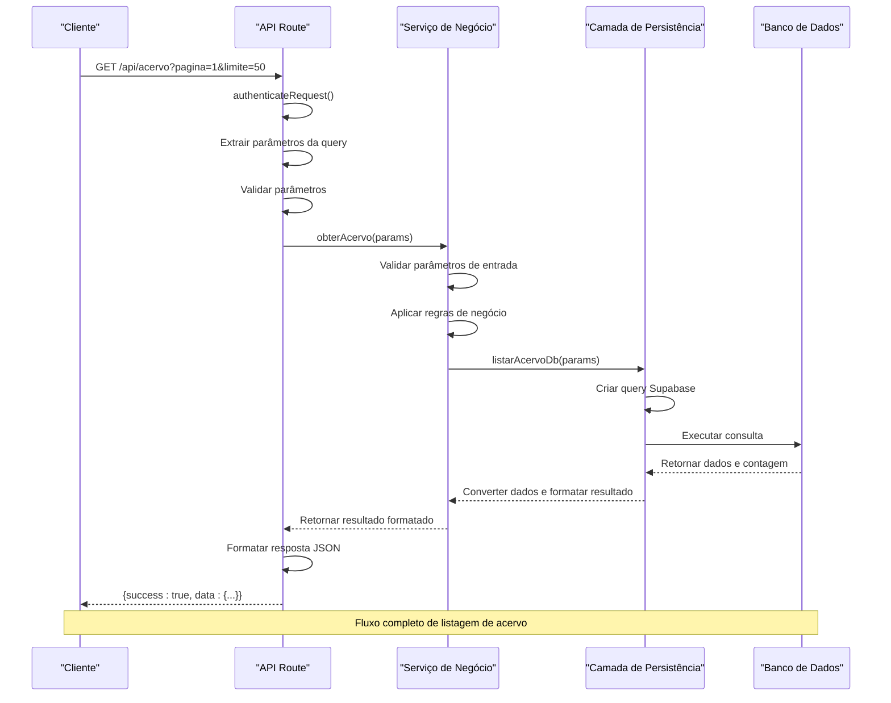

# Padrão de Camadas

<cite>
**Referenced Files in This Document**   
- [app/api/acervo/route.ts](file://app/api/acervo/route.ts)
- [backend/acervo/services/listar-acervo.service.ts](file://backend/acervo/services/listar-acervo.service.ts)
- [backend/acervo/services/persistence/listar-acervo.service.ts](file://backend/acervo/services/persistence/listar-acervo.service.ts)
- [backend/types/acervo/types.ts](file://backend/types/acervo/types.ts)
- [backend/utils/supabase/service-client.ts](file://backend/utils/supabase/service-client.ts)
- [backend/utils/auth/api-auth.ts](file://backend/utils/auth/api-auth.ts)
</cite>

## Table of Contents
1. [Introdução](#introdução)
2. [Arquitetura de Camadas](#arquitetura-de-camadas)
3. [Fluxo de Chamadas entre Camadas](#fluxo-de-chamadas-entre-camadas)
4. [Benefícios da Separação de Camadas](#benefícios-da-separação-de-camadas)
5. [Diretrizes para Criação de Novos Serviços e Rotas](#diretrizes-para-criação-de-novos-serviços-e-rotas)
6. [Tipagem Robusta com TypeScript](#tipagem-robusta-com-typescript)
7. [Práticas Recomendadas e Erros Comuns](#práticas-recomendadas-e-erros-comuns)
8. [Conclusão](#conclusão)

## Introdução

O sistema Sinesys implementa um padrão arquitetural de camadas bem definido que separa claramente as responsabilidades entre a interface de API, a lógica de negócio e a persistência de dados. Este documento detalha esse padrão, explicando como cada camada se comunica com as demais, os benefícios dessa separação e as diretrizes para manter a consistência arquitetural ao desenvolver novas funcionalidades. O padrão segue uma estrutura clássica de API → Serviço → Persistência, garantindo manutenibilidade, testabilidade e escalabilidade do sistema.

## Arquitetura de Camadas

A arquitetura do Sinesys é organizada em três camadas principais que seguem o princípio de separação de responsabilidades. Cada camada tem um propósito específico e comunica-se com a camada inferior de forma hierárquica, garantindo que a lógica de negócio permaneça isolada dos detalhes de implementação da API e do banco de dados.



**Diagram sources**
- [app/api/acervo/route.ts](file://app/api/acervo/route.ts)
- [backend/acervo/services/listar-acervo.service.ts](file://backend/acervo/services/listar-acervo.service.ts)
- [backend/acervo/services/persistence/listar-acervo.service.ts](file://backend/acervo/services/persistence/listar-acervo.service.ts)

**Section sources**
- [app/api/acervo/route.ts](file://app/api/acervo/route.ts)
- [backend/acervo/services/listar-acervo.service.ts](file://backend/acervo/services/listar-acervo.service.ts)
- [backend/acervo/services/persistence/listar-acervo.service.ts](file://backend/acervo/services/persistence/listar-acervo.service.ts)

### Camada de API

Localizada em `app/api/`, esta camada é responsável por receber requisições HTTP, validar a autenticação, processar parâmetros de entrada e formatar as respostas. As rotas de API são implementadas como handlers do Next.js App Router, seguindo o padrão RESTful com métodos HTTP apropriados (GET, POST, PUT, DELETE).

A camada de API utiliza o helper `authenticateRequest()` para verificar a autenticação do usuário, que suporta múltiplos métodos: Service API Key (para jobs do sistema), Bearer Token (JWT do Supabase) e Supabase Session (cookies). Após a autenticação bem-sucedida, a rota extrai os parâmetros da query string, valida-os e os passa para a camada de serviço.

### Camada de Serviço

Localizada em `backend/[feature]/services/[feature]/`, esta camada contém a lógica de negócio pura, sem dependências diretas do framework ou do banco de dados. Os serviços são responsáveis por aplicar regras de negócio, validar dados, coordenar operações complexas e decidir qual camada de persistência deve ser utilizada.

No exemplo do acervo, o serviço `listar-acervo.service.ts` implementa a lógica para listar processos com filtros, paginação, ordenação e agrupamento. Ele valida os parâmetros de entrada, aplica as regras de negócio (como o limite máximo de 100 itens por página) e decide se deve usar a função de listagem padrão ou agrupada com base no parâmetro `agrupar_por`.

### Camada de Persistência

Localizada em `backend/[feature]/services/persistence/`, esta camada é responsável exclusivamente pelo acesso ao banco de dados. Utiliza o cliente Supabase com secret key para operações administrativas, permitindo bypassar as políticas de segurança no nível de linha (RLS) quando necessário. A camada de persistência executa consultas diretas ao banco de dados, tratando os resultados e convertendo-os para os formatos esperados pelas camadas superiores.

A persistência utiliza o cliente `createServiceClient()` que é configurado com a service_role key, permitindo operações administrativas. As funções de persistência são focadas em operações de CRUD, aplicando filtros, paginação e ordenação diretamente na consulta ao banco de dados.

## Fluxo de Chamadas entre Camadas

O fluxo de chamadas entre as camadas segue uma sequência hierárquica bem definida, onde cada camada invoca a camada inferior para obter os dados necessários. O exemplo do endpoint `app/api/acervo/route.ts` ilustra perfeitamente esse fluxo, desde a requisição HTTP até a consulta no banco de dados.



**Diagram sources**
- [app/api/acervo/route.ts](file://app/api/acervo/route.ts#L312-L436)
- [backend/acervo/services/listar-acervo.service.ts](file://backend/acervo/services/listar-acervo.service.ts#L24-L34)
- [backend/acervo/services/persistence/listar-acervo.service.ts](file://backend/acervo/services/persistence/listar-acervo.service.ts#L49-L185)

**Section sources**
- [app/api/acervo/route.ts](file://app/api/acervo/route.ts#L312-L436)
- [backend/acervo/services/listar-acervo.service.ts](file://backend/acervo/services/listar-acervo.service.ts#L24-L34)
- [backend/acervo/services/persistence/listar-acervo.service.ts](file://backend/acervo/services/persistence/listar-acervo.service.ts#L49-L185)

### Detalhamento do Fluxo

1. **Requisição HTTP**: O cliente envia uma requisição GET para o endpoint `/api/acervo` com parâmetros de paginação e filtros.

2. **Autenticação**: A rota de API invoca `authenticateRequest()` para verificar se o usuário está autenticado, suportando múltiplos métodos de autenticação.

3. **Extração e Validação de Parâmetros**: A rota extrai os parâmetros da query string, converte-os para os tipos apropriados e valida se estão dentro dos limites aceitáveis (por exemplo, página >= 1, limite entre 1 e 100).

4. **Invocação do Serviço**: Com os parâmetros validados, a rota invoca a função `obterAcervo()` no serviço de negócio, passando os parâmetros como argumento.

5. **Lógica de Negócio**: O serviço valida novamente os parâmetros, aplica regras de negócio (como o limite máximo de 100 itens) e decide qual função de persistência deve ser chamada com base no parâmetro `agrupar_por`.

6. **Persistência de Dados**: A camada de persistência constrói a consulta ao banco de dados usando o cliente Supabase, aplicando todos os filtros, paginação e ordenação especificados nos parâmetros.

7. **Consulta ao Banco**: A consulta é executada no banco de dados PostgreSQL, retornando os dados solicitados e a contagem total de registros.

8. **Formatação de Resultado**: A camada de persistência converte os dados do banco para o formato esperado pela camada de serviço, incluindo informações de paginação.

9. **Retorno ao Serviço**: O resultado formatado é retornado ao serviço de negócio.

10. **Retorno à API**: O serviço retorna o resultado à rota de API.

11. **Formatação da Resposta**: A rota formata a resposta no padrão `{success: boolean, data?: T, error?: string}` e a envia de volta ao cliente.

## Benefícios da Separação de Camadas

A separação clara entre as camadas de API, serviço e persistência oferece diversos benefícios significativos para a manutenibilidade, testabilidade e escalabilidade do sistema Sinesys.

### Manutenibilidade

A separação de responsabilidades permite que mudanças em uma camada não afetem diretamente as outras camadas. Por exemplo, se for necessário alterar a tecnologia de banco de dados, apenas a camada de persistência precisará ser modificada, enquanto as camadas de serviço e API permanecerão inalteradas. Da mesma forma, mudanças na interface da API (como adicionar novos parâmetros ou alterar o formato da resposta) podem ser feitas sem afetar a lógica de negócio.

A estrutura modular também facilita a localização de código relacionado a uma funcionalidade específica. Todos os arquivos relacionados ao acervo estão organizados no diretório `backend/acervo/`, com subdiretórios claros para serviços e persistência, tornando mais fácil para os desenvolvedores entenderem e modificar a funcionalidade.

### Testabilidade

A separação de camadas permite testes mais eficazes e isolados. A camada de serviço pode ser testada independentemente da API e do banco de dados, utilizando mocks para a camada de persistência. Isso permite testar a lógica de negócio pura sem a necessidade de um banco de dados real ou de simular requisições HTTP completas.

Da mesma forma, a camada de persistência pode ser testada com um banco de dados de teste, verificando se as consultas estão corretas e retornam os dados esperados. A camada de API pode ser testada com ferramentas de teste de integração que simulam requisições HTTP e verificam as respostas.

### Escalabilidade

A arquitetura modular permite escalar componentes específicos do sistema de forma independente. Por exemplo, se a camada de persistência se tornar um gargalo, pode-se otimizar as consultas, adicionar índices no banco de dados ou implementar caching sem afetar as outras camadas.

Além disso, a separação clara facilita a implementação de padrões de design como o cache de resultados, onde a camada de serviço pode armazenar em cache resultados frequentemente acessados, reduzindo a carga na camada de persistência.

**Section sources**
- [openspec/project.md](file://openspec/project.md#L81-L111)
- [backend/captura/services/persistence/README.md](file://backend/captura/services/persistence/README.md#L88-L95)

## Diretrizes para Criação de Novos Serviços e Rotas

Para manter a consistência arquitetural ao criar novos serviços e rotas no sistema Sinesys, deve-se seguir as seguintes diretrizes:

### Estrutura de Diretórios

Novos serviços devem seguir a estrutura de diretórios estabelecida:
```
backend/[feature]/services/[feature]/        # Serviços de negócio
backend/[feature]/services/persistence/      # Camada de persistência
```

Por exemplo, para um novo recurso de "documentos", os arquivos seriam organizados como:
```
backend/documentos/services/documentos/
backend/documentos/services/persistence/
```

### Nomenclatura

- **Arquivos**: Utilizar kebab-case (ex: `listar-documentos.service.ts`)
- **Variáveis e funções**: Utilizar camelCase (ex: `obterDocumentos`)
- **Tipos e interfaces**: Utilizar PascalCase (ex: `Documento`, `ListarDocumentosParams`)
- **Constantes**: Utilizar UPPER_SNAKE_CASE ou camelCase conforme contexto

### Implementação de Rotas

As rotas de API devem seguir o padrão:
1. Autenticar a requisição usando `authenticateRequest()`
2. Extrair e validar parâmetros da query string ou corpo da requisição
3. Invocar o serviço de negócio apropriado
4. Formatar a resposta no padrão `{success: boolean, data?: T, error?: string}`
5. Tratar erros com try/catch e retornar mensagens de erro apropriadas

### Implementação de Serviços

Os serviços de negócio devem:
- Conter apenas lógica de negócio pura
- Validar parâmetros de entrada
- Aplicar regras de negócio específicas
- Invocar a camada de persistência para operações de dados
- Retornar dados formatados para a camada superior

### Implementação de Persistência

A camada de persistência deve:
- Utilizar `createServiceClient()` para acesso ao banco de dados
- Executar consultas diretas ao banco de dados
- Aplicar filtros, paginação e ordenação na consulta
- Converter dados do banco para os formatos esperados
- Tratar erros de banco de dados e convertê-los para erros de aplicação

**Section sources**
- [openspec/project.md](file://openspec/project.md#L81-L111)
- [app/api/acervo/route.ts](file://app/api/acervo/route.ts)
- [backend/acervo/services/listar-acervo.service.ts](file://backend/acervo/services/listar-acervo.service.ts)
- [backend/acervo/services/persistence/listar-acervo.service.ts](file://backend/acervo/services/persistence/listar-acervo.service.ts)

## Tipagem Robusta com TypeScript

O sistema Sinesys utiliza TypeScript de forma extensiva para garantir tipagem robusta em todas as camadas. As interfaces e tipos são definidos em `backend/types/` e importados pelos serviços e rotas, garantindo consistência de dados entre as camadas.

### Definição de Tipos

Os tipos são definidos em arquivos específicos por funcionalidade, como `backend/types/acervo/types.ts`, que define interfaces para o acervo, parâmetros de listagem e resultados. Essas interfaces são reutilizadas em todas as camadas, garantindo que os dados sejam consistentes desde a API até a persistência.

```typescript
// backend/types/acervo/types.ts
export interface Acervo {
  id: number;
  id_pje: number;
  advogado_id: number;
  origem: 'acervo_geral' | 'arquivado';
  trt: string;
  grau: 'primeiro_grau' | 'segundo_grau';
  numero_processo: string;
  // ... outros campos
}

export interface ListarAcervoParams {
  pagina?: number;
  limite?: number;
  origem?: 'acervo_geral' | 'arquivado';
  trt?: string;
  // ... outros parâmetros
}

export interface ListarAcervoResult {
  processos: Acervo[];
  total: number;
  pagina: number;
  limite: number;
  totalPaginas: number;
}
```

### Uso de Tipos nas Camadas

A camada de API importa os tipos diretamente dos arquivos de definição:

```typescript
// app/api/acervo/route.ts
import type { ListarAcervoParams } from '@/backend/types/acervo/types';
```

A camada de serviço utiliza os mesmos tipos para garantir consistência:

```typescript
// backend/acervo/services/listar-acervo.service.ts
import type { ListarAcervoParams, ListarAcervoResult } from '@/backend/types/acervo/types';
```

A camada de persistência também utiliza os mesmos tipos, garantindo que a interface entre as camadas seja consistente:

```typescript
// backend/acervo/services/persistence/listar-acervo.service.ts
import type { ListarAcervoParams, ListarAcervoResult } from '@/backend/types/acervo/types';
```

### Benefícios da Tipagem

A tipagem robusta oferece vários benefícios:
- **Detecção precoce de erros**: Erros de tipo são detectados em tempo de compilação
- **Autocompletar e documentação**: IDEs fornecem autocompletar e documentação baseada nos tipos
- **Refatoração segura**: Mudanças em interfaces são refletidas em todos os locais onde são usadas
- **Consistência de dados**: Garante que os dados sejam consistentes entre as camadas
- **Documentação integrada**: As interfaces servem como documentação viva do sistema

**Section sources**
- [backend/types/acervo/types.ts](file://backend/types/acervo/types.ts)
- [app/api/acervo/route.ts](file://app/api/acervo/route.ts#L7)
- [backend/acervo/services/listar-acervo.service.ts](file://backend/acervo/services/listar-acervo.service.ts#L8-L12)
- [backend/acervo/services/persistence/listar-acervo.service.ts](file://backend/acervo/services/persistence/listar-acervo.service.ts#L5-L11)

## Práticas Recomendadas e Erros Comuns

### Práticas Recomendadas

1. **Separação clara de responsabilidades**: Mantenha a lógica de negócio pura na camada de serviço, evitando misturar com lógica de API ou persistência.

2. **Validação em múltiplos níveis**: Valide parâmetros tanto na camada de API quanto na camada de serviço para garantir robustez.

3. **Uso consistente de tipos**: Sempre utilize as interfaces definidas em `backend/types/` para garantir consistência de dados.

4. **Documentação com JSDoc**: Documente todas as funções públicas com JSDoc, explicando seu propósito, parâmetros e retorno.

5. **Tratamento consistente de erros**: Utilize try/catch para capturar erros e retorne mensagens de erro padronizadas.

6. **Autenticação obrigatória**: Sempre utilize `authenticateRequest()` nas rotas de API para garantir que apenas usuários autenticados possam acessar os recursos.

### Erros Comuns

1. **Lógica de negócio na camada de API**: Evite colocar regras de negócio complexas na rota de API; mova para a camada de serviço.

2. **Consultas complexas na camada de serviço**: Evite construir consultas ao banco de dados na camada de serviço; delegue para a camada de persistência.

3. **Falta de validação**: Não assuma que os dados estão válidos; sempre valide parâmetros de entrada.

4. **Ignorar erros de banco de dados**: Sempre trate erros de banco de dados e converta para mensagens de erro apropriadas.

5. **Duplicação de tipos**: Evite definir interfaces similares em múltiplos arquivos; reutilize as definidas em `backend/types/`.

6. **Acesso direto ao banco de dados na API**: Nunca acesse diretamente o banco de dados na camada de API; sempre use a camada de serviço.

**Section sources**
- [openspec/project.md](file://openspec/project.md)
- [app/api/acervo/route.ts](file://app/api/acervo/route.ts)
- [backend/acervo/services/listar-acervo.service.ts](file://backend/acervo/services/listar-acervo.service.ts)
- [backend/acervo/services/persistence/listar-acervo.service.ts](file://backend/acervo/services/persistence/listar-acervo.service.ts)

## Conclusão

O padrão de camadas API → Serviço → Persistência implementado no sistema Sinesys é uma arquitetura robusta que promove a separação de responsabilidades, melhorando significativamente a manutenibilidade, testabilidade e escalabilidade do sistema. A comunicação clara entre as camadas, o uso consistente de TypeScript para tipagem robusta e as diretrizes bem definidas para criação de novos serviços garantem que o sistema permaneça organizado e sustentável à medida que cresce.

Ao seguir as práticas recomendadas e evitar os erros comuns, os desenvolvedores podem contribuir para o sistema de forma consistente, mantendo a qualidade do código e a integridade arquitetural. A estrutura modular permite que novas funcionalidades sejam adicionadas de forma incremental, com impacto mínimo nas partes existentes do sistema.