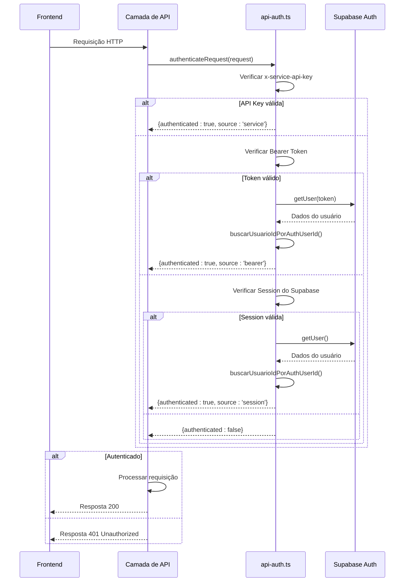
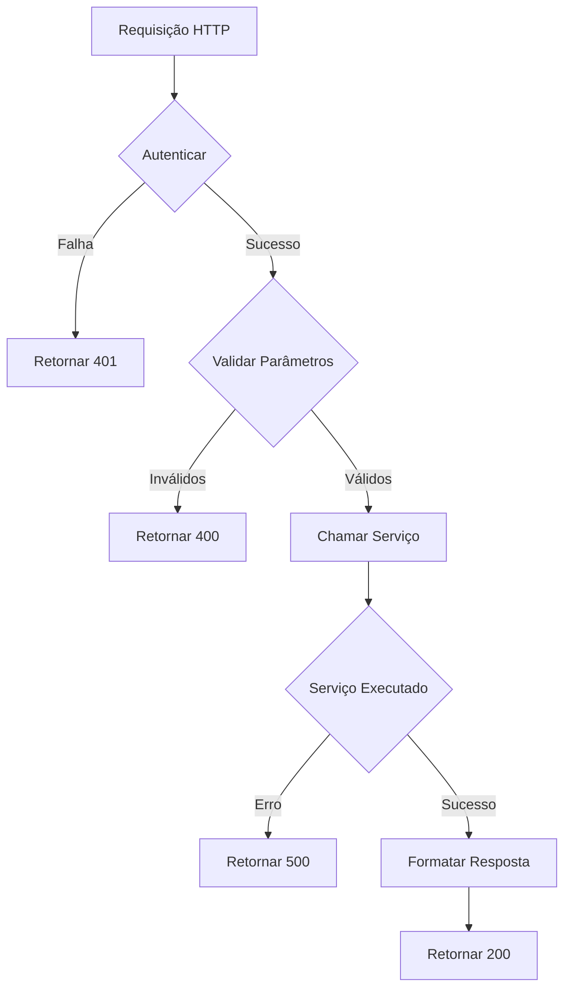

# Camada de API

<cite>
**Arquivos Referenciados neste Documento**   
- [app/api/acervo/route.ts](file://app/api/acervo/route.ts)
- [app/api/clientes/route.ts](file://app/api/clientes/route.ts)
- [app/api/contratos/route.ts](file://app/api/contratos/route.ts)
- [app/api/clientes/[id]/route.ts](file://app/api/clientes/[id]/route.ts)
- [app/api/contratos/[id]/route.ts](file://app/api/contratos/[id]/route.ts)
- [app/api/acervo/[id]/responsavel/route.ts](file://app/api/acervo/[id]/responsavel/route.ts)
- [app/api/pendentes-manifestacao/[id]/responsavel/route.ts](file://app/api/pendentes-manifestacao/[id]/responsavel/route.ts)
- [app/api/usuarios/buscar/por-cpf/[cpf]/route.ts](file://app/api/usuarios/buscar/por-cpf/[cpf]/route.ts)
- [backend/utils/auth/api-auth.ts](file://backend/utils/auth/api-auth.ts)
- [swagger.config.ts](file://swagger.config.ts)
</cite>

## Sumário
1. [Introdução](#introdução)
2. [Estrutura da Camada de API](#estrutura-da-camada-de-api)
3. [Autenticação e Segurança](#autenticação-e-segurança)
4. [Validação de Parâmetros e Tratamento de Erros](#validação-de-parâmetros-e-tratamento-de-erros)
5. [Padrão de Respostas](#padrão-de-respostas)
6. [Integração com Camada de Serviço](#integração-com-camada-de-serviço)
7. [Exemplos Práticos de Implementação](#exemplos-práticos-de-implementação)
8. [Boas Práticas e Considerações de Segurança](#boas-práticas-e-considerações-de-segurança)

## Introdução

A camada de API no sistema Sinesys atua como a interface principal entre o frontend e o backend, sendo responsável por receber requisições HTTP, processá-las de forma segura e retornar respostas padronizadas. Implementada utilizando rotas do Next.js em `app/api/`, esta camada segue princípios de separação de preocupações, garantindo que a lógica de negócio permaneça isolada nas camadas de serviço. O design da API é orientado por boas práticas de desenvolvimento web, com ênfase em segurança, consistência e manutenibilidade.

**Seção fontes**
- [app/api/acervo/route.ts](file://app/api/acervo/route.ts#L1-L436)
- [app/api/clientes/route.ts](file://app/api/clientes/route.ts#L1-L252)
- [app/api/contratos/route.ts](file://app/api/contratos/route.ts#L1-L187)

## Estrutura da Camada de API

A estrutura da camada de API reflete a organização modular do sistema, com diretórios específicos para cada entidade principal como `acervo`, `clientes`, `contratos`, entre outros. Cada rota implementa os métodos HTTP apropriados (GET, POST, PATCH, etc.) para operações CRUD, utilizando o sistema de rotas do Next.js baseado em arquivos. A estrutura de diretórios com parâmetros dinâmicos (ex: `[id]`) permite a criação de endpoints RESTful de forma intuitiva e escalável.

A camada de API é projetada para ser stateless, com cada requisição contendo todas as informações necessárias para sua execução. Os handlers de rota são responsáveis por coordenar o fluxo de dados entre o frontend e as camadas inferiores, mas não contêm lógica de negócio complexa, mantendo-se focados na orquestração de operações.

```mermaid
graph TB
Frontend[Frontend] --> API[Camada de API]
API --> Service[Camada de Serviço]
Service --> Persistence[Camada de Persistência]
Service --> External[APIs Externas]
subgraph "Camada de API"
A1[GET /api/clientes]
A2[POST /api/clientes]
A3[GET /api/clientes/{id}]
A4[PATCH /api/clientes/{id}]
end
subgraph "Camada de Serviço"
S1[ClientesService]
S2[ContratosService]
S3[AcervoService]
end
A1 --> S1
A2 --> S1
A3 --> S1
A4 --> S1
```

**Fontes do diagrama**
- [app/api/clientes/route.ts](file://app/api/clientes/route.ts#L1-L252)
- [app/api/contratos/route.ts](file://app/api/contratos/route.ts#L1-L187)
- [app/api/acervo/route.ts](file://app/api/acervo/route.ts#L1-L436)

**Seção fontes**
- [app/api/clientes/route.ts](file://app/api/clientes/route.ts#L1-L252)
- [app/api/contratos/route.ts](file://app/api/contratos/route.ts#L1-L187)

## Autenticação e Segurança

O sistema implementa um mecanismo robusto de autenticação com múltiplos métodos suportados, conforme definido no utilitário `authenticateRequest` localizado em `backend/utils/auth/api-auth.ts`. A camada de API valida todas as requisições antes de processá-las, garantindo que apenas clientes autorizados possam acessar os recursos.

Três métodos de autenticação são suportados em ordem de prioridade:
1. **Service API Key**: Utilizada por jobs do sistema e processos automatizados, verificada através do header `x-service-api-key`.
2. **Bearer Token**: Utilizada pelo frontend e APIs externas, extraída do header `Authorization`.
3. **Session do Supabase**: Utilizada pelo frontend tradicional, baseada em cookies.

A autenticação é implementada de forma consistente em todas as rotas, com o resultado contendo informações sobre o usuário autenticado, incluindo o ID do Supabase (`userId`) e o ID correspondente na tabela `usuarios` (`usuarioId`).



**Fontes do diagrama**
- [backend/utils/auth/api-auth.ts](file://backend/utils/auth/api-auth.ts#L1-L136)
- [swagger.config.ts](file://swagger.config.ts#L1-L212)

**Seção fontes**
- [backend/utils/auth/api-auth.ts](file://backend/utils/auth/api-auth.ts#L1-L136)
- [swagger.config.ts](file://swagger.config.ts#L27-L43)

## Validação de Parâmetros e Tratamento de Erros

A camada de API implementa uma estratégia abrangente de validação de parâmetros e tratamento de erros consistentes. Embora o código analisado não utilize explicitamente Zod para validação, a estrutura está preparada para integração com bibliotecas de validação, e a validação básica é realizada diretamente nos handlers de rota.

Para requisições GET, os parâmetros de query são validados e convertidos para os tipos apropriados (ex: números, booleanos). Para requisições POST e PATCH, o corpo da requisição é validado para garantir que campos obrigatórios estejam presentes. A validação inclui verificações de tipo, formato e valores permitidos, com mensagens de erro descritivas retornadas ao cliente.

O tratamento de erros é padronizado em toda a camada de API, com blocos try-catch envolvendo toda a lógica de processamento. Os erros são registrados no console para fins de depuração e uma resposta de erro padronizada é retornada ao cliente com o status HTTP apropriado. Os principais códigos de status utilizados incluem:
- 400 Bad Request: Parâmetros inválidos ou corpo da requisição malformado
- 401 Unauthorized: Falha na autenticação
- 404 Not Found: Recurso não encontrado
- 500 Internal Server Error: Erro interno do servidor

**Seção fontes**
- [app/api/clientes/route.ts](file://app/api/clientes/route.ts#L164-L252)
- [app/api/contratos/route.ts](file://app/api/contratos/route.ts#L138-L187)
- [app/api/acervo/route.ts](file://app/api/acervo/route.ts#L312-L436)

## Padrão de Respostas

A camada de API utiliza um padrão de resposta consistente em todo o sistema, facilitando o consumo pelos clientes frontend. As respostas seguem um formato JSON padronizado com as seguintes propriedades principais:

- `success`: Booleano indicando se a operação foi bem-sucedida
- `data`: Objeto contendo os dados da resposta (quando aplicável)
- `error`: Mensagem de erro (quando aplicável)

Este padrão é implementado em todos os handlers de rota, garantindo consistência na interface. Para operações de listagem, a resposta inclui paginação com informações sobre o número da página, limite, total de registros e número total de páginas. A documentação OpenAPI (Swagger) é gerada automaticamente a partir das anotações JSDoc nos arquivos de rota, fornecendo uma especificação completa da API em `api/docs/openapi.json`.

**Seção fontes**
- [app/api/clientes/route.ts](file://app/api/clientes/route.ts#L188-L191)
- [app/api/contratos/route.ts](file://app/api/contratos/route.ts#L124-L127)
- [app/api/acervo/route.ts](file://app/api/acervo/route.ts#L407-L425)

## Integração com Camada de Serviço

A camada de API atua como um adaptador entre o protocolo HTTP e a camada de serviço, que contém a lógica de negócio real. Os handlers de rota são responsáveis por:
1. Autenticar a requisição
2. Validar parâmetros e corpo da requisição
3. Chamar o serviço apropriado com os dados processados
4. Tratar o resultado do serviço
5. Formatar e retornar a resposta HTTP

Esta separação de responsabilidades garante que a camada de API permaneça leve e focada na orquestração, enquanto a lógica de negócio complexa é encapsulada nos serviços. Por exemplo, ao criar um novo cliente, a rota `/api/clientes` chama o serviço `cadastrarCliente` após validar os dados de entrada, e ao atualizar um contrato, a rota `/api/contratos/{id}` chama o serviço `atualizarContrato` com os dados de atualização.

Essa arquitetura promove a reutilização de código, testabilidade e manutenibilidade, permitindo que os serviços sejam utilizados por diferentes interfaces (API REST, CLI, jobs agendados) sem duplicação de lógica.



**Fontes do diagrama**
- [app/api/clientes/route.ts](file://app/api/clientes/route.ts#L164-L252)
- [app/api/contratos/route.ts](file://app/api/contratos/route.ts#L102-L187)

**Seção fontes**
- [app/api/clientes/route.ts](file://app/api/clientes/route.ts#L5-L7)
- [app/api/contratos/route.ts](file://app/api/contratos/route.ts#L5-L7)

## Exemplos Práticos de Implementação

### Módulo Acervo

A rota `/api/acervo` implementa uma listagem avançada de processos com filtros múltiplos, paginação, ordenação e agrupamento. Os parâmetros de query são mapeados para um objeto `ListarAcervoParams` que é passado para o serviço `obterAcervo`. A rota suporta filtros por origem, TRT, grau, responsável, além de filtros de data e busca textual. O recurso de agrupamento permite retornar dados agregados por campo específico, útil para visualizações estatísticas.

### Módulo Clientes

As rotas em `/api/clientes` demonstram operações CRUD completas. A rota raiz (`/api/clientes`) suporta GET para listagem com paginação e filtros, e POST para criação de novos clientes. A rota dinâmica (`/api/clientes/{id}`) suporta GET para busca por ID e PATCH para atualização parcial. A validação inclui verificação de campos obrigatórios e conversão de tipos, com tratamento adequado de erros 400 e 404.

### Módulo Contratos

Semelhante ao módulo clientes, as rotas em `/api/contratos` implementam operações CRUD para contratos. Um exemplo interessante é a rota aninhada `/api/contratos/{id}/processos` que gerencia a associação de processos a contratos, demonstrando a capacidade do sistema de lidar com relacionamentos complexos entre entidades.

### Operações de Atribuição

Rotas como `/api/acervo/{id}/responsavel` e `/api/pendentes-manifestacao/{id}/responsavel` implementam operações específicas de atribuição de responsáveis, demonstrando como a API pode expor funcionalidades de domínio específicas. Essas rotas utilizam o método PATCH para atualizar apenas o campo `responsavel_id`, com validação adicional para garantir que o ID do responsável seja um número inteiro positivo ou nulo.

**Seção fontes**
- [app/api/acervo/route.ts](file://app/api/acervo/route.ts#L312-L436)
- [app/api/clientes/route.ts](file://app/api/clientes/route.ts#L164-L252)
- [app/api/clientes/[id]/route.ts](file://app/api/clientes/[id]/route.ts#L110-L218)
- [app/api/contratos/[id]/route.ts](file://app/api/contratos/[id]/route.ts#L73-L150)
- [app/api/acervo/[id]/responsavel/route.ts](file://app/api/acervo/[id]/responsavel/route.ts#L83-L158)
- [app/api/pendentes-manifestacao/[id]/responsavel/route.ts](file://app/api/pendentes-manifestacao/[id]/responsavel/route.ts#L83-L191)

## Boas Práticas e Considerações de Segurança

A camada de API do Sinesys demonstra várias boas práticas de desenvolvimento de APIs:

1. **Separação de Responsabilidades**: A lógica de negócio é mantida na camada de serviço, enquanto a API foca na orquestração.
2. **Autenticação Múltipla**: Suporte a diferentes métodos de autenticação para diferentes tipos de clientes.
3. **Validação Abrangente**: Validação de entrada em todos os pontos de entrada da API.
4. **Tratamento de Erros Consistente**: Padrão uniforme para respostas de erro em todo o sistema.
5. **Documentação Automatizada**: Uso de Swagger/OpenAPI para documentação viva da API.
6. **Segurança contra Injeção**: Uso de consultas parametrizadas no nível do serviço, embora não diretamente visível na camada de API.

Considerações de segurança importantes incluem a validação rigorosa de IDs de parâmetros de rota para evitar ataques de injeção, a verificação de autenticação em todas as rotas, e o uso de comparação segura (timing-safe) para validação de API keys. A arquitetura também prevê a auditoria de alterações através de triggers no banco de dados, registrando todas as modificações em `logs_alteracao`.

**Seção fontes**
- [backend/utils/auth/api-auth.ts](file://backend/utils/auth/api-auth.ts#L58-L65)
- [app/api/acervo/[id]/responsavel/route.ts](file://app/api/acervo/[id]/responsavel/route.ts#L113-L119)
- [app/api/pendentes-manifestacao/[id]/responsavel/route.ts](file://app/api/pendentes-manifestacao/[id]/responsavel/route.ts#L113-L119)
- [swagger.config.ts](file://swagger.config.ts#L1-L212)