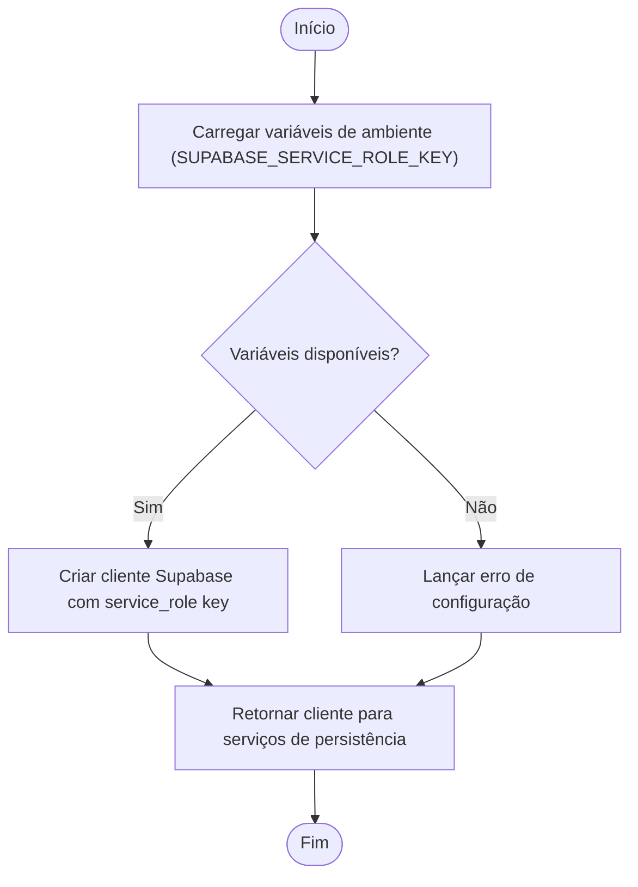
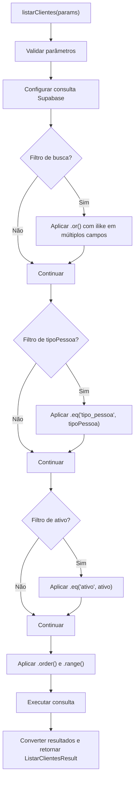

# Camada de Persistência

<cite>
**Arquivos Referenciados neste Documento**   
- [service-client.ts](file://backend/utils/supabase/service-client.ts)
- [cliente-persistence.service.ts](file://backend/clientes/services/persistence/cliente-persistence.service.ts)
- [contrato-persistence.service.ts](file://backend/contratos/services/persistence/contrato-persistence.service.ts)
- [contrato-processo-persistence.service.ts](file://backend/contratos/services/persistence/contrato-processo-persistence.service.ts)
- [parte-contraria-persistence.service.ts](file://backend/partes-contrarias/services/persistence/parte-contraria-persistence.service.ts)
- [usuario-persistence.service.ts](file://backend/usuarios/services/persistence/usuario-persistence.service.ts)
</cite>

## Sumário
1. [Introdução](#introdução)
2. [Arquitetura da Camada de Persistência](#arquitetura-da-camada-de-persistência)
3. [Cliente Supabase de Serviço](#cliente-supabase-de-serviço)
4. [Operações CRUD e Estrutura de Dados](#operações-crud-e-estrutura-de-dados)
5. [Filtros e Paginação](#filtros-e-paginação)
6. [Políticas de Segurança (RLS)](#políticas-de-segurança-rls)
7. [Transações e Otimizações de Desempenho](#transações-e-otimizações-de-desempenho)
8. [Práticas Recomendadas](#práticas-recomendadas)
9. [Integração com a Camada de Serviço](#integração-com-a-camada-de-serviço)
10. [Auditoria e Funções RPC](#auditoria-e-funções-rpc)

## Introdução

A camada de persistência no sistema Sinesys é responsável por gerenciar todas as interações diretas com o banco de dados Supabase. Localizada em `backend/[módulo]/services/persistence/`, esta camada encapsula operações de CRUD, consultas complexas, paginação, validações e integridade referencial, garantindo que a lógica de negócio permaneça isolada das operações de banco de dados. Ela utiliza um cliente Supabase configurado com chave de serviço, permitindo operações administrativas e contornando as políticas de segurança por linha (RLS) quando necessário, especialmente em tarefas agendadas ou processos internos.

Essa documentação detalha a arquitetura, funcionamento e melhores práticas da camada de persistência, destacando sua importância na manutenção da separação de preocupações e na segurança do sistema.

**Seção fontes**
- [service-client.ts](file://backend/utils/supabase/service-client.ts)

## Arquitetura da Camada de Persistência

A camada de persistência é organizada por módulos (clientes, contratos, partes contrárias, usuários, etc.), cada um com seu próprio serviço de persistência. Esses serviços são responsáveis por todas as operações de leitura e escrita em suas respectivas tabelas no Supabase. A arquitetura segue um padrão de repositório, onde cada função de persistência é especializada em uma operação específica (criar, atualizar, buscar, listar).

A comunicação entre a camada de serviço (business logic) e a camada de persistência é unidirecional: a camada de serviço chama os métodos da camada de persistência, mas nunca o contrário. Isso garante que a lógica de negócio possa aplicar validações, regras de negócio e coordenar múltiplas operações de persistência sem expor diretamente as operações de banco de dados à API.

```mermaid
graph TD
A[API Routes] --> B[Camada de Serviço]
B --> C[Camada de Persistência]
C --> D[Supabase Database]
C --> E[Supabase Client (service-role)]
```

**Fontes do diagrama**
- [cliente-persistence.service.ts](file://backend/clientes/services/persistence/cliente-persistence.service.ts)
- [contrato-persistence.service.ts](file://backend/contratos/services/persistence/contrato-persistence.service.ts)
- [service-client.ts](file://backend/utils/supabase/service-client.ts)

## Cliente Supabase de Serviço

O cliente Supabase utilizado na camada de persistência é criado pela função `createServiceClient()` definida em `service-client.ts`. Este cliente utiliza a chave `service_role` (ou `secret_key`) do Supabase, que possui permissões elevadas e pode contornar as políticas de segurança por linha (RLS). Isso é essencial para operações realizadas por tarefas agendadas (scheduled jobs) ou processos internos do sistema que não estão associados a um usuário autenticado específico.

É crucial destacar que este cliente **nunca deve ser usado no frontend ou em rotas acessíveis diretamente por usuários**, pois isso representaria um risco de segurança grave. Ele é estritamente reservado para o backend, onde o contexto de execução é controlado e seguro.



**Fontes do diagrama**
- [service-client.ts](file://backend/utils/supabase/service-client.ts)

**Seção fontes**
- [service-client.ts](file://backend/utils/supabase/service-client.ts)

## Operações CRUD e Estrutura de Dados

Cada serviço de persistência implementa operações CRUD completas (Criar, Ler, Atualizar, Deletar) para sua entidade correspondente. As operações são tipadas com interfaces TypeScript que definem claramente a estrutura dos dados de entrada e saída.

Por exemplo, o serviço `cliente-persistence.service.ts` define interfaces como `ClienteDados` para entrada e `Cliente` para saída, garantindo consistência e validação de tipo. Antes de qualquer operação de escrita, os dados são validados (CPF, CNPJ, e-mail, campos obrigatórios) e normalizados (remoção de formatação, trim de espaços).

As operações de leitura, como `buscarClientePorId` ou `listarClientes`, retornam dados já convertidos para a interface de domínio, abstraindo a camada de serviço dos detalhes da estrutura da tabela (por exemplo, conversão de `tipo_pessoa` para `tipoPessoa`).

**Seção fontes**
- [cliente-persistence.service.ts](file://backend/clientes/services/persistence/cliente-persistence.service.ts)
- [contrato-persistence.service.ts](file://backend/contratos/services/persistence/contrato-persistence.service.ts)
- [parte-contraria-persistence.service.ts](file://backend/partes-contrarias/services/persistence/parte-contraria-persistence.service.ts)
- [usuario-persistence.service.ts](file://backend/usuarios/services/persistence/usuario-persistence.service.ts)

## Filtros e Paginação

A camada de persistência fornece suporte robusto para consultas com filtros e paginação. A função `listarClientes`, por exemplo, aceita parâmetros como `busca`, `tipoPessoa` e `ativo`, que são aplicados dinamicamente à consulta Supabase usando métodos como `.or()`, `.eq()` e `.ilike()`.

A paginação é implementada usando os métodos `.range()` do Supabase, com base nos parâmetros `pagina` e `limite`. O total de registros é obtido com a opção `{ count: 'exact' }`, permitindo o cálculo do número total de páginas. O resultado é encapsulado em uma interface como `ListarClientesResult`, que inclui os dados paginados, o total e os metadados de paginação.



**Fontes do diagrama**
- [cliente-persistence.service.ts](file://backend/clientes/services/persistence/cliente-persistence.service.ts)

**Seção fontes**
- [cliente-persistence.service.ts](file://backend/clientes/services/persistence/cliente-persistence.service.ts)
- [contrato-persistence.service.ts](file://backend/contratos/services/persistence/contrato-persistence.service.ts)

## Políticas de Segurança (RLS)

Embora o cliente de serviço possa contornar as políticas de segurança por linha (RLS), a camada de persistência é projetada para operar em um contexto seguro. As RLS são definidas no Supabase para garantir que, quando o banco de dados é acessado por usuários autenticados (via frontend), apenas os dados que eles têm permissão para ver sejam acessados.

A camada de persistência, ao usar o cliente de serviço, opera com privilégios administrativos. No entanto, ela ainda valida a integridade dos dados (por exemplo, verificar se um `clienteId` fornecido em um contrato existe) antes de executar operações. Isso garante que a consistência dos dados seja mantida, mesmo quando as RLS são contornadas.

**Seção fontes**
- [contrato-persistence.service.ts](file://backend/contratos/services/persistence/contrato-persistence.service.ts#L224-L233)
- [parte-contraria-persistence.service.ts](file://backend/partes-contrarias/services/persistence/parte-contraria-persistence.service.ts#L235-L246)

## Transações e Otimizações de Desempenho

Para operações que envolvem múltiplas tabelas, como associar um processo a um contrato, a camada de persistência garante a atomicidade. A função `adicionarProcessoAoContrato` em `contrato-processo-persistence.service.ts` valida a existência do contrato e do processo antes de inserir o relacionamento na tabela `contrato_processos`. Se qualquer validação falhar, a operação é abortada, evitando dados órfãos.

Em termos de desempenho, as consultas são otimizadas com o uso de índices no banco de dados (implícitos nas chaves primárias e estrangeiras) e com a seleção apenas dos campos necessários (usando `.select('*')` apenas quando necessário). A paginação evita o carregamento de grandes volumes de dados na memória.

**Seção fontes**
- [contrato-processo-persistence.service.ts](file://backend/contratos/services/persistence/contrato-processo-persistence.service.ts)

## Práticas Recomendadas

1. **Nunca exponha diretamente**: A camada de persistência não deve ser chamada diretamente por rotas API. Sempre use a camada de serviço como intermediária.
2. **Validação rigorosa**: Sempre valide e normalize os dados de entrada antes de interagir com o banco de dados.
3. **Tipagem forte**: Use interfaces TypeScript para garantir a consistência dos dados entre camadas.
4. **Tratamento de erros**: Forneça mensagens de erro claras e trate exceções para evitar vazamento de informações sensíveis.
5. **Paginação obrigatória**: Para listagens, sempre implemente paginação para evitar sobrecarga do banco de dados.

## Integração com a Camada de Serviço

A camada de serviço (por exemplo, `criar-cliente.service.ts`) é responsável por orquestrar as operações. Ela pode chamar múltiplos serviços de persistência, aplicar regras de negócio complexas e coordenar transações lógicas. A separação clara entre as camadas permite que a lógica de negócio evolua independentemente das operações de banco de dados.

Por exemplo, ao criar um novo cliente, a camada de serviço pode primeiro validar regras de negócio (como limites de crédito) antes de chamar `criarCliente` na camada de persistência. Esta última se concentra apenas em garantir que os dados sejam inseridos corretamente no banco de dados.

**Seção fontes**
- [cliente-persistence.service.ts](file://backend/clientes/services/persistence/cliente-persistence.service.ts)
- [contrato-persistence.service.ts](file://backend/contratos/services/persistence/contrato-persistence.service.ts)

## Auditoria e Funções RPC

O banco de dados Supabase inclui um sistema de auditoria para rastrear alterações em registros importantes. Triggers no banco de dados (definidos em `supabase/migrations/`) registram alterações na tabela `logs_alteracao`, capturando quem fez a alteração, quando e quais dados foram modificados (armazenados em `dados_anteriores`).

Além disso, funções RPC (Remote Procedure Call) são definidas no banco de dados (por exemplo, `atribuir_responsavel`) para encapsular lógica complexa que deve ser executada no servidor de banco de dados. Essas funções podem ser chamadas diretamente pela camada de persistência usando o cliente Supabase, garantindo consistência e desempenho.

**Seção fontes**
- [supabase/migrations/20251117015304_create_logs_alteracao.sql](file://supabase/migrations/20251117015304_create_logs_alteracao.sql)
- [supabase/migrations/20251117020000_create_rpc_functions_atribuir_responsavel.sql](file://supabase/migrations/20251117020000_create_rpc_functions_atribuir_responsavel.sql)