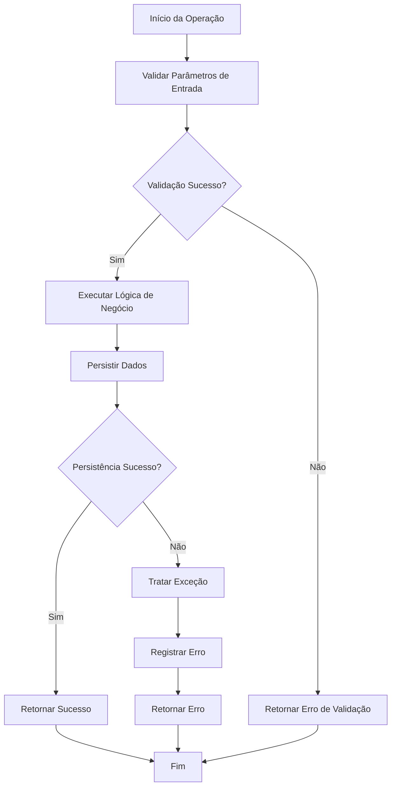
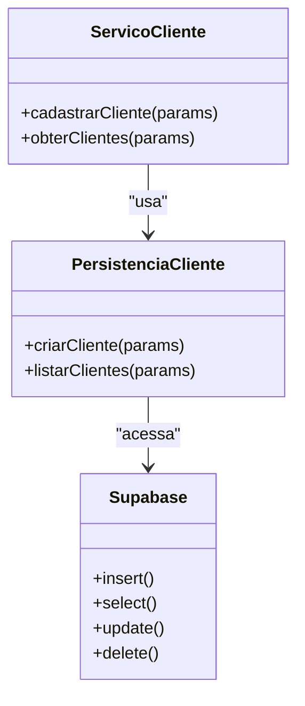

# Camada de Serviço

<cite>
**Arquivos Referenciados neste Documento**   
- [backend/acervo/services/listar-acervo.service.ts](file://backend/acervo/services/listar-acervo.service.ts)
- [backend/acervo/services/persistence/listar-acervo.service.ts](file://backend/acervo/services/persistence/listar-acervo.service.ts)
- [backend/clientes/services/clientes/criar-cliente.service.ts](file://backend/clientes/services/clientes/criar-cliente.service.ts)
- [backend/clientes/services/persistence/cliente-persistence.service.ts](file://backend/clientes/services/persistence/cliente-persistence.service.ts)
- [backend/contratos/services/contratos/atualizar-contrato.service.ts](file://backend/contratos/services/contratos/atualizar-contrato.service.ts)
- [backend/contratos/services/persistence/contrato-persistence.service.ts](file://backend/contratos/services/persistence/contrato-persistence.service.ts)
- [backend/captura/services/persistence/acervo-persistence.service.ts](file://backend/captura/services/persistence/acervo-persistence.service.ts)
- [backend/captura/services/persistence/capture-log.service.ts](file://backend/captura/services/persistence/capture-log.service.ts)
- [backend/usuarios/services/usuarios/listar-usuarios.service.ts](file://backend/usuarios/services/usuarios/listar-usuarios.service.ts)
- [backend/usuarios/services/persistence/usuario-persistence.service.ts](file://backend/usuarios/services/persistence/usuario-persistence.service.ts)
- [openspec/project.md](file://openspec/project.md)
</cite>

## Sumário
1. [Introdução](#introdução)
2. [Estrutura e Padrão de Nomenclatura](#estrutura-e-padrão-de-nomenclatura)
3. [Implementação da Lógica de Negócio](#implementação-da-lógica-de-negócio)
4. [Validação de Parâmetros e Tratamento de Exceções](#validação-de-parâmetros-e-tratamento-de-exceções)
5. [Coordenação entre Serviços e Transações](#coordenação-entre-serviços-e-transações)
6. [Integração com a Camada de Persistência](#integração-com-a-camada-de-persistência)
7. [Separação de Responsabilidades](#separação-de-responsabilidades)
8. [Orientações para Testes Unitários e Mocks](#orientações-para-testes-unitários-e-mocks)
9. [Conclusão](#conclusão)

## Introdução
A camada de serviço no sistema Sinesys é responsável pela implementação da lógica de negócio central, atuando como intermediária entre a camada de API e a camada de persistência. Esta camada encapsula regras de domínio, coordena operações entre múltiplos serviços, valida parâmetros antes da persistência e garante que a lógica de negócio permaneça isolada de detalhes de infraestrutura. O objetivo deste documento é fornecer uma análise abrangente dessa camada, destacando sua estrutura, padrões de implementação e boas práticas.

## Estrutura e Padrão de Nomenclatura
A estrutura de diretórios da camada de serviço segue um padrão modular por funcionalidade, com cada módulo contendo subdiretórios para serviços específicos e de persistência. Os arquivos de serviço são nomeados utilizando kebab-case, como `listar-acervo.service.ts`, `criar-cliente.service.ts` e `atualizar-contrato.service.ts`. Dentro de cada módulo, os serviços são organizados em subdiretórios como `clientes`, `contratos`, `acervo`, entre outros, refletindo as entidades do domínio. A camada de persistência é separada em um subdiretório `persistence`, garantindo clareza na separação de responsabilidades.

**Section sources**
- [openspec/project.md](file://openspec/project.md#L43-L80)

## Implementação da Lógica de Negócio
A camada de serviço implementa a lógica de negócio central através de funções assíncronas que coordenam operações complexas. Por exemplo, o serviço `cadastrarCliente` no módulo de clientes valida os dados de entrada, verifica duplicidades de CPF/CNPJ, cria o registro no banco de dados e retorna o cliente criado ou uma mensagem de erro. Da mesma forma, o serviço `obterAcervo` no módulo de acervo aplica filtros, paginação, ordenação e agrupamento antes de retornar os dados. Esses serviços encapsulam regras de domínio específicas, garantindo que a lógica de negócio seja centralizada e reutilizável.

**Section sources**
- [backend/clientes/services/clientes/criar-cliente.service.ts](file://backend/clientes/services/clientes/criar-cliente.service.ts#L1-L53)
- [backend/acervo/services/listar-acervo.service.ts](file://backend/acervo/services/listar-acervo.service.ts#L1-L36)

## Validação de Parâmetros e Tratamento de Exceções
A validação de parâmetros é uma responsabilidade crítica da camada de serviço. Antes de qualquer operação de persistência, os serviços validam os dados de entrada para garantir integridade e consistência. Por exemplo, ao criar um cliente, o serviço verifica se o CPF ou CNPJ é válido e único no sistema. Em caso de erro, o serviço trata exceções de forma robusta, registrando mensagens de erro detalhadas e retornando respostas apropriadas. O tratamento de exceções inclui blocos try-catch para capturar erros inesperados e garantir que o sistema permaneça estável.

**Diagram sources**
- [backend/clientes/services/clientes/criar-cliente.service.ts](file://backend/clientes/services/clientes/criar-cliente.service.ts#L1-L53)
- [backend/clientes/services/persistence/cliente-persistence.service.ts](file://backend/clientes/services/persistence/cliente-persistence.service.ts#L1-L644)

## Coordenação entre Serviços e Transações
A camada de serviço coordena operações entre múltiplos serviços, garantindo consistência e atomicidade. Por exemplo, ao atualizar um contrato, o serviço pode precisar atualizar informações relacionadas a clientes e partes contrárias. Embora o sistema utilize o Supabase para persistência, as transações são gerenciadas de forma implícita através de operações atômicas no banco de dados. O serviço `atualizarContrato` valida as dependências, executa as atualizações necessárias e garante que todas as operações sejam concluídas com sucesso antes de confirmar a transação.

**Section sources**
- [backend/contratos/services/contratos/atualizar-contrato.service.ts](file://backend/contratos/services/contratos/atualizar-contrato.service.ts#L1-L42)
- [backend/contratos/services/persistence/contrato-persistence.service.ts](file://backend/contratos/services/persistence/contrato-persistence.service.ts#L1-L524)

## Integração com a Camada de Persistência
A camada de serviço utiliza a camada de persistência para interagir com o banco de dados sem expor detalhes de implementação à API. Os serviços de persistência, localizados no subdiretório `persistence`, contêm operações CRUD específicas para cada entidade. Por exemplo, o serviço `criarCliente` chama a função `criarClienteDb` do módulo de persistência para inserir o cliente no banco de dados. Essa abstração permite que a camada de serviço se concentre na lógica de negócio, enquanto a camada de persistência lida com os detalhes de acesso ao banco.

**Diagram sources**
- [backend/clientes/services/clientes/criar-cliente.service.ts](file://backend/clientes/services/clientes/criar-cliente.service.ts#L1-L53)
- [backend/clientes/services/persistence/cliente-persistence.service.ts](file://backend/clientes/services/persistence/cliente-persistence.service.ts#L1-L644)

## Separação de Responsabilidades
A separação de responsabilidades é um princípio fundamental na arquitetura do Sinesys. A camada de serviço é responsável exclusivamente pela lógica de negócio, enquanto a camada de persistência lida com o acesso ao banco de dados. Essa divisão permite que cada camada evolua independentemente, facilitando a manutenção e o teste. Além disso, a lógica de negócio é mantida isolada de detalhes de infraestrutura, como autenticação e logging, que são tratados por serviços utilitários.

**Section sources**
- [backend/captura/services/persistence/acervo-persistence.service.ts](file://backend/captura/services/persistence/acervo-persistence.service.ts#L1-L268)
- [backend/captura/services/persistence/capture-log.service.ts](file://backend/captura/services/persistence/capture-log.service.ts#L1-L188)

## Orientações para Testes Unitários e Mocks
Para garantir a qualidade da camada de serviço, é essencial escrever testes unitários que validem a lógica de negócio. Os testes devem focar em cenários de sucesso e falha, verificando se as validações são aplicadas corretamente e se as exceções são tratadas adequadamente. Ao testar serviços que dependem da camada de persistência, é recomendável usar mocks para simular as chamadas ao banco de dados. Isso permite testar a lógica de negócio de forma isolada, sem depender de um banco de dados real. Ferramentas como Jest podem ser utilizadas para criar mocks e spies, facilitando a simulação de diferentes cenários.

**Section sources**
- [backend/clientes/services/clientes/criar-cliente.service.ts](file://backend/clientes/services/clientes/criar-cliente.service.ts#L1-L53)
- [backend/usuarios/services/usuarios/listar-usuarios.service.ts](file://backend/usuarios/services/usuarios/listar-usuarios.service.ts#L1-L24)

## Conclusão
A camada de serviço no Sinesys desempenha um papel crucial na implementação da lógica de negócio central, coordenando operações, validando parâmetros e integrando-se com a camada de persistência. Sua estrutura modular e o padrão de nomenclatura claro facilitam a manutenção e a escalabilidade do sistema. A separação de responsabilidades entre as camadas garante que a lógica de negócio permaneça isolada e reutilizável, enquanto os testes unitários e mocks garantem a robustez e confiabilidade do código. Adotar essas práticas permite desenvolver um sistema robusto, escalável e fácil de manter.