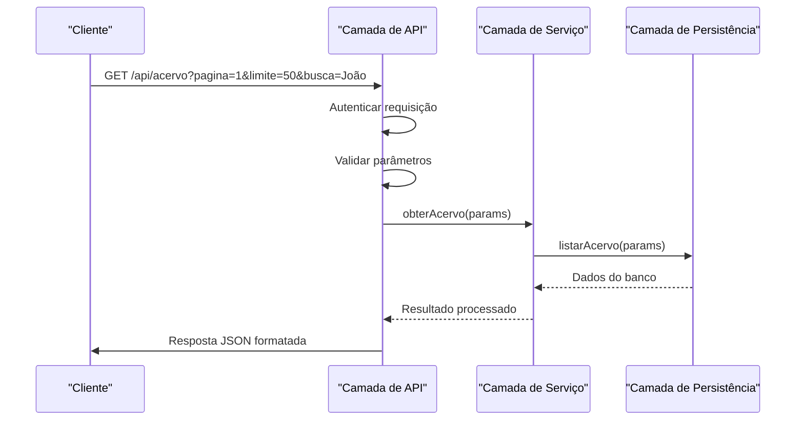
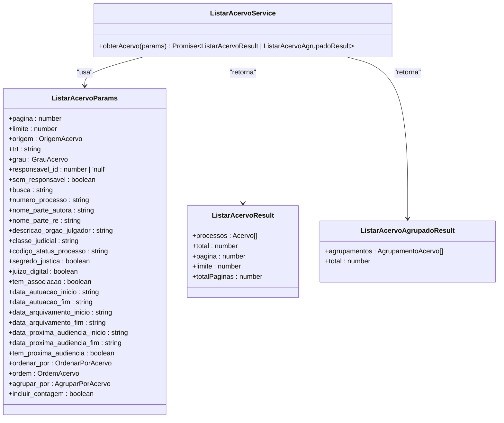
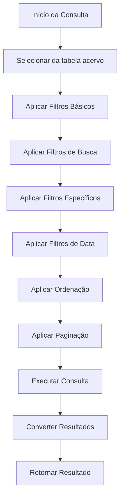

# Responsabilidades por Camada

<cite>
**Arquivos Referenciados neste Documento**   
- [app/api/acervo/route.ts](file://app/api/acervo/route.ts)
- [backend/acervo/services/listar-acervo.service.ts](file://backend/acervo/services/listar-acervo.service.ts)
- [backend/acervo/services/persistence/listar-acervo.service.ts](file://backend/acervo/services/persistence/listar-acervo.service.ts)
- [backend/types/acervo/types.ts](file://backend/types/acervo/types.ts)
</cite>

## Sumário
1. [Introdução](#introdução)
2. [Camada de API](#camada-de-api)
3. [Camada de Serviço](#camada-de-serviço)
4. [Camada de Persistência](#camada-de-persistência)
5. [Tipos e Interfaces](#tipos-e-interfaces)
6. [Boas Práticas e Antipadrões](#boas-práticas-e-antipadrões)
7. [Conclusão](#conclusão)

## Introdução

Este documento detalha as responsabilidades específicas de cada camada no padrão de camadas do sistema Sinesys, com foco no fluxo de listagem de acervo. O padrão de camadas é uma arquitetura fundamental que promove separação de preocupações, facilitando a manutenção, testes e escalabilidade do sistema. Cada camada tem um papel bem definido no processamento de uma requisição HTTP para listar processos do acervo, desde a entrada da requisição até a interação com o banco de dados.

A arquitetura segue um fluxo claro: a **Camada de API** recebe a requisição do cliente, a **Camada de Serviço** processa a lógica de negócio, a **Camada de Persistência** realiza as operações no banco de dados, e as **Interfaces de Tipo** garantem a consistência de dados entre todas as camadas. Este documento analisa cada uma dessas camadas em detalhes, explicando suas responsabilidades, interações e melhores práticas.

**Section sources**
- [app/api/acervo/route.ts](file://app/api/acervo/route.ts#L1-L436)

## Camada de API

A camada de API, representada pelo arquivo `app/api/acervo/route.ts`, atua como a interface entre o cliente e o sistema. Seu papel principal é receber requisições HTTP, validar a entrada, tratar a autenticação e retornar respostas formatadas de acordo com os padrões REST.

### Recebimento de Requisições HTTP

A rota de API implementa o método HTTP GET para listar processos do acervo. Ela é acessível através do endpoint `/api/acervo` e aceita uma variedade de parâmetros de consulta (query parameters) que permitem ao cliente filtrar, paginar, ordenar e agrupar os resultados. Os parâmetros incluem:
- **Paginação**: `pagina` e `limite` para controle de paginação.
- **Filtros**: `origem`, `trt`, `grau`, `responsavel_id` para filtragem por atributos específicos.
- **Busca textual**: `busca` para pesquisa em múltiplos campos como número do processo e nomes das partes.
- **Filtros de data**: `data_autuacao_inicio`, `data_arquivamento_fim`, etc., para filtragem por intervalos de datas.
- **Ordenação**: `ordenar_por` e `ordem` para definir o critério e direção da ordenação.
- **Agrupamento**: `agrupar_por` e `incluir_contagem` para retornar dados agrupados por um campo específico.

### Validação de Entrada

A camada de API realiza validações básicas dos parâmetros de entrada para garantir que os dados recebidos estejam dentro dos limites esperados. Por exemplo, verifica se o número da página é maior ou igual a 1 e se o limite está entre 1 e 100. Essas validações são essenciais para prevenir erros no processamento posterior e garantir uma experiência de usuário consistente.

**Diagram sources**
- [app/api/acervo/route.ts](file://app/api/acervo/route.ts#L312-L436)

### Tratamento de Autenticação

A segurança é uma prioridade na camada de API. Antes de processar qualquer requisição, o sistema chama a função `authenticateRequest` para verificar se o cliente está autenticado. A autenticação pode ser feita através de diferentes mecanismos, como tokens JWT, sessões ou chaves de API de serviço, conforme indicado na documentação Swagger. Se a autenticação falhar, a API retorna imediatamente um erro 401 (Unauthorized), impedindo o acesso a dados sensíveis.

### Retorno de Respostas Formatadas

Após o processamento bem-sucedido, a camada de API formata a resposta em JSON de acordo com o tipo de operação. Para listagens padrão, retorna um objeto com a lista de processos e informações de paginação. Para operações de agrupamento, retorna um objeto com os agrupamentos e contagens. Em caso de erro, retorna uma mensagem de erro com o código de status apropriado (400 para parâmetros inválidos, 500 para erros internos).

**Section sources**
- [app/api/acervo/route.ts](file://app/api/acervo/route.ts#L312-L436)

## Camada de Serviço

A camada de serviço, implementada no arquivo `backend/acervo/services/listar-acervo.service.ts`, é o coração da lógica de negócio do sistema. Ela coordena o fluxo de dados entre a camada de API e a camada de persistência, aplicando regras de domínio e garantindo que as operações sejam executadas de forma consistente.

### Implementação da Lógica de Negócio

A função principal desta camada é `obterAcervo`, que recebe os parâmetros da API e decide qual operação de persistência executar. A lógica de negócio é clara: se o parâmetro `agrupar_por` estiver presente, a camada de serviço chama a função de agrupamento; caso contrário, chama a função de listagem padrão. Esta decisão é uma regra de domínio fundamental que define o comportamento do sistema.

### Aplicação de Regras de Domínio

A camada de serviço é responsável por aplicar regras de domínio que vão além da simples validação de entrada. Por exemplo, ela garante que os parâmetros sejam passados corretamente para a camada de persistência e que o resultado seja do tipo esperado. Além disso, ela atua como um orquestrador, podendo coordenar múltiplos serviços em operações mais complexas (embora neste caso específico a operação seja direta).

### Coordenação entre Serviços

Embora este serviço específico seja focado na listagem de acervo, a arquitetura permite que ele coordene com outros serviços se necessário. Por exemplo, em uma operação futura, ele poderia chamar um serviço de auditoria para registrar a consulta ou um serviço de cache para melhorar o desempenho. A injeção de dependências é feita implicitamente através das importações, garantindo que os serviços sejam reutilizáveis e testáveis.

**Diagram sources**
- [backend/acervo/services/listar-acervo.service.ts](file://backend/acervo/services/listar-acervo.service.ts#L24-L34)

### Validação de Parâmetros

Embora a validação primária ocorra na camada de API, a camada de serviço pode realizar validações adicionais se necessário. No entanto, neste caso, ela confia na validação feita anteriormente e se concentra na lógica de coordenação. Isso segue o princípio de que a validação deve ocorrer o mais cedo possível no fluxo de requisição.

**Section sources**
- [backend/acervo/services/listar-acervo.service.ts](file://backend/acervo/services/listar-acervo.service.ts#L24-L34)

## Camada de Persistência

A camada de persistência, localizada em `backend/acervo/services/persistence/listar-acervo.service.ts`, é responsável pela interação direta com o banco de dados Supabase. Ela traduz as operações de negócio em consultas SQL específicas, aplicando filtros, paginação e ordenação diretamente na fonte de dados.

### Interação com o Banco de Dados Supabase

Esta camada utiliza o cliente de serviço do Supabase para realizar operações no banco de dados. A função `createServiceClient` cria uma conexão com privilégios elevados, permitindo que o serviço acesse dados que podem estar protegidos por políticas de RLS (Row Level Security) para usuários regulares. Isso é essencial para operações administrativas ou de API que precisam de acesso completo.

### Construção de Consultas

A construção de consultas é um dos aspectos mais críticos desta camada. A função `listarAcervo` constrói uma consulta dinâmica com base nos parâmetros recebidos. Ela começa com uma seleção básica da tabela `acervo` e adiciona cláusulas WHERE para cada filtro aplicável. Por exemplo:
- `eq('origem', params.origem)` para filtrar por origem.
- `ilike('numero_processo', %${params.numero_processo}%)` para busca parcial em números de processo.
- `gte('data_autuacao', params.data_autuacao_inicio)` para filtragem por data.

### Aplicação de Filtros e Paginação

Todos os filtros definidos na API são aplicados diretamente na consulta ao banco de dados, o que maximiza a eficiência. A paginação é implementada usando os métodos `range` do Supabase, que traduzem para cláusulas SQL `LIMIT` e `OFFSET`. Além disso, a opção `{ count: 'exact' }` na seleção permite obter o total exato de registros, essencial para a paginação.

**Diagram sources**
- [backend/acervo/services/persistence/listar-acervo.service.ts](file://backend/acervo/services/persistence/listar-acervo.service.ts#L49-L184)

### Agrupamento em Memória

Para operações de agrupamento, a camada de persistência adota uma abordagem híbrida. Primeiro, ela recupera todos os dados filtrados do banco de dados sem paginação. Em seguida, realiza o agrupamento em memória usando estruturas de dados como `Map`. Isso é necessário porque o Supabase não suporta agrupamento com múltiplos níveis de detalhe (como retornar contagens e listas completas) em uma única consulta. Após o agrupamento, os resultados são ordenados por quantidade em ordem decrescente.

**Section sources**
- [backend/acervo/services/persistence/listar-acervo.service.ts](file://backend/acervo/services/persistence/listar-acervo.service.ts#L49-L373)

## Tipos e Interfaces

Os tipos e interfaces definidos em `backend/types/acervo/types.ts` são fundamentais para garantir a consistência de dados entre todas as camadas do sistema. Eles atuam como um contrato que define a estrutura dos dados que fluem entre a API, o serviço e a persistência.

### Garantia de Consistência de Dados

As interfaces como `Acervo`, `ListarAcervoParams`, `ListarAcervoResult` e `ListarAcervoAgrupadoResult` definem com precisão a forma dos objetos de dados. Isso elimina ambiguidades e erros de digitação, pois qualquer desvio dessas definições será detectado pelo compilador TypeScript. Por exemplo, a interface `Acervo` define todos os campos de um processo, incluindo tipos específicos como `OrigemAcervo` e `GrauAcervo`.

### Definição de Parâmetros e Resultados

A interface `ListarAcervoParams` é especialmente importante porque é usada por todas as camadas. A camada de API a utiliza para validar a entrada, a camada de serviço para processar a lógica de negócio, e a camada de persistência para construir as consultas. Da mesma forma, as interfaces de resultado garantem que a resposta seja sempre consistente, independentemente da camada que a gere.

**Section sources**
- [backend/types/acervo/types.ts](file://backend/types/acervo/types.ts#L3-L152)

## Boas Práticas e Antipadrões

### Boas Práticas

1. **Separação de Camadas**: Cada camada tem responsabilidades bem definidas, promovendo coesão e baixo acoplamento.
2. **Validação em Camada**: A validação ocorre na camada de API, o mais cedo possível no fluxo de requisição.
3. **Tipagem Forte**: O uso de TypeScript e interfaces garante consistência de dados e detecção precoce de erros.
4. **Documentação Swagger**: A documentação integrada ajuda desenvolvedores e consumidores da API.
5. **Tratamento de Erros**: Erros são tratados adequadamente em cada camada, com mensagens claras e códigos de status apropriados.

### Antipadrões a Evitar

1. **Lógica de Negócio na Camada de API**: Evite colocar regras de negócio complexas na API; isso deve ser responsabilidade da camada de serviço.
2. **Consulta Direta ao Banco na API**: Nunca realize operações de banco de dados diretamente na camada de API; sempre use a camada de persistência.
3. **Falta de Validação**: Não assuma que os dados de entrada são válidos; sempre valide na entrada do sistema.
4. **Hardcoding de Valores**: Evite valores fixos como limites de paginação; defina constantes ou use configurações.
5. **Ignorar Segurança**: Nunca omita a autenticação e autorização em endpoints que acessam dados sensíveis.

## Conclusão

O padrão de camadas no sistema Sinesys demonstra uma arquitetura bem projetada que separa claramente as responsabilidades entre as diferentes partes do sistema. A camada de API atua como um gateway seguro e bem definido, a camada de serviço encapsula a lógica de negócio, e a camada de persistência gerencia eficientemente as operações de banco de dados. As interfaces de tipo garantem a integridade dos dados em todo o fluxo. Seguir boas práticas e evitar antipadrões é essencial para manter a qualidade, segurança e escalabilidade do sistema.